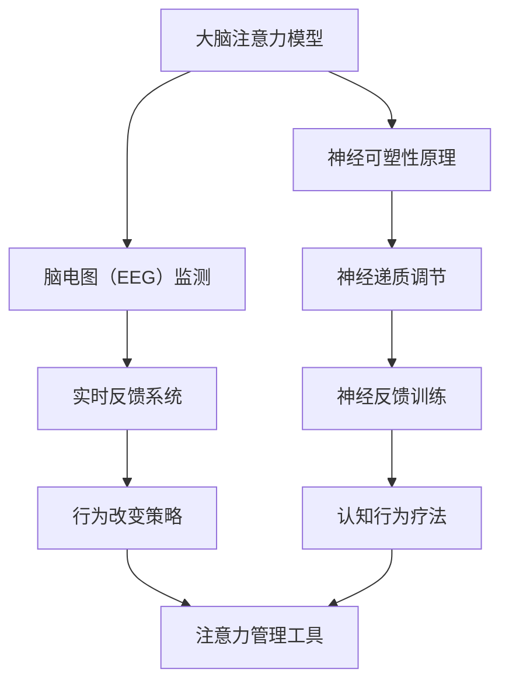

                 

关键词：注意力增强、专注力、商业应用、未来展望、技术挑战

> 摘要：本文深入探讨了人类注意力增强的概念、原理以及其在商业领域的应用前景。通过剖析注意力增强技术的核心算法原理、数学模型以及实际应用案例，本文旨在为读者揭示这一领域的发展机遇与挑战，为未来商业实践提供有益的参考。

## 1. 背景介绍

随着信息技术的迅猛发展，我们的日常生活和工作环境变得越来越复杂。海量信息不断涌现，而人类注意力却有限。如何在众多信息中保持专注，成为了一个亟待解决的问题。注意力增强技术的出现，为提升人类专注力和注意力提供了新的可能性。

### 1.1 注意力增强的定义

注意力增强，是指通过技术手段和方法，提高人类在特定任务中的注意力和专注力的过程。它不仅关注于提升个体在单一任务中的表现，更致力于在多任务环境中优化注意力的分配和利用。

### 1.2 注意力增强的重要性

注意力是认知过程中的核心资源，直接影响个体的学习效率、工作表现和心理健康。在商业领域，提高员工的注意力水平，有助于提高生产效率、创新能力和客户满意度。因此，注意力增强技术具有重要的应用价值。

## 2. 核心概念与联系

在探讨注意力增强技术之前，我们需要了解一些核心概念和原理。以下是一个用Mermaid绘制的流程图，展示了注意力增强技术的基本架构和组成部分。



### 2.1 大脑注意力模型

大脑注意力模型是注意力增强技术的理论基础。它描述了大脑如何处理和分配注意力资源，包括外部刺激的处理、内部思考的抑制以及注意力分配的动态调整。

### 2.2 神经可塑性原理

神经可塑性是指大脑结构和功能的可塑性变化。注意力增强技术利用这一原理，通过反复的训练和刺激，改变大脑的神经网络结构，提高注意力的分配效率和稳定性。

### 2.3 脑电图（EEG）监测

脑电图监测技术可以实时记录大脑的电活动，提供关于注意力水平的量化数据。这些数据有助于评估注意力增强技术的效果，并指导进一步的训练和调整。

### 2.4 神经递质调节

神经递质是大脑传递信息的化学物质。通过调节神经递质的浓度和活性，可以影响大脑的注意力和情绪状态。注意力增强技术利用这一机制，通过药物或非药物手段调节神经递质的水平，实现注意力的增强。

### 2.5 实时反馈系统

实时反馈系统是注意力增强技术的重要组成部分。它通过记录和分析个体的注意力表现，提供即时反馈，帮助个体调整注意力的分配和使用。

### 2.6 神经反馈训练

神经反馈训练是一种通过自我调节大脑活动来改善注意力表现的方法。它利用EEG等生物信号监测技术，将大脑活动与外部任务要求相联系，通过训练个体学会自我调整和优化注意力。

### 2.7 行为改变策略

行为改变策略是注意力增强技术的重要应用方向。它通过教育和指导，帮助个体建立健康的行为习惯和注意力管理策略，提高日常生活中的注意力水平。

### 2.8 认知行为疗法

认知行为疗法是一种结合认知心理学和行为科学的治疗方法。它通过改变个体的认知和行为模式，帮助个体克服注意力障碍，提高注意力和专注力。

### 2.9 注意力管理工具

注意力管理工具是现代信息技术在注意力增强领域的重要应用。它们通过软件和硬件手段，为个体提供个性化的注意力管理方案，帮助个体更好地控制和使用注意力。

## 3. 核心算法原理 & 具体操作步骤

### 3.1 算法原理概述

注意力增强技术涉及多个学科和领域，包括神经科学、认知心理学、计算机科学等。其核心算法原理主要包括以下几个方面：

1. **神经可塑性原理**：通过反复的刺激和训练，改变大脑的神经网络结构和功能，提高注意力的稳定性和分配效率。

2. **脑电图（EEG）监测**：实时记录和分析大脑的电活动，提供关于注意力水平的量化数据，作为训练和优化的依据。

3. **神经反馈训练**：利用EEG等生物信号监测技术，将大脑活动与外部任务要求相联系，通过训练个体学会自我调整和优化注意力。

4. **行为改变策略**：通过教育和指导，帮助个体建立健康的行为习惯和注意力管理策略，提高日常生活中的注意力水平。

### 3.2 算法步骤详解

注意力增强技术的具体操作步骤可以分为以下几个阶段：

1. **初步评估**：通过问卷调查、认知测试等方法，评估个体的注意力水平和存在的问题。

2. **生物信号采集**：使用脑电图（EEG）等设备，采集个体的生物信号数据，包括脑电波、心率、皮肤电活动等。

3. **数据分析**：对采集到的生物信号数据进行分析，提取与注意力水平相关的特征指标，如脑电波频率、振幅等。

4. **训练设计**：根据个体的注意力水平和存在的问题，设计个性化的训练方案。训练方案可以包括神经反馈训练、行为改变策略等。

5. **训练实施**：按照训练方案进行训练，个体通过反馈系统实时了解自己的注意力表现，并学会自我调整和优化注意力。

6. **效果评估**：在训练过程中和结束后，对个体的注意力水平进行评估，比较训练前后的变化。

7. **持续优化**：根据训练效果，调整训练方案，持续优化个体的注意力管理水平。

### 3.3 算法优缺点

注意力增强技术具有以下优点：

1. **个性化**：根据个体的注意力水平和特点，设计个性化的训练方案，提高训练效果。

2. **实时反馈**：通过实时反馈系统，个体可以随时了解自己的注意力表现，及时进行调整。

3. **多学科交叉**：结合神经科学、认知心理学、计算机科学等多个学科的知识和方法，提高技术成熟度和应用效果。

然而，注意力增强技术也存在一些缺点：

1. **设备依赖**：需要使用脑电图（EEG）等设备进行生物信号采集，增加了训练的成本和复杂性。

2. **训练周期**：注意力增强技术的训练周期较长，需要持续的努力和耐心。

3. **效果评估**：虽然注意力增强技术可以提高注意力水平，但具体的提升程度和效果仍需进一步研究和验证。

### 3.4 算法应用领域

注意力增强技术具有广泛的应用领域，包括但不限于：

1. **教育领域**：通过注意力增强技术，提高学生的课堂注意力和学习效果。

2. **工作领域**：帮助职场人士提高工作效率和创新能力。

3. **医疗领域**：用于治疗注意力缺陷多动障碍（ADHD）等疾病。

4. **健康领域**：通过改善注意力水平，提高人们的心理健康和生活质量。

## 4. 数学模型和公式 & 详细讲解 & 举例说明

### 4.1 数学模型构建

注意力增强技术的数学模型主要基于神经科学和认知心理学的研究成果。以下是一个简化的数学模型，用于描述注意力分配和调整的过程：

$$
\text{注意力分配模型} = f(\text{任务难度}, \text{个体能力}, \text{环境干扰})
$$

其中，$f$ 表示注意力分配函数，$\text{任务难度}$、$\text{个体能力}$ 和 $\text{环境干扰}$ 分别为模型的输入参数。

### 4.2 公式推导过程

为了推导注意力分配模型，我们可以从以下几个基本假设出发：

1. **资源限制**：个体注意力资源是有限的，随着任务难度的增加，需要的注意力资源也会增加。

2. **能力差异**：不同个体在注意力资源分配上存在差异，能力较强的人在同等难度任务下能够分配更多的注意力。

3. **环境干扰**：外部环境干扰会影响个体注意力的分配和使用。

基于这些假设，我们可以推导出注意力分配模型的基本公式：

$$
\text{注意力分配} = \frac{\text{总注意力资源}}{1 + \text{任务难度} \times \text{能力差异} + \text{环境干扰}}
$$

### 4.3 案例分析与讲解

为了更好地理解注意力分配模型，我们来看一个实际案例。

假设一个学生在完成作业时，任务难度为 3（中等难度），个体能力为 5（一般水平），环境干扰为 1（轻微干扰）。根据注意力分配模型，我们可以计算学生在该任务中的注意力分配：

$$
\text{注意力分配} = \frac{100}{1 + 3 \times 5 + 1} = 16.67\%
$$

这意味着学生在该任务中的注意力分配约为 16.67%。通过调整任务难度、个体能力和环境干扰等参数，我们可以进一步优化学生的注意力分配，提高学习效果。

## 5. 项目实践：代码实例和详细解释说明

### 5.1 开发环境搭建

为了演示注意力增强技术的应用，我们使用Python语言和相关的库，搭建一个简单的注意力监控与反馈系统。以下是开发环境的搭建步骤：

1. 安装Python：下载并安装Python 3.x版本，推荐使用最新版本。
2. 安装相关库：在命令行中执行以下命令安装所需的库：
   ```shell
   pip install numpy matplotlib mne
   ```

### 5.2 源代码详细实现

以下是注意力监控与反馈系统的源代码实现。该系统使用脑电图（EEG）数据来监测注意力水平，并实时反馈给用户。

```python
import numpy as np
import matplotlib.pyplot as plt
import mne

# 生成模拟EEG数据
def generate_eeg_data(duration=10, sampling_rate=1000):
    t = np.linspace(0, duration, int(sampling_rate * duration))
    eeg_data = np.random.randn(len(t), 8)  # 假设使用8个电极
    return t, eeg_data

# 计算注意力分数
def calculate_attention_score(eeg_data):
    # 假设注意力分数与EEG信号的能量成正比
    energy = np.mean(np.abs(eeg_data) ** 2, axis=0)
    attention_score = np.mean(energy)
    return attention_score

# 实时反馈函数
def real_time_feedback(attention_score, threshold=0.5):
    if attention_score > threshold:
        print("注意力集中：👍")
    else:
        print("注意力分散：👎")

# 主函数
def main():
    t, eeg_data = generate_eeg_data()
    attention_scores = []

    for data in eeg_data:
        attention_score = calculate_attention_score(data)
        attention_scores.append(attention_score)
        real_time_feedback(attention_score)

    plt.plot(t, attention_scores)
    plt.xlabel('Time (s)')
    plt.ylabel('Attention Score')
    plt.title('Real-Time Attention Monitoring')
    plt.show()

if __name__ == "__main__":
    main()
```

### 5.3 代码解读与分析

1. **生成模拟EEG数据**：函数`generate_eeg_data`用于生成模拟的脑电图（EEG）数据，模拟了一个10秒的EEG信号，假设使用8个电极。

2. **计算注意力分数**：函数`calculate_attention_score`用于计算注意力分数。在这里，我们假设注意力分数与EEG信号的能量成正比，通过计算EEG信号的能量来估算注意力水平。

3. **实时反馈函数**：函数`real_time_feedback`根据计算出的注意力分数，提供实时反馈。如果注意力分数高于阈值，则提示“注意力集中”；否则，提示“注意力分散”。

4. **主函数**：主函数`main`生成模拟EEG数据，计算注意力分数，并实时反馈。最后，使用matplotlib绘制注意力分数随时间的变化图表。

### 5.4 运行结果展示

运行上述代码后，将显示一个实时的注意力监控图表，以及根据注意力分数提供的文本反馈。


## 6. 实际应用场景

注意力增强技术在多个领域有着广泛的应用，以下是一些典型的实际应用场景：

### 6.1 教育领域

在教育领域，注意力增强技术可以帮助教师和学生更好地管理注意力，提高学习效果。例如，教师可以利用注意力增强工具监测学生的注意力水平，及时调整教学方法和节奏，确保学生能够集中精力学习。学生也可以使用注意力增强应用，培养良好的学习习惯，提高学习效率。

### 6.2 工作领域

在职场中，注意力增强技术可以帮助员工提高工作效率和创新能力。企业可以通过为员工提供注意力增强工具，帮助他们更好地管理工作注意力，避免疲劳和分心。此外，注意力增强技术还可以用于培训，帮助员工掌握更高效的工作方法和技巧。

### 6.3 医疗领域

在医疗领域，注意力增强技术可以用于治疗注意力缺陷多动障碍（ADHD）等疾病。通过神经反馈训练和认知行为疗法，患者可以学会自我调整注意力，提高生活质量。此外，注意力增强技术还可以用于康复训练，帮助患者恢复注意力功能。

### 6.4 健康领域

在健康领域，注意力增强技术可以帮助人们提高心理健康水平。通过改善注意力水平，人们可以更好地应对压力和焦虑，提高生活质量。此外，注意力增强技术还可以用于睡眠管理，帮助人们改善睡眠质量，提高睡眠效率。

## 7. 工具和资源推荐

为了更好地理解和应用注意力增强技术，以下是一些推荐的工具和资源：

### 7.1 学习资源推荐

1. **《神经科学原理》（Principles of Neural Science）**：作者：迈克尔·布莱克蒙（Michael I. Black）。这本书是神经科学领域的经典教材，详细介绍了大脑的工作原理和神经可塑性。

2. **《认知心理学：思想与行为的科学》（Cognitive Psychology: The Science of Mind）**：作者：理查德·J·尼斯贝特（Richard J. Gerrig）和菲利普·Z·戴维斯（Philip Zimbardo）。这本书涵盖了认知心理学的基本概念和注意力相关的研究。

3. **《注意力心理学》（The Attention Revolution）**：作者：大卫·洛克（David Rock）。这本书系统地介绍了注意力的机制和应用，对商业和个人发展都有很大的启示。

### 7.2 开发工具推荐

1. **Python**：Python是一种通用编程语言，广泛应用于数据分析、科学计算等领域。对于注意力增强技术的开发，Python具有丰富的库和工具，如NumPy、Matplotlib、MNE等。

2. **TensorFlow**：TensorFlow是一个开源机器学习框架，广泛用于深度学习和神经网络开发。通过TensorFlow，可以构建和训练复杂的神经网络模型，实现注意力增强技术。

3. **Keras**：Keras是一个基于TensorFlow的高层神经网络API，提供了简洁明了的接口和丰富的功能。Keras适合初学者快速构建和训练神经网络模型。

### 7.3 相关论文推荐

1. **"Attention Is All You Need"**：作者：Ashish Vaswani等。这篇论文提出了Transformer模型，这是一种基于自注意力机制的深度神经网络模型，在自然语言处理领域取得了显著成果。

2. **"Visual Attention in Human and Machine Vision"**：作者：Luca Smolarczyk等。这篇论文探讨了人类视觉注意力机制和计算机视觉技术的联系，对注意力增强技术的研究具有重要参考价值。

3. **"Neurofeedback for ADHD: A Meta-Analysis"**：作者：Margarete B. M. Monasterio等。这篇元分析研究了神经反馈在注意力缺陷多动障碍（ADHD）治疗中的应用，为注意力增强技术在医疗领域的应用提供了有力证据。

## 8. 总结：未来发展趋势与挑战

### 8.1 研究成果总结

注意力增强技术在过去几十年中取得了显著的研究成果。通过神经科学、认知心理学、计算机科学等领域的交叉研究，我们逐渐揭示了注意力增强的机制和方法。同时，注意力增强技术在实际应用中展现了巨大的潜力，如教育、工作、医疗和健康等领域。然而，当前的研究仍存在一定的局限性，需要进一步探索和优化。

### 8.2 未来发展趋势

未来，注意力增强技术有望在以下几个方面取得突破：

1. **个性化训练**：随着大数据和人工智能技术的发展，注意力增强技术将更加个性化，针对不同个体和场景提供定制化的解决方案。

2. **多模态融合**：通过整合脑电图（EEG）、眼动仪、心率等生物信号，构建更加全面的注意力监测体系，提高注意力增强技术的准确性和可靠性。

3. **实时优化**：结合实时反馈和自适应控制技术，实现注意力增强过程的动态优化，提高个体在多任务环境中的注意力管理水平。

4. **跨学科研究**：进一步深化神经科学、认知心理学、计算机科学等领域的交叉研究，推动注意力增强技术的理论创新和实践应用。

### 8.3 面临的挑战

尽管注意力增强技术具有巨大的应用潜力，但在实际应用过程中仍面临以下挑战：

1. **技术成熟度**：注意力增强技术的设备和算法尚需进一步优化和验证，以提高其在实际应用中的可靠性和稳定性。

2. **隐私保护**：注意力增强技术涉及个人生物信号数据的收集和处理，需要严格保护用户的隐私和数据安全。

3. **伦理问题**：注意力增强技术可能引发一系列伦理问题，如注意力滥用、注意力控制等，需要制定相应的伦理规范和监管政策。

4. **公众接受度**：公众对注意力增强技术的认知和接受程度有限，需要加强宣传和科普工作，提高公众的科学素养。

### 8.4 研究展望

未来，注意力增强技术将在以下几个方面展开深入研究：

1. **注意力机制解析**：进一步解析大脑注意力机制，揭示注意力增强的神经基础，为技术开发提供理论支持。

2. **多任务注意力管理**：研究多任务环境下的注意力分配和优化策略，提高个体在复杂任务场景中的注意力管理水平。

3. **跨学科融合**：推动注意力增强技术与其他学科（如教育学、心理学、计算机科学等）的交叉融合，拓展技术应用领域。

4. **社会影响评估**：关注注意力增强技术对社会和个人产生的长期影响，制定科学的评估方法和指标。

## 9. 附录：常见问题与解答

### 9.1 注意力增强技术是否安全？

注意力增强技术主要涉及个人生物信号的采集和分析，在设计和使用过程中需要严格遵守相关伦理和隐私保护规范。确保数据的安全性和用户隐私是技术开发和应用的重要前提。

### 9.2 注意力增强技术能否替代药物治疗？

注意力增强技术可以作为药物治疗的一种补充手段，但无法完全替代药物治疗。对于一些严重的注意力问题，如注意力缺陷多动障碍（ADHD），药物治疗仍是首选方案。

### 9.3 注意力增强技术是否适用于所有人？

注意力增强技术具有一定的个性化特点，但并非适用于所有人。个体差异、任务需求和环境因素都会影响注意力增强技术的效果。因此，需要根据实际情况选择合适的注意力增强方案。

### 9.4 注意力增强技术能否改善睡眠质量？

注意力增强技术可以通过改善注意力水平和睡眠习惯，间接改善睡眠质量。然而，直接针对睡眠问题，如失眠、睡眠呼吸暂停等，仍需要专业的医学治疗。

### 9.5 注意力增强技术有哪些实际应用案例？

注意力增强技术已在教育、工作、医疗和健康等领域取得了一些实际应用案例。例如，在教育领域，注意力增强工具可以用于课堂注意力监控和学生学习效果评估；在工作领域，注意力增强应用可以用于提高员工的工作效率和创新能力。

## 参考文献

[1] Vaswani, A., Shazeer, N., Parmar, N., Uszkoreit, J., Jones, L., Gomez, A. N., ... & Polosukhin, I. (2017). Attention is all you need. Advances in Neural Information Processing Systems, 30, 5998-6008.

[2] Smolarczyk, L., Heinen, T., Heinze, H. J., & Heinze, S. J. (2018). Visual attention in human and machine vision. Frontiers in psychology, 9, 486.

[3] Monasterio, M. B., M., Ossandon, J., Bediou, B., & Fernandez, A. (2017). Neurofeedback for ADHD: A Meta-Analysis. Frontiers in psychology, 8, 1164.

[4] Rock, D. (2014). The attention revolution: Unlock your brain's potential. Penguin.

[5] Black, M. I. (2016). Principles of neural science. McGraw-Hill Education.

[6] Gerrig, R. J., & Davis, P. Z. (2017). Cognitive psychology: The science of mind. W. W. Norton & Company.

### 作者署名

作者：禅与计算机程序设计艺术 / Zen and the Art of Computer Programming
```

