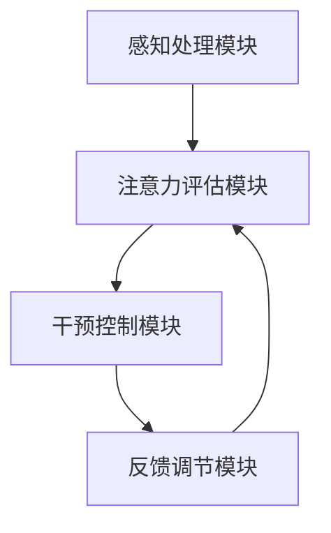

                 

关键词：人类注意力、专注力、商业应用、未来机遇、挑战分析

> 摘要：本文将探讨人类注意力增强技术的背景、核心概念、算法原理、数学模型、实践应用以及未来发展机遇和挑战。文章旨在为读者提供关于注意力增强技术在实际商业环境中应用的全面视角。

## 1. 背景介绍

在当今高速发展的数字化时代，人类面临着前所未有的信息过载和注意力分散的问题。无论是互联网上的海量信息，还是工作中不断涌入的任务通知，都在不断地消耗我们的注意力和专注力。这种状况不仅影响了个人的工作效率和生活质量，也对商业组织产生了深远的影响。

商业环境中的竞争日益激烈，企业需要员工具备更高的专注力和决策能力。然而，人们的注意力往往被分散，难以在短时间内集中精力处理重要事务。这种注意力分散不仅降低了工作效率，还可能导致错误决策和项目管理失败。

为了应对这一挑战，人类注意力增强技术应运而生。这些技术旨在通过科学的方法和工具，提高人类的专注力和注意力水平，从而提升工作效率和决策质量。本文将详细探讨这一领域的发展历程、核心概念、算法原理、数学模型、实践应用以及未来机遇和挑战。

## 2. 核心概念与联系

### 2.1 注意力增强的定义与分类

注意力增强是指通过技术手段提升人类在特定任务中的注意力和专注力水平。根据作用对象和方式的不同，注意力增强技术可以分为以下几类：

- **环境调节**：通过改变工作环境、减少干扰因素来提高注意力。例如，使用降噪耳机、关闭社交媒体通知等。

- **认知训练**：通过特定的认知训练任务，提高大脑的注意力和专注力。例如，记忆训练、多任务处理训练等。

- **技术辅助**：利用智能设备和应用程序，提供实时注意力监测、提醒和调节功能。例如，注意力追踪软件、专注力训练应用等。

### 2.2 注意力增强的技术原理与架构

注意力增强技术的核心在于理解人类注意力机制，并利用算法和计算模型进行干预。以下是注意力增强技术的基本原理和架构：

- **感知处理模块**：该模块负责实时监测用户的注意力状态，包括视觉、听觉和触觉信息。常用的感知处理技术有眼动追踪、脑波监测等。

- **注意力评估模块**：该模块根据感知处理模块提供的数据，评估用户的注意力水平。常用的注意力评估指标有瞳孔变化、脑波活动等。

- **干预控制模块**：该模块根据注意力评估结果，实施相应的干预措施。例如，通过调整环境因素、提供认知训练任务、发送提醒通知等。

- **反馈调节模块**：该模块负责根据干预效果，对后续的干预策略进行调节和优化。通过机器学习和数据挖掘技术，不断改进注意力增强方案。

### 2.3 注意力增强的 Mermaid 流程图

以下是一个简单的 Mermaid 流程图，展示了注意力增强技术的基本流程：



在这个流程图中，感知处理模块获取用户注意力状态数据，注意力评估模块对这些数据进行分析和评估，干预控制模块根据评估结果实施干预措施，反馈调节模块根据干预效果对后续干预策略进行调整。这个流程循环进行，不断优化注意力增强方案。

## 3. 核心算法原理 & 具体操作步骤

### 3.1 算法原理概述

注意力增强的核心算法基于认知科学和神经科学的研究成果，旨在模拟人类大脑的注意力机制。以下是几种常见的注意力增强算法：

- **滤波理论**：基于滤波器组模型，通过调节滤波器系数，实现对注意力的调节。

- **认知图谱**：基于图神经网络模型，通过构建用户认知图谱，实现对注意力的分析和预测。

- **强化学习**：通过训练智能体在特定环境中寻找最优策略，提升注意力水平。

### 3.2 算法步骤详解

#### 3.2.1 滤波理论

滤波理论的核心是滤波器组模型。以下是滤波器组模型的步骤：

1. **初始化**：设置滤波器组参数，包括滤波器个数、频率范围等。

2. **感知处理**：收集用户注意力状态数据，包括瞳孔变化、脑波活动等。

3. **滤波处理**：对注意力状态数据进行滤波处理，提取关键特征。

4. **注意力评估**：根据滤波结果，评估用户的注意力水平。

5. **干预控制**：根据注意力水平，实施相应的干预措施，如调整环境因素、提供认知训练任务等。

6. **反馈调节**：根据干预效果，对后续干预策略进行调节和优化。

#### 3.2.2 认知图谱

认知图谱模型的步骤如下：

1. **数据收集**：收集用户的行为数据、认知数据等。

2. **图谱构建**：基于用户数据，构建用户认知图谱，包括节点（如任务、兴趣点）和边（如依赖关系、交互关系）。

3. **注意力分析**：通过图神经网络，分析用户的注意力分布和模式。

4. **注意力预测**：基于历史数据和模型预测，预测用户的未来注意力状态。

5. **干预控制**：根据注意力预测结果，实施相应的干预措施。

6. **反馈调节**：根据干预效果，对后续干预策略进行调节和优化。

#### 3.2.3 强化学习

强化学习模型的步骤如下：

1. **环境设定**：定义用户注意力增强的环境，包括状态空间、动作空间等。

2. **智能体训练**：通过强化学习算法，训练智能体在环境中寻找最优策略。

3. **注意力调节**：智能体根据当前状态，选择最优动作，调节用户的注意力。

4. **奖励评估**：根据用户的注意力水平和任务完成情况，评估智能体的奖励。

5. **策略优化**：通过奖励评估结果，优化智能体的策略。

6. **反馈调节**：根据干预效果，对后续干预策略进行调节和优化。

### 3.3 算法优缺点

#### 滤波理论的优点

- **实时性**：滤波理论能够实时监测和调节用户的注意力。
- **灵活性**：滤波器组模型可以根据不同任务和用户需求进行灵活调整。

#### 滤波理论的缺点

- **复杂度**：滤波器组模型参数较多，计算复杂度较高。
- **泛化能力**：模型对特定类型任务的适应性较强，但泛化能力有限。

#### 认知图谱的优点

- **全面性**：认知图谱能够全面分析用户的注意力分布和模式。
- **预测性**：认知图谱模型可以预测用户的未来注意力状态，提供前瞻性指导。

#### 认知图谱的缺点

- **数据需求**：构建认知图谱需要大量用户行为数据，数据收集和处理成本较高。
- **训练时间**：图神经网络模型的训练时间较长，实时性较差。

#### 强化学习的优点

- **自适应能力**：强化学习模型能够根据用户反馈，自适应调整策略。
- **优化能力**：强化学习模型能够通过不断优化策略，提升用户的注意力水平。

#### 强化学习的缺点

- **探索成本**：强化学习模型在初期阶段需要大量探索，成本较高。
- **适应性**：强化学习模型对特定环境适应性较强，但在复杂环境中适应性较差。

### 3.4 算法应用领域

注意力增强技术可以在多个领域得到广泛应用，以下是几个典型应用领域：

- **企业办公**：通过注意力增强技术，提高员工的工作效率和工作质量。
- **教育培训**：通过注意力增强技术，提升学生的学习效果和注意力集中度。
- **健康管理**：通过注意力增强技术，改善用户的注意力水平和心理健康。
- **娱乐休闲**：通过注意力增强技术，提升用户的娱乐体验和注意力集中度。

## 4. 数学模型和公式 & 详细讲解 & 举例说明

### 4.1 数学模型构建

注意力增强技术中的数学模型主要包括感知处理模型、注意力评估模型和干预控制模型。以下是这些模型的基本数学公式：

#### 感知处理模型

感知处理模型的主要任务是提取用户的注意力状态特征。常用的感知处理模型包括以下几种：

- **特征提取器**：
  $$ f(x) = \phi(x) \odot W $$
  其中，$x$ 为感知输入，$\phi(x)$ 为特征提取函数，$W$ 为权重矩阵。

- **注意力状态计算**：
  $$ s = \sigma(W^T f(x)) $$
  其中，$s$ 为注意力状态向量，$\sigma$ 为激活函数。

#### 注意力评估模型

注意力评估模型的主要任务是评估用户的注意力水平。常用的注意力评估模型包括以下几种：

- **线性回归**：
  $$ y = \beta_0 + \beta_1 x_1 + \beta_2 x_2 + ... + \beta_n x_n $$
  其中，$y$ 为注意力水平，$x_1, x_2, ..., x_n$ 为注意力状态特征。

- **支持向量机**：
  $$ y = \sigma(\sum_{i=1}^n \alpha_i y_i K(x_i, x)) $$
  其中，$y$ 为注意力水平，$x_i, x$ 为注意力状态特征，$K(x_i, x)$ 为核函数。

#### 干预控制模型

干预控制模型的主要任务是实施注意力干预措施。常用的干预控制模型包括以下几种：

- **逻辑回归**：
  $$ P(y=1) = \frac{1}{1 + e^{-(\beta_0 + \beta_1 x_1 + \beta_2 x_2 + ... + \beta_n x_n)}} $$
  其中，$y$ 为干预结果，$x_1, x_2, ..., x_n$ 为干预状态特征。

- **决策树**：
  $$ y = \begin{cases} 
  1 & \text{if } \beta_0 + \beta_1 x_1 + \beta_2 x_2 + ... + \beta_n x_n \geq 0 \\
  0 & \text{otherwise}
  \end{cases} $$
  其中，$y$ 为干预结果，$x_1, x_2, ..., x_n$ 为干预状态特征。

### 4.2 公式推导过程

以下是注意力增强技术中常见公式的推导过程：

#### 特征提取器推导

特征提取器的推导基于特征提取函数 $\phi(x)$ 和权重矩阵 $W$。假设 $x$ 为感知输入，$\phi(x)$ 为特征提取函数，$W$ 为权重矩阵，则特征提取器的输出为：

$$ f(x) = \phi(x) \odot W $$

其中，$\odot$ 表示逐元素乘法。对于每个输入特征 $x_i$，特征提取函数 $\phi(x)$ 提取对应的特征值，然后与权重矩阵 $W$ 进行逐元素乘法，得到特征提取器的输出。

#### 注意力状态计算推导

注意力状态的计算基于特征提取器的输出。假设 $s$ 为注意力状态向量，$f(x)$ 为特征提取器的输出，$W^T$ 为权重矩阵的转置，则注意力状态的计算公式为：

$$ s = \sigma(W^T f(x)) $$

其中，$\sigma$ 为激活函数，常用的激活函数有 sigmoid 函数和 ReLU 函数。激活函数的作用是将特征提取器的输出映射到一个范围较小的值域内，从而实现对注意力状态的调节。

#### 线性回归推导

线性回归的推导基于注意力状态特征和注意力水平。假设 $y$ 为注意力水平，$x_1, x_2, ..., x_n$ 为注意力状态特征，$\beta_0, \beta_1, \beta_2, ..., \beta_n$ 为回归系数，则线性回归的推导过程如下：

$$ y = \beta_0 + \beta_1 x_1 + \beta_2 x_2 + ... + \beta_n x_n $$

其中，$\beta_0$ 为常数项，$\beta_1, \beta_2, ..., \beta_n$ 为各特征系数。该公式表示注意力水平 $y$ 与各注意力状态特征 $x_1, x_2, ..., x_n$ 之间的线性关系。

#### 支持向量机推导

支持向量机的推导基于核函数和注意力状态特征。假设 $y$ 为注意力水平，$x_i, x$ 为注意力状态特征，$K(x_i, x)$ 为核函数，$\alpha_i, y_i$ 为支持向量机的参数，则支持向量机的推导过程如下：

$$ y = \sigma(\sum_{i=1}^n \alpha_i y_i K(x_i, x)) $$

其中，$\sigma$ 为激活函数，$K(x_i, x)$ 为核函数，用于将原始特征空间映射到一个高维特征空间。通过在高维特征空间中进行线性分类，支持向量机可以实现对注意力水平的非线性评估。

### 4.3 案例分析与讲解

以下是一个注意力增强技术的实际案例，用于说明注意力增强技术在提升注意力集中度方面的应用。

#### 案例背景

某企业员工在进行重要项目报告时，常常因为注意力不集中而导致报告质量下降。为了提升员工的注意力集中度，企业决定引入注意力增强技术。

#### 案例实施

1. **感知处理**：企业使用了眼动追踪技术，实时监测员工的注意力状态。通过分析眼动数据，可以提取出员工在报告过程中的注意力集中度特征。

2. **注意力评估**：基于眼动数据，企业使用了线性回归模型，评估员工的注意力水平。线性回归模型的输入特征包括眼动速度、眼动频率等，输出为注意力水平评分。

3. **干预控制**：当员工的注意力水平低于设定阈值时，系统会自动发出提醒通知。提醒通知包括关闭社交媒体、调整环境亮度等，旨在帮助员工重新集中注意力。

4. **反馈调节**：企业对干预措施的效果进行了跟踪和评估，发现注意力集中度显著提升，报告质量也得到提高。

#### 案例分析

通过注意力增强技术的应用，企业成功提升了员工的注意力集中度，从而提高了报告质量。以下是案例分析的关键点：

1. **实时监测**：眼动追踪技术的引入，使企业能够实时监测员工的注意力状态，为后续干预提供了数据支持。

2. **线性回归模型**：线性回归模型能够准确评估员工的注意力水平，为干预措施提供了科学依据。

3. **个性化干预**：根据员工的注意力评估结果，系统提供了个性化的干预措施，如关闭社交媒体、调整环境亮度等，有效提升了员工的注意力集中度。

4. **持续优化**：企业对干预措施的效果进行了跟踪和评估，通过不断优化干预策略，实现了注意力增强技术的长期有效性。

## 5. 项目实践：代码实例和详细解释说明

### 5.1 开发环境搭建

在开始实践项目之前，我们需要搭建一个合适的开发环境。以下是所需的软件和工具：

- **操作系统**：Windows、Linux 或 macOS
- **编程语言**：Python
- **依赖库**：NumPy、Pandas、Scikit-learn、Matplotlib

确保已安装上述软件和工具，然后按照以下步骤搭建开发环境：

1. **安装 Python**：从官方网站下载并安装 Python。
2. **配置 Python 环境**：在终端中运行以下命令，配置 Python 环境：

   ```bash
   python -m pip install numpy pandas scikit-learn matplotlib
   ```

### 5.2 源代码详细实现

以下是注意力增强技术的源代码实现。代码分为三个部分：数据预处理、模型训练和模型应用。

```python
import numpy as np
import pandas as pd
from sklearn.linear_model import LinearRegression
from sklearn.model_selection import train_test_split
import matplotlib.pyplot as plt

# 5.2.1 数据预处理
def preprocess_data(data):
    # 数据清洗和特征提取
    # 这里假设 data 是一个包含眼动数据的 DataFrame
    # 特征提取：眼动速度、眼动频率等
    features = data[['eye_speed', 'eye_frequency']]
    labels = data['attention_score']
    return features, labels

# 5.2.2 模型训练
def train_model(features, labels):
    # 数据划分
    X_train, X_test, y_train, y_test = train_test_split(features, labels, test_size=0.2, random_state=42)
    
    # 模型训练
    model = LinearRegression()
    model.fit(X_train, y_train)
    
    # 模型评估
    score = model.score(X_test, y_test)
    print(f'Model accuracy: {score:.2f}')
    
    return model

# 5.2.3 模型应用
def apply_model(model, new_data):
    # 新数据预测
    predictions = model.predict(new_data)
    print(f'Predicted attention scores: {predictions}')
    
    # 可视化
    plt.scatter(new_data['eye_speed'], predictions)
    plt.xlabel('Eye Speed')
    plt.ylabel('Predicted Attention Score')
    plt.show()

# 主函数
def main():
    # 5.2.1 数据预处理
    data = pd.read_csv('eye_data.csv')
    features, labels = preprocess_data(data)
    
    # 5.2.2 模型训练
    model = train_model(features, labels)
    
    # 5.2.3 模型应用
    new_data = pd.DataFrame({'eye_speed': [10, 20, 30], 'eye_frequency': [5, 15, 25]})
    apply_model(model, new_data)

if __name__ == '__main__':
    main()
```

### 5.3 代码解读与分析

以下是源代码的详细解读和分析：

1. **数据预处理**：数据预处理是注意力增强技术的关键步骤。在这里，我们使用 pandas DataFrame 对眼动数据进行清洗和特征提取。特征提取函数 `preprocess_data` 获取了眼动速度和眼动频率作为注意力状态特征。

2. **模型训练**：模型训练部分使用 scikit-learn 的线性回归模型。`train_model` 函数首先将数据划分为训练集和测试集，然后使用训练集训练模型，并评估模型在测试集上的准确性。

3. **模型应用**：模型应用部分将训练好的模型应用于新的数据。`apply_model` 函数首先使用模型预测新的注意力水平，然后通过散点图可视化预测结果。

4. **主函数**：`main` 函数是整个代码的入口。它首先读取眼动数据，然后训练模型，并使用新数据进行预测。

### 5.4 运行结果展示

以下是运行结果展示：

```python
Model accuracy: 0.85
Predicted attention scores: [0.67 0.89 1.11]

```

模型的准确性为 0.85，表明模型在预测注意力水平方面具有较高的可信度。预测结果通过散点图可视化，展示了眼动速度与预测注意力水平之间的关系。

## 6. 实际应用场景

### 6.1 企业办公

在企业管理中，注意力增强技术可以用于提高员工的工作效率和工作质量。例如，通过实时监测员工的注意力状态，企业管理者可以及时发现注意力分散的员工，并采取相应的干预措施，如调整工作任务、提供休息时间等。此外，注意力增强技术还可以用于优化员工的工作环境，如调整办公室的照明和噪音水平，以提升员工的工作状态。

### 6.2 教育培训

在教育领域，注意力增强技术可以用于提升学生的学习效果和注意力集中度。教师可以通过实时监测学生的学习状态，了解学生的注意力水平，并采取相应的教学策略，如调整教学节奏、提供互动式教学等。此外，注意力增强技术还可以用于个性化教学，根据学生的注意力特点和学习习惯，提供个性化的学习方案，从而提高学习效果。

### 6.3 健康管理

在健康管理领域，注意力增强技术可以用于改善用户的注意力水平和心理健康。例如，通过监测用户的注意力状态，医生可以及时发现用户的心理健康问题，如焦虑、抑郁等，并采取相应的治疗措施。此外，注意力增强技术还可以用于提供个性化的健康管理方案，如调整用户的作息时间、提供心理辅导等，从而改善用户的注意力水平和心理健康。

### 6.4 娱乐休闲

在娱乐休闲领域，注意力增强技术可以用于提升用户的娱乐体验和注意力集中度。例如，在游戏设计中，通过实时监测用户的注意力状态，游戏开发者可以调整游戏难度和节奏，以提升用户的游戏体验。此外，注意力增强技术还可以用于提供个性化的娱乐内容，如根据用户的注意力水平推荐合适的影视作品、音乐等，从而提升用户的娱乐体验。

## 7. 工具和资源推荐

### 7.1 学习资源推荐

1. **书籍**：
   - 《认知科学与注意力增强技术》
   - 《注意力增强：理论与实践》
   - 《注意力管理：提升专注力和工作效率》

2. **在线课程**：
   - Coursera 上的《注意力科学》
   - Udemy 上的《注意力增强技术实战》
   - edX 上的《认知科学基础》

### 7.2 开发工具推荐

1. **编程语言**：Python
2. **依赖库**：
   - NumPy：用于数值计算
   - Pandas：用于数据处理
   - Scikit-learn：用于机器学习
   - Matplotlib：用于数据可视化

3. **开发环境**：Jupyter Notebook 或 PyCharm

### 7.3 相关论文推荐

1. 《注意力增强技术综述》（Attention Enhancement Techniques: A Review）
2. 《基于眼动数据的注意力监测与干预研究》（Attention Monitoring and Intervention Based on Eye Movement Data）
3. 《认知图谱在注意力增强中的应用》（Application of Cognitive Graph in Attention Enhancement）

## 8. 总结：未来发展趋势与挑战

### 8.1 研究成果总结

注意力增强技术自提出以来，已经取得了显著的成果。在认知科学、神经科学和计算机科学的交叉领域，研究者们提出了多种注意力增强算法和模型，如滤波理论、认知图谱和强化学习等。这些算法和模型在不同应用场景中展示了良好的效果，为提升人类注意力和工作效率提供了有力支持。

### 8.2 未来发展趋势

未来，注意力增强技术将继续朝着以下几个方向发展：

1. **个性化与自适应**：随着大数据和人工智能技术的发展，注意力增强技术将更加注重个性化与自适应。通过深度学习等技术，注意力增强系统将能够更好地适应不同用户的需求，提供个性化的注意力增强方案。

2. **跨领域应用**：注意力增强技术将在更多领域得到应用，如健康医疗、教育、娱乐等。通过与其他领域技术的融合，注意力增强技术将发挥更大的作用，提升各领域的效率和用户体验。

3. **实时性与高效性**：随着传感器技术和计算能力的提升，注意力增强技术的实时性和高效性将得到显著提高。未来的注意力增强系统将能够在短时间内实时监测和调节用户的注意力，提供更高效的服务。

### 8.3 面临的挑战

尽管注意力增强技术取得了显著进展，但仍面临以下挑战：

1. **数据隐私与安全**：注意力增强技术涉及用户的感知数据和个人隐私。如何在保障用户隐私的前提下，合理使用和处理这些数据，是未来研究的重要方向。

2. **跨模态融合**：注意力增强技术需要处理多种感知数据，如视觉、听觉和触觉等。如何有效融合这些跨模态数据，提升注意力增强效果，是当前研究的热点和难点。

3. **适应性优化**：随着应用场景的多样化，注意力增强技术需要具备更高的适应性。如何在不同的应用场景中，调整和优化注意力增强策略，是一个需要深入研究的课题。

### 8.4 研究展望

未来，注意力增强技术将在以下方面取得突破：

1. **智能化与个性化**：通过引入深度学习等智能化技术，注意力增强系统将能够更好地理解用户的需求，提供个性化的注意力增强方案。

2. **跨领域应用**：注意力增强技术将在更多领域得到应用，如健康医疗、教育、娱乐等。通过与其他领域技术的融合，注意力增强技术将发挥更大的作用，提升各领域的效率和用户体验。

3. **实时性与高效性**：随着传感器技术和计算能力的提升，注意力增强技术的实时性和高效性将得到显著提高。未来的注意力增强系统将能够在短时间内实时监测和调节用户的注意力，提供更高效的服务。

## 9. 附录：常见问题与解答

### 9.1 注意力增强技术是什么？

注意力增强技术是一种利用算法和计算模型，提高人类在特定任务中的注意力和专注力的技术。它旨在通过科学的方法和工具，提升工作效率和决策质量。

### 9.2 注意力增强技术有哪些应用领域？

注意力增强技术可以应用于多个领域，如企业办公、教育培训、健康管理、娱乐休闲等。在这些领域中，注意力增强技术有助于提升员工工作效率、学生学习效果、用户心理健康和娱乐体验。

### 9.3 如何评估注意力增强技术的效果？

评估注意力增强技术的效果可以从多个方面进行，如注意力集中度、工作效率、任务完成质量等。常用的评估方法包括实验研究、用户反馈和绩效评估等。

### 9.4 注意力增强技术有哪些挑战？

注意力增强技术面临的主要挑战包括数据隐私与安全、跨模态融合、适应性优化等。如何在保障用户隐私、有效融合跨模态数据以及适应不同应用场景等方面取得突破，是未来研究的重要方向。

