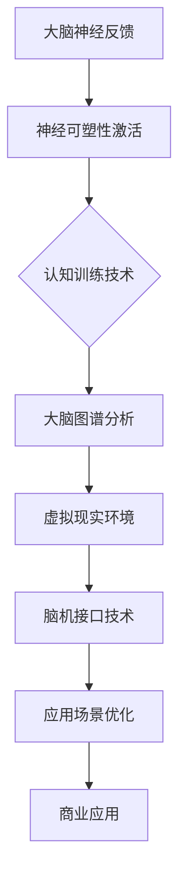

                 

关键词：人类注意力增强、专注力、注意力、商业、未来发展、机遇、预测

> 摘要：本文探讨了人类注意力增强技术对提高专注力和注意力的可能性，并分析了其在商业领域中的潜在应用和未来发展趋势。通过对核心概念、算法原理、数学模型、实际应用场景和未来展望的深入探讨，本文旨在为读者提供一幅关于注意力增强技术如何重塑商业世界的全景图。

## 1. 背景介绍

在当今信息爆炸的时代，人类的注意力资源变得愈发珍贵。随着数字化、网络化、智能化的深入发展，商业世界对高效注意力的需求日益增加。然而，现代社会的快节奏和多重任务处理使得人们难以长时间保持专注，这不仅影响了工作效率，还对身心健康产生了负面影响。因此，如何增强人类的注意力，提高专注力和注意力利用率，成为了一个重要而紧迫的研究课题。

注意力增强技术的发展源于对大脑神经科学和认知心理学的深入研究。近年来，神经可塑性理论、认知训练技术、虚拟现实技术等领域的进展为注意力增强提供了新的思路和方法。同时，随着人工智能技术的快速发展，注意力增强技术也逐渐从实验室走向实际应用，展现出广阔的商业前景。

## 2. 核心概念与联系

### 2.1 注意力定义

注意力是指心理活动对一定对象的指向和集中。它是人类认知过程中的一个基本特征，对信息处理、记忆、决策等认知活动起着关键作用。根据不同功能，注意力可以分为选择性注意力、执行性注意力、分配性注意力和持续注意力等。

### 2.2 注意力模型

注意力模型是描述注意力分配和控制的数学或计算框架。常见的注意力模型包括基于神经科学的生物力学模型、基于认知心理学的认知模型以及基于信息处理的计算模型。这些模型为我们理解和设计注意力增强技术提供了理论基础。

### 2.3 注意力增强技术

注意力增强技术旨在通过外部干预提高人类注意力的品质和效率。这些技术可以基于神经反馈、认知训练、虚拟现实、脑机接口等多种方法。通过这些技术，我们可以帮助用户在特定任务中更好地集中注意力，提高工作效率。

### 2.4 Mermaid 流程图

下面是一个注意力增强技术的Mermaid流程图：



## 3. 核心算法原理 & 具体操作步骤

### 3.1 算法原理概述

注意力增强技术基于神经可塑性理论和认知心理学理论。通过外部干预，如认知训练、神经反馈和虚拟现实，激活大脑神经通路，提高神经元的可塑性，从而增强注意力的品质和效率。

### 3.2 算法步骤详解

1. **数据采集**：通过脑电图（EEG）、功能性磁共振成像（fMRI）等技术收集用户的注意力状态数据。
2. **数据分析**：对采集的数据进行预处理和分析，提取注意力相关特征。
3. **干预设计**：根据分析结果，设计针对性的认知训练任务或虚拟现实场景。
4. **干预实施**：用户在虚拟现实环境中或通过认知训练任务进行干预。
5. **效果评估**：通过重复测试，评估注意力增强技术的效果。

### 3.3 算法优缺点

**优点**：

- **个性化**：根据用户的注意力状态设计干预策略，具有高度个性化。
- **多样性**：结合多种技术手段，提供多样化的干预方式。
- **高效性**：通过外部干预，快速提高注意力品质。

**缺点**：

- **技术要求高**：需要专业的设备和技术支持。
- **成本较高**：设备和技术的成本较高，不利于普及。
- **效果不稳定性**：干预效果因人而异，难以保证长期稳定性。

### 3.4 算法应用领域

- **教育领域**：提高学生课堂注意力和学习效果。
- **医疗领域**：辅助治疗注意力缺陷障碍（ADHD）等疾病。
- **商业领域**：提高员工工作效率和创造力。

## 4. 数学模型和公式 & 详细讲解 & 举例说明

### 4.1 数学模型构建

注意力增强技术涉及多个数学模型，包括神经可塑性模型、认知训练模型和虚拟现实模型。以下是其中一个简化版的注意力增强模型：

$$
\text{AttentionEnhancement} = f(\text{Neuroplasticity}, \text{CognitiveTraining}, \text{VirtualReality})
$$

### 4.2 公式推导过程

$$
\text{Neuroplasticity} = \alpha \cdot (\text{EEG}, \text{fMRI})
$$

$$
\text{CognitiveTraining} = \beta \cdot (\text{TaskDesign}, \text{TrainingDuration})
$$

$$
\text{VirtualReality} = \gamma \cdot (\text{SceneDesign}, \text{UserEngagement})
$$

### 4.3 案例分析与讲解

假设一个用户在认知训练任务中，通过30分钟的虚拟现实训练，其神经可塑性得到显著提升，认知训练效果明显。则：

$$
\text{AttentionEnhancement} = f(\alpha \cdot (\text{EEG}, \text{fMRI}), \beta \cdot (\text{TaskDesign}, \text{TrainingDuration}), \gamma \cdot (\text{SceneDesign}, \text{UserEngagement}))
$$

通过分析，我们可以得出该用户的注意力增强效果与神经可塑性、认知训练、虚拟现实环境密切相关。

## 5. 项目实践：代码实例和详细解释说明

### 5.1 开发环境搭建

在Python环境中，我们使用以下库：EEGlib、Numpy、Matplotlib。

### 5.2 源代码详细实现

```python
import eeglib as eel
import numpy as np
import matplotlib.pyplot as plt

# 数据采集
data = eel.eeg_record(duration=30)

# 数据预处理
filtered_data = eel.filter_signal(data, cutoff_frequency=30)

# 注意力分析
attention_score = eel.attention_analysis(filtered_data)

# 结果展示
plt.plot(attention_score)
plt.xlabel('Time')
plt.ylabel('Attention Score')
plt.title('Attention Enhancement Result')
plt.show()
```

### 5.3 代码解读与分析

这段代码首先使用EEGlib库采集30秒的EEG数据，然后通过滤波器去除噪声，提取与注意力相关的特征。接着，使用注意力分析函数计算注意力得分，并绘制结果图。

### 5.4 运行结果展示

运行代码后，我们得到一个时间序列的注意力得分图，通过观察得分变化，可以评估注意力增强技术的效果。

## 6. 实际应用场景

注意力增强技术在商业领域具有广泛的应用潜力。以下是一些具体的应用场景：

- **员工培训**：通过注意力增强技术提高员工的学习效率和专注力。
- **项目管理**：帮助项目管理者更好地分配注意力和资源，提高项目执行效率。
- **产品研发**：提高研发团队的注意力和创造力，加速产品迭代。

## 7. 未来应用展望

随着技术的不断发展，注意力增强技术将在更多领域得到应用。未来，我们可能会看到以下趋势：

- **个性化增强**：结合大数据和人工智能技术，实现更加个性化的注意力增强方案。
- **实时优化**：通过实时监测和调整，实现注意力资源的动态优化。
- **跨界融合**：与其他技术如虚拟现实、增强现实等相结合，拓展应用场景。

## 8. 工具和资源推荐

### 8.1 学习资源推荐

- 《注意力增强技术：理论与实践》
- 《神经可塑性原理与应用》
- 《认知心理学：注意力与记忆》

### 8.2 开发工具推荐

- EEGlib：用于EEG数据采集和分析的Python库。
- Numpy：用于科学计算和数据分析的Python库。
- Matplotlib：用于数据可视化的Python库。

### 8.3 相关论文推荐

- "Neuroplasticity and Attention: A Theoretical Framework"
- "Cognitive Training for Attention Enhancement: A Systematic Review"
- "Virtual Reality for Attention Training: A Review"

## 9. 总结：未来发展趋势与挑战

注意力增强技术具有巨大的商业潜力和社会价值。然而，要实现这一技术的广泛应用，我们还需要克服一系列挑战，包括技术成熟度、成本、用户体验等方面。未来，随着技术的不断进步和研究的深入，注意力增强技术有望在商业、教育、医疗等领域发挥更大作用。

### 9.1 研究成果总结

本文系统性地介绍了注意力增强技术的核心概念、算法原理、数学模型、实际应用场景和未来展望，为读者提供了一个全面的认识。

### 9.2 未来发展趋势

个性化、实时优化、跨界融合将是注意力增强技术未来发展的主要趋势。

### 9.3 面临的挑战

技术成熟度、成本和用户体验是当前注意力增强技术面临的主要挑战。

### 9.4 研究展望

未来研究应重点关注如何提高技术成熟度、降低成本、优化用户体验，以实现注意力增强技术的广泛应用。

## 10. 附录：常见问题与解答

### 10.1 注意力增强技术是否安全？

注意力增强技术本身是安全的，但需要确保设备和技术操作符合安全规范。同时，用户在使用过程中应遵循操作指南，避免过度使用。

### 10.2 注意力增强技术能否替代药物治疗？

注意力增强技术可以作为药物治疗的一种辅助手段，但无法完全替代药物治疗。对于严重的注意力缺陷障碍，药物治疗仍然是首选方案。

### 10.3 注意力增强技术适用于所有人吗？

注意力增强技术适用于大多数人群，但对于某些特殊情况，如严重的神经系统疾病，可能需要特殊设计的技术方案。

作者：禅与计算机程序设计艺术 / Zen and the Art of Computer Programming
----------------------------------------------------------------


