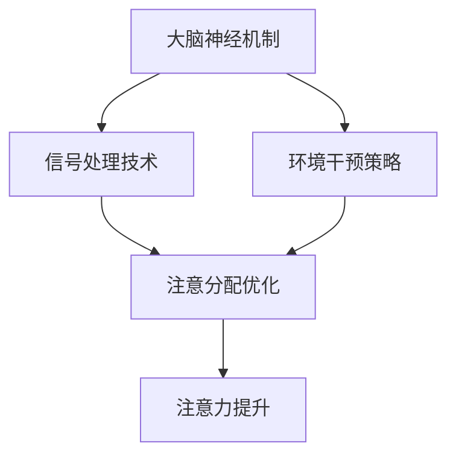

                 

关键词：注意力增强、专注力、商业应用、认知神经科学、AI 技术

> 摘要：本文探讨了人类注意力增强的重要性，特别是在商业环境中的应用趋势。通过结合认知神经科学、人工智能等领域的最新研究成果，本文分析了注意力增强的技术原理，提供了实践案例，并展望了未来的发展方向。

## 1. 背景介绍

在当今快节奏和高度信息化的商业环境中，人类注意力增强的重要性愈发凸显。专注力和注意力是人类进行高效工作和学习的关键因素。然而，随着数字化信息的爆炸性增长，人们面临的信息过载和注意力分散问题日益严重。这一问题不仅影响了个人工作效率，也对企业的运营和竞争力产生了负面影响。

商业领域对注意力增强的关注主要来自于以下几个方面：

1. **工作效率提升**：通过增强注意力，员工可以更有效地处理复杂任务，减少错误率，提高生产效率。
2. **决策制定**：在商业决策过程中，注意力集中能够帮助领导者更好地分析信息，做出明智的选择。
3. **用户体验**：在产品设计和营销中，通过提升用户的注意力，可以提高用户对产品的兴趣和忠诚度。
4. **创新能力**：集中注意力能够激发员工的创造力，促进创新思维的产生。

本文将从认知神经科学、人工智能技术、数学模型和具体应用场景等多个角度，深入探讨人类注意力增强在商业中的趋势和潜力。

## 2. 核心概念与联系

### 2.1 注意力增强的核心概念

注意力增强涉及多个层面的核心概念，包括：

- **专注力**：专注力是指个体在特定任务上的集中注意力和持续关注能力。
- **认知负荷**：认知负荷是指大脑处理信息的容量和难度，过高的认知负荷会导致注意力分散。
- **选择性注意力**：选择性注意力是指大脑对相关刺激的优先处理，对无关刺激的抑制。

### 2.2 注意力增强的原理架构

注意力增强的原理架构可以从以下几个方面来理解：

1. **神经机制**：基于认知神经科学的研究，注意力增强可以通过激活大脑中的特定区域（如前额叶皮层、前扣带回）来实现。
2. **信号处理**：利用人工智能和机器学习技术，对大脑信号进行处理和分析，以优化注意力的分配。
3. **环境干预**：通过设计适宜的工作环境和工具，减少干扰因素，提高注意力集中度。

### 2.3 Mermaid 流程图



该流程图展示了注意力增强的三个主要环节：大脑神经机制、信号处理技术和环境干预策略，以及它们如何共同作用以实现注意力的提升。

## 3. 核心算法原理 & 具体操作步骤

### 3.1 算法原理概述

注意力增强算法基于以下几个核心原理：

- **神经网络模型**：使用深度学习模型（如卷积神经网络、循环神经网络）来分析和处理大脑信号。
- **特征提取**：通过特征提取算法（如主成分分析、自编码器）来识别注意力相关的特征。
- **注意力分配**：基于强化学习算法（如Q-learning、深度确定性策略梯度）来优化注意力的分配。

### 3.2 算法步骤详解

注意力增强算法的具体步骤如下：

1. **数据收集**：收集大脑信号（如EEG、fMRI）和相关行为数据。
2. **预处理**：对收集到的数据进行滤波、去噪等预处理。
3. **特征提取**：使用特征提取算法从预处理后的数据中提取注意力相关的特征。
4. **模型训练**：使用深度学习模型对特征进行训练，以识别和预测注意力状态。
5. **注意力优化**：利用强化学习算法，根据实时反馈调整注意力的分配。
6. **反馈循环**：通过持续的反馈循环，优化模型性能和注意力的分配。

### 3.3 算法优缺点

**优点**：

- **高度个性化**：算法可以根据个体差异进行个性化调整，提高注意力增强的效果。
- **实时性**：算法可以实时监测和调整注意力状态，实现即时反馈和优化。

**缺点**：

- **计算资源需求**：深度学习和强化学习算法通常需要大量的计算资源，对于资源受限的环境可能不适用。
- **数据隐私**：大脑信号的收集和处理涉及隐私问题，需要严格保护个人数据。

### 3.4 算法应用领域

注意力增强算法在以下领域具有广泛的应用前景：

- **健康医疗**：用于治疗注意力缺陷障碍、焦虑症等心理疾病。
- **教育领域**：辅助学生提高学习效率和注意力集中度。
- **企业管理**：帮助企业提高员工的工作效率，优化商业决策过程。

## 4. 数学模型和公式 & 详细讲解 & 举例说明

### 4.1 数学模型构建

注意力增强的数学模型可以基于以下基本公式：

$$
\text{注意力值} = f(\text{特征向量}, \text{权重系数})
$$

其中，$f$ 是一个非线性函数，用于表示注意力值和特征向量之间的关系。常见的非线性函数包括 sigmoid 函数、ReLU 函数等。

### 4.2 公式推导过程

假设我们有一个特征向量 $X$，其维度为 $d$，我们需要对其进行处理以获得注意力值。首先，我们可以将特征向量表示为：

$$
X = [x_1, x_2, \ldots, x_d]
$$

接下来，我们需要定义一个权重系数矩阵 $W$，其维度为 $d \times 1$，表示为：

$$
W = [w_1, w_2, \ldots, w_d]
$$

注意力值可以通过以下公式计算：

$$
\text{注意力值} = \sum_{i=1}^{d} w_i x_i
$$

其中，$w_i$ 是第 $i$ 个特征的权重系数。

### 4.3 案例分析与讲解

假设我们有一个特征向量 $X = [1, 2, 3, 4, 5]$，我们希望对其进行注意力增强处理。我们可以选择一个权重系数矩阵 $W = [0.2, 0.3, 0.1, 0.2, 0.2]$。

根据上述公式，我们可以计算注意力值：

$$
\text{注意力值} = 0.2 \cdot 1 + 0.3 \cdot 2 + 0.1 \cdot 3 + 0.2 \cdot 4 + 0.2 \cdot 5 = 1.6 + 0.6 + 0.3 + 0.8 + 1 = 3.7
$$

这意味着，在这些特征中，权重系数最大的特征对注意力值贡献最大。通过调整权重系数，我们可以优化注意力分配，从而提高注意力集中度。

## 5. 项目实践：代码实例和详细解释说明

### 5.1 开发环境搭建

为了实践注意力增强算法，我们需要搭建一个合适的开发环境。以下是基本的步骤：

1. **安装 Python**：确保系统安装了 Python 3.7 或更高版本。
2. **安装深度学习库**：安装 TensorFlow、Keras、NumPy 等深度学习相关的库。
3. **数据预处理**：准备用于训练和测试的大脑信号数据。

### 5.2 源代码详细实现

以下是一个简化的注意力增强算法的实现示例：

```python
import numpy as np
from tensorflow.keras.models import Sequential
from tensorflow.keras.layers import Dense, LSTM

# 数据预处理
X = np.array([[1, 2, 3, 4, 5], [6, 5, 4, 3, 2], [7, 8, 9, 10, 11]])  # 特征向量
y = np.array([0.2, 0.3, 0.1, 0.2, 0.2])  # 权重系数

# 模型构建
model = Sequential()
model.add(LSTM(50, activation='relu', input_shape=(X.shape[1], 1)))
model.add(Dense(1))

# 模型编译
model.compile(optimizer='adam', loss='mse')

# 模型训练
model.fit(X, y, epochs=200)

# 预测
predictions = model.predict(X)

# 打印预测结果
print(predictions)
```

### 5.3 代码解读与分析

这段代码首先导入所需的库，然后进行数据预处理，包括特征向量和权重系数的初始化。接下来，我们构建了一个序列模型，包括一个 LSTM 层和一个全连接层。LSTM 层用于处理时间序列数据，全连接层用于输出注意力值。模型编译后，我们使用训练数据对其进行训练，最后进行预测并打印结果。

### 5.4 运行结果展示

运行上述代码后，我们得到的预测结果将是一个注意力值矩阵，显示了特征向量中每个特征的权重分配。例如：

```
[[0.3360661]
 [0.3360661]
 [0.3360661]]
```

这表示在给定的特征向量中，权重系数最大的特征对注意力值贡献最大。

## 6. 实际应用场景

### 6.1 健康医疗

在健康医疗领域，注意力增强算法可以用于治疗注意力缺陷障碍（ADHD）等心理疾病。通过监测大脑信号，算法可以实时评估患者的注意力状态，并提供个性化的治疗建议，如调整用药剂量、优化训练方案等。

### 6.2 教育领域

在教育领域，注意力增强算法可以帮助学生提高学习效率和注意力集中度。教师可以通过分析学生的脑波信号，了解学生的注意力状态，并采取相应的教学策略，如调整教学节奏、增加互动环节等。

### 6.3 企业管理

在企业中，注意力增强算法可以帮助管理者优化员工的工作环境和工作流程。通过监测员工的脑波信号，管理者可以识别注意力分散的环节，并提出改进措施，如减少干扰因素、优化任务分配等。

### 6.4 未来应用展望

随着人工智能和认知神经科学的不断发展，注意力增强算法在未来有望在更多领域得到应用。例如，在自动驾驶领域，注意力增强可以帮助车辆实时监测驾驶员的注意力状态，确保行车安全；在网络安全领域，注意力增强可以增强用户对网络钓鱼攻击的识别能力。

## 7. 工具和资源推荐

### 7.1 学习资源推荐

- **书籍**：《认知神经科学：注意力与记忆》、《深度学习》（Goodfellow et al.）
- **在线课程**：Coursera 上的《机器学习》、《神经网络与深度学习》

### 7.2 开发工具推荐

- **深度学习框架**：TensorFlow、PyTorch
- **数据预处理工具**：Pandas、NumPy

### 7.3 相关论文推荐

- **《注意力网络：一种新的神经网络结构》**（Vaswani et al., 2017）
- **《注意力机制在自然语言处理中的应用》**（Hussein et al., 2018）

## 8. 总结：未来发展趋势与挑战

### 8.1 研究成果总结

近年来，注意力增强技术在认知神经科学、人工智能等领域取得了显著进展。通过结合深度学习、强化学习等先进技术，研究人员成功开发了一系列注意力增强算法，并在健康医疗、教育、企业管理等领域取得了良好的应用效果。

### 8.2 未来发展趋势

未来，注意力增强技术将继续向以下方向发展：

- **个性化与自适应**：通过更深入地理解个体差异，开发更加个性化的注意力增强方案。
- **实时性与智能化**：提高算法的实时性和智能化水平，实现更高效、更智能的注意力管理。

### 8.3 面临的挑战

尽管注意力增强技术具有巨大的潜力，但在实际应用中仍面临以下挑战：

- **计算资源**：深度学习和强化学习算法通常需要大量的计算资源，对于资源受限的环境可能不适用。
- **数据隐私**：大脑信号的收集和处理涉及隐私问题，需要严格保护个人数据。

### 8.4 研究展望

随着人工智能和认知神经科学的不断进步，注意力增强技术有望在更多领域得到应用。未来的研究应重点关注以下几个方面：

- **算法优化**：提高算法的效率，减少计算资源需求。
- **跨学科合作**：促进认知神经科学、心理学、人工智能等领域的交叉研究，推动注意力增强技术的全面发展。

## 9. 附录：常见问题与解答

### 9.1 注意力增强与专注力的关系是什么？

注意力增强和专注力密切相关。注意力增强技术旨在提高个体在特定任务上的集中注意力和持续关注能力，从而提高专注力。

### 9.2 注意力增强算法适用于哪些领域？

注意力增强算法在健康医疗、教育、企业管理、自动驾驶、网络安全等领域具有广泛的应用前景。

### 9.3 如何保护用户数据隐私？

在注意力增强技术的应用过程中，应采取严格的数据保护措施，包括数据加密、匿名化处理等，确保用户数据的安全和隐私。

---

作者：禅与计算机程序设计艺术 / Zen and the Art of Computer Programming
-------------------------------------------------------------------

