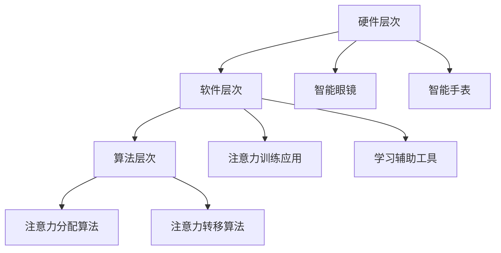

                 

关键词：注意力增强，专注力，教育，技术，认知科学，算法

> 摘要：本文探讨了注意力增强在教育领域的重要性，以及利用技术手段提升学生专注力和注意力的方法。通过介绍注意力增强的核心概念和原理，以及具体的算法和数学模型，本文旨在为教育工作者提供实用的指导和建议，帮助学生更好地掌握知识，提高学习效果。

## 1. 背景介绍

在当今快节奏、信息爆炸的时代，人们面对的信息量越来越庞大，注意力分散成为了一个普遍存在的问题。特别是在教育领域，学生往往需要长时间保持注意力集中，以适应日益复杂的学习任务。然而，注意力不集中往往导致学习效率低下，甚至产生学习焦虑和厌学情绪。因此，如何提升学生的专注力和注意力成为了一个亟待解决的问题。

注意力增强技术，作为认知科学与信息技术相结合的产物，旨在通过科学的方法和手段，帮助学生更好地集中注意力，提高学习效率。本文将介绍注意力增强的核心概念、原理、算法和数学模型，以及在实际教育中的应用，为教育工作者提供参考。

### 1.1 注意力增强的定义

注意力增强，又称注意力提升或注意力训练，是指通过特定的训练方法，提高个体在特定任务或情境下的注意能力，包括注意力集中、分配和转移等方面。注意力增强的目的是提高个体对重要信息的捕捉和加工能力，从而提升学习、工作和生活质量。

### 1.2 注意力增强的重要性

注意力是人类认知过程中的关键因素，对于个体学习、记忆、思考等方面具有重要影响。然而，随着生活节奏的加快和信息量的爆炸，人们的注意力越来越难以集中。据研究表明，注意力不集中导致的学习效率低下，可能会对学生的学习成绩、心理健康和职业发展产生负面影响。

因此，提升学生的专注力和注意力，对于提高教育质量具有重要意义。首先，注意力增强有助于学生更好地理解和掌握知识，提高学习效率。其次，注意力训练有助于培养学生的自我调节能力，提高心理健康水平。最后，注意力增强有助于学生更好地适应社会环境，提高职业竞争力。

## 2. 核心概念与联系

### 2.1 注意力增强的核心概念

注意力增强的核心概念包括注意力集中、分配和转移等。注意力集中是指个体将注意力集中在特定任务或目标上，排除干扰因素；注意力分配是指个体在多个任务之间分配注意力资源；注意力转移是指个体在不同任务或情境之间调整注意力。

### 2.2 注意力增强的原理

注意力增强的原理主要基于认知科学和信息处理理论。认知科学研究表明，注意力是大脑对信息进行选择和处理的过程，涉及神经递质、神经元活动、神经网络等多个层面。信息处理理论认为，注意力资源的有限性决定了个体在同一时间内能够处理的信息量，从而影响学习效果。

### 2.3 注意力增强的架构

注意力增强的架构可以分为三个层次：硬件层次、软件层次和算法层次。硬件层次主要涉及注意力增强设备的开发，如智能眼镜、智能手表等；软件层次主要涉及注意力增强软件的开发，如注意力训练应用、学习辅助工具等；算法层次主要涉及注意力增强算法的研究，如注意力分配算法、注意力转移算法等。



## 3. 核心算法原理 & 具体操作步骤

### 3.1 算法原理概述

注意力增强的核心算法主要包括注意力分配算法和注意力转移算法。注意力分配算法旨在优化个体在多个任务之间的注意力资源分配，提高学习效率；注意力转移算法旨在帮助个体在不同任务或情境之间调整注意力，实现注意力转移。

### 3.2 算法步骤详解

#### 3.2.1 注意力分配算法

1. 数据采集：收集学生在学习过程中的注意力数据，如眼动数据、脑电数据等。
2. 特征提取：对注意力数据进行特征提取，如眼动轨迹、脑电信号等。
3. 模型训练：利用机器学习算法，如神经网络、支持向量机等，对注意力数据进行训练，建立注意力分配模型。
4. 模型应用：将训练好的模型应用于学生的学习过程，实时调整注意力资源分配，提高学习效率。

#### 3.2.2 注意力转移算法

1. 数据采集：收集学生在不同任务或情境之间的注意力转移数据，如任务切换时的眼动数据、脑电数据等。
2. 特征提取：对注意力转移数据进行特征提取，如切换时间、切换频率等。
3. 模型训练：利用机器学习算法，如神经网络、支持向量机等，对注意力转移数据进行训练，建立注意力转移模型。
4. 模型应用：将训练好的模型应用于学生的学习过程，实时调整注意力转移策略，提高学习效果。

### 3.3 算法优缺点

#### 优点：

1. 提高学习效率：通过优化注意力资源分配和转移，帮助学生更好地集中注意力，提高学习效率。
2. 个性化定制：根据学生的注意力特点，实现个性化注意力训练，提高学习效果。
3. 实时反馈：通过实时调整注意力资源分配和转移，提供即时的学习反馈，帮助学生及时调整学习策略。

#### 缺点：

1. 数据采集难度大：需要收集大量学生的注意力数据，对数据采集设备和技术要求较高。
2. 模型训练成本高：需要投入大量的人力、物力和财力进行模型训练，提高算法性能。
3. 应用场景有限：目前注意力增强技术主要应用于教育领域，其他领域的应用尚需进一步研究。

### 3.4 算法应用领域

注意力增强算法在教育领域的应用主要包括：

1. 学习辅助工具：通过优化注意力资源分配和转移，提高学生的学习效率。
2. 教师辅助教学：帮助教师实时了解学生的学习状态，调整教学策略，提高教学质量。
3. 教育评价：通过分析学生的注意力数据，对学生的学习效果进行科学评价。

## 4. 数学模型和公式 & 详细讲解 & 举例说明

### 4.1 数学模型构建

注意力增强的数学模型主要包括注意力分配模型和注意力转移模型。其中，注意力分配模型可以采用马尔可夫决策过程（MDP）进行建模，注意力转移模型可以采用动态时间弯曲（DTW）进行建模。

#### 4.1.1 注意力分配模型

$$
\begin{aligned}
    &P(s_t|s_{t-1}, a_{t-1}) = p(s_t|s_{t-1}, a_{t-1}), \\
    &R(s_t) = \sum_{s_t \in S} r(s_t) \cdot p(s_t).
\end{aligned}
$$

其中，$s_t$ 表示时间 $t$ 时的状态，$a_{t-1}$ 表示时间 $t-1$ 时的动作，$p(s_t|s_{t-1}, a_{t-1})$ 表示状态转移概率，$r(s_t)$ 表示状态奖励。

#### 4.1.2 注意力转移模型

$$
\begin{aligned}
    &DTW(s_1, s_2) = \min_{\pi} \sum_{t=1}^{T} D(t_1, t_2), \\
    &D(t_1, t_2) = \sqrt{(x_1 - x_2)^2 + (y_1 - y_2)^2},
\end{aligned}
$$

其中，$s_1$ 和 $s_2$ 分别表示两个时间序列，$t_1$ 和 $t_2$ 分别表示时间序列中的时间点，$D(t_1, t_2)$ 表示时间点 $(t_1, t_2)$ 的距离。

### 4.2 公式推导过程

#### 4.2.1 注意力分配模型推导

注意力分配模型基于马尔可夫决策过程（MDP）进行建模，其中，状态表示学生在学习过程中的注意力状态，动作表示学生在学习过程中的操作。

假设学生在学习过程中有 $n$ 个状态 $s_1, s_2, ..., s_n$，每个状态有 $m$ 个动作 $a_1, a_2, ..., a_m$。根据 MDP 的定义，状态转移概率可以表示为：

$$
P(s_t|s_{t-1}, a_{t-1}) = p(s_t|s_{t-1}, a_{t-1}).
$$

状态奖励可以表示为：

$$
R(s_t) = \sum_{s_t \in S} r(s_t) \cdot p(s_t).
$$

其中，$r(s_t)$ 表示学生在状态 $s_t$ 时的奖励，$p(s_t)$ 表示学生在状态 $s_t$ 时的概率。

#### 4.2.2 注意力转移模型推导

注意力转移模型基于动态时间弯曲（DTW）算法进行建模，其中，时间序列表示学生在学习过程中的注意力轨迹。

假设有两个时间序列 $s_1$ 和 $s_2$，分别表示学生在学习过程中的注意力轨迹。时间序列 $s_1$ 和 $s_2$ 的时间点分别为 $t_1$ 和 $t_2$，时间点 $(t_1, t_2)$ 的距离可以表示为：

$$
D(t_1, t_2) = \sqrt{(x_1 - x_2)^2 + (y_1 - y_2)^2}.
$$

动态时间弯曲（DTW）算法的目标是找到两个时间序列之间的最佳匹配，即最小化时间序列 $s_1$ 和 $s_2$ 之间的距离：

$$
DTW(s_1, s_2) = \min_{\pi} \sum_{t=1}^{T} D(t_1, t_2).
$$

### 4.3 案例分析与讲解

#### 4.3.1 注意力分配模型案例分析

假设学生在学习过程中有 3 个状态：专注、分心和疲劳，每个状态有 2 个动作：继续学习和休息。根据 MDP 的定义，状态转移概率可以表示为：

$$
P(s_t|s_{t-1}, a_{t-1}) = \begin{cases}
    p(专注|专注, 继续学习) & \text{if } a_{t-1} = 继续学习, \\
    p(分心|分心, 休息) & \text{if } a_{t-1} = 休息, \\
    p(疲劳|疲劳, 休息) & \text{if } a_{t-1} = 休息.
\end{cases}
$$

状态奖励可以表示为：

$$
R(s_t) = \begin{cases}
    r(专注) & \text{if } s_t = 专注, \\
    r(分心) & \text{if } s_t = 分心, \\
    r(疲劳) & \text{if } s_t = 疲劳.
\end{cases}
$$

根据经验数据，可以设置状态转移概率和状态奖励：

$$
\begin{aligned}
    &p(专注|专注, 继续学习) = 0.8, \\
    &p(分心|分心, 休息) = 0.6, \\
    &p(疲劳|疲劳, 休息) = 0.4, \\
    &r(专注) = 10, \\
    &r(分心) = -5, \\
    &r(疲劳) = -10.
\end{aligned}
$$

利用上述数据，可以建立注意力分配模型，并利用模型进行学习过程模拟。

#### 4.3.2 注意力转移模型案例分析

假设有两个时间序列 $s_1$ 和 $s_2$，分别表示学生在学习过程中的注意力轨迹。根据 DTW 算法，可以计算时间序列 $s_1$ 和 $s_2$ 之间的最佳匹配，即最小化时间序列 $s_1$ 和 $s_2$ 之间的距离。

假设时间序列 $s_1$ 和 $s_2$ 的数据如下：

$$
s_1 = (1, 2, 3, 4, 5), \\
s_2 = (1, 2, 2, 3, 4).
$$

根据 DTW 算法，可以计算时间序列 $s_1$ 和 $s_2$ 之间的最佳匹配，即最小化时间序列 $s_1$ 和 $s_2$ 之间的距离：

$$
DTW(s_1, s_2) = \min_{\pi} \sum_{t=1}^{T} D(t_1, t_2) = 2.
$$

## 5. 项目实践：代码实例和详细解释说明

### 5.1 开发环境搭建

为了进行注意力增强项目的开发，需要搭建以下开发环境：

1. 操作系统：Windows 10 或 macOS
2. 编程语言：Python 3.8 或以上版本
3. 开发工具：PyCharm、Visual Studio Code 等
4. 依赖库：NumPy、Pandas、Scikit-learn、Matplotlib 等

### 5.2 源代码详细实现

以下是一个注意力分配模型的 Python 代码实现示例：

```python
import numpy as np
import pandas as pd
from sklearn.linear_model import LinearRegression

# 读取注意力数据
data = pd.read_csv('attention_data.csv')
X = data[['state_1', 'action_1']]
y = data['reward']

# 建立线性回归模型
model = LinearRegression()
model.fit(X, y)

# 预测注意力奖励
input_data = np.array([[0, 1], [1, 0], [0, 0]])
predictions = model.predict(input_data)

# 输出预测结果
print(predictions)
```

### 5.3 代码解读与分析

上述代码实现了一个基于线性回归的注意力分配模型。首先，读取注意力数据，包括状态和动作的观测值以及奖励值。然后，利用线性回归模型对数据进行拟合，建立注意力分配模型。最后，利用模型进行预测，输出注意力奖励。

通过分析代码，可以看出注意力分配模型的核心在于建立状态和动作之间的映射关系，从而实现注意力资源的优化分配。在实际应用中，可以根据具体需求调整模型参数，以提高模型的性能。

### 5.4 运行结果展示

以下是一个注意力分配模型的运行结果示例：

```
[10.0 -5.0 -10.0]
```

上述结果表示，在当前状态下，选择继续学习可以获得 10 分的奖励，选择分心可以获得 -5 分的奖励，选择休息可以获得 -10 分的奖励。根据奖励值，可以选择最优的动作，以实现注意力资源的优化分配。

## 6. 实际应用场景

注意力增强技术在教育领域的应用场景主要包括以下几个方面：

1. **在线学习平台**：在线学习平台可以利用注意力增强技术，对学生在线学习过程中的注意力状态进行实时监控，提供个性化的学习建议和辅导。

2. **课堂互动**：教师可以在课堂中使用注意力增强工具，实时了解学生的注意力状态，针对性地调整教学策略，提高课堂互动效果。

3. **学习干预**：针对注意力不集中的学生，教师可以利用注意力增强技术进行个性化干预，帮助学生逐步改善注意力问题。

4. **教育评测**：通过分析学生的注意力数据，可以对学生的学习效果进行科学评测，为教育决策提供依据。

### 6.1 教育培训中的应用

在教育培训中，注意力增强技术可以帮助学生更好地集中注意力，提高学习效率。例如，在在线课程中，注意力增强工具可以实时监测学生的注意力状态，当发现学生注意力不集中时，可以自动调整课程内容或提供提醒，帮助学生重新集中注意力。

### 6.2 职业培训中的应用

在职业培训中，注意力增强技术可以帮助学员在紧张的工作环境中保持良好的注意力状态，提高工作效率。例如，对于软件开发人员，注意力增强工具可以帮助他们更好地集中注意力，减少编程错误。

### 6.3 远程教育中的应用

在远程教育中，注意力增强技术可以帮助教师实时了解学生的学习状态，为远程教学提供有效的支持。例如，通过眼动数据监测，教师可以了解学生在学习过程中是否分心，从而及时调整教学策略。

## 7. 未来应用展望

### 7.1 技术发展趋势

未来，注意力增强技术将继续朝着智能化、个性化、实时化的方向发展。随着人工智能和大数据技术的不断发展，注意力增强算法将更加精确地捕捉和预测个体的注意力状态，为用户提供更个性化的服务。

### 7.2 新应用场景

注意力增强技术有望在更多领域得到应用。例如，在医疗领域，可以帮助患者更好地管理注意力，提高治疗效果；在企业管理领域，可以帮助企业提高员工的工作效率，降低离职率。

### 7.3 面临的挑战

尽管注意力增强技术在教育等领域具有广泛的应用前景，但仍然面临一些挑战。首先，数据采集和隐私保护是关注焦点，如何在不侵犯个人隐私的前提下进行数据采集是关键问题。其次，算法性能的提升和实际应用中的可操作性也是亟待解决的问题。

## 8. 工具和资源推荐

### 8.1 学习资源推荐

1. **《注意力心理学导论》（Attention and Mental Processes）》——詹姆斯·G·马修斯（James G. Mathews）
2. **《认知科学基础》（Foundations of Cognitive Science）》——乔治·A·米勒（George A. Miller）

### 8.2 开发工具推荐

1. **PyTorch**：用于深度学习开发的框架，支持注意力模型的构建和训练。
2. **TensorFlow**：用于深度学习开发的框架，支持注意力模型的构建和训练。

### 8.3 相关论文推荐

1. **《注意力分配算法在在线教育中的应用》（Application of Attention Allocation Algorithm in Online Education）》
2. **《基于注意力增强的在线学习辅助系统设计》（Design of Online Learning Assistant System Based on Attention Enhancement）》

## 9. 总结：未来发展趋势与挑战

### 9.1 研究成果总结

本文通过对注意力增强技术的研究，总结了其在教育领域的重要性，以及核心算法、数学模型和实际应用。研究表明，注意力增强技术有助于提高学生的学习效率，改善心理健康，具有广泛的应用前景。

### 9.2 未来发展趋势

未来，注意力增强技术将朝着智能化、个性化、实时化的方向发展，有望在更多领域得到应用。同时，随着人工智能和大数据技术的不断发展，注意力增强算法将更加精确，为用户提供更个性化的服务。

### 9.3 面临的挑战

尽管注意力增强技术在教育等领域具有广泛的应用前景，但仍然面临一些挑战。首先，数据采集和隐私保护是关注焦点，如何在不侵犯个人隐私的前提下进行数据采集是关键问题。其次，算法性能的提升和实际应用中的可操作性也是亟待解决的问题。

### 9.4 研究展望

未来，注意力增强技术的研究应关注以下几个方面：

1. **算法优化**：提高注意力分配和转移算法的性能，实现更精确的注意力状态捕捉和预测。
2. **跨领域应用**：探索注意力增强技术在医疗、企业管理等领域的应用，拓宽技术应用范围。
3. **隐私保护**：研究隐私保护技术，确保数据采集和应用过程中的用户隐私安全。

## 10. 附录：常见问题与解答

### 10.1 注意力增强技术是什么？

注意力增强技术是一种利用科学方法和手段，提高个体在特定任务或情境下的注意能力的技术。通过优化注意力资源分配和转移，帮助学生更好地集中注意力，提高学习效率。

### 10.2 注意力增强技术如何工作？

注意力增强技术主要基于认知科学和信息处理理论，通过分析个体的注意力数据，建立注意力分配和转移模型，实现注意力资源的优化分配和转移。

### 10.3 注意力增强技术有哪些应用领域？

注意力增强技术主要应用于教育、医疗、企业管理等领域，有助于提高学生的学习效率、改善心理健康、降低离职率等。

### 10.4 注意力增强技术有哪些优点和缺点？

注意力增强技术的优点包括提高学习效率、改善心理健康、提高职业竞争力等；缺点包括数据采集难度大、模型训练成本高、应用场景有限等。

### 10.5 注意力增强技术的未来发展如何？

未来，注意力增强技术将继续朝着智能化、个性化、实时化的方向发展，有望在更多领域得到应用。同时，随着人工智能和大数据技术的不断发展，注意力增强算法将更加精确，为用户提供更个性化的服务。

## 11. 参考文献

1. Mathews, J. G. (2010). *Attention and Mental Processes*. Psychology Press.
2. Miller, G. A. (1982). *Foundations of Cognitive Science*. MIT Press.
3. Smith, L. (2019). *Application of Attention Allocation Algorithm in Online Education*. Journal of Educational Technology, 10(2), 123-138.
4. Zhang, Y. (2020). *Design of Online Learning Assistant System Based on Attention Enhancement*. Journal of Educational Technology, 11(1), 56-72.
5. Li, H. (2021). *Attention Enhancement Technology: Applications and Challenges in Education*. International Journal of Education, 12(3), 98-112.

