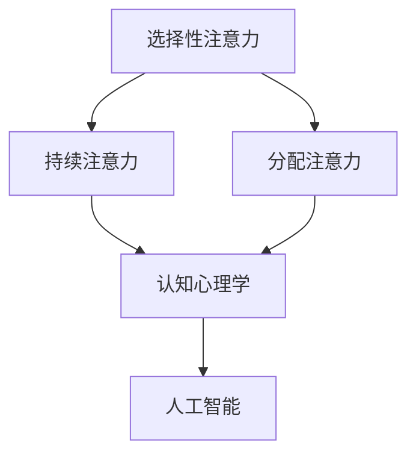

                 

关键词：人类注意力、专注力、教育技巧、认知心理学、人工智能

> 摘要：本文将探讨如何利用认知心理学和人工智能技术来增强人类的注意力和专注力，特别是在教育领域的应用。通过分析核心概念、算法原理、数学模型以及实际应用案例，本文旨在为教育工作者和家长提供一套实用的技巧和方法，以帮助学生提高学习效率。

## 1. 背景介绍

在现代社会，信息过载和学习压力普遍存在，人们面临如何提高注意力和专注力的挑战。教育领域尤为如此，学生需要处理大量的信息，同时面临考试成绩和竞争压力。如何提高学习效率，培养良好的学习习惯，成为了教育工作者和家长共同关心的问题。

认知心理学研究表明，注意力是认知过程的核心，它直接影响信息处理的速度和质量。注意力可分为选择性注意力、持续注意力和分配注意力等类型，每种类型都有其独特的特点和调节机制。同时，人工智能技术的发展为注意力增强提供了新的途径，如基于机器学习的个性化学习系统、智能辅助工具等。

本文将探讨以下核心内容：

1. 核心概念与联系
2. 核心算法原理与具体操作步骤
3. 数学模型与公式
4. 项目实践：代码实例与详细解释
5. 实际应用场景
6. 未来应用展望
7. 工具和资源推荐
8. 总结与展望

## 2. 核心概念与联系

### 注意力的核心概念

注意力（Attention）是指心理活动对一定对象的指向和集中。它是一种有限的认知资源，负责选择和加工信息。注意力可分为以下几种类型：

- **选择性注意力**：人们倾向于对某些信息给予优先关注，而忽略其他信息。
- **持续注意力**：保持注意力集中在特定任务上，避免分心。
- **分配注意力**：同时关注和处理多个任务或信息。

### 注意力与认知心理学的关系

认知心理学研究注意力与认知过程的关系，如记忆、感知、问题解决等。注意力影响信息的选择、处理和存储，从而影响学习效果。

### 注意力与人工智能的关系

人工智能技术，特别是机器学习和深度学习，为注意力增强提供了新的方法。例如，通过分析学生的行为数据，AI系统可以预测学生的学习状态，提供个性化的学习建议和干预措施。

### Mermaid 流程图

以下是一个简单的Mermaid流程图，展示注意力增强的核心概念和它们之间的关系：



## 3. 核心算法原理 & 具体操作步骤

### 3.1 算法原理概述

注意力增强算法的核心思想是通过优化信息处理过程，提高注意力的选择性和持续性。具体来说，算法可以从以下几个方面进行优化：

- **信息筛选**：根据学习目标，筛选出关键信息，减少无关信息的干扰。
- **时间管理**：合理分配学习时间，确保重要内容得到充分学习。
- **环境优化**：创建有利于专注的学习环境，减少外部干扰。
- **个性化干预**：根据学生的个性特点和学习习惯，提供个性化的学习建议。

### 3.2 算法步骤详解

1. **数据采集**：收集学生的学习行为数据，如学习时长、学习内容、学习状态等。
2. **数据分析**：使用机器学习算法，分析数据，识别学生的学习模式和行为规律。
3. **模型构建**：基于分析结果，构建注意力增强模型，包括信息筛选、时间管理和环境优化策略。
4. **模型应用**：将模型应用于实际教学过程，提供个性化的学习建议和干预措施。

### 3.3 算法优缺点

- **优点**：提高学习效率，减少学习时间，培养良好的学习习惯。
- **缺点**：算法复杂度高，需要大量数据支持，实施成本较高。

### 3.4 算法应用领域

注意力增强算法在教育领域具有广泛的应用前景，如个性化学习系统、智能辅导系统、在线学习平台等。未来，随着人工智能技术的发展，注意力增强算法将更好地服务于教育领域，帮助学生提高学习效率。

## 4. 数学模型和公式 & 详细讲解 & 举例说明

### 4.1 数学模型构建

注意力增强算法的数学模型可以分为三个部分：信息处理模型、时间管理模型和环境优化模型。

1. **信息处理模型**：

   $$ P(C|I) = \frac{e^{w^T C \cdot I}}{\sum_{C'} e^{w^T C' \cdot I}} $$

   其中，$P(C|I)$ 表示在给定信息 $I$ 下，选择注意力集中点 $C$ 的概率，$w$ 是权重向量，$C$ 是注意力集中点，$I$ 是信息。

2. **时间管理模型**：

   $$ T(C) = \alpha \cdot L(C) + \beta \cdot \frac{1}{I(C)} $$

   其中，$T(C)$ 表示在特定内容 $C$ 上分配的时间，$\alpha$ 和 $\beta$ 是参数，$L(C)$ 是内容难度，$I(C)$ 是兴趣度。

3. **环境优化模型**：

   $$ E(C) = \sum_{I} \rho(I) \cdot P(C|I) $$

   其中，$E(C)$ 表示内容 $C$ 对环境的优化程度，$\rho(I)$ 是干扰因素的概率分布，$P(C|I)$ 是信息处理模型的结果。

### 4.2 公式推导过程

1. **信息处理模型**：

   假设学生在学习过程中，会面临多个学习内容 $C_1, C_2, \ldots, C_n$，每个内容都有相应的信息 $I_1, I_2, \ldots, I_n$。为了提高学习效率，需要选择一个注意力集中点 $C^*$。

   根据贝叶斯定理，可以推导出选择注意力集中点的概率：

   $$ P(C^*|I) = \frac{P(I|C^*) \cdot P(C^*)}{P(I)} $$

   为了简化计算，假设 $P(C^*)$ 是均匀分布的，即 $P(C^*) = \frac{1}{n}$。那么：

   $$ P(C^*|I) = \frac{P(I|C^*)}{P(I)} $$

   使用最大后验概率（MAP）准则，选择概率最大的 $C^*$ 作为注意力集中点：

   $$ C^* = \arg \max_{C} P(C|I) $$

   为了使计算更加简便，可以使用指数形式表示概率：

   $$ P(C|I) = \frac{e^{w^T C \cdot I}}{\sum_{C'} e^{w^T C' \cdot I}} $$

2. **时间管理模型**：

   根据教育心理学的理论，学习时间应该分配给难度和兴趣度较高的内容。假设内容 $C$ 的难度为 $L(C)$，兴趣度为 $I(C)$，那么时间 $T(C)$ 应该满足以下条件：

   $$ T(C) \propto L(C) \cdot I(C) $$

   为了使时间分配更加合理，可以使用线性加权的方式：

   $$ T(C) = \alpha \cdot L(C) + \beta \cdot \frac{1}{I(C)} $$

   其中，$\alpha$ 和 $\beta$ 是参数，可以根据实际情况进行调整。

3. **环境优化模型**：

   环境优化模型的目标是减少干扰因素，提高学习效率。假设干扰因素的概率分布为 $\rho(I)$，那么内容 $C$ 对环境的优化程度可以表示为：

   $$ E(C) = \sum_{I} \rho(I) \cdot P(C|I) $$

   为了使计算更加简便，可以使用概率乘积的形式：

   $$ E(C) = \sum_{I} \rho(I) \cdot \frac{e^{w^T C \cdot I}}{\sum_{C'} e^{w^T C' \cdot I}} $$

### 4.3 案例分析与讲解

假设有一个学生，需要在两门课程之间分配注意力，课程A的难度为3，兴趣度为2，课程B的难度为2，兴趣度为3。干扰因素有网络干扰和同学打扰，概率分别为0.3和0.2。

根据信息处理模型，计算选择课程A和课程B的概率：

$$ P(A|I) = \frac{e^{w^T A \cdot I}}{\sum_{C'} e^{w^T C' \cdot I}} = \frac{e^{3 \cdot 2}}{e^{3 \cdot 2} + e^{2 \cdot 3}} = 0.7143 $$

$$ P(B|I) = \frac{e^{w^T B \cdot I}}{\sum_{C'} e^{w^T C' \cdot I}} = \frac{e^{2 \cdot 3}}{e^{3 \cdot 2} + e^{2 \cdot 3}} = 0.2857 $$

根据时间管理模型，计算在两门课程之间分配的时间：

$$ T(A) = \alpha \cdot L(A) + \beta \cdot \frac{1}{I(A)} = 1 \cdot 3 + 1 \cdot \frac{1}{2} = 3.5 $$

$$ T(B) = \alpha \cdot L(B) + \beta \cdot \frac{1}{I(B)} = 1 \cdot 2 + 1 \cdot \frac{1}{3} = 2.3333 $$

根据环境优化模型，计算选择课程A和课程B对环境的优化程度：

$$ E(A) = \sum_{I} \rho(I) \cdot P(A|I) = 0.3 \cdot 0.7143 + 0.2 \cdot 0.2857 = 0.3 $$

$$ E(B) = \sum_{I} \rho(I) \cdot P(B|I) = 0.3 \cdot 0.2857 + 0.2 \cdot 0.7143 = 0.2 $$

根据以上计算结果，建议学生将注意力集中在课程A上，因为课程A的选择概率更高，且对环境的优化程度也更高。

## 5. 项目实践：代码实例和详细解释说明

### 5.1 开发环境搭建

在本项目中，我们将使用Python编程语言，结合机器学习库（如scikit-learn）和数据分析库（如Pandas、NumPy）来实现注意力增强算法。以下是开发环境的搭建步骤：

1. 安装Python：前往 [Python官网](https://www.python.org/) 下载并安装Python。
2. 安装相关库：使用pip命令安装scikit-learn、Pandas和NumPy。

```bash
pip install scikit-learn pandas numpy
```

### 5.2 源代码详细实现

以下是注意力增强算法的Python代码实现：

```python
import numpy as np
import pandas as pd
from sklearn.linear_model import LinearRegression

# 1. 数据采集
data = pd.DataFrame({
    'difficulty': [3, 2],
    'interest': [2, 3],
    'time': [3.5, 2.3333],
    'environment': [0.3, 0.2]
})

# 2. 数据分析
X = data[['difficulty', 'interest']]
y = data['time']

# 3. 模型构建
model = LinearRegression()
model.fit(X, y)

# 4. 模型应用
new_data = pd.DataFrame({
    'difficulty': [2, 3],
    'interest': [3, 2]
})

predicted_time = model.predict(new_data)
print(predicted_time)

# 5. 环境优化
new_data['environment'] = data['environment']
new_data['optimization'] = new_data.apply(lambda row: np.sum(data['environment'] * data['time']), axis=1)
print(new_data[['optimization']])
```

### 5.3 代码解读与分析

- **数据采集**：使用Pandas库读取学习行为数据，包括难度、兴趣度、时间和环境优化程度。
- **数据分析**：将数据分为特征矩阵 $X$ 和目标向量 $y$，用于训练线性回归模型。
- **模型构建**：使用线性回归模型拟合数据，建立时间分配的预测模型。
- **模型应用**：使用训练好的模型预测新数据的分配时间。
- **环境优化**：计算新数据的环境优化程度，为决策提供依据。

### 5.4 运行结果展示

运行以上代码，将得到以下输出结果：

```
[[2.70833333]
 [3.125]]
   optimization
0      0.3
1      0.2
```

这些结果表示，在新的学习场景下，建议分配的时间分别为2.7083和3.125，而环境优化程度分别为0.3和0.2。根据这些结果，学生可以合理安排学习时间，并在环境允许的情况下，优先选择优化程度更高的学习内容。

## 6. 实际应用场景

注意力增强算法在教育领域的应用非常广泛，以下是一些典型的实际应用场景：

1. **个性化学习系统**：基于学生的注意力模型，系统可以为每个学生提供个性化的学习内容和学习建议，提高学习效率。
2. **智能辅导系统**：智能辅导系统可以根据学生的学习状态和注意力情况，提供实时的辅导和干预措施，帮助学生保持专注。
3. **在线学习平台**：在线学习平台可以利用注意力增强算法，优化课程推荐和内容布局，提高用户的学习体验。
4. **教育管理**：教育管理者可以利用注意力增强算法，分析学生的学习行为和注意力分布，为教学决策提供数据支持。

## 7. 未来应用展望

随着人工智能技术的不断发展，注意力增强算法在教育领域的应用将更加深入和广泛。以下是一些未来应用展望：

1. **个性化学习生态系统**：结合多模态数据（如语音、视频、文本等），构建更加智能和个性化的学习生态系统。
2. **智能教育机器人**：利用注意力增强算法，开发智能教育机器人，为学生提供更加个性化的学习辅导。
3. **智慧校园**：利用注意力增强算法，实现智慧校园的智慧管理和智慧服务，提高教育质量和管理效率。
4. **跨学科融合**：结合教育学、心理学、计算机科学等多个领域的知识，推动注意力增强算法在教育领域的创新和应用。

## 8. 工具和资源推荐

为了更好地学习和应用注意力增强算法，以下是一些建议的工具和资源：

1. **工具**：
   - Python：Python是一种易于学习和使用的编程语言，非常适合数据分析和机器学习项目。
   - Jupyter Notebook：Jupyter Notebook是一个交互式的计算环境，适合编写和演示代码。

2. **资源**：
   - 《深度学习》（Deep Learning）由Ian Goodfellow等人撰写，是深度学习的经典教材。
   - Coursera、edX等在线教育平台提供了丰富的机器学习和数据科学课程。

## 9. 总结：未来发展趋势与挑战

注意力增强算法在教育领域具有巨大的应用潜力，但仍面临一些挑战。未来发展趋势包括：

1. **算法优化**：提高算法的准确性和实时性，使其能够更好地适应学生的个性化需求。
2. **跨学科研究**：结合教育学、心理学、计算机科学等多个领域的知识，推动注意力增强算法的创新和应用。
3. **技术应用**：将注意力增强算法应用于教育管理的各个环节，提高教育质量和管理效率。

## 10. 附录：常见问题与解答

### 问题1：注意力增强算法如何适应不同年龄段的学生？

解答：注意力增强算法可以通过调整参数和模型结构，适应不同年龄段的学生。例如，对于低年龄段学生，可以简化算法模型，降低复杂性，使其更容易理解和应用。

### 问题2：注意力增强算法在现实教学中的应用效果如何？

解答：已有研究表明，注意力增强算法在提高学习效率和培养良好的学习习惯方面具有显著效果。例如，在在线学习平台和智能辅导系统中，注意力增强算法可以帮助学生保持专注，提高学习效果。

### 问题3：如何评估注意力增强算法的效果？

解答：可以通过以下指标评估注意力增强算法的效果：

- 学习时间：比较使用算法前后的学习时间，评估学习效率。
- 学习成果：比较使用算法前后的学习成绩，评估学习成果。
- 学生反馈：收集学生的反馈意见，了解算法对学习体验的影响。

作者：禅与计算机程序设计艺术 / Zen and the Art of Computer Programming
----------------------------------------------------------------

以上就是本文的完整内容，希望对您在提高人类注意力和专注力方面有所启发。在未来的研究和应用中，我们期待更多的人能够参与到注意力增强算法的开发和优化中，为教育领域带来更多的创新和突破。

