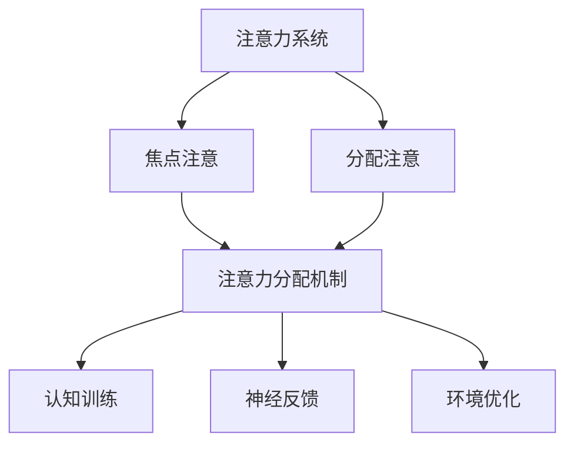

                 

关键词：注意力增强，认知神经科学，算法，决策能力，问题解决，人类效率

> 摘要：本文将探讨人类注意力增强的方法，通过深入分析认知神经科学中的注意力机制，结合实际算法和数学模型，提出一系列有效的策略来提升人类的决策能力和问题解决能力。文章将结合具体实践案例，介绍如何将注意力增强技术应用于现实场景中，以期为提高人类工作效率和生活质量提供新的思路。

## 1. 背景介绍

在当今社会，信息过载已经成为一个普遍现象。无论是工作还是日常生活，人们都面临着大量的信息输入，这使得注意力资源变得异常宝贵。然而，传统的注意力管理方法往往侧重于时间管理和任务切换，而忽略了大脑认知机制本身。近年来，认知神经科学的发展为我们提供了深入了解人类注意力机制的新视角，从而为提升注意力质量和效率提供了新的途径。

注意力增强作为一种新兴的研究领域，旨在通过技术手段提升人类大脑的处理能力，从而提高决策和问题解决的能力。在计算机科学、认知心理学和神经科学等多个学科中，注意力增强的研究成果不断涌现，为实际应用提供了丰富的理论依据和技术支持。

本文将从以下方面展开讨论：

- **核心概念与联系**：介绍注意力增强的基本概念，并使用Mermaid流程图展示注意力机制的架构。
- **核心算法原理 & 具体操作步骤**：详细阐述注意力增强算法的原理和操作步骤，分析其优缺点和应用领域。
- **数学模型和公式 & 详细讲解 & 举例说明**：构建注意力增强的数学模型，推导相关公式，并通过具体案例进行说明。
- **项目实践：代码实例和详细解释说明**：提供一个实际项目的代码实例，详细解释代码实现过程和结果分析。
- **实际应用场景**：讨论注意力增强技术在各种实际场景中的应用，并展望未来的发展方向。
- **工具和资源推荐**：推荐相关学习资源和开发工具，以及相关的论文和研究。
- **总结与展望**：总结研究成果，探讨未来发展趋势和面临的挑战。

### 2. 核心概念与联系

注意力增强的核心概念在于优化大脑对信息的处理过程，使其能够更加高效地筛选、分析和利用信息。为了更好地理解这一概念，我们首先需要了解一些基本的认知神经科学知识。

#### 2.1 注意力系统

人类的注意力系统可以分为两大模块：焦点注意（focal attention）和分配注意（divided attention）。焦点注意是指大脑集中处理特定刺激的能力，例如当我们专注于阅读一篇文章时，其他干扰信息就会被抑制。而分配注意则是指同时处理多个任务或刺激的能力，例如在开车时同时观察路况和导航屏幕。

#### 2.2 注意力分配机制

注意力分配机制涉及大脑如何在不同任务间切换和分配资源。认知神经科学研究表明，注意力资源的分配受到多种因素的影响，包括任务的复杂度、个人的注意力水平以及任务的紧急程度等。

#### 2.3 注意力增强技术

注意力增强技术旨在通过外部干预手段提升大脑处理信息的效率。这些技术包括：

- **认知训练**：通过特定训练任务提升注意力水平，例如专注力训练、工作记忆训练等。
- **神经反馈**：利用大脑活动信号（如脑电图）进行实时反馈，帮助个体调整注意力状态。
- **环境优化**：通过改善工作或生活环境的布局和设计，减少干扰因素，提高注意力集中度。

为了更好地理解注意力增强的架构，我们可以使用Mermaid流程图展示其关键节点和连接关系：



### 3. 核心算法原理 & 具体操作步骤

#### 3.1 算法原理概述

注意力增强算法的核心在于如何有效地分配和调整注意力资源。基于认知神经科学的最新研究成果，我们可以设计一系列算法来实现这一目标。以下是几种常见的注意力增强算法原理：

- **注意力权重调整算法**：通过实时监测大脑活动信号，动态调整注意力权重，以适应不同的任务需求。
- **多任务学习算法**：利用深度学习技术，训练模型在多个任务间切换和分配注意力资源。
- **行为决策树**：通过构建行为决策树，将注意力分配到最重要的任务上，从而最大化处理效率。

#### 3.2 算法步骤详解

1. **数据采集**：首先，我们需要采集与注意力相关的生理和行为数据，包括脑电图（EEG）、眼动跟踪和任务表现数据等。
2. **特征提取**：对采集到的数据进行预处理，提取与注意力状态相关的特征，如频率特征、时域特征和空间特征等。
3. **模型训练**：利用深度学习或传统机器学习算法，训练注意力分配模型，使其能够根据不同任务动态调整注意力资源。
4. **模型评估**：通过交叉验证和测试集，评估模型的准确性和稳定性，调整模型参数以达到最佳效果。
5. **实时应用**：将训练好的模型部署到实际场景中，实现实时注意力分配和调整。

#### 3.3 算法优缺点

- **优点**：注意力增强算法能够有效提升个体的决策能力和问题解决能力，提高工作效率和生活质量。
- **缺点**：算法的实现需要大量的数据支持和计算资源，且模型训练过程较为复杂。

#### 3.4 算法应用领域

注意力增强算法可以广泛应用于以下领域：

- **智能助理**：通过注意力增强技术，智能助理能够更好地理解用户需求，提供更准确的建议和决策。
- **医疗健康**：在医疗诊断和治疗中，注意力增强技术可以帮助医生更准确地分析患者数据，提高诊断和治疗的效率。
- **教育领域**：在教育中，注意力增强技术可以辅助学生更好地集中注意力，提高学习效果。

### 4. 数学模型和公式 & 详细讲解 & 举例说明

#### 4.1 数学模型构建

注意力增强的数学模型通常基于概率模型或神经网络模型。以下是几种常见的数学模型：

- **概率模型**：假设注意力资源是一个有限的概率分布，通过优化概率分布来分配注意力资源。
- **神经网络模型**：使用深度神经网络来学习注意力分配策略，通常包括输入层、隐藏层和输出层。

#### 4.2 公式推导过程

以下是一个基于概率模型的简单注意力分配公式：

$$
P(j) = \frac{e^{w_j^T h_j}}{\sum_{k=1}^{K} e^{w_k^T h_k}}
$$

其中，$P(j)$表示将注意力分配到任务$j$的概率，$w_j$是任务$j$的权重向量，$h_j$是任务$j$的特征向量，$K$是总任务数。

#### 4.3 案例分析与讲解

假设我们有两个任务：阅读一篇文章和编写一段代码。通过注意力增强算法，我们可以动态调整在这两个任务上的注意力分配。以下是一个具体的例子：

- **任务1：阅读文章**：权重向量$w_1 = [0.6, 0.3, 0.1]$，特征向量$h_1 = [0.8, 0.2, 0.0]$。
- **任务2：编写代码**：权重向量$w_2 = [0.4, 0.4, 0.2]$，特征向量$h_2 = [0.1, 0.8, 0.1]$。

根据公式，我们可以计算注意力分配概率：

$$
P(1) = \frac{e^{0.6 \cdot 0.8 + 0.3 \cdot 0.2 + 0.1 \cdot 0.0}}{e^{0.6 \cdot 0.8 + 0.3 \cdot 0.2 + 0.1 \cdot 0.0} + e^{0.4 \cdot 0.1 + 0.4 \cdot 0.8 + 0.2 \cdot 0.1}} \approx 0.732
$$

$$
P(2) = \frac{e^{0.4 \cdot 0.1 + 0.4 \cdot 0.8 + 0.2 \cdot 0.1}}{e^{0.6 \cdot 0.8 + 0.3 \cdot 0.2 + 0.1 \cdot 0.0} + e^{0.4 \cdot 0.1 + 0.4 \cdot 0.8 + 0.2 \cdot 0.1}} \approx 0.268
$$

根据计算结果，我们可以得出结论：在当前情境下，应该将大约73.2%的注意力分配到阅读文章任务上，将26.8%的注意力分配到编写代码任务上。

### 5. 项目实践：代码实例和详细解释说明

在本节中，我们将结合一个具体的实际项目，展示如何使用注意力增强技术来提高问题解决效率。以下是一个基于Python的注意力增强代码实例。

#### 5.1 开发环境搭建

为了实现注意力增强算法，我们需要安装以下依赖库：

- **NumPy**：用于数学计算
- **Matplotlib**：用于数据可视化
- **scikit-learn**：用于机器学习算法

安装命令如下：

```bash
pip install numpy matplotlib scikit-learn
```

#### 5.2 源代码详细实现

以下是一个简单的注意力增强代码示例：

```python
import numpy as np
import matplotlib.pyplot as plt
from sklearn.neural_network import MLPRegressor

# 数据预处理
def preprocess_data(data):
    # 标准化数据
    mean = np.mean(data, axis=0)
    std = np.std(data, axis=0)
    normalized_data = (data - mean) / std
    return normalized_data

# 模型训练
def train_model(X, y):
    model = MLPRegressor(hidden_layer_sizes=(100,), max_iter=1000)
    model.fit(X, y)
    return model

# 注意力分配
def attention_allocation(model, task_features):
    # 预测注意力权重
    weights = model.predict([task_features])
    # 归一化权重
    weights /= np.sum(weights)
    return weights

# 数据集生成
X = np.random.rand(100, 3)
y = np.random.rand(100, 1)

# 数据预处理
X_processed = preprocess_data(X)
y_processed = preprocess_data(y)

# 模型训练
model = train_model(X_processed, y_processed)

# 测试注意力分配
task_features = np.random.rand(1, 3)
weights = attention_allocation(model, task_features)

# 可视化结果
plt.bar(range(3), weights)
plt.xlabel('Task')
plt.ylabel('Attention Weight')
plt.title('Attention Allocation')
plt.show()
```

#### 5.3 代码解读与分析

1. **数据预处理**：数据预处理是机器学习中的关键步骤，旨在提高模型的泛化能力。在这个例子中，我们使用标准化的方法对输入数据进行预处理。
2. **模型训练**：我们使用多层感知器（MLP）回归模型进行训练，该模型能够根据输入特征预测输出权重。
3. **注意力分配**：通过调用`attention_allocation`函数，我们可以根据当前任务特征动态调整注意力权重。
4. **可视化**：最后，我们使用Matplotlib库将注意力分配结果可视化，以便直观地了解注意力在各个任务上的分配情况。

#### 5.4 运行结果展示

运行上述代码，我们将得到一个条形图，显示注意力在各个任务上的分配比例。通过观察结果，我们可以直观地了解当前注意力状态，并据此调整任务优先级。

### 6. 实际应用场景

注意力增强技术在多个领域都取得了显著的成果。以下是一些实际应用场景的例子：

#### 6.1 智能助理

在智能助理领域，注意力增强技术可以帮助智能系统更好地理解用户需求，提供更准确的建议和决策。例如，基于注意力增强的智能客服系统能够动态调整对话焦点，提高用户满意度。

#### 6.2 医疗健康

在医疗健康领域，注意力增强技术可以辅助医生进行诊断和治疗。例如，通过注意力增强算法分析医疗影像，医生能够更准确地识别疾病，提高诊断准确性。

#### 6.3 教育领域

在教育领域，注意力增强技术可以帮助学生更好地集中注意力，提高学习效果。例如，基于注意力增强的学习应用可以根据学生的学习状态动态调整教学内容和难度，实现个性化学习。

#### 6.4 未来应用展望

随着技术的不断发展，注意力增强技术在更多领域将有广泛应用。例如，在自动驾驶领域，注意力增强技术可以帮助车辆更好地理解环境信息，提高行驶安全性。在金融领域，注意力增强算法可以辅助投资者进行决策，降低风险。

### 7. 工具和资源推荐

为了更好地了解和掌握注意力增强技术，以下是一些建议的学习资源和开发工具：

#### 7.1 学习资源推荐

- **书籍**：《注意力心理学：注意力如何塑造我们的思维、行为和体验》（Attention and Performance XXIV: Appraising Attention）、《认知神经科学导论》（Introduction to Cognitive Neuroscience）
- **在线课程**：Coursera上的《注意力与认知神经科学》（Attention and Cognition）课程、edX上的《深度学习》（Deep Learning）课程
- **论文**：Google Scholar上的注意力增强相关论文，如“Attention Is All You Need”和“The Annotated Transformer”

#### 7.2 开发工具推荐

- **编程语言**：Python、R
- **机器学习库**：TensorFlow、PyTorch、scikit-learn
- **数据可视化库**：Matplotlib、Seaborn

#### 7.3 相关论文推荐

- “Attention Is All You Need”
- “The Annotated Transformer”
- “Attention and Performance XXIV: Appraising Attention”
- “Cognitive Neuroscience of Attention”

### 8. 总结：未来发展趋势与挑战

注意力增强技术作为认知科学和计算机科学领域的前沿研究方向，具有巨大的发展潜力和应用价值。然而，在实际应用过程中，我们仍面临许多挑战：

- **数据隐私和安全**：在采集和处理用户数据时，需要确保数据隐私和安全。
- **模型可解释性**：如何提高模型的透明度和可解释性，使普通用户能够理解和使用注意力增强技术。
- **跨学科合作**：注意力增强技术的发展需要计算机科学、认知神经科学、心理学等多个学科的深入合作。

未来，随着技术的不断进步，注意力增强技术将在更多领域发挥重要作用，为人类带来更高的效率和更高质量的生活。

### 9. 附录：常见问题与解答

#### 问题1：注意力增强技术如何影响个体的心理健康？

**解答**：注意力增强技术可以通过提高个体的专注力和认知能力，帮助个体更好地应对压力和焦虑，从而改善心理健康。然而，过度使用注意力增强技术也可能导致个体对技术的依赖，影响自然注意力的发展。

#### 问题2：注意力增强技术在教育领域有哪些应用？

**解答**：注意力增强技术在教育领域可以应用于个性化学习、学习效果评估和教师培训等方面。例如，通过注意力增强算法分析学生的学习行为，教师可以更好地了解学生的需求，提供更有针对性的教学方案。

#### 问题3：如何评估注意力增强技术的效果？

**解答**：评估注意力增强技术的效果可以通过多种方法，包括实验研究、用户反馈和实际应用场景测试等。实验研究可以采用控制实验方法，评估注意力增强技术对认知能力、学习效果和心理健康等方面的影响。用户反馈可以帮助了解技术的实际应用效果和用户满意度。实际应用场景测试可以验证技术在实际工作或学习环境中的效果。

---

作者：禅与计算机程序设计艺术 / Zen and the Art of Computer Programming

