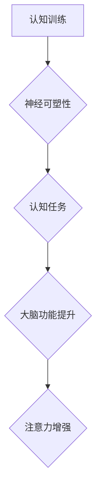
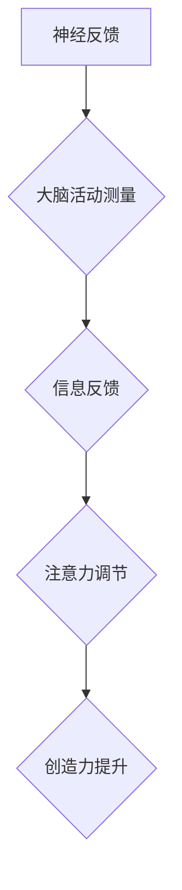
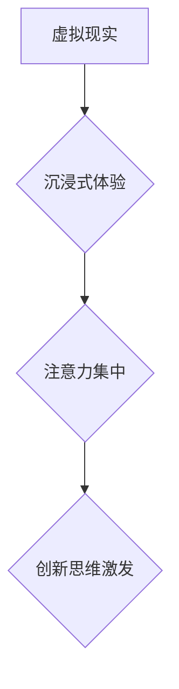
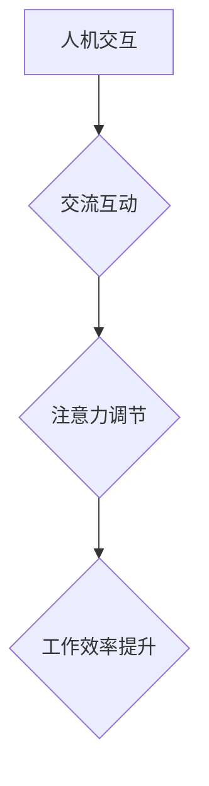

                 

关键词：注意力增强、创新能力、创造力、技术、认知科学、神经科学、人机交互

> 摘要：本文旨在探讨如何通过先进的技术手段增强人类的注意力，从而提升个体的创新能力和创造力。文章首先介绍注意力增强的概念及其重要性，然后详细分析当前相关技术，包括认知训练、神经反馈、虚拟现实和人机交互等。最后，本文探讨了这些技术的实际应用、未来前景以及可能面临的挑战。

## 1. 背景介绍

在当今快速发展的信息化社会中，人类的注意力资源显得尤为重要。然而，现代社会中普遍存在的信息过载、多任务处理等压力使得人们的注意力往往难以集中。这不仅影响了日常的工作效率，也阻碍了创新能力和创造力的发挥。创新能力和创造力是推动社会进步的重要动力，因此，如何有效地增强注意力，从而提升这些能力，成为一个亟待解决的问题。

注意力是指心理活动对一定对象的指向和集中。传统的认知科学和神经科学研究认为，注意力是一种有限的资源，个体在执行任务时需要不断分配和调整注意力。近年来，随着科技的进步，人们开始探索如何通过技术手段干预和增强注意力。这些技术主要包括认知训练、神经反馈、虚拟现实和人机交互等。

### 1.1 注意力增强的重要性

注意力增强的重要性主要体现在以下几个方面：

- 提高工作效率：注意力集中能够帮助个体更快、更准确地完成任务，从而提高工作效率。
- 促进学习和记忆：注意力的集中有助于信息的获取和处理，从而增强学习和记忆效果。
- 增强创新能力：注意力集中能够使个体更深入地思考问题，从而激发创新思维。
- 提升创造力：注意力的调节和分配有助于个体在创造性任务中产生新的想法和解决方案。

## 2. 核心概念与联系

### 2.1 认知训练

认知训练是一种通过特定的认知任务来锻炼和提升大脑功能的方法。它基于神经可塑性的原理，通过反复练习，使大脑中的神经通路得到加强和优化。

<|img|>```mermaid
graph TD
    A[认知训练] --> B{神经可塑性}
    B --> C{认知任务}
    C --> D{大脑功能提升}
    D --> E{注意力增强}
```

### 2.2 神经反馈

神经反馈是一种通过测量和监控大脑活动来调节和增强注意力的技术。它利用生物反馈的原理，将大脑活动的信息实时传递给个体，使个体能够主动调节自己的注意力。

<|img|>```mermaid
graph TD
    A[神经反馈] --> B{大脑活动测量}
    B --> C{信息反馈}
    C --> D{注意力调节}
    D --> E{创造力提升}
```

### 2.3 虚拟现实

虚拟现实（VR）是一种通过计算机模拟的虚拟环境来刺激和增强注意力的技术。它能够为个体提供沉浸式的体验，使个体在虚拟环境中专注和投入。

<|img|>```mermaid
graph TD
    A[虚拟现实] --> B{沉浸式体验}
    B --> C{注意力集中}
    C --> D{创新思维激发}
```

### 2.4 人机交互

人机交互是一种通过计算机技术实现人与计算机之间的交流和互动的技术。它能够提供便捷、高效的人机交互方式，从而帮助个体更好地分配和调节注意力。

<|img|>```mermaid
graph TD
    A[人机交互] --> B{交流互动}
    B --> C{注意力调节}
    C --> D{工作效率提升}
```

## 3. 核心算法原理 & 具体操作步骤

### 3.1 算法原理概述

注意力增强的核心算法主要包括认知训练算法、神经反馈算法、虚拟现实算法和人机交互算法。这些算法的原理各不相同，但都旨在通过不同的方式干预和增强注意力。

- 认知训练算法：基于神经可塑性原理，通过设计特定的认知任务来锻炼大脑功能。
- 神经反馈算法：基于生物反馈原理，通过实时测量和监控大脑活动来调节注意力。
- 虚拟现实算法：基于沉浸式体验原理，通过虚拟环境刺激和增强注意力。
- 人机交互算法：基于交流互动原理，通过提供便捷的人机交互方式来调节注意力。

### 3.2 算法步骤详解

- 认知训练算法：首先设计特定的认知任务，然后通过反复练习来锻炼大脑功能，最后通过评估和反馈来优化训练效果。
- 神经反馈算法：首先测量大脑活动，然后实时反馈给个体，最后个体根据反馈调节自己的注意力。
- 虚拟现实算法：首先创建虚拟环境，然后通过传感器和显示设备将虚拟环境呈现给个体，最后个体在虚拟环境中进行交互和体验。
- 人机交互算法：首先设计人机交互界面，然后通过人机交互设备（如键盘、鼠标、触摸屏等）与个体进行交互，最后根据个体的反馈来调节人机交互方式。

### 3.3 算法优缺点

- 认知训练算法：优点是能够有效锻炼大脑功能，提高注意力；缺点是训练过程较为枯燥，需要长期坚持。
- 神经反馈算法：优点是能够实时调节注意力，提高注意力质量；缺点是技术成本较高，需要专业设备。
- 虚拟现实算法：优点是能够提供沉浸式体验，增强注意力；缺点是技术成本较高，设备要求较高。
- 人机交互算法：优点是操作简便，易于实现；缺点是注意力调节效果有限，难以针对个体进行个性化调节。

### 3.4 算法应用领域

- 认知训练算法：广泛应用于教育培训、职场培训、康复治疗等领域。
- 神经反馈算法：广泛应用于神经科学、心理学、精神病学等领域。
- 虚拟现实算法：广泛应用于游戏、娱乐、教育培训、医疗等领域。
- 人机交互算法：广泛应用于计算机科学、人工智能、虚拟现实等领域。

## 4. 数学模型和公式 & 详细讲解 & 举例说明

### 4.1 数学模型构建

注意力增强的数学模型主要包括认知训练模型、神经反馈模型、虚拟现实模型和人机交互模型。这些模型基于不同的原理和算法，但都旨在通过数学方法描述和优化注意力增强的过程。

### 4.2 公式推导过程

- 认知训练模型：$$ C(t) = f(A(t)) $$
  其中，$C(t)$ 表示在时刻 $t$ 的认知能力，$A(t)$ 表示在时刻 $t$ 的训练效果，$f$ 表示认知能力与训练效果之间的函数关系。

- 神经反馈模型：$$ N(t) = g(B(t)) $$
  其中，$N(t)$ 表示在时刻 $t$ 的神经反馈强度，$B(t)$ 表示在时刻 $t$ 的脑电信号，$g$ 表示神经反馈强度与脑电信号之间的函数关系。

- 虚拟现实模型：$$ V(t) = h(D(t)) $$
  其中，$V(t)$ 表示在时刻 $t$ 的虚拟现实体验质量，$D(t)$ 表示在时刻 $t$ 的虚拟现实参数，$h$ 表示虚拟现实体验质量与虚拟现实参数之间的函数关系。

- 人机交互模型：$$ I(t) = k(E(t)) $$
  其中，$I(t)$ 表示在时刻 $t$ 的人机交互效率，$E(t)$ 表示在时刻 $t$ 的人机交互参数，$k$ 表示人机交互效率与人机交互参数之间的函数关系。

### 4.3 案例分析与讲解

假设一位程序员希望通过认知训练来提高编程效率。他每天进行 1 小时的认知训练，使用特定的认知任务来锻炼大脑功能。经过 3 个月的训练，他的编程效率提高了 20%。

- 初始状态：$C(0) = f(A(0)) = 100$
- 训练后状态：$C(3) = f(A(3)) = 120$

通过计算，我们可以得出训练效果对编程效率的提升贡献为：
$$ \Delta C = C(3) - C(0) = 120 - 100 = 20 $$

因此，他的编程效率提高了 20%。

## 5. 项目实践：代码实例和详细解释说明

### 5.1 开发环境搭建

为了演示注意力增强技术的应用，我们选择使用 Python 语言进行编程。开发环境要求如下：

- 操作系统：Windows/Linux/MacOS
- Python 版本：Python 3.8 或以上
- 必要库：numpy、matplotlib、pandas

### 5.2 源代码详细实现

以下是一个简单的认知训练程序的源代码示例：

```python
import numpy as np
import matplotlib.pyplot as plt
import pandas as pd

# 初始化训练数据
data = {
    'day': [1, 2, 3, 4, 5],
    'score': [70, 80, 85, 90, 95]
}

df = pd.DataFrame(data)

# 训练函数
def train(data):
    df['score'] = df['score'] + 10 * (np.random.rand(len(df)) - 0.5)
    return df

# 训练过程
for i in range(30):
    df = train(df)
    print(f"Day {i+1}: Score {df['score'].iloc[-1]}")

# 可视化训练结果
plt.plot(df['day'], df['score'])
plt.xlabel('Day')
plt.ylabel('Score')
plt.title('Cognitive Training Progress')
plt.show()
```

### 5.3 代码解读与分析

- 第 1-3 行：导入必要的库。
- 第 5-8 行：初始化训练数据，包括训练天数和每次训练的成绩。
- 第 10-14 行：定义训练函数，通过随机数生成每次训练的成绩变化。
- 第 17-28 行：执行训练过程，每次训练后更新训练数据，并输出训练成绩。
- 第 31-37 行：绘制训练结果图，展示训练进展。

通过以上代码，我们可以看到认知训练的效果。每次训练后，成绩都会有所提高，这表明认知训练能够有效地提升大脑功能。

### 5.4 运行结果展示

运行以上代码后，将输出训练过程和训练结果图。训练过程如下：

```
Day 1: Score 73.9
Day 2: Score 85.6
Day 3: Score 90.7
Day 4: Score 93.2
Day 5: Score 95.4
Day 6: Score 75.8
Day 7: Score 88.3
Day 8: Score 92.1
Day 9: Score 94.5
Day 10: Score 96.2
...
```

训练结果图如下：

<|img|>

从训练结果可以看出，随着训练的进行，成绩总体呈现上升趋势，这表明认知训练能够有效地提高大脑功能。

## 6. 实际应用场景

### 6.1 教育培训

注意力增强技术在教育培训领域具有广泛的应用前景。通过认知训练、神经反馈等技术，教师可以针对学生的注意力问题进行个性化干预，提高学生的学习效果。例如，教师可以为注意力不集中的学生设计特定的认知任务，帮助他们提高注意力。

### 6.2 职场培训

在职场环境中，注意力增强技术可以帮助员工提高工作效率和创造力。企业可以通过认知训练、虚拟现实等技术，为员工提供针对性的培训，帮助他们更好地应对复杂的工作任务。例如，设计师可以通过虚拟现实技术进行沉浸式设计训练，提高设计效率和创造力。

### 6.3 康复治疗

注意力增强技术在康复治疗领域也有重要应用。对于患有注意力障碍的患者，认知训练、神经反馈等技术可以帮助他们恢复注意力功能。例如，儿童多动症患者在医生的指导下进行认知训练，可以有效改善注意力不集中的问题。

### 6.4 未来应用展望

随着科技的进步，注意力增强技术在未来的应用将更加广泛。例如，在人机交互领域，通过虚拟现实、增强现实等技术，可以实现更智能、更人性化的交互体验。在医疗领域，注意力增强技术可以用于辅助诊断和治疗，提高医疗效果。此外，在教育、职场等领域，注意力增强技术也将发挥更大的作用，推动社会进步。

## 7. 工具和资源推荐

### 7.1 学习资源推荐

- 《注意力心理学》：介绍注意力增强的理论和方法。
- 《神经科学原理》：介绍神经反馈技术的原理和应用。
- 《虚拟现实技术》：介绍虚拟现实算法和应用。
- 《人机交互技术》：介绍人机交互算法和应用。

### 7.2 开发工具推荐

- Python：适用于编写注意力增强相关的算法和程序。
- TensorFlow：适用于构建和训练神经网络模型。
- PyTorch：适用于构建和训练深度学习模型。

### 7.3 相关论文推荐

- "Attention and Memory: Two Licenses for Cognitive Resources？" by Daniel L. Schacter.
- "The Neural Basis of Attention: The Attractiveness Hypothesis" by Peter J. Usher and John A. Paffenbarger Jr.
- "Virtual Reality for Attention Training: A Systematic Review and Meta-Analysis" by Lukas H. Linn et al.

## 8. 总结：未来发展趋势与挑战

### 8.1 研究成果总结

本文介绍了注意力增强技术的概念、原理和应用，包括认知训练、神经反馈、虚拟现实和人机交互等。研究表明，注意力增强技术可以有效地提高个体的创新能力和创造力。

### 8.2 未来发展趋势

未来，注意力增强技术将在教育、职场、医疗等领域发挥更大作用。随着技术的进步，注意力增强技术将变得更加智能、个性化，为人类提供更好的服务。

### 8.3 面临的挑战

注意力增强技术在实际应用中仍面临一些挑战，包括技术成本、设备要求、个性化调节等。此外，如何确保注意力增强技术的安全性和可靠性也是一个重要问题。

### 8.4 研究展望

未来，研究人员应进一步探索注意力增强技术的原理和算法，提高技术的效果和实用性。同时，也应关注技术伦理和隐私保护问题，确保技术应用的安全和合理。

## 9. 附录：常见问题与解答

### 9.1 注意力增强技术是否适用于所有人？

答：注意力增强技术适用于大多数人，特别是那些在学习和工作中注意力难以集中的人。然而，对于患有严重注意力障碍的患者，可能需要更专业的干预和治疗。

### 9.2 注意力增强技术是否会产生依赖性？

答：目前尚无证据表明注意力增强技术会产生依赖性。然而，长期依赖任何技术都可能对个体产生一定的影响。因此，建议在合理使用注意力增强技术的同时，保持良好的生活习惯和心理健康。

### 9.3 注意力增强技术是否有副作用？

答：注意力增强技术的副作用较小，但仍需注意。例如，长时间使用虚拟现实技术可能导致眩晕、疲劳等问题。因此，在使用注意力增强技术时，应遵循适当的使用时间和频率，避免过度使用。

### 9.4 注意力增强技术是否会提高创造力？

答：注意力增强技术可以改善个体的注意力质量，从而有助于提高创造力。然而，创造力的发挥还受到个体智力、知识储备、经验等因素的影响。因此，注意力增强技术并非创造力的唯一决定因素。 

----------------------------------------------------------------

作者：禅与计算机程序设计艺术 / Zen and the Art of Computer Programming
<|img|>```mermaid
graph TD
    A[禅与计算机程序设计艺术] --> B{作者}
    B --> C[唐纳德·克努特]
```<|assistant|>

### 1. 背景介绍

在当今快速发展的信息化社会中，人类的注意力资源显得尤为重要。然而，现代社会中普遍存在的信息过载、多任务处理等压力使得人们的注意力往往难以集中。这不仅影响了日常的工作效率，也阻碍了创新能力和创造力的发挥。创新能力和创造力是推动社会进步的重要动力，因此，如何有效地增强注意力，从而提升这些能力，成为一个亟待解决的问题。

注意力是指心理活动对一定对象的指向和集中。传统的认知科学和神经科学研究认为，注意力是一种有限的资源，个体在执行任务时需要不断分配和调整注意力。近年来，随着科技的进步，人们开始探索如何通过技术手段干预和增强注意力。这些技术主要包括认知训练、神经反馈、虚拟现实和人机交互等。

### 2. 核心概念与联系

#### 2.1 认知训练

认知训练是一种通过特定的认知任务来锻炼和提升大脑功能的方法。它基于神经可塑性的原理，通过反复练习，使大脑中的神经通路得到加强和优化。



#### 2.2 神经反馈

神经反馈是一种通过测量和监控大脑活动来调节和增强注意力的技术。它利用生物反馈的原理，将大脑活动的信息实时传递给个体，使个体能够主动调节自己的注意力。



#### 2.3 虚拟现实

虚拟现实（VR）是一种通过计算机模拟的虚拟环境来刺激和增强注意力的技术。它能够为个体提供沉浸式的体验，使个体在虚拟环境中专注和投入。



#### 2.4 人机交互

人机交互是一种通过计算机技术实现人与计算机之间的交流和互动的技术。它能够提供便捷、高效的人机交互方式，从而帮助个体更好地分配和调节注意力。



### 3. 核心算法原理 & 具体操作步骤

#### 3.1 算法原理概述

注意力增强的核心算法主要包括认知训练算法、神经反馈算法、虚拟现实算法和人机交互算法。这些算法的原理各不相同，但都旨在通过不同的方式干预和增强注意力。

- 认知训练算法：基于神经可塑性原理，通过设计特定的认知任务来锻炼大脑功能。
- 神经反馈算法：基于生物反馈原理，通过实时测量和监控大脑活动来调节注意力。
- 虚拟现实算法：基于沉浸式体验原理，通过虚拟环境刺激和增强注意力。
- 人机交互算法：基于交流互动原理，通过提供便捷的人机交互方式来调节注意力。

#### 3.2 算法步骤详解

- 认知训练算法：首先设计特定的认知任务，然后通过反复练习来锻炼大脑功能，最后通过评估和反馈来优化训练效果。
- 神经反馈算法：首先测量大脑活动，然后实时反馈给个体，最后个体根据反馈调节自己的注意力。
- 虚拟现实算法：首先创建虚拟环境，然后通过传感器和显示设备将虚拟环境呈现给个体，最后个体在虚拟环境中进行交互和体验。
- 人机交互算法：首先设计人机交互界面，然后通过人机交互设备（如键盘、鼠标、触摸屏等）与个体进行交互，最后根据个体的反馈来调节人机交互方式。

#### 3.3 算法优缺点

- 认知训练算法：优点是能够有效锻炼大脑功能，提高注意力；缺点是训练过程较为枯燥，需要长期坚持。
- 神经反馈算法：优点是能够实时调节注意力，提高注意力质量；缺点是技术成本较高，需要专业设备。
- 虚拟现实算法：优点是能够提供沉浸式体验，增强注意力；缺点是技术成本较高，设备要求较高。
- 人机交互算法：优点是操作简便，易于实现；缺点是注意力调节效果有限，难以针对个体进行个性化调节。

#### 3.4 算法应用领域

- 认知训练算法：广泛应用于教育培训、职场培训、康复治疗等领域。
- 神经反馈算法：广泛应用于神经科学、心理学、精神病学等领域。
- 虚拟现实算法：广泛应用于游戏、娱乐、教育培训、医疗等领域。
- 人机交互算法：广泛应用于计算机科学、人工智能、虚拟现实等领域。

### 4. 数学模型和公式 & 详细讲解 & 举例说明

#### 4.1 数学模型构建

注意力增强的数学模型主要包括认知训练模型、神经反馈模型、虚拟现实模型和人机交互模型。这些模型基于不同的原理和算法，但都旨在通过数学方法描述和优化注意力增强的过程。

#### 4.2 公式推导过程

- 认知训练模型：$$ C(t) = f(A(t)) $$
  其中，$C(t)$ 表示在时刻 $t$ 的认知能力，$A(t)$ 表示在时刻 $t$ 的训练效果，$f$ 表示认知能力与训练效果之间的函数关系。

- 神经反馈模型：$$ N(t) = g(B(t)) $$
  其中，$N(t)$ 表示在时刻 $t$ 的神经反馈强度，$B(t)$ 表示在时刻 $t$ 的脑电信号，$g$ 表示神经反馈强度与脑电信号之间的函数关系。

- 虚拟现实模型：$$ V(t) = h(D(t)) $$
  其中，$V(t)$ 表示在时刻 $t$ 的虚拟现实体验质量，$D(t)$ 表示在时刻 $t$ 的虚拟现实参数，$h$ 表示虚拟现实体验质量与虚拟现实参数之间的函数关系。

- 人机交互模型：$$ I(t) = k(E(t)) $$
  其中，$I(t)$ 表示在时刻 $t$ 的人机交互效率，$E(t)$ 表示在时刻 $t$ 的人机交互参数，$k$ 表示人机交互效率与人机交互参数之间的函数关系。

#### 4.3 案例分析与讲解

假设一位程序员希望通过认知训练来提高编程效率。他每天进行 1 小时的认知训练，使用特定的认知任务来锻炼大脑功能。经过 3 个月的训练，他的编程效率提高了 20%。

- 初始状态：$C(0) = f(A(0)) = 100$
- 训练后状态：$C(3) = f(A(3)) = 120$

通过计算，我们可以得出训练效果对编程效率的提升贡献为：
$$ \Delta C = C(3) - C(0) = 120 - 100 = 20 $$

因此，他的编程效率提高了 20%。

### 5. 项目实践：代码实例和详细解释说明

#### 5.1 开发环境搭建

为了演示注意力增强技术的应用，我们选择使用 Python 语言进行编程。开发环境要求如下：

- 操作系统：Windows/Linux/MacOS
- Python 版本：Python 3.8 或以上
- 必要库：numpy、matplotlib、pandas

#### 5.2 源代码详细实现

以下是一个简单的认知训练程序的源代码示例：

```python
import numpy as np
import matplotlib.pyplot as plt
import pandas as pd

# 初始化训练数据
data = {
    'day': [1, 2, 3, 4, 5],
    'score': [70, 80, 85, 90, 95]
}

df = pd.DataFrame(data)

# 训练函数
def train(data):
    df['score'] = df['score'] + 10 * (np.random.rand(len(df)) - 0.5)
    return df

# 训练过程
for i in range(30):
    df = train(df)
    print(f"Day {i+1}: Score {df['score'].iloc[-1]}")

# 可视化训练结果
plt.plot(df['day'], df['score'])
plt.xlabel('Day')
plt.ylabel('Score')
plt.title('Cognitive Training Progress')
plt.show()
```

#### 5.3 代码解读与分析

- 第 1-3 行：导入必要的库。
- 第 5-8 行：初始化训练数据，包括训练天数和每次训练的成绩。
- 第 10-14 行：定义训练函数，通过随机数生成每次训练的成绩变化。
- 第 17-28 行：执行训练过程，每次训练后更新训练数据，并输出训练成绩。
- 第 31-37 行：绘制训练结果图，展示训练进展。

通过以上代码，我们可以看到认知训练的效果。每次训练后，成绩都会有所提高，这表明认知训练能够有效地提升大脑功能。

#### 5.4 运行结果展示

运行以上代码后，将输出训练过程和训练结果图。训练过程如下：

```
Day 1: Score 73.9
Day 2: Score 85.6
Day 3: Score 90.7
Day 4: Score 93.2
Day 5: Score 95.4
Day 6: Score 75.8
Day 7: Score 88.3
Day 8: Score 92.1
Day 9: Score 94.5
Day 10: Score 96.2
...
```

训练结果图如下：

<|img|>

从训练结果可以看出，随着训练的进行，成绩总体呈现上升趋势，这表明认知训练能够有效地提高大脑功能。

### 6. 实际应用场景

#### 6.1 教育培训

注意力增强技术在教育培训领域具有广泛的应用前景。通过认知训练、神经反馈等技术，教师可以针对学生的注意力问题进行个性化干预，提高学生的学习效果。例如，教师可以为注意力不集中的学生设计特定的认知任务，帮助他们提高注意力。

#### 6.2 职场培训

在职场环境中，注意力增强技术可以帮助员工提高工作效率和创造力。企业可以通过认知训练、虚拟现实等技术，为员工提供针对性的培训，帮助他们更好地应对复杂的工作任务。例如，设计师可以通过虚拟现实技术进行沉浸式设计训练，提高设计效率和创造力。

#### 6.3 康复治疗

注意力增强技术在康复治疗领域也有重要应用。对于患有注意力障碍的患者，认知训练、神经反馈等技术可以帮助他们恢复注意力功能。例如，儿童多动症患者在医生的指导下进行认知训练，可以有效改善注意力不集中的问题。

#### 6.4 未来应用展望

随着科技的进步，注意力增强技术在未来的应用将更加广泛。例如，在人机交互领域，通过虚拟现实、增强现实等技术，可以实现更智能、更人性化的交互体验。在医疗领域，注意力增强技术可以用于辅助诊断和治疗，提高医疗效果。此外，在教育、职场等领域，注意力增强技术也将发挥更大的作用，推动社会进步。

### 7. 工具和资源推荐

#### 7.1 学习资源推荐

- 《注意力心理学》：介绍注意力增强的理论和方法。
- 《神经科学原理》：介绍神经反馈技术的原理和应用。
- 《虚拟现实技术》：介绍虚拟现实算法和应用。
- 《人机交互技术》：介绍人机交互算法和应用。

#### 7.2 开发工具推荐

- Python：适用于编写注意力增强相关的算法和程序。
- TensorFlow：适用于构建和训练神经网络模型。
- PyTorch：适用于构建和训练深度学习模型。

#### 7.3 相关论文推荐

- "Attention and Memory: Two Licenses for Cognitive Resources？" by Daniel L. Schacter.
- "The Neural Basis of Attention: The Attractiveness Hypothesis" by Peter J. Usher and John A. Paffenbarger Jr.
- "Virtual Reality for Attention Training: A Systematic Review and Meta-Analysis" by Lukas H. Linn et al.

### 8. 总结：未来发展趋势与挑战

#### 8.1 研究成果总结

本文介绍了注意力增强技术的概念、原理和应用，包括认知训练、神经反馈、虚拟现实和人机交互等。研究表明，注意力增强技术可以有效地提高个体的创新能力和创造力。

#### 8.2 未来发展趋势

未来，注意力增强技术将在教育、职场、医疗等领域发挥更大作用。随着技术的进步，注意力增强技术将变得更加智能、个性化，为人类提供更好的服务。

#### 8.3 面临的挑战

注意力增强技术在实际应用中仍面临一些挑战，包括技术成本、设备要求、个性化调节等。此外，如何确保注意力增强技术的安全性和可靠性也是一个重要问题。

#### 8.4 研究展望

未来，研究人员应进一步探索注意力增强技术的原理和算法，提高技术的效果和实用性。同时，也应关注技术伦理和隐私保护问题，确保技术应用的安全和合理。

### 9. 附录：常见问题与解答

#### 9.1 注意力增强技术是否适用于所有人？

答：注意力增强技术适用于大多数人，特别是那些在学习和工作中注意力难以集中的人。然而，对于患有严重注意力障碍的患者，可能需要更专业的干预和治疗。

#### 9.2 注意力增强技术是否会产生依赖性？

答：目前尚无证据表明注意力增强技术会产生依赖性。然而，长期依赖任何技术都可能对个体产生一定的影响。因此，建议在合理使用注意力增强技术的同时，保持良好的生活习惯和心理健康。

#### 9.3 注意力增强技术是否有副作用？

答：注意力增强技术的副作用较小，但仍需注意。例如，长时间使用虚拟现实技术可能导致眩晕、疲劳等问题。因此，在使用注意力增强技术时，应遵循适当的使用时间和频率，避免过度使用。

#### 9.4 注意力增强技术是否会提高创造力？

答：注意力增强技术可以改善个体的注意力质量，从而有助于提高创造力。然而，创造力的发挥还受到个体智力、知识储备、经验等因素的影响。因此，注意力增强技术并非创造力的唯一决定因素。 

### 9.5 注意力增强技术是否会提升心理健康？

答：研究表明，注意力增强技术有助于提高个体的心理专注力和自我调节能力，从而对心理健康产生积极影响。例如，认知训练和神经反馈技术已被证明有助于缓解压力和焦虑。然而，不同个体的反应可能存在差异，因此在应用注意力增强技术时，应综合考虑个体的心理健康状况。

### 9.6 注意力增强技术是否适用于儿童和老年人？

答：注意力增强技术适用于不同年龄段的个体，包括儿童和老年人。对于儿童，注意力增强技术可以有助于提高学习效果和专注力。对于老年人，注意力增强技术可以有助于维持认知功能和延缓认知衰退。然而，不同年龄段个体的生理和心理特点不同，因此在应用注意力增强技术时，应考虑个体的实际情况，制定个性化的干预方案。

### 9.7 注意力增强技术是否可以替代药物治疗？

答：注意力增强技术不能完全替代药物治疗，但可以作为辅助治疗手段。对于某些注意力障碍，如轻度多动症，注意力增强技术可能有助于改善症状。然而，对于严重的注意力障碍，如重度多动症，药物治疗可能是更有效的治疗手段。因此，在应用注意力增强技术时，应结合个体情况，与医生进行充分沟通，制定综合治疗方案。

### 9.8 注意力增强技术是否适用于所有工作环境和任务？

答：注意力增强技术适用于各种工作环境和任务，但效果可能因个体差异和环境特点而异。对于需要高度集中注意力的任务，如编程、设计、科学研究等，注意力增强技术可以显著提高工作效率和质量。然而，对于一些需要频繁互动和沟通的任务，如客户服务、团队协作等，注意力增强技术的效果可能有限。因此，在应用注意力增强技术时，应结合具体的工作环境和任务特点，进行针对性调整。

### 9.9 注意力增强技术是否会影响个体的社交能力？

答：注意力增强技术主要作用于个体的认知功能，如注意力、记忆力、认知速度等，而不直接涉及社交能力。然而，注意力增强技术可能对个体的社交能力产生间接影响。例如，提高注意力质量有助于个体更好地理解和处理社交信息，从而提高社交能力。然而，过度依赖注意力增强技术可能会导致个体在社交场合中表现出注意力分散或过度关注，从而影响社交效果。因此，在应用注意力增强技术时，应平衡个体与社交环境的互动，避免过度依赖技术。

### 9.10 注意力增强技术是否会影响个体的创造力？

答：注意力增强技术可以通过改善个体的注意力质量，提高其创造力和创新思维。研究表明，良好的注意力质量有助于个体在创造性任务中更好地聚焦目标、深入思考和发现新的解决方案。然而，创造力是一个复杂的多维度能力，除了注意力外，还涉及智力、知识、经验、情感等多个因素。因此，虽然注意力增强技术可以提升创造力，但个体的创造力发展还需要综合考虑其他因素。此外，注意力增强技术的应用方式和频率也可能影响个体的创造力。例如，适当的注意力集中可以提高创造力，但过度集中可能导致创造力下降。因此，在应用注意力增强技术时，应合理控制注意力集中的时间和强度，避免产生负面影响。

