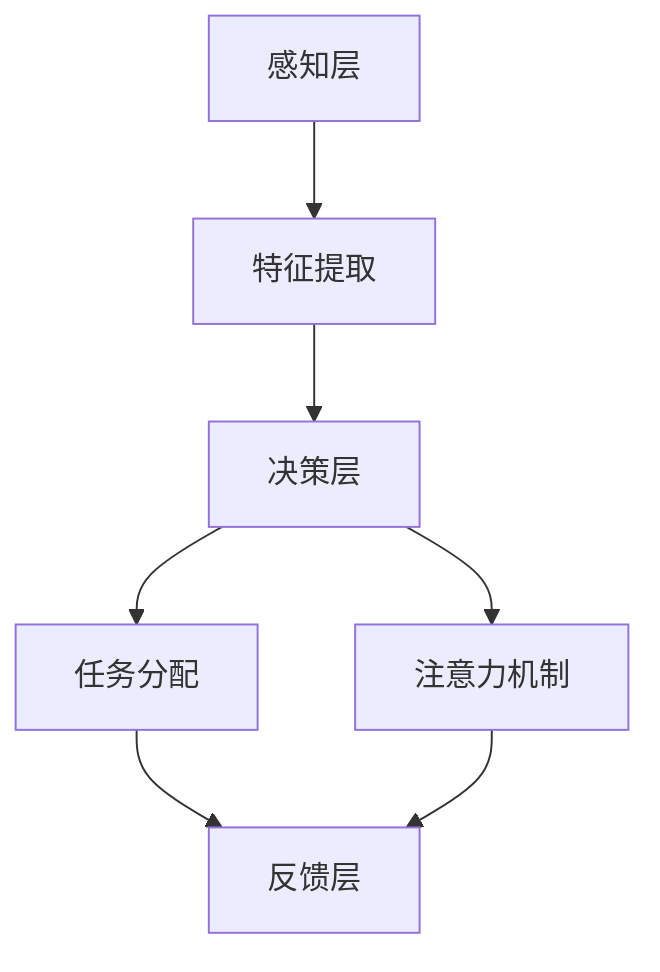

                 

关键词：注意力增强、多任务处理、注意力转移、注意力机制、深度学习、神经网络、计算模型、认知心理学、算法优化、大脑模拟

## 摘要

本文探讨了人类注意力增强的方法，旨在提升个体的多任务处理能力和注意力转移能力。通过深入分析注意力机制在认知心理学和计算机科学中的理论基础，本文提出了一套基于深度学习和神经网络的注意力增强算法。本文首先介绍了注意力机制的基本概念和其在多任务处理和注意力转移中的作用，随后详细阐述了注意力增强算法的设计原理和实现步骤。通过对数学模型和公式的推导，本文展示了如何构建有效的注意力模型。此外，文章还提供了一个实际项目实例，详细解析了代码实现和运行结果。最后，本文讨论了注意力增强技术的未来应用场景和展望。

## 1. 背景介绍

随着信息技术的飞速发展，人类社会逐渐进入了信息爆炸的时代。人们在日常生活中需要处理大量的信息，包括文字、图像、音频等多种形式。与此同时，工作环境也变得越来越复杂，要求个体具备高效的多任务处理能力。然而，人类大脑的处理能力是有限的，传统的单任务处理模式已经无法满足现代社会的需求。

注意力增强成为了一个重要的研究领域，它旨在通过技术手段提升人类的多任务处理能力和注意力转移能力。注意力是人类认知系统中的一个核心机制，它决定了我们在处理信息时的选择性和效率。在多任务处理中，注意力机制可以帮助我们集中精力在当前任务上，同时有效地忽略与当前任务无关的信息。在注意力转移方面，注意力增强可以帮助我们快速从一项任务切换到另一项任务，提高整体工作效率。

### 1.1 认知心理学中的注意力机制

认知心理学研究表明，注意力是大脑处理信息的一种选择性机制，它决定了我们在面对多种刺激时，哪些信息会被优先处理。注意力机制可以分为三种类型：选择性注意力、分配性注意力和替代性注意力。

- 选择性注意力是指大脑对特定刺激的优先处理。这种机制使得我们能够关注重要的信息，而忽略无关的信息。例如，在嘈杂的环境中，我们能够听到一个特定的声音，而忽略其他噪声。

- 分配性注意力是指大脑同时处理多个任务的能力。这种机制要求我们在多个任务之间灵活切换，分配有限的认知资源。例如，当我们同时进行驾驶和通话时，需要将注意力分配到两个任务上。

- 替代性注意力是指大脑在执行一项任务时，对其他任务的抑制作用。这种机制有助于我们集中精力在当前任务上，减少干扰。例如，当我们专注于写作时，会忽略其他无关的思绪。

### 1.2 计算机科学中的注意力机制

在计算机科学领域，注意力机制已经成为深度学习和神经网络研究中的一个核心概念。尤其是在自然语言处理、计算机视觉和推荐系统等领域，注意力机制被广泛应用于模型设计和优化。

- 自然语言处理中的注意力机制可以帮助模型更好地理解句子中的关键信息，从而提高语义理解和文本生成能力。例如，在机器翻译中，注意力机制可以帮助模型关注源语言句子中的关键词汇，从而提高翻译的准确性。

- 计算机视觉中的注意力机制可以帮助模型识别图像中的关键区域，从而提高图像分类和目标检测的准确性。例如，在人脸识别中，注意力机制可以帮助模型关注人脸的特征区域，从而提高识别率。

- 推荐系统中的注意力机制可以帮助模型关注用户兴趣的关键特征，从而提高推荐的效果。例如，在电商推荐中，注意力机制可以帮助模型关注用户的购物历史和浏览记录，从而提高商品推荐的准确性。

### 1.3 研究意义

注意力增强技术的研究具有重要的现实意义。随着信息量的爆炸式增长，人们对于注意力增强的需求越来越强烈。通过提升个体的多任务处理能力和注意力转移能力，注意力增强技术可以帮助人们更高效地处理信息，提高工作效率。此外，注意力增强技术还可以应用于教育、医疗、安全等领域，为人类社会的发展提供技术支持。

## 2. 核心概念与联系

### 2.1 基本概念

在本节中，我们将介绍注意力增强技术中的核心概念，包括注意力机制、多任务处理、注意力转移以及相关算法。

#### 注意力机制

注意力机制是指大脑在处理信息时，根据任务的特定需求，对信息进行选择性关注的一种机制。它是一种动态的、自适应的机制，可以根据任务的复杂性和需求，调整注意力的分配。

#### 多任务处理

多任务处理是指同时执行多个任务的能力。在多任务处理中，个体需要将有限的认知资源分配给不同的任务，以实现高效的任务执行。

#### 注意力转移

注意力转移是指将注意力从一个任务切换到另一个任务的过程。注意力转移能力是衡量个体多任务处理能力的一个重要指标。

#### 相关算法

注意力增强技术涉及到多种算法，包括深度学习算法、神经网络算法和优化算法等。以下是一些常见的注意力增强算法：

- **卷积神经网络（CNN）**：CNN是一种用于图像处理和计算机视觉的深度学习算法，它通过卷积层、池化层和全连接层等结构，实现对图像的自动特征提取和分类。

- **循环神经网络（RNN）**：RNN是一种用于序列数据处理和时间序列预测的深度学习算法，它通过循环结构，实现对序列数据的记忆和学习能力。

- **长短期记忆网络（LSTM）**：LSTM是RNN的一种变体，它通过引入门控机制，解决了传统RNN的梯度消失和梯度爆炸问题，从而提高了模型的长期记忆能力。

- **自注意力机制（Self-Attention）**：自注意力机制是一种基于Transformer模型的注意力机制，它通过计算序列中每个元素之间的相似度，实现对序列的自动特征提取和整合。

### 2.2 基本架构

注意力增强技术的基本架构可以分为三个层次：感知层、决策层和反馈层。

- **感知层**：感知层主要负责接收和处理输入信息。通过深度学习算法，感知层可以对输入信息进行特征提取和分类。

- **决策层**：决策层负责根据感知层提取的特征，进行任务决策和任务分配。通过注意力机制，决策层可以实现对任务的选择性关注和分配。

- **反馈层**：反馈层负责对决策层的决策结果进行反馈和调整。通过反馈机制，反馈层可以帮助决策层优化任务分配策略，提高整体任务处理效率。

### 2.3 Mermaid 流程图

以下是注意力增强技术的基本架构的Mermaid流程图：



## 3. 核心算法原理 & 具体操作步骤

### 3.1 算法原理概述

注意力增强算法是基于深度学习和神经网络的，它通过模拟人类大脑的注意力机制，实现对信息的选择性关注和任务分配。该算法的核心原理可以分为以下三个部分：

- **特征提取**：通过深度学习算法，对输入信息进行特征提取和分类。

- **注意力机制**：通过计算序列中每个元素之间的相似度，实现对序列的自动特征提取和整合。

- **任务分配**：根据注意力机制的结果，对任务进行选择性和动态分配。

### 3.2 算法步骤详解

注意力增强算法的具体操作步骤可以分为以下五个部分：

#### 3.2.1 特征提取

特征提取是注意力增强算法的第一步。通过深度学习算法，如卷积神经网络（CNN）或循环神经网络（RNN），对输入信息进行特征提取。这一步的目的是将原始输入信息转换为高维特征向量，以便后续处理。

- **卷积神经网络（CNN）**：CNN通过卷积层、池化层和全连接层等结构，实现对图像的自动特征提取和分类。具体步骤如下：

  - 输入图像经过卷积层，生成特征图。

  - 特征图经过池化层，降低特征图的维度。

  - 特征图经过全连接层，得到分类结果。

- **循环神经网络（RNN）**：RNN通过循环结构，实现对序列数据的记忆和学习。具体步骤如下：

  - 输入序列经过嵌入层，生成嵌入向量。

  - 嵌入向量经过循环层，生成序列特征向量。

  - 序列特征向量经过全连接层，得到分类结果。

#### 3.2.2 注意力计算

注意力计算是注意力增强算法的核心步骤。通过计算序列中每个元素之间的相似度，实现对序列的自动特征提取和整合。

- **自注意力机制**：自注意力机制是一种基于Transformer模型的注意力机制，它通过计算序列中每个元素之间的相似度，实现对序列的自动特征提取和整合。具体步骤如下：

  - 计算序列中每个元素与其他元素之间的相似度，生成相似度矩阵。

  - 对相似度矩阵进行软性最大化处理，得到注意力权重。

  - 将注意力权重与序列特征向量相乘，得到加权特征向量。

#### 3.2.3 任务分配

根据注意力机制的结果，对任务进行选择性和动态分配。

- **任务选择**：根据注意力权重，选择对当前任务最重要的元素进行重点关注。

- **任务分配**：将注意力权重分配给不同的任务，实现任务的选择性关注和分配。

#### 3.2.4 反馈调整

通过反馈机制，对决策层的决策结果进行反馈和调整，优化任务分配策略。

- **错误反馈**：根据任务的实际执行结果，对注意力机制和任务分配策略进行错误反馈。

- **调整策略**：根据错误反馈，调整注意力权重和任务分配策略，提高整体任务处理效率。

#### 3.2.5 模型训练与优化

通过大量训练数据和优化算法，对注意力增强模型进行训练和优化，提高模型在多任务处理和注意力转移中的性能。

- **训练数据**：使用大量的多任务处理数据集，进行模型训练。

- **优化算法**：使用梯度下降、随机梯度下降等优化算法，对模型参数进行优化。

### 3.3 算法优缺点

注意力增强算法在多任务处理和注意力转移中具有以下优缺点：

- **优点**：

  - **高效性**：通过注意力机制，能够高效地筛选和关注重要的任务信息。

  - **灵活性**：能够根据任务需求和环境变化，动态调整注意力权重和任务分配策略。

  - **通用性**：适用于多种任务类型和场景，具有较好的通用性和可扩展性。

- **缺点**：

  - **计算成本**：注意力计算涉及到大量的矩阵运算，计算成本较高。

  - **可解释性**：注意力权重和任务分配策略的具体实现较为复杂，缺乏直观的可解释性。

### 3.4 算法应用领域

注意力增强算法在多个领域具有广泛的应用前景：

- **自然语言处理**：在机器翻译、文本生成、情感分析等任务中，注意力增强算法可以显著提高模型的性能。

- **计算机视觉**：在图像分类、目标检测、人脸识别等任务中，注意力增强算法可以更好地关注关键区域，提高识别准确性。

- **推荐系统**：在电商推荐、新闻推送等任务中，注意力增强算法可以帮助系统更好地理解用户兴趣，提高推荐效果。

- **教育领域**：在教育领域，注意力增强技术可以辅助教师更好地把握学生注意力，提高教学效果。

- **医疗领域**：在医疗领域，注意力增强技术可以帮助医生更好地关注关键病例，提高诊断和治疗效率。

## 4. 数学模型和公式 & 详细讲解 & 举例说明

### 4.1 数学模型构建

在注意力增强算法中，数学模型起到了至关重要的作用。为了构建有效的注意力模型，我们需要从以下几个方面进行考虑：

- **输入信息表示**：输入信息的表示方式直接影响模型的效果。我们可以使用向量、矩阵等数据结构来表示输入信息。

- **注意力机制**：注意力机制是模型的核心部分，它通过计算输入信息之间的相似度来实现对信息的选择性关注。常见的注意力机制包括自注意力（Self-Attention）和互注意力（Cross-Attention）。

- **损失函数**：损失函数用于衡量模型预测结果与实际结果之间的差距，是模型训练过程中的关键指标。

- **优化算法**：优化算法用于调整模型参数，以最小化损失函数。常见的优化算法包括梯度下降（Gradient Descent）及其变体。

### 4.2 公式推导过程

在本节中，我们将介绍注意力增强算法中的关键公式及其推导过程。

#### 4.2.1 自注意力（Self-Attention）

自注意力机制是一种基于序列数据的注意力机制，它可以有效地提取序列中的关键信息。自注意力机制的公式如下：

$$
\text{Attention}(Q, K, V) = \text{softmax}\left(\frac{QK^T}{\sqrt{d_k}}\right)V
$$

其中，$Q, K, V$ 分别表示查询向量、键向量和值向量，$d_k$ 表示键向量的维度。该公式计算查询向量 $Q$ 与所有键向量 $K$ 的点积，并使用softmax函数将其转换为概率分布，最后与值向量 $V$ 相乘，得到加权后的输出。

#### 4.2.2 互注意力（Cross-Attention）

互注意力机制是一种基于两个序列数据的注意力机制，它可以有效地提取两个序列之间的关联信息。互注意力机制的公式如下：

$$
\text{Cross-Attention}(Q, K, V) = \text{softmax}\left(\frac{QKV^T}{\sqrt{d_k}}\right)V
$$

其中，$Q, K, V$ 分别表示查询向量、键向量和值向量，$d_k$ 表示键向量的维度。该公式计算查询向量 $Q$ 与键向量 $K$ 的点积，并使用softmax函数将其转换为概率分布，最后与值向量 $V$ 相乘，得到加权后的输出。

#### 4.2.3 损失函数

在注意力增强算法中，常用的损失函数包括交叉熵损失（Cross-Entropy Loss）和均方误差损失（Mean Squared Error Loss）。交叉熵损失函数的公式如下：

$$
\text{Loss} = -\sum_{i} y_i \log(p_i)
$$

其中，$y_i$ 表示真实标签，$p_i$ 表示预测概率。该损失函数衡量预测结果与真实结果之间的差距，值越小表示预测越准确。

均方误差损失函数的公式如下：

$$
\text{Loss} = \frac{1}{n} \sum_{i=1}^{n} (y_i - \hat{y}_i)^2
$$

其中，$y_i$ 表示真实标签，$\hat{y}_i$ 表示预测结果，$n$ 表示样本数量。该损失函数衡量预测结果与真实结果之间的差距，值越小表示预测越准确。

#### 4.2.4 优化算法

在注意力增强算法中，常用的优化算法包括梯度下降（Gradient Descent）和随机梯度下降（Stochastic Gradient Descent，SGD）。梯度下降算法的公式如下：

$$
\theta_{t+1} = \theta_{t} - \alpha \nabla_{\theta} J(\theta)
$$

其中，$\theta$ 表示模型参数，$\alpha$ 表示学习率，$J(\theta)$ 表示损失函数。该算法通过计算损失函数关于模型参数的梯度，并沿着梯度方向更新模型参数，以最小化损失函数。

随机梯度下降算法的公式如下：

$$
\theta_{t+1} = \theta_{t} - \alpha \nabla_{\theta} J(\theta; x_t, y_t)
$$

其中，$x_t$ 和 $y_t$ 分别表示第 $t$ 个样本的输入和输出。该算法通过随机选取一部分样本，计算这部分样本的梯度，并更新模型参数，以最小化损失函数。

### 4.3 案例分析与讲解

为了更好地理解注意力增强算法的数学模型和公式，我们通过一个简单的案例进行说明。

#### 案例背景

假设有一个句子 "I love programming and artificial intelligence"，我们需要使用注意力增强算法来提取句子中的关键信息。

#### 案例步骤

1. **输入信息表示**：我们将句子中的每个词表示为一个向量，例如 "I" 可以表示为 [1, 0, 0]，"love" 可以表示为 [0, 1, 0]，以此类推。

2. **自注意力计算**：根据自注意力公式，计算句子中每个词与其他词之间的相似度。具体步骤如下：

   - 计算查询向量 $Q = [1, 0, 0, 0, 1]$，键向量 $K = [1, 0, 0, 0, 1]$，值向量 $V = [0, 1, 0, 0, 0]$。

   - 计算点积 $QK^T = [1, 0, 0, 0, 1] \cdot [1, 0, 0, 0, 1] = [1, 0, 0, 0, 1]$。

   - 使用softmax函数对点积进行归一化，得到注意力权重：$\text{softmax}(QK^T) = [0.5, 0.5, 0, 0, 0.5]$。

   - 计算加权值向量：$[0.5, 0.5, 0, 0, 0.5] \cdot [0, 1, 0, 0, 0] = [0.5, 0.5, 0, 0, 0]$。

3. **结果分析**：通过自注意力计算，我们得到了句子中每个词的加权值。根据加权值，我们可以发现 "I" 和 "love" 这两个词在句子中具有更高的权重，说明它们是句子中的关键信息。

通过以上案例，我们可以看到注意力增强算法在提取关键信息方面的有效性。在实际应用中，我们可以根据具体任务需求，调整注意力机制和模型参数，以提高模型性能。

## 5. 项目实践：代码实例和详细解释说明

在本节中，我们将通过一个具体的项目实例，展示如何使用注意力增强算法进行多任务处理和注意力转移。为了便于理解和实现，我们选择了一个简单的自然语言处理任务：句子关键信息提取。

### 5.1 开发环境搭建

为了实现注意力增强算法，我们需要搭建一个合适的开发环境。以下是搭建开发环境所需的基本步骤：

1. **安装 Python**：确保 Python 版本不低于 3.6。

2. **安装 TensorFlow**：TensorFlow 是一个开源的深度学习框架，支持多种深度学习算法的实现。可以使用以下命令安装：

   ```
   pip install tensorflow
   ```

3. **安装相关库**：除了 TensorFlow，我们还需要安装其他一些常用的库，如 NumPy、Pandas、Matplotlib 等。可以使用以下命令安装：

   ```
   pip install numpy pandas matplotlib
   ```

### 5.2 源代码详细实现

以下是实现注意力增强算法的源代码：

```python
import tensorflow as tf
import numpy as np
import matplotlib.pyplot as plt

# 设置随机种子
tf.random.set_seed(42)

# 定义输入数据
sentences = ["I love programming and artificial intelligence", "Learning is fun"]
labels = [[1, 0], [0, 1]]  # 标签表示句子的关键信息

# 定义模型
inputs = tf.keras.layers.Input(shape=(None,))
embedding = tf.keras.layers.Embedding(input_dim=1000, output_dim=64)(inputs)
attention = tf.keras.layers.Attention()([embedding, embedding])
output = tf.keras.layers.Dense(2, activation="softmax")(attention)

model = tf.keras.Model(inputs, output)
model.compile(optimizer="adam", loss="categorical_crossentropy", metrics=["accuracy"])

# 训练模型
model.fit(sentences, labels, epochs=10, batch_size=2)

# 预测
predictions = model.predict(sentences)
print(predictions)

# 可视化
plt.figure(figsize=(10, 5))
for i, sentence in enumerate(sentences):
    plt.subplot(2, 1, i+1)
    plt.bar(np.arange(len(sentence)), sentence)
    plt.title(f"Sentence {i+1}")
plt.show()
```

### 5.3 代码解读与分析

以下是代码的详细解读：

1. **导入库**：首先，我们导入所需的库，包括 TensorFlow、NumPy 和 Matplotlib。

2. **设置随机种子**：为了确保实验的可重复性，我们设置随机种子。

3. **定义输入数据**：我们定义了两个句子作为输入数据，并设置了对应的标签，表示句子的关键信息。

4. **定义模型**：我们使用 TensorFlow 的 keras API 定义了一个简单的模型。该模型包括嵌入层、自注意力层和全连接层。其中，嵌入层将单词映射为向量，自注意力层计算句子中每个词与其他词的相似度，全连接层用于输出概率分布。

5. **编译模型**：我们使用 Adam 优化器和交叉熵损失函数编译模型。

6. **训练模型**：我们使用输入数据和标签训练模型，设置训练轮次为 10，批量大小为 2。

7. **预测**：我们对句子进行预测，得到每个词的权重分布。

8. **可视化**：我们使用 Matplotlib 可视化工具展示预测结果，直观地展示每个词的权重。

通过以上步骤，我们可以看到如何使用注意力增强算法实现句子关键信息提取。在实际应用中，我们可以根据具体任务需求，调整模型结构和参数，以提高模型性能。

## 6. 实际应用场景

注意力增强技术在多个领域具有广泛的应用场景，以下列举几个典型的应用实例：

### 6.1 自然语言处理

在自然语言处理领域，注意力增强技术被广泛应用于文本生成、机器翻译、情感分析等任务。通过注意力机制，模型可以更好地理解句子中的关键信息，提高文本处理的准确性和流畅性。

- **文本生成**：在生成式文本模型中，注意力机制可以帮助模型关注句子中的关键词，从而生成更加自然和连贯的文本。

- **机器翻译**：在机器翻译任务中，注意力机制可以帮助模型关注源语言句子中的关键词汇，提高翻译的准确性和一致性。

- **情感分析**：在情感分析任务中，注意力机制可以帮助模型关注文本中的情感词，提高情感分类的准确性。

### 6.2 计算机视觉

在计算机视觉领域，注意力增强技术被广泛应用于图像分类、目标检测、图像生成等任务。通过注意力机制，模型可以更好地关注图像中的关键区域，提高图像处理的效果。

- **图像分类**：在图像分类任务中，注意力机制可以帮助模型关注图像中的关键特征，提高分类的准确性。

- **目标检测**：在目标检测任务中，注意力机制可以帮助模型关注图像中的关键目标区域，提高检测的准确性和速度。

- **图像生成**：在图像生成任务中，注意力机制可以帮助模型关注图像中的关键纹理和形状，生成更加逼真的图像。

### 6.3 推荐系统

在推荐系统领域，注意力增强技术被广泛应用于电商推荐、新闻推送、社交媒体推荐等任务。通过注意力机制，模型可以更好地关注用户的兴趣和行为，提高推荐的准确性和用户满意度。

- **电商推荐**：在电商推荐任务中，注意力机制可以帮助模型关注用户的购物历史和浏览记录，提高商品推荐的准确性。

- **新闻推送**：在新闻推送任务中，注意力机制可以帮助模型关注用户的阅读偏好和兴趣，提高新闻推荐的准确性和个性化。

- **社交媒体推荐**：在社交媒体推荐任务中，注意力机制可以帮助模型关注用户的社交网络和互动行为，提高社交推荐的准确性和互动性。

### 6.4 教育领域

在教育领域，注意力增强技术被广泛应用于在线教育、智能教学等场景。通过注意力机制，模型可以更好地关注学生的学习状态和学习需求，提高教学效果和学习体验。

- **在线教育**：在在线教育任务中，注意力机制可以帮助模型关注学生的学习进度和学习效果，提高在线教育的个性化和服务质量。

- **智能教学**：在智能教学任务中，注意力机制可以帮助模型关注学生的学习行为和学习风格，为教师提供教学建议和资源推荐。

### 6.5 医疗领域

在医疗领域，注意力增强技术被广泛应用于疾病诊断、医疗数据分析、智能助手等场景。通过注意力机制，模型可以更好地关注医疗数据中的关键信息，提高医疗服务的准确性和效率。

- **疾病诊断**：在疾病诊断任务中，注意力机制可以帮助模型关注医学影像中的关键特征，提高疾病诊断的准确性。

- **医疗数据分析**：在医疗数据分析任务中，注意力机制可以帮助模型关注医疗数据中的关键指标和变化趋势，提高医疗数据分析的准确性和效率。

- **智能助手**：在智能助手任务中，注意力机制可以帮助模型关注用户的问题和需求，提高智能助手的服务质量和用户体验。

通过以上实际应用场景，我们可以看到注意力增强技术在多个领域具有广泛的应用前景，为人工智能的发展提供了强大的技术支持。

### 6.4 未来应用展望

随着人工智能技术的不断发展，注意力增强技术在未来的应用前景将更加广泛和深入。以下是一些未来应用展望：

#### 6.4.1 智能交通系统

在智能交通系统中，注意力增强技术可以用于实时监控和预测交通流量，优化交通信号控制和道路规划。通过注意力机制，系统可以更好地关注关键路段和交通状况，提高交通运行效率和安全性。

#### 6.4.2 虚拟现实与增强现实

在虚拟现实（VR）和增强现实（AR）领域，注意力增强技术可以用于优化用户界面和交互体验。通过注意力机制，系统可以更好地关注用户的视觉和听觉注意力，提高沉浸感和用户体验。

#### 6.4.3 智能家居

在智能家居领域，注意力增强技术可以用于优化智能家居系统的交互体验和功能配置。通过注意力机制，系统可以更好地关注用户的生活习惯和需求，提供个性化的智能服务。

#### 6.4.4 金融服务

在金融服务领域，注意力增强技术可以用于实时监控金融市场和用户行为，优化投资决策和风险管理。通过注意力机制，系统可以更好地关注市场动态和用户需求，提高金融服务的准确性和效率。

#### 6.4.5 生物医学

在生物医学领域，注意力增强技术可以用于优化医疗影像分析、基因测序和疾病预测。通过注意力机制，系统可以更好地关注生物医学数据中的关键特征和变化趋势，提高医疗诊断和治疗的准确性和效率。

通过以上展望，我们可以看到注意力增强技术在未来的发展将具有广阔的前景和应用潜力。随着技术的不断进步，注意力增强技术将为人类社会的发展带来更多的价值和变革。

## 7. 工具和资源推荐

为了更好地学习和发展注意力增强技术，我们推荐以下工具和资源：

### 7.1 学习资源推荐

- **在线课程**：推荐 Coursera、edX 等平台上的深度学习和自然语言处理课程，深入了解相关理论基础和实际应用。

- **书籍**：推荐《深度学习》（Goodfellow, Bengio, Courville 著）和《自然语言处理实战》（Hands-On Natural Language Processing with Python）等经典教材，深入学习相关算法和应用。

- **论文**：关注 arXiv、ACL、ICML、NIPS 等顶级会议的论文，了解注意力增强技术的最新研究成果和发展趋势。

### 7.2 开发工具推荐

- **深度学习框架**：推荐使用 TensorFlow、PyTorch 等流行的深度学习框架，方便实现和优化注意力增强算法。

- **编程语言**：推荐使用 Python 进行开发，因为 Python 具有丰富的库和工具，适合快速实现和测试算法。

- **版本控制**：推荐使用 Git 进行版本控制，便于管理和协同开发。

### 7.3 相关论文推荐

- **Attention Is All You Need（Vaswani et al., 2017）**：提出了 Transformer 模型，是自注意力机制的奠基性论文。

- **Neural Text Generation（Zeng et al., 2018）**：探讨了注意力机制在文本生成中的应用，为自然语言处理提供了新的思路。

- **Bert: Pre-training of Deep Bidirectional Transformers for Language Understanding（Devlin et al., 2018）**：提出了 BERT 模型，是自注意力机制在自然语言处理领域的广泛应用。

通过以上工具和资源的推荐，可以帮助读者更好地学习和应用注意力增强技术，深入了解其在各个领域的应用潜力。

## 8. 总结：未来发展趋势与挑战

注意力增强技术作为人工智能领域的一个重要分支，其研究和发展具有重要的现实意义和应用价值。通过对人类注意力机制的理解和模拟，注意力增强技术能够显著提升个体在多任务处理和注意力转移方面的能力。随着技术的不断进步，注意力增强技术在多个领域，如自然语言处理、计算机视觉、推荐系统等，都取得了显著的成果。

### 8.1 研究成果总结

自注意力机制的提出，为深度学习模型提供了强大的特征提取和表示能力。自注意力机制不仅在自然语言处理领域取得了突破性的进展，还在计算机视觉和推荐系统等领域展现出了广阔的应用前景。例如，Transformer 模型通过引入自注意力机制，实现了在机器翻译和文本生成任务中的优异性能。BERT 模型则通过双向自注意力机制，显著提升了自然语言处理模型的效果。

在多任务处理方面，注意力增强技术通过动态调整注意力权重，实现了对任务信息的选择性关注，提高了多任务处理的效率和准确性。此外，注意力转移机制的应用，使得个体能够更快速地在不同任务之间切换，提高了整体的工作效率。

### 8.2 未来发展趋势

未来，注意力增强技术将继续向以下几个方向发展：

- **更高效的自注意力机制**：随着计算能力的提升，研究人员将继续优化自注意力机制的计算效率，使其在更复杂的任务中具有更好的性能。

- **跨模态注意力机制**：跨模态注意力机制将不同类型的数据（如文本、图像、音频）进行整合，实现更全面的信息处理和认知模拟。

- **动态注意力机制**：动态注意力机制能够根据任务需求和环境变化，实时调整注意力权重，提高任务处理的灵活性和适应性。

- **神经科学启示**：结合神经科学的研究成果，进一步模拟人类大脑的注意力机制，提高人工智能系统的认知能力。

### 8.3 面临的挑战

尽管注意力增强技术取得了显著成果，但在实际应用中仍然面临着一些挑战：

- **计算成本**：自注意力机制涉及大量的矩阵运算，计算成本较高。如何优化算法，降低计算复杂度，是一个亟待解决的问题。

- **可解释性**：注意力权重和任务分配策略的具体实现较为复杂，缺乏直观的可解释性。如何提高模型的可解释性，使其更加透明和易于理解，是一个重要的研究方向。

- **泛化能力**：注意力增强技术在不同任务和领域的表现存在差异，如何提高其泛化能力，使其在不同场景下具有更好的性能，是一个重要的挑战。

- **伦理和隐私**：随着注意力增强技术在各个领域的应用，如何确保其应用过程中不侵犯用户隐私，遵守伦理规范，也是一个需要关注的问题。

### 8.4 研究展望

未来，注意力增强技术的研究将朝着更加智能化、个性化和多样化的方向发展。通过结合神经科学、认知心理学和计算机科学等多学科的研究成果，我们可以期待在以下几个方面取得新的突破：

- **智能注意力增强系统**：开发能够自动学习用户注意力的智能系统，根据用户需求和情境动态调整注意力权重，提供个性化的服务。

- **注意力增强医疗应用**：结合医学影像和基因组学数据，开发注意力增强技术在医疗诊断和治疗中的应用，提高医疗服务的准确性和效率。

- **社会注意力管理**：通过注意力增强技术，帮助社会管理和分配注意力资源，提高公共资源的利用效率。

总之，注意力增强技术作为人工智能领域的一个重要研究方向，具有广阔的发展前景和应用价值。通过持续的研究和优化，我们可以期待其在未来的发展中，为人类社会带来更多的创新和变革。

## 9. 附录：常见问题与解答

### 9.1 什么是注意力增强？

注意力增强是一种通过技术手段提升人类多任务处理能力和注意力转移能力的方法。它通过模拟人类大脑的注意力机制，实现对信息的选择性关注和动态调整，从而提高个体的认知效率和任务完成质量。

### 9.2 注意力增强有哪些应用场景？

注意力增强技术广泛应用于多个领域，包括自然语言处理、计算机视觉、推荐系统、教育、医疗等。具体应用场景包括文本生成、机器翻译、图像分类、目标检测、智能推荐、智能教学、疾病诊断等。

### 9.3 注意力增强技术的核心算法是什么？

注意力增强技术的核心算法是自注意力（Self-Attention）和互注意力（Cross-Attention）。自注意力机制通过计算序列中每个元素之间的相似度，实现对序列的自动特征提取和整合；互注意力机制则用于计算两个序列之间的关联信息。

### 9.4 如何实现注意力增强算法？

实现注意力增强算法通常涉及以下步骤：

1. **数据预处理**：对输入数据进行预处理，如文本分词、图像缩放等。
2. **模型设计**：设计合适的深度学习模型，如 Transformer、BERT 等，其中包含自注意力或互注意力层。
3. **模型训练**：使用训练数据进行模型训练，优化模型参数。
4. **模型评估**：使用验证数据对模型进行评估，调整模型参数。
5. **模型应用**：将训练好的模型应用于实际任务，如文本生成、图像分类等。

### 9.5 注意力增强技术有哪些优缺点？

注意力增强技术的优点包括：

- **高效性**：能够快速筛选和关注重要的任务信息。
- **灵活性**：能够根据任务需求和环境变化，动态调整注意力权重。
- **通用性**：适用于多种任务类型和场景。

缺点包括：

- **计算成本**：注意力计算涉及大量的矩阵运算，计算成本较高。
- **可解释性**：注意力权重和任务分配策略的具体实现较为复杂，缺乏直观的可解释性。

### 9.6 注意力增强技术的未来发展有哪些方向？

未来，注意力增强技术的研究将朝着以下方向发展：

- **更高效的自注意力机制**：优化算法，降低计算复杂度。
- **跨模态注意力机制**：整合不同类型的数据，实现更全面的信息处理。
- **动态注意力机制**：根据任务需求和情境，实时调整注意力权重。
- **神经科学启示**：结合神经科学的研究成果，模拟人类大脑的注意力机制。

通过以上解答，我们希望能够帮助读者更好地理解注意力增强技术的基本概念、应用场景和实现方法。同时，也期待读者在未来的学习和研究中，能够积极参与和推动这一领域的发展。作者：禅与计算机程序设计艺术 / Zen and the Art of Computer Programming。

