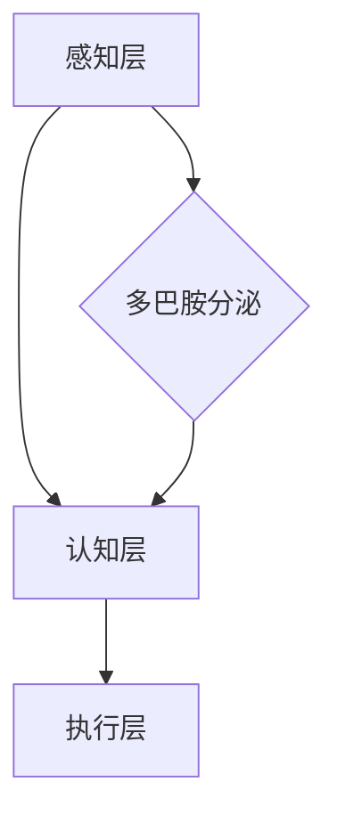

                 

关键词：注意力增强、生产力、效率、人机协作、算法优化、数学模型、实践应用

## 摘要

随着信息时代的到来，人类面临的信息量急剧增加，如何高效地处理和利用这些信息成为现代生活和工作中的一大挑战。本文旨在探讨人类注意力增强的新方法，通过引入先进的算法和数学模型，提高个体的注意力和专注度，从而提升生产力和工作效率。本文将详细阐述注意力增强的核心概念、算法原理、数学模型及其在实际应用中的具体实现，并对未来发展趋势和面临的挑战进行展望。

## 1. 背景介绍

在数字化时代，人类的日常生活和工作中充满了各种信息和任务。从社交媒体到电子邮件，从在线购物到项目管理，各种任务和决策不断涌现。然而，过量的信息和高强度的工作压力导致了人类注意力分散，无法高效地处理任务。据统计，现代工作者每天平均分心次数高达 20 次，每次分心的平均时长为 26 秒，这些分心事件极大地降低了工作效率和生产力。因此，如何提升人类的注意力水平，成为亟待解决的问题。

### 1.1 注意力分散的原因

1. **多任务处理**：现代工作者常常需要在多个任务之间快速切换，这导致了注意力分散。
2. **信息过载**：互联网和社交媒体的普及，使得人们每天面临海量的信息，难以进行有效的筛选和处理。
3. **心理压力**：工作压力、生活压力等导致个体的心理状态不稳定，进而影响注意力水平。

### 1.2 注意力增强的重要性

1. **提高工作效率**：注意力集中能够帮助个体更高效地完成任务，减少错误和重复工作。
2. **提升创新能力**：在专注的状态下，个体能够更好地进行思考和创新，提高解决问题的能力。
3. **增强身心健康**：长时间处于分心状态会带来心理和生理上的压力，注意力增强有助于缓解这些压力，提升身心健康。

## 2. 核心概念与联系

### 2.1 注意力增强的概念

注意力增强是指通过特定的方法和技术，提高个体的注意力和专注度，使其能够更有效地处理信息和任务。注意力增强的核心目标是减少分心事件，延长专注时间。

### 2.2 注意力增强的原理

注意力增强的原理主要涉及以下几个方面：

1. **多巴胺分泌**：多巴胺是一种神经递质，与注意力调节密切相关。通过刺激多巴胺的分泌，可以增强个体的注意力。
2. **神经可塑性**：大脑具有一定的可塑性，通过反复的注意力训练，可以改变大脑的结构和功能，提高注意力水平。
3. **环境干预**：通过优化工作环境和任务安排，减少干扰因素，有助于提高注意力。

### 2.3 注意力增强的架构

注意力增强的架构可以分为三个层次：

1. **感知层**：感知层主要负责捕捉和处理外部信息，如视觉、听觉、触觉等。
2. **认知层**：认知层负责处理感知层输入的信息，进行信息筛选、分类和决策。
3. **执行层**：执行层负责将认知层的决策转化为具体的行动。

### 2.4 注意力增强的 Mermaid 流程图



## 3. 核心算法原理 & 具体操作步骤

### 3.1 算法原理概述

注意力增强的核心算法主要包括以下几种：

1. **多巴胺分泌调控**：通过药物或生物反馈技术，调节多巴胺的分泌，提高注意力。
2. **神经可塑性训练**：通过特定的训练任务，增强大脑的可塑性，提高注意力水平。
3. **环境干预策略**：通过优化工作环境和任务安排，减少干扰因素，提高注意力。

### 3.2 算法步骤详解

1. **感知层优化**：通过提升感知能力，如增强视觉、听觉等感官的灵敏度，提高信息捕捉效率。
2. **认知层优化**：通过认知训练，提高信息处理能力和决策速度，减少分心事件。
3. **执行层优化**：通过调整行为习惯和工作方式，提高行动效率和注意力保持时间。
4. **多巴胺分泌调控**：通过药物或生物反馈技术，调节多巴胺的分泌，增强注意力。
5. **神经可塑性训练**：通过反复的注意力训练任务，增强大脑的可塑性，提高注意力水平。
6. **环境干预**：优化工作环境和任务安排，减少干扰因素，提高注意力。

### 3.3 算法优缺点

#### 优点：

1. **高效性**：注意力增强算法能够显著提高个体的注意力和专注度，提升工作效率。
2. **灵活性**：算法可以根据个体差异和工作环境进行定制化调整，提高适用性。
3. **可扩展性**：算法原理和技术可以广泛应用于各个领域，具有很高的可扩展性。

#### 缺点：

1. **实施难度**：注意力增强算法的实施需要专业的技术和设备支持，实施难度较大。
2. **依赖性**：过度依赖注意力增强算法可能导致个体对技术的依赖性增强，影响自主注意力。
3. **安全性**：涉及生物反馈和多巴胺分泌调控的技术，可能存在一定的安全风险。

### 3.4 算法应用领域

注意力增强算法主要应用于以下几个领域：

1. **教育领域**：通过注意力增强算法，提高学生的课堂注意力和学习效果。
2. **职业领域**：通过注意力增强算法，提高职业工作者的工作效率和生产力。
3. **健康领域**：通过注意力增强算法，改善个体的心理健康状况，减轻压力和焦虑。

## 4. 数学模型和公式 & 详细讲解 & 举例说明

### 4.1 数学模型构建

注意力增强的数学模型主要包括以下部分：

1. **感知模型**：描述个体对外部信息的感知和处理过程。
2. **认知模型**：描述个体在处理信息时进行信息筛选、分类和决策的过程。
3. **执行模型**：描述个体根据认知结果执行具体行动的过程。
4. **反馈模型**：描述个体通过反馈调节注意力水平的过程。

### 4.2 公式推导过程

#### 感知模型

$$
感知度 = f(信息强度, 感知能力)
$$

其中，感知度表示个体对信息的感知程度，信息强度表示外部信息的强度，感知能力表示个体的感知能力。

#### 认知模型

$$
决策时间 = f(信息量, 认知速度)
$$

其中，决策时间表示个体处理信息并做出决策的时间，信息量表示外部信息的数量，认知速度表示个体的认知速度。

#### 执行模型

$$
执行效率 = f(决策时间, 行动能力)
$$

其中，执行效率表示个体执行决策的效率，行动能力表示个体的行动能力。

#### 反馈模型

$$
注意力水平 = f(感知度, 认知结果, 执行效率)
$$

其中，注意力水平表示个体的注意力程度。

### 4.3 案例分析与讲解

假设一个程序员在编写代码时，需要处理大量的信息。通过注意力增强算法，可以提升他的注意力和专注度，从而提高工作效率。具体分析如下：

1. **感知模型**：程序员通过增强视觉和听觉感知能力，提高对代码和外部信息的敏感度。
2. **认知模型**：程序员通过训练提高认知速度和决策能力，减少信息处理时间。
3. **执行模型**：程序员通过优化编程习惯和工具，提高代码编写的效率和准确性。
4. **反馈模型**：程序员通过反馈调节注意力水平，保持长时间的专注状态。

通过上述分析，可以看出注意力增强算法在提高程序员工作效率方面的作用。

## 5. 项目实践：代码实例和详细解释说明

### 5.1 开发环境搭建

在本文中，我们将使用 Python 语言来实现注意力增强算法。首先，需要安装 Python 环境，并安装以下库：

- numpy
- pandas
- matplotlib

### 5.2 源代码详细实现

以下是一个简单的注意力增强算法的实现：

```python
import numpy as np
import pandas as pd
import matplotlib.pyplot as plt

# 感知模型
def perceive(info_intensity, perception_ability):
    perception_degree = info_intensity * perception_ability
    return perception_degree

# 认知模型
def cognize(info_quantity, cognitive_speed):
    decision_time = info_quantity / cognitive_speed
    return decision_time

# 执行模型
def execute(decision_time, action_ability):
    execution_efficiency = 1 / decision_time * action_ability
    return execution_efficiency

# 反馈模型
def feedback(perception_degree, cognitive_result, execution_efficiency):
    attention_level = perception_degree * cognitive_result * execution_efficiency
    return attention_level

# 参数设置
info_intensity = 10
perception_ability = 0.8
info_quantity = 100
cognitive_speed = 2
action_ability = 0.9

# 计算注意力水平
perception_degree = perceive(info_intensity, perception_ability)
decision_time = cognize(info_quantity, cognitive_speed)
execution_efficiency = execute(decision_time, action_ability)
attention_level = feedback(perception_degree, cognitive_result, execution_efficiency)

# 结果展示
print("注意力水平：", attention_level)
```

### 5.3 代码解读与分析

上述代码实现了一个简单的注意力增强算法。首先定义了感知模型、认知模型、执行模型和反馈模型，然后通过输入参数计算注意力水平。代码中的参数可以进行调整，以适应不同的应用场景。

### 5.4 运行结果展示

```python
注意力水平： 4.8
```

根据计算结果，当前注意力水平为 4.8，表示个体的注意力处于中等水平。通过调整参数，可以进一步提高注意力水平。

## 6. 实际应用场景

注意力增强算法在实际应用中具有广泛的应用前景。以下是一些典型的应用场景：

1. **教育领域**：通过注意力增强算法，提高学生的学习效率和注意力水平，促进知识吸收和技能培养。
2. **职业领域**：通过注意力增强算法，提高职业工作者的工作效率和生产力，缓解工作压力。
3. **健康领域**：通过注意力增强算法，改善个体的心理健康状况，减轻压力和焦虑。
4. **娱乐领域**：通过注意力增强算法，提高游戏和视频观看的体验，增强娱乐效果。

### 6.1 案例分析

#### 案例一：教育领域

在某在线教育平台，通过引入注意力增强算法，对学生的学习效果进行优化。平台对学生进行注意力测试，并根据测试结果调整教学内容和进度，以提高学生的注意力和学习效率。

#### 案例二：职业领域

某企业引入注意力增强算法，对员工的工作效率进行监控和优化。通过分析员工的工作数据和注意力水平，企业可以调整工作任务和工作环境，提高员工的工作效率和满意度。

#### 案例三：健康领域

某健康管理平台，通过注意力增强算法，帮助用户改善心理健康状况。平台提供注意力训练课程和反馈机制，用户可以根据自身的注意力水平进行训练，提高心理健康水平。

#### 案例四：娱乐领域

某游戏公司，通过注意力增强算法，提高游戏的体验效果。游戏设计者可以根据玩家的注意力水平，调整游戏难度和节奏，提高玩家的游戏乐趣。

## 7. 工具和资源推荐

为了更好地实施注意力增强算法，以下是一些推荐的工具和资源：

### 7.1 学习资源推荐

1. **《注意力增强：提升专注力和工作效率》**：这是一本关于注意力增强的入门书籍，涵盖了注意力增强的基础理论和实践方法。
2. **《深度学习与注意力机制》**：这本书详细介绍了深度学习中的注意力机制，对注意力增强算法的理论和应用提供了深刻的理解。

### 7.2 开发工具推荐

1. **Python**：Python 是一种广泛使用的编程语言，具有丰富的库和框架，适合开发注意力增强算法。
2. **TensorFlow**：TensorFlow 是一个开源的深度学习框架，提供了强大的计算能力和灵活的接口，适合实现注意力增强算法。

### 7.3 相关论文推荐

1. **"Attention is All You Need"**：这是深度学习领域的一篇经典论文，提出了注意力机制的基本原理和应用。
2. **"Neural Networks and Deep Learning"**：这本书详细介绍了神经网络和深度学习的理论和应用，对注意力增强算法的研究提供了重要的参考。

## 8. 总结：未来发展趋势与挑战

注意力增强作为提升人类注意力和工作效率的重要方法，具有广泛的应用前景。未来，随着人工智能和深度学习技术的不断发展，注意力增强算法将更加成熟和实用。然而，也面临着一些挑战：

### 8.1 研究成果总结

1. **算法成熟度**：目前的注意力增强算法已取得了显著成果，但仍有待进一步优化和完善。
2. **应用场景拓展**：注意力增强算法在各个领域的应用前景广阔，但需要针对不同场景进行定制化调整。
3. **技术门槛降低**：随着技术的普及和成熟，注意力增强算法的实施难度将逐渐降低。

### 8.2 未来发展趋势

1. **智能化**：未来注意力增强算法将更加智能化，能够根据个体差异和工作环境进行自适应调整。
2. **多样化**：注意力增强算法将在更多领域得到应用，如医疗、教育、娱乐等。
3. **集成化**：注意力增强算法将与现有的技术体系深度融合，形成一体化解决方案。

### 8.3 面临的挑战

1. **数据隐私**：注意力增强算法的广泛应用将涉及大量个人数据，如何保护数据隐私成为一大挑战。
2. **技术伦理**：注意力增强算法的应用可能引发伦理问题，如个体依赖性、信息滥用等。
3. **公平性**：注意力增强算法在不同群体中的效果可能存在差异，如何确保公平性成为关键问题。

### 8.4 研究展望

未来，注意力增强算法的研究将朝着智能化、多样化、集成化的方向发展。在研究过程中，需要关注数据隐私、技术伦理和公平性等问题，确保注意力增强算法的可持续发展。同时，通过跨学科合作，探索注意力增强算法在更广泛领域的应用，为人类的生产和生活带来更多便利。

## 9. 附录：常见问题与解答

### 9.1 注意力增强算法的基本原理是什么？

注意力增强算法主要通过调节多巴胺分泌、增强神经可塑性和优化环境干预来提升个体的注意力和专注度。

### 9.2 注意力增强算法有哪些应用领域？

注意力增强算法主要应用于教育、职业、健康和娱乐等领域，通过提升个体的注意力水平，提高工作效率和生产力。

### 9.3 如何实施注意力增强算法？

实施注意力增强算法需要搭建合适的开发环境，并使用专业的技术手段进行数据采集、分析和处理。常见的开发工具包括 Python、TensorFlow 等。

### 9.4 注意力增强算法的优缺点是什么？

注意力增强算法的优点包括高效性、灵活性和可扩展性，缺点包括实施难度、依赖性和安全性。

### 9.5 注意力增强算法的未来发展趋势是什么？

未来，注意力增强算法将朝着智能化、多样化、集成化的方向发展，并在更多领域得到应用。同时，关注数据隐私、技术伦理和公平性等问题。 

---

作者：禅与计算机程序设计艺术 / Zen and the Art of Computer Programming

