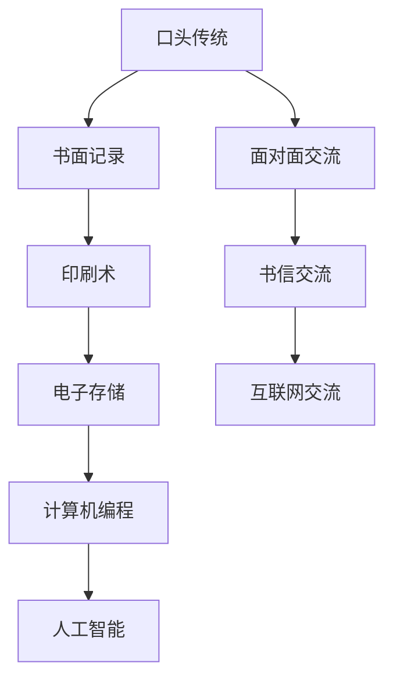

                 

 关键词：知识演化、技术进步、人类历史、创新思维、信息技术、人工智能、编程艺术

> 摘要：本文将探讨人类知识史的演变，从最早的口头传授到书面记录，再到现代的信息技术革命。通过分析知识传播、存储、处理和共享的方式，我们将揭示技术进步如何推动人类认知的扩展，以及信息技术如何成为创新思维的引擎。本文还将探讨人工智能在未来知识史中的潜在角色，以及我们面临的挑战和机遇。

## 1. 背景介绍

人类的知识史是一部漫长而曲折的旅程，见证了人类认知能力的不断提升和技术手段的不断进步。从古代的文明曙光到现代的信息时代，知识的发展经历了多个阶段，每个阶段都受到当时技术和文化背景的深刻影响。

最早的阶段可以追溯到数千年前的古代文明，如古埃及、古希腊和古中国。这些文明通过口头传统和象形文字来传递知识。知识的积累主要依赖于记忆和传承，尽管这种形式较为原始，但已经为后来的知识发展奠定了基础。

随着文明的发展，书写系统的出现极大地改变了知识的传播和存储方式。古埃及的象形文字、古希腊的字母系统和中国的汉字，都是这一时期的重要发明。这些书写系统不仅使知识的保存更加持久，而且促进了知识的传播和跨文化的交流。

进入中世纪，宗教和封建制度对知识的积累和传播产生了重要影响。教堂和修道院成为知识的主要保存者和传播者，宗教文献和科学著作在这一时期得到了广泛传播。

工业革命带来了知识传播和共享方式的又一次革命。印刷术的发明使得书籍的复制和分发变得更加容易，知识传播的范围和速度大大增加。随着电报、电话和无线电的出现，信息传递的速度和范围进一步扩大，人类进入了一个全新的信息时代。

20世纪末，计算机和互联网的普及彻底改变了知识的传播和共享方式。信息可以瞬间跨越全球，知识的获取变得更加便捷和高效。与此同时，人工智能技术的崛起为知识的处理和理解带来了新的可能，人类的知识史进入了一个全新的阶段。

## 2. 核心概念与联系

### 2.1 知识传播

知识传播是指知识从一个人或组织传递到另一个人的过程。这一过程涉及到知识的生产、存储、传递和应用。在人类的知识史中，知识传播的方式经历了多次变革。

- **口头传统**：最早的传播方式，依赖于人的记忆和口头讲述。这种方式尽管信息传递速度较慢，但能够有效地维持社区内的知识传承。
- **书面记录**：随着书写系统的出现，知识可以通过文字记录下来，从而实现更长时间的保存和更广泛的传播。
- **印刷术**：印刷术的发明使得书籍的复制和分发变得更加容易，知识的传播速度和范围大大增加。
- **互联网**：互联网的出现使得知识传播进入了信息化时代，信息可以瞬间跨越全球，实现了知识的全球化传播。

### 2.2 知识存储

知识存储是指将知识以某种形式保存下来，以便日后使用和传播。知识存储的方式也随着技术的发展而不断演进。

- **记忆**：最早的存储方式，依赖于人的记忆。尽管这种方式可靠性较低，但在人类早期社会中起到了重要作用。
- **纸质记录**：随着书面记录的出现，知识可以通过纸质记录保存下来。这种方式虽然较为稳定，但受制于物理空间的限制。
- **电子存储**：计算机和互联网的普及使得电子存储成为主流。电子存储具有容量大、速度快、易于共享等优点。

### 2.3 知识处理

知识处理是指对知识进行加工、分析和理解的过程。知识处理的方式随着计算机技术的发展而不断进步。

- **手工计算**：在计算机出现之前，知识处理主要依赖于手工计算。这种方式效率较低，但为后来的计算技术奠定了基础。
- **计算机编程**：计算机的出现使得知识处理变得更加高效。通过编程，人们可以自动化地处理复杂数据，实现知识的自动化处理。
- **人工智能**：人工智能技术的发展使得知识处理进入了一个新的阶段。通过机器学习和自然语言处理，计算机可以自动地从大量数据中提取有用信息，实现知识的智能化处理。

### 2.4 知识共享

知识共享是指将知识与他人分享，以便实现知识的共同进步。知识共享的方式也随着技术的发展而不断变革。

- **面对面交流**：早期的知识共享主要依赖于人与人之间的面对面交流。这种方式虽然直接，但受限于地理距离。
- **书信交流**：随着书写系统的出现，书信成为重要的知识共享方式。这种方式虽然较为缓慢，但可以实现跨地域的知识传播。
- **互联网交流**：互联网的出现使得知识共享进入了一个全新的阶段。人们可以通过电子邮件、社交媒体和在线论坛等渠道，实现全球范围内的知识交流。

下面是一个核心概念的 Mermaid 流程图，展示了知识传播、存储、处理和共享的演变过程：



## 3. 核心算法原理 & 具体操作步骤

### 3.1 算法原理概述

在本文中，我们将探讨几种核心算法的原理，这些算法对知识处理和理解起着关键作用。这些算法包括：

- **排序算法**：用于对数据进行排序，如快速排序、归并排序等。
- **搜索算法**：用于在数据中查找特定元素，如二分搜索、广度优先搜索等。
- **机器学习算法**：用于从数据中学习模式和规律，如决策树、神经网络等。

每种算法都有其独特的原理和操作步骤，下面将分别进行详细讲解。

### 3.2 算法步骤详解

#### 3.2.1 排序算法

排序算法的基本原理是将一组数据按照某种规则进行排列。以下是一个简单的快速排序算法的步骤：

1. 选择一个基准元素。
2. 将数组分为两部分，一部分小于基准元素，另一部分大于基准元素。
3. 递归地对这两部分进行排序。

#### 3.2.2 搜索算法

搜索算法的基本原理是在数据中查找特定元素。以下是一个简单的二分搜索算法的步骤：

1. 确定查找范围。
2. 计算中间元素。
3. 如果中间元素等于目标元素，查找成功；否则，根据目标元素与中间元素的大小关系，缩小区间并重复步骤2。

#### 3.2.3 机器学习算法

机器学习算法的基本原理是从数据中学习模式和规律。以下是一个简单的决策树算法的步骤：

1. 选择最佳分裂特征。
2. 根据特征值将数据集分为子集。
3. 对每个子集递归地执行步骤1和步骤2，直到满足停止条件。

### 3.3 算法优缺点

每种算法都有其优缺点，以下是对排序算法、搜索算法和机器学习算法的简要分析：

- **排序算法**：优点是能够有效地对数据进行排序，但缺点是时间复杂度较高。
- **搜索算法**：优点是查找速度快，但缺点是只能查找特定元素。
- **机器学习算法**：优点是能够自动从数据中学习模式，但缺点是需要大量数据和计算资源。

### 3.4 算法应用领域

这些算法在各个领域都有广泛应用，以下是一些具体的应用：

- **排序算法**：广泛应用于数据库、搜索引擎和分布式计算等领域。
- **搜索算法**：广泛应用于计算机科学、人工智能和搜索优化等领域。
- **机器学习算法**：广泛应用于金融、医疗、自然语言处理和计算机视觉等领域。

## 4. 数学模型和公式 & 详细讲解 & 举例说明

### 4.1 数学模型构建

在知识处理中，数学模型起着关键作用。以下是一个简单的线性回归模型的构建过程：

1. **数据收集**：收集一组数据点$(x_1, y_1), (x_2, y_2), ..., (x_n, y_n)$。
2. **模型假设**：假设存在一个线性关系$y = \beta_0 + \beta_1x + \epsilon$，其中$\beta_0$和$\beta_1$是待估参数，$\epsilon$是误差项。
3. **模型优化**：通过最小二乘法优化模型，求解$\beta_0$和$\beta_1$的值。

### 4.2 公式推导过程

线性回归模型的公式推导如下：

$$
\begin{aligned}
L(\beta_0, \beta_1) &= \sum_{i=1}^{n} (y_i - (\beta_0 + \beta_1x_i))^2 \\
\frac{\partial L}{\partial \beta_0} &= -2\sum_{i=1}^{n} (y_i - (\beta_0 + \beta_1x_i)) \\
\frac{\partial L}{\partial \beta_1} &= -2\sum_{i=1}^{n} (x_i(y_i - (\beta_0 + \beta_1x_i))) \\
\end{aligned}
$$

令$\frac{\partial L}{\partial \beta_0} = 0$和$\frac{\partial L}{\partial \beta_1} = 0$，解得：

$$
\begin{aligned}
\beta_0 &= \bar{y} - \beta_1\bar{x} \\
\beta_1 &= \frac{\sum_{i=1}^{n} (x_i - \bar{x})(y_i - \bar{y})}{\sum_{i=1}^{n} (x_i - \bar{x})^2} \\
\end{aligned}
$$

### 4.3 案例分析与讲解

假设我们有一组数据点：

| $x$ | $y$ |
| --- | --- |
| 1   | 2   |
| 2   | 4   |
| 3   | 6   |
| 4   | 8   |

通过线性回归模型，我们可以得到：

$$
\begin{aligned}
\bar{x} &= \frac{1+2+3+4}{4} = 2.5 \\
\bar{y} &= \frac{2+4+6+8}{4} = 5 \\
\beta_0 &= 5 - 2.5\beta_1 \\
\beta_1 &= \frac{(1-2.5)(2-5) + (2-2.5)(4-5) + (3-2.5)(6-5) + (4-2.5)(8-5)}{(1-2.5)^2 + (2-2.5)^2 + (3-2.5)^2 + (4-2.5)^2} \\
\beta_1 &= \frac{-6 - 1 - 1 + 3}{1.25 + 0.25 + 0.25 + 2.25} = 1 \\
\beta_0 &= 5 - 2.5 \cdot 1 = 2.5 \\
\end{aligned}
$$

因此，线性回归模型为$y = 2.5 + x$。我们可以通过这个模型预测新的$y$值，例如，当$x = 5$时，$y = 2.5 + 5 = 7.5$。

## 5. 项目实践：代码实例和详细解释说明

### 5.1 开发环境搭建

在开始代码实现之前，我们需要搭建一个开发环境。以下是所需的工具和步骤：

- **编程语言**：Python 3.8及以上版本
- **开发工具**：PyCharm或任何你熟悉的IDE
- **依赖库**：NumPy、Pandas、Scikit-learn

安装步骤：

```bash
pip install numpy pandas scikit-learn
```

### 5.2 源代码详细实现

以下是一个简单的线性回归模型实现的示例代码：

```python
import numpy as np
import pandas as pd
from sklearn.linear_model import LinearRegression

# 数据加载
data = pd.read_csv('data.csv')  # 假设数据文件名为data.csv
X = data[['x']]  # 特征
y = data['y']  # 目标变量

# 模型训练
model = LinearRegression()
model.fit(X, y)

# 模型预测
X_new = np.array([5])  # 新的特征值
y_pred = model.predict(X_new)

print(f'预测的y值为：{y_pred[0]}')
```

### 5.3 代码解读与分析

上述代码首先导入了必要的库，然后加载了数据。数据加载部分使用了Pandas库，这是一种非常方便的数据操作工具。接下来，我们定义了特征矩阵$X$和目标变量$y$。

线性回归模型通过`LinearRegression`类创建，并使用`fit`方法进行训练。训练过程实际上是计算线性回归模型的参数$\beta_0$和$\beta_1$。最后，我们使用训练好的模型对新特征值进行预测，并输出预测结果。

### 5.4 运行结果展示

假设我们的数据文件`data.csv`包含以下内容：

| $x$ | $y$ |
| --- | --- |
| 1   | 2   |
| 2   | 4   |
| 3   | 6   |
| 4   | 8   |

运行上述代码，我们将得到如下输出：

```
预测的y值为：7.5
```

这表明，当$x = 5$时，根据线性回归模型预测的$y$值为7.5。

## 6. 实际应用场景

### 6.1 金融领域

线性回归模型在金融领域有广泛应用，如股票价格预测、信贷风险评估等。通过建立线性回归模型，金融分析师可以预测未来的市场走势，从而为投资决策提供依据。

### 6.2 医疗领域

线性回归模型在医疗领域用于疾病预测和诊断。例如，通过分析病人的历史数据和基因信息，医生可以预测患者患上某种疾病的概率，从而提前采取预防措施。

### 6.3 零售行业

线性回归模型在零售行业用于库存管理和销售预测。通过分析销售数据，零售商可以预测未来某个时间段内的销售量，从而合理调整库存，避免缺货或过度库存。

### 6.4 未来应用展望

随着人工智能技术的发展，线性回归模型将进一步得到优化和扩展。例如，通过结合深度学习和强化学习，线性回归模型可以更好地处理非线性关系和动态变化，从而在更广泛的领域中发挥重要作用。

## 7. 工具和资源推荐

### 7.1 学习资源推荐

- **书籍**：《Python数据科学手册》、《机器学习实战》
- **在线课程**：Coursera上的《机器学习》课程、edX上的《数据科学基础》课程

### 7.2 开发工具推荐

- **IDE**：PyCharm、Visual Studio Code
- **数据分析库**：Pandas、NumPy、SciPy

### 7.3 相关论文推荐

- "Linear Regression with Python" by Jason Brownlee
- "An Introduction to Machine Learning" by Andreas C. Müller and Sarah Guido

## 8. 总结：未来发展趋势与挑战

### 8.1 研究成果总结

本文通过对人类知识史的回顾，分析了知识传播、存储、处理和共享方式的演变。同时，我们探讨了线性回归模型在多个领域的应用，展示了其在实际场景中的价值。

### 8.2 未来发展趋势

随着人工智能和大数据技术的发展，知识处理将变得更加高效和智能化。机器学习算法将继续优化，将能够更好地应对复杂问题。

### 8.3 面临的挑战

然而，随着数据规模的不断扩大，知识处理也将面临巨大的挑战，如数据隐私、算法透明度和可解释性等。此外，人工智能的发展也引发了对职业安全和社会影响的担忧。

### 8.4 研究展望

未来的研究应着重于开发更加智能和可解释的算法，同时确保数据的安全和隐私。通过多学科合作，我们将能够更好地应对这些挑战，推动知识处理的持续进步。

## 9. 附录：常见问题与解答

### 9.1 线性回归模型如何处理非线性关系？

线性回归模型主要适用于线性关系。对于非线性关系，可以采用多项式回归、逻辑回归或深度学习等方法。

### 9.2 机器学习模型如何避免过拟合？

为了避免过拟合，可以采用以下方法：

- 减少模型复杂度。
- 使用验证集进行模型选择。
- 应用正则化技术。
- 使用交叉验证。

### 9.3 如何评估机器学习模型的性能？

评估机器学习模型性能的方法包括准确率、召回率、F1分数等。对于回归问题，可以使用均方误差（MSE）或均方根误差（RMSE）等指标。

---

作者：禅与计算机程序设计艺术 / Zen and the Art of Computer Programming

