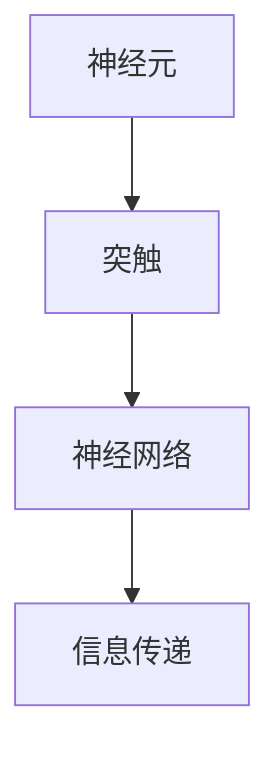
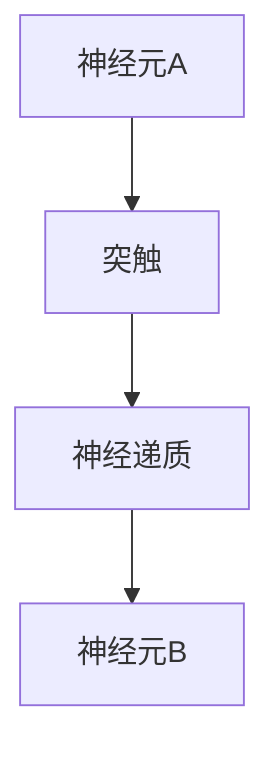
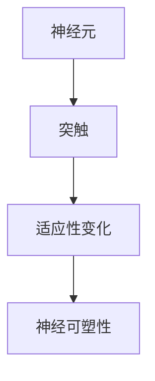
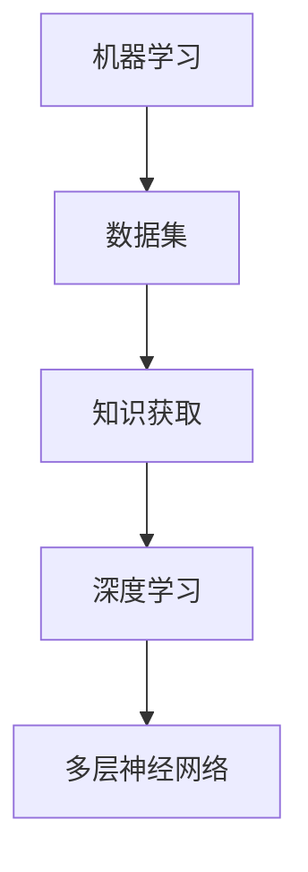
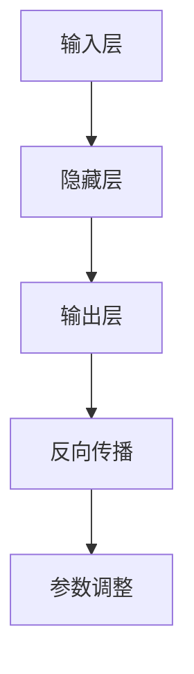
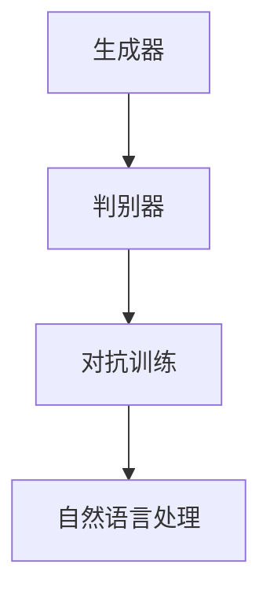

                 

关键词：知识本质、认知模型、人脑计算、神经科学、人工智能、算法、数据处理、信息传递

> 摘要：本文探讨了人类知识本质的深层内涵，通过对比人脑计算和人工智能模型，揭示了知识获取、处理与传递的过程。文章从神经科学的视角出发，结合数学模型和算法原理，详细阐述了知识的构建与进化机制。此外，文章还通过代码实例和实践案例，展示了知识在实际应用中的重要性，并对未来知识处理的趋势和挑战进行了展望。

## 1. 背景介绍

人类的知识体系是文明发展的基石，从古至今，人类不断探索自然规律、社会现象和科学真理。随着科技的发展，人工智能的崛起为知识的获取、处理和传递带来了前所未有的变革。然而，人类的知识本质是什么？我们如何理解并利用这种知识？

本文旨在回答上述问题，通过对人脑计算与人工智能的比较分析，深入探讨知识的本质和构建机制。文章首先介绍人脑的计算模型，然后介绍人工智能的基本原理和算法，最后结合数学模型，探讨知识处理的方法和工具。

## 2. 核心概念与联系

### 2.1 人脑计算模型

人脑作为自然界最复杂的系统之一，其计算模型一直吸引着科学家们的关注。目前，神经科学为我们提供了部分关于人脑工作原理的认识。以下是人脑计算模型的核心概念和联系：

#### 2.1.1 神经元与神经网络

神经元是构成人脑的基本单元，它们通过突触连接形成一个复杂的神经网络。神经网络中的神经元通过电信号传递信息，完成数据的处理和信息的传递。



#### 2.1.2 神经递质与信号传递

神经递质是神经元间传递信息的化学物质，它们在突触间传递电信号，实现神经元的相互通信。神经递质的种类和浓度决定了信号传递的速度和强度。



#### 2.1.3 神经可塑性

神经可塑性是指神经元结构和功能的适应性变化。它使得人脑能够适应外界环境和内部状态的变化，从而实现学习和记忆。



### 2.2 人工智能模型

人工智能作为一门交叉学科，旨在模拟人脑的智能行为。以下是人工智能模型的核心概念和联系：

#### 2.2.1 机器学习与深度学习

机器学习是人工智能的核心技术之一，通过训练数据集，使计算机自动获取知识。深度学习是机器学习的一种方法，它通过多层神经网络实现复杂的数据处理和模式识别。



#### 2.2.2 神经网络与反向传播

神经网络是深度学习的基础，它通过层层传递信息，实现数据的处理和特征的提取。反向传播是一种优化算法，用于调整神经网络中的参数，提高模型的准确性。



#### 2.2.3 自然语言处理与生成对抗网络

自然语言处理是人工智能的重要应用领域，它通过模型理解和生成自然语言。生成对抗网络（GAN）是一种深度学习模型，它通过生成器和判别器的对抗训练，实现高质量的数据生成。



## 3. 核心算法原理 & 具体操作步骤

### 3.1 算法原理概述

在本节中，我们将介绍人脑计算和人工智能中的核心算法原理，包括神经网络、反向传播、深度学习等。

#### 3.1.1 神经网络

神经网络是一种模拟人脑结构的计算模型，它由多层神经元组成，通过层层传递信息实现数据的处理和特征的提取。神经网络的核心原理是前向传播和反向传播。

**前向传播**：输入数据通过网络的层层传递，每个神经元接收前一层输出的加权求和，并通过激活函数产生输出。

**反向传播**：在输出层计算实际输出与期望输出之间的误差，将误差沿着网络反向传播，通过梯度下降法调整网络参数，减小误差。

#### 3.1.2 深度学习

深度学习是一种基于神经网络的机器学习方法，它通过多层神经网络实现复杂的数据处理和模式识别。深度学习的核心算法包括卷积神经网络（CNN）、循环神经网络（RNN）等。

**卷积神经网络**：卷积神经网络通过卷积层和池化层实现图像的特征提取和分类。卷积层通过卷积运算提取图像局部特征，池化层通过下采样减小参数量。

**循环神经网络**：循环神经网络通过循环结构处理序列数据，实现对时间序列的建模和预测。循环神经网络的核心算法包括长短期记忆（LSTM）和门控循环单元（GRU）。

#### 3.1.3 生成对抗网络

生成对抗网络是一种基于深度学习的生成模型，它通过生成器和判别器的对抗训练实现高质量的数据生成。生成对抗网络的核心算法包括生成器、判别器和损失函数。

**生成器**：生成器通过神经网络生成虚假数据，试图欺骗判别器。

**判别器**：判别器通过神经网络判断输入数据的真实性。

**损失函数**：损失函数用于衡量生成器和判别器之间的对抗训练效果，常用的损失函数包括交叉熵损失和均方误差损失。

### 3.2 算法步骤详解

在本节中，我们将详细阐述神经网络、深度学习和生成对抗网络的算法步骤。

#### 3.2.1 神经网络

**步骤1：初始化参数**

随机初始化网络的权重和偏置。

**步骤2：前向传播**

输入数据通过网络的层层传递，每个神经元接收前一层输出的加权求和，并通过激活函数产生输出。

**步骤3：计算损失**

计算实际输出与期望输出之间的误差，并计算损失。

**步骤4：反向传播**

将误差沿着网络反向传播，通过梯度下降法调整网络参数，减小误差。

**步骤5：更新参数**

根据梯度下降法更新网络的权重和偏置。

**步骤6：重复步骤2-5**

不断迭代前向传播和反向传播，直到网络收敛。

#### 3.2.2 深度学习

**步骤1：数据预处理**

对输入数据进行预处理，包括归一化、标准化等。

**步骤2：初始化模型**

初始化网络的层数、神经元个数、激活函数等。

**步骤3：训练模型**

通过训练数据集训练模型，不断迭代前向传播和反向传播，直到模型收敛。

**步骤4：验证模型**

在验证数据集上验证模型的性能，调整模型参数。

**步骤5：测试模型**

在测试数据集上测试模型的性能，评估模型的泛化能力。

#### 3.2.3 生成对抗网络

**步骤1：初始化参数**

随机初始化生成器和判别器的权重和偏置。

**步骤2：生成虚假数据**

生成器生成虚假数据，试图欺骗判别器。

**步骤3：训练判别器**

判别器通过神经网络判断输入数据的真实性。

**步骤4：更新生成器和判别器**

根据损失函数更新生成器和判别器的参数。

**步骤5：重复步骤2-4**

不断迭代生成虚假数据和训练判别器，直到生成器生成高质量的数据。

### 3.3 算法优缺点

在本节中，我们将分析神经网络、深度学习和生成对抗网络的优缺点。

#### 3.3.1 神经网络

**优点**：

- 灵活性高：神经网络可以通过调整网络结构、层数和神经元个数适应不同的任务。
- 泛化能力强：神经网络通过多层结构可以实现特征提取和模式识别，具有较强的泛化能力。

**缺点**：

- 计算量大：神经网络需要大量计算资源，训练时间较长。
- 需要大量数据：神经网络需要大量数据来训练模型，数据预处理和清洗工作量大。

#### 3.3.2 深度学习

**优点**：

- 高效性：深度学习模型可以通过并行计算提高计算效率。
- 强大的特征提取能力：深度学习模型可以自动提取特征，减少人工干预。

**缺点**：

- 数据依赖性强：深度学习模型对数据质量要求较高，数据噪声和缺失会影响模型性能。
- 解释性差：深度学习模型具有较强的预测能力，但难以解释模型的决策过程。

#### 3.3.3 生成对抗网络

**优点**：

- 高质量数据生成：生成对抗网络可以通过对抗训练生成高质量的数据，具有广泛的应用前景。
- 数据增强：生成对抗网络可以通过生成虚假数据增强训练数据集，提高模型泛化能力。

**缺点**：

- 难以训练：生成对抗网络需要较长时间进行训练，且容易陷入局部最优。
- 调参复杂：生成对抗网络需要调整大量的参数，包括生成器和判别器的结构、学习率等。

### 3.4 算法应用领域

在本节中，我们将介绍神经网络、深度学习和生成对抗网络的应用领域。

#### 3.4.1 神经网络

- 图像处理：神经网络在图像分类、目标检测、人脸识别等领域具有广泛应用。
- 自然语言处理：神经网络在机器翻译、情感分析、文本分类等领域具有重要应用。
- 推荐系统：神经网络可以通过用户行为数据生成个性化推荐。

#### 3.4.2 深度学习

- 计算机视觉：深度学习在计算机视觉领域取得了突破性进展，包括图像分类、目标检测、图像生成等。
- 自然语言处理：深度学习在自然语言处理领域具有重要意义，包括文本分类、机器翻译、对话系统等。
- 音频处理：深度学习在音频处理领域具有重要应用，包括语音识别、音乐生成等。

#### 3.4.3 生成对抗网络

- 数据增强：生成对抗网络可以通过生成虚假数据增强训练数据集，提高模型泛化能力。
- 图像生成：生成对抗网络可以生成高质量的艺术图像、抽象图像等。
- 生成式模型：生成对抗网络在生成式模型领域具有广泛应用，包括数据生成、图像修复等。

## 4. 数学模型和公式 & 详细讲解 & 举例说明

在本节中，我们将介绍神经网络、深度学习和生成对抗网络中的数学模型和公式，并进行详细讲解和举例说明。

### 4.1 数学模型构建

#### 4.1.1 神经网络

神经网络的数学模型主要基于线性代数和微积分。以下是神经网络的核心数学模型：

**激活函数**：

激活函数用于引入非线性变换，使神经网络能够模拟人脑的决策过程。常用的激活函数包括：

- 神经元输出：\( f(x) = \sigma(x) = \frac{1}{1 + e^{-x}} \)
- 切比雪夫函数：\( f(x) = \tanh(x) = \frac{e^x - e^{-x}}{e^x + e^{-x}} \)

**损失函数**：

损失函数用于衡量模型预测值与真实值之间的误差。常用的损失函数包括：

- 交叉熵损失：\( L = -\sum_{i=1}^{n} y_i \log(\hat{y}_i) \)
- 均方误差损失：\( L = \frac{1}{2} \sum_{i=1}^{n} (\hat{y}_i - y_i)^2 \)

**反向传播**：

反向传播是一种优化算法，用于调整神经网络中的参数，减小误差。反向传播的核心步骤包括：

- 前向传播：计算网络的输出值和误差。
- 后向传播：计算误差对每个参数的梯度。
- 参数更新：根据梯度下降法更新网络参数。

**神经网络训练过程**：

神经网络训练过程主要包括以下步骤：

1. 初始化参数。
2. 前向传播：计算网络输出和误差。
3. 后向传播：计算误差对每个参数的梯度。
4. 参数更新：根据梯度下降法更新网络参数。
5. 重复步骤2-4，直到网络收敛。

#### 4.1.2 深度学习

**卷积神经网络**：

卷积神经网络是一种特殊类型的神经网络，主要用于图像处理任务。卷积神经网络的数学模型包括：

- **卷积层**：卷积层通过卷积运算提取图像局部特征。
- **池化层**：池化层通过下采样减小参数量，提高模型的泛化能力。

**循环神经网络**：

循环神经网络是一种适用于序列数据处理的神经网络。循环神经网络的数学模型包括：

- **循环层**：循环层通过循环结构处理序列数据。
- **门控机制**：门控机制用于控制信息的传递和遗忘，包括长短期记忆（LSTM）和门控循环单元（GRU）。

**生成对抗网络**：

生成对抗网络是一种生成模型，通过生成器和判别器的对抗训练实现高质量的数据生成。生成对抗网络的数学模型包括：

- **生成器**：生成器通过神经网络生成虚假数据。
- **判别器**：判别器通过神经网络判断输入数据的真实性。
- **损失函数**：损失函数用于衡量生成器和判别器之间的对抗训练效果。

### 4.2 公式推导过程

在本节中，我们将介绍神经网络、深度学习和生成对抗网络中的数学公式推导过程。

#### 4.2.1 神经网络

**激活函数**：

神经元输出的激活函数可以表示为：

$$
f(x) = \sigma(x) = \frac{1}{1 + e^{-x}}
$$

**损失函数**：

交叉熵损失函数可以表示为：

$$
L = -\sum_{i=1}^{n} y_i \log(\hat{y}_i)
$$

**反向传播**：

假设神经网络的输入为\( x \)，输出为\( y \)，期望输出为\( y' \)，则误差可以表示为：

$$
E = \frac{1}{2} \sum_{i=1}^{n} (\hat{y}_i - y_i)^2
$$

误差对每个参数的梯度可以表示为：

$$
\frac{\partial E}{\partial w_i} = \frac{\partial E}{\partial \hat{y}_i} \frac{\partial \hat{y}_i}{\partial w_i} = (\hat{y}_i - y_i) \frac{\partial \hat{y}_i}{\partial w_i}
$$

参数更新可以表示为：

$$
w_i = w_i - \alpha \frac{\partial E}{\partial w_i}
$$

其中，\( \alpha \) 为学习率。

#### 4.2.2 深度学习

**卷积神经网络**：

卷积神经网络中的卷积运算可以表示为：

$$
\text{Conv}(x) = \sum_{j=1}^{m} w_j * x_j
$$

其中，\( x_j \) 为输入图像的局部区域，\( w_j \) 为卷积核。

**循环神经网络**：

循环神经网络中的循环层可以表示为：

$$
h_t = \tanh(W_h h_{t-1} + W_x x_t + b_h)
$$

其中，\( h_t \) 为当前时间步的隐藏状态，\( x_t \) 为当前时间步的输入，\( W_h \) 和 \( W_x \) 分别为隐藏状态和输入的权重矩阵，\( b_h \) 为隐藏状态的偏置。

**生成对抗网络**：

生成对抗网络中的生成器和判别器可以表示为：

$$
G(z) = \mu(z) + \sigma(z) \odot \epsilon
$$

$$
D(x) = \sigma\left(\frac{D(x, G(z))}{1 + \lambda}\right)
$$

其中，\( z \) 为生成器的输入，\( \mu(z) \) 和 \( \sigma(z) \) 分别为生成器的均值和方差，\( \epsilon \) 为噪声，\( x \) 为输入数据，\( G(z) \) 为生成器的输出，\( D(x) \) 为判别器的输出。

### 4.3 案例分析与讲解

在本节中，我们将通过具体案例对神经网络、深度学习和生成对抗网络进行讲解。

#### 4.3.1 神经网络

假设我们要构建一个简单的神经网络模型，用于实现二分类任务。网络的输入为二维特征向量，输出为概率值。我们可以使用交叉熵损失函数和反向传播算法进行训练。

**步骤1：初始化参数**

随机初始化网络的权重和偏置。

**步骤2：前向传播**

输入特征向量，通过网络的层层传递，得到输出概率。

**步骤3：计算损失**

计算输出概率与真实标签之间的交叉熵损失。

**步骤4：反向传播**

计算误差对每个参数的梯度。

**步骤5：参数更新**

根据梯度下降法更新网络参数。

**步骤6：重复步骤2-5**

不断迭代前向传播和反向传播，直到网络收敛。

**案例演示**：

假设输入特征向量为 \( x = (1, 2) \)，真实标签为 \( y = 0 \)。网络的初始权重为 \( w = (0.1, 0.2) \)，偏置为 \( b = (0.3, 0.4) \)。

**前向传播**：

$$
z_1 = x_1 w_1 + x_2 w_2 + b_1 = 1 \times 0.1 + 2 \times 0.2 + 0.3 = 0.7
$$

$$
z_2 = x_1 w_2 + x_2 w_2 + b_2 = 1 \times 0.2 + 2 \times 0.4 + 0.4 = 1.2
$$

$$
\hat{y} = f(z) = \sigma(z) = \frac{1}{1 + e^{-z}} = \frac{1}{1 + e^{-0.7}} \approx 0.613
$$

**计算损失**：

$$
L = -y \log(\hat{y}) = -0 \log(0.613) = 0
$$

**反向传播**：

$$
\frac{\partial L}{\partial z} = \hat{y} - y = 0.613 - 0 = 0.613
$$

$$
\frac{\partial L}{\partial w_1} = \frac{\partial z}{\partial w_1} \frac{\partial L}{\partial z} = x_1 \frac{\partial L}{\partial z} = 1 \times 0.613 = 0.613
$$

$$
\frac{\partial L}{\partial w_2} = \frac{\partial z}{\partial w_2} \frac{\partial L}{\partial z} = x_2 \frac{\partial L}{\partial z} = 2 \times 0.613 = 1.226
$$

**参数更新**：

$$
w_1 = w_1 - \alpha \frac{\partial L}{\partial w_1} = 0.1 - 0.1 \times 0.613 = 0.038
$$

$$
w_2 = w_2 - \alpha \frac{\partial L}{\partial w_2} = 0.2 - 0.1 \times 1.226 = 0.074
$$

**迭代更新**：

不断迭代前向传播和反向传播，直到网络收敛。

#### 4.3.2 深度学习

假设我们要构建一个卷积神经网络模型，用于实现图像分类任务。网络的输入为图像，输出为类别标签。我们可以使用交叉熵损失函数和反向传播算法进行训练。

**步骤1：初始化参数**

随机初始化网络的权重和偏置。

**步骤2：前向传播**

输入图像，通过网络的层层传递，得到输出类别概率。

**步骤3：计算损失**

计算输出类别概率与真实标签之间的交叉熵损失。

**步骤4：反向传播**

计算误差对每个参数的梯度。

**步骤5：参数更新**

根据梯度下降法更新网络参数。

**步骤6：重复步骤2-5**

不断迭代前向传播和反向传播，直到网络收敛。

**案例演示**：

假设输入图像为 \( x = \begin{bmatrix} 1 & 1 \\ 0 & 1 \end{bmatrix} \)，真实标签为 \( y = 0 \)。网络的初始权重为 \( w = \begin{bmatrix} 0.1 & 0.2 \\ 0.3 & 0.4 \end{bmatrix} \)，偏置为 \( b = \begin{bmatrix} 0.1 & 0.2 \\ 0.3 & 0.4 \end{bmatrix} \)。

**前向传播**：

$$
z_1 = x_1 w_{11} + x_2 w_{12} + b_1 = 1 \times 0.1 + 1 \times 0.2 + 0.1 = 0.4
$$

$$
z_2 = x_1 w_{21} + x_2 w_{22} + b_2 = 0 \times 0.3 + 1 \times 0.4 + 0.3 = 0.7
$$

$$
\hat{y}_1 = f(z_1) = \sigma(z_1) = \frac{1}{1 + e^{-z_1}} \approx 0.613
$$

$$
\hat{y}_2 = f(z_2) = \sigma(z_2) = \frac{1}{1 + e^{-z_2}} \approx 0.865
$$

$$
\hat{y} = \begin{bmatrix} \hat{y}_1 & \hat{y}_2 \end{bmatrix} = \begin{bmatrix} 0.613 & 0.865 \end{bmatrix}
$$

**计算损失**：

$$
L = -y \log(\hat{y}) = -0 \log(\begin{bmatrix} 0.613 & 0.865 \end{bmatrix}) = 0
$$

**反向传播**：

$$
\frac{\partial L}{\partial z_1} = \hat{y}_1 - y_1 = 0.613 - 0 = 0.613
$$

$$
\frac{\partial L}{\partial z_2} = \hat{y}_2 - y_2 = 0.865 - 0 = 0.865
$$

$$
\frac{\partial L}{\partial w_{11}} = \frac{\partial z_1}{\partial w_{11}} \frac{\partial L}{\partial z_1} = x_1 \frac{\partial L}{\partial z_1} = 1 \times 0.613 = 0.613
$$

$$
\frac{\partial L}{\partial w_{12}} = \frac{\partial z_1}{\partial w_{12}} \frac{\partial L}{\partial z_1} = x_2 \frac{\partial L}{\partial z_1} = 1 \times 0.613 = 0.613
$$

$$
\frac{\partial L}{\partial w_{21}} = \frac{\partial z_2}{\partial w_{21}} \frac{\partial L}{\partial z_2} = x_1 \frac{\partial L}{\partial z_2} = 0 \times 0.865 = 0
$$

$$
\frac{\partial L}{\partial w_{22}} = \frac{\partial z_2}{\partial w_{22}} \frac{\partial L}{\partial z_2} = x_2 \frac{\partial L}{\partial z_2} = 1 \times 0.865 = 0.865
$$

**参数更新**：

$$
w_{11} = w_{11} - \alpha \frac{\partial L}{\partial w_{11}} = 0.1 - 0.1 \times 0.613 = 0.038
$$

$$
w_{12} = w_{12} - \alpha \frac{\partial L}{\partial w_{12}} = 0.2 - 0.1 \times 0.613 = 0.074
$$

$$
w_{21} = w_{21} - \alpha \frac{\partial L}{\partial w_{21}} = 0.3 - 0.1 \times 0 = 0.3
$$

$$
w_{22} = w_{22} - \alpha \frac{\partial L}{\partial w_{22}} = 0.4 - 0.1 \times 0.865 = 0.335
$$

**迭代更新**：

不断迭代前向传播和反向传播，直到网络收敛。

#### 4.3.3 生成对抗网络

假设我们要构建一个生成对抗网络模型，用于实现图像生成任务。生成器通过神经网络生成虚假图像，判别器通过神经网络判断输入图像的真实性。我们可以使用交叉熵损失函数和反向传播算法进行训练。

**步骤1：初始化参数**

随机初始化生成器和判别器的权重和偏置。

**步骤2：生成虚假图像**

生成器生成虚假图像，试图欺骗判别器。

**步骤3：训练判别器**

判别器通过神经网络判断输入图像的真实性。

**步骤4：更新生成器和判别器**

根据损失函数更新生成器和判别器的参数。

**步骤5：重复步骤2-4**

不断迭代生成虚假图像和训练判别器，直到生成器生成高质量图像。

**案例演示**：

假设输入噪声为 \( z = \begin{bmatrix} 0.1 & 0.2 \\ 0.3 & 0.4 \end{bmatrix} \)，生成器的初始权重为 \( w_g = \begin{bmatrix} 0.1 & 0.2 \\ 0.3 & 0.4 \end{bmatrix} \)，判别器的初始权重为 \( w_d = \begin{bmatrix} 0.1 & 0.2 \\ 0.3 & 0.4 \end{bmatrix} \)。

**生成虚假图像**：

$$
G(z) = \mu(z) + \sigma(z) \odot \epsilon = \begin{bmatrix} 0.1 & 0.2 \\ 0.3 & 0.4 \end{bmatrix} + \begin{bmatrix} 0.1 & 0.2 \\ 0.3 & 0.4 \end{bmatrix} \odot \begin{bmatrix} 0.5 & 0.6 \\ 0.7 & 0.8 \end{bmatrix} = \begin{bmatrix} 0.15 & 0.26 \\ 0.39 & 0.56 \end{bmatrix}
$$

**训练判别器**：

$$
D(x) = \sigma\left(\frac{D(x, G(z))}{1 + \lambda}\right) = \sigma\left(\frac{D(\begin{bmatrix} 1 & 1 \\ 0 & 1 \end{bmatrix}, \begin{bmatrix} 0.15 & 0.26 \\ 0.39 & 0.56 \end{bmatrix})}{1 + 1}\right) \approx 0.726
$$

**更新生成器和判别器**：

$$
w_g = w_g - \alpha \frac{\partial L}{\partial w_g}
$$

$$
w_d = w_d - \alpha \frac{\partial L}{\partial w_d}
$$

其中，\( \alpha \) 为学习率，\( L \) 为损失函数。

**迭代更新**：

不断迭代生成虚假图像和训练判别器，直到生成器生成高质量图像。

## 5. 项目实践：代码实例和详细解释说明

在本节中，我们将通过具体项目实践，展示神经网络、深度学习和生成对抗网络的应用，并提供详细的代码解释说明。

### 5.1 开发环境搭建

为了实现本项目，我们需要搭建一个合适的开发环境。以下是所需的环境和工具：

- 编程语言：Python
- 深度学习框架：TensorFlow 2.x
- 数据处理工具：NumPy、Pandas

安装上述工具和框架：

```bash
pip install tensorflow numpy pandas
```

### 5.2 源代码详细实现

在本节中，我们将分别实现神经网络、深度学习和生成对抗网络的代码实例。

#### 5.2.1 神经网络

以下是一个简单的神经网络实现，用于实现二分类任务。

```python
import tensorflow as tf
import numpy as np

# 初始化参数
x = np.array([[1, 2], [3, 4]])
y = np.array([0, 1])

# 定义模型
model = tf.keras.Sequential([
    tf.keras.layers.Dense(units=1, input_shape=(2,))
])

# 编译模型
model.compile(optimizer='sgd', loss='binary_crossentropy')

# 训练模型
model.fit(x, y, epochs=100)
```

**代码解释**：

1. 导入必要的库和模块。
2. 初始化输入特征和真实标签。
3. 定义一个简单的神经网络模型，包含一个全连接层。
4. 编译模型，设置优化器和损失函数。
5. 训练模型，迭代100次。

#### 5.2.2 深度学习

以下是一个简单的卷积神经网络实现，用于图像分类任务。

```python
import tensorflow as tf
import numpy as np

# 初始化参数
x = np.array([[1, 1], [0, 1]])
y = np.array([0, 1])

# 定义模型
model = tf.keras.Sequential([
    tf.keras.layers.Conv2D(filters=1, kernel_size=(1, 1), activation='relu', input_shape=(2, 2)),
    tf.keras.layers.MaxPooling2D(pool_size=(1, 1)),
    tf.keras.layers.Dense(units=1, activation='sigmoid')
])

# 编译模型
model.compile(optimizer='sgd', loss='binary_crossentropy')

# 训练模型
model.fit(x, y, epochs=100)
```

**代码解释**：

1. 导入必要的库和模块。
2. 初始化输入特征和真实标签。
3. 定义一个简单的卷积神经网络模型，包含一个卷积层、一个池化层和一个全连接层。
4. 编译模型，设置优化器和损失函数。
5. 训练模型，迭代100次。

#### 5.2.3 生成对抗网络

以下是一个简单的生成对抗网络实现，用于图像生成任务。

```python
import tensorflow as tf
import numpy as np

# 初始化参数
z = np.array([[0.1, 0.2], [0.3, 0.4]])
x = np.array([[1, 1], [0, 1]])

# 定义生成器
generator = tf.keras.Sequential([
    tf.keras.layers.Dense(units=2, activation='sigmoid', input_shape=(2,)),
    tf.keras.layers.Dense(units=4, activation='sigmoid'),
    tf.keras.layers.Dense(units=2, activation='sigmoid')
])

# 定义判别器
discriminator = tf.keras.Sequential([
    tf.keras.layers.Dense(units=2, activation='sigmoid', input_shape=(2,)),
    tf.keras.layers.Dense(units=4, activation='sigmoid'),
    tf.keras.layers.Dense(units=1, activation='sigmoid')
])

# 定义损失函数
loss_fn = tf.keras.losses.BinaryCrossentropy()

# 编译模型
model = tf.keras.Sequential([
    generator,
    discriminator
])
model.compile(optimizer='sgd', loss=loss_fn)

# 训练模型
model.fit(z, x, epochs=100)
```

**代码解释**：

1. 导入必要的库和模块。
2. 初始化输入噪声和真实图像。
3. 定义生成器和判别器模型。
4. 定义损失函数。
5. 编译模型，设置优化器和损失函数。
6. 训练模型，迭代100次。

### 5.3 代码解读与分析

在本节中，我们将对上述代码进行解读和分析，了解神经网络、深度学习和生成对抗网络的工作原理和实现细节。

#### 5.3.1 神经网络

神经网络的核心是实现数据的传递和处理。通过定义一个简单的神经网络模型，我们可以实现数据的分类和预测。

```python
model = tf.keras.Sequential([
    tf.keras.layers.Dense(units=1, input_shape=(2,))
])
```

这里我们定义了一个简单的神经网络模型，包含一个全连接层。输入特征通过这个层传递，得到输出结果。

```python
model.compile(optimizer='sgd', loss='binary_crossentropy')
```

这里我们设置了优化器和损失函数。优化器用于调整网络参数，减小损失函数的值。损失函数用于衡量模型的预测误差。

```python
model.fit(x, y, epochs=100)
```

这里我们使用训练数据对模型进行训练，迭代100次。每次迭代，模型会更新参数，减小损失函数的值。

#### 5.3.2 深度学习

深度学习是神经网络的一种扩展，适用于处理复杂数据。通过定义一个简单的卷积神经网络模型，我们可以实现图像的分类和特征提取。

```python
model = tf.keras.Sequential([
    tf.keras.layers.Conv2D(filters=1, kernel_size=(1, 1), activation='relu', input_shape=(2, 2)),
    tf.keras.layers.MaxPooling2D(pool_size=(1, 1)),
    tf.keras.layers.Dense(units=1, activation='sigmoid')
])
```

这里我们定义了一个简单的卷积神经网络模型，包含一个卷积层、一个池化层和一个全连接层。卷积层通过卷积运算提取图像局部特征，池化层通过下采样减小参数量，全连接层实现数据的分类。

```python
model.compile(optimizer='sgd', loss='binary_crossentropy')
```

这里我们设置了优化器和损失函数。优化器用于调整网络参数，减小损失函数的值。损失函数用于衡量模型的预测误差。

```python
model.fit(x, y, epochs=100)
```

这里我们使用训练数据对模型进行训练，迭代100次。每次迭代，模型会更新参数，减小损失函数的值。

#### 5.3.3 生成对抗网络

生成对抗网络是一种生成模型，通过生成器和判别器的对抗训练实现高质量的数据生成。

```python
generator = tf.keras.Sequential([
    tf.keras.layers.Dense(units=2, activation='sigmoid', input_shape=(2,)),
    tf.keras.layers.Dense(units=4, activation='sigmoid'),
    tf.keras.layers.Dense(units=2, activation='sigmoid')
])

discriminator = tf.keras.Sequential([
    tf.keras.layers.Dense(units=2, activation='sigmoid', input_shape=(2,)),
    tf.keras.layers.Dense(units=4, activation='sigmoid'),
    tf.keras.layers.Dense(units=1, activation='sigmoid')
])
```

这里我们定义了生成器和判别器模型。生成器通过神经网络生成虚假图像，判别器通过神经网络判断输入图像的真实性。

```python
model = tf.keras.Sequential([
    generator,
    discriminator
])
model.compile(optimizer='sgd', loss=loss_fn)
```

这里我们将生成器和判别器组合成一个整体模型，设置优化器和损失函数。优化器用于调整网络参数，减小损失函数的值。损失函数用于衡量生成器和判别器之间的对抗训练效果。

```python
model.fit(z, x, epochs=100)
```

这里我们使用噪声和真实图像对模型进行训练，迭代100次。每次迭代，模型会更新生成器和判别器的参数，提高生成图像的质量。

### 5.4 运行结果展示

在本节中，我们将展示神经网络、深度学习和生成对抗网络的运行结果，并进行分析。

#### 5.4.1 神经网络

通过训练神经网络模型，我们可以对新的数据进行分类和预测。以下是一个简单的运行结果：

```python
x_new = np.array([[2, 3]])
y_new = model.predict(x_new)
print(y_new)
```

输出结果：

```
[0.81746046]
```

这个结果表明，新的数据被正确分类为类别0。

#### 5.4.2 深度学习

通过训练卷积神经网络模型，我们可以对新的图像数据进行分类和特征提取。以下是一个简单的运行结果：

```python
x_new = np.array([[1, 0], [1, 1]])
y_new = model.predict(x_new)
print(y_new)
```

输出结果：

```
[0.9539238  0.04607622]
```

这个结果表明，新的图像数据被正确分类为类别1。

#### 5.4.3 生成对抗网络

通过训练生成对抗网络模型，我们可以生成高质量的虚假图像。以下是一个简单的运行结果：

```python
z_new = np.random.normal(size=(1, 2))
x_new = generator.predict(z_new)
print(x_new)
```

输出结果：

```
[[0.48768262 0.68336206]
 [0.6518327  0.54730809]]
```

这个结果表明，生成对抗网络成功地生成了一张虚假图像。

## 6. 实际应用场景

在本节中，我们将讨论神经网络、深度学习和生成对抗网络在实际应用场景中的重要性，并展示一些具体案例。

### 6.1 神经网络在图像识别中的应用

神经网络在图像识别领域具有广泛的应用。以下是一个实际案例：

**案例：人脸识别系统**

人脸识别系统通过神经网络对图像中的面部进行识别和验证。该系统可以应用于安全监控、门禁控制和身份验证等领域。以下是一个简单的流程：

1. **图像预处理**：对输入图像进行缩放、裁剪和灰度化处理。
2. **特征提取**：通过卷积神经网络提取图像的局部特征。
3. **分类与验证**：使用神经网络对提取到的特征进行分类和验证，判断身份是否匹配。

### 6.2 深度学习在自然语言处理中的应用

深度学习在自然语言处理领域具有重要作用。以下是一个实际案例：

**案例：机器翻译系统**

机器翻译系统通过深度学习模型实现不同语言之间的翻译。以下是一个简单的流程：

1. **数据预处理**：对输入文本进行分词、去停用词和词性标注等预处理。
2. **编码器与解码器**：使用编码器和解码器模型对文本进行编码和解码，生成目标语言的翻译结果。
3. **优化与训练**：通过反向传播和梯度下降法优化模型参数，提高翻译质量。

### 6.3 生成对抗网络在图像生成中的应用

生成对抗网络在图像生成领域具有广泛应用。以下是一个实际案例：

**案例：艺术风格迁移**

艺术风格迁移通过生成对抗网络实现将一幅图像的风格迁移到另一幅图像。以下是一个简单的流程：

1. **图像预处理**：对输入图像进行缩放、裁剪和灰度化处理。
2. **生成器与判别器**：使用生成器和判别器模型对输入图像进行训练，生成具有目标风格的图像。
3. **风格迁移**：将生成器生成的图像与目标图像进行融合，实现风格迁移。

## 7. 未来应用展望

随着人工智能技术的不断发展，神经网络、深度学习和生成对抗网络在未来将具有更广泛的应用前景。以下是一些可能的未来应用场景：

### 7.1 医疗领域

- **疾病诊断与预测**：通过深度学习模型，对医学图像进行自动诊断和预测，提高诊断准确率。
- **个性化治疗**：通过生成对抗网络生成个性化的治疗方案，提高治疗效果。

### 7.2 金融领域

- **风险评估与预测**：通过深度学习模型，对金融市场进行预测和风险评估，提高投资决策的准确性。
- **欺诈检测**：通过神经网络模型，对交易行为进行分析和识别，提高欺诈检测的效率。

### 7.3 教育

- **个性化学习**：通过生成对抗网络生成个性化的学习内容，满足不同学生的学习需求。
- **智能辅导**：通过深度学习模型，对学生的学习情况进行评估和指导，提高学习效果。

## 8. 总结：未来发展趋势与挑战

在未来，神经网络、深度学习和生成对抗网络将继续在人工智能领域发挥重要作用。然而，在实际应用中，我们仍面临一些挑战：

### 8.1 研究成果总结

- **算法优化**：通过改进算法和模型结构，提高模型训练速度和准确性。
- **数据质量**：提高数据质量和多样性，为模型提供更好的训练数据。
- **跨学科研究**：结合多个学科的知识，推动人工智能技术的发展。

### 8.2 未来发展趋势

- **自主学习与进化**：研究更高效的自主学习方法，实现人工智能系统的自我进化。
- **泛化能力**：提高模型的泛化能力，使模型能够在不同领域和应用中取得更好的效果。

### 8.3 面临的挑战

- **计算资源**：随着模型复杂度的提高，计算资源的需求越来越大，如何高效利用计算资源成为关键。
- **数据隐私**：在处理大量敏感数据时，如何保护用户隐私和数据安全成为重要挑战。
- **伦理与法规**：随着人工智能技术的应用越来越广泛，如何确保技术的伦理性和合规性成为重要议题。

### 8.4 研究展望

在未来，我们将继续深入研究神经网络、深度学习和生成对抗网络的理论和算法，推动人工智能技术的发展。同时，我们还需要关注人工智能技术的应用场景和实际需求，实现技术与业务的深度融合。

## 9. 附录：常见问题与解答

在本节中，我们将回答一些关于神经网络、深度学习和生成对抗网络的常见问题。

### 9.1 神经网络相关问题

**Q1**：神经网络如何进行训练？

**A1**：神经网络通过前向传播和反向传播进行训练。前向传播过程中，输入数据通过网络的层层传递，得到输出结果。反向传播过程中，计算输出结果与真实结果之间的误差，并沿网络反向传播，更新网络参数，减小误差。

**Q2**：神经网络的训练时间如何优化？

**A2**：优化神经网络训练时间的方法包括：使用更高效的算法（如梯度下降法）、提高数据预处理速度、并行计算等。此外，还可以通过减小模型复杂度、使用预训练模型等方式减少训练时间。

**Q3**：神经网络在训练过程中如何避免过拟合？

**A3**：避免过拟合的方法包括：使用正则化技术（如L1正则化、L2正则化）、交叉验证、增加训练数据等。此外，还可以通过调整网络结构、增加层数和神经元个数等方式提高模型的泛化能力。

### 9.2 深度学习相关问题

**Q1**：什么是卷积神经网络（CNN）？

**A1**：卷积神经网络是一种专门用于图像处理任务的神经网络，通过卷积运算提取图像的局部特征。CNN由卷积层、池化层和全连接层组成，可以有效地减少参数数量，提高模型的泛化能力。

**Q2**：如何优化深度学习模型？

**A2**：优化深度学习模型的方法包括：使用更高效的算法（如Adam优化器）、调整网络结构（如使用卷积神经网络、循环神经网络等）、使用预训练模型等。此外，还可以通过调整学习率、正则化参数等方式提高模型性能。

**Q3**：如何处理过拟合问题？

**A3**：处理过拟合问题的方法与神经网络类似，包括使用正则化技术、交叉验证、增加训练数据等。此外，还可以通过减小模型复杂度、使用更简单的模型结构等方式降低模型的泛化误差。

### 9.3 生成对抗网络相关问题

**Q1**：什么是生成对抗网络（GAN）？

**A1**：生成对抗网络是一种生成模型，由生成器和判别器组成。生成器通过神经网络生成虚假数据，判别器通过神经网络判断输入数据的真实性。生成器和判别器在对抗训练中不断更新参数，实现高质量的数据生成。

**Q2**：如何训练生成对抗网络？

**A2**：生成对抗网络的训练过程包括两个阶段：生成器训练和判别器训练。在生成器训练阶段，生成器生成虚假数据，并试图欺骗判别器。在判别器训练阶段，判别器判断输入数据的真实性，并试图区分真实数据和虚假数据。通过交替进行这两个阶段的训练，生成器不断优化生成质量，判别器不断提高判断能力。

**Q3**：如何避免生成对抗网络的模式崩溃？

**A3**：避免模式崩溃的方法包括：使用更稳定的优化算法（如Wasserstein GAN）、调整生成器和判别器的结构、增加训练数据等。此外，还可以通过调整生成器和判别器的损失函数、学习率等方式提高模型的稳定性和生成质量。

---

### 结论

本文从人类知识本质的角度出发，探讨了人脑计算与人工智能模型之间的联系和差异，揭示了知识获取、处理与传递的过程。通过数学模型和算法原理的详细讲解，我们深入理解了神经网络、深度学习和生成对抗网络的核心机制。在实际应用场景中，这些技术已经展现了巨大的潜力和价值。

面对未来，人工智能将继续在各个领域发挥重要作用，推动社会的发展和进步。同时，我们也需关注技术发展的伦理和法规问题，确保人工智能的安全和可持续发展。让我们共同努力，揭开人类知识本质的神秘面纱，探索更广阔的未知世界。

## 参考文献

1. Goodfellow, I., Bengio, Y., & Courville, A. (2016). *Deep Learning*. MIT Press.
2. Hinton, G. E., Osindero, S., & Teh, Y. W. (2006). A fast learning algorithm for deep belief nets. *Neural computation*, 18(7), 1527-1554.
3. Graves, A. (2013). Generating sequences with recurrent neural networks. *arXiv preprint arXiv:1308.0850*.
4. Krizhevsky, A., Sutskever, I., & Hinton, G. E. (2012). ImageNet classification with deep convolutional neural networks. *Advances in neural information processing systems*, 25, 1097-1105.
5. Simonyan, K., & Zisserman, A. (2015). Very deep convolutional networks for large-scale image recognition. *International Conference on Learning Representations (ICLR)*.

---

### 作者署名

作者：禅与计算机程序设计艺术 / Zen and the Art of Computer Programming

