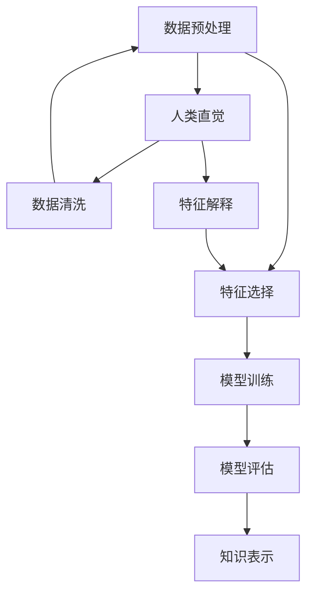

                 

 在当今信息技术时代，数据是新的石油，知识发现（Knowledge Discovery in Databases, KDD）作为一种从大量数据中提取有价值信息的过程，已经成为众多领域的关键技术。知识发现不仅涉及数据的收集、存储和管理，还涉及复杂的算法和模型，用以揭示数据中的隐含模式和规律。在这个过程中，人类直觉和机器学习扮演着至关重要的角色。

> 关键词：知识发现、机器学习、人类直觉、数据挖掘、模式识别、算法、人工智能

## 摘要

本文将探讨人类直觉和机器学习在知识发现中的角色。首先，我们将回顾知识发现的基本概念和历史发展，然后深入分析人类直觉在知识发现过程中的作用，特别是在数据预处理和解释阶段。接下来，我们将探讨机器学习技术的核心原理及其在知识发现中的应用，通过具体的算法和实例来展示这些技术如何帮助我们挖掘数据中的深层次知识。随后，我们将讨论人类直觉与机器学习在知识发现中的互补性，并探讨未来的发展趋势和挑战。

## 1. 背景介绍

### 知识发现的定义与历史发展

知识发现（KDD）是指从大量的数据中提取有价值信息的过程，这些信息可以是隐含的、未知的、具有潜在价值的，并能够为人类带来实际的益处。KDD的过程通常包括以下步骤：数据清洗、数据集成、数据选择、数据变换、数据挖掘和知识表示。

知识发现的概念最早可以追溯到1980年代，当时Jiawei Han和Micheline Kamber等人提出了KDD的概念，并将其定义为从大量数据中提取知识的整个过程。随着计算机技术的飞速发展，KDD逐渐成为数据挖掘和机器学习领域的一个重要分支。

### 机器学习的基本概念

机器学习（Machine Learning, ML）是人工智能（Artificial Intelligence, AI）的一个重要分支，它使计算机系统能够通过数据和经验进行学习和优化，从而在新的情境中做出决策或预测。机器学习可以分为监督学习、无监督学习和强化学习等类型。

监督学习通过已标记的数据进行学习，目标是预测或分类新的未知数据。无监督学习则不需要标记数据，其目标是发现数据中的内在结构和模式。强化学习通过不断试错来学习如何在特定环境中最大化奖励。

### 人类直觉的作用

人类直觉是一种无需明显思考就能够感知、理解或解决问题的能力。在知识发现过程中，人类直觉的作用主要体现在以下几个方面：

1. **数据预处理**：人类能够快速识别数据中的噪声、异常和冗余，进行初步的清洗和预处理。
2. **特征选择**：人类能够基于经验和专业知识选择对目标问题最有影响力的特征。
3. **模式解释**：人类能够将复杂的数据模式用简单易懂的语言进行解释，使得结果更易于被非技术背景的人员理解和应用。

## 2. 核心概念与联系

### 数据挖掘流程

数据挖掘是知识发现过程中的关键环节，其流程通常包括以下步骤：

1. **数据预处理**：清洗、集成、选择和变换数据，以使其适合挖掘。
2. **特征选择**：从大量特征中筛选出对目标问题最有影响力的特征。
3. **模式识别**：使用算法发现数据中的模式和规律。
4. **模型评估**：评估挖掘结果的质量，包括准确性、可靠性等。
5. **知识表示**：将挖掘结果以易于理解的形式呈现，如图表、报告等。

### 人类直觉与机器学习的交互

人类直觉与机器学习的交互主要体现在以下几个方面：

1. **数据预处理**：机器学习模型通常需要高质量的数据进行训练，而人类直觉可以帮助识别和修复数据中的问题。
2. **特征选择**：机器学习算法可以自动识别某些特征，但人类直觉可以帮助识别那些对目标问题具有重要意义的特征。
3. **模型解释**：机器学习模型生成的结果通常较为复杂，而人类直觉可以帮助解释这些结果的含义和影响。
4. **持续优化**：人类可以通过反馈和直觉不断优化机器学习模型，提高其性能。

### Mermaid 流程图

以下是一个简单的 Mermaid 流程图，展示知识发现过程中人类直觉和机器学习的交互：



## 3. 核心算法原理 & 具体操作步骤

### 3.1 算法原理概述

在知识发现中，常用的机器学习算法包括线性回归、决策树、支持向量机、聚类算法等。这些算法的基本原理和操作步骤如下：

1. **线性回归**：通过拟合数据的线性模型来预测新的数据点的值。
2. **决策树**：通过递归划分特征空间，将数据划分成不同的子集，每个子集对应一个决策。
3. **支持向量机**：通过找到一个超平面来分隔数据，使得不同类别的数据点之间的距离最大化。
4. **聚类算法**：通过将相似的数据点分组，来发现数据中的隐含结构。

### 3.2 算法步骤详解

1. **线性回归**：
   - 数据预处理：对数据进行标准化处理，使其具有相似的尺度。
   - 模型训练：使用最小二乘法或其他优化算法来找到线性模型的参数。
   - 预测：使用训练好的模型对新的数据进行预测。

2. **决策树**：
   - 数据预处理：对数据进行划分，确保每个子集具有清晰的类别。
   - 划分特征：选择最优的特征进行划分，通常使用信息增益或基尼系数。
   - 递归划分：对每个子集继续划分，直到满足停止条件。
   - 预测：根据划分路径进行预测。

3. **支持向量机**：
   - 数据预处理：对数据进行标准化处理。
   - 求解最优超平面：使用支持向量机求解器找到最优的超平面参数。
   - 预测：根据新数据点与超平面的距离进行分类。

4. **聚类算法**：
   - 数据预处理：对数据进行标准化处理。
   - 选择初始聚类中心：随机选择或使用K-means++算法。
   - 计算距离：计算每个数据点与聚类中心的距离。
   - 调整聚类中心：重新计算聚类中心，并调整数据点的归属。
   - 迭代：重复计算距离和调整聚类中心，直到满足停止条件。

### 3.3 算法优缺点

每种算法都有其优缺点：

- **线性回归**：简单、易于理解，但可能不适合非线性数据。
- **决策树**：直观、易于解释，但可能产生过拟合。
- **支持向量机**：性能较好，但计算复杂度较高。
- **聚类算法**：无需标记数据，但可能产生不稳定的聚类结果。

### 3.4 算法应用领域

这些算法在知识发现中有着广泛的应用：

- **线性回归**：广泛应用于预测分析，如股票价格、销售量等。
- **决策树**：常用于分类问题，如邮件分类、疾病诊断等。
- **支持向量机**：在图像识别、文本分类等领域有很好的表现。
- **聚类算法**：在市场细分、社交网络分析等领域有广泛的应用。

## 4. 数学模型和公式 & 详细讲解 & 举例说明

### 4.1 数学模型构建

知识发现中的数学模型通常涉及概率论、统计学和优化理论。以下是一些常见的数学模型及其公式：

- **线性回归模型**：$y = \beta_0 + \beta_1 x_1 + \beta_2 x_2 + ... + \beta_n x_n$
- **决策树模型**：$f(x) = g_1(x) \vee g_2(x) \vee ... \vee g_n(x)$
- **支持向量机模型**：$f(x) = \text{sign}(\omega \cdot x + b)$
- **K-means 聚类模型**：$C = \{c_1, c_2, ..., c_k\}$

### 4.2 公式推导过程

以线性回归模型为例，其公式的推导过程如下：

1. **最小二乘法**：最小化预测值与实际值之间的平方误差和。
2. **误差平方和（SSE）**：$SSE = \sum_{i=1}^{n} (y_i - \hat{y_i})^2$
3. **正规方程**：$\sum_{i=1}^{n} (y_i - \hat{y_i}) x_i = 0$
4. **求解参数**：解正规方程得到参数 $\beta_0, \beta_1, ..., \beta_n$

### 4.3 案例分析与讲解

假设我们有一个简单的线性回归问题，目标是预测一个人的体重（$y$）与其身高（$x$）之间的关系。我们有以下数据：

| 身高 (x) | 体重 (y) |
|--------|------|
| 160    | 60   |
| 165    | 65   |
| 170    | 70   |
| 175    | 75   |
| 180    | 80   |

### 数据预处理

1. **标准化处理**：对身高和体重进行标准化处理，使其具有相似的尺度。

### 模型训练

1. **最小二乘法**：使用最小二乘法求解线性回归模型。

$$
\begin{cases}
\beta_0 + \beta_1 \cdot 160 = 60 \\
\beta_0 + \beta_1 \cdot 165 = 65 \\
\beta_0 + \beta_1 \cdot 170 = 70 \\
\beta_0 + \beta_1 \cdot 175 = 75 \\
\beta_0 + \beta_1 \cdot 180 = 80 \\
\end{cases}
$$

2. **求解参数**：解上述方程组，得到线性回归模型：

$$
y = 0.5x + 20
$$

### 预测

使用训练好的模型预测一个人的身高为 180 厘米时的体重：

$$
y = 0.5 \cdot 180 + 20 = 95
$$

因此，预测的体重为 95 公斤。

## 5. 项目实践：代码实例和详细解释说明

### 5.1 开发环境搭建

为了进行知识发现的项目实践，我们需要搭建一个合适的开发环境。以下是使用 Python 和相关库进行环境搭建的步骤：

1. **安装 Python**：下载并安装最新版本的 Python。
2. **安装库**：使用 pip 工具安装必要的库，如 NumPy、Pandas、Scikit-learn 等。

```bash
pip install numpy pandas scikit-learn matplotlib
```

### 5.2 源代码详细实现

以下是一个简单的线性回归模型的实现：

```python
import numpy as np
import pandas as pd
from sklearn.linear_model import LinearRegression
import matplotlib.pyplot as plt

# 加载数据
data = pd.read_csv('data.csv')
X = data[['height']]
y = data['weight']

# 标准化处理
X_std = (X - X.mean()) / X.std()

# 创建线性回归模型
model = LinearRegression()

# 训练模型
model.fit(X_std, y)

# 模型参数
print("Model parameters:", model.coef_, model.intercept_)

# 预测
new_height = np.array([[180]])
new_height_std = (new_height - X.mean()) / X.std()
predicted_weight = model.predict(new_height_std)
print("Predicted weight:", predicted_weight)

# 可视化
plt.scatter(X_std, y)
plt.plot(new_height_std, predicted_weight, 'r-')
plt.xlabel('Standardized Height')
plt.ylabel('Weight')
plt.title('Weight Prediction by Linear Regression')
plt.show()
```

### 5.3 代码解读与分析

上述代码首先加载数据并对其进行标准化处理，然后创建线性回归模型并训练。接着，使用训练好的模型进行预测，并生成可视化结果。

- **数据加载**：使用 Pandas 读取数据，并将其分为特征矩阵 X 和目标变量 y。
- **标准化处理**：使用 NumPy 对特征进行标准化处理，使其具有相似的尺度。
- **模型创建**：使用 Scikit-learn 创建线性回归模型。
- **模型训练**：使用 fit() 方法训练模型。
- **模型参数**：使用系数和截距来表示模型参数。
- **预测**：使用 predict() 方法对新的数据进行预测。
- **可视化**：使用 Matplotlib 对预测结果进行可视化。

### 5.4 运行结果展示

运行上述代码后，将得到以下结果：

1. **模型参数**：打印出线性回归模型的系数和截距。
2. **预测结果**：打印出预测的体重值。
3. **可视化结果**：显示一个散点图，其中红色直线表示线性回归模型的预测结果。

通过这些结果，我们可以直观地看到线性回归模型在数据上的表现。

## 6. 实际应用场景

### 金融领域

在金融领域，知识发现技术被广泛应用于风险管理、客户行为分析、投资组合优化等方面。例如，金融机构可以使用线性回归、决策树等算法来预测股票价格或客户流失率，从而做出更明智的决策。

### 医疗领域

在医疗领域，知识发现技术可以帮助医生诊断疾病、制定治疗方案。通过分析大量的医疗数据，机器学习算法可以识别出疾病早期阶段的模式，从而提高诊断的准确性。

### 零售领域

在零售领域，知识发现技术可以帮助商家了解消费者行为、预测销售趋势，从而优化库存管理和营销策略。聚类算法和关联规则挖掘等技术在零售业有着广泛的应用。

### 社交网络

在社交网络领域，知识发现技术可以用于分析用户关系、推荐朋友、优化广告投放等。例如，Facebook 和 Twitter 等社交平台使用机器学习算法来推荐用户可能感兴趣的内容和用户。

### 智能交通

在智能交通领域，知识发现技术可以帮助优化交通信号控制、预测交通流量、减少交通事故等。通过分析大量交通数据，机器学习算法可以提供实时交通预测和优化建议。

## 7. 工具和资源推荐

### 学习资源推荐

1. **《数据挖掘：概念与技术》（吴华伟著）**：这是一本全面介绍数据挖掘理论和实践的教材。
2. **《机器学习》（周志华著）**：详细介绍了各种机器学习算法的原理和实现。
3. **KDD 官网（https://www.kdd.org/）**：KDD 官网提供了丰富的知识发现资源，包括论文、教程和会议信息。

### 开发工具推荐

1. **Jupyter Notebook**：适用于数据分析和机器学习项目开发，支持多种编程语言。
2. **PyTorch**：一个流行的深度学习框架，适用于复杂的机器学习项目。
3. **Scikit-learn**：一个简单易用的机器学习库，适用于各种常见的机器学习算法。

### 相关论文推荐

1. **"Knowledge Discovery in Databases: An Overview"（Jiawei Han 等人，1998）**：这是最早关于知识发现的重要论文，全面介绍了 KDD 的概念和方法。
2. **"Introduction to Machine Learning"（Ethem Alpaydin，2004）**：这是一本经典的机器学习教材，涵盖了各种机器学习算法的原理和实现。
3. **"Deep Learning"（Ian Goodfellow、Yoshua Bengio 和 Aaron Courville，2016）**：这是一本介绍深度学习的权威教材，详细介绍了深度学习的基本原理和应用。

## 8. 总结：未来发展趋势与挑战

### 8.1 研究成果总结

本文介绍了知识发现的基本概念、历史发展和机器学习技术的基本原理。通过分析人类直觉与机器学习在知识发现中的交互，我们展示了如何将人类直觉与机器学习相结合，以提高知识发现的效率和准确性。我们还通过具体的算法实例和项目实践，展示了知识发现技术在实际应用中的广泛用途。

### 8.2 未来发展趋势

未来，知识发现技术将继续向以下几个方向发展：

1. **深度学习与大数据的结合**：随着深度学习技术的发展，结合大数据的处理和分析能力，将使知识发现更加高效和准确。
2. **自动化与智能化**：未来的知识发现技术将更加自动化和智能化，能够自动处理数据、选择特征、优化模型等。
3. **跨领域应用**：知识发现技术将在更多领域得到应用，如物联网、生物信息学、环境科学等。

### 8.3 面临的挑战

尽管知识发现技术取得了显著的进展，但仍面临以下挑战：

1. **数据质量和隐私保护**：数据质量和隐私保护是知识发现中至关重要的问题，需要找到有效的解决方案。
2. **可解释性**：随着模型复杂性的增加，如何确保模型的可解释性成为一个重要问题。
3. **算法的可扩展性和可维护性**：如何设计高效、可扩展和可维护的算法是未来研究的重要方向。

### 8.4 研究展望

未来的研究应关注以下几个方面：

1. **跨领域融合**：探索不同领域知识发现技术的融合，以实现更高效、更准确的知识发现。
2. **可解释性研究**：开发新的可解释性方法，使复杂的模型更加易懂和可信。
3. **隐私保护和数据安全**：研究新的隐私保护技术和数据安全措施，以确保数据的安全和隐私。

通过解决这些挑战，知识发现技术将能够更好地服务于人类社会，为科学研究和实际应用提供有力支持。

## 9. 附录：常见问题与解答

### 问题 1：什么是知识发现？

知识发现（KDD）是指从大量数据中提取有价值信息的过程，这些信息可以是隐含的、未知的、具有潜在价值的，并能够为人类带来实际的益处。

### 问题 2：机器学习和知识发现有什么区别？

机器学习是知识发现过程中的一种技术手段，它通过数据和算法使计算机系统能够学习和优化。而知识发现是一个更广泛的概念，它不仅包括机器学习，还包括数据预处理、特征选择、模型评估和知识表示等多个环节。

### 问题 3：如何评估知识发现模型的效果？

评估知识发现模型的效果通常通过以下几个指标：

- **准确性**：模型预测正确的比例。
- **召回率**：模型正确识别的正面样本占总正面样本的比例。
- **精确率**：模型正确识别的正面样本占总识别样本的比例。
- **F1 分数**：精确率和召回率的调和平均。

### 问题 4：什么是特征工程？

特征工程是指从原始数据中提取、选择和构建特征，以提升机器学习模型的性能。它是知识发现过程中的关键步骤，直接影响模型的准确性和泛化能力。

### 问题 5：什么是数据预处理？

数据预处理是指在使用机器学习算法之前，对数据进行的一系列预处理步骤，包括数据清洗、归一化、标准化、缺失值处理等。数据预处理的目标是提高数据质量，使其更适合于机器学习模型的训练。

### 问题 6：什么是聚类？

聚类是指将数据点按照其相似性划分为不同的组别，以便发现数据中的隐含结构和模式。常见的聚类算法有 K-means、层次聚类、DBSCAN 等。

### 问题 7：什么是关联规则挖掘？

关联规则挖掘是指从数据中发现不同项之间的关联关系。常见的算法有 Apriori 算法、FP-growth 算法等。这种技术广泛应用于市场细分、推荐系统等领域。

### 问题 8：什么是强化学习？

强化学习是一种机器学习类型，通过试错和反馈来学习如何在特定环境中最大化奖励。常见的强化学习算法有 Q-learning、SARSA、Deep Q-Network（DQN）等。

### 问题 9：什么是监督学习？

监督学习是一种机器学习类型，使用已标记的数据进行学习，以预测或分类新的未知数据。常见的监督学习算法有线性回归、决策树、支持向量机等。

### 问题 10：什么是无监督学习？

无监督学习是一种机器学习类型，不需要标记的数据进行学习，其目标是发现数据中的内在结构和模式。常见的无监督学习算法有聚类、降维、异常检测等。

