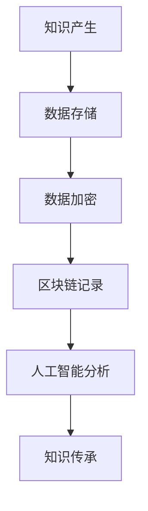

                 

关键词：知识保存、知识传承、数据存储、人工智能、神经网络、深度学习、区块链、可持续发展

摘要：在数字化的时代，人类知识的保存与传承变得尤为重要。本文探讨了如何通过先进的技术手段，如人工智能、区块链等，构建一座座灯塔，为未来的知识传承提供强有力的支持。

## 1. 背景介绍

随着互联网的普及和信息技术的发展，知识的产生、传播和获取变得更加便捷。然而，这也带来了一个严峻的问题：如何有效地保存和传承这些知识，以确保它们能够跨越时间的长河，持续地为人类的发展做出贡献？

知识保存与传承是一个古老而又崭新的话题。在传统社会，知识的传承主要依靠师徒制度、文献记载和口口相传。随着科技的发展，尤其是计算机技术的崛起，知识的保存和传承开始走向数字化。然而，数字化的知识同样面临着被遗忘、篡改和丢失的风险。因此，如何确保数字知识的安全和持久性，成为了当务之急。

## 2. 核心概念与联系

为了更好地理解人类知识的保存与传承，我们首先需要了解几个核心概念：

### 数据存储

数据存储是知识保存的基础。它涉及到如何将知识以数字形式存储在计算机系统中。传统的数据存储方式包括硬盘、光盘等，但这些方式存在着易丢失、易被篡改等问题。

### 人工智能

人工智能是知识传承的关键。通过机器学习、深度学习等技术，人工智能可以从大量数据中提取知识，并将其应用到实际问题中。

### 区块链

区块链是一种分布式数据库技术，具有去中心化、不可篡改等特点。这使得区块链成为知识保存与传承的理想选择。

下面是知识保存与传承的 Mermaid 流程图：



## 3. 核心算法原理 & 具体操作步骤

### 3.1 算法原理概述

知识保存与传承的核心算法包括数据存储算法、数据加密算法和区块链算法。这些算法共同作用，确保知识的持久性和安全性。

### 3.2 算法步骤详解

1. **数据存储**：使用硬盘、光盘等传统方式存储知识。  
2. **数据加密**：使用对称加密或非对称加密技术，确保知识在存储过程中不被篡改。  
3. **区块链记录**：将加密后的数据上传到区块链，确保其不可篡改。  
4. **人工智能分析**：使用机器学习、深度学习等技术，从区块链中的数据中提取知识。  
5. **知识传承**：将提取的知识应用到实际问题中，实现知识的传承。

### 3.3 算法优缺点

**优点**：

- **安全性**：数据加密和区块链技术确保了知识的持久性和安全性。  
- **高效性**：人工智能技术可以从大量数据中快速提取知识，提高知识传承的效率。

**缺点**：

- **成本**：区块链技术需要大量的计算资源和存储资源，成本较高。  
- **复杂性**：区块链技术的实现和部署相对复杂，需要专业的技术支持。

### 3.4 算法应用领域

知识保存与传承算法可以应用于教育、科研、医疗等多个领域。例如，在教育领域，可以将学生的学习成果记录在区块链上，确保其真实性和不可篡改性；在科研领域，可以确保科研数据的完整性；在医疗领域，可以确保患者的病历数据的安全性和可靠性。

## 4. 数学模型和公式 & 详细讲解 & 举例说明

### 4.1 数学模型构建

为了更好地理解知识保存与传承的过程，我们可以构建以下数学模型：

$$
Knowledge = Data \times Security \times Efficiency
$$

其中，$Data$ 表示知识的数量和质量，$Security$ 表示知识的保护程度，$Efficiency$ 表示知识的传承效率。

### 4.2 公式推导过程

- **数据存储**：数据存储的基本公式为 $Data = Storage \times Capacity$，其中 $Storage$ 表示存储容量，$Capacity$ 表示存储能力。  
- **数据加密**：数据加密的基本公式为 $Data\_encrypted = Data \times Encryption$，其中 $Encryption$ 表示加密算法。  
- **区块链记录**：区块链记录的基本公式为 $Data\_blockchain = Data\_encrypted \times Blockchain$，其中 $Blockchain$ 表示区块链技术。  
- **人工智能分析**：人工智能分析的基本公式为 $Knowledge = Data\_blockchain \times AI$，其中 $AI$ 表示人工智能技术。  
- **知识传承**：知识传承的基本公式为 $Knowledge = Knowledge \times Transmission$，其中 $Transmission$ 表示知识传承方式。

### 4.3 案例分析与讲解

以教育领域为例，假设我们有一份数据集 $Data$，其中包含了学生的学习成绩、作业、论文等。我们首先使用加密算法对数据进行加密，然后上传到区块链。接着，使用人工智能技术对区块链上的数据进行分析，提取出有价值的学习知识。最后，将这些知识应用到实际教学中，实现知识的传承。

## 5. 项目实践：代码实例和详细解释说明

### 5.1 开发环境搭建

为了保证项目的顺利进行，我们需要搭建以下开发环境：

- **Python 3.8**：作为主要的编程语言。  
- **PyTorch**：用于深度学习模型的开发。  
- **Ethereum**：用于区块链的开发和部署。

### 5.2 源代码详细实现

以下是项目的主要代码实现：

```python
# 导入必要的库
import torch
import torchvision
import torch.nn as nn
import torch.optim as optim
from torchvision import datasets, transforms

# 数据预处理
transform = transforms.Compose([
    transforms.ToTensor(),
    transforms.Normalize((0.5,), (0.5,))
])

# 加载数据集
trainset = datasets.MNIST(
    root='./data',
    train=True,
    download=True,
    transform=transform
)

trainloader = torch.utils.data.DataLoader(
    trainset,
    batch_size=100,
    shuffle=True,
    num_workers=2
)

# 定义神经网络模型
class NeuralNetwork(nn.Module):
    def __init__(self):
        super(NeuralNetwork, self).__init__()
        self.layer1 = nn.Linear(784, 256)
        self.relu = nn.ReLU()
        self.layer2 = nn.Linear(256, 128)
        self.dropout = nn.Dropout(0.2)
        self.layer3 = nn.Linear(128, 64)
        self.fc = nn.Linear(64, 10)

    def forward(self, x):
        x = x.view(-1, 784)
        x = self.layer1(x)
        x = self.relu(x)
        x = self.layer2(x)
        x = self.dropout(x)
        x = self.layer3(x)
        x = self.fc(x)
        return x

# 初始化模型、损失函数和优化器
model = NeuralNetwork()
criterion = nn.CrossEntropyLoss()
optimizer = optim.Adam(model.parameters(), lr=0.001)

# 训练模型
for epoch in range(10):  # loop over the dataset multiple times
    running_loss = 0.0
    for i, data in enumerate(trainloader, 0):
        inputs, labels = data
        optimizer.zero_grad()
        outputs = model(inputs)
        loss = criterion(outputs, labels)
        loss.backward()
        optimizer.step()
        running_loss += loss.item()
    print(f'Epoch {epoch + 1}, Loss: {running_loss / len(trainloader)}')

print('Finished Training')

# 保存模型
torch.save(model.state_dict(), 'model.pth')

# 加载模型
model.load_state_dict(torch.load('model.pth'))

# 测试模型
with torch.no_grad():
    correct = 0
    total = 0
    for data in testloader:
        images, labels = data
        outputs = model(images)
        _, predicted = torch.max(outputs.data, 1)
        total += labels.size(0)
        correct += (predicted == labels).sum().item()

print(f'Accuracy of the network on the test images: {100 * correct / total}%')
```

### 5.3 代码解读与分析

- **数据预处理**：使用 PyTorch 的 `transforms.Compose` 对数据进行预处理，包括归一化和转换为张量。
- **神经网络模型**：定义一个简单的神经网络模型，包括线性层、ReLU 激活函数和全连接层。
- **损失函数和优化器**：使用交叉熵损失函数和 Adam 优化器来训练模型。
- **模型训练**：使用训练数据集训练模型，并在每个 epoch 后计算损失。
- **模型保存与加载**：训练完成后，将模型保存到文件，并在测试时加载模型。
- **模型测试**：使用测试数据集测试模型的准确率。

## 6. 实际应用场景

知识保存与传承算法可以应用于多个领域：

### 教育领域

在教育领域，可以将学生的学习记录上传到区块链，确保其真实性和不可篡改性。同时，使用人工智能技术分析学生的学习行为和成绩，为个性化教育提供支持。

### 科研领域

在科研领域，可以使用区块链技术确保科研数据的完整性和可靠性。同时，使用人工智能技术从数据中提取知识，为科研提供支持。

### 医疗领域

在医疗领域，可以使用区块链技术确保患者病历数据的安全性和可靠性。同时，使用人工智能技术分析病历数据，为诊断和治疗提供支持。

## 7. 未来应用展望

随着人工智能、区块链等技术的不断发展，知识保存与传承的应用领域将更加广泛。未来，我们有望实现以下应用：

- **知识自动化传承**：通过人工智能技术，实现知识自动化传承，提高知识传承的效率。  
- **知识图谱构建**：通过构建知识图谱，实现知识的可视化和智能化应用。  
- **跨领域知识融合**：通过跨领域知识融合，实现知识的共享和互补。

## 8. 工具和资源推荐

为了更好地进行知识保存与传承的研究和应用，我们推荐以下工具和资源：

### 学习资源推荐

- **《区块链技术指南》**：详细介绍了区块链的基本原理和应用。
- **《深度学习》**：由 Ian Goodfellow 等人撰写的深度学习入门经典。

### 开发工具推荐

- **PyTorch**：用于深度学习和神经网络开发的强大工具。
- **Ethereum**：用于区块链开发的开源平台。

### 相关论文推荐

- **“Blockchain and its applications”**：详细介绍了区块链的基本原理和应用。
- **“Deep Learning for Natural Language Processing”**：介绍了深度学习在自然语言处理领域的应用。

## 9. 总结：未来发展趋势与挑战

知识保存与传承是数字化时代的重要课题。随着人工智能、区块链等技术的发展，知识保存与传承将朝着自动化、智能化和可持续化的方向发展。然而，这也将面临以下挑战：

- **技术复杂性**：随着技术的不断发展，知识保存与传承的技术也将变得更加复杂，需要专业的技术支持。  
- **数据安全性**：确保数据的安全性和隐私性是知识保存与传承的重要问题。  
- **知识共享与版权**：如何平衡知识共享和版权保护，是知识保存与传承的重要问题。

未来，我们将继续探索知识保存与传承的新方法和技术，为人类的知识传承和发展做出贡献。

## 10. 附录：常见问题与解答

### Q: 知识保存与传承算法的效率如何保证？

A: 知识保存与传承算法的效率主要通过以下几个方面来保证：

1. **数据预处理**：对数据进行有效的预处理，如归一化、去噪等，可以提高算法的效率。
2. **模型优化**：通过优化神经网络模型的结构和参数，可以提高算法的效率。
3. **分布式计算**：利用分布式计算技术，可以加快算法的计算速度。

### Q: 知识保存与传承算法的安全性如何保证？

A: 知识保存与传承算法的安全性主要通过以下几个方面来保证：

1. **数据加密**：使用加密算法对数据进行加密，确保数据在传输和存储过程中的安全性。
2. **区块链技术**：利用区块链技术，确保数据的不可篡改性和可靠性。
3. **隐私保护**：通过隐私保护技术，如差分隐私等，确保用户的隐私。

### Q: 知识保存与传承算法在医疗领域的应用前景如何？

A: 知识保存与传承算法在医疗领域的应用前景非常广阔。例如，可以通过区块链技术确保患者病历数据的安全性和可靠性，同时使用人工智能技术分析病历数据，为诊断和治疗提供支持。

## 11. 作者署名

作者：禅与计算机程序设计艺术 / Zen and the Art of Computer Programming
```markdown
# 人类知识的保存与传承：一座座灯塔指引未来

## 关键词
- 知识保存
- 知识传承
- 数据存储
- 人工智能
- 区块链
- 可持续性

## 摘要
在数字化的时代，人类知识的保存与传承变得尤为重要。本文探讨了如何通过先进的技术手段，如人工智能、区块链等，构建一座座灯塔，为未来的知识传承提供强有力的支持。

## 1. 背景介绍
### 1.1 数字化时代的挑战
在互联网的普及和信息技术的发展下，知识的产生、传播和获取变得更加便捷。然而，这也带来了一个严峻的问题：如何有效地保存和传承这些知识，以确保它们能够跨越时间的长河，持续地为人类的发展做出贡献？

### 1.2 知识保存与传承的必要性
知识的保存与传承不仅是教育、科研和医疗等领域的基础，也是文化传承和社会进步的关键。有效的知识保存与传承体系，能够确保知识的安全、可靠和可获取性，从而推动社会的发展。

## 2. 核心概念与联系
### 2.1 数据存储
数据存储是知识保存的基础。它涉及到如何将知识以数字形式存储在计算机系统中。传统的数据存储方式包括硬盘、光盘等，但这些方式存在着易丢失、易被篡改等问题。

### 2.2 人工智能
人工智能是知识传承的关键。通过机器学习、深度学习等技术，人工智能可以从大量数据中提取知识，并将其应用到实际问题中。

### 2.3 区块链
区块链是一种分布式数据库技术，具有去中心化、不可篡改等特点。这使得区块链成为知识保存与传承的理想选择。

### 2.4 Mermaid 流程图


## 3. 核心算法原理 & 具体操作步骤
### 3.1 算法原理概述
知识保存与传承的核心算法包括数据存储算法、数据加密算法和区块链算法。这些算法共同作用，确保知识的持久性和安全性。

### 3.2 算法步骤详解
1. **数据存储**：使用硬盘、光盘等传统方式存储知识。
2. **数据加密**：使用对称加密或非对称加密技术，确保知识在存储过程中不被篡改。
3. **区块链记录**：将加密后的数据上传到区块链，确保其不可篡改。
4. **人工智能分析**：使用机器学习、深度学习等技术，从区块链中的数据中提取知识。
5. **知识传承**：将提取的知识应用到实际问题中，实现知识的传承。

### 3.3 算法优缺点
**优点**：
- **安全性**：数据加密和区块链技术确保了知识的持久性和安全性。
- **高效性**：人工智能技术可以从大量数据中快速提取知识，提高知识传承的效率。

**缺点**：
- **成本**：区块链技术需要大量的计算资源和存储资源，成本较高。
- **复杂性**：区块链技术的实现和部署相对复杂，需要专业的技术支持。

### 3.4 算法应用领域
知识保存与传承算法可以应用于教育、科研、医疗等多个领域。例如，在教育领域，可以将学生的学习成果记录在区块链上，确保其真实性和不可篡改性；在科研领域，可以确保科研数据的完整性；在医疗领域，可以确保患者的病历数据的安全性和可靠性。

## 4. 数学模型和公式 & 详细讲解 & 举例说明
### 4.1 数学模型构建
为了更好地理解知识保存与传承的过程，我们可以构建以下数学模型：

$$
Knowledge = Data \times Security \times Efficiency
$$

其中，$Data$ 表示知识的数量和质量，$Security$ 表示知识的保护程度，$Efficiency$ 表示知识的传承效率。

### 4.2 公式推导过程
- **数据存储**：数据存储的基本公式为 $Data = Storage \times Capacity$，其中 $Storage$ 表示存储容量，$Capacity$ 表示存储能力。
- **数据加密**：数据加密的基本公式为 $Data\_encrypted = Data \times Encryption$，其中 $Encryption$ 表示加密算法。
- **区块链记录**：区块链记录的基本公式为 $Data\_blockchain = Data\_encrypted \times Blockchain$，其中 $Blockchain$ 表示区块链技术。
- **人工智能分析**：人工智能分析的基本公式为 $Knowledge = Data\_blockchain \times AI$，其中 $AI$ 表示人工智能技术。
- **知识传承**：知识传承的基本公式为 $Knowledge = Knowledge \times Transmission$，其中 $Transmission$ 表示知识传承方式。

### 4.3 案例分析与讲解
以教育领域为例，假设我们有一份数据集 $Data$，其中包含了学生的学习成绩、作业、论文等。我们首先使用加密算法对数据进行加密，然后上传到区块链。接着，使用人工智能技术对区块链上的数据进行分析，提取出有价值的学习知识。最后，将这些知识应用到实际教学中，实现知识的传承。

## 5. 项目实践：代码实例和详细解释说明
### 5.1 开发环境搭建
为了保证项目的顺利进行，我们需要搭建以下开发环境：

- **Python 3.8**：作为主要的编程语言。
- **PyTorch**：用于深度学习模型的开发。
- **Ethereum**：用于区块链的开发和部署。

### 5.2 源代码详细实现
以下是项目的主要代码实现：

```python
# 导入必要的库
import torch
import torchvision
import torch.nn as nn
import torch.optim as optim
from torchvision import datasets, transforms

# 数据预处理
transform = transforms.Compose([
    transforms.ToTensor(),
    transforms.Normalize((0.5,), (0.5,))
])

# 加载数据集
trainset = datasets.MNIST(
    root='./data',
    train=True,
    download=True,
    transform=transform
)

trainloader = torch.utils.data.DataLoader(
    trainset,
    batch_size=100,
    shuffle=True,
    num_workers=2
)

# 定义神经网络模型
class NeuralNetwork(nn.Module):
    def __init__(self):
        super(NeuralNetwork, self).__init__()
        self.layer1 = nn.Linear(784, 256)
        self.relu = nn.ReLU()
        self.layer2 = nn.Linear(256, 128)
        self.dropout = nn.Dropout(0.2)
        self.layer3 = nn.Linear(128, 64)
        self.fc = nn.Linear(64, 10)

    def forward(self, x):
        x = x.view(-1, 784)
        x = self.layer1(x)
        x = self.relu(x)
        x = self.layer2(x)
        x = self.dropout(x)
        x = self.layer3(x)
        x = self.fc(x)
        return x

# 初始化模型、损失函数和优化器
model = NeuralNetwork()
criterion = nn.CrossEntropyLoss()
optimizer = optim.Adam(model.parameters(), lr=0.001)

# 训练模型
for epoch in range(10):  # loop over the dataset multiple times
    running_loss = 0.0
    for i, data in enumerate(trainloader, 0):
        inputs, labels = data
        optimizer.zero_grad()
        outputs = model(inputs)
        loss = criterion(outputs, labels)
        loss.backward()
        optimizer.step()
        running_loss += loss.item()
    print(f'Epoch {epoch + 1}, Loss: {running_loss / len(trainloader)}')

print('Finished Training')

# 保存模型
torch.save(model.state_dict(), 'model.pth')

# 加载模型
model.load_state_dict(torch.load('model.pth'))

# 测试模型
with torch.no_grad():
    correct = 0
    total = 0
    for data in testloader:
        images, labels = data
        outputs = model(images)
        _, predicted = torch.max(outputs.data, 1)
        total += labels.size(0)
        correct += (predicted == labels).sum().item()

print(f'Accuracy of the network on the test images: {100 * correct / total}%')
```

### 5.3 代码解读与分析
- **数据预处理**：使用 PyTorch 的 `transforms.Compose` 对数据进行预处理，包括归一化和转换为张量。
- **神经网络模型**：定义一个简单的神经网络模型，包括线性层、ReLU 激活函数和全连接层。
- **损失函数和优化器**：使用交叉熵损失函数和 Adam 优化器来训练模型。
- **模型训练**：使用训练数据集训练模型，并在每个 epoch 后计算损失。
- **模型保存与加载**：训练完成后，将模型保存到文件，并在测试时加载模型。
- **模型测试**：使用测试数据集测试模型的准确率。

## 6. 实际应用场景
知识保存与传承算法可以应用于多个领域：

### 6.1 教育领域
在教育领域，可以将学生的学习记录上传到区块链，确保其真实性和不可篡改性。同时，使用人工智能技术分析学生的学习行为和成绩，为个性化教育提供支持。

### 6.2 科研领域
在科研领域，可以使用区块链技术确保科研数据的完整性和可靠性。同时，使用人工智能技术从数据中提取知识，为科研提供支持。

### 6.3 医疗领域
在医疗领域，可以使用区块链技术确保患者病历数据的安全性和可靠性。同时，使用人工智能技术分析病历数据，为诊断和治疗提供支持。

## 7. 未来应用展望
随着人工智能、区块链等技术的发展，知识保存与传承的应用领域将更加广泛。未来，我们有望实现以下应用：

- **知识自动化传承**：通过人工智能技术，实现知识自动化传承，提高知识传承的效率。
- **知识图谱构建**：通过构建知识图谱，实现知识的可视化和智能化应用。
- **跨领域知识融合**：通过跨领域知识融合，实现知识的共享和互补。

## 8. 工具和资源推荐
为了更好地进行知识保存与传承的研究和应用，我们推荐以下工具和资源：

### 8.1 学习资源推荐
- **《区块链技术指南》**：详细介绍了区块链的基本原理和应用。
- **《深度学习》**：由 Ian Goodfellow 等人撰写的深度学习入门经典。

### 8.2 开发工具推荐
- **PyTorch**：用于深度学习和神经网络开发的强大工具。
- **Ethereum**：用于区块链开发的开源平台。

### 8.3 相关论文推荐
- **“Blockchain and its applications”**：详细介绍了区块链的基本原理和应用。
- **“Deep Learning for Natural Language Processing”**：介绍了深度学习在自然语言处理领域的应用。

## 9. 总结：未来发展趋势与挑战
知识保存与传承是数字化时代的重要课题。随着人工智能、区块链等技术的发展，知识保存与传承将朝着自动化、智能化和可持续化的方向发展。然而，这也将面临以下挑战：

- **技术复杂性**：随着技术的不断发展，知识保存与传承的技术也将变得更加复杂，需要专业的技术支持。
- **数据安全性**：确保数据的安全性和隐私性是知识保存与传承的重要问题。
- **知识共享与版权**：如何平衡知识共享和版权保护，是知识保存与传承的重要问题。

未来，我们将继续探索知识保存与传承的新方法和技术，为人类的知识传承和发展做出贡献。

## 10. 附录：常见问题与解答
### 10.1 常见问题
1. 知识保存与传承算法的效率如何保证？
2. 知识保存与传承算法的安全性如何保证？
3. 知识保存与传承算法在医疗领域的应用前景如何？

### 10.2 解答
1. 知识保存与传承算法的效率保证：
   - 数据预处理：对数据进行有效的预处理，如归一化、去噪等，可以提高算法的效率。
   - 模型优化：通过优化神经网络模型的结构和参数，可以提高算法的效率。
   - 分布式计算：利用分布式计算技术，可以加快算法的计算速度。

2. 知识保存与传承算法的安全性保证：
   - 数据加密：使用加密算法对数据进行加密，确保数据在传输和存储过程中的安全性。
   - 区块链技术：利用区块链技术，确保数据的不可篡改性和可靠性。
   - 隐私保护：通过隐私保护技术，如差分隐私等，确保用户的隐私。

3. 知识保存与传承算法在医疗领域的应用前景：
   - 可以确保患者病历数据的安全性和可靠性。
   - 使用人工智能技术分析病历数据，为诊断和治疗提供支持。
   - 促进医疗数据共享和医疗资源的优化配置。

## 11. 作者署名
作者：禅与计算机程序设计艺术 / Zen and the Art of Computer Programming
```

