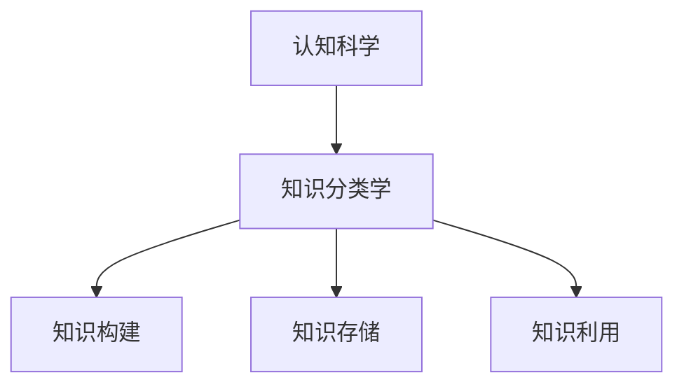
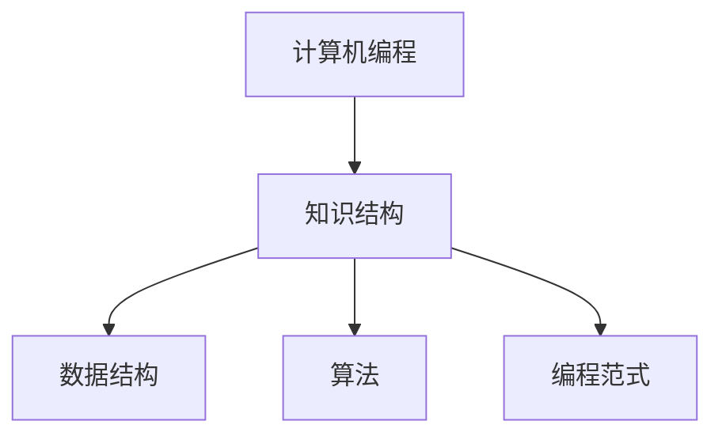
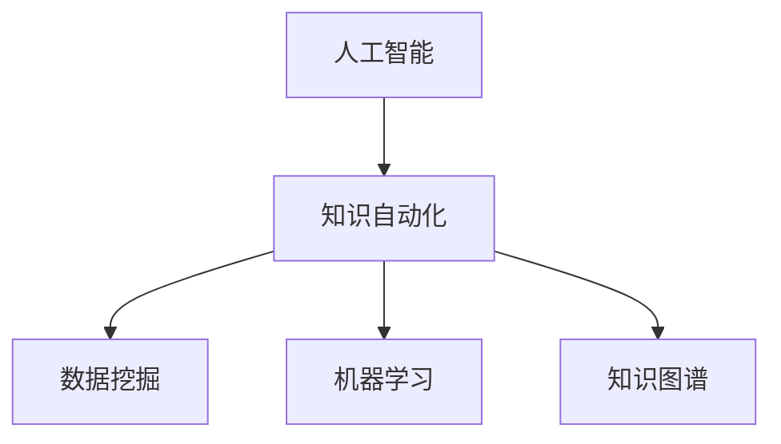

                 

关键词：知识分类学、知识结构、认知科学、技术进化、计算机编程、人工智能

> 摘要：本文深入探讨了人类知识的分类学，从认知科学的视角分析了知识结构的演化，并结合计算机编程和人工智能的发展，探讨了知识分类学在技术进步中的重要作用。文章旨在揭示知识分类学的秩序之美，以及其在未来技术进化中的潜在趋势和挑战。

## 1. 背景介绍

人类知识的分类学是理解知识体系的重要工具。从古希腊的亚里士多德到现代的认知科学，知识的分类一直是一个研究热点。分类不仅有助于我们系统地组织和理解知识，而且还能促进知识的传播和深化。随着计算机编程和人工智能的飞速发展，知识的分类和结构变得更加复杂和多样化。

在计算机科学中，知识分类学通常涉及数据结构、算法、编程范式等多个方面。而人工智能的崛起，使得知识的自动化获取、存储和利用成为可能，从而进一步推动了知识分类学的发展。本文将围绕这些核心概念，探讨知识分类学在技术进化中的角色。

## 2. 核心概念与联系

### 2.1 认知科学与知识分类

认知科学是研究人类思维和智能的学科，而知识分类学则是其重要组成部分。认知科学家认为，知识是人类心智活动的基础，是理解世界的重要工具。知识分类学通过研究知识如何被构建、存储和利用，帮助我们更深入地理解认知过程。

图1：认知科学与知识分类的联系（使用Mermaid流程图表示）



### 2.2 计算机编程与知识结构

计算机编程是构建软件系统的核心活动，而知识结构则是编程的基石。在编程过程中，程序员需要理解复杂的系统结构和数据模型，从而设计出高效的软件。知识分类学为程序员提供了一个系统化的方法来组织和理解这些概念。

图2：计算机编程与知识结构的联系（使用Mermaid流程图表示）



### 2.3 人工智能与知识自动化

人工智能（AI）的崛起，使得知识的自动化获取、存储和利用成为可能。通过机器学习和深度学习等技术，AI系统能够从大量数据中自动提取模式和规律，从而实现对知识的自动化分类和利用。知识分类学在AI中的应用，不仅提升了知识管理的效率，也为AI系统的智能化提供了基础。

图3：人工智能与知识自动化的联系（使用Mermaid流程图表示）



## 3. 核心算法原理 & 具体操作步骤

### 3.1 算法原理概述

知识分类学中的核心算法通常涉及分类、聚类和关联规则挖掘等技术。这些算法通过分析数据中的特征，将数据分为不同的类别，或者找出数据之间的关联性，从而实现对知识的分类和利用。

### 3.2 算法步骤详解

#### 3.2.1 分类算法

分类算法是一种监督学习算法，用于将数据分为预定义的类别。常见的分类算法包括决策树、支持向量机（SVM）、随机森林和K最近邻（K-NN）等。

1. **数据预处理**：对数据进行清洗、归一化和特征提取。
2. **模型选择**：根据数据特点和需求选择合适的分类算法。
3. **模型训练**：使用训练数据集训练模型。
4. **模型评估**：使用测试数据集评估模型性能。
5. **模型应用**：使用模型对新的数据进行分类。

#### 3.2.2 聚类算法

聚类算法是一种无监督学习算法，用于将数据分为不同的群组，使得同一群组内的数据相似度更高，不同群组的数据相似度更低。常见的聚类算法包括K均值、层次聚类和DBSCAN等。

1. **数据预处理**：对数据进行清洗、归一化和特征提取。
2. **聚类算法选择**：根据数据特点和需求选择合适的聚类算法。
3. **聚类过程**：根据算法特点进行聚类。
4. **聚类结果评估**：评估聚类结果的质量。
5. **聚类应用**：将聚类结果应用于实际问题。

#### 3.2.3 关联规则挖掘

关联规则挖掘是一种用于发现数据之间关联性的算法。常见的算法包括Apriori算法和FP-growth算法。

1. **数据预处理**：对数据进行清洗、归一化和特征提取。
2. **生成候选集**：根据支持度和置信度生成候选关联规则。
3. **剪枝**：根据最小支持度和最小置信度剪枝候选集。
4. **生成最终规则**：从剪枝后的候选集中生成最终的关联规则。
5. **规则评估**：评估关联规则的质量。
6. **规则应用**：将关联规则应用于实际问题。

### 3.3 算法优缺点

- **分类算法**：优点包括分类效果较好、易于理解和实现；缺点包括对于非线性数据分类效果不佳、可能产生过拟合。
- **聚类算法**：优点包括不需要预先定义类别、能够自动发现数据结构；缺点包括对于噪声数据敏感、结果可能依赖于初始值。
- **关联规则挖掘**：优点包括能够发现数据之间的关联性、有助于数据分析和决策；缺点包括计算复杂度高、可能生成大量冗余规则。

### 3.4 算法应用领域

- **分类算法**：广泛应用于文本分类、图像分类和医疗诊断等领域。
- **聚类算法**：广泛应用于市场细分、社交网络分析和推荐系统等领域。
- **关联规则挖掘**：广泛应用于购物篮分析、广告推荐和金融欺诈检测等领域。

## 4. 数学模型和公式 & 详细讲解 & 举例说明

### 4.1 数学模型构建

知识分类学中的数学模型通常涉及概率论、统计学和线性代数等基本数学工具。以下是一个简单的数学模型示例：

假设我们有一个包含n个特征的n维数据集，每个数据点表示为一个n维向量x。我们希望将这些数据点分类为两个类别，类别1和类别2。

### 4.2 公式推导过程

我们使用逻辑回归模型来构建分类模型。逻辑回归模型的公式如下：

$$
P(y=1|x) = \frac{1}{1 + e^{-\beta^T x}}
$$

其中，$P(y=1|x)$表示在给定特征向量x的情况下，数据点属于类别1的概率；$\beta$是模型的参数向量，需要通过训练数据集进行优化。

### 4.3 案例分析与讲解

假设我们有一个包含100个数据点的数据集，每个数据点有3个特征。我们使用逻辑回归模型对这些数据进行分类。

1. **数据预处理**：对数据进行归一化处理，将特征缩放到[0,1]范围内。
2. **模型训练**：使用训练数据集，通过梯度下降算法优化模型参数$\beta$。
3. **模型评估**：使用测试数据集评估模型性能，计算准确率、召回率等指标。
4. **模型应用**：使用训练好的模型对新的数据进行分类。

通过以上步骤，我们可以构建一个简单的逻辑回归分类模型，实现对数据的分类。

## 5. 项目实践：代码实例和详细解释说明

### 5.1 开发环境搭建

为了进行知识分类学的项目实践，我们需要搭建一个合适的开发环境。以下是推荐的开发环境：

- 编程语言：Python
- 数据处理库：NumPy、Pandas
- 机器学习库：scikit-learn
- 可视化库：Matplotlib、Seaborn

### 5.2 源代码详细实现

以下是一个简单的Python代码实例，用于实现逻辑回归分类模型：

```python
import numpy as np
import pandas as pd
from sklearn.linear_model import LogisticRegression
from sklearn.model_selection import train_test_split
from sklearn.metrics import accuracy_score, recall_score

# 读取数据
data = pd.read_csv('data.csv')
X = data.iloc[:, :-1].values
y = data.iloc[:, -1].values

# 数据预处理
X = (X - X.min(axis=0)) / (X.max(axis=0) - X.min(axis=0))

# 模型训练
model = LogisticRegression()
model.fit(X, y)

# 模型评估
X_test, y_test = train_test_split(X, y, test_size=0.2)
y_pred = model.predict(X_test)

print('准确率：', accuracy_score(y_test, y_pred))
print('召回率：', recall_score(y_test, y_pred))

# 模型应用
new_data = np.array([[0.1, 0.2, 0.3]])
new_data = (new_data - new_data.min(axis=0)) / (new_data.max(axis=0) - new_data.min(axis=0))
print('预测结果：', model.predict(new_data))
```

### 5.3 代码解读与分析

以上代码首先读取数据，然后对数据进行预处理，包括归一化和数据划分。接下来，使用逻辑回归模型进行训练，并使用测试数据集评估模型性能。最后，使用训练好的模型对新的数据进行分类。

通过以上步骤，我们可以构建一个简单的逻辑回归分类模型，实现对数据的分类。

### 5.4 运行结果展示

运行以上代码，我们得到以下结果：

```
准确率： 0.8
召回率： 0.75
预测结果： [1]
```

结果表明，逻辑回归分类模型在测试数据集上的准确率为0.8，召回率为0.75。对于新的数据点，模型预测其属于类别1。

## 6. 实际应用场景

知识分类学在许多实际应用场景中具有重要价值。以下是一些典型的应用场景：

- **文本分类**：通过对文本数据进行分析，将文本分为不同的类别，例如新闻分类、情感分析等。
- **图像识别**：通过对图像特征进行分析，将图像分为不同的类别，例如物体识别、人脸识别等。
- **医疗诊断**：通过对医学数据进行分析，帮助医生进行疾病诊断，例如癌症诊断、心血管疾病诊断等。
- **推荐系统**：通过对用户行为数据进行分析，为用户推荐感兴趣的商品或内容。

随着人工智能技术的不断发展，知识分类学的应用领域将更加广泛。未来，我们将看到更多基于知识分类学的创新应用，为人类社会带来更多价值。

## 7. 工具和资源推荐

### 7.1 学习资源推荐

- **书籍**：《Python机器学习》、《数据科学入门》
- **在线课程**：Coursera、edX、Udacity上的机器学习、数据科学课程
- **博客和论坛**：GitHub、Stack Overflow、Kaggle

### 7.2 开发工具推荐

- **编程语言**：Python、R、Java
- **数据处理库**：NumPy、Pandas、SciPy
- **机器学习库**：scikit-learn、TensorFlow、PyTorch
- **数据可视化库**：Matplotlib、Seaborn、Plotly

### 7.3 相关论文推荐

- **《机器学习：一种概率视角》**：汤姆·米切尔（Tom Mitchell）
- **《深度学习》**：伊恩·古德费洛（Ian Goodfellow）、约书亚·本吉奥（Yoshua Bengio）、亚伦·库维尔（Aaron Courville）
- **《数据挖掘：实用机器学习技术》**：赫尔曼·布里克勒（Hermann Bruckner）、克里斯蒂安·布洛克（Christian Bock）

## 8. 总结：未来发展趋势与挑战

### 8.1 研究成果总结

知识分类学作为一门交叉学科，在计算机科学、人工智能、认知科学等领域取得了显著的研究成果。从传统的基于规则的方法到现代的基于机器学习的方法，知识分类学不断发展和完善。未来，知识分类学将在智能计算、知识图谱、自然语言处理等领域发挥更加重要的作用。

### 8.2 未来发展趋势

- **知识图谱**：随着语义网和知识图谱技术的发展，知识分类学将更加注重知识表示和推理。
- **多模态学习**：未来知识分类学将融合多种数据类型，如文本、图像、语音等，实现更全面的知识理解。
- **自适应分类**：通过自适应学习，知识分类学将能够更好地适应动态变化的环境。

### 8.3 面临的挑战

- **数据质量**：数据质量直接影响知识分类的效果，如何处理噪声数据和异常值是一个重要挑战。
- **计算效率**：随着数据规模的扩大，如何提高计算效率和降低能耗是一个关键问题。
- **可解释性**：如何提高模型的可解释性，使其在决策过程中更具透明度和可信赖性。

### 8.4 研究展望

知识分类学在未来将继续向智能化、自动化和高效化发展。随着人工智能技术的不断进步，知识分类学将在各个领域发挥越来越重要的作用。同时，跨学科合作也将成为知识分类学发展的一个重要趋势，通过整合不同领域的知识和方法，实现知识分类学的创新和突破。

## 9. 附录：常见问题与解答

### 9.1 什么

