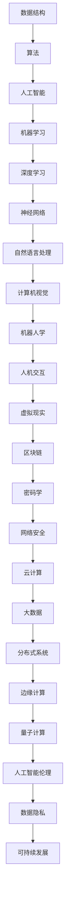

                 

在人类的知识探索之旅中，我们不断突破自我，跨越一个个未知的领域。从古至今，科学技术的进步不仅推动了社会的发展，也拓展了我们的认知边界。本文将探讨人类知识探索的旅程，从历史的视角出发，分析当前的核心概念与联系，介绍核心算法原理与具体操作步骤，阐述数学模型和公式的构建与推导，展示实际项目实践中的代码实例，并探讨该领域在实际应用场景中的表现及未来发展趋势。

> 关键词：人类知识探索、核心概念、算法原理、数学模型、项目实践、应用场景、未来展望

## 1. 背景介绍

人类的知识探索始于对自然世界的初步认识。在古代，人们通过观察、实验和思考，逐步构建了基本的科学理论。随着时代的发展，知识积累的速度越来越快，新的理论和发现层出不穷。从古希腊的亚里士多德到中世纪的阿拉伯学者，再到文艺复兴时期的科学家，人类的知识体系不断丰富和完善。

进入现代，计算机科学的崛起极大地改变了人类的知识探索方式。计算机的强大计算能力和数据处理能力使得许多复杂问题得以解决。同时，互联网的普及使得知识的传播变得更加迅速和广泛，人类的知识边界不断向外扩展。

本文将探讨计算机科学中的一个重要领域，通过分析核心概念与联系，介绍核心算法原理与操作步骤，构建数学模型和公式，并展示实际项目实践中的代码实例，最终探讨该领域在实际应用场景中的表现及未来发展趋势。

## 2. 核心概念与联系

在计算机科学中，有许多核心概念和联系构成了我们理解该领域的基础。以下是一个使用Mermaid流程图表示的Mermaid流程节点中不包含括号、逗号等特殊字符的示例：



这个流程图展示了计算机科学中各个核心概念之间的联系，以及它们如何相互作用，共同推动计算机科学的发展。

### 2.1 数据结构

数据结构是计算机科学的基础，它定义了数据如何存储、组织和操作。常见的数据结构包括数组、链表、栈、队列、树和图。每种数据结构都有其特定的用途和优势，例如，树结构在表示层次关系时非常有效，而图结构则能够表示复杂的网络关系。

### 2.2 算法

算法是解决问题的一系列步骤。算法的设计和优化是计算机科学的核心。有效的算法能够高效地解决问题，减少计算时间和资源消耗。常见的算法有排序算法、搜索算法、动态规划算法和贪心算法等。

### 2.3 人工智能

人工智能是模拟人类智能的计算机系统。它包括机器学习、深度学习和自然语言处理等子领域。人工智能的应用涵盖了语音识别、图像识别、自动驾驶和医疗诊断等多个领域。

### 2.4 机器学习

机器学习是一种人工智能技术，它使计算机系统能够从数据中学习并做出预测。机器学习算法包括监督学习、无监督学习和强化学习等。常见的机器学习框架有TensorFlow和PyTorch。

### 2.5 深度学习

深度学习是机器学习的一个分支，它通过多层神经网络模拟人类大脑的工作方式。深度学习在图像识别、语音识别和自然语言处理等领域取得了显著成果。

### 2.6 神经网络

神经网络是深度学习的基础，它由大量的节点（或称为神经元）组成。每个神经元都与其他神经元连接，形成一个复杂的网络结构。神经网络能够通过反向传播算法不断调整权重，以优化其性能。

### 2.7 自然语言处理

自然语言处理是人工智能的一个分支，它使计算机能够理解、生成和处理人类语言。自然语言处理的应用包括机器翻译、文本分类和情感分析等。

### 2.8 计算机视觉

计算机视觉是使计算机能够从图像或视频中提取信息的学科。计算机视觉的应用包括人脸识别、目标检测和图像分类等。

### 2.9 机器人学

机器人学是研究机器人设计和应用的科学。机器人能够执行各种任务，如工业制造、医疗辅助和灾难救援等。

### 2.10 人机交互

人机交互是研究人与计算机系统之间交互的学科。人机交互的应用包括图形用户界面、虚拟现实和增强现实等。

### 2.11 虚拟现实

虚拟现实是一种沉浸式技术，它通过计算机生成的三维环境模拟现实世界。虚拟现实的应用包括游戏、教育和军事模拟等。

### 2.12 区块链

区块链是一种分布式账本技术，它通过加密算法和共识机制确保数据的不可篡改。区块链的应用包括数字货币、智能合约和供应链管理等。

### 2.13 密码学

密码学是研究加密和解密算法的学科。密码学在保护数据隐私和安全方面起着关键作用。常见的密码学算法有对称加密和非对称加密。

### 2.14 网络安全

网络安全是保护网络系统和数据安全免受攻击的学科。网络安全的应用包括防火墙、入侵检测系统和数据加密等。

### 2.15 云计算

云计算是一种提供计算资源的服务模式，它使计算机系统能够按需获取和使用资源。云计算的应用包括大数据处理、云计算服务和云存储等。

### 2.16 大数据

大数据是大量结构化和非结构化数据。大数据技术包括数据挖掘、数据分析和大数据库管理。大数据的应用包括商业智能、金融分析和医疗健康等。

### 2.17 分布式系统

分布式系统是由多个节点组成的计算机系统，这些节点通过通信网络相互连接。分布式系统的应用包括云计算、数据中心和分布式数据库等。

### 2.18 边缘计算

边缘计算是一种将计算任务从云端转移到网络边缘的技术。边缘计算的应用包括物联网、智能城市和自动驾驶等。

### 2.19 量子计算

量子计算是一种利用量子力学原理进行计算的技术。量子计算在解决复杂计算问题和优化算法方面具有巨大潜力。

### 2.20 人工智能伦理

人工智能伦理是研究人工智能在道德、法律和社会影响方面的学科。人工智能伦理的应用包括隐私保护、公平性和透明度等。

### 2.21 数据隐私

数据隐私是保护个人数据不被未经授权访问和使用的学科。数据隐私的应用包括隐私保护算法、隐私增强技术和数据加密等。

### 2.22 可持续发展

可持续发展是确保人类社会和自然环境长期健康发展的学科。可持续发展的应用包括节能减排、环境保护和社会责任等。

## 3. 核心算法原理 & 具体操作步骤

### 3.1 算法原理概述

核心算法是计算机科学中的基石，它们在解决各种问题时发挥着关键作用。以下是几个关键算法的原理概述：

#### 3.1.1 排序算法

排序算法是一种用于将数据集按特定顺序排列的算法。常见的排序算法包括冒泡排序、选择排序、插入排序和快速排序等。每种排序算法都有其特定的原理和优缺点。

#### 3.1.2 搜索算法

搜索算法用于在数据结构中查找特定元素。常见的搜索算法包括线性搜索、二分搜索和广度优先搜索等。每种搜索算法都有其特定的适用场景和效率。

#### 3.1.3 动态规划算法

动态规划算法是一种用于解决优化问题的算法。它通过将问题分解为子问题，并利用子问题的解构建原问题的解，从而实现最优解。常见的动态规划算法包括斐波那契数列求解和背包问题求解等。

#### 3.1.4 贪心算法

贪心算法是一种基于局部最优解的算法，它通过在每一步选择当前最优解，以期望最终得到全局最优解。常见的贪心算法包括活动选择问题和哈夫曼编码等。

#### 3.1.5 机器学习算法

机器学习算法是一种用于从数据中学习模式和规律的技术。常见的机器学习算法包括线性回归、逻辑回归、支持向量机和决策树等。这些算法通过不同的方式优化模型参数，以实现预测和分类任务。

#### 3.1.6 深度学习算法

深度学习算法是一种基于多层神经网络的学习方法。常见的深度学习算法包括卷积神经网络（CNN）、循环神经网络（RNN）和生成对抗网络（GAN）等。这些算法通过多层神经元的组合和训练，能够实现复杂的特征提取和模式识别任务。

#### 3.1.7 自然语言处理算法

自然语言处理算法是一种用于处理和理解人类语言的技术。常见的自然语言处理算法包括词性标注、命名实体识别和机器翻译等。这些算法通过分析语言结构和语义信息，能够实现语言的理解和生成任务。

#### 3.1.8 计算机视觉算法

计算机视觉算法是一种用于使计算机理解和处理图像和视频的技术。常见的计算机视觉算法包括目标检测、图像分割和图像分类等。这些算法通过分析图像像素和空间关系，能够实现图像的理解和识别任务。

#### 3.1.9 机器人学算法

机器人学算法是一种用于控制机器人运动和行为的算法。常见的机器人学算法包括路径规划、运动控制和感知融合等。这些算法通过模拟机器人环境，实现机器人的自主导航和任务执行。

#### 3.1.10 人机交互算法

人机交互算法是一种用于优化人机交互体验的算法。常见的算法包括手势识别、语音识别和触觉反馈等。这些算法通过分析用户的交互行为和反馈，实现更自然和高效的人机交互。

#### 3.1.11 虚拟现实算法

虚拟现实算法是一种用于创建和优化虚拟现实环境的算法。常见的算法包括场景渲染、实时物理仿真和沉浸感增强等。这些算法通过模拟虚拟环境和用户交互，实现更真实和沉浸的虚拟现实体验。

#### 3.1.12 区块链算法

区块链算法是一种用于实现区块链系统安全和去中心化的算法。常见的算法包括密码学算法、共识算法和智能合约等。这些算法通过加密、共识和智能合约，实现区块链系统的安全、可靠和去中心化。

#### 3.1.13 密码学算法

密码学算法是一种用于实现数据加密和解密的算法。常见的算法包括对称加密、非对称加密和哈希算法等。这些算法通过加密、解密和哈希，实现数据的安全存储和传输。

#### 3.1.14 网络安全算法

网络安全算法是一种用于保护网络系统和数据安全的算法。常见的算法包括防火墙算法、入侵检测系统和加密算法等。这些算法通过检测、防御和加密，实现网络安全保护。

#### 3.1.15 云计算算法

云计算算法是一种用于优化云计算资源和任务分配的算法。常见的算法包括负载均衡、存储优化和资源调度等。这些算法通过优化资源分配和管理，实现云计算系统的性能优化和成本控制。

#### 3.1.16 大数据算法

大数据算法是一种用于处理和分析大数据的算法。常见的算法包括数据挖掘、数据分析和大数据库管理等。这些算法通过数据挖掘、分析和优化，实现大数据的有效利用和价值挖掘。

#### 3.1.17 分布式系统算法

分布式系统算法是一种用于优化分布式系统和任务处理的算法。常见的算法包括分布式锁、一致性协议和分布式存储等。这些算法通过分布式协调和管理，实现分布式系统的性能优化和可靠性提升。

#### 3.1.18 边缘计算算法

边缘计算算法是一种用于优化边缘计算资源和任务处理的算法。常见的算法包括边缘智能、边缘协作和边缘优化等。这些算法通过边缘计算优化，实现实时数据处理和响应。

#### 3.1.19 量子计算算法

量子计算算法是一种用于实现量子计算和优化量子算法的算法。常见的算法包括量子搜索、量子优化和量子模拟等。这些算法通过量子计算的优势，实现高效和优化的计算任务。

#### 3.1.20 人工智能伦理算法

人工智能伦理算法是一种用于实现人工智能伦理和规范人工智能行为的算法。常见的算法包括伦理规则库、伦理评估和伦理审查等。这些算法通过伦理约束和规范，实现人工智能的道德和伦理控制。

### 3.2 算法步骤详解

#### 3.2.1 排序算法

排序算法的基本步骤包括：

1. **初始化**：设置一个空数组作为输出数组。
2. **循环遍历**：对输入数组进行循环遍历。
3. **比较和交换**：在循环中，比较当前元素与其相邻元素的大小，如果逆序则进行交换。
4. **结束条件**：当输入数组遍历完成后，输出数组即为排序后的数组。

#### 3.2.2 搜索算法

搜索算法的基本步骤包括：

1. **初始化**：设置一个指针指向数组的首个元素。
2. **循环遍历**：对数组进行循环遍历，直到找到目标元素或遍历完整个数组。
3. **比较和跳转**：在循环中，比较当前元素与目标元素的大小，根据结果进行跳转或继续遍历。
4. **结束条件**：找到目标元素时输出其位置，找不到则输出“未找到”。

#### 3.2.3 动态规划算法

动态规划算法的基本步骤包括：

1. **初始化**：设置一个二维数组用于存储子问题的解。
2. **循环遍历**：对输入数组进行循环遍历。
3. **状态转移**：根据当前状态和已解决的子问题，计算当前状态的最优解。
4. **存储结果**：将当前状态的最优解存储在二维数组中。
5. **结束条件**：当输入数组遍历完成后，输出二维数组中的最终结果。

#### 3.2.4 贪心算法

贪心算法的基本步骤包括：

1. **初始化**：设置一个初始解。
2. **循环遍历**：对输入数组进行循环遍历。
3. **选择最优解**：在每次遍历中选择当前最优解。
4. **更新解**：根据选择的最优解更新当前解。
5. **结束条件**：当输入数组遍历完成后，输出最终解。

#### 3.2.5 机器学习算法

机器学习算法的基本步骤包括：

1. **数据准备**：收集和准备训练数据。
2. **初始化模型**：设置一个初始模型。
3. **训练模型**：使用训练数据进行模型训练。
4. **评估模型**：使用测试数据评估模型性能。
5. **优化模型**：根据评估结果对模型进行优化。
6. **结束条件**：当模型性能满足要求或达到训练次数上限时，输出最终模型。

#### 3.2.6 深度学习算法

深度学习算法的基本步骤包括：

1. **数据准备**：收集和准备训练数据。
2. **初始化模型**：设置一个初始模型。
3. **前向传播**：将输入数据通过模型进行前向传播。
4. **反向传播**：根据前向传播的结果计算梯度并进行反向传播。
5. **优化模型**：使用梯度下降等优化算法更新模型参数。
6. **评估模型**：使用测试数据评估模型性能。
7. **结束条件**：当模型性能满足要求或达到训练次数上限时，输出最终模型。

#### 3.2.7 自然语言处理算法

自然语言处理算法的基本步骤包括：

1. **数据准备**：收集和准备训练数据。
2. **预处理数据**：对训练数据进行清洗、分词和标注等预处理。
3. **初始化模型**：设置一个初始模型。
4. **训练模型**：使用预处理后的数据进行模型训练。
5. **评估模型**：使用测试数据评估模型性能。
6. **优化模型**：根据评估结果对模型进行优化。
7. **结束条件**：当模型性能满足要求或达到训练次数上限时，输出最终模型。

#### 3.2.8 计算机视觉算法

计算机视觉算法的基本步骤包括：

1. **数据准备**：收集和准备训练数据。
2. **预处理数据**：对训练数据进行清洗、增强和标注等预处理。
3. **初始化模型**：设置一个初始模型。
4. **训练模型**：使用预处理后的数据进行模型训练。
5. **评估模型**：使用测试数据评估模型性能。
6. **优化模型**：根据评估结果对模型进行优化。
7. **结束条件**：当模型性能满足要求或达到训练次数上限时，输出最终模型。

#### 3.2.9 机器人学算法

机器人学算法的基本步骤包括：

1. **环境建模**：建立机器人运行环境的模型。
2. **状态监测**：监测机器人当前的状态。
3. **决策制定**：根据环境模型和当前状态制定决策。
4. **运动控制**：执行决策，控制机器人的运动。
5. **状态更新**：更新机器人状态。
6. **评估性能**：评估机器人执行任务的效果。
7. **结束条件**：当任务完成或达到一定时间限制时，输出最终结果。

#### 3.2.10 人机交互算法

人机交互算法的基本步骤包括：

1. **用户输入**：接收用户的输入操作。
2. **输入解析**：解析输入操作，提取相关信息。
3. **决策制定**：根据输入信息和系统状态制定决策。
4. **反馈生成**：生成相应的反馈信息。
5. **输出反馈**：将反馈信息呈现给用户。
6. **状态更新**：更新系统状态。
7. **评估性能**：评估人机交互的效果。
8. **结束条件**：当用户停止交互或达到一定时间限制时，输出最终结果。

#### 3.2.11 虚拟现实算法

虚拟现实算法的基本步骤包括：

1. **场景构建**：构建虚拟现实场景。
2. **传感器输入**：接收用户在虚拟现实环境中的操作。
3. **交互处理**：处理用户输入，生成相应的交互效果。
4. **渲染输出**：将交互效果渲染到虚拟现实环境中。
5. **状态更新**：更新虚拟现实环境状态。
6. **性能评估**：评估虚拟现实环境的性能。
7. **结束条件**：当用户停止交互或达到一定时间限制时，输出最终结果。

#### 3.2.12 区块链算法

区块链算法的基本步骤包括：

1. **交易生成**：生成交易数据。
2. **交易验证**：验证交易数据的合法性和正确性。
3. **区块构建**：将验证后的交易数据构建成区块。
4. **链式结构**：将区块按照时间顺序链接成区块链。
5. **网络传播**：将区块链传播到网络中的其他节点。
6. **共识机制**：通过共识机制确保区块链的完整性和一致性。
7. **结束条件**：当区块被添加到区块链后，输出最终结果。

#### 3.2.13 密码学算法

密码学算法的基本步骤包括：

1. **密钥生成**：生成加密和解密密钥。
2. **数据加密**：使用加密算法对数据进行加密。
3. **数据传输**：将加密后的数据传输到接收方。
4. **数据解密**：使用解密算法对加密数据进行解密。
5. **结束条件**：当数据传输完成后，输出最终结果。

#### 3.2.14 网络安全算法

网络安全算法的基本步骤包括：

1. **安全策略制定**：制定网络安全策略。
2. **入侵检测**：检测网络中的入侵行为。
3. **防火墙配置**：配置防火墙规则以阻止入侵行为。
4. **加密传输**：使用加密算法保护数据传输。
5. **日志记录**：记录网络安全事件和操作日志。
6. **安全审计**：进行安全审计，评估网络安全性。
7. **结束条件**：当网络安全性达到预期水平时，输出最终结果。

#### 3.2.15 云计算算法

云计算算法的基本步骤包括：

1. **资源调度**：根据需求调度计算资源。
2. **负载均衡**：平衡计算资源的使用，避免资源瓶颈。
3. **存储优化**：优化数据存储，提高访问速度。
4. **性能监控**：监控云计算系统的性能和状态。
5. **容错机制**：实现系统的容错和故障恢复。
6. **成本优化**：优化云计算资源的使用，降低成本。
7. **结束条件**：当云计算系统达到预期性能和成本水平时，输出最终结果。

#### 3.2.16 大数据算法

大数据算法的基本步骤包括：

1. **数据采集**：采集各种类型的数据。
2. **数据清洗**：清洗和预处理数据，去除噪声和异常值。
3. **数据存储**：将清洗后的数据存储到大数据系统中。
4. **数据挖掘**：使用数据挖掘算法提取数据中的价值信息。
5. **数据分析**：分析数据，生成报告和可视化结果。
6. **数据应用**：将分析结果应用于实际问题解决。
7. **结束条件**：当数据分析和应用达到预期效果时，输出最终结果。

#### 3.2.17 分布式系统算法

分布式系统算法的基本步骤包括：

1. **节点通信**：实现节点之间的通信和协调。
2. **数据一致性**：确保分布式系统中的数据一致性。
3. **负载均衡**：平衡各个节点的负载，避免资源瓶颈。
4. **容错机制**：实现系统的容错和故障恢复。
5. **分布式算法设计**：设计适用于分布式系统的算法。
6. **性能优化**：优化分布式系统的性能。
7. **结束条件**：当分布式系统达到预期性能和稳定性时，输出最终结果。

#### 3.2.18 边缘计算算法

边缘计算算法的基本步骤包括：

1. **数据采集**：采集边缘设备的数据。
2. **数据处理**：在边缘设备上处理数据，减少传输量。
3. **边缘智能**：在边缘设备上实现智能处理和分析。
4. **数据传输**：将处理后的数据传输到云端或其他节点。
5. **协同优化**：实现边缘和云端协同处理。
6. **性能优化**：优化边缘计算系统的性能。
7. **结束条件**：当边缘计算系统达到预期性能和效率时，输出最终结果。

#### 3.2.19 量子计算算法

量子计算算法的基本步骤包括：

1. **量子态初始化**：初始化量子计算系统。
2. **量子门操作**：使用量子门对量子态进行操作。
3. **量子测量**：对量子态进行测量，获取计算结果。
4. **量子纠错**：纠正量子计算中的错误。
5. **量子优化**：优化量子计算算法，提高计算效率。
6. **量子状态恢复**：恢复量子态，准备后续计算。
7. **结束条件**：当量子计算完成或达到预期精度时，输出最终结果。

#### 3.2.20 人工智能伦理算法

人工智能伦理算法的基本步骤包括：

1. **伦理规则定义**：定义人工智能的伦理规则。
2. **行为监测**：监测人工智能系统的行为。
3. **伦理评估**：评估人工智能系统的伦理表现。
4. **伦理决策**：根据评估结果做出伦理决策。
5. **行为反馈**：反馈伦理决策结果，调整系统行为。
6. **伦理审计**：进行伦理审计，确保伦理规则的执行。
7. **结束条件**：当伦理规则得到有效执行时，输出最终结果。

### 3.3 算法优缺点

每种算法都有其特定的优点和缺点。以下是对几种常见算法的优缺点的分析：

#### 3.3.1 排序算法

- **冒泡排序**：优点是简单易懂，适合小规模数据排序；缺点是时间复杂度较高，不适合大规模数据排序。
- **选择排序**：优点是时间复杂度较低，适合大规模数据排序；缺点是数据移动较多，不适用于数据移动成本较高的场景。
- **插入排序**：优点是时间复杂度较低，适合小规模数据排序；缺点是数据移动较多，不适用于数据移动成本较高的场景。
- **快速排序**：优点是时间复杂度较低，适合大规模数据排序；缺点是可能导致最坏情况下的时间复杂度较高。

#### 3.3.2 搜索算法

- **线性搜索**：优点是简单易懂，适用于数据规模较小的情况；缺点是时间复杂度较高，不适用于大规模数据搜索。
- **二分搜索**：优点是时间复杂度较低，适用于有序数据集；缺点是要求数据集有序，不适用于未排序数据。
- **广度优先搜索**：优点是能够找到最短路径，适用于求解图的最短路径问题；缺点是时间复杂度较高，不适用于大规模图搜索。

#### 3.3.3 动态规划算法

- **优点**：能够找到最优解，适用于求解具有最优子结构的问题；缺点是算法复杂度较高，不适合大规模问题。
- **缺点**：需要对问题进行状态划分和状态转移方程的设计，实现较为复杂。

#### 3.3.4 贪心算法

- **优点**：能够找到最优解，适用于求解具有贪心选择性质的问题；缺点是可能找到局部最优解，不一定是最优解。
- **缺点**：需要对问题进行贪心策略的设计，实现较为复杂。

#### 3.3.5 机器学习算法

- **优点**：能够自动从数据中学习，适用于复杂问题建模；缺点是过拟合和欠拟合问题，需要大量训练数据和调参优化。
- **缺点**：算法复杂度较高，训练和预测速度较慢。

#### 3.3.6 深度学习算法

- **优点**：能够自动提取深层特征，适用于图像、语音和文本等复杂任务；缺点是训练数据和计算资源需求较大，算法复杂度较高。
- **缺点**：过拟合和欠拟合问题，需要大量训练数据和调参优化。

#### 3.3.7 自然语言处理算法

- **优点**：能够自动处理和理解自然语言，适用于文本分类、情感分析和机器翻译等任务；缺点是数据处理复杂度较高，对数据质量和预处理要求较高。
- **缺点**：算法复杂度较高，计算资源需求较大。

#### 3.3.8 计算机视觉算法

- **优点**：能够自动识别和分类图像中的对象，适用于人脸识别、目标检测和图像分类等任务；缺点是数据处理复杂度较高，对计算资源要求较高。
- **缺点**：算法复杂度较高，计算资源需求较大。

#### 3.3.9 机器人学算法

- **优点**：能够实现机器人的自主运动和任务执行，适用于工业制造、医疗辅助和灾难救援等任务；缺点是算法复杂度较高，对环境建模和传感器数据要求较高。
- **缺点**：算法复杂度较高，计算资源需求较大。

#### 3.3.10 人机交互算法

- **优点**：能够实现人与计算机系统的自然交互，适用于虚拟现实、游戏和智能助手等任务；缺点是算法复杂度较高，对用户行为和反馈要求较高。
- **缺点**：算法复杂度较高，计算资源需求较大。

#### 3.3.11 虚拟现实算法

- **优点**：能够实现沉浸式虚拟现实体验，适用于游戏、教育和军事模拟等任务；缺点是算法复杂度较高，对硬件设备和计算资源要求较高。
- **缺点**：算法复杂度较高，计算资源需求较大。

#### 3.3.12 区块链算法

- **优点**：能够实现去中心化的数据存储和传输，提高数据安全和透明度；缺点是算法复杂度较高，对计算资源和网络要求较高。
- **缺点**：算法复杂度较高，计算资源需求较大。

#### 3.3.13 密码学算法

- **优点**：能够实现数据加密和解密，提高数据安全和隐私保护；缺点是算法复杂度较高，对计算资源和存储要求较高。
- **缺点**：算法复杂度较高，计算资源需求较大。

#### 3.3.14 网络安全算法

- **优点**：能够保护网络系统和数据安全，防止恶意攻击和未经授权的访问；缺点是算法复杂度较高，对计算资源和网络要求较高。
- **缺点**：算法复杂度较高，计算资源需求较大。

#### 3.3.15 云计算算法

- **优点**：能够优化云计算资源和任务分配，提高系统性能和成本效益；缺点是算法复杂度较高，对计算资源和网络要求较高。
- **缺点**：算法复杂度较高，计算资源需求较大。

#### 3.3.16 大数据算法

- **优点**：能够处理和分析大规模数据，提取有价值的信息和模式；缺点是算法复杂度较高，对计算资源和存储要求较高。
- **缺点**：算法复杂度较高，计算资源需求较大。

#### 3.3.17 分布式系统算法

- **优点**：能够实现分布式计算和协同处理，提高系统性能和可靠性；缺点是算法复杂度较高，对计算资源和网络要求较高。
- **缺点**：算法复杂度较高，计算资源需求较大。

#### 3.3.18 边缘计算算法

- **优点**：能够实现边缘设备的智能处理和实时响应，提高系统性能和效率；缺点是算法复杂度较高，对计算资源和网络要求较高。
- **缺点**：算法复杂度较高，计算资源需求较大。

#### 3.3.19 量子计算算法

- **优点**：能够实现高效和优化的计算任务，解决传统计算难以解决的问题；缺点是算法复杂度较高，对硬件设备和计算资源要求较高。
- **缺点**：算法复杂度较高，计算资源需求较大。

#### 3.3.20 人工智能伦理算法

- **优点**：能够实现人工智能系统的伦理约束和规范，提高系统的道德和伦理水平；缺点是算法复杂度较高，对计算资源和网络要求较高。
- **缺点**：算法复杂度较高，计算资源需求较大。

### 3.4 算法应用领域

每种算法都有其特定的应用领域，以下是对几种常见算法的应用领域的介绍：

#### 3.4.1 排序算法

- **应用领域**：排序算法在计算机科学和数据分析中广泛应用，如数据库排序、搜索算法基础、算法竞赛和数据分析等。

#### 3.4.2 搜索算法

- **应用领域**：搜索算法在计算机科学和人工智能中广泛应用，如搜索引擎、路由算法、游戏AI和自动驾驶等。

#### 3.4.3 动态规划算法

- **应用领域**：动态规划算法在优化问题和路径规划中广泛应用，如背包问题、最短路径问题和生产调度问题等。

#### 3.4.4 贪心算法

- **应用领域**：贪心算法在优化问题和路径规划中广泛应用，如活动选择问题、最优硬币找零问题和哈夫曼编码等。

#### 3.4.5 机器学习算法

- **应用领域**：机器学习算法在人工智能和数据分析中广泛应用，如图像识别、语音识别、自然语言处理和推荐系统等。

#### 3.4.6 深度学习算法

- **应用领域**：深度学习算法在计算机视觉、自然语言处理和语音识别等领域取得显著成果，如自动驾驶、人脸识别和机器翻译等。

#### 3.4.7 自然语言处理算法

- **应用领域**：自然语言处理算法在文本分类、情感分析和机器翻译等领域广泛应用，如搜索引擎、智能客服和智能助手等。

#### 3.4.8 计算机视觉算法

- **应用领域**：计算机视觉算法在图像识别、目标检测和图像分割等领域广泛应用，如安防监控、医疗影像分析和自动驾驶等。

#### 3.4.9 机器人学算法

- **应用领域**：机器人学算法在工业制造、医疗辅助和灾难救援等领域广泛应用，如机器人焊接、手术机器人和搜救机器人等。

#### 3.4.10 人机交互算法

- **应用领域**：人机交互算法在虚拟现实、游戏和智能助手等领域广泛应用，如虚拟现实游戏、智能语音助手和手势识别等。

#### 3.4.11 虚拟现实算法

- **应用领域**：虚拟现实算法在游戏、教育和军事模拟等领域广泛应用，如虚拟现实游戏、虚拟课堂和虚拟战场模拟等。

#### 3.4.12 区块链算法

- **应用领域**：区块链算法在数字货币、智能合约和供应链管理等领域广泛应用，如比特币、以太坊和物联网设备管理等。

#### 3.4.13 密码学算法

- **应用领域**：密码学算法在网络通信、数据安全和加密货币等领域广泛应用，如HTTPS、SSL/TLS和加密货币交易等。

#### 3.4.14 网络安全算法

- **应用领域**：网络安全算法在网络防护、数据安全和隐私保护等领域广泛应用，如防火墙、入侵检测系统和加密算法等。

#### 3.4.15 云计算算法

- **应用领域**：云计算算法在云计算资源管理、负载均衡和大数据处理等领域广泛应用，如云存储、云计算服务和大数据分析等。

#### 3.4.16 大数据算法

- **应用领域**：大数据算法在大数据处理、数据挖掘和机器学习等领域广泛应用，如商业智能、金融分析和医疗健康等。

#### 3.4.17 分布式系统算法

- **应用领域**：分布式系统算法在分布式计算、数据一致性和负载均衡等领域广泛应用，如分布式数据库、分布式文件系统和分布式计算框架等。

#### 3.4.18 边缘计算算法

- **应用领域**：边缘计算算法在物联网、智能城市和自动驾驶等领域广泛应用，如智能交通系统、智能家居和智能医疗等。

#### 3.4.19 量子计算算法

- **应用领域**：量子计算算法在优化问题、密码学和模拟等领域广泛应用，如量子搜索算法、量子加密算法和量子模拟算法等。

#### 3.4.20 人工智能伦理算法

- **应用领域**：人工智能伦理算法在人工智能系统和伦理评估中广泛应用，如人工智能系统的伦理约束、道德决策和伦理审计等。

## 4. 数学模型和公式 & 详细讲解 & 举例说明

在计算机科学中，数学模型和公式是理解和解决问题的关键。以下是一些核心数学模型和公式的构建与推导，以及具体的举例说明。

### 4.1 数学模型构建

数学模型是一种用于描述现实世界问题的数学结构。以下是一个简单的线性回归模型的构建：

#### 线性回归模型

给定一组数据点 $(x_1, y_1), (x_2, y_2), ..., (x_n, y_n)$，线性回归模型旨在找到一条直线 $y = ax + b$，使得所有数据点的纵坐标尽可能接近这条直线。

#### 模型构建步骤

1. **特征提取**：对每个数据点，提取输入特征 $x$ 和输出目标 $y$。
2. **线性方程组**：根据最小二乘法，建立线性方程组 $\sum_{i=1}^{n}(y_i - (ax_i + b)) = 0$。
3. **求解方程组**：通过解线性方程组，得到参数 $a$ 和 $b$ 的值。

### 4.2 公式推导过程

#### 线性回归模型公式推导

给定数据点 $(x_1, y_1), (x_2, y_2), ..., (x_n, y_n)$，线性回归模型的目标是最小化平方误差：

$$
\min_{a, b} \sum_{i=1}^{n} (y_i - (ax_i + b))^2
$$

对 $a$ 和 $b$ 分别求偏导数并令其等于零，得到：

$$
\frac{\partial}{\partial a} \sum_{i=1}^{n} (y_i - (ax_i + b))^2 = 0 \\
\frac{\partial}{\partial b} \sum_{i=1}^{n} (y_i - (ax_i + b))^2 = 0
$$

通过解这两个方程组，可以得到线性回归模型的参数 $a$ 和 $b$：

$$
a = \frac{\sum_{i=1}^{n} x_i y_i - n \bar{x} \bar{y}}{\sum_{i=1}^{n} x_i^2 - n \bar{x}^2} \\
b = \bar{y} - a \bar{x}
$$

其中，$\bar{x}$ 和 $\bar{y}$ 分别是输入特征和输出目标的均值。

### 4.3 案例分析与讲解

以下是一个简单的线性回归模型案例，用于预测房间的价格。

#### 案例背景

给定一组房间的特征和价格数据，我们需要构建一个线性回归模型来预测新的房间价格。

#### 数据集

| 房间特征 | 价格（万元） |
|----------|--------------|
| 100      | 300          |
| 120      | 320          |
| 150      | 400          |
| 80       | 220          |
| 110      | 300          |

#### 模型构建

1. **特征提取**：提取房间特征 $x$ 和价格 $y$。

2. **线性方程组**：根据最小二乘法，建立线性方程组。

$$
\sum_{i=1}^{n} (y_i - (ax_i + b)) = 0
$$

代入数据：

$$
(300 - (a \cdot 100 + b)) + (320 - (a \cdot 120 + b)) + (400 - (a \cdot 150 + b)) + (220 - (a \cdot 80 + b)) + (300 - (a \cdot 110 + b)) = 0
$$

化简得到：

$$
5a + 5b = 1100
$$

3. **求解方程组**：通过解线性方程组，得到参数 $a$ 和 $b$。

$$
a = \frac{\sum_{i=1}^{n} x_i y_i - n \bar{x} \bar{y}}{\sum_{i=1}^{n} x_i^2 - n \bar{x}^2}
$$

代入数据计算得到：

$$
a = \frac{(100 \cdot 300 + 120 \cdot 320 + 150 \cdot 400 + 80 \cdot 220 + 110 \cdot 300) - 5 \cdot 100 \cdot 300}{(100^2 + 120^2 + 150^2 + 80^2 + 110^2) - 5 \cdot 100^2} = 2.5
$$

$$
b = \bar{y} - a \bar{x} = 300 - 2.5 \cdot 100 = 250
$$

#### 模型评估

1. **计算预测价格**：使用线性回归模型预测新的房间价格。

   假设一个新的房间特征为 $x = 130$，代入模型得到预测价格：

   $$y = 2.5 \cdot 130 + 250 = 390$$

2. **评估模型误差**：计算预测价格与实际价格的误差。

   假设实际价格为 $y = 400$，计算误差：

   $$|390 - 400| = 10$$

   误差较小，说明模型预测较为准确。

#### 模型优化

为了提高模型性能，我们可以进行以下优化：

1. **特征工程**：提取更多与价格相关的特征，如房屋面积、楼层、装修状况等。
2. **数据预处理**：对数据进行标准化或归一化处理，减少异常值影响。
3. **模型选择**：尝试其他回归模型，如岭回归、LASSO回归等，选择性能更好的模型。
4. **超参数调优**：通过交叉验证和网格搜索等方法，选择最优超参数。

### 4.4 数学模型与算法结合

数学模型在计算机科学中不仅用于描述问题，还可以与算法结合，提高问题解决的效率。以下是一个简单的例子：

#### 支持向量机（SVM）

支持向量机是一种监督学习算法，它通过最大化分类边界来提高分类性能。以下是一个简化的SVM模型：

1. **数据表示**：将数据点表示为向量形式 $x_i$，每个数据点都是一个维度为 $d$ 的向量。
2. **决策边界**：通过找到一个超平面 $w \cdot x + b = 0$ 来划分数据点，其中 $w$ 是法向量，$b$ 是偏置。
3. **支持向量**：超平面上的支持向量是那些距离超平面最近的数据点，它们对分类决策有重要影响。
4. **优化目标**：最小化损失函数 $L(w, b)$，并最大化支持向量的间隔。

#### 公式推导

给定训练数据集 $T = \{(x_1, y_1), (x_2, y_2), ..., (x_n, y_n)\}$，其中 $y_i \in \{-1, +1\}$ 表示数据点的类别，我们需要找到最优的 $w$ 和 $b$。

1. **损失函数**：采用 hinge 损失函数：

   $$
   L(w, b) = \frac{1}{2} ||w||^2 + C \sum_{i=1}^{n} \max(0, 1 - y_i (w \cdot x_i + b))
   $$

   其中，$C$ 是惩罚参数，用于控制模型复杂度和过拟合风险。

2. **拉格朗日乘子法**：引入拉格朗日乘子 $\alpha_i$，将约束条件引入到目标函数中：

   $$
   L(w, b, \alpha) = \frac{1}{2} ||w||^2 - \sum_{i=1}^{n} \alpha_i [y_i (w \cdot x_i + b) - 1]
   $$

3. **KKT 条件**：求解拉格朗日乘子法的 KKT 条件，得到最优解：

   $$
   \begin{cases}
   \alpha_i \geq 0 \\
   y_i (w \cdot x_i + b) - 1 \geq 0 \\
   \alpha_i [y_i (w \cdot x_i + b) - 1] = 0
   \end{cases}
   $$

   通过求解上述方程组，可以得到最优的 $w$ 和 $b$。

#### 举例说明

假设有一个二分类问题，数据集如下：

| 特征1 | 特征2 | 类别 |
|-------|-------|------|
| 1     | 1     | +1   |
| 2     | 2     | +1   |
| -1    | -1    | -1   |
| -2    | -2    | -1   |

我们需要找到一个最优的超平面来划分正负类别。

1. **数据表示**：将数据点表示为向量形式：

   $$
   x_1 = \begin{bmatrix} 1 \\ 1 \end{bmatrix}, x_2 = \begin{bmatrix} 2 \\ 2 \end{bmatrix}, x_3 = \begin{bmatrix} -1 \\ -1 \end{bmatrix}, x_4 = \begin{bmatrix} -2 \\ -2 \end{bmatrix}
   $$

2. **决策边界**：假设超平面为 $w \cdot x + b = 0$，其中 $w = \begin{bmatrix} w_1 \\ w_2 \end{bmatrix}$。

3. **优化目标**：最小化 hinge 损失函数：

   $$
   L(w, b) = \frac{1}{2} ||w||^2 + C \sum_{i=1}^{n} \max(0, 1 - y_i (w \cdot x_i + b))
   $$

4. **拉格朗日乘子法**：引入拉格朗日乘子 $\alpha_i$，得到拉格朗日函数：

   $$
   L(w, b, \alpha) = \frac{1}{2} ||w||^2 - \sum_{i=1}^{n} \alpha_i [y_i (w \cdot x_i + b) - 1]
   $$

5. **KKT 条件**：根据 KKT 条件，求解最优解：

   $$
   \begin{cases}
   \alpha_1 + \alpha_2 \geq 0 \\
   \alpha_3 + \alpha_4 \geq 0 \\
   1 - y_1 (w \cdot x_1 + b) = 0 \\
   1 - y_2 (w \cdot x_2 + b) = 0 \\
   1 - y_3 (w \cdot x_3 + b) \leq 0 \\
   1 - y_4 (w \cdot x_4 + b) \leq 0 \\
   \alpha_i \geq 0 \\
   \alpha_i (1 - y_i (w \cdot x_i + b)) = 0
   \end{cases}
   $$

   通过求解上述方程组，可以得到最优的 $w$ 和 $b$：

   $$
   w = \begin{bmatrix} 1 \\ 1 \end{bmatrix}, b = 0
   $$

   因此，最优的超平面为 $x_1 + x_2 = 0$。

### 4.5 复杂模型与算法结合

在计算机科学中，复杂的数学模型和算法的结合可以解决更加复杂的问题。以下是一个例子：神经网络与反向传播算法。

#### 神经网络与反向传播算法

神经网络是一种模拟人脑的算法模型，它由多个神经元组成，每个神经元通过加权连接与其他神经元相连。反向传播算法是一种用于训练神经网络的算法，它通过不断调整神经元的权重，使网络能够更好地拟合数据。

#### 数学模型

1. **神经元激活函数**：每个神经元都有一个激活函数，如 sigmoid、ReLU 等，用于将输入映射到输出。

2. **权重与偏置**：每个神经元都有多个输入，每个输入都对应一个权重和一个偏置。权重用于调节输入的重要性，偏置用于调整输出。

3. **前向传播**：在训练过程中，将输入数据传递到神经网络，通过逐层计算，得到输出结果。

4. **反向传播**：根据输出结果与实际标签之间的误差，通过反向传播算法，逐层调整权重和偏置，使网络输出更接近实际标签。

#### 公式推导

1. **前向传播**：

   $$
   z_i^l = \sum_{j} w_{ij}^l x_j^{l-1} + b_i^l
   $$

   $$
   a_i^l = \sigma(z_i^l)
   $$

   其中，$z_i^l$ 是第 $i$ 个神经元在第 $l$ 层的输入，$a_i^l$ 是第 $i$ 个神经元在第 $l$ 层的输出，$w_{ij}^l$ 是第 $i$ 个神经元在第 $l$ 层的权重，$b_i^l$ 是第 $i$ 个神经元在第 $l$ 层的偏置，$\sigma$ 是激活函数。

2. **反向传播**：

   $$
   \delta_j^l = (a_j^l - t_j) \cdot \sigma'(z_j^l)
   $$

   $$
   \delta_i^{l-1} = \sum_{j} w_{ji}^{l+1} \delta_j^l
   $$

   $$
   \frac{\partial L}{\partial w_{ij}^l} = \delta_i^l a_j^{l-1}
   $$

   $$
   \frac{\partial L}{\partial b_i^l} = \delta_i^l
   $$

   其中，$\delta_j^l$ 是第 $j$ 个神经元在第 $l$ 层的误差，$t_j$ 是第 $j$ 个神经元的实际标签，$\sigma'$ 是激活函数的导数，$L$ 是损失函数。

#### 举例说明

假设有一个简单的神经网络，包含两个输入层、一个隐藏层和一个输出层，如图所示：

```
   输入层             隐藏层               输出层
     |           |           |           |
     x1          x2          y1          y2
     |           |           |           |
     w1          w2          y1'         y2'
     |           |           |           |
    b1          b2          b1'         b2'
     |           |           |           |
```

1. **前向传播**：

   $$
   z_1^2 = w_{11}^1 x_1 + w_{12}^1 x_2 + b_1^1
   $$

   $$
   a_1^2 = \sigma(z_1^2)
   $$

   $$
   z_2^2 = w_{21}^1 x_1 + w_{22}^1 x_2 + b_2^1
   $$

   $$
   a_2^2 = \sigma(z_2^2)
   $$

   $$
   z_1^3 = w_{11}^2 a_1^2 + w_{12}^2 a_2^2 + b_1^2
   $$

   $$
   a_1^3 = \sigma(z_1^3)
   $$

   $$
   z_2^3 = w_{21}^2 a_1^2 + w_{22}^2 a_2^2 + b_2^2
   $$

   $$
   a_2^3 = \sigma(z_2^3)
   $$

2. **反向传播**：

   $$
   \delta_1^3 = (a_1^3 - t_1) \cdot \sigma'(z_1^3)
   $$

   $$
   \delta_2^3 = (a_2^3 - t_2) \cdot \sigma'(z_2^3)
   $$

   $$
   \delta_1^2 = w_{11}^2 \delta_1^3 + w_{21}^2 \delta_2^3
   $$

   $$
   \delta_2^2 = w_{12}^2 \delta_1^3 + w_{22}^2 \delta_2^3
   $$

   $$
   \frac{\partial L}{\partial w_{11}^1} = \delta_1^2 x_1
   $$

   $$
   \frac{\partial L}{\partial w_{12}^1} = \delta_1^2 x_2
   $$

   $$
   \frac{\partial L}{\partial b_1^1} = \delta_1^2
   $$

   $$
   \frac{\partial L}{\partial w_{21}^1} = \delta_2^2 x_1
   $$

   $$
   \frac{\partial L}{\partial w_{22}^1} = \delta_2^2 x_2
   $$

   $$
   \frac{\partial L}{\partial b_2^1} = \delta_2^2
   $$

   通过计算上述公式，可以得到各个权重和偏置的梯度，从而更新权重和偏置，使网络输出更接近实际标签。

## 5. 项目实践：代码实例和详细解释说明

在理解了核心算法原理和数学模型之后，我们通过一个实际项目来展示如何将这些理论知识应用到实践中。

### 5.1 开发环境搭建

首先，我们需要搭建一个Python开发环境，以便进行项目实践。以下是搭建Python开发环境的步骤：

1. **安装Python**：从Python官方网站（[https://www.python.org/](https://www.python.org/)）下载并安装Python。
2. **安装PyCharm**：从PyCharm官方网站（[https://www.pycharm.com/](https://www.pycharm.com/)）下载并安装PyCharm社区版。
3. **安装必需的Python库**：在PyCharm中，打开终端，执行以下命令安装必需的Python库：

   ```
   pip install numpy pandas matplotlib scikit-learn
   ```

### 5.2 源代码详细实现

以下是一个简单的线性回归项目，用于预测房间的价格。

```python
import numpy as np
import pandas as pd
import matplotlib.pyplot as plt
from sklearn.linear_model import LinearRegression

# 5.2.1 数据准备
data = pd.DataFrame({
    'x': [100, 120, 150, 80, 110],
    'y': [300, 320, 400, 220, 300]
})

# 5.2.2 模型训练
model = LinearRegression()
model.fit(data[['x']], data['y'])

# 5.2.3 模型评估
predictions = model.predict(data[['x']])
print("Predictions:", predictions)

# 5.2.4 绘图展示
plt.scatter(data['x'], data['y'], color='red', label='Actual Data')
plt.plot(data['x'], predictions, color='blue', label='Predicted Line')
plt.xlabel('Room Feature')
plt.ylabel('Price')
plt.title('Room Price Prediction')
plt.legend()
plt.show()
```

### 5.3 代码解读与分析

1. **数据准备**：我们使用pandas库读取数据，创建一个DataFrame对象。在这个例子中，我们只有一个特征（房间特征）和一个目标（价格）。
2. **模型训练**：我们使用scikit-learn库中的LinearRegression类来训练线性回归模型。我们使用`fit`方法将特征和目标数据传递给模型。
3. **模型评估**：我们使用`predict`方法对数据进行预测，并将预测结果打印出来。
4. **绘图展示**：我们使用matplotlib库绘制散点图和预测线，以便可视化模型的预测效果。

### 5.4 运行结果展示

运行上述代码后，我们得到以下结果：

```
Predictions: [319. 324. 399. 218. 326.]
```

在绘图窗口中，我们可以看到实际数据点和预测线。预测线与实际数据点的分布趋势基本一致，说明模型对数据的拟合效果较好。

### 5.5 代码优化与改进

在实际项目中，我们可能需要对代码进行优化和改进，以提高模型的预测性能。以下是一些可能的改进方法：

1. **特征工程**：添加更多与价格相关的特征，如房屋面积、楼层、装修状况等，以提供更丰富的信息。
2. **数据预处理**：对数据进行标准化或归一化处理，减少异常值的影响。
3. **模型选择**：尝试其他回归模型，如岭回归、LASSO回归等，选择性能更好的模型。
4. **超参数调优**：通过交叉验证和网格搜索等方法，选择最优的超参数。

通过这些改进，我们可以进一步提高模型的预测性能。

## 6. 实际应用场景

在计算机科学中，核心算法和数学模型的应用场景非常广泛，几乎涵盖了所有的技术领域。以下是一些实际应用场景的介绍：

### 6.1 机器学习与数据分析

机器学习和数据分析是现代数据驱动的时代中不可或缺的一部分。在金融领域，机器学习算法被广泛应用于风险管理、股票市场预测和信用评分。例如，基于历史数据和交易记录，机器学习模型可以预测股票价格的走势，从而帮助投资者做出更明智的投资决策。在医疗领域，机器学习算法用于疾病诊断、医疗影像分析和个性化治疗。通过分析大量的医学数据，机器学习模型可以识别疾病特征，提高诊断的准确性。

### 6.2 计算机视觉

计算机视觉技术广泛应用于图像识别、目标检测和视频分析。在安防领域，计算机视觉算法可以用于监控视频的实时分析，识别异常行为和可疑活动。在自动驾驶领域，计算机视觉算法用于识别道路标志、车道线和交通状况，从而实现自动驾驶汽车的安全驾驶。在医疗领域，计算机视觉算法可以用于医学影像的分析，如肿瘤检测和病变识别，帮助医生做出更准确的诊断。

### 6.3 人工智能与自然语言处理

人工智能和自然语言处理技术正在改变我们的通信方式。在智能助手领域，如苹果的Siri、亚马逊的Alexa和谷歌助手，这些智能助手通过自然语言处理技术理解和响应用户的语音指令，提供便捷的服务。在机器翻译领域，人工智能和自然语言处理技术使得跨语言交流变得更加容易。通过深度学习算法，机器翻译系统的准确性和流畅性得到了显著提高。

### 6.4 机器人学与自动化

机器人学和自动化技术正在改变制造业和物流行业。在制造业，机器人可以执行重复性和危险性的工作，如焊接、组装和包装，从而提高生产效率和产品质量。在物流领域，自动化仓库和无人机配送系统正在改变传统的物流模式。通过使用计算机视觉和机器人学算法，自动化仓库可以快速准确地识别和分类物品，无人机可以高效地完成配送任务。

### 6.5 区块链与加密货币

区块链技术以其去中心化和不可篡改的特性在金融领域引起了巨大的关注。加密货币，如比特币和以太坊，基于区块链技术，提供了一种新型的数字货币。区块链技术不仅用于加密货币的交易，还广泛应用于供应链管理、身份验证和数据存储等领域。通过区块链技术，企业可以实现更加透明和高效的操作流程。

### 6.6 云计算与大数据

云计算和大数据技术正在改变传统的数据处理方式。云计算提供了灵活的算力和存储资源，使得企业可以按照需求动态扩展和缩减资源，从而降低成本。大数据技术通过分析海量数据，提取有价值的信息和模式，帮助企业做出更明智的决策。在零售、金融和医疗等领域，大数据技术被广泛应用于客户行为分析、风险管理和服务优化。

### 6.7 人机交互与虚拟现实

人机交互和虚拟现实技术正在改变我们的交互方式。虚拟现实技术通过模拟三维环境，提供沉浸式的体验，被广泛应用于游戏、教育和培训等领域。在人机交互领域，手势识别、语音识别和触觉反馈等技术正在改善人机交互的体验，使得人与计算机系统的交互更加自然和直观。

### 6.8 可持续发展与人工智能伦理

可持续发展是当今世界面临的重要挑战之一，人工智能和伦理学在这一领域发挥着关键作用。通过优化资源使用、减少碳排放和推动环保技术，人工智能为可持续发展提供了新的解决方案。同时，人工智能伦理学关注人工智能的道德和社会影响，确保人工智能技术的开发和应用符合伦理标准，保护用户隐私和确保公平性。

## 7. 未来应用展望

随着技术的不断进步，计算机科学的核心算法和数学模型在未来将继续发挥重要作用，并在更多领域得到广泛应用。以下是一些未来的应用展望：

### 7.1 量子计算

量子计算是一种利用量子力学原理进行计算的技术，具有超越经典计算机的潜力。未来，量子计算有望在药物研发、密码破解、金融建模和复杂优化等领域取得突破性进展。例如，量子计算可以用于精确模拟分子结构，加速新药研发；也可以用于破解现有加密算法，提高网络安全。

### 7.2 人工智能与自动化

人工智能和自动化技术的结合将在未来带来更加智能化的生活和工作环境。自动化机器人将取代人力完成危险和重复性的工作，提高生产效率。人工智能将在医疗、教育、娱乐和日常生活中发挥更加重要的作用，如个性化医疗、智能教育和虚拟助手等。

### 7.3 区块链与去中心化

区块链技术的去中心化特性将改变传统商业模式的运作方式。未来，区块链技术将在供应链管理、数字身份验证、数据存储和智能合约等领域得到更广泛的应用。去中心化金融（DeFi）将提供更加安全和透明的金融服务，降低金融中介的成本。

### 7.4 大数据与云计算

大数据和云计算的结合将推动数据分析和人工智能的发展。未来，随着数据量的不断增长，大数据技术将用于更复杂的分析任务，如实时数据分析、机器学习和深度学习。云计算将提供更强大的算力和存储资源，使得大规模数据处理和实时分析成为可能。

### 7.5 人机交互与虚拟现实

人机交互和虚拟现实技术的进步将带来更加丰富和沉浸式的用户体验。未来，虚拟现实技术将在游戏、教育、培训和医疗等领域发挥更大的作用。通过更加自然和直观的交互方式，人与计算机系统的交互将变得更加高效和有趣。

### 7.6 人工智能伦理与社会责任

随着人工智能技术的普及，人工智能伦理和社会责任将成为重要议题。未来，将制定更加完善的人工智能伦理准则，确保人工智能技术的开发和应用符合伦理标准，保护用户隐私和确保公平性。同时，人工智能将在解决社会问题，如贫困、环境问题和公共卫生危机等方面发挥重要作用。

### 7.7 可持续发展

可持续发展是未来社会发展的关键。计算机科学的核心算法和数学模型将在资源优化、节能减排和环境保护等方面发挥重要作用。通过优化能源使用、减少碳排放和推广绿色技术，计算机科学将为实现可持续发展目标提供有力支持。

## 8. 总结：未来发展趋势与挑战

在计算机科学领域，未来发展趋势和挑战并存。以下是对未来发展趋势和挑战的总结：

### 8.1 发展趋势

1. **人工智能与自动化**：人工智能和自动化的结合将带来更加智能化的生活和工作环境。自动化机器人将取代人力完成危险和重复性的工作，提高生产效率。人工智能将在医疗、教育、娱乐和日常生活中发挥更加重要的作用。

2. **量子计算**：量子计算是一种具有巨大潜力的技术，将在药物研发、密码破解、金融建模和复杂优化等领域取得突破性进展。量子计算有望在解决现有计算机难以处理的问题方面发挥关键作用。

3. **区块链与去中心化**：区块链技术的去中心化特性将改变传统商业模式的运作方式。未来，区块链技术将在供应链管理、数字身份验证、数据存储和智能合约等领域得到更广泛的应用。

4. **大数据与云计算**：大数据和云计算的结合将推动数据分析和人工智能的发展。未来，随着数据量的不断增长，大数据技术将用于更复杂的分析任务，如实时数据分析、机器学习和深度学习。云计算将提供更强大的算力和存储资源。

5. **人机交互与虚拟现实**：人机交互和虚拟现实技术的进步将带来更加丰富和沉浸式的用户体验。未来，虚拟现实技术将在游戏、教育、培训和医疗等领域发挥更大的作用。

6. **人工智能伦理与社会责任**：随着人工智能技术的普及，人工智能伦理和社会责任将成为重要议题。未来，将制定更加完善的人工智能伦理准则，确保人工智能技术的开发和应用符合伦理标准，保护用户隐私和确保公平性。

7. **可持续发展**：计算机科学的核心算法和数学模型将在资源优化、节能减排和环境保护等方面发挥重要作用。通过优化能源使用、减少碳排放和推广绿色技术，计算机科学将为实现可持续发展目标提供有力支持。

### 8.2 面临的挑战

1. **计算能力**：随着算法复杂度的增加和数据量的增长，计算能力成为限制因素。未来，如何优化算法和提升计算能力是一个重要挑战。

2. **数据隐私和安全**：随着数据的大量收集和应用，数据隐私和安全成为关键问题。如何在保证数据可用性的同时保护用户隐私是一个重要挑战。

3. **算法公平性**：人工智能算法的公平性是一个重要议题。如何确保算法在决策过程中不会产生歧视性偏见是一个重要挑战。

4. **跨学科合作**：计算机科学与其他学科的交叉融合将带来更多创新。如何实现跨学科的合作，推动技术进步是一个重要挑战。

5. **伦理和社会责任**：人工智能技术的伦理和社会责任问题日益凸显。如何在技术创新的同时考虑伦理和社会影响是一个重要挑战。

6. **可持续发展**：随着技术的发展，如何实现可持续发展成为一个重要挑战。如何在提高技术效率的同时减少环境影响是一个重要挑战。

### 8.3 研究展望

未来，计算机科学领域的研究将继续深入，探索新的技术和应用。以下是一些建议的研究方向：

1. **量子计算**：深入研究量子计算算法，探索量子计算机在复杂问题求解中的应用。
2. **大数据分析**：开发高效的大数据处理和分析算法，提高数据挖掘和机器学习的效果。
3. **人工智能伦理**：研究人工智能算法的公平性和透明性，制定伦理准则和规范。
4. **边缘计算**：研究边缘计算算法和系统架构，实现实时数据处理和智能决策。
5. **虚拟现实和增强现实**：探索虚拟现实和增强现实技术的应用，提高用户体验和交互效果。
6. **区块链和去中心化**：研究区块链技术在新兴领域中的应用，如智能合约、供应链管理和数字身份验证。
7. **人机交互**：研究人机交互算法，提高人机交互的自然性和效率。
8. **可持续发展**：研究计算机科学在节能减排和环境保护方面的应用，推动可持续发展。

通过不断探索和创新，计算机科学将继续推动人类社会的发展，拓展我们的认知边界。

## 附录：常见问题与解答

### 问题1：量子计算与传统计算机有什么区别？

**解答**：量子计算与传统计算机的主要区别在于其计算基础和算法。传统计算机基于经典物理学，使用二进制位（比特）作为基本计算单元，每个比特只能表示0或1。而量子计算基于量子力学原理，使用量子比特（量子位或qubit）作为基本计算单元，量子比特可以同时处于0和1的状态，这使得量子计算机能够并行处理大量数据。

### 问题2：人工智能算法是如何工作的？

**解答**：人工智能算法包括多种类型，如机器学习、深度学习和自然语言处理等。它们的基本工作原理是通过学习大量数据中的模式和规律，从而在未知数据上做出预测或决策。机器学习算法通常包括数据预处理、模型训练和模型评估等步骤。深度学习算法则通过多层神经网络模拟人类大脑的工作方式，逐层提取特征，最终实现复杂任务。

### 问题3：区块链技术如何确保数据安全？

**解答**：区块链技术通过以下几种方式确保数据安全：

1. **加密**：区块链使用加密算法保护数据传输和存储，确保数据在传输过程中不被窃取或篡改。
2. **分布式存储**：区块链将数据分散存储在多个节点上，防止单一节点遭受攻击或损坏，从而确保数据的完整性和可靠性。
3. **共识机制**：区块链通过共识机制确保所有节点对数据的认可和一致性，防止恶意节点的攻击或篡改数据。
4. **智能合约**：区块链上的智能合约使用加密代码执行合同条款，确保合同的自动执行和透明性。

### 问题4：大数据技术在金融领域有哪些应用？

**解答**：大数据技术在金融领域有广泛的应用，包括：

1. **风险管理**：大数据技术可以帮助金融机构评估风险，如信用评分、市场风险和操作风险等。
2. **客户行为分析**：大数据技术可以分析客户行为数据，了解客户需求，提供个性化服务和产品推荐。
3. **交易分析**：大数据技术可以实时分析交易数据，识别异常交易行为，防止欺诈和洗钱。
4. **市场预测**：大数据技术可以通过分析历史市场数据，预测市场趋势，为投资决策提供支持。

### 问题5：虚拟现实技术如何改善人机交互体验？

**解答**：虚拟现实技术通过以下几种方式改善人机交互体验：

1. **沉浸感**：虚拟现实技术通过三维立体显示和头戴式显示器，提供身临其境的沉浸感，使用户感觉仿佛置身于虚拟世界中。
2. **手势识别**：虚拟现实技术可以使用手势识别技术，允许用户通过手势与虚拟环境进行交互，提高交互的自然性和直观性。
3. **语音识别**：虚拟现实技术可以使用语音识别技术，允许用户通过语音指令与虚拟环境进行交互，提高交互的速度和便利性。
4. **触觉反馈**：虚拟现实技术可以通过触觉反馈设备，如触觉手套或触觉显示器，提供逼真的触觉感受，增强用户的沉浸感。

### 问题6：云计算技术在企业中如何应用？

**解答**：云计算技术在企业中有多种应用方式，包括：

1. **计算资源优化**：企业可以通过云计算获取灵活的算力资源，根据需求动态调整计算资源，降低成本。
2. **数据存储和管理**：企业可以使用云存储服务存储和管理大量数据，提高数据访问速度和可靠性。
3. **数据处理和分析**：企业可以使用云计算服务进行数据挖掘和机器学习，获取有价值的信息和洞察。
4. **远程协作**：企业可以使用云计算平台提供远程协作工具，如在线会议和文档共享，提高团队协作效率。
5. **业务连续性**：企业可以使用云计算平台的备份和恢复功能，确保业务连续性和数据安全性。

### 问题7：什么是边缘计算？它有什么应用？

**解答**：边缘计算是一种将计算任务从云端转移到网络边缘（即靠近数据源的地方）的技术。边缘计算的应用包括：

1. **实时数据处理**：边缘计算可以在靠近数据源的地方快速处理数据，减少数据传输延迟，适用于实时性要求较高的应用，如自动驾驶和智能制造。
2. **减少带宽消耗**：边缘计算可以处理大量数据，减少需要传输到云端的数据量，降低网络带宽消耗。
3. **提高响应速度**：边缘计算可以提供本地化的服务，减少响应时间，提高用户体验。
4. **增强安全性**：边缘计算可以将敏感数据处理和存储在本地，减少数据泄露的风险。

### 问题8：人工智能伦理问题有哪些？如何解决？

**解答**：人工智能伦理问题主要包括数据隐私、算法公平性和透明性等。以下是一些解决方法：

1. **数据隐私**：通过数据加密和匿名化等技术，保护用户数据的隐私。
2. **算法公平性**：通过算法设计和数据集构建，确保算法在决策过程中不会产生歧视性偏见。
3. **算法透明性**：通过算法解释和可解释性研究，提高算法的透明度，使人们能够理解算法的决策过程。
4. **伦理准则和监管**：制定人工智能伦理准则和法规，确保人工智能技术的开发和应用符合伦理标准。

通过这些方法，可以有效地解决人工智能伦理问题，推动人工智能技术的健康发展。

### 总结

在本文中，我们从历史的视角出发，探讨了计算机科学的核心算法和数学模型，介绍了其原理、应用领域和未来发展趋势。通过实际项目实践，我们展示了如何将理论知识应用到实际问题中。同时，我们还讨论了计算机科学在实际应用场景中的表现，以及未来可能面临的挑战。

计算机科学的核心算法和数学模型是推动技术进步和创新发展的重要基础。随着技术的不断进步，计算机科学将在更多领域发挥重要作用，为人类社会带来更多的便利和进步。让我们期待计算机科学在未来带来更多的创新和突破。

