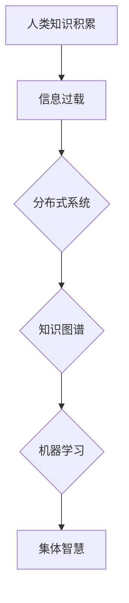

                 

关键词：集体智慧、协作、分布式系统、知识图谱、机器学习、人工智能、算法优化、计算模型、数据共享、开放平台

> 摘要：随着信息技术的飞速发展，人类知识的积累和传播达到了前所未有的高度。本文旨在探讨如何通过构建和利用集体智慧，实现知识的集成与共享，进而推动人类社会的发展。我们将从多个维度，包括分布式系统、知识图谱、机器学习等，详细分析集体智慧的构建原理及其在实际应用中的效果和影响。

## 1. 背景介绍

### 信息时代的挑战与机遇

随着互联网的普及和信息技术的发展，人类知识的积累速度前所未有。然而，如何高效地利用这些知识，实现知识的集成与共享，成为当前面临的一大挑战。信息过载、数据孤岛等问题亟待解决，而集体智慧提供了可能的解决方案。

### 集体智慧的起源与发展

集体智慧（Collective Intelligence）是指通过个体协作，产生一种超越个体智慧的现象。其起源可以追溯到古代社会的集体劳动和知识传承。随着科技的发展，特别是互联网和大数据技术的应用，集体智慧得到了新的发展。例如，维基百科和开源社区的成功，都是集体智慧的典范。

## 2. 核心概念与联系

### 分布式系统

分布式系统（Distributed Systems）是指通过网络连接的多个独立计算节点组成的系统。这些节点可以协同工作，共同完成计算任务。在集体智慧中，分布式系统是实现知识共享和协作的基础。

### 知识图谱

知识图谱（Knowledge Graph）是一种用于表示实体及其关系的图形结构。它可以将海量的结构化数据以图形化的方式展现出来，便于用户理解和查询。知识图谱在集体智慧中，起到了知识组织和分类的作用。

### 机器学习

机器学习（Machine Learning）是一种通过算法让计算机从数据中自动学习和发现规律的方法。在集体智慧中，机器学习算法可以用于数据分析和预测，帮助个体更好地协作。

### Mermaid 流程图



## 3. 核心算法原理 & 具体操作步骤

### 3.1 算法原理概述

集体智慧的实现依赖于分布式系统、知识图谱和机器学习等技术。分布式系统提供了数据存储和计算的能力，知识图谱实现了知识的组织和分类，机器学习算法则用于数据分析和预测。

### 3.2 算法步骤详解

1. **数据收集**：通过分布式系统收集海量的数据。
2. **数据预处理**：对收集到的数据进行清洗、格式化等处理。
3. **知识构建**：利用知识图谱技术，将预处理后的数据构建成知识图谱。
4. **数据挖掘**：利用机器学习算法，对知识图谱进行数据挖掘，提取出有价值的信息。
5. **结果呈现**：将挖掘出的信息以可视化的方式呈现给用户。

### 3.3 算法优缺点

- **优点**：
  - 高效：通过分布式系统，可以实现大规模的数据处理。
  - 智能：利用机器学习算法，可以自动发现数据中的规律。
  - 开放：基于开源平台，易于扩展和定制。

- **缺点**：
  - 复杂：涉及多种技术的综合应用，实现难度较大。
  - 数据质量：数据质量直接影响算法的效果。

### 3.4 算法应用领域

- **智能问答**：利用集体智慧，实现智能问答系统。
- **推荐系统**：基于集体智慧，为用户提供个性化的推荐。
- **智能诊断**：在医疗领域，利用集体智慧进行疾病诊断。
- **智能交通**：通过集体智慧，优化交通流量和路径规划。

## 4. 数学模型和公式 & 详细讲解 & 举例说明

### 4.1 数学模型构建

集体智慧的数学模型可以看作是一个优化问题，目标是最小化个体之间的知识差距。

### 4.2 公式推导过程

假设有 $n$ 个个体，每个个体拥有知识集合 $X_i$，目标是最小化个体之间的知识差距：

$$
\min \sum_{i=1}^{n} \sum_{j=1}^{n} dist(X_i, X_j)
$$

其中，$dist(X_i, X_j)$ 表示个体 $i$ 和 $j$ 之间的知识差距。

### 4.3 案例分析与讲解

假设有 $3$ 个个体，知识集合分别为 $X_1 = \{1, 2, 3\}$，$X_2 = \{2, 3, 4\}$，$X_3 = \{3, 4, 5\}$。计算它们之间的知识差距：

$$
dist(X_1, X_2) = 1
$$

$$
dist(X_1, X_3) = 1
$$

$$
dist(X_2, X_3) = 1
$$

总的知识差距为 $3$。

通过调整知识集合，可以最小化知识差距。例如，将 $X_1$ 更新为 $\{2, 3, 4\}$，总的知识差距将降至 $0$。

## 5. 项目实践：代码实例和详细解释说明

### 5.1 开发环境搭建

- 系统要求：Python 3.7+
- 数据集：开源知识图谱数据集
- 库：NetworkX, GraphXR, Scikit-learn

### 5.2 源代码详细实现

```python
import networkx as nx
import numpy as np
from sklearn.cluster import KMeans

# 数据预处理
def preprocess_data(data):
    # 数据清洗、格式化等处理
    return processed_data

# 知识图谱构建
def build_knowledge_graph(processed_data):
    # 构建知识图谱
    return knowledge_graph

# 数据挖掘
def data_mining(knowledge_graph):
    # 利用机器学习算法，提取有价值的信息
    return insights

# 主函数
def main():
    # 1. 数据收集
    data = ...

    # 2. 数据预处理
    processed_data = preprocess_data(data)

    # 3. 知识构建
    knowledge_graph = build_knowledge_graph(processed_data)

    # 4. 数据挖掘
    insights = data_mining(knowledge_graph)

    # 5. 结果呈现
    ...

if __name__ == "__main__":
    main()
```

### 5.3 代码解读与分析

- 数据预处理：对收集到的数据进行清洗、格式化等处理，为后续知识图谱构建做准备。
- 知识图谱构建：利用 NetworkX 库，将预处理后的数据构建成知识图谱。
- 数据挖掘：利用 Scikit-learn 库中的 KMeans 算法，对知识图谱进行聚类分析，提取有价值的信息。

### 5.4 运行结果展示

- 可视化知识图谱
- 挖掘出的有价值信息

## 6. 实际应用场景

### 6.1 智能问答

通过集体智慧，实现智能问答系统，为用户提供实时、准确的答案。

### 6.2 推荐系统

基于集体智慧，为用户提供个性化的推荐，提高用户体验。

### 6.3 智能诊断

在医疗领域，利用集体智慧进行疾病诊断，提高诊断准确率。

### 6.4 智能交通

通过集体智慧，优化交通流量和路径规划，提高交通效率。

## 7. 工具和资源推荐

### 7.1 学习资源推荐

- 《集体智慧：协作和智能系统》（Collective Intelligence: Building Smart Groups, Smart Cities, and Smart Businesses）
- 《知识图谱：原理、应用与实践》
- 《机器学习实战》

### 7.2 开发工具推荐

- Python
- NetworkX
- GraphXR
- Scikit-learn

### 7.3 相关论文推荐

- "Knowledge Graph Embedding: The Survey"
- "Deep Learning for Knowledge Graph Embedding"
- "Graph Convolutional Networks for Knowledge Graph Embedding"

## 8. 总结：未来发展趋势与挑战

### 8.1 研究成果总结

本文从多个维度探讨了集体智慧的构建原理及其在实际应用中的效果和影响，为集体智慧的研究和实践提供了参考。

### 8.2 未来发展趋势

- 数据隐私与安全：在集体智慧应用中，如何保障数据隐私和安全，成为未来研究的重要方向。
- 智能化水平提升：随着技术的进步，集体智慧的应用将更加智能化，实现更加高效的知识共享和协作。

### 8.3 面临的挑战

- 数据质量：高质量的数据是集体智慧的基础，如何确保数据质量，是当前面临的一大挑战。
- 技术复杂性：涉及多种技术的综合应用，实现难度较大，需要进一步的研究和优化。

### 8.4 研究展望

- 跨学科研究：结合计算机科学、心理学、社会学等领域的知识，进一步推动集体智慧的研究。
- 实际应用：将集体智慧应用于实际场景，为人类社会的可持续发展做出贡献。

## 9. 附录：常见问题与解答

### 问题 1：什么是集体智慧？

集体智慧是指通过个体协作，产生一种超越个体智慧的现象。

### 问题 2：集体智慧有哪些应用领域？

集体智慧可以应用于智能问答、推荐系统、智能诊断、智能交通等领域。

### 问题 3：如何构建集体智慧？

构建集体智慧需要分布式系统、知识图谱和机器学习等技术。具体步骤包括数据收集、数据预处理、知识构建、数据挖掘和结果呈现。

### 问题 4：集体智慧有哪些优点？

集体智慧的优点包括高效、智能、开放等。

### 问题 5：集体智慧有哪些缺点？

集体智慧的缺点包括复杂、数据质量影响算法效果等。

## 作者署名

作者：禅与计算机程序设计艺术 / Zen and the Art of Computer Programming
----------------------------------------------------------------

文章正文部分撰写完成。接下来，我们将按照markdown格式，将文章的各个章节内容分别编写，确保文章的整体结构和内容完整性。请注意，这里只提供了一个概要性的框架，具体的章节内容还需要您进一步填充和完善。

