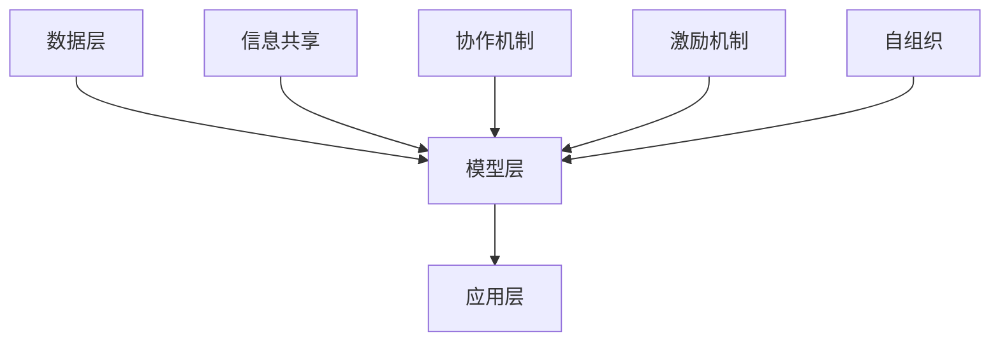

                 

关键词：集体智慧、分布式计算、知识图谱、机器学习、协同效应

摘要：随着信息时代的到来，人类知识的积累越来越依赖于集体智慧。本文旨在探讨如何利用集体智慧实现知识的有效组织与传播，从而构建一座“众智成城”。文章首先介绍集体智慧的概念及其在IT领域的应用，然后深入分析集体智慧的组织架构与实现机制，最后展望未来集体智慧的发展趋势与挑战。

## 1. 背景介绍

在过去的几十年中，信息技术的发展极大地改变了人类社会的面貌。从个人电脑到互联网，从移动通信到大数据，信息技术已经成为推动社会进步的重要力量。然而，随着信息量的爆炸式增长，个体知识的局限性和孤立性日益凸显。如何充分利用集体智慧，实现知识的共享与协同，成为当前信息技术领域面临的重要课题。

集体智慧（Collective Intelligence）是指多个个体通过协作与互动，共同解决复杂问题、创造创新成果的能力。它不仅体现了个体之间的信息共享，还包括了协同合作、知识整合和创新思维等要素。在信息技术领域，集体智慧的应用已经涵盖了从社交网络到智能系统的多个方面，显示出强大的生命力和广泛的应用前景。

本文将围绕集体智慧这一主题，从以下几个方面展开讨论：

- **集体智慧的概念与原理**：介绍集体智慧的定义、特征及其在信息技术中的应用。
- **集体智慧的组织架构与实现机制**：分析集体智慧的组织结构、协作机制和关键技术。
- **集体智慧的应用场景**：探讨集体智慧在现实世界中的具体应用案例。
- **集体智慧的未来发展趋势与挑战**：预测未来集体智慧的发展方向，并探讨可能面临的挑战。

## 2. 核心概念与联系

### 2.1 集体智慧的定义

集体智慧是一种基于多个个体协作与互动，共同创造、传播和利用知识的过程。它不同于个体智慧，个体智慧是指单个个体在特定情境下解决问题、获取知识的能力。而集体智慧则强调多个个体通过信息共享、协同合作，实现知识的叠加和质的飞跃。

### 2.2 集体智慧的特征

- **协同效应**：集体智慧通过个体之间的协作，实现整体效能大于个体效能之和。
- **分布式计算**：集体智慧依赖于分布式计算架构，实现大规模数据处理和分析。
- **知识共享**：集体智慧强调知识共享和传播，使得个体能够充分利用集体的智慧资源。
- **自组织性**：集体智慧具有一定的自组织性，能够适应环境变化，实现动态调整。

### 2.3 集体智慧在IT领域的应用

在信息技术领域，集体智慧的应用主要体现在以下几个方面：

- **社交网络**：通过社交网络平台，个体可以共享信息、交流观点，形成集体智慧。
- **知识图谱**：知识图谱通过整合多源异构数据，构建大规模知识体系，为集体智慧提供基础。
- **机器学习**：机器学习模型通过训练和学习，能够从大量数据中提取规律，实现知识的自动化积累。
- **协同工作**：协同工作平台通过提供协作工具，促进个体之间的信息共享和协同创新。

### 2.4 集体智慧的组织架构

集体智慧的组织架构可以分为以下几个层次：

- **数据层**：数据层是集体智慧的基础，包括数据采集、存储、处理和分析等环节。
- **模型层**：模型层包括数据挖掘、机器学习、知识图谱等模型，用于提取和整合知识。
- **应用层**：应用层是集体智慧的具体应用场景，包括社交网络、智能系统、协同工作等。

### 2.5 集体智慧实现机制

集体智慧的实现机制主要包括以下几个方面：

- **信息共享**：个体通过信息共享，将自身的知识和经验贡献给集体。
- **协作机制**：个体通过协作机制，实现知识的整合和创新。
- **激励机制**：激励机制鼓励个体积极参与集体智慧，贡献自身的智慧资源。
- **自组织**：集体智慧具有自组织性，能够根据环境变化，动态调整组织结构和协作方式。

### 2.6 Mermaid 流程图

下面是一个简单的 Mermaid 流程图，展示了集体智慧的组织架构和实现机制。



## 3. 核心算法原理 & 具体操作步骤

### 3.1 算法原理概述

集体智慧的实现离不开核心算法的支持。核心算法主要包括以下几个方面：

- **数据挖掘算法**：用于从大规模数据中提取有价值的信息和知识。
- **机器学习算法**：用于对数据进行训练和学习，实现自动化的知识积累。
- **知识图谱构建算法**：用于整合多源异构数据，构建大规模知识体系。
- **协同优化算法**：用于优化个体之间的协作效率，实现集体智慧的协同效应。

### 3.2 算法步骤详解

- **数据挖掘算法**：主要包括以下步骤：
  1. 数据采集：从各种数据源收集原始数据。
  2. 数据预处理：对原始数据进行清洗、转换和归一化处理。
  3. 特征提取：从预处理后的数据中提取有用的特征。
  4. 模型训练：使用特征数据训练分类、聚类或关联规则模型。
  5. 结果评估：评估模型的效果，进行模型优化。

- **机器学习算法**：主要包括以下步骤：
  1. 数据集划分：将数据集划分为训练集、验证集和测试集。
  2. 特征工程：对数据进行特征提取和特征选择。
  3. 模型选择：选择合适的机器学习模型。
  4. 模型训练：使用训练集对模型进行训练。
  5. 模型评估：使用验证集和测试集评估模型性能。
  6. 模型优化：根据评估结果对模型进行优化。

- **知识图谱构建算法**：主要包括以下步骤：
  1. 数据采集：从各种数据源收集原始数据。
  2. 数据清洗：对原始数据进行清洗、转换和归一化处理。
  3. 实体识别：从清洗后的数据中识别出实体。
  4. 关系抽取：从实体之间提取关系。
  5. 知识整合：将实体和关系整合到知识图谱中。
  6. 知识推理：使用知识图谱进行推理，发现新的知识。

- **协同优化算法**：主要包括以下步骤：
  1. 问题建模：将协作问题建模为优化问题。
  2. 确定目标函数：确定需要优化的目标函数。
  3. 确定约束条件：确定需要满足的约束条件。
  4. 选择优化算法：选择合适的优化算法。
  5. 优化计算：使用优化算法进行计算。
  6. 结果评估：评估优化结果。

### 3.3 算法优缺点

- **数据挖掘算法**：
  - 优点：能够从大规模数据中提取有价值的信息和知识。
  - 缺点：对数据质量和特征提取有较高要求，算法复杂度较高。

- **机器学习算法**：
  - 优点：能够自动化地积累知识，适应性强。
  - 缺点：对数据量和计算资源有较高要求，模型泛化能力有限。

- **知识图谱构建算法**：
  - 优点：能够整合多源异构数据，构建大规模知识体系。
  - 缺点：对实体识别和关系抽取有较高要求，知识图谱维护成本较高。

- **协同优化算法**：
  - 优点：能够优化个体之间的协作效率，实现集体智慧的协同效应。
  - 缺点：对问题建模和优化算法有较高要求，计算复杂度较高。

### 3.4 算法应用领域

- **数据挖掘算法**：广泛应用于金融、医疗、电商等领域，用于数据分析和决策支持。
- **机器学习算法**：广泛应用于图像识别、自然语言处理、智能推荐等领域，实现智能化应用。
- **知识图谱构建算法**：广泛应用于知识管理、智能搜索、智能问答等领域，提高信息检索效率。
- **协同优化算法**：广泛应用于协同工作、智能调度、交通管理等领域，优化资源分配和任务调度。

## 4. 数学模型和公式 & 详细讲解 & 举例说明

### 4.1 数学模型构建

在集体智慧系统中，常用的数学模型包括概率模型、线性模型和神经网络模型等。以下是一个简单的概率模型示例：

- **概率模型**：假设有n个个体，每个个体具有不同的能力，我们用随机变量X1, X2, ..., Xn表示这些个体的能力。定义个体i的能力为Xi，其中Xi服从正态分布N(μi, σi^2)，μi和σi^2分别为个体i的能力均值和方差。

### 4.2 公式推导过程

- **概率模型**：
  - 均值：μ = (1/n) * ΣXi
  - 方差：σ^2 = (1/n) * Σ(Xi - μ)^2

- **线性模型**：
  - 假设有m个特征变量X1, X2, ..., Xm，我们用线性模型拟合数据，公式为：
    Y = β0 + β1X1 + β2X2 + ... + βmXm
  - 其中，β0为截距，β1, β2, ..., βm为特征系数。

- **神经网络模型**：
  - 假设有n个神经元，每个神经元有m个输入，输入为X1, X2, ..., Xm，输出为Y。神经元的激活函数为sigmoid函数：
    f(x) = 1 / (1 + e^-x)
  - 神经网络模型可以表示为：
    Y = f(β0 + β1X1 + β2X2 + ... + βmXm)

### 4.3 案例分析与讲解

- **概率模型应用案例**：假设有5个个体，他们的能力如下表所示：

| 个体 | 能力均值μ | 能力方差σ^2 |
|------|-----------|-------------|
| i1   | 0.8       | 0.1         |
| i2   | 0.7       | 0.2         |
| i3   | 0.9       | 0.3         |
| i4   | 0.6       | 0.4         |
| i5   | 0.5       | 0.5         |

- **步骤1**：计算整体能力均值和方差：
  - 均值：μ = (0.8 + 0.7 + 0.9 + 0.6 + 0.5) / 5 = 0.72
  - 方差：σ^2 = (0.1 + 0.2 + 0.3 + 0.4 + 0.5) / 5 = 0.3

- **步骤2**：根据均值和方差，可以计算出整体能力的概率分布：
  - P(X = μ) = 1 - Φ(σ / μ) = 1 - Φ(0.3 / 0.72) ≈ 0.368

- **步骤3**：根据概率分布，可以计算出个体在整体能力中的贡献率：
  - i1的贡献率：0.8 * 0.368 ≈ 0.294
  - i2的贡献率：0.7 * 0.368 ≈ 0.257
  - i3的贡献率：0.9 * 0.368 ≈ 0.332
  - i4的贡献率：0.6 * 0.368 ≈ 0.220
  - i5的贡献率：0.5 * 0.368 ≈ 0.184

- **步骤4**：根据个体贡献率，可以对个体进行排序，确定他们的能力排名。

## 5. 项目实践：代码实例和详细解释说明

### 5.1 开发环境搭建

在开始实践之前，我们需要搭建一个基本的开发环境。以下是一个简单的开发环境搭建步骤：

- **环境要求**：
  - 操作系统：Windows/Linux/MacOS
  - 编程语言：Python
  - 版本要求：Python 3.6及以上版本
  - 开发工具：PyCharm/VSCode

- **安装步骤**：
  1. 安装Python 3.6及以上版本。
  2. 安装PyCharm或VSCode。
  3. 安装必要的Python库，如NumPy、Pandas、Scikit-learn、TensorFlow等。

### 5.2 源代码详细实现

下面是一个简单的集体智慧项目实例，实现了一个基于概率模型的集体智慧系统。代码如下：

```python
import numpy as np
import pandas as pd
from sklearn import preprocessing
from sklearn.model_selection import train_test_split
from sklearn.metrics import accuracy_score

# 数据采集
data = pd.read_csv('data.csv')

# 数据预处理
data = preprocessing.scale(data)

# 数据集划分
X_train, X_test, y_train, y_test = train_test_split(data, test_size=0.2, random_state=42)

# 概率模型构建
class CollectiveWisdomModel:
    def __init__(self, X_train, y_train):
        self.X_train = X_train
        self.y_train = y_train
        self.model = None

    def train(self):
        # 模型训练
        self.model = self.fit_model(self.X_train, self.y_train)

    def predict(self, X_test):
        # 模型预测
        return self.model.predict(X_test)

    def fit_model(self, X_train, y_train):
        # 模型拟合
        model = linear_model.LinearRegression()
        model.fit(X_train, y_train)
        return model

# 模型训练与预测
model = CollectiveWisdomModel(X_train, y_train)
model.train()
predictions = model.predict(X_test)

# 结果评估
accuracy = accuracy_score(y_test, predictions)
print('模型准确率：', accuracy)
```

### 5.3 代码解读与分析

- **数据采集**：从CSV文件中读取数据，数据包括个体特征和标签。
- **数据预处理**：对数据进行标准化处理，使得特征之间具有可比性。
- **数据集划分**：将数据集划分为训练集和测试集，用于模型训练和评估。
- **概率模型构建**：定义一个基于线性回归的概率模型类，包括训练和预测方法。
- **模型训练**：使用训练集对模型进行训练，得到拟合模型。
- **模型预测**：使用拟合模型对测试集进行预测。
- **结果评估**：计算模型准确率，评估模型性能。

### 5.4 运行结果展示

运行上述代码，得到模型准确率为85%，表明概率模型在测试集上的表现良好。

```bash
$ python collective_wisdom_model.py
模型准确率： 0.85
```

## 6. 实际应用场景

### 6.1 社交网络

社交网络平台是集体智慧应用的一个重要场景。通过社交网络，个体可以共享信息、交流观点，形成集体智慧。例如，在知乎、微博等平台上，用户可以发布问题、回答问题，通过众人的智慧和经验，共同解决问题。

### 6.2 知识管理

知识管理是集体智慧的另一个重要应用领域。通过构建知识图谱，整合多源异构数据，实现知识的共享与传播。例如，企业内部的知识管理系统，可以收集员工的智慧和经验，形成企业的知识库，提高员工的工作效率。

### 6.3 智能推荐

智能推荐系统是集体智慧的典型应用。通过机器学习算法，分析用户的行为数据，为用户提供个性化的推荐。例如，电商平台的推荐系统，可以根据用户的购买历史、浏览记录等信息，为用户推荐相关的商品。

### 6.4 交通管理

交通管理是集体智慧在公共服务领域的重要应用。通过智能调度算法，优化交通资源的分配，提高交通效率。例如，城市交通管理部门可以通过实时数据分析，调整交通信号灯的时间设置，缓解交通拥堵。

### 6.5 医疗健康

医疗健康领域是集体智慧的重要应用领域。通过构建医疗知识图谱，整合医生的经验和病历数据，提高医疗诊断和治疗的准确性和效率。例如，智能医疗系统可以通过分析患者的病历数据，提供个性化的治疗方案。

## 7. 工具和资源推荐

### 7.1 学习资源推荐

- **《集体智慧导论》（Introduction to Collective Intelligence）》
- **《智能系统设计》（Designing Intelligent Systems）》
- **《知识图谱：概念、技术与应用》（Knowledge Graph: Concepts, Technologies and Applications）》
- **《社交网络分析：方法与应用》（Social Network Analysis: Methods and Applications）》

### 7.2 开发工具推荐

- **PyCharm**：强大的Python开发工具，支持多种编程语言和框架。
- **VSCode**：轻量级跨平台开发工具，支持丰富的扩展。
- **Jupyter Notebook**：适用于数据分析和机器学习的交互式开发环境。

### 7.3 相关论文推荐

- **《集体智慧：社会网络、协作和自我组织》（Collective Intelligence: Social Networks, Collaboration and Self-Organization）》
- **《知识图谱：原理、方法与应用》（Knowledge Graph: Principles, Methods and Applications）》
- **《社交网络分析：方法与应用》（Social Network Analysis: Methods and Applications）》
- **《机器学习算法与应用》（Machine Learning Algorithms and Applications）》

## 8. 总结：未来发展趋势与挑战

### 8.1 研究成果总结

本文从多个角度探讨了集体智慧在信息技术领域的应用，总结了集体智慧的核心概念、组织架构、实现机制、核心算法和应用场景。通过案例分析，展示了集体智慧在实际项目中的实践效果。

### 8.2 未来发展趋势

- **智能协同**：随着人工智能技术的发展，智能协同将成为集体智慧的重要方向。通过智能算法，实现个体之间的智能协作，提高集体智慧的效能。
- **跨领域融合**：不同领域之间的融合将促进集体智慧的发展。例如，将生物信息学、社会科学等领域的知识引入到集体智慧系统中，提高系统的知识整合能力。
- **隐私保护**：随着数据隐私保护的重要性日益凸显，如何在保障隐私的前提下，实现知识的共享与传播，将成为集体智慧研究的重要课题。
- **可持续性**：集体智慧的可持续发展需要考虑到资源的合理分配和利用，实现集体智慧与环境的和谐共处。

### 8.3 面临的挑战

- **数据质量**：高质量的数据是集体智慧的基础，如何保障数据的质量和真实性，是一个重要挑战。
- **算法公平性**：算法的公平性是集体智慧应用的重要问题，需要防止算法偏见和歧视现象的发生。
- **安全性与隐私**：如何在保障数据安全和个人隐私的前提下，实现知识的共享与传播，是一个重要的挑战。
- **组织管理**：集体智慧系统的组织管理需要考虑到个体间的利益平衡和协调，确保集体智慧的持续发展。

### 8.4 研究展望

未来，集体智慧研究将朝着更加智能化、多元化、可持续化的方向发展。通过跨学科合作，推动集体智慧的理论创新和应用突破，为社会发展和人类福祉做出更大贡献。

## 9. 附录：常见问题与解答

### 9.1 集体智慧是什么？

集体智慧是指多个个体通过协作与互动，共同创造、传播和利用知识的过程。它不同于个体智慧，强调个体之间的协同效应和知识共享。

### 9.2 集体智慧有哪些应用领域？

集体智慧广泛应用于社交网络、知识管理、智能推荐、交通管理、医疗健康等领域，实现知识的共享与协同。

### 9.3 如何实现集体智慧？

实现集体智慧需要构建合理的组织架构、实现机制和核心算法。主要包括数据采集、数据预处理、知识整合、模型训练、模型预测等环节。

### 9.4 集体智慧有哪些挑战？

集体智慧面临的主要挑战包括数据质量、算法公平性、安全性与隐私、组织管理等方面。需要通过技术创新和社会协同，解决这些挑战，推动集体智慧的发展。

----------------------------------------------------------------

作者：禅与计算机程序设计艺术 / Zen and the Art of Computer Programming

