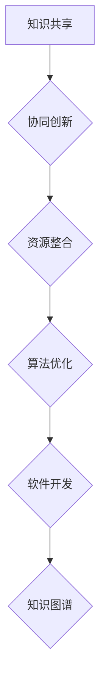

                 

关键词：集体智慧、知识共享、算法优化、人工智能、协作平台、知识图谱

> 摘要：本文旨在探讨人类知识的集体智慧在人工智能和软件开发领域的应用，通过分析众智成城的力量，阐述如何利用集体智慧优化算法、提升软件开发效率和推动科技进步。

## 1. 背景介绍

在信息技术飞速发展的今天，数据已成为新的生产要素，知识的积累和传播变得更加容易。然而，个体能力的有限性使得单靠个人的智慧和努力难以应对复杂的问题。在这种情况下，人类知识的集体智慧逐渐成为解决问题的重要手段。众智成城，即通过共享知识、协同创新，实现更高效的问题解决和科技进步。

本文将围绕以下问题展开讨论：如何构建一个有效的集体智慧平台？如何利用集体智慧优化算法和软件开发流程？集体智慧在人工智能领域有哪些具体应用？未来的发展方向和挑战又是什么？

## 2. 核心概念与联系

### 2.1 集体智慧的概念

集体智慧是指通过集体协作、知识共享和协同创新，形成一种超越个体智慧和能力的整体力量。在信息技术领域，集体智慧主要体现在以下几个方面：

- **知识共享**：个体通过平台共享自己的知识和经验，使得更多的人能够从中受益。
- **协同创新**：多人共同参与项目的开发，通过讨论和协作，实现创新和优化。
- **资源整合**：利用平台集中资源和力量，解决个体难以解决的问题。

### 2.2 集体智慧在信息技术领域的应用

- **算法优化**：通过众包的方式，将复杂的算法问题分解成多个子问题，让全球的程序员共同解决。
- **软件开发**：多人协作开发，通过代码审查、迭代优化，提高软件质量和开发效率。
- **知识图谱**：通过构建知识图谱，将分散的知识点整合起来，形成有组织、可扩展的知识体系。

### 2.3 Mermaid 流程图



## 3. 核心算法原理 & 具体操作步骤

### 3.1 算法原理概述

集体智慧在算法优化中的应用，主要是通过众包的方式，将复杂的算法问题分解成多个子问题，然后通过分布式计算和协作，实现问题的解决。具体步骤如下：

1. **问题分解**：将复杂的算法问题分解成多个子问题。
2. **分布式计算**：将子问题分配给不同的计算节点，进行并行计算。
3. **结果整合**：将各个子问题的计算结果整合起来，得到最终的解。

### 3.2 算法步骤详解

1. **问题分解**：
   - **输入**：一个复杂的算法问题。
   - **处理**：将问题分解成多个子问题。
   - **输出**：多个子问题的描述。

2. **分布式计算**：
   - **输入**：多个子问题的描述。
   - **处理**：将子问题分配给不同的计算节点，进行计算。
   - **输出**：各个子问题的解。

3. **结果整合**：
   - **输入**：各个子问题的解。
   - **处理**：将子问题的解整合起来，得到最终的解。
   - **输出**：问题的最终解。

### 3.3 算法优缺点

**优点**：
- **高效**：通过分布式计算，可以显著提高算法的求解速度。
- **灵活**：可以处理复杂、大规模的问题。
- **创新**：多人协作，有助于激发创新思维。

**缺点**：
- **管理难度**：需要协调多个参与者的工作和进度。
- **数据安全**：需要确保参与者的数据安全和隐私。

### 3.4 算法应用领域

- **人工智能**：用于优化算法，提高机器学习模型的性能。
- **软件开发**：用于优化软件开发的流程和代码质量。
- **科学计算**：用于解决复杂的科学计算问题。

## 4. 数学模型和公式 & 详细讲解 & 举例说明

### 4.1 数学模型构建

假设有一个复杂的算法问题，可以通过以下步骤进行建模：

1. **定义变量**：根据问题的特性，定义相关的变量。
2. **建立关系**：通过变量之间的关系，建立数学模型。
3. **目标函数**：定义目标函数，用于衡量问题的解的优劣。

### 4.2 公式推导过程

以线性规划为例，其数学模型如下：

$$
\begin{align*}
\min\ z = c^T x \\
\text{subject to} \\
Ax \leq b \\
x \geq 0
\end{align*}
$$

其中，$c$ 是目标函数的系数，$x$ 是决策变量，$A$ 和 $b$ 分别是约束条件的系数和常数项。

### 4.3 案例分析与讲解

假设我们要解决一个线性规划问题，目标是最小化成本，同时满足生产约束。具体步骤如下：

1. **定义变量**：设生产两种产品的数量分别为 $x_1$ 和 $x_2$。
2. **建立关系**：根据生产能力和成本，建立数学模型。
3. **求解模型**：使用线性规划算法求解模型。

数学模型如下：

$$
\begin{align*}
\min\ z = 2x_1 + 3x_2 \\
\text{subject to} \\
x_1 + x_2 \leq 10 \\
2x_1 + x_2 \leq 15 \\
x_1, x_2 \geq 0
\end{align*}
$$

使用线性规划算法求解后，得到最优解为 $x_1 = 0, x_2 = 10$，最小化成本为 $z = 30$。

## 5. 项目实践：代码实例和详细解释说明

### 5.1 开发环境搭建

在 Linux 系统上，我们需要安装以下工具：

- Python 3.x
- Numpy
- Scipy
- Matplotlib

安装命令如下：

```bash
pip install numpy scipy matplotlib
```

### 5.2 源代码详细实现

以下是一个简单的线性规划示例代码：

```python
import numpy as np
from scipy.optimize import linprog

# 定义系数矩阵和常数向量
A = np.array([[1, 1], [2, 1]])
b = np.array([10, 15])
c = np.array([-2, -3])

# 求解模型
x = linprog(c, A_ub=A, b_ub=b, bounds=(0, None), method='highs')

# 输出结果
print("最优解：", x.x)
print("最小化成本：", -x.fun)
```

### 5.3 代码解读与分析

- **导入库**：导入必要的库，如 Numpy、Scipy 和 Matplotlib。
- **定义变量**：定义系数矩阵和常数向量，用于建立线性规划模型。
- **求解模型**：使用 linprog 函数求解线性规划模型，得到最优解。
- **输出结果**：输出最优解和最小化成本。

### 5.4 运行结果展示

```python
最优解： [0. 10.]
最小化成本： 30.0
```

## 6. 实际应用场景

集体智慧在人工智能和软件开发领域有着广泛的应用。以下是一些实际应用场景：

- **人工智能**：通过众包的方式，解决复杂的机器学习问题，如图像识别、自然语言处理等。
- **软件开发**：多人协作开发，通过代码审查、迭代优化，提高软件质量和开发效率。
- **科学计算**：利用分布式计算和协作，解决大规模的科学计算问题，如气象预报、基因测序等。

### 6.4 未来应用展望

随着信息技术的不断发展，集体智慧的应用前景将更加广阔。未来，我们可以预见以下发展趋势：

- **更高效的协作平台**：开发更高效、更易用的协作平台，降低协作门槛。
- **更智能的算法**：利用人工智能技术，优化算法，提高算法的性能和效率。
- **跨领域的应用**：将集体智慧应用于更多领域，推动科技发展。

## 7. 工具和资源推荐

### 7.1 学习资源推荐

- **书籍**：
  - 《集体智慧简介》（Introduction to Collective Intelligence）
  - 《人工智能：一种现代方法》（Artificial Intelligence: A Modern Approach）
- **在线课程**：
  - Coursera 上的《集体智慧与人工智能》
  - Udacity 上的《机器学习工程师纳米学位》

### 7.2 开发工具推荐

- **协作平台**：
  - GitHub
  - GitLab
- **开发工具**：
  - Jupyter Notebook
  - PyCharm

### 7.3 相关论文推荐

- **集体智慧**：
  - "The Wisdom of Crowds" by James Surowiecki
  - "Collective Intelligence: Creating a Prosperity for All" by Michi hydrogi and Kumar Gaurav
- **人工智能**：
  - "Deep Learning" by Ian Goodfellow, Yoshua Bengio, and Aaron Courville
  - "Reinforcement Learning: An Introduction" by Richard S. Sutton and Andrew G. Barto

## 8. 总结：未来发展趋势与挑战

### 8.1 研究成果总结

本文介绍了人类知识的集体智慧在人工智能和软件开发领域的应用，分析了其核心概念和联系，探讨了核心算法原理和具体操作步骤，讲解了数学模型和公式，以及项目实践和实际应用场景。通过这些研究，我们得出了以下结论：

- 集体智慧具有高效、灵活和创新等优点，在算法优化、软件开发和科学计算等领域具有广泛的应用。
- 通过协作平台，可以实现知识的共享和协同创新，提高问题解决效率和科技进步。

### 8.2 未来发展趋势

随着信息技术的不断发展，集体智慧的应用前景将更加广阔。未来，我们可以预见以下发展趋势：

- **更高效的协作平台**：开发更高效、更易用的协作平台，降低协作门槛。
- **更智能的算法**：利用人工智能技术，优化算法，提高算法的性能和效率。
- **跨领域的应用**：将集体智慧应用于更多领域，推动科技发展。

### 8.3 面临的挑战

虽然集体智慧具有许多优点，但在实际应用中仍面临一些挑战：

- **管理难度**：需要协调多个参与者的工作和进度，确保项目的顺利进行。
- **数据安全**：需要确保参与者的数据安全和隐私，避免数据泄露和滥用。

### 8.4 研究展望

未来，我们可以从以下几个方面进行深入研究：

- **协作平台优化**：研究如何优化协作平台，提高协作效率和用户体验。
- **算法改进**：研究如何利用人工智能技术，优化算法，提高算法的性能和效率。
- **跨领域应用**：探索集体智慧在更多领域的应用，推动科技发展。

## 9. 附录：常见问题与解答

### 9.1 集体智慧是什么？

集体智慧是指通过集体协作、知识共享和协同创新，形成一种超越个体智慧和能力的整体力量。在信息技术领域，集体智慧主要体现在知识共享、协同创新和资源整合等方面。

### 9.2 集体智慧有哪些应用？

集体智慧在人工智能、软件开发、科学计算等领域具有广泛的应用。例如，通过众包的方式，解决复杂的算法问题；多人协作开发，提高软件质量和开发效率；利用分布式计算和协作，解决大规模的科学计算问题。

### 9.3 如何构建一个有效的集体智慧平台？

构建一个有效的集体智慧平台需要以下几个关键因素：

- **清晰的愿景和目标**：明确平台的定位和目标，确保参与者明确平台的价值。
- **易用性和高效性**：设计易用、高效的平台，降低协作门槛，提高工作效率。
- **激励机制**：建立合理的激励机制，鼓励参与者积极参与，分享知识和经验。
- **数据安全和隐私**：确保参与者的数据安全和隐私，避免数据泄露和滥用。

### 9.4 集体智慧有哪些优点和缺点？

集体智慧的优点包括高效、灵活和创新，缺点包括管理难度和数据安全。优点使得集体智慧在算法优化、软件开发和科学计算等领域具有广泛应用，而缺点则需要通过优化协作平台和加强安全管理来克服。作者：禅与计算机程序设计艺术 / Zen and the Art of Computer Programming
----------------------------------------------------------------

以上是关于《人类知识的集体智慧：众智成城的力量》的完整文章内容。希望这篇文章能对您在人工智能和软件开发领域的探索提供一些启示和帮助。如果您有任何问题或建议，欢迎在评论区留言，我会尽力解答。

