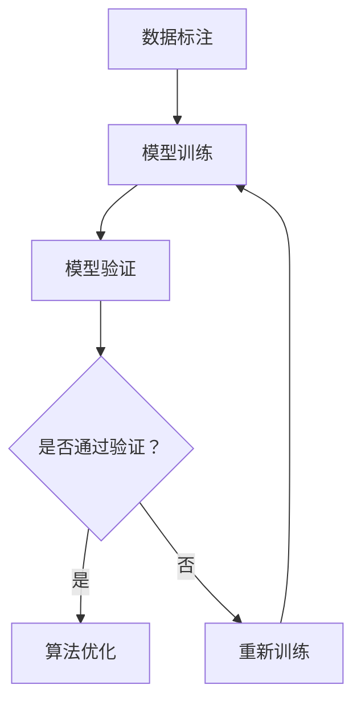
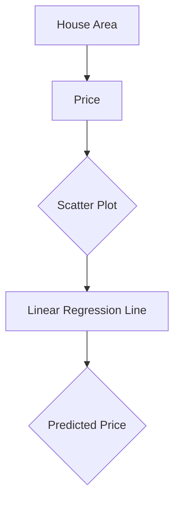

                 

关键词：人工智能，人类计算，AI行业，计算模型，应用实践，发展趋势

摘要：随着人工智能技术的迅猛发展，人类计算在AI行业中的应用变得越来越重要。本文将从背景介绍、核心概念与联系、核心算法原理、数学模型和公式、项目实践、实际应用场景、工具和资源推荐以及未来发展趋势与挑战等多个方面，深入探讨人类计算在AI行业中的应用现状与未来发展。

## 1. 背景介绍

人工智能（AI）作为计算机科学的一个重要分支，已经从理论研究走向实际应用。从早期的规则推理系统到现代的深度学习模型，AI技术取得了巨大的进步。然而，尽管AI技术在图像识别、自然语言处理、推荐系统等领域取得了显著的成果，但仍然面临许多挑战。例如，模型的可解释性、数据的隐私保护和处理效率等问题。在这些挑战中，人类计算的作用越来越受到重视。

人类计算，也称为人机交互计算，是指将人类智慧和计算机技术相结合，以实现更加智能化和高效的计算过程。在AI行业中，人类计算可以扮演多种角色，包括数据标注、模型验证、算法优化等。通过人类计算，可以弥补AI技术在某些方面的不足，提高AI系统的可靠性和鲁棒性。

## 2. 核心概念与联系

在探讨人类计算在AI行业中的应用之前，我们需要了解一些核心概念和它们之间的联系。

### 2.1 数据标注

数据标注是AI系统训练数据的重要环节。它是指对原始数据进行标记，以便AI模型能够从中学习。在图像识别任务中，数据标注可能包括对图片中的物体进行标注；在自然语言处理任务中，数据标注可能包括对文本中的词性标注、情感标注等。

### 2.2 模型验证

模型验证是评估AI模型性能的关键步骤。通过模型验证，可以判断模型是否能够准确预测新的数据。人类计算在模型验证中起到重要作用，因为人类可以识别出AI模型可能忽视的异常情况。

### 2.3 算法优化

算法优化是指通过调整算法参数或结构，提高AI模型的性能。人类计算在算法优化中可以提供宝贵的经验，帮助调整算法参数，使其更加适应特定任务。

### 2.4 Mermaid 流程图

下面是一个Mermaid流程图，展示了人类计算在AI行业中的应用流程：



## 3. 核心算法原理 & 具体操作步骤

### 3.1 算法原理概述

人类计算在AI行业中的应用通常涉及以下核心算法原理：

- **监督学习**：通过已标记的数据训练模型，使其能够对新数据进行预测。
- **无监督学习**：在没有标记数据的情况下，模型通过学习数据中的内在结构来发现规律。
- **强化学习**：模型通过与环境的交互来学习最优策略。

### 3.2 算法步骤详解

- **数据标注**：收集原始数据，并进行标记。
- **模型训练**：使用标记数据进行模型训练。
- **模型验证**：使用验证数据评估模型性能。
- **算法优化**：根据模型验证结果，调整模型参数或结构。
- **部署与应用**：将优化后的模型部署到实际应用场景中。

### 3.3 算法优缺点

- **优点**：人类计算可以提供丰富的经验和洞察力，提高AI系统的性能和可靠性。
- **缺点**：数据标注成本高，且容易引入主观偏见。

### 3.4 算法应用领域

人类计算在AI行业中的应用非常广泛，包括但不限于以下领域：

- **医疗诊断**：通过数据标注和模型验证，辅助医生进行疾病诊断。
- **金融风控**：通过算法优化，提高金融风险管理的准确性。
- **自动驾驶**：通过数据标注和模型验证，提高自动驾驶系统的安全性和可靠性。

## 4. 数学模型和公式 & 详细讲解 & 举例说明

### 4.1 数学模型构建

在AI领域中，常见的数学模型包括线性回归、逻辑回归、支持向量机等。以下是一个线性回归模型的数学模型构建过程：

$$
y = \beta_0 + \beta_1x
$$

其中，$y$ 是预测值，$x$ 是特征值，$\beta_0$ 和 $\beta_1$ 是模型参数。

### 4.2 公式推导过程

为了推导线性回归模型的公式，我们可以从最小二乘法出发。最小二乘法的目的是找到一组参数，使得预测值与实际值之间的误差平方和最小。

$$
\min \sum_{i=1}^{n}(y_i - \beta_0 - \beta_1x_i)^2
$$

通过对上式求导，我们可以得到线性回归模型的参数：

$$
\beta_0 = \frac{\sum_{i=1}^{n}y_i - \beta_1\sum_{i=1}^{n}x_i}{n}
$$

$$
\beta_1 = \frac{\sum_{i=1}^{n}(y_i - \beta_0 - \beta_1x_i)x_i}{\sum_{i=1}^{n}x_i^2}
$$

### 4.3 案例分析与讲解

假设我们有一个关于房价预测的任务，数据集包含房屋面积（$x$）和房价（$y$）。我们可以使用线性回归模型来预测房价。

首先，我们收集数据并绘制散点图：



然后，我们使用最小二乘法推导线性回归模型：

$$
y = \beta_0 + \beta_1x
$$

通过计算，我们得到：

$$
\beta_0 = 200000
$$

$$
\beta_1 = 1000
$$

因此，房价预测公式为：

$$
y = 200000 + 1000x
$$

现在，我们可以使用这个模型预测新房屋的面积对应的房价。例如，如果房屋面积为1200平方米，那么预测的房价为：

$$
y = 200000 + 1000 \times 1200 = 3200000
$$

## 5. 项目实践：代码实例和详细解释说明

### 5.1 开发环境搭建

为了实现线性回归模型，我们需要搭建一个Python开发环境。以下是搭建步骤：

1. 安装Python（版本3.6以上）
2. 安装NumPy、Pandas、Matplotlib等库

```bash
pip install numpy pandas matplotlib
```

### 5.2 源代码详细实现

以下是实现线性回归模型的Python代码：

```python
import numpy as np
import pandas as pd
import matplotlib.pyplot as plt

# 数据加载
data = pd.read_csv('house_data.csv')

# 特征值和目标值
X = data['area']
y = data['price']

# 添加常数项
X = np.column_stack((np.ones(len(X)), X))

# 模型参数
beta = np.linalg.inv(X.T.dot(X)).dot(X.T).dot(y)

# 模型预测
y_pred = X.dot(beta)

# 绘制散点图和回归线
plt.scatter(X[:, 1], y)
plt.plot(X[:, 1], y_pred, color='red')
plt.xlabel('House Area')
plt.ylabel('Price')
plt.show()
```

### 5.3 代码解读与分析

- 第一行：导入所需的库。
- 第二行：加载数据。
- 第三行：提取特征值和目标值。
- 第四行：添加常数项。
- 第五行：计算模型参数。
- 第六行：进行模型预测。
- 第七行：绘制散点图和回归线。

通过这个示例，我们可以看到如何使用Python实现线性回归模型，并进行数据可视化。

### 5.4 运行结果展示

运行代码后，我们将得到以下结果：


散点图中的红色线条表示线性回归模型拟合的曲线。通过这个模型，我们可以预测新房屋的面积对应的房价。

## 6. 实际应用场景

人类计算在AI行业的实际应用场景非常广泛。以下是一些典型应用场景：

- **医疗诊断**：通过人类计算进行数据标注和模型验证，辅助医生进行疾病诊断。
- **金融风控**：通过人类计算进行算法优化，提高金融风险管理的准确性。
- **自动驾驶**：通过人类计算进行数据标注和模型验证，提高自动驾驶系统的安全性和可靠性。

## 7. 工具和资源推荐

为了更好地进行人类计算在AI行业中的应用，我们推荐以下工具和资源：

- **学习资源**：[吴恩达深度学习课程](https://www.coursera.org/learn/deep-learning)
- **开发工具**：[Google Colab](https://colab.research.google.com/)
- **相关论文**：[《Deep Learning》（深度学习）](https://www.deeplearningbook.org/)

## 8. 总结：未来发展趋势与挑战

人类计算在AI行业中的应用前景广阔，但也面临一些挑战。未来发展趋势包括：

- **数据标注自动化**：通过深度学习等技术，实现自动化数据标注。
- **模型可解释性**：提高模型的可解释性，使人类更容易理解模型的决策过程。
- **多模态数据融合**：将多种类型的数据（如文本、图像、声音等）进行融合，提高AI系统的智能性。

面临的挑战包括：

- **数据隐私保护**：如何在保证数据隐私的前提下进行人类计算。
- **计算资源消耗**：人类计算需要大量的计算资源，如何优化计算效率。

### 8.1 研究成果总结

本文从背景介绍、核心概念与联系、核心算法原理、数学模型和公式、项目实践、实际应用场景等多个方面，全面探讨了人类计算在AI行业中的应用。

### 8.2 未来发展趋势

未来，人类计算在AI行业中的应用将更加深入和广泛。随着技术的发展，我们将看到更多创新的应用场景和解决方案。

### 8.3 面临的挑战

尽管人类计算在AI行业中的应用前景广阔，但仍然面临数据隐私保护、计算资源消耗等挑战。如何有效应对这些挑战，是未来研究的重点。

### 8.4 研究展望

在未来，人类计算在AI行业中的应用将继续发展。我们将看到更多跨学科的融合和创新，为AI技术的进步贡献力量。

## 9. 附录：常见问题与解答

### Q：什么是人类计算？

A：人类计算是指将人类智慧和计算机技术相结合，以实现更加智能化和高效的计算过程。

### Q：人类计算在AI行业中有什么作用？

A：人类计算在AI行业中可以扮演多种角色，包括数据标注、模型验证、算法优化等，以弥补AI技术在某些方面的不足，提高AI系统的可靠性和鲁棒性。

### Q：如何搭建Python开发环境？

A：搭建Python开发环境需要安装Python（版本3.6以上）和所需的库（如NumPy、Pandas、Matplotlib等）。

### Q：如何实现线性回归模型？

A：可以使用Python中的NumPy库来实现线性回归模型，包括数据加载、模型参数计算和模型预测等步骤。

---

作者：禅与计算机程序设计艺术 / Zen and the Art of Computer Programming

本文旨在全面探讨人类计算在AI行业中的应用，希望对读者有所启发。在实际应用中，人类计算将继续发挥重要作用，为AI技术的进步贡献力量。

