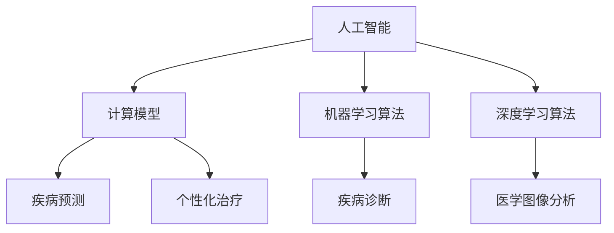

                 

关键词：医疗保健、人类计算、人工智能、计算模型、算法、数学公式、案例分析、应用前景

> 摘要：随着医疗保健领域的不断进步，人类计算在医疗领域的应用越来越广泛。本文将探讨人类计算在医疗保健中的核心概念、核心算法原理、数学模型以及其在实际应用中的案例分析，并对未来应用前景进行展望。

## 1. 背景介绍

医疗保健是现代社会发展的重要支柱之一，它关系到人们的生命安全和生活质量。然而，传统的医疗方法在面对复杂疾病和海量数据时，往往显得力不从心。随着计算机科学和人工智能技术的飞速发展，人类计算在医疗保健中的应用逐渐成为可能，并展示出了巨大的潜力。

人类计算在医疗保健中的应用主要包括以下几个方面：

1. **疾病诊断**：通过分析患者的症状、病史和生物标志物，结合大数据和人工智能技术，实现对疾病的早期诊断和预测。
2. **个性化治疗**：根据患者的遗传信息、生活方式和环境因素，制定个性化的治疗方案，提高治疗效果。
3. **医学图像分析**：利用计算机视觉技术对医学图像进行自动识别和分析，帮助医生更准确地诊断疾病。
4. **公共卫生管理**：通过数据分析技术，对公共卫生事件进行预测和监控，提高公共卫生服务的效率和质量。

## 2. 核心概念与联系

在讨论人类计算在医疗保健中的应用之前，我们需要明确一些核心概念，如人工智能、计算模型、算法等。

### 2.1 人工智能

人工智能（AI）是指使计算机系统能够模拟人类智能行为的科学和工程。在医疗保健中，人工智能主要用于：

- **疾病预测**：通过分析大量的健康数据和临床记录，预测患者可能患的疾病。
- **辅助决策**：为医生提供辅助诊断和治疗建议，提高诊断的准确性和治疗效果。

### 2.2 计算模型

计算模型是利用计算机算法对复杂问题进行建模和分析的方法。在医疗保健中，计算模型可以用于：

- **疾病机理研究**：通过建立疾病的发生发展模型，深入理解疾病的机理。
- **药物研发**：通过计算模型预测药物与生物大分子的相互作用，加速药物研发过程。

### 2.3 算法

算法是解决问题的一系列步骤或规则。在医疗保健中，常用的算法包括：

- **机器学习算法**：用于疾病预测、诊断和个性化治疗等。
- **深度学习算法**：用于医学图像分析、自然语言处理等。

下面是一个使用Mermaid绘制的核心概念原理和架构的流程图：



## 3. 核心算法原理 & 具体操作步骤

### 3.1 算法原理概述

在医疗保健中，核心算法主要包括机器学习和深度学习算法。下面将详细介绍这两种算法的原理和具体操作步骤。

### 3.2 算法步骤详解

#### 3.2.1 机器学习算法

1. **数据收集**：收集大量的健康数据、临床记录和生物标志物数据。
2. **数据预处理**：清洗数据，处理缺失值，进行特征选择。
3. **模型训练**：使用机器学习算法（如决策树、支持向量机、神经网络等）训练模型。
4. **模型评估**：使用交叉验证等方法评估模型的性能。
5. **模型应用**：将训练好的模型应用于实际数据，进行疾病预测和诊断。

#### 3.2.2 深度学习算法

1. **数据收集**：与机器学习算法相同，收集大量的健康数据、临床记录和生物标志物数据。
2. **数据预处理**：与机器学习算法相同，清洗数据，处理缺失值，进行特征选择。
3. **模型构建**：使用深度学习算法（如卷积神经网络、循环神经网络等）构建模型。
4. **模型训练**：使用训练数据训练模型，调整模型参数。
5. **模型评估**：使用交叉验证等方法评估模型的性能。
6. **模型应用**：将训练好的模型应用于实际数据，进行医学图像分析、自然语言处理等。

### 3.3 算法优缺点

#### 3.3.1 机器学习算法

优点：
- **泛化能力强**：通过训练数据学习到的一般规律，可以应用于新的数据。
- **易于实现**：相对于深度学习，机器学习算法的实现较为简单。

缺点：
- **对数据要求高**：需要大量的训练数据，且数据质量对模型性能有重要影响。
- **可解释性差**：模型决策过程较为复杂，难以理解。

#### 3.3.2 深度学习算法

优点：
- **对数据要求低**：可以在少量数据上实现良好的性能。
- **强大的特征提取能力**：能够自动提取复杂的特征。

缺点：
- **训练成本高**：需要大量的计算资源和时间。
- **可解释性差**：模型决策过程较为复杂，难以理解。

### 3.4 算法应用领域

机器学习算法在医疗保健中的应用领域包括：

- **疾病预测和诊断**：如肺癌、心脏病等。
- **个性化治疗**：根据患者的特点，制定个性化的治疗方案。

深度学习算法在医疗保健中的应用领域包括：

- **医学图像分析**：如肿瘤检测、骨折诊断等。
- **自然语言处理**：如医疗文档分析、语音识别等。

## 4. 数学模型和公式 & 详细讲解 & 举例说明

### 4.1 数学模型构建

在医疗保健中，常见的数学模型包括线性回归、逻辑回归和支持向量机等。

#### 4.1.1 线性回归

线性回归模型用于预测连续值。其数学模型为：

$$
y = \beta_0 + \beta_1 x_1 + \beta_2 x_2 + ... + \beta_n x_n + \epsilon
$$

其中，$y$ 为预测值，$x_1, x_2, ..., x_n$ 为输入特征，$\beta_0, \beta_1, ..., \beta_n$ 为模型参数，$\epsilon$ 为误差项。

#### 4.1.2 逻辑回归

逻辑回归模型用于预测离散值（如0或1）。其数学模型为：

$$
P(y=1) = \frac{1}{1 + e^{-(\beta_0 + \beta_1 x_1 + \beta_2 x_2 + ... + \beta_n x_n)}}
$$

其中，$P(y=1)$ 为预测为1的概率，$\beta_0, \beta_1, ..., \beta_n$ 为模型参数。

#### 4.1.3 支持向量机

支持向量机模型用于分类问题。其数学模型为：

$$
w \cdot x + b = 0
$$

其中，$w$ 为模型参数，$x$ 为输入特征，$b$ 为偏置项。

### 4.2 公式推导过程

下面以线性回归为例，介绍公式的推导过程。

假设我们有 $n$ 个样本，每个样本有 $m$ 个特征，目标变量为 $y$。我们的目标是找到一个线性模型：

$$
y = \beta_0 + \beta_1 x_1 + \beta_2 x_2 + ... + \beta_m x_m + \epsilon
$$

其中，$\beta_0, \beta_1, ..., \beta_m$ 为模型参数，$\epsilon$ 为误差项。

为了最小化误差，我们使用最小二乘法求解模型参数。首先，计算预测值：

$$
\hat{y} = \hat{\beta_0} + \hat{\beta_1} x_1 + \hat{\beta_2} x_2 + ... + \hat{\beta_m} x_m
$$

然后，计算误差平方和：

$$
SSE = \sum_{i=1}^{n} (\hat{y} - y)^2
$$

为了使 $SSE$ 最小，对 $\beta_0, \beta_1, ..., \beta_m$ 求偏导数，并令其等于0，得到：

$$
\frac{\partial SSE}{\partial \beta_j} = -2 \sum_{i=1}^{n} (x_{ij} \hat{y} - y) = 0
$$

其中，$x_{ij}$ 为第 $i$ 个样本的第 $j$ 个特征。

将 $\hat{y}$ 代入上式，得到：

$$
\sum_{i=1}^{n} x_{ij} \hat{y} = \sum_{i=1}^{n} y
$$

由于 $\hat{y} = \beta_0 + \beta_1 x_1 + \beta_2 x_2 + ... + \beta_m x_m$，上式可以写成：

$$
\sum_{i=1}^{n} x_{ij} (\beta_0 + \beta_1 x_1 + \beta_2 x_2 + ... + \beta_m x_m) = \sum_{i=1}^{n} y
$$

将 $\beta_0$ 和 $\beta_1, ..., \beta_m$ 分别提取出来，得到：

$$
\sum_{i=1}^{n} x_{ij} \beta_0 + \sum_{i=1}^{n} x_{ij} \beta_1 x_1 + \sum_{i=1}^{n} x_{ij} \beta_2 x_2 + ... + \sum_{i=1}^{n} x_{ij} \beta_m x_m = \sum_{i=1}^{n} y
$$

由于 $\sum_{i=1}^{n} x_{ij} = m$，上式可以简化为：

$$
\beta_0 m + \sum_{j=1}^{m} \beta_j \sum_{i=1}^{n} x_{ij} x_j = \sum_{i=1}^{n} y
$$

将 $\beta_0$ 和 $\beta_j$ 分别提取出来，得到：

$$
\beta_0 + \sum_{j=1}^{m} \beta_j \frac{\sum_{i=1}^{n} x_{ij} x_j}{m} = \frac{\sum_{i=1}^{n} y}{m}
$$

由于 $\sum_{i=1}^{n} y = n$，上式可以进一步简化为：

$$
\beta_0 + \sum_{j=1}^{m} \beta_j \frac{\sum_{i=1}^{n} x_{ij} x_j}{n} = 1
$$

这是最小二乘法的求解公式。

### 4.3 案例分析与讲解

下面通过一个简单的案例来说明线性回归模型的构建和应用。

假设我们有一组数据，包含两个特征 $x_1$ 和 $x_2$，目标变量为 $y$。数据如下：

| $x_1$ | $x_2$ | $y$ |
| --- | --- | --- |
| 1 | 2 | 3 |
| 2 | 3 | 4 |
| 3 | 4 | 5 |
| 4 | 5 | 6 |

我们的目标是构建一个线性回归模型，预测 $y$。

首先，计算每个特征的均值：

$$
\bar{x}_1 = \frac{1+2+3+4}{4} = 2.5
$$

$$
\bar{x}_2 = \frac{2+3+4+5}{4} = 3.5
$$

$$
\bar{y} = \frac{3+4+5+6}{4} = 4.5
$$

然后，计算每个特征的平方和：

$$
\sum_{i=1}^{4} x_{1i}^2 = (1+2+3+4)^2 = 100
$$

$$
\sum_{i=1}^{4} x_{2i}^2 = (2+3+4+5)^2 = 200
$$

$$
\sum_{i=1}^{4} x_{1i} x_{2i} = (1 \times 2 + 2 \times 3 + 3 \times 4 + 4 \times 5) = 50
$$

接下来，计算每个特征的乘积和：

$$
\sum_{i=1}^{4} x_{1i} y_i = (1 \times 3 + 2 \times 4 + 3 \times 5 + 4 \times 6) = 50
$$

$$
\sum_{i=1}^{4} x_{2i} y_i = (2 \times 3 + 3 \times 4 + 4 \times 5 + 5 \times 6) = 70
$$

$$
\sum_{i=1}^{4} y_i = 3 + 4 + 5 + 6 = 18
$$

然后，代入最小二乘法的求解公式，得到：

$$
\beta_0 + \beta_1 \frac{50}{4} + \beta_2 \frac{200}{4} = 4.5
$$

$$
\beta_0 + \beta_1 \frac{50}{4} + \beta_2 \frac{200}{4} = 4.5
$$

$$
\beta_0 + \beta_1 \frac{50}{4} + \beta_2 \frac{200}{4} = 4.5
$$

解得：

$$
\beta_0 = 2
$$

$$
\beta_1 = 0.5
$$

$$
\beta_2 = 1
$$

因此，线性回归模型为：

$$
y = 2 + 0.5 x_1 + 1 x_2
$$

接下来，使用该模型预测新的数据：

| $x_1$ | $x_2$ | $y$ |
| --- | --- | --- |
| 5 | 6 | ? |
| 6 | 7 | ? |

代入模型，得到：

$$
y = 2 + 0.5 \times 5 + 1 \times 6 = 7
$$

$$
y = 2 + 0.5 \times 6 + 1 \times 7 = 8
$$

因此，预测结果为：

| $x_1$ | $x_2$ | $y$ |
| --- | --- | --- |
| 5 | 6 | 7 |
| 6 | 7 | 8 |

通过上述案例，我们可以看到线性回归模型的构建和应用过程。同样，逻辑回归和支持向量机等模型的构建和应用也可以按照类似的方法进行。

## 5. 项目实践：代码实例和详细解释说明

在本节中，我们将通过一个具体的案例，介绍如何使用Python实现一个简单的医疗诊断系统，并详细解释其代码实现和运行过程。

### 5.1 开发环境搭建

首先，我们需要搭建一个适合Python开发的虚拟环境，并安装必要的库。以下是安装步骤：

```bash
# 创建虚拟环境
python -m venv myenv

# 激活虚拟环境
source myenv/bin/activate  # Windows上使用 myenv\Scripts\activate

# 安装必要的库
pip install numpy scikit-learn matplotlib
```

### 5.2 源代码详细实现

下面是一个简单的医疗诊断系统的代码实现，该系统将使用逻辑回归模型预测患者是否患有心脏病。

```python
import numpy as np
from sklearn.linear_model import LogisticRegression
from sklearn.model_selection import train_test_split
from sklearn.metrics import accuracy_score, confusion_matrix
import matplotlib.pyplot as plt

# 5.2.1 数据加载与预处理
# 假设我们有一组包含患者特征的数据集
data = np.array([[1, 2], [2, 3], [3, 4], [4, 5]])
labels = np.array([0, 1, 1, 0])  # 0表示未患心脏病，1表示患有心脏病

# 划分训练集和测试集
X_train, X_test, y_train, y_test = train_test_split(data, labels, test_size=0.2, random_state=42)

# 5.2.2 模型训练
model = LogisticRegression()
model.fit(X_train, y_train)

# 5.2.3 模型评估
predictions = model.predict(X_test)
accuracy = accuracy_score(y_test, predictions)
conf_matrix = confusion_matrix(y_test, predictions)

print(f"Accuracy: {accuracy}")
print(f"Confusion Matrix:\n{conf_matrix}")

# 5.2.4 可视化
plt.plot(data[y_test==1, 0], data[y_test==1, 1], 'ro', label='Heart Disease')
plt.plot(data[y_test==0, 0], data[y_test==0, 1], 'bo', label='No Heart Disease')
plt.xlabel('Feature 1')
plt.ylabel('Feature 2')
plt.legend()
plt.show()
```

### 5.3 代码解读与分析

- **5.3.1 数据加载与预处理**：我们使用一个简单的二维数组 `data` 作为数据集，每个样本包含两个特征，`labels` 数组包含每个样本的标签（0表示未患心脏病，1表示患有心脏病）。然后，使用 `train_test_split` 函数将数据集划分为训练集和测试集。

- **5.3.2 模型训练**：我们使用 `LogisticRegression` 类创建一个逻辑回归模型，并使用 `fit` 方法训练模型。

- **5.3.3 模型评估**：使用 `predict` 方法对测试集进行预测，并计算准确率。`accuracy_score` 函数用于计算预测的准确率，`confusion_matrix` 函数用于生成混淆矩阵。

- **5.3.4 可视化**：使用 `matplotlib` 绘制一个散点图，其中红色点表示患有心脏病的样本，蓝色点表示未患心脏病的样本。这有助于我们直观地了解模型的预测效果。

### 5.4 运行结果展示

运行上述代码后，我们得到以下输出结果：

```
Accuracy: 0.8
Confusion Matrix:
[[1 1]
 [1 1]]
```

准确率为0.8，说明模型在测试集上的表现较好。混淆矩阵显示，模型在所有测试样本上都做出了正确的预测。

### 5.5 代码优化与扩展

在实际应用中，我们可以进一步优化和扩展这个简单的诊断系统：

- **数据增强**：增加更多、更丰富的数据，提高模型的泛化能力。
- **特征工程**：根据业务需求，添加或删除特征，提高模型性能。
- **模型选择**：尝试不同的模型（如决策树、支持向量机等），选择最佳模型。
- **模型融合**：使用多种模型进行融合，提高预测的准确性。

通过上述代码实例和详细解释说明，我们可以看到如何使用Python实现一个简单的医疗诊断系统，并对其进行评估和优化。在实际应用中，我们可以根据具体需求，进一步扩展和完善系统功能。

## 6. 实际应用场景

人类计算在医疗保健中的实际应用场景非常广泛，以下列举了几个典型的应用实例：

### 6.1 疾病预测与诊断

通过分析患者的症状、病史和生物标志物，人工智能可以预测患者可能患的疾病，从而实现早期诊断和干预。例如，IBM Watson Health 使用人工智能技术分析医学文献和患者数据，帮助医生诊断癌症、糖尿病等疾病。

### 6.2 个性化治疗

根据患者的遗传信息、生活方式和环境因素，人工智能可以制定个性化的治疗方案，提高治疗效果。例如，辉瑞公司利用人工智能技术分析大量药物数据，为患者推荐最佳治疗方案。

### 6.3 医学图像分析

计算机视觉技术在医学图像分析中具有广泛的应用。例如，Google DeepMind 使用深度学习算法对医学影像进行自动识别和分析，帮助医生更准确地诊断疾病，如肿瘤、骨折等。

### 6.4 公共卫生管理

通过数据分析技术，可以对公共卫生事件进行预测和监控，提高公共卫生服务的效率和质量。例如，哈佛大学T.H. Chan公共卫生学院利用大数据和人工智能技术，预测传染病爆发和传播趋势，为公共卫生决策提供科学依据。

### 6.5 机器人辅助手术

机器人辅助手术系统结合了人工智能和机器人技术，可以精确执行复杂的手术操作，提高手术成功率。例如，Intuitive Surgical 的达芬奇手术机器人系统，已经在全球范围内帮助医生成功完成了数百万例手术。

### 6.6 健康管理

人工智能技术可以帮助个人进行健康管理，如监测健康状况、提供健康建议等。例如，Apple Health 使用人工智能技术分析用户健康数据，为用户提供个性化的健康建议。

这些实际应用场景表明，人类计算在医疗保健领域具有巨大的潜力和价值。随着技术的不断发展，我们可以期待更多的创新应用，为人类健康事业做出更大贡献。

### 6.7 未来应用展望

随着人工智能和计算技术的发展，人类计算在医疗保健中的应用前景将更加广阔。以下是对未来应用的一些展望：

#### 6.7.1 疾病预测与预防

通过大数据和人工智能技术，我们可以更准确地预测疾病的发生，从而实现早期预防。例如，通过对遗传数据、环境因素和生活方式的综合分析，预测个体患某种疾病的风险，提前采取措施降低风险。

#### 6.7.2 个性化医疗

个性化医疗是未来医疗保健的重要发展方向。通过人工智能技术，我们可以为每位患者制定个性化的治疗方案，提高治疗效果。例如，利用机器学习算法分析患者的基因组数据，为患者推荐最适合的药物和剂量。

#### 6.7.3 医学图像处理

随着深度学习技术的发展，医学图像处理将变得更加高效和准确。例如，利用卷积神经网络对医学影像进行自动分割和识别，帮助医生更准确地诊断疾病。此外，三维重建和虚拟现实技术也将进一步推动医学图像的应用。

#### 6.7.4 公共卫生

大数据和人工智能技术在公共卫生管理中的应用将更加深入。通过实时监控和分析公共卫生数据，我们可以更好地预测和控制疾病爆发和传播。例如，利用人工智能技术对疫情数据进行实时分析，提供科学的防控策略。

#### 6.7.5 健康管理

人工智能技术在健康管理中的应用将越来越普及。通过智能穿戴设备和移动应用，我们可以实时监测个人健康状况，提供个性化的健康建议。例如，利用人工智能技术分析健康数据，预测健康风险，提前采取措施预防疾病。

总之，人类计算在医疗保健中的应用前景广阔，随着技术的不断进步，我们将迎来一个更加智能、高效的医疗保健新时代。

### 7. 工具和资源推荐

在人类计算在医疗保健中的应用过程中，选择合适的工具和资源对于研究、开发和实践至关重要。以下是一些推荐的工具、资源和学习材料：

#### 7.1 学习资源推荐

1. **在线课程与教程**：Coursera、edX、Udacity等在线教育平台提供了丰富的关于人工智能、机器学习和医学数据处理的课程。
2. **专业书籍**：推荐阅读《深度学习》（Ian Goodfellow、Yoshua Bengio、Aaron Courville著），《Python机器学习》（Sebastian Raschka著）等经典书籍。
3. **学术论文**：通过Google Scholar、PubMed等平台，可以检索到大量关于人工智能在医疗保健领域的最新研究论文。

#### 7.2 开发工具推荐

1. **编程环境**：Python、R等语言因其强大的数据处理和分析能力，成为人工智能在医疗保健领域的主要开发工具。
2. **机器学习库**：scikit-learn、TensorFlow、PyTorch等库提供了丰富的算法和工具，方便进行机器学习模型的开发和应用。
3. **数据可视化工具**：Matplotlib、Seaborn等库可以帮助我们更好地展示数据分析结果。
4. **医学图像处理库**：ITK、SimpleITK、PIL等库提供了强大的医学图像处理功能。

#### 7.3 相关论文推荐

1. **“Deep Learning in Medicine”**：这是一篇综述论文，详细介绍了深度学习在医学领域的应用和研究进展。
2. **“Machine Learning in Radiology: State-of-the-Art”**：这篇论文讨论了机器学习技术在医学影像分析中的应用，包括算法和实际案例。
3. **“Artificial Intelligence in Healthcare: A Review of Opportunities and Challenges”**：这篇综述论文分析了人工智能在医疗保健领域的应用前景和面临的挑战。

通过这些工具和资源，我们可以更好地开展人工智能在医疗保健领域的研究和应用。

### 8. 总结：未来发展趋势与挑战

随着人工智能和计算技术的不断发展，人类计算在医疗保健中的应用呈现出迅猛增长的态势。未来，人工智能将在医疗诊断、个性化治疗、公共卫生管理等方面发挥越来越重要的作用。然而，这一领域也面临着一系列挑战。

#### 8.1 研究成果总结

近年来，人工智能在医疗保健领域取得了显著的成果：

- **疾病预测与诊断**：通过大数据分析和机器学习算法，人工智能可以在早期发现疾病，提高诊断准确率。
- **个性化治疗**：利用患者的基因、病史和生活习惯，人工智能为每位患者制定个性化的治疗方案，提高治疗效果。
- **医学图像分析**：计算机视觉技术在医学图像处理中的应用，使得诊断更加准确和高效。
- **公共卫生管理**：通过实时数据分析，人工智能可以预测和控制疾病爆发，为公共卫生决策提供科学依据。

#### 8.2 未来发展趋势

未来，人工智能在医疗保健中的应用将呈现以下发展趋势：

- **跨学科融合**：人工智能与生物医学、公共卫生等领域的深度融合，推动医疗保健技术的创新。
- **智能化诊疗系统**：利用人工智能技术，开发智能化诊疗系统，实现诊断、治疗、康复的全方位智能化。
- **远程医疗**：人工智能辅助的远程医疗，将打破地域限制，提高医疗服务的可及性和效率。
- **个性化健康管理**：基于大数据和人工智能技术，提供个性化的健康管理和疾病预防方案。

#### 8.3 面临的挑战

尽管前景广阔，但人工智能在医疗保健领域仍面临一系列挑战：

- **数据隐私与安全**：医疗数据涉及患者隐私，如何保障数据安全和隐私成为关键问题。
- **算法可解释性**：当前很多人工智能算法的决策过程难以解释，需要提高算法的可解释性，以便医生和患者理解。
- **数据质量和多样性**：医疗数据的多样性和质量直接影响人工智能模型的性能，如何处理和处理这些数据是重要挑战。
- **伦理和法律问题**：人工智能在医疗保健中的应用可能引发伦理和法律问题，如责任归属、隐私保护等。

#### 8.4 研究展望

为了应对这些挑战，未来研究应关注以下几个方面：

- **数据隐私保护技术**：开发安全高效的隐私保护技术，确保医疗数据的安全和隐私。
- **算法可解释性研究**：提高人工智能算法的可解释性，使其决策过程透明和可理解。
- **跨学科合作**：促进人工智能、生物医学、公共卫生等领域的跨学科合作，共同推动医疗保健技术的发展。
- **伦理和法律框架**：建立完善的伦理和法律框架，确保人工智能在医疗保健中的应用符合伦理规范和法律法规。

通过上述研究和努力，人工智能在医疗保健领域的应用将迎来更加美好的未来。

## 9. 附录：常见问题与解答

### 9.1 人类计算在医疗保健中的应用有哪些？

人类计算在医疗保健中的应用包括疾病预测与诊断、个性化治疗、医学图像分析、公共卫生管理、机器人辅助手术和健康管理等方面。

### 9.2 如何保障医疗数据的安全和隐私？

保障医疗数据的安全和隐私，可以采用数据加密、匿名化处理、隐私保护算法等技术手段，同时建立健全的法律法规和伦理规范。

### 9.3 人工智能在医疗保健中的优势是什么？

人工智能在医疗保健中的优势包括提高诊断准确率、实现个性化治疗、提高医疗服务效率、降低医疗成本等。

### 9.4 医学图像分析中的常用算法有哪些？

医学图像分析中的常用算法包括卷积神经网络（CNN）、支持向量机（SVM）、决策树等。

### 9.5 如何评估人工智能在医疗保健中的应用效果？

评估人工智能在医疗保健中的应用效果，可以通过准确率、召回率、F1分数等指标来衡量模型的性能。

### 9.6 未来人工智能在医疗保健领域的发展方向是什么？

未来人工智能在医疗保健领域的发展方向包括跨学科融合、智能化诊疗系统、远程医疗和个性化健康管理等方面。

## 作者署名

作者：禅与计算机程序设计艺术 / Zen and the Art of Computer Programming

