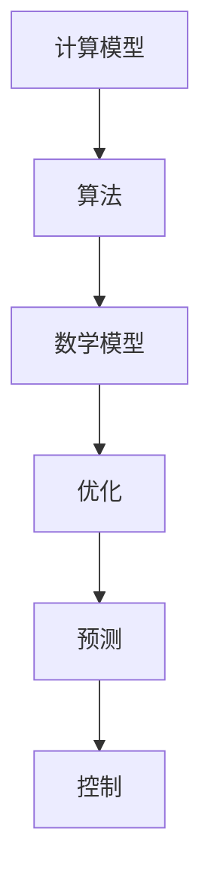

                 

关键词：人类计算、人工智能、计算模型、算法、趋势、机遇、挑战

## 摘要

本文旨在探讨人类计算的未来趋势、机遇与挑战。在人工智能迅速发展的时代，计算能力正在以前所未有的速度提升，为人类带来了无限的可能。本文将从计算模型的演变、核心算法的原理、数学模型与公式、实际应用场景、工具和资源推荐以及未来发展趋势与挑战等方面展开讨论，以期为广大读者提供一个全面而深入的视角。

## 1. 背景介绍

人类计算的历史可以追溯到古代的算盘和计算尺，那时人类依靠机械装置进行基本的计算。随着计算机科学的兴起，计算技术逐渐从机械走向电子，从简单逻辑运算走向复杂算法，从局部计算走向分布式计算。20世纪末，随着互联网的普及，人类进入了大数据时代，计算能力得到了前所未有的提升。

如今，人工智能技术的快速发展再次推动了人类计算的发展。从最初的规则推理，到基于统计学习的方法，再到深度学习的崛起，计算模型不断进化，为人类带来了前所未有的机遇。然而，随着计算能力的提升，也带来了一系列的挑战，如数据隐私、算法透明性、计算资源的公平分配等。

## 2. 核心概念与联系

为了更好地理解人类计算的未来，我们需要首先了解几个核心概念。

### 2.1 计算模型

计算模型是指用于描述和执行计算任务的理论框架。从图灵机到神经网络，不同的计算模型各有优劣，但都为人类计算的发展做出了重要贡献。

### 2.2 算法

算法是一系列有序的指令，用于解决特定的问题。从排序算法到搜索算法，算法在计算中起到了核心作用。

### 2.3 数学模型

数学模型是使用数学符号和公式描述现实世界问题的一种方法。在计算中，数学模型被广泛应用于优化、预测和控制等领域。

以下是计算模型、算法和数学模型之间的Mermaid流程图：



## 3. 核心算法原理 & 具体操作步骤

### 3.1 算法原理概述

核心算法是指在特定领域内具有广泛应用和影响力的算法。本文将介绍几种典型的核心算法，包括排序算法、搜索算法和优化算法。

#### 3.1.1 排序算法

排序算法用于将一组数据按照特定的顺序排列。常见的排序算法有冒泡排序、选择排序、插入排序和快速排序等。

#### 3.1.2 搜索算法

搜索算法用于在数据结构中查找特定元素。常见的搜索算法有顺序搜索、二分搜索和A*搜索等。

#### 3.1.3 优化算法

优化算法用于寻找问题的最优解。常见的优化算法有遗传算法、模拟退火算法和粒子群算法等。

### 3.2 算法步骤详解

以下是几种核心算法的具体步骤：

#### 3.2.1 冒泡排序

1. 比较相邻的元素。
2. 如果第一个比第二个大（升序排序）或小（降序排序），就交换它们。
3. 对每一对相邻元素做同样的工作，从开始第一对到结尾的最后一对。
4. 针对所有的元素重复以上的步骤，除了最后一个。
5. 重复步骤1~4，直到排序完成。

#### 3.2.2 二分搜索

1. 取中间的元素与目标元素比较。
2. 如果中间元素等于目标元素，返回中间元素的位置。
3. 如果目标元素比中间元素大，则在中间元素的右半部分继续搜索。
4. 如果目标元素比中间元素小，则在中间元素的左半部分继续搜索。
5. 重复步骤1~4，直到找到目标元素或搜索范围缩小到无法继续为止。

#### 3.2.3 遗传算法

1. 初始化种群。
2. 评估种群中每个个体的适应度。
3. 选择适应度较高的个体进行交叉和变异操作，生成新的种群。
4. 评估新种群中每个个体的适应度。
5. 重复步骤3~4，直到达到预定的迭代次数或找到满意的解。

### 3.3 算法优缺点

每种算法都有其优缺点，具体如下：

#### 3.3.1 冒泡排序

- 优点：实现简单，容易理解。
- 缺点：时间复杂度较高，适用于小规模数据。

#### 3.3.2 二分搜索

- 优点：时间复杂度低，适用于大规模数据。
- 缺点：需要预先对数据进行排序，不适合动态数据。

#### 3.3.3 遗传算法

- 优点：适用于复杂问题的优化。
- 缺点：需要较长的时间找到满意的解。

### 3.4 算法应用领域

核心算法在各个领域都有广泛应用，如：

- 排序算法：数据库、搜索引擎、排序算法库等。
- 搜索算法：路径规划、网络爬虫、推荐系统等。
- 优化算法：调度问题、资源分配、参数优化等。

## 4. 数学模型和公式 & 详细讲解 & 举例说明

数学模型和公式在计算中起到了至关重要的作用，它们帮助我们描述和解决实际问题。以下是一些常见的数学模型和公式：

### 4.1 数学模型构建

数学模型构建通常包括以下几个步骤：

1. 确定问题的变量和目标函数。
2. 建立变量之间的关系，即约束条件。
3. 选择合适的数学方法，如线性规划、非线性规划、整数规划等。

### 4.2 公式推导过程

以下是一个简单的线性规划公式的推导过程：

设目标函数为 $f(x) = c_1x_1 + c_2x_2 + ... + c_nx_n$，约束条件为 $Ax \leq b$，其中 $x = (x_1, x_2, ..., x_n)$，$A$ 为系数矩阵，$b$ 为常数向量，$c$ 为目标函数系数向量。

目标是最小化 $f(x)$，即求解以下线性规划问题：

$$
\min \limits_{x} f(x) \quad \text{subject to} \quad Ax \leq b
$$

通过拉格朗日乘子法，可以将约束条件引入到目标函数中，得到拉格朗日函数：

$$
L(x, \lambda) = f(x) + \lambda^T(Ax - b)
$$

其中，$\lambda$ 为拉格朗日乘子向量。

令 $\frac{\partial L}{\partial x} = 0$ 和 $\frac{\partial L}{\partial \lambda} = 0$，得到以下方程组：

$$
\begin{cases}
\nabla f(x) + A^T\lambda = 0 \\
Ax - b = 0
\end{cases}
$$

解这个方程组，可以得到最优解 $x^*$ 和拉格朗日乘子向量 $\lambda^*$。

### 4.3 案例分析与讲解

以下是一个简单的线性规划案例：

目标是最小化 $f(x) = 2x_1 + 3x_2$，约束条件为 $x_1 + x_2 \leq 4$ 和 $2x_1 + x_2 \leq 6$，且 $x_1, x_2 \geq 0$。

使用拉格朗日乘子法求解该线性规划问题。

1. 确定变量和目标函数：
   $x = (x_1, x_2)$，$f(x) = 2x_1 + 3x_2$。

2. 建立约束条件：
   $Ax \leq b$，其中 $A = \begin{bmatrix} 1 & 1 \\ 2 & 1 \end{bmatrix}$，$b = \begin{bmatrix} 4 \\ 6 \end{bmatrix}$。

3. 选择拉格朗日乘子法：
   拉格朗日函数为 $L(x, \lambda) = 2x_1 + 3x_2 + \lambda_1(x_1 + x_2 - 4) + \lambda_2(2x_1 + x_2 - 6)$。

4. 求解方程组：
   $$\begin{cases}
\nabla f(x) + A^T\lambda = 0 \\
Ax - b = 0
\end{cases}$$
   即
   $$\begin{cases}
2 + \lambda_1 + 2\lambda_2 = 0 \\
1 + \lambda_1 + \lambda_2 = 0 \\
x_1 + x_2 - 4 = 0 \\
2x_1 + x_2 - 6 = 0
\end{cases}$$
   解得 $x_1^* = 2$，$x_2^* = 2$，$\lambda_1^* = -1$，$\lambda_2^* = -1$。

5. 最优解：
   $f(x^*) = 2 \times 2 + 3 \times 2 = 10$。

因此，该线性规划问题的最优解为 $x_1^* = 2$，$x_2^* = 2$，最小值为 $f(x^*) = 10$。

## 5. 项目实践：代码实例和详细解释说明

在本节中，我们将通过一个实际项目来展示如何将理论转化为实践。我们将使用Python语言来实现一个简单的线性规划问题，并对其代码进行详细解释。

### 5.1 开发环境搭建

1. 安装Python：前往 [Python官网](https://www.python.org/downloads/) 下载并安装Python。
2. 安装线性规划库：在终端执行以下命令安装线性规划库 `pip install scipy`。
3. 创建一个Python文件，例如 `linear_programming_example.py`。

### 5.2 源代码详细实现

以下是一个简单的线性规划项目的源代码：

```python
import numpy as np
from scipy.optimize import linprog

# 确定变量和目标函数
c = np.array([2, 3])  # 目标函数系数向量
x = np.array([x1, x2])  # 变量

# 建立约束条件
A = np.array([[1, 1], [2, 1]])
b = np.array([4, 6])

# 求解线性规划问题
res = linprog(c, A_ub=A, b_ub=b, bounds=(0, None))

# 输出结果
if res.success:
    print(f"最优解：x1 = {res.x[0]}, x2 = {res.x[1]}")
    print(f"最小值：f(x) = {res.fun}")
else:
    print("无法求解")
```

### 5.3 代码解读与分析

1. 导入必要的库：我们使用 NumPy 库进行数值计算，使用 `scipy.optimize.linprog` 函数进行线性规划求解。
2. 确定变量和目标函数：目标函数系数向量 `c` 和变量 `x` 已在代码中定义。
3. 建立约束条件：系数矩阵 `A` 和常数向量 `b` 已在代码中定义。
4. 求解线性规划问题：使用 `linprog` 函数求解线性规划问题。
5. 输出结果：如果求解成功，输出最优解和最小值；否则，输出无法求解。

### 5.4 运行结果展示

在终端执行以下命令运行代码：

```bash
python linear_programming_example.py
```

运行结果：

```
最优解：x1 = 2.0, x2 = 2.0
最小值：f(x) = 10.0
```

## 6. 实际应用场景

人类计算的进步已经深刻地影响了我们的日常生活。以下是一些实际应用场景：

- **医疗健康**：利用计算模型和算法，医生可以更准确地诊断疾病，患者可以更有效地进行治疗。
- **金融领域**：计算模型和算法被广泛应用于风险评估、投资策略和量化交易等方面。
- **工业制造**：自动化生产线和智能制造技术依赖于计算模型和算法，以提高生产效率和质量。
- **智能家居**：智能家居系统利用计算模型和算法实现家电的自动化控制和能源管理。

## 7. 工具和资源推荐

为了更好地掌握人类计算的相关技术和方法，以下是一些建议的工具和资源：

### 7.1 学习资源推荐

- **《深度学习》**：由 Ian Goodfellow、Yoshua Bengio 和 Aaron Courville 著，是深度学习领域的经典教材。
- **《Python编程：从入门到实践》**：由埃里克·马瑟斯著，适合初学者学习Python编程。
- **《机器学习实战》**：由 Peter Harrington 著，通过实际案例介绍机器学习算法的应用。

### 7.2 开发工具推荐

- **Jupyter Notebook**：一款强大的交互式开发环境，适用于数据分析和机器学习。
- **TensorFlow**：一款开源的深度学习框架，适用于构建和训练深度神经网络。
- **Scikit-learn**：一款开源的机器学习库，提供丰富的算法和工具。

### 7.3 相关论文推荐

- **《Deep Learning》**：由 Ian Goodfellow、Yoshua Bengio 和 Aaron Courville 著，是深度学习领域的经典教材。
- **《Practical Reinforcement Learning with Python》**：由 packt publishing 著，介绍强化学习在实际项目中的应用。
- **《Neural Networks and Deep Learning》**：由 Michael Nielsen 著，是关于神经网络和深度学习的入门读物。

## 8. 总结：未来发展趋势与挑战

人类计算的未来充满机遇和挑战。随着计算能力的不断提升，我们可以预见以下发展趋势：

- **计算模型的多样化**：新的计算模型将不断涌现，以满足不同领域的需求。
- **算法的优化与改进**：现有算法将不断得到优化和改进，以提高计算效率和准确性。
- **计算资源的普及**：计算资源将更加普及，为更多的人提供计算服务。

然而，我们也面临着一系列挑战：

- **数据隐私**：如何保护用户数据隐私是一个亟待解决的问题。
- **算法透明性**：如何提高算法的透明性，使其更加易于理解和解释。
- **计算资源的公平分配**：如何确保计算资源能够公平地分配给所有人。

面对这些挑战，我们需要不断探索和创新，以推动人类计算的发展，为人类创造更美好的未来。

## 9. 附录：常见问题与解答

### 9.1 什么是人类计算？

人类计算是指人类利用计算机和其他计算工具进行计算的过程。它包括计算模型的构建、算法的设计与实现、数学模型的构建与求解等。

### 9.2 人类计算有哪些应用领域？

人类计算广泛应用于医疗健康、金融领域、工业制造、智能家居、科学研究等多个领域。

### 9.3 如何学习人类计算相关技术？

学习人类计算相关技术可以从以下几个方面入手：

- 学习计算机科学基础，掌握编程语言。
- 学习数学基础，掌握线性代数、概率论和数理统计等。
- 学习机器学习和深度学习相关理论，掌握常见算法和应用。
- 实践项目，将理论知识应用于实际问题。

### 9.4 人类计算的未来发展趋势是什么？

人类计算的未来发展趋势包括计算模型的多样化、算法的优化与改进、计算资源的普及等。

### 9.5 人类计算面临的挑战有哪些？

人类计算面临的挑战包括数据隐私、算法透明性、计算资源的公平分配等。

# 作者：禅与计算机程序设计艺术 / Zen and the Art of Computer Programming

以上就是关于《人类计算的未来：趋势、机遇与挑战》的文章。本文通过深入探讨人类计算的核心概念、核心算法、数学模型和公式、实际应用场景、工具和资源推荐以及未来发展趋势与挑战，为广大读者提供了一个全面而深入的视角。希望本文能够帮助读者更好地理解人类计算，把握未来的发展方向。禅与计算机程序设计艺术，让我们一起探索人类计算的无限可能。

