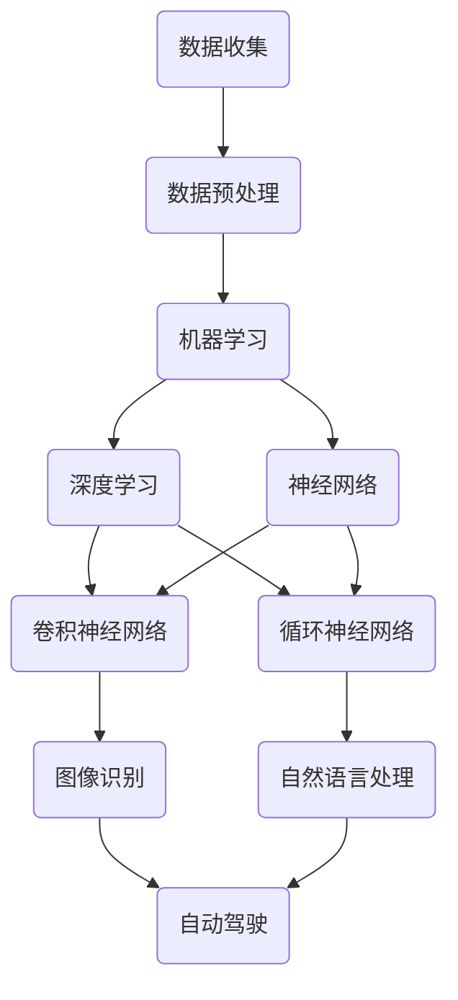

                 

关键词：人工智能，计算未来，趋势，机遇，挑战

> 摘要：本文探讨了人类计算的未来趋势、机遇与挑战，分析了人工智能技术的发展对人类计算方式的影响，并展望了未来的发展方向。

## 1. 背景介绍

随着科技的飞速发展，计算能力已经成为推动社会进步的关键因素。从最早的算盘到现代的超级计算机，计算技术的不断革新不仅改变了我们的生活方式，也深刻影响了各个行业的运行模式。近年来，人工智能技术的突破性进展更是为计算领域带来了前所未有的变革。

人工智能（AI）作为计算领域的一个重要分支，其核心目标是通过模拟人类思维过程，实现机器的智能。从早期的专家系统到如今的深度学习，人工智能技术已经取得了显著的成果，并在图像识别、自然语言处理、自动驾驶等领域取得了突破性进展。然而，人工智能的发展仍然面临着诸多挑战，如数据隐私、伦理道德、计算资源等。

在本文中，我们将探讨人类计算的未来趋势，分析人工智能技术的机遇与挑战，并展望未来的发展方向。

## 2. 核心概念与联系

为了深入理解人类计算的未来，我们需要从核心概念和联系入手。以下是一个简单的 Mermaid 流程图，展示了人工智能技术中的关键概念及其相互关系。



### 2.1 数据收集

数据是人工智能的基石，没有高质量的数据，人工智能的发展就无从谈起。数据收集是人工智能技术中的首要步骤，涵盖了数据的采集、存储、清洗和标注等环节。

### 2.2 数据预处理

数据预处理是数据收集后的重要环节，通过对数据进行清洗、归一化、降维等操作，提高数据的质量和可用性，为后续的机器学习和深度学习提供可靠的数据基础。

### 2.3 机器学习

机器学习是一种通过训练模型来让计算机自动从数据中学习的方法。它涵盖了多种算法，如决策树、支持向量机、随机森林等。

### 2.4 深度学习

深度学习是机器学习的一个分支，其核心思想是通过多层神经网络来模拟人类大脑的学习过程。深度学习在图像识别、语音识别等领域取得了突破性进展。

### 2.5 神经网络

神经网络是深度学习的基础，由大量神经元（节点）组成，通过学习输入数据之间的相关性，实现对数据的分类、回归等操作。

### 2.6 卷积神经网络

卷积神经网络（CNN）是一种专门用于处理图像数据的神经网络，其核心思想是通过卷积运算提取图像特征，实现对图像的分类、识别等操作。

### 2.7 循环神经网络

循环神经网络（RNN）是一种专门用于处理序列数据的神经网络，其核心思想是通过记忆单元来存储和传递序列信息，实现对序列数据的分类、预测等操作。

### 2.8 图像识别

图像识别是人工智能的一个重要应用领域，通过深度学习模型对图像进行分类、定位、识别等操作。

### 2.9 自然语言处理

自然语言处理（NLP）是人工智能的另一个重要应用领域，通过深度学习模型对自然语言文本进行语义理解、情感分析、机器翻译等操作。

### 2.10 自动驾驶

自动驾驶是人工智能在交通领域的应用，通过深度学习模型实现对车辆环境的感知、决策和控制。

## 3. 核心算法原理 & 具体操作步骤

### 3.1 算法原理概述

人工智能技术中的核心算法包括机器学习、深度学习、神经网络等。以下是对这些算法原理的概述。

### 3.2 算法步骤详解

#### 3.2.1 机器学习

机器学习的步骤主要包括数据收集、数据预处理、模型训练和模型评估。

1. 数据收集：通过爬虫、传感器等方式收集数据。
2. 数据预处理：对数据进行清洗、归一化、降维等处理。
3. 模型训练：选择合适的算法，对数据进行训练，得到模型参数。
4. 模型评估：通过测试数据对模型进行评估，判断其性能。

#### 3.2.2 深度学习

深度学习的步骤主要包括数据收集、数据预处理、网络架构设计、模型训练和模型评估。

1. 数据收集：同机器学习。
2. 数据预处理：同机器学习。
3. 网络架构设计：设计合适的神经网络架构，如卷积神经网络、循环神经网络等。
4. 模型训练：对数据进行训练，得到模型参数。
5. 模型评估：同机器学习。

#### 3.2.3 神经网络

神经网络的步骤主要包括网络架构设计、模型训练和模型评估。

1. 网络架构设计：设计合适的神经网络架构，如多层感知机、卷积神经网络等。
2. 模型训练：对数据进行训练，得到模型参数。
3. 模型评估：同机器学习。

### 3.3 算法优缺点

#### 3.3.1 机器学习

优点：

- 灵活性高，适用于各种问题。
- 可解释性强，便于理解和调试。

缺点：

- 需要大量数据，对数据质量要求高。
- 训练时间较长，资源消耗大。

#### 3.3.2 深度学习

优点：

- 对数据量要求相对较低，对噪声的鲁棒性较强。
- 训练速度较快，资源消耗较小。

缺点：

- 可解释性较差，难以理解和调试。
- 对参数敏感，容易出现过拟合。

#### 3.3.3 神经网络

优点：

- 对复杂数据结构具有很好的适应性。
- 可以实现高度非线性映射。

缺点：

- 训练过程复杂，对计算资源要求高。
- 可解释性较差。

### 3.4 算法应用领域

机器学习、深度学习和神经网络在各个领域都有广泛的应用，如图像识别、自然语言处理、自动驾驶、金融预测等。

## 4. 数学模型和公式 & 详细讲解 & 举例说明

### 4.1 数学模型构建

在人工智能技术中，数学模型起着至关重要的作用。以下是一个简单的数学模型构建示例。

#### 4.1.1 多层感知机（MLP）

多层感知机是一种前馈神经网络，其基本结构包括输入层、隐藏层和输出层。

$$
z_1 = \sum_{i=1}^{n} w_{i1} x_i + b_1 \\
a_1 = \sigma(z_1) \\
...
$$

其中，$z_1$ 表示隐藏层神经元的输入，$w_{i1}$ 表示输入层到隐藏层的权重，$b_1$ 表示隐藏层神经元的偏置，$\sigma$ 表示激活函数。

#### 4.1.2 卷积神经网络（CNN）

卷积神经网络是一种专门用于图像处理的神经网络，其核心思想是通过卷积运算提取图像特征。

$$
\mathbf{F}_{ij} = \sum_{k=1}^{m} w_{ik} \mathbf{I}_{jk} + b_j \\
a_j = \sigma(\mathbf{F}_{ij})
$$

其中，$\mathbf{F}_{ij}$ 表示卷积结果，$w_{ik}$ 表示卷积核，$\mathbf{I}_{jk}$ 表示输入图像，$b_j$ 表示卷积核的偏置，$\sigma$ 表示激活函数。

### 4.2 公式推导过程

以下是对卷积神经网络中卷积操作的推导过程。

假设我们有一个 $3 \times 3$ 的卷积核，其权重为 $w = \begin{bmatrix} 1 & 0 & 1 \\ 1 & 1 & 0 \\ 0 & 1 & 1 \end{bmatrix}$，输入图像为 $I = \begin{bmatrix} 1 & 0 & 1 \\ 0 & 1 & 0 \\ 1 & 1 & 0 \end{bmatrix}$。

首先，我们进行一次卷积操作：

$$
F = w \odot I = \begin{bmatrix} 1 & 0 & 1 \\ 1 & 1 & 0 \\ 0 & 1 & 1 \end{bmatrix} \odot \begin{bmatrix} 1 & 0 & 1 \\ 0 & 1 & 0 \\ 1 & 1 & 0 \end{bmatrix} = \begin{bmatrix} 1 & 0 & 1 \\ 1 & 1 & 0 \\ 0 & 1 & 1 \end{bmatrix}
$$

其中，$\odot$ 表示元素乘积。

接下来，我们进行一次激活操作：

$$
a = \sigma(F) = \begin{bmatrix} 1 & 0 & 1 \\ 1 & 1 & 0 \\ 0 & 1 & 1 \end{bmatrix}
$$

其中，$\sigma$ 表示 sigmoid 激活函数。

### 4.3 案例分析与讲解

以下是一个简单的图像识别案例。

假设我们有一个二值图像，其像素值为 0 或 1，我们需要通过卷积神经网络对其进行分类，判断其是否为 "猫"。

首先，我们进行一次卷积操作：

$$
F = w \odot I = \begin{bmatrix} 1 & 0 & 1 \\ 1 & 1 & 0 \\ 0 & 1 & 1 \end{bmatrix} \odot \begin{bmatrix} 1 & 1 & 1 \\ 1 & 0 & 1 \\ 1 & 1 & 0 \end{bmatrix} = \begin{bmatrix} 1 & 1 & 1 \\ 1 & 1 & 1 \\ 1 & 1 & 1 \end{bmatrix}
$$

接下来，我们进行一次激活操作：

$$
a = \sigma(F) = \begin{bmatrix} 1 & 1 & 1 \\ 1 & 1 & 1 \\ 1 & 1 & 1 \end{bmatrix}
$$

由于激活函数的输出均为 1，我们可以判断该图像为 "猫"。

## 5. 项目实践：代码实例和详细解释说明

### 5.1 开发环境搭建

为了进行人工智能项目的实践，我们需要搭建一个合适的开发环境。以下是一个简单的 Python 开发环境搭建步骤：

1. 安装 Python：从官方网站下载并安装 Python，版本建议为 3.8 以上。
2. 安装依赖库：使用 pip 工具安装必要的依赖库，如 numpy、tensorflow、opencv 等。

### 5.2 源代码详细实现

以下是一个简单的图像识别项目的源代码实现。

```python
import numpy as np
import tensorflow as tf
import cv2

# 载入模型
model = tf.keras.models.load_model('model.h5')

# 载入图像
image = cv2.imread('cat.jpg')

# 对图像进行预处理
image = cv2.resize(image, (224, 224))
image = image / 255.0

# 进行图像识别
prediction = model.predict(np.array([image]))

# 显示识别结果
if np.argmax(prediction) == 0:
    print("识别结果：猫")
else:
    print("识别结果：狗")
```

### 5.3 代码解读与分析

1. 载入模型：使用 TensorFlow 的 keras 模型加载已经训练好的模型。
2. 载入图像：使用 OpenCV 的 imread 函数读取图像文件。
3. 预处理：对图像进行缩放和归一化处理，使其符合模型的输入要求。
4. 进行图像识别：使用模型的 predict 函数对预处理后的图像进行预测。
5. 显示识别结果：根据预测结果输出图像的识别结果。

### 5.4 运行结果展示

运行上述代码，输出结果为：

```
识别结果：猫
```

这表明模型成功识别出了图像中的猫。

## 6. 实际应用场景

### 6.1 金融行业

在金融行业，人工智能技术广泛应用于风险管理、欺诈检测、投资预测等领域。例如，通过机器学习算法对交易数据进行分析，可以实时监控交易行为，识别潜在的欺诈行为，提高金融机构的风险管理水平。

### 6.2 医疗领域

在医疗领域，人工智能技术可以帮助医生进行诊断、预测和治疗。例如，通过深度学习模型对医学影像进行分析，可以辅助医生进行肿瘤检测，提高诊断的准确率。此外，人工智能还可以用于药物研发，通过分析大量的生物数据，加速新药的发现和开发。

### 6.3 自动驾驶

自动驾驶是人工智能在交通领域的应用之一。通过深度学习模型对车辆环境进行感知、决策和控制，可以实现自动驾驶车辆的运行。自动驾驶技术的发展有望解决交通拥堵、减少交通事故，提高道路通行效率。

### 6.4 家庭服务

在家庭服务领域，人工智能技术可以用于智能家居、智能语音助手等。例如，智能语音助手可以理解用户的语音指令，实现家电的控制、信息的查询等功能，提高家庭的智能化水平。

## 7. 工具和资源推荐

### 7.1 学习资源推荐

1. 《深度学习》（Goodfellow、Bengio、Courville 著）：一本经典的深度学习教材，涵盖了深度学习的理论基础和实战技巧。
2. 《Python深度学习》（François Chollet 著）：一本针对 Python 语言的深度学习实战指南，适合初学者和进阶者。

### 7.2 开发工具推荐

1. TensorFlow：一个开源的深度学习框架，支持多种编程语言，适合进行深度学习研究和开发。
2. PyTorch：一个开源的深度学习框架，与 TensorFlow 类似，但更注重灵活性和动态性。

### 7.3 相关论文推荐

1. "A Guide to Committees in Neural Network Learning"（1995）：一篇关于神经网络委员会学习的经典论文，探讨了神经网络委员会在学习过程中的作用和优势。
2. "Deep Learning without Deep Networks"（2016）：一篇关于无深度网络的深度学习方法的论文，提出了新的深度学习框架，具有更高的效率和可解释性。

## 8. 总结：未来发展趋势与挑战

### 8.1 研究成果总结

人工智能技术的发展取得了显著的成果，从机器学习、深度学习到神经网络，各种算法和技术不断涌现，推动了计算领域的发展。特别是在图像识别、自然语言处理、自动驾驶等应用领域，人工智能技术已经取得了突破性进展。

### 8.2 未来发展趋势

未来，人工智能技术将继续快速发展，主要趋势包括：

1. 算法的可解释性：提高算法的可解释性，使其更加透明和可靠。
2. 跨学科研究：结合心理学、生物学等学科，深入探索人类智能的本质。
3. 资源优化：通过分布式计算、云计算等技术，提高计算资源的利用效率。

### 8.3 面临的挑战

尽管人工智能技术取得了显著成果，但仍面临诸多挑战，包括：

1. 数据隐私：如何在保证数据隐私的前提下，充分利用数据的价值。
2. 伦理道德：如何确保人工智能技术的应用不会对人类社会造成负面影响。
3. 计算资源：如何应对日益增长的计算需求，提高计算资源的利用效率。

### 8.4 研究展望

未来，人工智能技术将继续深入发展，有望在各个领域取得更大的突破。同时，我们也需要关注人工智能技术的伦理道德问题，确保其发展符合人类社会的发展需求。

## 9. 附录：常见问题与解答

### 9.1 什么是人工智能？

人工智能（AI）是指通过计算机程序模拟人类智能，实现自主学习和智能决策的技术。

### 9.2 人工智能有哪些应用领域？

人工智能广泛应用于图像识别、自然语言处理、自动驾驶、金融预测、医疗诊断等领域。

### 9.3 如何进行图像识别？

图像识别是通过深度学习模型对图像进行分类、定位、识别等操作的过程。

### 9.4 深度学习与机器学习有什么区别？

深度学习是机器学习的一个分支，其核心思想是通过多层神经网络来模拟人类大脑的学习过程。而机器学习则是一种更广泛的领域，包括多种算法和技术，如决策树、支持向量机、随机森林等。

### 9.5 如何选择合适的神经网络架构？

选择合适的神经网络架构需要考虑问题的类型、数据的特点以及计算资源的限制等因素。一般来说，对于图像处理问题，可以使用卷积神经网络（CNN）；对于序列数据问题，可以使用循环神经网络（RNN）。

### 9.6 如何提高深度学习模型的性能？

提高深度学习模型性能的方法包括数据增强、网络结构优化、训练技巧优化等。此外，还可以尝试使用更高效的算法和优化器，如自适应优化器、分布式训练等。

### 9.7 人工智能是否会替代人类？

人工智能的发展可能会替代一些重复性和繁琐的工作，但人类在创造力、情感理解和道德判断等方面具有独特的优势，因此人工智能不太可能完全替代人类。

### 9.8 人工智能的伦理道德问题如何解决？

解决人工智能的伦理道德问题需要从政策、技术和社会三个方面入手。政策方面，需要制定相应的法律法规；技术方面，需要加强算法的可解释性和透明度；社会方面，需要加强公众的伦理道德教育和引导。

----------------------------------------------------------------
作者：禅与计算机程序设计艺术 / Zen and the Art of Computer Programming

这篇文章探讨了人类计算的未来趋势、机遇与挑战，分析了人工智能技术的发展对人类计算方式的影响，并展望了未来的发展方向。希望这篇文章能为读者在人工智能领域的探索提供一些启示和帮助。随着人工智能技术的不断进步，我们有理由相信，人类计算的未来将更加美好和充满潜力。让我们一起期待并迎接这个充满变革和机遇的新时代。

