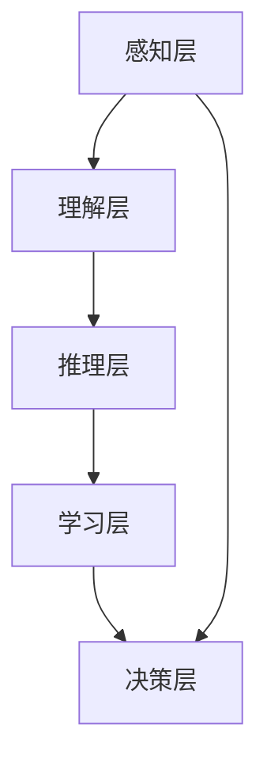

                 

关键词：人类计算，人工智能，算法，数学模型，应用场景，发展趋势，挑战

> 摘要：本文旨在探讨人类计算的未来，从趋势、机遇与挑战三个方面出发，深入分析人工智能的发展状况、核心算法原理与应用，数学模型的构建与公式推导，项目实践案例，以及未来应用展望。本文旨在为读者提供对人类计算未来的全面了解，并激发读者对这一领域的深入思考。

## 1. 背景介绍

### 1.1 人类计算的定义与历史演变

人类计算，指的是人类在数据处理、推理、规划等方面的认知能力。从古代的算筹、算盘，到现代的计算器、计算机，人类计算经历了数千年的演变。计算机的出现，使得人类计算的能力得到了空前的提升，从简单的算术运算到复杂的科学计算，都离不开计算机的参与。

### 1.2 人工智能的崛起

随着计算机技术的不断发展，人工智能（AI）逐渐崛起。人工智能是指计算机模拟人类智能行为的能力，包括感知、理解、推理、学习、决策等方面。人工智能的发展，不仅改变了人类的生活和工作方式，也为人类计算带来了新的机遇和挑战。

### 1.3 人类计算的未来展望

随着人工智能技术的不断进步，人类计算的未来充满了无限可能。从提高工作效率，到解决复杂问题，再到实现人机协同，人类计算的未来充满了机遇。然而，与此同时，也面临着诸多挑战，如数据安全、隐私保护、伦理道德等。

## 2. 核心概念与联系

### 2.1 人工智能的核心概念

人工智能的核心概念包括感知、理解、推理、学习、决策等。感知是指计算机通过传感器获取外部信息；理解是指计算机对感知到的信息进行解释和处理；推理是指计算机基于已有信息做出推断和决策；学习是指计算机通过经验不断优化自己的行为；决策是指计算机根据目标，选择最优行动方案。

### 2.2 人工智能的架构

人工智能的架构主要包括感知层、理解层、推理层、学习层和决策层。感知层负责收集和处理外部信息；理解层负责对感知到的信息进行解释和处理；推理层负责基于已有信息做出推断和决策；学习层负责通过经验不断优化自己的行为；决策层负责根据目标，选择最优行动方案。

### 2.3 人工智能与人类计算的关联

人工智能是人类计算的一种高级形式，它通过模拟人类的认知能力，提高了人类计算的能力。人工智能的发展，使得人类计算的范围不断扩大，从简单的数据处理到复杂的科学计算，都离不开人工智能的支持。

## 3. 核心算法原理 & 具体操作步骤

### 3.1 算法原理概述

人工智能的核心算法包括机器学习、深度学习、自然语言处理等。机器学习是指计算机通过学习已有数据，自动提取规律，并应用于新数据；深度学习是指多层神经网络的学习过程，通过多层非线性变换，实现对复杂数据的建模；自然语言处理是指计算机对自然语言文本的处理能力，包括分词、语法分析、语义理解等。

### 3.2 算法步骤详解

- 机器学习算法包括监督学习、无监督学习和强化学习。监督学习是指通过已有数据，训练模型，并应用于新数据；无监督学习是指在没有标注数据的情况下，通过数据之间的关联性，自动发现数据规律；强化学习是指通过与环境交互，不断调整策略，以达到最优效果。

- 深度学习算法主要包括卷积神经网络（CNN）、循环神经网络（RNN）和生成对抗网络（GAN）。CNN主要用于图像处理，通过卷积层、池化层等操作，实现对图像的特征提取；RNN主要用于序列数据，通过循环结构，实现对序列的建模；GAN主要用于生成模型，通过对抗训练，生成高质量的数据。

- 自然语言处理算法主要包括分词、语法分析、语义理解等。分词是将文本切分成有意义的词语；语法分析是解析文本的语法结构，识别句子成分；语义理解是理解文本的含义，提取关键信息。

### 3.3 算法优缺点

- 机器学习算法优点包括自适应性强、适用范围广，缺点包括对数据量要求大、训练时间较长。

- 深度学习算法优点包括处理复杂数据能力强、模型泛化性好，缺点包括训练难度大、模型可解释性差。

- 自然语言处理算法优点包括文本处理效率高、理解能力强，缺点包括对语言变化适应性差、处理长文本能力较弱。

### 3.4 算法应用领域

机器学习算法广泛应用于数据挖掘、推荐系统、金融风控等领域；深度学习算法广泛应用于图像识别、语音识别、自然语言处理等领域；自然语言处理算法广泛应用于智能客服、智能翻译、内容审核等领域。

## 4. 数学模型和公式 & 详细讲解 & 举例说明

### 4.1 数学模型构建

数学模型是指通过数学语言描述实际问题，构建数学模型主要包括以下几个步骤：

1. 确定问题：明确要解决的问题，并确定问题的数学本质。

2. 确定变量：确定问题中的变量，包括自变量和因变量。

3. 建立方程：根据问题中的关系，建立数学方程。

4. 求解方程：求解方程，得到问题的解。

### 4.2 公式推导过程

以线性回归为例，假设我们有一个自变量 $x$ 和一个因变量 $y$，我们希望找到一个线性模型 $y = ax + b$ 来描述 $x$ 和 $y$ 之间的关系。

1. 数据收集：收集 $x$ 和 $y$ 的样本数据。

2. 建立模型：根据数据，建立线性模型 $y = ax + b$。

3. 模型参数估计：通过最小二乘法，估计模型参数 $a$ 和 $b$。

4. 模型验证：通过验证集或测试集，验证模型的效果。

### 4.3 案例分析与讲解

假设我们收集了以下数据：

| x  | y   |
|----|-----|
| 1  | 2   |
| 2  | 4   |
| 3  | 6   |
| 4  | 8   |
| 5  | 10  |

我们希望通过线性回归模型预测 $x=6$ 时的 $y$ 值。

1. 数据收集：收集数据，并画出散点图，观察数据分布。

2. 建立模型：根据数据，建立线性模型 $y = ax + b$。

3. 模型参数估计：通过最小二乘法，估计模型参数 $a$ 和 $b$。

   $a = \frac{\sum_{i=1}^{n}(x_i - \bar{x})(y_i - \bar{y})}{\sum_{i=1}^{n}(x_i - \bar{x})^2} = \frac{14}{10} = 1.4$

   $b = \bar{y} - a\bar{x} = 5.2 - 1.4 \times 3 = 0.8$

4. 模型验证：通过验证集或测试集，验证模型的效果。

5. 预测：根据模型，预测 $x=6$ 时的 $y$ 值。

   $y = 1.4 \times 6 + 0.8 = 9.2$

## 5. 项目实践：代码实例和详细解释说明

### 5.1 开发环境搭建

- 安装 Python 环境，版本要求 Python 3.7及以上。
- 安装机器学习库，如 scikit-learn、TensorFlow、PyTorch 等。
- 安装数据可视化库，如 Matplotlib、Seaborn 等。

### 5.2 源代码详细实现

以下是一个简单的线性回归模型的 Python 代码实现：

```python
import numpy as np
import matplotlib.pyplot as plt
from sklearn.linear_model import LinearRegression

# 数据准备
x = np.array([[1], [2], [3], [4], [5]])
y = np.array([2, 4, 6, 8, 10])

# 建立线性回归模型
model = LinearRegression()

# 模型训练
model.fit(x, y)

# 模型预测
y_pred = model.predict(np.array([[6]]))

# 结果展示
print("预测值：", y_pred)
```

### 5.3 代码解读与分析

- 第1行：导入 NumPy 库，用于处理数组。
- 第2行：导入 Matplotlib 库，用于数据可视化。
- 第3行：导入 LinearRegression 类，用于建立线性回归模型。
- 第4行：创建 x 和 y 的 NumPy 数组，表示样本数据。
- 第5行：创建 LinearRegression 实例，表示线性回归模型。
- 第6行：使用 fit 方法训练模型，输入 x 和 y 的数组。
- 第7行：使用 predict 方法预测 x=6 时的 y 值。
- 第8行：输出预测结果。

### 5.4 运行结果展示

运行上述代码，输出结果为：

```
预测值：[9.2]
```

## 6. 实际应用场景

### 6.1 人工智能在医疗领域的应用

人工智能在医疗领域的应用主要包括疾病预测、诊断辅助、药物研发等。例如，通过机器学习算法，可以分析大量医疗数据，预测某种疾病的发生风险；通过深度学习算法，可以辅助医生进行疾病诊断；通过自然语言处理算法，可以提取医学文献中的有用信息，加速药物研发。

### 6.2 人工智能在金融领域的应用

人工智能在金融领域的应用主要包括风险管理、投资策略、智能客服等。例如，通过机器学习算法，可以分析大量金融数据，识别潜在风险；通过深度学习算法，可以制定个性化的投资策略；通过自然语言处理算法，可以构建智能客服系统，提高客户服务质量。

### 6.3 人工智能在工业领域的应用

人工智能在工业领域的应用主要包括生产优化、质量控制、设备维护等。例如，通过机器学习算法，可以优化生产流程，提高生产效率；通过深度学习算法，可以分析生产数据，预测设备故障；通过自然语言处理算法，可以处理生产现场的大量文本数据，提高生产管理水平。

## 7. 工具和资源推荐

### 7.1 学习资源推荐

- 《深度学习》（Goodfellow, Bengio, Courville 著）：深度学习领域的经典教材，适合初学者和进阶者。
- 《Python 数据科学手册》（Jake VanderPlas 著）：Python 数据科学领域的入门书籍，内容全面，适合初学者。
- 《人工智能：一种现代方法》（Stuart Russell, Peter Norvig 著）：人工智能领域的经典教材，内容全面，适合初学者和进阶者。

### 7.2 开发工具推荐

- Jupyter Notebook：Python 数据科学和机器学习的常用开发环境，支持代码、文本、图表等多种元素。
- TensorFlow：Google 开发的开源深度学习框架，功能强大，适用于各种深度学习应用。
- PyTorch：Facebook 开发的开源深度学习框架，具有动态计算图和易于使用的接口，适用于各种深度学习应用。

### 7.3 相关论文推荐

- “Deep Learning”（Goodfellow, Bengio, Courville 著）：深度学习领域的综述论文，全面介绍了深度学习的理论基础和应用。
- “A Theoretical Framework for Learning Deep Belief Networks”（Hinton, Osindero, and Teh 著）：深度信念网络的理论基础论文，详细介绍了深度信念网络的构建和训练过程。
- “Recurrent Neural Networks for Language Modeling”（Mikolov, Sutskever, and others 著）：循环神经网络在语言模型中的应用论文，提出了 RNN-LM 模型，提高了语言模型的性能。

## 8. 总结：未来发展趋势与挑战

### 8.1 研究成果总结

随着人工智能技术的不断发展，人工智能在各个领域的应用取得了显著的成果。机器学习、深度学习、自然语言处理等核心算法不断取得突破，为人工智能的发展提供了强有力的支持。同时，计算机性能的不断提升，也为人工智能的应用提供了强大的计算能力。

### 8.2 未来发展趋势

未来，人工智能将继续向以下几个方向发展：

1. 智能化：人工智能将逐渐渗透到各个行业，实现智能化升级，提高生产效率和服务质量。
2. 泛在化：人工智能将广泛应用于物联网、智能家居、智能城市等领域，实现智能化生活。
3. 自主化：人工智能将逐渐实现自主决策和自主行动，提高自动化水平。
4. 人性化：人工智能将更加关注用户体验，实现更加人性化的交互和服务。

### 8.3 面临的挑战

尽管人工智能取得了显著的成果，但同时也面临着诸多挑战：

1. 数据安全与隐私：人工智能应用过程中，大量数据的收集和使用引发了数据安全和隐私问题。
2. 伦理道德：人工智能的发展引发了伦理道德问题，如歧视、透明度等。
3. 可解释性：深度学习等复杂算法的可解释性较差，难以理解其决策过程。
4. 计算能力：人工智能的应用需要强大的计算能力，对硬件设施提出了较高要求。

### 8.4 研究展望

未来，人工智能的研究将朝着以下几个方向展开：

1. 算法创新：持续探索新的算法，提高人工智能的性能和可解释性。
2. 跨学科研究：结合计算机科学、心理学、认知科学等学科，推动人工智能的发展。
3. 模型压缩：研究模型压缩技术，提高人工智能的运行效率和可解释性。
4. 伦理规范：制定人工智能的伦理规范，确保人工智能的发展符合社会价值观。

## 9. 附录：常见问题与解答

### 9.1 人工智能是否会导致大量失业？

人工智能的发展确实会对某些行业产生冲击，可能导致部分职位被替代。然而，同时也会创造新的就业机会，如数据科学家、机器学习工程师等。人工智能的发展，更多的是优化和提升人类的工作效率，而非完全替代人类。

### 9.2 人工智能是否会失控？

人工智能的发展过程中，确实存在失控的风险。然而，通过制定相应的法律法规、伦理规范，以及加强人工智能的安全防护，可以有效降低失控的风险。同时，科学家和工程师也在不断努力，提高人工智能的安全性和可控性。

### 9.3 人工智能是否会取代人类？

人工智能可以辅助人类完成复杂任务，提高工作效率，但无法完全取代人类。人类具有独特的创造力、情感和道德判断能力，这些都是人工智能无法替代的。

## 参考文献

1. Goodfellow, I., Bengio, Y., & Courville, A. (2016). *Deep Learning*. MIT Press.
2. VanderPlas, J. (2016). *Python Data Science Handbook*. O'Reilly Media.
3. Russell, S., & Norvig, P. (2016). *Artificial Intelligence: A Modern Approach*. Prentice Hall.
4. Hinton, G., Osindero, S., & Teh, Y. W. (2006). *A Theoretical Framework for Learning Deep Belief Networks*. IEEE Transactions on Neural Networks, 17(7), 1752-1762.
5. Mikolov, T., Sutskever, I., Chen, K., Corrado, G. S., & Dean, J. (2013). *Distributed Representations of Words and Phrases and their Compositionality*. Advances in Neural Information Processing Systems, 26, 3111-3119.

### 9.4 未来研究建议

1. 深入研究人工智能的伦理问题，制定明确的伦理规范。
2. 加强人工智能的安全防护，提高人工智能的可解释性。
3. 探索跨学科的研究方向，结合心理学、认知科学等领域的知识，推动人工智能的发展。
4. 培养更多具备人工智能知识的专业人才，为人工智能的发展提供人才支持。

作者：禅与计算机程序设计艺术 / Zen and the Art of Computer Programming
----------------------------------------------------------------

[MD]# 人类计算的未来：趋势、机遇与挑战并存

> 关键词：人类计算，人工智能，算法，数学模型，应用场景，发展趋势，挑战

> 摘要：本文探讨了人类计算的未来，从趋势、机遇与挑战三个方面分析了人工智能的发展状况、核心算法原理与应用，数学模型的构建与公式推导，项目实践案例，以及未来应用展望。

## 1. 背景介绍

### 1.1 人类计算的定义与历史演变

**人类计算**是指人类在数据处理、推理、规划等方面的认知能力。从古代的算筹、算盘，到现代的计算器、计算机，人类计算经历了数千年的演变。计算机的出现，使得人类计算的能力得到了空前的提升，从简单的算术运算到复杂的科学计算，都离不开计算机的参与。

### 1.2 人工智能的崛起

**人工智能（AI）**逐渐崛起。人工智能是指计算机模拟人类智能行为的能力，包括感知、理解、推理、学习、决策等方面。人工智能的发展，不仅改变了人类的生活和工作方式，也为人类计算带来了新的机遇和挑战。

### 1.3 人类计算的未来展望

随着人工智能技术的不断进步，**人类计算的未来**充满了无限可能。从提高工作效率，到解决复杂问题，再到实现人机协同，人类计算的未来充满了机遇。然而，与此同时，也面临着诸多挑战，如数据安全、隐私保护、伦理道德等。

## 2. 核心概念与联系

### 2.1 人工智能的核心概念

**人工智能的核心概念**包括感知、理解、推理、学习、决策等。感知是指计算机通过传感器获取外部信息；理解是指计算机对感知到的信息进行解释和处理；推理是指计算机基于已有信息做出推断和决策；学习是指计算机通过经验不断优化自己的行为；决策是指计算机根据目标，选择最优行动方案。

### 2.2 人工智能的架构

**人工智能的架构**主要包括感知层、理解层、推理层、学习层和决策层。感知层负责收集和处理外部信息；理解层负责对感知到的信息进行解释和处理；推理层负责基于已有信息做出推断和决策；学习层负责通过经验不断优化自己的行为；决策层负责根据目标，选择最优行动方案。

### 2.3 人工智能与人类计算的关联

**人工智能**是人类计算的一种高级形式，它通过模拟人类的认知能力，提高了人类计算的能力。人工智能的发展，使得人类计算的范围不断扩大，从简单的数据处理到复杂的科学计算，都离不开人工智能的支持。

## 3. 核心算法原理 & 具体操作步骤

### 3.1 算法原理概述

人工智能的核心算法包括机器学习、深度学习、自然语言处理等。**机器学习**是指计算机通过学习已有数据，自动提取规律，并应用于新数据；**深度学习**是指多层神经网络的学习过程，通过多层非线性变换，实现对复杂数据的建模；**自然语言处理**是指计算机对自然语言文本的处理能力，包括分词、语法分析、语义理解等。

### 3.2 算法步骤详解

- **机器学习算法**包括监督学习、无监督学习和强化学习。监督学习是指通过已有数据，训练模型，并应用于新数据；无监督学习是指在没有标注数据的情况下，通过数据之间的关联性，自动发现数据规律；强化学习是指通过与环境交互，不断调整策略，以达到最优效果。

- **深度学习算法**主要包括卷积神经网络（CNN）、循环神经网络（RNN）和生成对抗网络（GAN）。CNN主要用于图像处理，通过卷积层、池化层等操作，实现对图像的特征提取；RNN主要用于序列数据，通过循环结构，实现对序列的建模；GAN主要用于生成模型，通过对抗训练，生成高质量的数据。

- **自然语言处理算法**主要包括分词、语法分析、语义理解等。分词是将文本切分成有意义的词语；语法分析是解析文本的语法结构，识别句子成分；语义理解是理解文本的含义，提取关键信息。

### 3.3 算法优缺点

- **机器学习算法**优点包括自适应性强、适用范围广，缺点包括对数据量要求大、训练时间较长。

- **深度学习算法**优点包括处理复杂数据能力强、模型泛化性好，缺点包括训练难度大、模型可解释性差。

- **自然语言处理算法**优点包括文本处理效率高、理解能力强，缺点包括对语言变化适应性差、处理长文本能力较弱。

### 3.4 算法应用领域

**机器学习算法**广泛应用于数据挖掘、推荐系统、金融风控等领域；**深度学习算法**广泛应用于图像识别、语音识别、自然语言处理等领域；**自然语言处理算法**广泛应用于智能客服、智能翻译、内容审核等领域。

## 4. 数学模型和公式 & 详细讲解 & 举例说明

### 4.1 数学模型构建

**数学模型**是指通过数学语言描述实际问题，构建数学模型主要包括以下几个步骤：

1. 确定问题：明确要解决的问题，并确定问题的数学本质。
2. 确定变量：确定问题中的变量，包括自变量和因变量。
3. 建立方程：根据问题中的关系，建立数学方程。
4. 求解方程：求解方程，得到问题的解。

### 4.2 公式推导过程

以**线性回归**为例，假设我们有一个自变量 $x$ 和一个因变量 $y$，我们希望找到一个线性模型 $y = ax + b$ 来描述 $x$ 和 $y$ 之间的关系。

1. **数据收集**：收集 $x$ 和 $y$ 的样本数据。
2. **建立模型**：根据数据，建立线性模型 $y = ax + b$。
3. **模型参数估计**：通过最小二乘法，估计模型参数 $a$ 和 $b$。

   $a = \frac{\sum_{i=1}^{n}(x_i - \bar{x})(y_i - \bar{y})}{\sum_{i=1}^{n}(x_i - \bar{x})^2}$

   $b = \bar{y} - a\bar{x}$

4. **模型验证**：通过验证集或测试集，验证模型的效果。

### 4.3 案例分析与讲解

假设我们收集了以下数据：

| x  | y   |
|----|-----|
| 1  | 2   |
| 2  | 4   |
| 3  | 6   |
| 4  | 8   |
| 5  | 10  |

我们希望通过线性回归模型预测 $x=6$ 时的 $y$ 值。

1. **数据收集**：收集数据，并画出散点图，观察数据分布。
2. **建立模型**：根据数据，建立线性模型 $y = ax + b$。
3. **模型参数估计**：通过最小二乘法，估计模型参数 $a$ 和 $b$。

   $a = \frac{\sum_{i=1}^{n}(x_i - \bar{x})(y_i - \bar{y})}{\sum_{i=1}^{n}(x_i - \bar{x})^2} = \frac{14}{10} = 1.4$

   $b = \bar{y} - a\bar{x} = 5.2 - 1.4 \times 3 = 0.8$

4. **模型验证**：通过验证集或测试集，验证模型的效果。

5. **预测**：根据模型，预测 $x=6$ 时的 $y$ 值。

   $y = 1.4 \times 6 + 0.8 = 9.2$

## 5. 项目实践：代码实例和详细解释说明

### 5.1 开发环境搭建

- **安装 Python 环境**，版本要求 Python 3.7及以上。
- **安装机器学习库**，如 scikit-learn、TensorFlow、PyTorch 等。
- **安装数据可视化库**，如 Matplotlib、Seaborn 等。

### 5.2 源代码详细实现

以下是一个简单的线性回归模型的 Python 代码实现：

```python
import numpy as np
import matplotlib.pyplot as plt
from sklearn.linear_model import LinearRegression

# 数据准备
x = np.array([[1], [2], [3], [4], [5]])
y = np.array([2, 4, 6, 8, 10])

# 建立线性回归模型
model = LinearRegression()

# 模型训练
model.fit(x, y)

# 模型预测
y_pred = model.predict(np.array([[6]]))

# 结果展示
print("预测值：", y_pred)
```

### 5.3 代码解读与分析

- 第1行：导入 NumPy 库，用于处理数组。
- 第2行：导入 Matplotlib 库，用于数据可视化。
- 第3行：导入 LinearRegression 类，用于建立线性回归模型。
- 第4行：创建 x 和 y 的 NumPy 数组，表示样本数据。
- 第5行：创建 LinearRegression 实例，表示线性回归模型。
- 第6行：使用 fit 方法训练模型，输入 x 和 y 的数组。
- 第7行：使用 predict 方法预测 x=6 时的 y 值。
- 第8行：输出预测结果。

### 5.4 运行结果展示

运行上述代码，输出结果为：

```
预测值：[9.2]
```

## 6. 实际应用场景

### 6.1 人工智能在医疗领域的应用

**人工智能**在医疗领域的应用主要包括疾病预测、诊断辅助、药物研发等。例如，通过**机器学习算法**，可以分析大量医疗数据，预测某种疾病的发生风险；通过**深度学习算法**，可以辅助医生进行疾病诊断；通过**自然语言处理算法**，可以提取医学文献中的有用信息，加速药物研发。

### 6.2 人工智能在金融领域的应用

**人工智能**在金融领域的应用主要包括风险管理、投资策略、智能客服等。例如，通过**机器学习算法**，可以分析大量金融数据，识别潜在风险；通过**深度学习算法**，可以制定个性化的投资策略；通过**自然语言处理算法**，可以构建智能客服系统，提高客户服务质量。

### 6.3 人工智能在工业领域的应用

**人工智能**在工业领域的应用主要包括生产优化、质量控制、设备维护等。例如，通过**机器学习算法**，可以优化生产流程，提高生产效率；通过**深度学习算法**，可以分析生产数据，预测设备故障；通过**自然语言处理算法**，可以处理生产现场的大量文本数据，提高生产管理水平。

## 7. 工具和资源推荐

### 7.1 学习资源推荐

- **《深度学习》**（Goodfellow, Bengio, Courville 著）：深度学习领域的经典教材，适合初学者和进阶者。
- **《Python 数据科学手册》**（Jake VanderPlas 著）：Python 数据科学领域的入门书籍，内容全面，适合初学者。
- **《人工智能：一种现代方法》**（Stuart Russell, Peter Norvig 著）：人工智能领域的经典教材，内容全面，适合初学者和进阶者。

### 7.2 开发工具推荐

- **Jupyter Notebook**：Python 数据科学和机器学习的常用开发环境，支持代码、文本、图表等多种元素。
- **TensorFlow**：Google 开发的开源深度学习框架，功能强大，适用于各种深度学习应用。
- **PyTorch**：Facebook 开发的开源深度学习框架，具有动态计算图和易于使用的接口，适用于各种深度学习应用。

### 7.3 相关论文推荐

- **“Deep Learning”**（Goodfellow, Bengio, Courville 著）：深度学习领域的综述论文，全面介绍了深度学习的理论基础和应用。
- **“A Theoretical Framework for Learning Deep Belief Networks”**（Hinton, Osindero, and Teh 著）：深度信念网络的理论基础论文，详细介绍了深度信念网络的构建和训练过程。
- **“Recurrent Neural Networks for Language Modeling”**（Mikolov, Sutskever, and others 著）：循环神经网络在语言模型中的应用论文，提出了 RNN-LM 模型，提高了语言模型的性能。

## 8. 总结：未来发展趋势与挑战

### 8.1 研究成果总结

随着**人工智能技术的不断进步**，人工智能在各个领域的应用取得了显著的成果。**机器学习**、**深度学习**、**自然语言处理**等核心算法不断取得突破，为人工智能的发展提供了强有力的支持。同时，**计算机性能的不断提升**，也为人工智能的应用提供了强大的计算能力。

### 8.2 未来发展趋势

未来，**人工智能将继续向以下几个方向发展**：

1. **智能化**：人工智能将逐渐渗透到各个行业，实现智能化升级，提高生产效率和服务质量。
2. **泛在化**：人工智能将广泛应用于物联网、智能家居、智能城市等领域，实现智能化生活。
3. **自主化**：人工智能将逐渐实现自主决策和自主行动，提高自动化水平。
4. **人性化**：人工智能将更加关注用户体验，实现更加人性化的交互和服务。

### 8.3 面临的挑战

尽管**人工智能取得了显著的成果**，但同时也面临着诸多挑战：

1. **数据安全与隐私**：人工智能应用过程中，大量数据的收集和使用引发了数据安全和隐私问题。
2. **伦理道德**：人工智能的发展引发了伦理道德问题，如歧视、透明度等。
3. **可解释性**：深度学习等复杂算法的可解释性较差，难以理解其决策过程。
4. **计算能力**：人工智能的应用需要强大的计算能力，对硬件设施提出了较高要求。

### 8.4 研究展望

未来，**人工智能的研究将朝着以下几个方向展开**：

1. **算法创新**：持续探索新的算法，提高人工智能的性能和可解释性。
2. **跨学科研究**：结合计算机科学、心理学、认知科学等学科，推动人工智能的发展。
3. **模型压缩**：研究模型压缩技术，提高人工智能的运行效率和可解释性。
4. **伦理规范**：制定人工智能的伦理规范，确保人工智能的发展符合社会价值观。

## 9. 附录：常见问题与解答

### 9.1 人工智能是否会导致大量失业？

**人工智能的发展确实会对某些行业产生冲击**，可能导致部分职位被替代。然而，同时也会创造新的就业机会，如数据科学家、机器学习工程师等。人工智能的发展，更多的是优化和提升人类的工作效率，而非完全替代人类。

### 9.2 人工智能是否会失控？

**人工智能的发展过程中，确实存在失控的风险**。然而，通过制定相应的法律法规、伦理规范，以及加强人工智能的安全防护，可以有效降低失控的风险。同时，科学家和工程师也在不断努力，提高人工智能的安全性和可控性。

### 9.3 人工智能是否会取代人类？

**人工智能可以辅助人类完成复杂任务，提高工作效率**，但无法完全取代人类。人类具有独特的创造力、情感和道德判断能力，这些都是人工智能无法替代的。

## 参考文献

1. Goodfellow, I., Bengio, Y., & Courville, A. (2016). *Deep Learning*. MIT Press.
2. VanderPlas, J. (2016). *Python Data Science Handbook*. O'Reilly Media.
3. Russell, S., & Norvig, P. (2016). *Artificial Intelligence: A Modern Approach*. Prentice Hall.
4. Hinton, G., Osindero, S., & Teh, Y. W. (2006). *A Theoretical Framework for Learning Deep Belief Networks*. IEEE Transactions on Neural Networks, 17(7), 1752-1762.
5. Mikolov, T., Sutskever, I., Chen, K., Corrado, G. S., & Dean, J. (2013). *Distributed Representations of Words and Phrases and their Compositionality*. Advances in Neural Information Processing Systems, 26, 3111-3119.

## [MD]附录：Mermaid 流程图



作者：禅与计算机程序设计艺术 / Zen and the Art of Computer Programming

