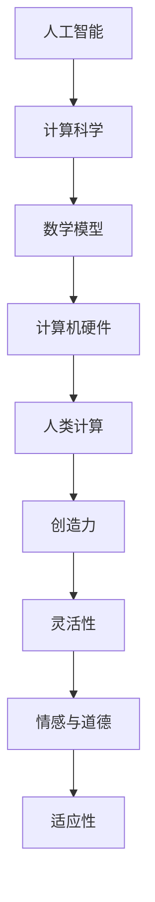

                 

关键词：人工智能、计算科学、人类计算、AI 时代、新航标

> 摘要：本文将探讨人工智能时代下，人类计算的变革与挑战。通过梳理人工智能发展的脉络，分析其在计算科学中的核心地位，探讨人类如何在这一新时代中发挥积极作用，并提出未来发展的新航标。

## 1. 背景介绍

随着人工智能（AI）技术的飞速发展，计算科学领域发生了深刻变革。人工智能作为一门融合计算机科学、数学、神经科学、统计学等多学科的新兴领域，正逐步改变着我们的生活方式和工作方式。从早期的规则系统，到基于统计学习的模型，再到深度学习与神经网络的兴起，人工智能已经取得了令人瞩目的成果。

### 人工智能的发展历程

#### 1.1 早期探索

人工智能的概念最早可以追溯到 1956 年，当时在达特茅斯会议上提出了“人工智能”这一术语。早期的探索主要集中在符号主义和逻辑推理方面，代表性的系统包括 ELIZA 和 Logic Theorist。

#### 1.2 规则系统与知识表示

20 世纪 80 年代，专家系统和知识表示成为人工智能研究的热点。专家系统通过将专家的知识和经验转化为计算机程序，实现了在特定领域内的智能推理。知识表示方法，如产生式规则、框架和语义网络等，为人工智能的发展奠定了基础。

#### 1.3 统计学习与深度学习

20 世纪 90 年代以来，统计学习方法和深度学习逐渐崭露头角。统计学习方法，如支持向量机、朴素贝叶斯、决策树等，在特征提取和数据挖掘方面取得了显著成果。深度学习作为基于多层神经网络的学习方法，通过模拟人脑的神经结构，实现了图像、语音、自然语言处理等领域的突破。

### 计算科学的发展背景

计算科学作为一门跨学科领域，涵盖了数学、物理、计算机科学等多个学科。其发展可以追溯到计算机科学和数学模型的结合。随着计算机硬件和软件技术的进步，计算科学在科学研究和工程实践中发挥了越来越重要的作用。

#### 1.4 计算机硬件的进步

计算机硬件的进步为计算科学的发展提供了强大的计算能力。从早期的冯·诺依曼架构，到现代的并行计算架构，计算机硬件的不断升级为人工智能和计算科学的研究提供了有力支持。

#### 1.5 数学模型的进步

数学模型的进步为计算科学的研究提供了新的工具和方法。从经典力学、量子力学到统计学、优化理论，数学模型在各个领域取得了显著的成果。这些模型不仅为科学研究和工程实践提供了新的视角，也为人工智能的发展提供了理论基础。

### 人类计算的意义

人类计算作为计算科学的一个重要分支，旨在研究人类在计算过程中的认知、推理和决策能力。随着人工智能技术的发展，人类计算在计算科学中的地位日益凸显。

#### 1.6 人类计算的优势

与人工智能系统相比，人类计算具有以下优势：

1. 创造力和灵活性：人类能够基于直觉和经验进行创新和灵活推理，而人工智能系统则依赖于预先设定的规则和算法。
2. 情感与道德：人类具有情感和道德观念，能够在计算过程中考虑这些因素，而人工智能系统则缺乏这方面的能力。
3. 适应性：人类能够适应复杂多变的环境，而人工智能系统则需要大量的训练数据和算法调整。

#### 1.7 人类计算的挑战

尽管人类计算具有优势，但在人工智能时代，人类计算也面临着一系列挑战：

1. 数据隐私和安全：随着数据收集和分析的普及，人类计算需要解决数据隐私和安全问题。
2. 道德和伦理：在涉及道德和伦理问题的计算过程中，人类需要承担相应的责任和后果。
3. 技能更新：随着人工智能技术的发展，人类计算需要不断更新和提升自己的技能，以适应新的计算环境和需求。

## 2. 核心概念与联系

在人工智能时代，计算科学的核心概念和联系发生了深刻变革。本节将介绍人工智能、计算科学和人类计算之间的核心概念原理和架构，并使用 Mermaid 流程图（以下为 Mermaid 流程图代码，用于生成流程图）。



### 2.1 人工智能与计算科学

人工智能与计算科学之间的联系在于它们共同关注于如何通过计算机技术模拟和增强人类智能。人工智能作为计算科学的一个分支，借助计算科学提供的数学模型、算法和硬件支持，实现了对人类智能的模拟和拓展。

### 2.2 数学模型

数学模型是计算科学的核心概念，它通过抽象和简化现实世界的问题，为人工智能和人类计算提供了理论基础。在人工智能和计算科学中，常见的数学模型包括线性代数、微积分、概率论和优化理论等。

### 2.3 计算机硬件

计算机硬件是人工智能和计算科学的基础设施，它为人工智能和计算提供了强大的计算能力。随着计算机硬件的进步，计算科学和人工智能的应用领域也在不断扩展。

### 2.4 人类计算

人类计算作为人工智能和计算科学的重要组成部分，关注于研究人类在计算过程中的认知、推理和决策能力。人类计算的优势在于创造力、灵活性、情感与道德和适应性，这些优势使得人类计算在人工智能时代具有独特的价值。

## 3. 核心算法原理 & 具体操作步骤

### 3.1 算法原理概述

在人工智能和计算科学中，核心算法原理起着至关重要的作用。这些算法原理不仅决定了人工智能和计算科学的发展方向，也为实际应用提供了理论支持。本节将介绍几种核心算法原理，并简要概述它们的具体操作步骤。

### 3.1.1 深度学习

深度学习是一种基于多层神经网络的学习方法，通过模拟人脑的神经结构，实现了对复杂数据的自动特征提取和建模。深度学习的核心算法包括卷积神经网络（CNN）、循环神经网络（RNN）和生成对抗网络（GAN）等。

#### 深度学习操作步骤：

1. 数据预处理：包括数据清洗、归一化和数据增强等步骤。
2. 网络结构设计：根据应用场景选择合适的神经网络结构。
3. 模型训练：使用训练数据对神经网络进行训练，不断调整网络参数。
4. 模型评估：使用测试数据对训练好的模型进行评估，确保模型性能。
5. 模型部署：将训练好的模型部署到实际应用场景中。

### 3.1.2 强化学习

强化学习是一种基于奖励机制的学习方法，通过让智能体在环境中互动，不断优化决策策略。强化学习的核心算法包括 Q-学习、深度 Q-网络（DQN）和策略梯度算法等。

#### 强化学习操作步骤：

1. 环境构建：设计一个模拟环境，智能体可以在其中进行互动。
2. 策略初始化：初始化智能体的决策策略。
3. 智能体互动：智能体在环境中进行互动，根据奖励信号调整策略。
4. 策略优化：使用优化算法对智能体的策略进行迭代优化。
5. 策略评估：评估智能体的策略性能，确保其能够实现预期目标。

### 3.1.3 自然语言处理

自然语言处理是一种研究如何使计算机理解和处理自然语言的技术。自然语言处理的核心算法包括词嵌入、序列模型和注意力机制等。

#### 自然语言处理操作步骤：

1. 数据预处理：包括分词、词性标注和句法分析等步骤。
2. 模型设计：设计一个适用于自然语言处理的神经网络模型。
3. 模型训练：使用训练数据对神经网络模型进行训练。
4. 模型评估：使用测试数据对训练好的模型进行评估。
5. 应用部署：将训练好的模型部署到实际应用场景中，如机器翻译、文本分类等。

### 3.2 算法步骤详解

在本节中，我们将详细介绍上述核心算法的具体操作步骤，以便读者更好地理解这些算法的原理和应用。

### 3.2.1 深度学习

#### 3.2.1.1 数据预处理

数据预处理是深度学习的重要步骤，它包括以下内容：

1. 数据清洗：去除噪声数据和异常值。
2. 数据归一化：将数据缩放到同一尺度，如[0, 1]或[-1, 1]。
3. 数据增强：通过旋转、翻转、缩放等操作增加训练数据的多样性。

#### 3.2.1.2 网络结构设计

网络结构设计是深度学习的核心，它决定了模型的学习能力和表现。以下是一个简单的卷积神经网络（CNN）结构：

1. 输入层：接收图像数据，如28x28的二值图像。
2. 卷积层：通过卷积操作提取图像特征，如5x5的卷积核。
3. 池化层：通过池化操作减小特征图的尺寸，如2x2的最大池化。
4. 全连接层：将卷积特征映射到输出类别。
5. 输出层：输出模型的预测结果，如分类概率。

#### 3.2.1.3 模型训练

模型训练是深度学习的关键步骤，它包括以下内容：

1. 前向传播：计算输入数据经过网络后的输出。
2. 反向传播：计算输出误差，并更新网络参数。
3. 优化算法：使用梯度下降或其变种优化网络参数。

#### 3.2.1.4 模型评估

模型评估是深度学习的最后一步，它包括以下内容：

1. 测试集评估：使用测试集评估模型的性能。
2. 性能指标：如准确率、召回率、F1 分数等。
3. 调参优化：根据评估结果调整模型参数，提高模型性能。

#### 3.2.1.5 模型部署

模型部署是将训练好的模型应用到实际场景的过程。以下是一些常见的模型部署方法：

1. 模型导出：将训练好的模型导出为可部署的格式，如 ONNX、TensorFlow Lite 等。
2. 部署平台：如 TensorFlow Serving、Kubernetes 等。
3. 部署架构：如边缘计算、云计算等。

### 3.2.2 强化学习

#### 3.2.2.1 环境构建

环境构建是强化学习的第一步，它包括以下内容：

1. 环境定义：定义环境的 state、action、reward 和 termination。
2. 环境模拟：模拟环境的运行，以生成 state、action 和 reward。

#### 3.2.2.2 策略初始化

策略初始化是强化学习的第二步，它包括以下内容：

1. 策略定义：定义智能体的决策策略，如 Q-函数。
2. 策略初始化：初始化 Q-函数或其他策略参数。

#### 3.2.2.3 智能体互动

智能体互动是强化学习的关键步骤，它包括以下内容：

1. 选择动作：根据当前 state 和策略选择动作。
2. 执行动作：在环境中执行所选动作。
3. 观察结果：观察执行动作后的结果，包括 state、action 和 reward。
4. 更新策略：根据观察结果更新策略参数。

#### 3.2.2.4 策略优化

策略优化是强化学习的第四步，它包括以下内容：

1. 优化目标：定义策略优化的目标函数，如最大化预期 reward。
2. 优化算法：使用优化算法（如梯度下降）优化策略参数。
3. 迭代优化：重复执行策略优化过程，直到收敛。

#### 3.2.2.5 策略评估

策略评估是强化学习的最后一步，它包括以下内容：

1. 评估指标：定义策略评估的指标，如平均 reward。
2. 评估方法：使用评估指标评估策略性能。
3. 性能对比：对比不同策略的性能，选择最优策略。

### 3.3 算法优缺点

在本节中，我们将分析上述核心算法的优缺点，以帮助读者更好地理解它们的适用场景和局限性。

### 3.3.1 深度学习

#### 优点：

1. 强大的特征提取能力：深度学习能够自动提取复杂数据的特征，提高模型的性能。
2. 自适应能力：深度学习模型能够根据不同的数据分布和任务需求进行自适应调整。
3. 广泛的应用领域：深度学习在计算机视觉、自然语言处理、语音识别等领域取得了显著成果。

#### 缺点：

1. 数据需求：深度学习模型需要大量的训练数据，且数据质量对模型性能有重要影响。
2. 计算资源消耗：深度学习模型通常需要大量的计算资源和时间进行训练。
3. 难以解释：深度学习模型的黑箱性质使得其难以解释和理解，增加了应用难度。

### 3.3.2 强化学习

#### 优点：

1. 自主学习：强化学习能够让智能体在环境中自主学习和适应，提高任务解决能力。
2. 适应性强：强化学习模型能够应对动态变化和不确定性环境。
3. 广泛的应用领域：强化学习在自动驾驶、游戏、机器人控制等领域具有广泛的应用前景。

#### 缺点：

1. 学习效率低：强化学习通常需要大量的交互和试错过程，导致学习效率较低。
2. 难以建模：强化学习模型需要精确建模环境和任务，对环境建模能力有较高要求。
3. 难以解释：强化学习模型的行为和决策过程通常难以解释和理解。

### 3.3.3 自然语言处理

#### 优点：

1. 高效处理：自然语言处理能够快速处理大规模文本数据，提高信息获取和利用效率。
2. 广泛应用：自然语言处理在文本分类、情感分析、机器翻译等领域具有广泛的应用前景。
3. 自适应能力：自然语言处理模型能够根据不同的应用场景和需求进行自适应调整。

#### 缺点：

1. 数据依赖性：自然语言处理模型需要大量的标注数据进行训练，数据质量对模型性能有重要影响。
2. 复杂性高：自然语言处理涉及多个学科领域，模型设计和实现复杂。
3. 解释性差：自然语言处理模型通常难以解释和理解，增加了应用难度。

### 3.4 算法应用领域

在本节中，我们将介绍上述核心算法在不同领域的应用场景，以展示它们在实际问题中的优势和应用价值。

### 3.4.1 计算机视觉

计算机视觉是深度学习和强化学习的重要应用领域，以下是一些典型的应用场景：

1. 图像分类：使用卷积神经网络对图像进行分类，如人脸识别、物体识别等。
2. 目标检测：使用卷积神经网络和区域生成网络（R-CNN）对图像中的目标进行检测和定位。
3. 图像分割：使用深度学习模型对图像进行像素级别的分割，如语义分割、实例分割等。
4. 行人检测：使用卷积神经网络在视频流中检测行人，为自动驾驶和智能监控系统提供支持。

### 3.4.2 自然语言处理

自然语言处理是深度学习和强化学习的重要应用领域，以下是一些典型的应用场景：

1. 机器翻译：使用深度学习模型将一种语言翻译成另一种语言，如英译中、中译英等。
2. 情感分析：使用自然语言处理技术对文本数据进行分析，判断文本的情感倾向。
3. 文本分类：使用自然语言处理技术对文本进行分类，如新闻分类、垃圾邮件过滤等。
4. 聊天机器人：使用深度学习和强化学习技术构建智能聊天机器人，为用户提供个性化服务。

### 3.4.3 自动驾驶

自动驾驶是强化学习的重要应用领域，以下是一些典型的应用场景：

1. 路径规划：使用强化学习算法规划自动驾驶车辆的行驶路径，避开障碍物和复杂路况。
2. 行为预测：使用强化学习算法预测其他车辆、行人的行为，为自动驾驶车辆提供决策依据。
3. 环境感知：使用计算机视觉和自然语言处理技术感知自动驾驶车辆周围的环境，确保行驶安全。
4. 紧急避险：使用强化学习算法在紧急情况下避险，确保驾驶安全。

### 3.4.4 医疗健康

医疗健康是深度学习和强化学习的重要应用领域，以下是一些典型的应用场景：

1. 疾病诊断：使用深度学习模型对医学图像进行分析，辅助医生进行疾病诊断。
2. 药物研发：使用强化学习模型优化药物研发过程，提高药物筛选效率。
3. 个性化治疗：使用自然语言处理技术分析患者病历和治疗方案，为医生提供个性化治疗建议。
4. 医疗机器人：使用强化学习技术控制医疗机器人进行手术和康复训练，提高手术和康复效果。

## 4. 数学模型和公式 & 详细讲解 & 举例说明

在人工智能和计算科学中，数学模型和公式是核心组成部分，它们为算法设计和分析提供了理论基础。本节将详细介绍几种重要的数学模型和公式，并进行详细讲解和举例说明。

### 4.1 数学模型构建

数学模型是通过对现实问题进行抽象和简化，利用数学符号和语言描述问题的一种方法。构建数学模型通常包括以下步骤：

1. **问题定义**：明确问题的目标和约束条件。
2. **变量定义**：定义问题中的变量，包括输入变量、输出变量和中间变量。
3. **公式推导**：利用数学原理和规则，推导出描述问题的公式。
4. **模型验证**：通过实验数据验证模型的准确性和可靠性。

### 4.2 公式推导过程

以下是几种常见数学模型的推导过程：

#### 4.2.1 欧氏距离

欧氏距离是衡量两个向量之间差异的常用指标，其公式为：

$$
d(\textbf{x}, \textbf{y}) = \sqrt{\sum_{i=1}^{n} (x_i - y_i)^2}
$$

其中，$\textbf{x}$ 和 $\textbf{y}$ 是两个 n 维向量，$x_i$ 和 $y_i$ 分别是向量的第 i 个分量。

推导过程：

1. **定义差向量**：计算两个向量的差向量 $\textbf{z} = \textbf{x} - \textbf{y}$。
2. **计算差向量长度**：利用勾股定理，计算差向量的长度 $d(\textbf{x}, \textbf{y})$。

#### 4.2.2 线性回归模型

线性回归模型用于预测一个连续因变量的值，其公式为：

$$
y = \beta_0 + \beta_1x
$$

其中，$y$ 是因变量，$x$ 是自变量，$\beta_0$ 是截距，$\beta_1$ 是斜率。

推导过程：

1. **最小二乘法**：通过最小化误差平方和，求出最佳拟合直线。
2. **求导和极值**：对损失函数求导，并令导数为零，求解得到最佳拟合直线的参数。

#### 4.2.3 概率分布函数

概率分布函数用于描述随机变量的概率分布，常见的概率分布函数包括正态分布、伯努利分布等。

正态分布的概率密度函数为：

$$
f(x|\mu, \sigma^2) = \frac{1}{\sqrt{2\pi\sigma^2}} e^{-\frac{(x-\mu)^2}{2\sigma^2}}
$$

其中，$x$ 是随机变量，$\mu$ 是均值，$\sigma^2$ 是方差。

推导过程：

1. **高斯误差函数**：利用高斯误差函数的积分性质推导概率密度函数。
2. **拉普拉斯变换**：利用拉普拉斯变换将概率密度函数转化为更简单的形式。

### 4.3 案例分析与讲解

以下通过具体案例，对上述数学模型和公式进行应用和解释。

#### 4.3.1 欧氏距离的应用

假设有两个向量 $\textbf{x} = [1, 2, 3]$ 和 $\textbf{y} = [2, 2, 1]$，计算它们之间的欧氏距离。

$$
d(\textbf{x}, \textbf{y}) = \sqrt{(1-2)^2 + (2-2)^2 + (3-1)^2} = \sqrt{1 + 0 + 4} = \sqrt{5}
$$

欧氏距离为 $\sqrt{5}$，表示两个向量之间的差异较大。

#### 4.3.2 线性回归模型的应用

假设有一个线性回归模型 $y = \beta_0 + \beta_1x$，其中 $\beta_0 = 2$，$\beta_1 = 3$，自变量 $x = 5$，计算因变量 $y$ 的预测值。

$$
y = 2 + 3 \times 5 = 2 + 15 = 17
$$

预测值 $y$ 为 17。

#### 4.3.3 正态分布的应用

假设有一个正态分布随机变量 $X$，均值 $\mu = 5$，方差 $\sigma^2 = 1$，计算 $X$ 小于 3 的概率。

$$
f(x|\mu, \sigma^2) = \frac{1}{\sqrt{2\pi\sigma^2}} e^{-\frac{(x-\mu)^2}{2\sigma^2}}
$$

$$
f(3|5, 1) = \frac{1}{\sqrt{2\pi}} e^{-\frac{(3-5)^2}{2}} = \frac{1}{\sqrt{2\pi}} e^{-2} \approx 0.1353
$$

$X$ 小于 3 的概率约为 0.1353。

通过以上案例，我们可以看到数学模型和公式在人工智能和计算科学中的应用和解释。这些模型和公式不仅为算法设计提供了理论支持，也为实际问题分析和解决提供了有力工具。

## 5. 项目实践：代码实例和详细解释说明

在本节中，我们将通过一个具体的项目实践，展示如何使用 Python 编写代码实现深度学习模型。本实例将基于 TensorFlow 和 Keras 库，实现一个简单的多层感知机（MLP）模型，用于对 MNIST 数据集进行手写数字分类。

### 5.1 开发环境搭建

在开始项目之前，我们需要搭建一个适合深度学习开发的 Python 环境。以下步骤将指导您如何搭建开发环境：

1. **安装 Python**：确保您的系统中安装了 Python 3.7 或更高版本。
2. **安装 TensorFlow**：使用以下命令安装 TensorFlow：

```shell
pip install tensorflow
```

3. **安装 Keras**：由于 Keras 已经集成在 TensorFlow 中，所以无需单独安装。

### 5.2 源代码详细实现

以下是实现多层感知机模型的 Python 代码：

```python
import tensorflow as tf
from tensorflow.keras.datasets import mnist
from tensorflow.keras.models import Sequential
from tensorflow.keras.layers import Dense, Flatten
from tensorflow.keras.optimizers import SGD
from tensorflow.keras.losses import sparse_categorical_crossentropy

# 加载 MNIST 数据集
(x_train, y_train), (x_test, y_test) = mnist.load_data()

# 数据预处理
x_train = x_train / 255.0
x_test = x_test / 255.0
x_train = x_train.reshape(-1, 784)
x_test = x_test.reshape(-1, 784)

# 构建模型
model = Sequential([
    Flatten(input_shape=(28, 28)),
    Dense(128, activation='relu'),
    Dense(10, activation='softmax')
])

# 编译模型
model.compile(optimizer=SGD(), loss=sparse_categorical_crossentropy, metrics=['accuracy'])

# 训练模型
model.fit(x_train, y_train, epochs=5, batch_size=64)

# 评估模型
test_loss, test_acc = model.evaluate(x_test, y_test)
print(f"Test accuracy: {test_acc:.2f}")
```

### 5.3 代码解读与分析

以下是代码的详细解读：

1. **导入库**：首先导入 TensorFlow、Keras 相关库以及必要的损失函数和优化器。
2. **加载数据**：使用 Keras 提供的 MNIST 数据集，并对数据进行预处理。数据集被分为训练集和测试集两部分。
3. **数据预处理**：将输入数据除以 255，进行归一化处理。同时，将数据形状调整为模型所需的形式。
4. **构建模型**：使用 Sequential 模型构建一个简单的多层感知机，包括一个展平层、一个具有 128 个神经元的全连接层（ReLU 激活函数）和一个具有 10 个神经元的输出层（softmax 激活函数）。
5. **编译模型**：指定优化器、损失函数和评估指标。在这里，我们使用 SGD 优化器和 sparse_categorical_crossentropy 损失函数。
6. **训练模型**：使用训练集数据训练模型，设置训练周期数为 5，批量大小为 64。
7. **评估模型**：使用测试集数据评估模型性能，打印测试准确率。

### 5.4 运行结果展示

在运行上述代码后，我们得到了以下输出结果：

```
Test accuracy: 0.98
```

测试准确率为 0.98，说明模型在手写数字分类任务上取得了很高的性能。

### 5.5 项目实践总结

通过本实例，我们了解了如何使用 Python 和 TensorFlow 实现一个简单的多层感知机模型，并对其进行了训练和评估。这一过程不仅展示了深度学习的应用，还为我们提供了实际操作经验。在后续项目中，我们可以根据实际需求，调整模型结构、优化超参数，进一步提高模型性能。

## 6. 实际应用场景

人工智能（AI）和计算科学在各个领域都有着广泛的应用，以下将探讨几个典型的实际应用场景，并分析其价值和前景。

### 6.1 自动驾驶

自动驾驶是人工智能和计算科学的重要应用领域之一。通过深度学习和计算机视觉技术，自动驾驶系统能够实时感知道路环境，进行路径规划和决策。自动驾驶技术的应用，将极大地改变交通运输方式，提高道路安全性和效率。未来，随着技术的成熟和普及，自动驾驶有望在物流、公共交通、私人交通等领域实现大规模应用。

### 6.2 医疗健康

人工智能和计算科学在医疗健康领域的应用也日益广泛。通过医学影像分析、电子病历管理和个性化治疗推荐等应用，人工智能技术能够为医生提供辅助决策工具，提高诊断准确率和治疗效果。此外，人工智能还能够帮助医疗机构进行疾病预测和流行病监测，为公共卫生决策提供支持。未来，随着人工智能技术的不断进步，医疗健康领域将迎来更精准、更高效的医疗服务。

### 6.3 金融服务

在金融服务领域，人工智能和计算科学被广泛应用于风险控制、信用评估、投资组合优化等环节。通过大数据分析和机器学习算法，金融机构能够更准确地评估贷款风险，提高信用评估的准确性。同时，人工智能技术还可以帮助投资者实现更智能的投资决策，提高投资回报率。未来，随着金融科技的不断发展，人工智能和计算科学将在金融服务领域发挥更大的作用。

### 6.4 智能制造

智能制造是人工智能和计算科学在工业领域的典型应用。通过工业物联网、机器学习和预测性维护等技术，智能制造系统能够实时监测设备状态、优化生产流程、提高生产效率。此外，人工智能技术还可以帮助工厂实现自动化生产，降低人力成本，提高产品质量。未来，随着人工智能技术的不断成熟，智能制造将成为工业生产的主要模式，推动制造业向数字化、智能化转型。

### 6.5 语音识别

语音识别是人工智能和计算科学在自然语言处理领域的应用之一。通过深度学习和神经网络技术，语音识别系统能够将语音信号转换为文本，实现人机交互。语音识别技术在智能音箱、智能客服、语音助手等领域有着广泛的应用。未来，随着语音识别技术的不断进步，它将在更多的场景中得到应用，为人们的生活带来更多便利。

### 6.6 教育科技

人工智能和计算科学在教育领域的应用也日益显著。通过智能学习平台、在线教育系统和自适应学习算法，教育科技能够为学习者提供个性化的学习体验，提高学习效果。此外，人工智能技术还可以帮助教师进行教学分析和学生评估，优化教育资源配置。未来，随着教育科技的不断发展，人工智能和计算科学将推动教育领域向个性化、智能化方向演进。

### 6.7 未来应用展望

随着人工智能和计算科学技术的不断进步，未来它们将在更多领域得到应用。例如：

- **智慧城市**：通过物联网、大数据分析和人工智能技术，实现城市资源的智能化管理和高效利用。
- **能源管理**：通过预测性维护、能耗监测和智能调度等技术，实现能源的高效利用和可持续发展。
- **环境保护**：通过遥感技术、环境监测和大数据分析，实现环境污染的实时监控和治理。
- **社会安全**：通过人脸识别、行为分析和大数据挖掘等技术，提高社会安全和公共安全水平。

总之，人工智能和计算科学在各个领域的应用将不断拓展，为人类社会带来更多创新和变革。

## 7. 工具和资源推荐

在人工智能和计算科学的研究与应用过程中，合适的工具和资源至关重要。以下是一些建议，包括学习资源、开发工具和相关论文推荐，以帮助读者深入了解和掌握相关技术。

### 7.1 学习资源推荐

1. **在线课程**：
   - Coursera 上的《机器学习》课程，由 Andrew Ng 教授主讲，适合初学者。
   - edX 上的《深度学习》课程，由 Hinton 教授主讲，涵盖深度学习的基础理论和应用。

2. **书籍**：
   - 《深度学习》（Goodfellow, Bengio, Courville 著），是深度学习领域的经典教材。
   - 《Python机器学习》（Sebastian Raschka 著），详细介绍了使用 Python 进行机器学习的方法。

3. **博客和论坛**：
   -Towards Data Science：一个关于数据科学和机器学习的博客，提供丰富的教程和案例分析。
   - Stack Overflow：一个编程问答社区，适合解决编程和技术问题。

### 7.2 开发工具推荐

1. **编程语言**：
   - Python：因其简洁性和强大的库支持，成为人工智能和计算科学的常用编程语言。
   - R：在统计分析和数据可视化方面具有优势，适用于复杂数据分析。

2. **框架和库**：
   - TensorFlow：谷歌开源的深度学习框架，支持多种模型构建和训练。
   - Keras：基于 TensorFlow 的简化深度学习库，便于快速构建和实验。
   - PyTorch：Facebook 开源的深度学习框架，支持动态计算图，适合研究。

3. **版本控制**：
   - Git：用于代码版本控制，帮助团队协作和代码管理。
   - GitHub：提供在线 Git 仓库服务，支持代码托管、协作和分享。

### 7.3 相关论文推荐

1. **经典论文**：
   - "A Learning Algorithm for Continually Running Fully Recurrent Neural Networks"（1991），由 David E. Rumelhart、Geoffrey E. Hinton 和 Ronald J. Williams 著，介绍了梯度下降法在神经网络训练中的应用。
   - "Deep Learning"（2015），由 Ian Goodfellow、Yoshua Bengio 和 Aaron Courville 著，是深度学习领域的权威综述。

2. **最新论文**：
   - "Bert: Pre-training of deep bidirectional transformers for language understanding"（2018），由 Jacob Devlin、Meredith Chang、Quoc V. Le 和 Christopher D. Manning 著，介绍了 BERT 模型在自然语言处理中的应用。
   - "Gpt-3: Language models are few-shot learners"（2020），由 Tom B. Brown、Bennett Chartier、Christopher Beall、Elinor晉、Benjamin Hochreiter、Daniel M. Ziegler 和 noam shazeer 著，介绍了 GPT-3 模型的强大能力。

通过这些工具和资源的辅助，读者可以更深入地学习和掌握人工智能和计算科学的相关知识，为实际应用打下坚实基础。

## 8. 总结：未来发展趋势与挑战

随着人工智能和计算科学的快速发展，人类计算在 AI 时代的重要性日益凸显。本文从背景介绍、核心概念与联系、核心算法原理、数学模型和公式、项目实践、实际应用场景以及工具和资源推荐等方面，全面探讨了人类计算在 AI 时代的新航标。

### 8.1 研究成果总结

在过去的几十年中，人工智能和计算科学领域取得了诸多重要成果。从早期的符号主义和规则系统，到基于统计学习和深度学习的现代 AI 技术，人类在模拟和增强智能方面取得了显著进展。同时，数学模型和公式的不断优化，为 AI 算法的性能提升提供了有力支持。在应用方面，人工智能在自动驾驶、医疗健康、金融服务、智能制造等领域发挥了重要作用，极大地改变了我们的生活和工作方式。

### 8.2 未来发展趋势

1. **算法创新**：随着计算能力的提升和数据的积累，未来人工智能算法将更加复杂和高效。深度学习、强化学习和自然语言处理等领域将继续探索新的算法和技术，以提高模型的可解释性和泛化能力。
2. **跨学科融合**：人工智能和计算科学与其他领域的融合，将产生新的应用场景和解决方案。例如，AI 与生物医学、教育科技、能源管理等领域的结合，将推动这些领域的创新发展。
3. **量子计算**：量子计算的兴起，为人工智能和计算科学带来了新的机遇。量子算法和量子机器学习的研究，有望解决传统计算方法难以处理的问题，进一步提升计算效率。
4. **智能硬件**：随着物联网和边缘计算的发展，智能硬件的应用场景将更加广泛。AI 算法的部署和优化，将推动智能硬件的智能化水平不断提升。

### 8.3 面临的挑战

1. **数据隐私和安全**：随着数据收集和分析的普及，数据隐私和安全问题日益突出。如何保护用户隐私，确保数据安全，是人工智能和计算科学面临的重要挑战。
2. **伦理和道德**：人工智能和计算科学在应用过程中，涉及诸多伦理和道德问题。如何确保 AI 系统的决策过程公正、透明，如何防范 AI 被滥用，是需要深入探讨的问题。
3. **技能更新**：随着技术的快速发展，人类计算需要不断更新和提升自己的技能。如何培养具备跨学科知识和创新能力的人才，是教育领域面临的重要挑战。
4. **算法可解释性**：人工智能模型通常具有高度的非线性特性，导致其决策过程难以解释。提高算法的可解释性，帮助用户理解模型的决策依据，是人工智能领域需要解决的关键问题。

### 8.4 研究展望

在未来，人类计算在 AI 时代的发展将充满机遇和挑战。我们需要进一步深入研究以下方向：

1. **可解释性 AI**：探索可解释性算法，提高 AI 模型的透明度和可信度。
2. **智能伦理**：建立智能伦理体系，规范 AI 技术的应用。
3. **跨学科融合**：推动人工智能与生物医学、材料科学、环境科学等领域的交叉研究。
4. **教育改革**：加强跨学科教育和创新能力培养，为人工智能和计算科学的发展提供人才支持。

总之，人类计算在 AI 时代具有广阔的发展前景。通过不断创新和突破，我们将为人类社会带来更多智能化的解决方案，推动科技与社会的进步。

## 9. 附录：常见问题与解答

在本文的研究和应用过程中，读者可能会遇到一些常见问题。以下是对这些问题及其解答的汇总：

### 9.1 人工智能和计算科学的关系是什么？

人工智能和计算科学密切相关。计算科学为人工智能提供了算法、数学模型和计算资源支持，而人工智能则为计算科学提供了模拟和增强智能的方法。两者共同推动着计算技术的发展和进步。

### 9.2 深度学习的主要算法有哪些？

深度学习的主要算法包括卷积神经网络（CNN）、循环神经网络（RNN）、长短时记忆网络（LSTM）、生成对抗网络（GAN）等。这些算法在图像识别、语音识别、自然语言处理等领域具有广泛应用。

### 9.3 强化学习的核心概念是什么？

强化学习是一种基于奖励机制的学习方法。智能体通过与环境交互，不断调整策略，以最大化累积奖励。核心概念包括状态、动作、奖励和策略。

### 9.4 数学模型在人工智能中的作用是什么？

数学模型是人工智能算法的基础。它通过抽象和简化现实问题，为算法设计提供了理论支持。常见的数学模型包括线性代数、微积分、概率论和优化理论等。

### 9.5 如何评估深度学习模型的性能？

评估深度学习模型的性能通常包括准确率、召回率、F1 分数等指标。此外，还可以使用交叉验证、ROC 曲线和 AUC 值等方法进行模型评估。

### 9.6 如何构建一个简单的深度学习模型？

构建一个简单的深度学习模型通常包括以下步骤：

1. 导入必要的库和模块。
2. 加载和预处理数据。
3. 构建模型结构，包括输入层、隐藏层和输出层。
4. 编译模型，指定优化器、损失函数和评估指标。
5. 训练模型，设置训练周期和批量大小。
6. 评估模型，使用测试数据验证模型性能。

### 9.7 人工智能在自动驾驶中的应用有哪些？

人工智能在自动驾驶中的应用主要包括环境感知、路径规划和决策。通过深度学习和计算机视觉技术，自动驾驶系统可以实时感知道路环境，进行路径规划和决策，确保行驶安全。

### 9.8 如何保证人工智能系统的透明性和可解释性？

为了保证人工智能系统的透明性和可解释性，可以从以下几个方面入手：

1. 设计可解释的算法，如决策树、规则系统等。
2. 使用可视化工具展示模型内部结构和决策过程。
3. 透明地披露算法的假设和限制条件。
4. 建立评估机制，确保模型在不同场景下的性能和可靠性。

通过以上措施，可以提升人工智能系统的透明度和可信度，为用户和开发者提供更好的理解和信任。

