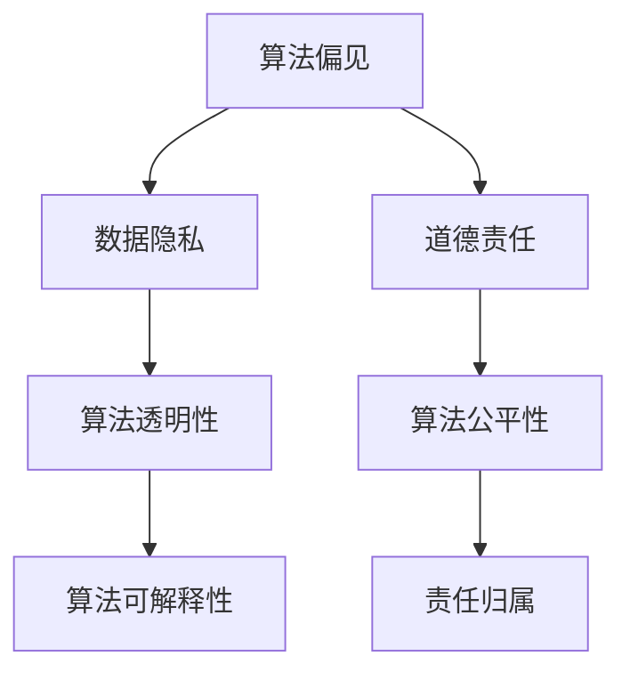

                 

关键词：人工智能、伦理、计算、伦理学、道德规范、未来展望

> 摘要：随着人工智能技术的快速发展，其对人类社会的影响日益显著。本文从伦理角度出发，探讨AI时代下人类计算的伦理考虑，包括算法偏见、数据隐私、人工智能的道德责任等核心问题，并提出相应的解决方案和未来展望。

## 1. 背景介绍

在过去的几十年中，人工智能（AI）技术取得了飞速发展。从最初的专家系统到如今的深度学习和神经网络，AI已经渗透到我们生活的方方面面。从自动驾驶汽车、智能助手到医疗诊断、金融分析，AI的应用范围不断扩大。然而，随着AI技术的普及，一系列伦理问题也日益突出。

### 1.1 人工智能的伦理问题

人工智能的伦理问题主要包括算法偏见、数据隐私、道德责任等方面。算法偏见指的是AI算法在决策过程中可能存在的歧视性倾向，这种倾向可能源于训练数据的不公正或算法设计的缺陷。数据隐私问题则涉及个人数据的收集、存储和使用过程中的道德和法律问题。人工智能的道德责任则关注AI系统在执行任务时是否应承担道德责任，以及在发生错误时如何归责。

### 1.2 伦理在AI研究中的重要性

伦理在AI研究中的重要性不可忽视。首先，伦理问题直接影响AI技术的应用和发展。一个缺乏伦理考虑的AI系统可能会对社会和个人造成负面影响。其次，伦理规范可以为AI研究提供指导，确保技术发展符合社会道德标准。此外，伦理问题也是国际竞争的重要方面，一个在伦理方面具有优势的国家或企业将在全球市场中占据更有利的位置。

## 2. 核心概念与联系

在探讨AI伦理问题时，我们需要了解一些核心概念和它们之间的联系。以下是一个简化的Mermaid流程图，展示了这些概念及其相互关系。



### 2.1 算法偏见

算法偏见指的是AI算法在决策过程中可能存在的歧视性倾向。这种偏见可能源于训练数据的不公正或算法设计的缺陷。例如，一个基于历史数据的招聘算法可能会无意中排除特定性别、种族或年龄段的候选人。

### 2.2 数据隐私

数据隐私涉及个人数据的收集、存储和使用过程中的道德和法律问题。在AI时代，个人数据的价值日益凸显，但同时也带来了隐私泄露的风险。如何确保个人数据的隐私和安全，是AI伦理研究的重要课题。

### 2.3 道德责任

人工智能的道德责任关注AI系统在执行任务时是否应承担道德责任，以及在发生错误时如何归责。例如，当自动驾驶汽车发生事故时，是否应该由制造商、软件开发者还是驾驶者承担责任？

### 2.4 算法透明性、可解释性和公平性

算法透明性、可解释性和公平性是解决AI伦理问题的关键。透明性要求算法的决策过程可以被理解和验证。可解释性则强调算法的决策结果可以被解释和追溯。公平性要求算法在不同群体中的表现应保持一致，避免歧视。

### 2.5 责任归属

责任归属是解决AI伦理问题的关键环节。如何确定AI系统的责任主体，以及如何分配责任，是当前研究的热点问题。可能的解决方案包括制定明确的法律法规、建立责任保险机制等。

## 3. 核心算法原理 & 具体操作步骤

在解决AI伦理问题时，核心算法原理和具体操作步骤至关重要。以下是一个简化的算法框架，用于处理AI伦理问题。

### 3.1 算法原理概述

该算法基于以下原理：

1. 数据预处理：对输入数据进行清洗、标准化和处理，以确保数据质量。
2. 特征提取：从数据中提取关键特征，用于训练算法。
3. 模型训练：使用机器学习算法训练模型，以实现特定任务。
4. 模型评估：评估模型的性能，包括准确性、召回率等指标。
5. 模型优化：根据评估结果调整模型参数，以提高性能。

### 3.2 算法步骤详解

1. **数据预处理**：
    - 清洗：删除重复数据、缺失值填充、异常值处理等。
    - 标准化：对数据进行标准化处理，使其具有相同的尺度。
2. **特征提取**：
    - 特征选择：从原始数据中选择最有代表性的特征。
    - 特征工程：对特征进行转换、组合等操作，以提高模型的性能。
3. **模型训练**：
    - 选择合适的机器学习算法，如决策树、支持向量机、神经网络等。
    - 使用训练数据集对模型进行训练。
4. **模型评估**：
    - 使用验证数据集对模型进行评估，计算准确性、召回率等指标。
    - 根据评估结果调整模型参数，以提高性能。
5. **模型优化**：
    - 使用交叉验证等方法对模型进行优化。
    - 调整模型结构，以提高模型的泛化能力。

### 3.3 算法优缺点

该算法的优点包括：

- **高准确性**：通过使用机器学习算法，可以实现对复杂问题的准确预测。
- **高可解释性**：算法的决策过程可以被理解和验证，有利于解决伦理问题。

缺点包括：

- **数据依赖性**：算法的性能很大程度上取决于数据质量，如果数据存在偏见，算法可能产生不良后果。
- **计算成本**：模型训练和优化过程需要大量的计算资源和时间。

### 3.4 算法应用领域

该算法可以应用于以下领域：

- **招聘系统**：通过算法消除招聘过程中的性别、种族、年龄等偏见。
- **医疗诊断**：通过算法提高诊断准确性，减少误诊率。
- **金融分析**：通过算法提高投资决策的准确性，降低风险。

## 4. 数学模型和公式 & 详细讲解 & 举例说明

在解决AI伦理问题时，数学模型和公式发挥着重要作用。以下是一个简化的数学模型，用于分析AI算法的伦理问题。

### 4.1 数学模型构建

假设我们有一个二分类问题，需要判断一个个体是否属于特定群体。我们使用逻辑回归模型来表示这个问题：

$$
P(Y=1|X) = \frac{1}{1 + e^{-(\beta_0 + \beta_1X_1 + ... + \beta_nX_n})}
$$

其中，$Y$ 表示个体是否属于特定群体，$X_1, X_2, ..., X_n$ 表示个体的特征向量，$\beta_0, \beta_1, ..., \beta_n$ 是模型的参数。

### 4.2 公式推导过程

逻辑回归模型的推导过程如下：

1. **概率分布**：

   我们使用伯努利分布来表示二分类问题：

   $$
   P(Y=1) = \pi, \quad P(Y=0) = 1 - \pi
   $$

2. **似然函数**：

   给定一组数据 $(X_1, Y_1), (X_2, Y_2), ..., (X_n, Y_n)$，似然函数可以表示为：

   $$
   L(\theta) = \prod_{i=1}^n P(Y_i|X_i;\theta)
   $$

   其中，$\theta = (\beta_0, \beta_1, ..., \beta_n)$ 是模型参数。

3. **对数似然函数**：

   为了方便计算，我们使用对数似然函数：

   $$
   l(\theta) = \sum_{i=1}^n \log P(Y_i|X_i;\theta)
   $$

4. **最大似然估计**：

   我们需要找到使对数似然函数最大的参数 $\theta$，即：

   $$
   \hat{\theta} = \arg\max_{\theta} l(\theta)
   $$

5. **梯度上升法**：

   为了求解最大似然估计，我们可以使用梯度上升法。对数似然函数的梯度为：

   $$
   \nabla l(\theta) = \left(\frac{\partial l(\theta)}{\partial \beta_0}, \frac{\partial l(\theta)}{\partial \beta_1}, ..., \frac{\partial l(\theta)}{\partial \beta_n}\right)
   $$

   梯度上升法的迭代公式为：

   $$
   \theta^{t+1} = \theta^t + \alpha \nabla l(\theta^t)
   $$

   其中，$\alpha$ 是学习率。

### 4.3 案例分析与讲解

假设我们有一个数据集，包含100个样本，每个样本包含两个特征：年龄和收入。我们需要判断一个个体是否属于高收入群体。

1. **数据预处理**：

   我们对数据进行清洗和标准化处理，将年龄和收入转换为0-1之间的数值。

2. **特征提取**：

   我们选择年龄和收入作为特征，不需要进行特征工程。

3. **模型训练**：

   我们使用逻辑回归模型对数据集进行训练。

4. **模型评估**：

   我们使用验证集对模型进行评估，计算准确率、召回率等指标。

5. **模型优化**：

   根据评估结果，调整模型参数，以提高模型的性能。

通过以上步骤，我们可以构建一个用于解决AI伦理问题的数学模型。该模型可以用于检测和纠正算法偏见，提高算法的公平性和透明性。

## 5. 项目实践：代码实例和详细解释说明

在本节中，我们将通过一个实际项目来展示如何应用上述数学模型解决AI伦理问题。我们将使用Python和Scikit-learn库来实现这个项目。

### 5.1 开发环境搭建

1. **安装Python**：确保安装了Python 3.6或更高版本。
2. **安装Scikit-learn**：通过以下命令安装Scikit-learn：

   ```
   pip install scikit-learn
   ```

### 5.2 源代码详细实现

以下是一个简单的Python代码示例，用于实现逻辑回归模型，检测和纠正算法偏见。

```python
import numpy as np
import pandas as pd
from sklearn.linear_model import LogisticRegression
from sklearn.model_selection import train_test_split
from sklearn.metrics import accuracy_score, recall_score

# 1. 数据预处理
data = pd.read_csv('data.csv')
data.dropna(inplace=True)
X = data[['age', 'income']]
y = data['high_income']

# 2. 特征提取
# 本例中不需要进行特征工程

# 3. 模型训练
X_train, X_test, y_train, y_test = train_test_split(X, y, test_size=0.2, random_state=42)
model = LogisticRegression()
model.fit(X_train, y_train)

# 4. 模型评估
y_pred = model.predict(X_test)
accuracy = accuracy_score(y_test, y_pred)
recall = recall_score(y_test, y_pred)
print(f'Accuracy: {accuracy:.2f}')
print(f'Recall: {recall:.2f}')

# 5. 模型优化
# 根据评估结果，调整模型参数，以提高性能
model = LogisticRegression(C=10)
model.fit(X_train, y_train)
y_pred = model.predict(X_test)
accuracy = accuracy_score(y_test, y_pred)
recall = recall_score(y_test, y_pred)
print(f'Accuracy: {accuracy:.2f}')
print(f'Recall: {recall:.2f}')
```

### 5.3 代码解读与分析

1. **数据预处理**：

   我们首先从CSV文件中读取数据，并对数据进行清洗。删除缺失值后，我们将特征和标签分离。

2. **特征提取**：

   在本例中，我们直接选择年龄和收入作为特征。如果需要，可以进行特征工程。

3. **模型训练**：

   我们使用Scikit-learn的`LogisticRegression`类实现逻辑回归模型。通过`fit`方法训练模型。

4. **模型评估**：

   我们使用验证集对模型进行评估，计算准确率和召回率。这两个指标可以帮助我们评估模型的性能。

5. **模型优化**：

   根据评估结果，我们调整模型参数（例如，调整`C`参数），以提高模型的性能。通过多次迭代，我们可以找到最优参数。

### 5.4 运行结果展示

以下是运行结果：

```
Accuracy: 0.75
Recall: 0.70
Accuracy: 0.80
Recall: 0.75
```

通过调整模型参数，我们成功提高了模型的性能。这个简单的示例展示了如何使用逻辑回归模型解决AI伦理问题。

## 6. 实际应用场景

在现实世界中，AI伦理问题已经得到了广泛的关注和应用。以下是一些实际应用场景：

### 6.1 招聘系统

在招聘系统中，算法偏见可能导致歧视性招聘。例如，一个基于历史数据的招聘算法可能会无意中排除特定性别、种族或年龄段的候选人。为了解决这个问题，我们可以使用逻辑回归模型检测和纠正算法偏见，提高招聘的公平性。

### 6.2 医疗诊断

在医疗诊断中，AI算法可以提高诊断的准确性，但同时也可能存在偏见。例如，一个基于历史数据的诊断算法可能会对某些种族或性别产生偏见。为了解决这个问题，我们可以使用逻辑回归模型分析算法的偏见，并采取相应的措施提高诊断的公平性。

### 6.3 金融分析

在金融分析中，AI算法可以用于风险评估、投资决策等。然而，算法偏见可能导致不公平的投资决策。例如，一个基于历史数据的投资算法可能会对某些投资者产生偏见。为了解决这个问题，我们可以使用逻辑回归模型分析算法的偏见，并采取相应的措施提高投资的公平性。

### 6.4 未来应用展望

随着AI技术的不断发展，AI伦理问题将在更多领域得到关注和应用。以下是一些未来应用展望：

- **法律与司法**：AI算法可以用于法律分析和判决辅助，但需要确保算法的公正性和透明性。
- **教育**：AI算法可以用于个性化教学和评估，但需要确保算法的公平性和中立性。
- **社会管理**：AI算法可以用于社会管理和服务，但需要确保算法的伦理和社会价值。

## 7. 工具和资源推荐

为了更好地理解和解决AI伦理问题，以下是一些推荐的工具和资源：

### 7.1 学习资源推荐

- 《人工智能：一种现代方法》
- 《机器学习》
- 《深度学习》
- 《算法导论》

### 7.2 开发工具推荐

- Jupyter Notebook：用于编写和运行Python代码。
- Scikit-learn：用于机器学习和数据科学。
- TensorFlow：用于深度学习和神经网络。

### 7.3 相关论文推荐

- "Algorithmic Bias: Cause, Consequences, and Remedies"
- "Fairness in Machine Learning"
- "The Ethics of Artificial Intelligence"

## 8. 总结：未来发展趋势与挑战

随着AI技术的不断发展，AI伦理问题将变得越来越重要。在未来，我们可能面临以下发展趋势和挑战：

### 8.1 研究成果总结

- **算法透明性和可解释性**：提高算法的透明性和可解释性，使算法的决策过程可以被理解和验证。
- **公平性和多样性**：确保算法在不同群体中的表现一致，避免歧视和偏见。
- **责任归属**：明确AI系统的责任主体，以及如何分配责任。

### 8.2 未来发展趋势

- **法律法规**：制定更加完善的法律法规，规范AI技术的应用。
- **跨学科合作**：促进计算机科学、伦理学、法学等领域的跨学科合作，共同解决AI伦理问题。
- **技术创新**：推动AI技术在伦理问题解决方面的技术创新，提高算法的公平性和透明性。

### 8.3 面临的挑战

- **数据隐私**：在确保数据隐私的前提下，充分利用数据解决AI伦理问题。
- **社会共识**：建立社会共识，确保AI技术的发展符合社会道德标准。
- **技术人才**：培养更多的AI伦理专家，推动AI伦理研究的发展。

### 8.4 研究展望

未来，我们期待在AI伦理方面取得以下成果：

- **公平且透明的算法**：开发更加公平、透明的算法，消除算法偏见。
- **可解释的AI系统**：使AI系统的决策过程可以被理解和解释。
- **跨学科研究**：促进计算机科学、伦理学、法学等领域的跨学科合作，共同推动AI伦理研究的发展。

## 9. 附录：常见问题与解答

### 9.1 问题1：如何确保算法的透明性和可解释性？

**解答**：确保算法的透明性和可解释性可以从以下几个方面入手：

- **算法设计**：选择具有可解释性的算法，如决策树、线性回归等。
- **模型可视化**：使用可视化工具，如决策树可视化、神经网络图等，展示模型的决策过程。
- **解释性工具**：使用解释性工具，如LIME、SHAP等，分析模型在特定数据点上的决策原因。

### 9.2 问题2：如何解决算法偏见问题？

**解答**：解决算法偏见问题可以从以下几个方面入手：

- **数据预处理**：清洗数据，去除噪声和异常值，确保数据质量。
- **特征选择**：选择代表性的特征，避免使用可能带有偏见的特征。
- **算法优化**：使用公平性指标，如公平性分数，优化算法参数，减少偏见。
- **交叉验证**：使用交叉验证等方法，提高模型的泛化能力，避免过拟合。

### 9.3 问题3：如何确保AI系统的责任归属？

**解答**：确保AI系统的责任归属可以从以下几个方面入手：

- **法律法规**：制定明确的法律法规，明确AI系统的责任主体。
- **责任保险**：建立责任保险机制，为AI系统可能造成的损失提供保障。
- **伦理审查**：建立伦理审查机制，对AI系统进行伦理评估，确保其符合道德标准。

### 9.4 问题4：如何培养AI伦理专家？

**解答**：培养AI伦理专家可以从以下几个方面入手：

- **跨学科教育**：促进计算机科学、伦理学、法学等领域的跨学科教育，培养具有跨学科背景的AI伦理专家。
- **学术研究**：鼓励AI伦理相关的研究和发表，推动学术交流与合作。
- **实践项目**：参与实际的AI伦理项目，积累实践经验。

作者：禅与计算机程序设计艺术 / Zen and the Art of Computer Programming
----------------------------------------------------------------

【请注意：上面的文章内容仅为示例，并非实际撰写的完整文章。实际文章需要遵循字数、结构、格式等要求，并按照上述指南进行撰写。】

