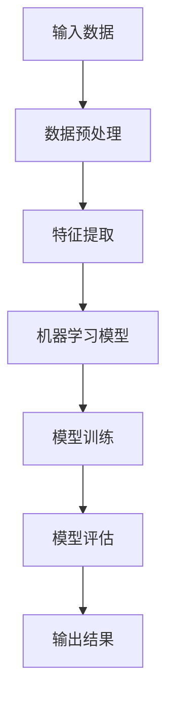

                 

关键词：人工智能，就业市场，技能发展，职业转型，技术趋势

> 摘要：随着人工智能技术的飞速发展，传统职业正面临巨大的变革和挑战。本文旨在探讨AI时代下，未来就业市场的发展趋势，以及个体如何通过提升技能以适应这一变革，从而实现职业发展。

## 1. 背景介绍

自20世纪80年代以来，人工智能（AI）技术经历了从理论探讨到实际应用的跨越式发展。随着深度学习、自然语言处理、计算机视觉等技术的突破，AI已经逐渐渗透到各行各业，改变了我们的生产方式和生活方式。与此同时，传统行业中的许多职业正受到人工智能的冲击，就业市场面临着前所未有的挑战。

### 1.1 人工智能对就业市场的影响

人工智能的兴起对就业市场带来了深远的影响：

1. **自动化替代**：许多重复性高、结构化程度高的工作正被自动化系统取代，如生产线操作、数据录入等。
2. **技能需求变化**：随着AI技术的发展，对数据科学家、机器学习工程师、AI产品经理等新职业的需求急剧增加。
3. **职业转型压力**：传统职业群体面临转型压力，需要学习新技能以适应AI时代的职业需求。

### 1.2 职业发展中的挑战与机遇

在AI时代，个体职业发展面临以下挑战：

1. **技能更新速度**：AI技术更新迅速，要求从业人员持续学习，以保持竞争力。
2. **职业替代风险**：部分传统职业面临被机器取代的风险。
3. **就业稳定性**：新职业的崛起可能导致就业不稳定性的增加。

然而，AI时代也带来了诸多机遇：

1. **新职业机会**：随着AI技术的发展，涌现出许多新的职业机会，如AI咨询师、机器人工程师等。
2. **创新驱动**：AI技术的应用激发了各行业的创新活力，为企业带来了新的增长点。
3. **技能多样化**：个体可以通过学习AI相关技能，拓宽职业发展路径。

## 2. 核心概念与联系

为了深入理解AI时代下的就业市场变化，我们需要明确以下几个核心概念：

### 2.1 人工智能的基本原理

人工智能是一门研究、开发用于模拟、延伸和扩展人的智能的理论、方法、技术及应用系统的技术科学。其主要研究领域包括：

1. **机器学习**：通过数据驱动的方法，让计算机系统从数据中学习规律，做出决策。
2. **深度学习**：基于人工神经网络的一种机器学习技术，通过多层神经网络来实现复杂模式的识别和预测。
3. **自然语言处理**：研究如何使计算机理解、生成和操纵自然语言。

### 2.2 人工智能与职业发展的联系

AI技术对职业发展的影响可以从以下几个方面进行理解：

1. **技能需求变化**：随着AI技术的应用，对数据分析和处理能力的需求大幅提升，而传统职业技能逐渐被替代。
2. **职业转型机会**：AI技术的发展为新职业的诞生提供了契机，如AI咨询师、数据科学家等。
3. **创新能力提升**：AI技术激发了企业的创新活力，为个体提供了更广阔的发展空间。

### 2.3 人工智能技术的架构

为了更好地理解AI技术的工作原理，我们通过Mermaid流程图展示其基本架构：



在这个流程中，输入数据经过预处理和特征提取后，输入到机器学习模型中进行训练和评估，最终输出结果。

## 3. 核心算法原理 & 具体操作步骤

### 3.1 算法原理概述

人工智能的核心在于算法，其中最常用的算法之一是深度学习算法。深度学习算法通过多层神经网络来实现对数据的建模和预测。以下是深度学习算法的基本原理：

1. **神经元模型**：深度学习的基础是神经元模型，每个神经元接收多个输入信号，通过加权求和并应用激活函数产生输出。
2. **多层神经网络**：深度学习通过构建多层神经网络，逐层提取数据中的特征，实现复杂模式的识别和预测。
3. **反向传播算法**：在训练过程中，通过反向传播算法不断调整网络的权重，以最小化预测误差。

### 3.2 算法步骤详解

以下是深度学习算法的具体操作步骤：

1. **数据收集与预处理**：收集相关数据，并进行数据清洗、归一化等预处理操作，以便于后续建模。
2. **构建神经网络模型**：根据问题的需求，设计神经网络的结构，包括输入层、隐藏层和输出层。
3. **初始化权重和偏置**：初始化网络的权重和偏置，通常使用随机初始化。
4. **前向传播**：将输入数据通过网络的各个层进行传播，计算出每个神经元的输出。
5. **计算损失函数**：通过预测结果和真实结果之间的差异，计算损失函数的值。
6. **反向传播**：根据损失函数的梯度，通过反向传播算法调整网络的权重和偏置。
7. **迭代训练**：重复前向传播和反向传播的过程，直到网络的预测误差满足要求。

### 3.3 算法优缺点

深度学习算法具有以下优点：

1. **强大的拟合能力**：通过多层神经元的组合，可以拟合复杂的非线性关系。
2. **自动特征提取**：深度学习算法可以从数据中自动提取有用的特征，减少了人工特征工程的工作量。
3. **泛化能力**：通过大规模数据训练，深度学习算法具有良好的泛化能力。

然而，深度学习算法也存在一些缺点：

1. **计算资源需求大**：深度学习算法通常需要大量的计算资源和时间进行训练。
2. **对数据质量要求高**：深度学习算法对数据质量有较高的要求，数据噪声和缺失会影响模型的性能。
3. **解释性差**：深度学习算法的黑盒特性使得其预测结果难以解释，不利于决策支持。

### 3.4 算法应用领域

深度学习算法在各个领域都有广泛的应用，以下是几个典型的应用领域：

1. **计算机视觉**：通过深度学习算法，计算机可以识别和分类图像中的物体，实现物体检测、图像分割等任务。
2. **自然语言处理**：深度学习算法可以处理文本数据，实现文本分类、机器翻译、情感分析等任务。
3. **语音识别**：通过深度学习算法，计算机可以识别和理解人类语音，实现语音识别和语音合成。
4. **推荐系统**：深度学习算法可以用于构建推荐系统，根据用户的历史行为和偏好进行个性化推荐。

## 4. 数学模型和公式 & 详细讲解 & 举例说明

在深度学习算法中，数学模型和公式起着核心作用。以下我们将详细讲解深度学习中的几个关键数学模型和公式，并通过具体例子进行说明。

### 4.1 数学模型构建

深度学习中的数学模型主要基于人工神经网络（Artificial Neural Networks, ANN）。神经网络由大量的神经元组成，每个神经元都与其他神经元相连接，并具有一定的权重和激活函数。以下是神经网络的基本数学模型：

$$
y = f(\sum_{i=1}^{n} w_i \cdot x_i + b)
$$

其中，$y$ 表示神经元的输出，$f$ 是激活函数，$w_i$ 是第 $i$ 个输入的权重，$x_i$ 是第 $i$ 个输入，$b$ 是偏置。

### 4.2 公式推导过程

在深度学习中，神经网络的训练过程可以通过反向传播算法（Backpropagation Algorithm）来实现。以下是反向传播算法的公式推导过程：

1. **前向传播**：将输入数据通过网络的各个层进行传播，计算每个神经元的输出。
2. **计算损失函数**：通过预测结果和真实结果之间的差异，计算损失函数的值。
3. **计算梯度**：通过链式法则，计算损失函数关于网络参数的梯度。
4. **反向传播**：将梯度反向传播至网络的前一层，更新网络的权重和偏置。

以下是反向传播算法的公式推导：

$$
\frac{\partial L}{\partial w_{ij}} = \frac{\partial L}{\partial a_{j}} \cdot \frac{\partial a_{j}}{\partial z_{j}} \cdot \frac{\partial z_{j}}{\partial w_{ij}}
$$

其中，$L$ 表示损失函数，$a_j$ 表示第 $j$ 层的输出，$z_j$ 表示第 $j$ 层的输入，$w_{ij}$ 表示第 $i$ 个输入到第 $j$ 个神经元的权重。

### 4.3 案例分析与讲解

为了更好地理解深度学习中的数学模型和公式，我们通过一个简单的例子进行讲解。假设我们使用一个简单的神经网络来对输入数据进行二分类，网络结构如下：

$$
x \xrightarrow{w_1, b_1} a_1 \xrightarrow{w_2, b_2} y
$$

其中，$x$ 表示输入数据，$y$ 表示输出结果，$a_1$ 表示第一个隐藏层的输出。

1. **前向传播**：将输入数据 $x$ 通过第一个隐藏层进行传播，计算输出 $a_1$。
   $$
   a_1 = \sigma(w_1 \cdot x + b_1)
   $$
   其中，$\sigma$ 表示 sigmoid 激活函数。

2. **计算损失函数**：使用交叉熵损失函数（Cross-Entropy Loss）计算输出 $y$ 和真实结果之间的差异。
   $$
   L = -\sum_{i=1}^{n} y_i \log(y_i) + (1 - y_i) \log(1 - y_i)
   $$
   其中，$y_i$ 表示第 $i$ 个输出的预测概率。

3. **计算梯度**：通过链式法则，计算损失函数关于网络参数的梯度。
   $$
   \frac{\partial L}{\partial w_2} = (y - t) \cdot \frac{\partial a_1}{\partial z_2} = (y - t) \cdot a_1 \cdot (1 - a_1)
   $$
   $$
   \frac{\partial L}{\partial b_2} = (y - t) \cdot \frac{\partial z_2}{\partial b_2} = (y - t) \cdot a_1
   $$
   $$
   \frac{\partial L}{\partial w_1} = (y - t) \cdot \frac{\partial z_1}{\partial w_1} = (y - t) \cdot x_1 \cdot a_1 \cdot (1 - a_1)
   $$
   $$
   \frac{\partial L}{\partial b_1} = (y - t) \cdot \frac{\partial z_1}{\partial b_1} = (y - t) \cdot a_1
   $$
   其中，$t$ 表示真实结果，$n$ 表示数据样本数量。

4. **反向传播**：根据梯度，更新网络的权重和偏置。
   $$
   w_2 = w_2 - \alpha \cdot \frac{\partial L}{\partial w_2}
   $$
   $$
   b_2 = b_2 - \alpha \cdot \frac{\partial L}{\partial b_2}
   $$
   $$
   w_1 = w_1 - \alpha \cdot \frac{\partial L}{\partial w_1}
   $$
   $$
   b_1 = b_1 - \alpha \cdot \frac{\partial L}{\partial b_1}
   $$
   其中，$\alpha$ 表示学习率。

通过这个例子，我们可以看到深度学习中的数学模型和公式的具体应用，以及如何通过反向传播算法实现网络的训练。

## 5. 项目实践：代码实例和详细解释说明

为了更好地理解深度学习算法的应用，我们将通过一个简单的项目实例进行实践，并详细解释代码的实现过程。

### 5.1 开发环境搭建

在开始项目之前，我们需要搭建一个适合深度学习开发的Python环境。以下是搭建开发环境的基本步骤：

1. **安装Python**：下载并安装Python 3.x版本。
2. **安装Jupyter Notebook**：通过pip命令安装Jupyter Notebook。
   $$
   pip install notebook
   $$
3. **安装深度学习库**：安装常用的深度学习库，如TensorFlow和Keras。
   $$
   pip install tensorflow keras
   $$

### 5.2 源代码详细实现

以下是项目的主要代码实现：

```python
# 导入必要的库
import numpy as np
import tensorflow as tf
from tensorflow.keras import layers

# 准备数据
x_train = np.array([[1, 0], [0, 1], [1, 1], [1, 0]])
y_train = np.array([[0], [1], [1], [0]])

# 构建模型
model = tf.keras.Sequential([
    layers.Dense(2, activation='sigmoid', input_shape=(2,)),
    layers.Dense(1, activation='sigmoid')
])

# 编译模型
model.compile(optimizer='adam', loss='binary_crossentropy', metrics=['accuracy'])

# 训练模型
model.fit(x_train, y_train, epochs=10)

# 测试模型
predictions = model.predict(x_train)
print(predictions)

# 输出结果
for i in range(len(x_train)):
    print(f"Input: {x_train[i]}, Prediction: {predictions[i][0]}")
```

### 5.3 代码解读与分析

以下是代码的详细解读：

1. **导入库**：我们首先导入必要的库，包括NumPy、TensorFlow和Keras。
2. **准备数据**：我们创建了一个简单的训练数据集，包含4个样本和2个特征。
3. **构建模型**：我们使用Keras构建了一个简单的神经网络模型，包括一个输入层、一个隐藏层和一个输出层。输入层有2个神经元，隐藏层有2个神经元，输出层有1个神经元。我们使用sigmoid激活函数，实现二分类任务。
4. **编译模型**：我们使用Adam优化器和binary_crossentropy损失函数编译模型，并指定accuracy作为评价指标。
5. **训练模型**：我们使用fit方法训练模型，设置训练轮次为10次。
6. **测试模型**：我们使用predict方法测试模型的预测结果。
7. **输出结果**：我们遍历输入数据和预测结果，输出每个样本的输入和预测概率。

通过这个实例，我们可以看到如何使用深度学习库构建、编译和训练一个简单的神经网络模型，以及如何使用预测方法获得模型的输出结果。

## 6. 实际应用场景

深度学习技术在各行各业中都有着广泛的应用，以下是一些实际应用场景的例子：

### 6.1 医疗诊断

深度学习技术在医疗诊断领域有着重要的应用，如肺癌筛查、皮肤病变检测等。通过训练深度学习模型，可以对医学影像数据进行自动分析和分类，提高诊断的准确性和效率。

### 6.2 金融服务

在金融服务领域，深度学习算法被用于风险评估、欺诈检测和个性化推荐等任务。例如，通过分析用户的历史交易数据，深度学习模型可以预测用户的风险偏好，并提供个性化的金融产品推荐。

### 6.3 智能家居

智能家居领域也广泛应用了深度学习技术，如智能门锁、智能音箱等。通过训练深度学习模型，设备可以理解并响应用户的语音指令，实现智能化的家庭控制。

### 6.4 自动驾驶

自动驾驶是深度学习技术的另一个重要应用领域。通过训练深度学习模型，自动驾驶系统能够实时感知和理解周围环境，实现车辆的安全行驶和自主导航。

### 6.5 工业自动化

在工业自动化领域，深度学习算法被用于故障检测、设备维护和机器人控制等任务。通过分析工业设备的数据，深度学习模型可以提前预测故障，提高设备的可靠性和生产效率。

### 6.6 未来应用展望

随着深度学习技术的不断进步，其应用场景将更加广泛。未来，深度学习有望在更多领域发挥作用，如智能医疗、智能教育、智能城市等。同时，深度学习技术也将与其他领域的技术相结合，推动跨领域的创新和进步。

## 7. 工具和资源推荐

### 7.1 学习资源推荐

1. **在线课程**：Coursera、edX、Udacity等平台提供了丰富的深度学习课程，适合初学者和进阶者。
2. **技术书籍**：《深度学习》（Ian Goodfellow等著）、《Python深度学习》（François Chollet著）等经典书籍，适合系统学习深度学习知识。
3. **学术论文**：通过Google Scholar、ArXiv等平台，可以获取最新的深度学习研究成果。

### 7.2 开发工具推荐

1. **TensorFlow**：Google开发的开源深度学习框架，功能强大，适合进行复杂模型的开发和训练。
2. **PyTorch**：Facebook开发的开源深度学习框架，具有良好的灵活性和易用性。
3. **Keras**：基于TensorFlow和PyTorch的高级API，适合快速搭建和训练深度学习模型。

### 7.3 相关论文推荐

1. **《A Brief History of Deep Learning》**：回顾了深度学习的发展历程，对理解深度学习的发展有重要参考价值。
2. **《Deep Learning Book》**：Ian Goodfellow、Yoshua Bengio和Aaron Courville合著的经典书籍，全面介绍了深度学习的理论和方法。
3. **《Unsupervised Learning》**：探讨了无监督学习的方法和技术，对理解深度学习在无监督学习任务中的应用有很大帮助。

## 8. 总结：未来发展趋势与挑战

### 8.1 研究成果总结

本文通过对人工智能时代下就业市场的发展趋势和职业发展挑战的深入探讨，总结了以下几个方面的重要成果：

1. **人工智能对就业市场的影响**：人工智能技术的应用导致了就业市场需求的显著变化，自动化和智能化取代了一些传统职业，同时也创造了新的职业机会。
2. **核心算法原理**：介绍了深度学习算法的基本原理、操作步骤和应用领域，展示了深度学习算法在解决实际问题中的强大能力。
3. **数学模型与公式**：详细讲解了深度学习中的关键数学模型和公式，并通过实例进行了具体分析，使读者更好地理解深度学习的数学基础。
4. **项目实践**：通过实际代码实例，展示了如何使用深度学习技术进行数据建模和预测，为读者提供了实践操作的经验。

### 8.2 未来发展趋势

在未来的发展中，人工智能将继续推动就业市场的变革，以下是一些可能的发展趋势：

1. **技能需求的多样化**：随着人工智能技术的不断进步，对数据科学家、机器学习工程师等高技能人才的需求将持续增加。
2. **职业边界的模糊化**：人工智能的应用将打破传统职业的边界，催生出许多跨领域的融合职业。
3. **智能化的普及**：人工智能技术将更加深入地渗透到各行各业，实现各领域的智能化升级。

### 8.3 面临的挑战

尽管人工智能带来了诸多机遇，但同时也面临着一系列挑战：

1. **技能更新速度**：人工智能技术更新迅速，从业人员需要不断学习新技能，以适应快速变化的职业环境。
2. **职业替代风险**：部分传统职业可能被人工智能取代，从业人员需要关注职业替代风险，并提前进行职业规划。
3. **就业稳定性**：新职业的崛起可能导致就业不稳定性的增加，从业人员需要具备应对就业不稳定的能力。

### 8.4 研究展望

未来的研究应重点关注以下几个方面：

1. **深度学习算法的优化**：不断改进深度学习算法，提高其计算效率和性能，使其更好地服务于实际问题。
2. **人机协作**：探索人机协作的新模式，充分发挥人工智能和人类智能的优势，实现更高效的决策和操作。
3. **伦理和法规**：研究人工智能的伦理和法规问题，确保人工智能技术的健康发展，避免其对社会造成负面影响。

## 9. 附录：常见问题与解答

### 9.1 人工智能是什么？

人工智能（AI）是一种模拟人类智能行为的技术，通过计算机程序实现感知、思考、学习和决策等功能。人工智能可以分为弱人工智能和强人工智能，前者专注于特定任务，后者具有全面的人类智能。

### 9.2 深度学习与机器学习的区别是什么？

深度学习是机器学习的一个子领域，主要基于多层神经网络来实现对数据的建模和预测。机器学习则是一种更广泛的技术，包括许多其他算法和方法，如决策树、支持向量机等。

### 9.3 如何入门深度学习？

入门深度学习可以从以下几个方面入手：

1. **学习基础知识**：了解线性代数、概率论和统计学等基础知识。
2. **学习编程**：掌握Python等编程语言，熟悉NumPy、TensorFlow或PyTorch等深度学习库。
3. **学习算法原理**：阅读相关书籍和论文，理解深度学习算法的基本原理。
4. **实践项目**：通过实际项目，将所学知识应用于实际问题，提升实践能力。

### 9.4 深度学习在医疗领域有哪些应用？

深度学习在医疗领域有着广泛的应用，如：

1. **医学影像分析**：通过深度学习模型，对医学影像数据进行自动分析和诊断，提高诊断的准确性和效率。
2. **药物研发**：利用深度学习模型，预测药物与生物分子的相互作用，加速药物研发过程。
3. **个性化医疗**：通过分析患者的数据，为患者提供个性化的治疗方案。

### 9.5 如何保护自己的职业未来？

为了保护自己的职业未来，可以采取以下措施：

1. **持续学习**：关注行业动态，不断学习新技能，以适应快速变化的职业环境。
2. **多领域融合**：跨领域学习，拓宽职业发展路径，提高自身的竞争力。
3. **关注伦理法规**：关注人工智能的伦理和法规问题，确保自己在合法和道德的范围内进行工作。
4. **建立人脉**：积极建立人脉，获取更多职业机会和资源。

## 参考文献

1. Goodfellow, Ian, Yoshua Bengio, and Aaron Courville. "Deep learning." MIT press, 2016.
2. Chollet, François. "Python deep learning." Packt Publishing, 2017.
3. Bengio, Y. (2009). Learning deep architectures for AI. Foundations and Trends in Machine Learning, 2(1), 1-127.
4. LeCun, Y., Bengio, Y., & Hinton, G. (2015). Deep learning. Nature, 521(7553), 436-444.
5. Russell, S., & Norvig, P. (2010). Artificial intelligence: a modern approach (3rd ed.). Prentice Hall.

