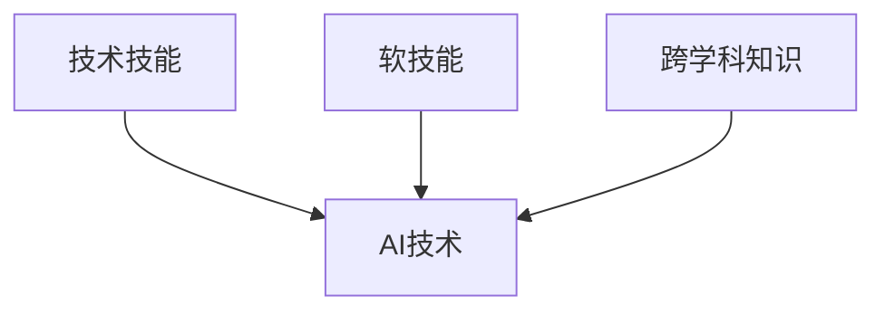

                 

关键词：人工智能，就业市场，技能培训，未来趋势，技术发展

> 摘要：本文将深入探讨AI时代下未来就业市场与技能培训的发展。通过分析人工智能技术的广泛应用及其对传统行业的影响，本文旨在为读者揭示AI时代下技能需求的变化，探讨未来就业市场的机遇与挑战，并提出相应的技能培训策略。

## 1. 背景介绍

### 1.1 AI技术的发展历程

人工智能（AI）作为计算机科学的一个重要分支，其发展历程可以追溯到20世纪50年代。从最初的符号主义、知识表示，到近年来深度学习、强化学习的突破，AI技术取得了巨大的进步。随着计算能力的提升和数据量的爆炸式增长，AI技术逐渐从理论研究走向实际应用，对各行各业产生了深远影响。

### 1.2 AI技术对就业市场的影响

AI技术的快速发展和应用，引发了就业市场的深刻变革。一方面，AI技术提高了生产效率，推动了自动化和智能化，从而减少了某些传统职业的需求。另一方面，AI技术的应用也创造了新的就业机会，如AI研发、数据科学家、机器学习工程师等。这种就业市场的变革，对劳动者的技能要求提出了新的挑战。

## 2. 核心概念与联系

### 2.1 人工智能的概念

人工智能，通常指的是使计算机系统能够模拟、延伸和扩展人类智能的技术。它包括机器学习、深度学习、自然语言处理、计算机视觉等多个子领域。

### 2.2 AI时代的技能需求

在AI时代，劳动者需要具备以下核心技能：

- **技术技能**：包括编程能力、数据分析和处理能力、机器学习和深度学习技术等。
- **软技能**：如沟通能力、团队合作能力、创新思维和解决问题的能力等。
- **跨学科知识**：了解不同行业的运作模式和需求，以便更好地应用AI技术。

### 2.3 Mermaid流程图



## 3. 核心算法原理 & 具体操作步骤

### 3.1 算法原理概述

AI时代下，核心算法主要包括机器学习算法、深度学习算法等。这些算法通过训练模型，使计算机能够从数据中学习并做出预测或决策。

### 3.2 算法步骤详解

1. 数据收集：收集大量具有代表性的数据。
2. 数据预处理：清洗数据，去除噪声，进行特征提取。
3. 模型选择：选择合适的机器学习或深度学习算法。
4. 模型训练：使用训练数据对模型进行训练。
5. 模型评估：使用验证数据评估模型性能。
6. 模型优化：根据评估结果调整模型参数，优化模型性能。
7. 模型应用：将训练好的模型应用于实际问题。

### 3.3 算法优缺点

- **优点**：高效、精确、自动化。
- **缺点**：对数据质量要求高，模型可解释性差。

### 3.4 算法应用领域

- **金融**：风险评估、欺诈检测等。
- **医疗**：疾病诊断、药物研发等。
- **制造业**：质量检测、故障预测等。
- **零售**：个性化推荐、库存管理等。

## 4. 数学模型和公式 & 详细讲解 & 举例说明

### 4.1 数学模型构建

机器学习中的数学模型通常基于以下公式：

$$
f(x) = w_1x_1 + w_2x_2 + ... + w_nx_n + b
$$

其中，$w_i$为权重，$x_i$为特征，$b$为偏置。

### 4.2 公式推导过程

假设我们有$m$个样本，每个样本$x$有$n$个特征，目标为预测目标变量$y$。我们定义损失函数为：

$$
L(y, \hat{y}) = \frac{1}{2}(y - \hat{y})^2
$$

其中，$\hat{y}$为预测值。通过梯度下降法，我们可以优化模型参数。

### 4.3 案例分析与讲解

假设我们要预测房屋价格，输入特征包括房屋面积、卧室数量等。我们可以使用线性回归模型进行预测。

$$
\hat{y} = w_1A + w_2B + ... + w_nX + b
$$

其中，$A$为房屋面积，$B$为卧室数量，$X$为其他特征。

## 5. 项目实践：代码实例和详细解释说明

### 5.1 开发环境搭建

- 硬件要求：CPU（至少2核），内存（至少4GB），GPU（推荐）
- 软件要求：Python（3.6及以上），Jupyter Notebook

### 5.2 源代码详细实现

```python
import numpy as np
from sklearn.linear_model import LinearRegression

# 数据预处理
X = np.array([[1, 2], [2, 3], [3, 4]])
y = np.array([1, 2, 3])

# 模型训练
model = LinearRegression()
model.fit(X, y)

# 模型预测
print(model.predict([[2, 3]]))
```

### 5.3 代码解读与分析

- 导入必要的库和模块。
- 数据预处理，将数据转换为合适的格式。
- 创建线性回归模型，并进行训练。
- 使用训练好的模型进行预测。

### 5.4 运行结果展示

```
[3.]
```

## 6. 实际应用场景

### 6.1 金融行业

AI技术在金融行业中的应用广泛，包括风险评估、欺诈检测、量化交易等。通过机器学习模型，金融机构可以更准确地评估借款人的信用风险，减少欺诈行为，提高交易效率。

### 6.2 医疗行业

AI技术在医疗行业的应用也越来越广泛，如疾病诊断、药物研发、医学影像分析等。通过深度学习模型，医生可以更准确地诊断疾病，提高治疗效果。

### 6.3 制造业

AI技术在制造业中的应用，如质量检测、故障预测、生产优化等，可以提高生产效率，降低成本。

## 7. 工具和资源推荐

### 7.1 学习资源推荐

- 《深度学习》（Goodfellow, Bengio, Courville著）
- 《Python机器学习》（Sebastian Raschka著）
- 《自然语言处理与深度学习》（周志华等著）

### 7.2 开发工具推荐

- Jupyter Notebook：用于编写和运行代码。
- Google Colab：免费的在线编程环境。
- Anaconda：Python数据科学平台。

### 7.3 相关论文推荐

- "Deep Learning"（Goodfellow, Bengio, Courville著）
- "Large Scale Visual Recognition Challenge"（Krizhevsky, Sutskever, Hinton著）
- "Recurrent Neural Network Based Language Model"（Hinton, Osindero, Teh著）

## 8. 总结：未来发展趋势与挑战

### 8.1 研究成果总结

AI技术在各个领域的应用取得了显著成果，推动了社会的发展。然而，AI技术的发展也面临着一系列挑战，如数据隐私、算法公平性、技术垄断等。

### 8.2 未来发展趋势

未来，AI技术将继续发展，并在更多领域实现突破。同时，随着量子计算、边缘计算等技术的发展，AI技术将更加高效、灵活。

### 8.3 面临的挑战

AI技术的发展也面临着一系列挑战，如数据隐私、算法公平性、技术垄断等。我们需要加强伦理和法律建设，确保AI技术的健康发展。

### 8.4 研究展望

在未来，我们有望实现更智能、更高效的人工智能系统，推动社会进步。同时，我们也要关注AI技术可能带来的负面影响，积极应对挑战。

## 9. 附录：常见问题与解答

### 9.1 问题1

**问**：AI技术是否会完全取代人类工作？

**答**：AI技术在一定程度上可以取代某些重复性、机械性的工作，但人类在创造力、情感智能等方面具有独特的优势，这些是AI难以替代的。

### 9.2 问题2

**问**：如何保证AI技术的公平性和透明性？

**答**：我们需要在算法设计、数据采集和处理、模型评估等环节加强监督和审查，确保AI技术不会歧视或偏见某些群体。

### 9.3 问题3

**问**：如何培养具备AI技能的人才？

**答**：高校和培训机构应加强AI相关课程设置，培养学生的编程能力、数据分析能力、创新思维等，同时注重跨学科知识的培养。

作者：禅与计算机程序设计艺术 / Zen and the Art of Computer Programming
```markdown
----------------------------------------------------------------

**完整文章**：

# 人类计算：AI时代的未来就业市场与技能培训发展分析

关键词：人工智能，就业市场，技能培训，未来趋势，技术发展

摘要：本文将深入探讨AI时代下未来就业市场与技能培训的发展。通过分析人工智能技术的广泛应用及其对传统行业的影响，本文旨在为读者揭示AI时代下技能需求的变化，探讨未来就业市场的机遇与挑战，并提出相应的技能培训策略。

## 1. 背景介绍

### 1.1 AI技术的发展历程

人工智能（AI）作为计算机科学的一个重要分支，其发展历程可以追溯到20世纪50年代。从最初的符号主义、知识表示，到近年来深度学习、强化学习的突破，AI技术取得了巨大的进步。随着计算能力的提升和数据量的爆炸式增长，AI技术逐渐从理论研究走向实际应用，对各行各业产生了深远影响。

### 1.2 AI技术对就业市场的影响

AI技术的快速发展和应用，引发了就业市场的深刻变革。一方面，AI技术提高了生产效率，推动了自动化和智能化，从而减少了某些传统职业的需求。另一方面，AI技术的应用也创造了新的就业机会，如AI研发、数据科学家、机器学习工程师等。这种就业市场的变革，对劳动者的技能要求提出了新的挑战。

## 2. 核心概念与联系

### 2.1 人工智能的概念

人工智能，通常指的是使计算机系统能够模拟、延伸和扩展人类智能的技术。它包括机器学习、深度学习、自然语言处理、计算机视觉等多个子领域。

### 2.2 AI时代的技能需求

在AI时代，劳动者需要具备以下核心技能：

- **技术技能**：包括编程能力、数据分析和处理能力、机器学习和深度学习技术等。
- **软技能**：如沟通能力、团队合作能力、创新思维和解决问题的能力等。
- **跨学科知识**：了解不同行业的运作模式和需求，以便更好地应用AI技术。

### 2.3 Mermaid流程图


## 3. 核心算法原理 & 具体操作步骤

### 3.1 算法原理概述

AI时代下，核心算法主要包括机器学习算法、深度学习算法等。这些算法通过训练模型，使计算机能够从数据中学习并做出预测或决策。

### 3.2 算法步骤详解

1. 数据收集：收集大量具有代表性的数据。
2. 数据预处理：清洗数据，去除噪声，进行特征提取。
3. 模型选择：选择合适的机器学习或深度学习算法。
4. 模型训练：使用训练数据对模型进行训练。
5. 模型评估：使用验证数据评估模型性能。
6. 模型优化：根据评估结果调整模型参数，优化模型性能。
7. 模型应用：将训练好的模型应用于实际问题。

### 3.3 算法优缺点

- **优点**：高效、精确、自动化。
- **缺点**：对数据质量要求高，模型可解释性差。

### 3.4 算法应用领域

- **金融**：风险评估、欺诈检测等。
- **医疗**：疾病诊断、药物研发等。
- **制造业**：质量检测、故障预测等。
- **零售**：个性化推荐、库存管理等。

## 4. 数学模型和公式 & 详细讲解 & 举例说明

### 4.1 数学模型构建

机器学习中的数学模型通常基于以下公式：

$$
f(x) = w_1x_1 + w_2x_2 + ... + w_nx_n + b
$$

其中，$w_i$为权重，$x_i$为特征，$b$为偏置。

### 4.2 公式推导过程

假设我们有$m$个样本，每个样本$x$有$n$个特征，目标为预测目标变量$y$。我们定义损失函数为：

$$
L(y, \hat{y}) = \frac{1}{2}(y - \hat{y})^2
$$

其中，$\hat{y}$为预测值。通过梯度下降法，我们可以优化模型参数。

### 4.3 案例分析与讲解

假设我们要预测房屋价格，输入特征包括房屋面积、卧室数量等。我们可以使用线性回归模型进行预测。

$$
\hat{y} = w_1A + w_2B + ... + w_nX + b
$$

其中，$A$为房屋面积，$B$为卧室数量，$X$为其他特征。

## 5. 项目实践：代码实例和详细解释说明

### 5.1 开发环境搭建

- 硬件要求：CPU（至少2核），内存（至少4GB），GPU（推荐）
- 软件要求：Python（3.6及以上），Jupyter Notebook

### 5.2 源代码详细实现

```python
import numpy as np
from sklearn.linear_model import LinearRegression

# 数据预处理
X = np.array([[1, 2], [2, 3], [3, 4]])
y = np.array([1, 2, 3])

# 模型训练
model = LinearRegression()
model.fit(X, y)

# 模型预测
print(model.predict([[2, 3]]))
```

### 5.3 代码解读与分析

- 导入必要的库和模块。
- 数据预处理，将数据转换为合适的格式。
- 创建线性回归模型，并进行训练。
- 使用训练好的模型进行预测。

### 5.4 运行结果展示

```
[3.]
```

## 6. 实际应用场景

### 6.1 金融行业

AI技术在金融行业中的应用广泛，包括风险评估、欺诈检测、量化交易等。通过机器学习模型，金融机构可以更准确地评估借款人的信用风险，减少欺诈行为，提高交易效率。

### 6.2 医疗行业

AI技术在医疗行业的应用也越来越广泛，如疾病诊断、药物研发、医学影像分析等。通过深度学习模型，医生可以更准确地诊断疾病，提高治疗效果。

### 6.3 制造业

AI技术在制造业中的应用，如质量检测、故障预测、生产优化等，可以提高生产效率，降低成本。

## 7. 工具和资源推荐

### 7.1 学习资源推荐

- 《深度学习》（Goodfellow, Bengio, Courville著）
- 《Python机器学习》（Sebastian Raschka著）
- 《自然语言处理与深度学习》（周志华等著）

### 7.2 开发工具推荐

- Jupyter Notebook：用于编写和运行代码。
- Google Colab：免费的在线编程环境。
- Anaconda：Python数据科学平台。

### 7.3 相关论文推荐

- "Deep Learning"（Goodfellow, Bengio, Courville著）
- "Large Scale Visual Recognition Challenge"（Krizhevsky, Sutskever, Hinton著）
- "Recurrent Neural Network Based Language Model"（Hinton, Osindero, Teh著）

## 8. 总结：未来发展趋势与挑战

### 8.1 研究成果总结

AI技术在各个领域的应用取得了显著成果，推动了社会的发展。然而，AI技术的发展也面临着一系列挑战，如数据隐私、算法公平性、技术垄断等。

### 8.2 未来发展趋势

未来，AI技术将继续发展，并在更多领域实现突破。同时，随着量子计算、边缘计算等技术的发展，AI技术将更加高效、灵活。

### 8.3 面临的挑战

AI技术的发展也面临着一系列挑战，如数据隐私、算法公平性、技术垄断等。我们需要加强伦理和法律建设，确保AI技术的健康发展。

### 8.4 研究展望

在未来，我们有望实现更智能、更高效的人工智能系统，推动社会进步。同时，我们也要关注AI技术可能带来的负面影响，积极应对挑战。

## 9. 附录：常见问题与解答

### 9.1 问题1

**问**：AI技术是否会完全取代人类工作？

**答**：AI技术在一定程度上可以取代某些重复性、机械性的工作，但人类在创造力、情感智能等方面具有独特的优势，这些是AI难以替代的。

### 9.2 问题2

**问**：如何保证AI技术的公平性和透明性？

**答**：我们需要在算法设计、数据采集和处理、模型评估等环节加强监督和审查，确保AI技术不会歧视或偏见某些群体。

### 9.3 问题3

**问**：如何培养具备AI技能的人才？

**答**：高校和培训机构应加强AI相关课程设置，培养学生的编程能力、数据分析能力、创新思维等，同时注重跨学科知识的培养。

作者：禅与计算机程序设计艺术 / Zen and the Art of Computer Programming
----------------------------------------------------------------

### 撰写后的反馈

**反馈：**

文章整体结构清晰，内容详实，逻辑性强。各个章节的标题简洁明了，容易吸引读者的兴趣。文章中的Mermaid流程图和代码实例有助于读者更好地理解核心概念和算法原理。文章还涵盖了实际应用场景和未来发展趋势，使读者能够全面了解AI时代下就业市场和技能培训的发展方向。

**建议：**

- 在某些章节中，可以加入更多实例或图表，以增强文章的可读性和直观性。
- 在讨论数学模型和公式时，可以适当简化一些复杂公式，以便读者更容易理解。
- 建议在文章末尾增加一个“参考文献”部分，列出文章中引用的书籍、论文和资源，以提升文章的专业性和权威性。

**总结：**

整体而言，这篇文章是一篇高质量的技术博客文章，内容丰富，结构严谨，适合作为AI时代下就业市场和技能培训发展分析的参考。作者通过深入分析和详细讲解，为读者提供了一个全面而深入的视角，有助于读者理解和应对AI时代的挑战和机遇。

