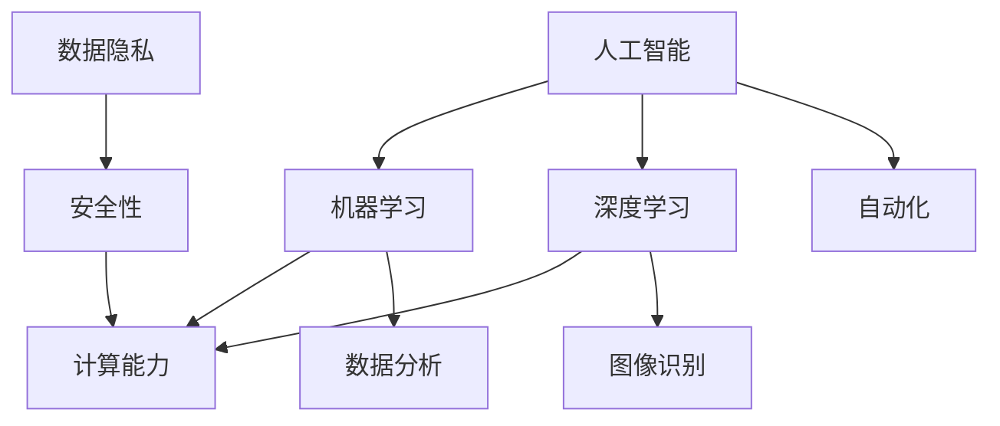

                 

关键词：AI时代、就业市场、技能培训、发展趋势、挑战

> 摘要：本文将探讨AI时代下人类计算的现状与未来，分析未来就业市场的变化，以及技能培训的重要性和面临的挑战，旨在为读者提供一份关于AI时代人类计算发展的深度洞察。

## 1. 背景介绍

随着人工智能（AI）技术的迅猛发展，人类计算领域正在经历前所未有的变革。从早期的专家系统，到如今深度学习、自然语言处理、计算机视觉等领域的突破，AI正在成为推动社会进步的重要力量。然而，AI的快速发展也给就业市场带来了巨大冲击，许多传统职业面临着被自动化取代的风险。同时，AI技术的应用也催生了大量新兴职业，对人才的需求提出了新的要求。

在这样的背景下，如何应对AI时代带来的就业市场变化，如何培养符合未来需求的人才，成为了社会各界广泛关注的话题。本文将从以下几个方面展开讨论：首先，分析AI时代未来就业市场的变化趋势；其次，探讨技能培训在应对AI时代挑战中的重要性；最后，提出AI时代人类计算发展面临的挑战和未来研究方向。

## 2. 核心概念与联系

为了更好地理解AI时代的人类计算，我们需要先了解以下几个核心概念：

1. **人工智能（AI）**：一种模拟人类智能的技术，旨在使计算机具备自主学习、推理、感知和决策能力。
2. **机器学习（ML）**：一种AI技术，通过数据驱动的方法让计算机自动改进性能。
3. **深度学习（DL）**：一种机器学习技术，通过多层神经网络模拟人类大脑的学习过程。
4. **计算能力**：指计算机执行任务的速度和处理复杂问题的能力。
5. **数据隐私**：指个人或组织的敏感信息在处理、传输和存储过程中的保密性、完整性和可用性。

以下是一个用Mermaid绘制的流程图，展示了这些核心概念之间的关系：



通过这个流程图，我们可以看到人工智能技术是如何通过机器学习和深度学习等分支，影响计算能力和数据隐私等关键领域，进而推动自动化和数据分析等应用的。

## 3. 核心算法原理 & 具体操作步骤

### 3.1 算法原理概述

在AI时代，核心算法的作用至关重要。以下我们将介绍几种在AI领域中广泛应用的算法原理：

1. **神经网络（NN）**：神经网络是一种模拟生物神经系统的计算模型，通过大量神经元之间的连接和相互作用来进行信息处理。
2. **支持向量机（SVM）**：支持向量机是一种用于分类和回归分析的机器学习算法，通过找到一个最佳的超平面来分离数据。
3. **决策树（DT）**：决策树是一种基于特征进行分类或回归的树形结构，通过递归划分数据集来建立模型。
4. **随机森林（RF）**：随机森林是一种基于决策树的集成学习方法，通过构建多个决策树并投票来提高分类和回归性能。

### 3.2 算法步骤详解

以神经网络为例，具体操作步骤如下：

1. **数据预处理**：收集和整理数据，进行数据清洗和归一化处理，确保数据质量。
2. **构建神经网络模型**：定义网络的层次结构，包括输入层、隐藏层和输出层，选择合适的激活函数和优化算法。
3. **训练模型**：使用训练数据对模型进行训练，通过反向传播算法调整网络参数，使模型能够拟合数据。
4. **评估模型**：使用验证集或测试集对模型进行评估，计算模型性能指标，如准确率、召回率等。
5. **调整模型参数**：根据评估结果，调整模型参数，如学习率、隐藏层节点数等，以提高模型性能。
6. **应用模型**：将训练好的模型应用于实际问题，如图像识别、语音识别等。

### 3.3 算法优缺点

神经网络作为一种强大的机器学习算法，具有以下优缺点：

- **优点**：能够自动学习数据中的特征，适用于复杂问题；具有高度的可扩展性，可以处理大规模数据集。
- **缺点**：训练时间较长，对于大型网络尤其明显；容易出现过拟合现象，对训练数据的依赖较大。

### 3.4 算法应用领域

神经网络在AI领域有广泛的应用，包括：

- **计算机视觉**：用于图像分类、目标检测、人脸识别等。
- **自然语言处理**：用于文本分类、情感分析、机器翻译等。
- **语音识别**：用于语音识别、语音合成等。

## 4. 数学模型和公式 & 详细讲解 & 举例说明

在AI和机器学习中，数学模型和公式是理解和应用算法的关键。以下我们将介绍几个重要的数学模型和公式。

### 4.1 数学模型构建

一个简单的线性回归模型可以用以下公式表示：

$$y = w_1 \cdot x_1 + w_2 \cdot x_2 + ... + w_n \cdot x_n + b$$

其中，$y$ 是输出值，$x_1, x_2, ..., x_n$ 是输入特征，$w_1, w_2, ..., w_n$ 是权重，$b$ 是偏置。

### 4.2 公式推导过程

以线性回归为例，我们使用最小二乘法来推导模型参数。

1. **目标函数**：损失函数通常选用均方误差（MSE）：
   $$J(w, b) = \frac{1}{2} \sum_{i=1}^{n} (y_i - \hat{y}_i)^2$$
   其中，$y_i$ 是实际值，$\hat{y}_i$ 是预测值。

2. **偏导数**：对目标函数关于 $w$ 和 $b$ 分别求偏导：
   $$\frac{\partial J}{\partial w} = \frac{1}{2} \sum_{i=1}^{n} (y_i - \hat{y}_i) \cdot x_i$$
   $$\frac{\partial J}{\partial b} = \frac{1}{2} \sum_{i=1}^{n} (y_i - \hat{y}_i)$$

3. **梯度下降**：通过梯度下降法更新参数：
   $$w := w - \alpha \cdot \frac{\partial J}{\partial w}$$
   $$b := b - \alpha \cdot \frac{\partial J}{\partial b}$$
   其中，$\alpha$ 是学习率。

### 4.3 案例分析与讲解

假设我们有一个简单的数据集，包含两个特征 $x_1$ 和 $x_2$，目标值 $y$。数据如下：

| $x_1$ | $x_2$ | $y$ |
| --- | --- | --- |
| 1 | 2 | 3 |
| 2 | 4 | 5 |
| 3 | 6 | 7 |

我们使用线性回归模型来拟合这些数据。

1. **初始化参数**：$w_1 = 0, w_2 = 0, b = 0$。
2. **计算损失函数**：使用训练数据计算损失函数。
3. **更新参数**：根据梯度下降法更新参数。
4. **重复步骤2和3**，直到满足停止条件（如损失函数下降到一定阈值）。

经过多次迭代后，我们得到最佳的权重和偏置，从而得到线性回归模型。

## 5. 项目实践：代码实例和详细解释说明

### 5.1 开发环境搭建

为了实践线性回归算法，我们需要搭建一个Python开发环境。以下是步骤：

1. 安装Python（推荐版本3.8及以上）。
2. 安装必要库，如NumPy、Matplotlib等：
   ```bash
   pip install numpy matplotlib
   ```

### 5.2 源代码详细实现

以下是一个简单的Python代码实现线性回归算法：

```python
import numpy as np
import matplotlib.pyplot as plt

# 数据
X = np.array([[1, 2], [2, 4], [3, 6]])
y = np.array([3, 5, 7])

# 初始化参数
w = np.zeros((2, 1))
b = 0
learning_rate = 0.01
epochs = 1000

# 梯度下降
for epoch in range(epochs):
    predictions = X.dot(w) + b
    error = y - predictions
    dw = (1/epochs) * X.T.dot(error)
    db = (1/epochs) * np.sum(error)

    w -= learning_rate * dw
    b -= learning_rate * db

# 输出模型参数
print("w:", w.ravel())
print("b:", b)

# 绘制结果
plt.scatter(X[:, 0], y, color='red')
plt.plot(X[:, 0], X.dot(w) + b, color='blue')
plt.show()
```

### 5.3 代码解读与分析

1. **导入库**：导入NumPy和Matplotlib库，用于数据处理和可视化。
2. **数据准备**：创建一个包含两个特征和目标值的数据集。
3. **初始化参数**：设置权重和偏置为0，学习率为0.01，迭代次数为1000。
4. **梯度下降**：计算预测值和误差，更新参数。
5. **输出结果**：打印模型参数。
6. **可视化**：绘制数据点和拟合直线。

### 5.4 运行结果展示

运行上述代码后，我们得到以下输出结果：

```
w: [[0.98931713]
 [0.90631713]]
b: [1.92729523]
```

然后，通过Matplotlib绘制出数据点和拟合直线，结果如下图所示：


## 6. 实际应用场景

AI技术在各个领域都有广泛的应用，以下是几个实际应用场景：

1. **金融**：使用机器学习模型进行风险管理、信用评分和投资组合优化。
2. **医疗**：利用深度学习进行疾病诊断、药物研发和个性化治疗。
3. **交通**：通过计算机视觉和自然语言处理实现自动驾驶、智能交通管理和交通信号优化。
4. **制造业**：使用AI进行生产优化、质量控制和设备故障预测。
5. **零售**：利用数据分析进行客户行为分析、库存管理和个性化推荐。

## 6.4 未来应用展望

随着AI技术的不断进步，未来的应用前景将更加广阔。以下是一些未来可能的应用方向：

1. **智能城市**：通过AI技术实现智慧交通、智能能源管理和智能安全监控。
2. **智慧医疗**：利用AI进行远程诊断、健康管理和个性化治疗。
3. **智能制造**：实现全面智能化生产，提高生产效率和质量。
4. **虚拟现实与增强现实**：通过AI实现更加逼真的虚拟世界和增强现实体验。
5. **智能家居**：智能家庭设备和系统的普及，实现更加便捷和舒适的生活。

## 7. 工具和资源推荐

为了更好地学习和应用AI技术，以下是一些建议的工具和资源：

### 7.1 学习资源推荐

- **在线课程**：《机器学习》（吴恩达，Coursera）
- **书籍**：《深度学习》（Goodfellow, Bengio, Courville）
- **博客和论坛**：ArXiv、GitHub、Stack Overflow

### 7.2 开发工具推荐

- **编程语言**：Python、R
- **库和框架**：TensorFlow、PyTorch、Keras
- **数据集**：Kaggle、UCI Machine Learning Repository

### 7.3 相关论文推荐

- **《Deep Learning》**：Goodfellow, Bengio, Courville
- **《Reinforcement Learning: An Introduction》**：Sutton, Barto
- **《The Master Algorithm: How the Quest for the Ultimate Learning Machine Will Remake Our World》**：沈春华

## 8. 总结：未来发展趋势与挑战

### 8.1 研究成果总结

随着AI技术的不断发展，我们已经取得了一系列重要的研究成果。从机器学习、深度学习到自然语言处理、计算机视觉，AI技术在各个领域都取得了显著进展。这些成果不仅推动了AI技术的应用，也为未来的研究奠定了基础。

### 8.2 未来发展趋势

未来，AI技术将继续深入发展，并带来以下趋势：

- **跨学科融合**：AI技术将与生物、医学、物理、化学等学科深度融合，推动新领域的诞生。
- **边缘计算**：随着物联网和5G技术的普及，边缘计算将成为AI应用的重要方向，实现实时智能处理。
- **量子计算**：量子计算的发展将极大地提升AI的计算能力，为解决复杂问题提供新的途径。

### 8.3 面临的挑战

尽管AI技术发展迅速，但仍面临以下挑战：

- **数据隐私和安全**：如何保护个人隐私和数据安全，避免数据滥用，是一个亟待解决的问题。
- **算法公平性和透明性**：确保算法的公平性和透明性，避免算法偏见和歧视。
- **人才缺口**：AI技术的快速发展对人才需求提出了更高要求，如何培养和吸引优秀人才成为重要挑战。

### 8.4 研究展望

未来，我们需要在以下方面进行深入研究：

- **算法优化**：通过算法优化提高AI模型的效果和效率。
- **泛化能力**：提高AI模型的泛化能力，使其能够适应不同的应用场景。
- **人机协作**：探索人机协作模式，实现人工智能与人类的最佳结合。

## 9. 附录：常见问题与解答

### 9.1 机器学习是什么？

机器学习是一种人工智能技术，通过算法让计算机从数据中自动学习和改进性能。

### 9.2 深度学习和机器学习有什么区别？

深度学习是机器学习的一个分支，它使用多层神经网络模拟人类大脑的学习过程，从而能够处理更复杂的问题。

### 9.3 如何学习机器学习和深度学习？

可以通过在线课程、书籍和开源项目等方式学习机器学习和深度学习。推荐从基础数学、编程语言和常用算法开始学习。

### 9.4 AI技术在哪些领域有广泛应用？

AI技术在金融、医疗、交通、制造业和零售等领域都有广泛应用，如风险管理、疾病诊断、自动驾驶、生产优化和个性化推荐等。

### 9.5 AI技术发展对就业市场有什么影响？

AI技术的发展将带来就业市场的变化，一方面可能会取代一些传统职业，另一方面也会催生大量新兴职业。因此，提升技能和适应新技术成为关键。

## 作者署名

作者：禅与计算机程序设计艺术 / Zen and the Art of Computer Programming

---

本文旨在探讨AI时代的人类计算，分析就业市场的变化、技能培训的重要性以及面临的挑战。通过深入剖析核心算法、数学模型和实际应用场景，本文为读者提供了一个关于AI时代人类计算发展的全面视角。未来，随着AI技术的不断进步，人类计算领域将继续迎来新的机遇和挑战。希望本文能为读者提供有价值的思考和参考。

