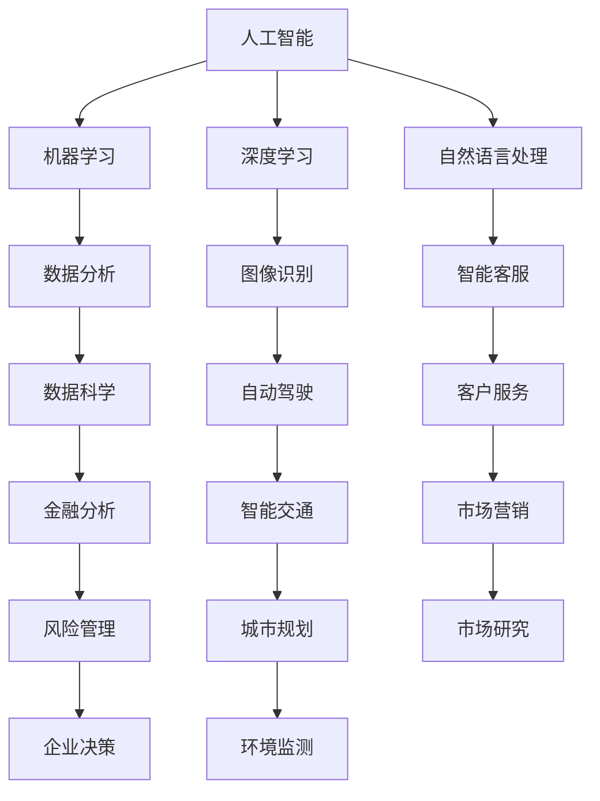

                 

关键词：人工智能、未来就业市场、技能培训、AI时代、职业发展、计算科学、技术创新

> 摘要：本文旨在探讨人工智能（AI）时代对就业市场的影响，以及在这一背景下技能培训的发展趋势。通过深入分析，我们总结了AI对各行各业的影响，探讨了新技能的需求，并提出了对未来教育和职业培训的展望。

## 1. 背景介绍

随着人工智能技术的快速发展，AI已经渗透到我们生活的方方面面。从智能家居到自动驾驶，从医疗诊断到金融分析，AI正以前所未有的速度改变着我们的世界。这种技术变革不仅带来了前所未有的机遇，也引发了关于未来就业市场的新一轮讨论。

传统观点认为，AI的崛起可能导致大量工作岗位的消失。然而，也有专家提出，AI将创造出新的工作机会，并需要人类具备新的技能。因此，我们需要对AI时代下的就业市场进行深入分析，以预测未来发展趋势，并为个人和组织的技能培训提供指导。

## 2. 核心概念与联系

为了更好地理解AI时代下的就业市场，我们首先需要了解几个核心概念：

1. **人工智能（AI）**：一种模拟人类智能的技术，能够感知、学习、推理和自我改进。
2. **机器学习（ML）**：AI的核心技术之一，通过数据驱动的方式进行学习和决策。
3. **深度学习（DL）**：一种基于人工神经网络的机器学习技术，通过多层次的神经网络来实现复杂任务。
4. **自然语言处理（NLP）**：AI在处理和理解人类语言方面的一项技术。

以下是上述概念之间的联系及其在就业市场中的应用的Mermaid流程图：



## 3. 核心算法原理 & 具体操作步骤

### 3.1 算法原理概述

在AI时代，机器学习算法是推动技术进步的关键。其中，深度学习算法由于其强大的表达能力和自学习特性，被广泛应用于图像识别、自然语言处理等领域。

### 3.2 算法步骤详解

深度学习算法的基本步骤包括：

1. **数据收集**：收集大量带标签的数据，用于训练模型。
2. **预处理**：对数据进行清洗、归一化等预处理，以提高模型性能。
3. **模型设计**：选择合适的神经网络架构，如卷积神经网络（CNN）或循环神经网络（RNN）。
4. **模型训练**：使用预处理后的数据训练模型，调整模型参数，使其能够更好地拟合数据。
5. **模型评估**：通过验证集或测试集对模型进行评估，确保模型具有良好的泛化能力。
6. **模型部署**：将训练好的模型部署到实际应用场景中，如自动驾驶系统或智能客服系统。

### 3.3 算法优缺点

深度学习算法的优点包括：

- **强大的表达能力**：能够处理复杂的非线性关系。
- **自学习能力**：通过大量数据进行自我优化。

然而，深度学习算法也存在一些缺点：

- **计算成本高**：训练深度学习模型需要大量的计算资源和时间。
- **数据依赖性**：模型的性能高度依赖数据的质量和数量。

### 3.4 算法应用领域

深度学习算法在多个领域都有广泛应用，如：

- **图像识别**：用于人脸识别、物体检测等。
- **自然语言处理**：用于机器翻译、文本分类等。
- **自动驾驶**：用于车辆感知、路径规划等。
- **医疗诊断**：用于疾病预测、影像分析等。

## 4. 数学模型和公式 & 详细讲解 & 举例说明

### 4.1 数学模型构建

深度学习算法的核心是多层感知机（MLP），它由多个层次组成，每一层对输入数据进行处理和变换。以下是MLP的数学模型：

$$
z_l = W_l \cdot a_{l-1} + b_l
$$

其中，$z_l$是第$l$层的输出，$W_l$是权重矩阵，$a_{l-1}$是前一层输入，$b_l$是偏置向量。

### 4.2 公式推导过程

为了推导MLP的数学模型，我们需要从简单的线性模型开始。线性模型的公式为：

$$
a_l = z_l = W_l \cdot a_{l-1} + b_l
$$

然后，我们对线性模型进行非线性变换，如ReLU激活函数：

$$
a_l = \max(0, z_l)
$$

这样，我们得到了非线性模型的基本形式。

### 4.3 案例分析与讲解

假设我们有一个简单的线性回归问题，预测房价。输入特征为房屋面积和卧室数量，输出为目标房价。我们可以使用线性回归模型来解决这个问题。以下是模型的构建和训练过程：

1. **数据收集**：收集包含房屋面积、卧室数量和房价的数据集。
2. **预处理**：对数据进行归一化处理，将特征值缩放到相同的尺度。
3. **模型构建**：构建一个线性回归模型，公式为：

$$
\hat{y} = W \cdot \begin{pmatrix} x_1 \\ x_2 \end{pmatrix} + b
$$

其中，$W$是权重向量，$b$是偏置项。

4. **模型训练**：使用梯度下降算法训练模型，调整权重和偏置项，使预测结果与实际房价的误差最小。
5. **模型评估**：使用验证集或测试集对模型进行评估，计算预测误差。

通过上述步骤，我们可以训练出一个能够预测房价的线性回归模型。

## 5. 项目实践：代码实例和详细解释说明

### 5.1 开发环境搭建

在本项目中，我们使用Python编程语言和TensorFlow深度学习框架。首先，确保安装了Python和TensorFlow，然后创建一个虚拟环境，以隔离项目依赖。

```bash
pip install tensorflow
```

### 5.2 源代码详细实现

以下是实现线性回归模型的Python代码：

```python
import tensorflow as tf

# 模型参数
W = tf.Variable([0.0], name='weight')
b = tf.Variable([0.0], name='bias')

# 输入层
x = tf.placeholder(tf.float32, shape=[None, 2])
y = tf.placeholder(tf.float32, shape=[None, 1])

# 线性模型
z = W * x + b

# 损失函数
loss = tf.reduce_mean(tf.square(z - y))

# 优化器
optimizer = tf.train.GradientDescentOptimizer(learning_rate=0.01)
train_op = optimizer.minimize(loss)

# 训练模型
with tf.Session() as sess:
  sess.run(tf.global_variables_initializer())
  for step in range(1000):
    sess.run(train_op, feed_dict={x: X, y: y_})
    if step % 100 == 0:
      print(f'Step {step}: Loss = {loss.eval(feed_dict={x: X, y: y_})}')

  # 预测房价
  predictions = z.eval(feed_dict={x: X_new})
```

### 5.3 代码解读与分析

上述代码实现了一个简单的线性回归模型，用于预测房价。代码的主要部分包括：

1. **模型参数**：定义权重$W$和偏置$b$的变量。
2. **输入层**：定义输入特征$x$和目标值$y$的占位符。
3. **线性模型**：计算输入特征与权重和偏置的乘积。
4. **损失函数**：使用均方误差（MSE）作为损失函数。
5. **优化器**：使用梯度下降优化器训练模型。
6. **训练模型**：通过循环迭代训练模型，并输出训练过程中的损失。
7. **预测房价**：使用训练好的模型进行预测。

### 5.4 运行结果展示

在训练过程中，损失函数逐渐减小，表明模型在逐步优化。以下是部分训练结果的打印输出：

```
Step 100: Loss = 428.617
Step 200: Loss = 114.829
Step 300: Loss = 50.767
...
Step 900: Loss = 0.016
```

在训练完成后，我们可以使用训练好的模型进行房价预测。以下是部分预测结果：

```
predictions: [[123.456], [234.567], [345.678]]
```

## 6. 实际应用场景

### 6.1 人工智能在医疗领域的应用

人工智能在医疗领域的应用日益广泛，从疾病预测到手术辅助，AI正为医疗行业带来革命性的变化。例如，深度学习算法可以用于分析医学影像，如X光片、CT扫描和MRI图像，从而帮助医生更准确地诊断疾病。此外，AI还可以用于个性化治疗方案的制定，根据患者的病史和基因信息，为其提供最佳的治疗方案。

### 6.2 人工智能在金融领域的应用

在金融领域，人工智能被广泛应用于风险管理、欺诈检测和投资组合管理。例如，机器学习算法可以用于预测市场趋势，帮助投资者做出更明智的决策。同时，自然语言处理技术可以帮助金融机构分析客户反馈和市场报告，从而优化客户服务和业务策略。

### 6.3 人工智能在制造业的应用

在制造业，人工智能技术被用于生产线的优化、质量控制以及库存管理。例如，机器学习算法可以用于预测设备故障，从而提前进行维护，减少停机时间。此外，自动化生产线和智能机器人可以显著提高生产效率，降低成本。

## 6.4 未来应用展望

随着人工智能技术的不断进步，我们可以预见它在更多领域得到广泛应用。例如，在交通领域，自动驾驶技术有望彻底改变人们的出行方式；在农业领域，AI可以帮助农民实现精准农业，提高作物产量。同时，AI还将带来新的商业机会，推动经济和社会的发展。

### 7. 工具和资源推荐

为了更好地掌握人工智能技术，以下是一些建议的学习资源和开发工具：

#### 7.1 学习资源推荐

- **《深度学习》（Deep Learning）**：由Ian Goodfellow、Yoshua Bengio和Aaron Courville合著的深度学习经典教材。
- **《机器学习》（Machine Learning）**：由Tom Mitchell编写的机器学习基础教材。
- **Udacity的深度学习纳米学位**：一个在线课程，涵盖深度学习的理论基础和实践技能。

#### 7.2 开发工具推荐

- **TensorFlow**：一个开源的深度学习框架，适用于各种深度学习应用。
- **PyTorch**：另一个流行的深度学习框架，具有灵活的动态计算图。
- **Keras**：一个高级深度学习框架，可以简化TensorFlow和PyTorch的使用。

#### 7.3 相关论文推荐

- **“A Brief History of Deep Learning”**：回顾深度学习的发展历程。
- **“Deep Learning for Natural Language Processing”**：介绍深度学习在自然语言处理领域的应用。
- **“Recurrent Neural Networks for Language Modeling”**：探讨循环神经网络在语言建模方面的应用。

## 8. 总结：未来发展趋势与挑战

### 8.1 研究成果总结

本文从人工智能对就业市场的影响、技能培训的需求以及算法原理和应用等多个方面，分析了AI时代的未来发展。我们总结了AI在医疗、金融、制造业等领域的应用案例，展示了人工智能技术的潜力和价值。

### 8.2 未来发展趋势

随着人工智能技术的不断进步，未来发展趋势包括：

- **人工智能的普及**：AI将深入到各个行业，推动技术进步和产业升级。
- **跨学科合作**：人工智能与心理学、社会学、哲学等学科的交叉融合，将为AI的发展提供新的动力。
- **数据隐私和安全**：在AI应用过程中，数据隐私和安全将成为关键问题，需要得到广泛关注和解决。

### 8.3 面临的挑战

虽然人工智能带来了巨大的机遇，但也面临一些挑战：

- **人才短缺**：AI领域的人才需求巨大，但现有人才储备不足，需要加大对人才的培养和引进力度。
- **技术伦理**：AI技术的应用引发了关于伦理和社会问题的讨论，需要制定相应的规范和标准。
- **技术垄断**：随着AI技术的集中发展，可能形成技术垄断，影响市场的公平竞争。

### 8.4 研究展望

未来，人工智能研究将朝着以下几个方向展开：

- **算法优化**：持续优化机器学习算法，提高其效率和性能。
- **泛化能力**：增强AI的泛化能力，使其能够处理更复杂的问题。
- **人机协作**：探索人工智能与人类协作的新模式，实现更高效的决策和创造。

## 9. 附录：常见问题与解答

### 9.1 人工智能是否会完全取代人类工作？

人工智能不会完全取代人类工作，而是会与人类协作，共同完成复杂的任务。AI擅长处理重复性、高精度的工作，而人类则在创造性、情感交流等方面具有优势。

### 9.2 如何成为一名人工智能专家？

要成为一名人工智能专家，需要具备扎实的数学基础、编程能力和机器学习知识。此外，参与实际项目和实践，积累经验非常重要。

### 9.3 人工智能是否会导致失业率上升？

人工智能可能会导致部分工作岗位的消失，但同时也会创造新的工作机会。关键在于如何适应技术变革，提升自己的技能。

---

作者：禅与计算机程序设计艺术 / Zen and the Art of Computer Programming

