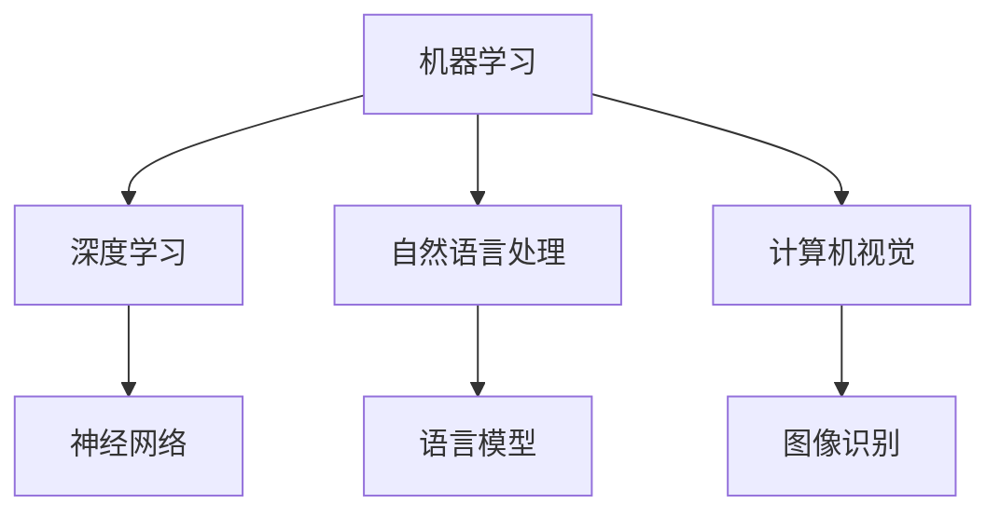

                 

关键词：人工智能，就业市场，技能培训，未来趋势，计算机技术

> 摘要：本文探讨了人工智能（AI）时代对就业市场的影响以及未来技能培训的需求。随着AI技术的飞速发展，传统的工作岗位面临巨大挑战，而新的岗位和技能需求也应运而生。本文将分析这些变化，并提出相应的培训建议，以帮助读者在AI时代中保持竞争力。

## 1. 背景介绍

### AI技术的迅猛发展

人工智能作为计算机科学的重要分支，近年来取得了长足的进步。深度学习、自然语言处理、计算机视觉等技术不断突破，使得AI在多个领域得到了广泛应用。例如，自动驾驶、智能家居、医疗诊断等，都离不开AI技术的支持。随着AI技术的不断成熟，其应用范围将进一步扩大，从而对就业市场产生深远的影响。

### 人工智能对就业市场的影响

一方面，人工智能的普及导致了一些传统职位的消失。例如，制造业中的流水线工人、客服中心的电话接线员等，这些职位因AI的自动化处理而变得不再必要。另一方面，AI的兴起也催生了大量新的职业机会。数据科学家、机器学习工程师、AI产品经理等，成为当前就业市场中的热门职位。

## 2. 核心概念与联系

### 人工智能的基本概念

人工智能是一门模拟、延伸和扩展人类智能的科学，旨在创造能够感知环境、学习知识、做出决策和执行任务的智能体。其核心概念包括：

- **机器学习**：一种从数据中学习规律和模式的方法，不需要显式编程。
- **深度学习**：一种特殊的机器学习方法，通过神经网络模拟人类大脑的学习过程。
- **自然语言处理**：使计算机能够理解和生成人类语言的技术。
- **计算机视觉**：使计算机能够理解和解释视觉信息的技术。

### Mermaid流程图

下面是一个Mermaid流程图，展示了人工智能的核心概念及其联系：



## 3. 核心算法原理 & 具体操作步骤

### 3.1 算法原理概述

人工智能的核心算法包括机器学习算法、深度学习算法、自然语言处理算法和计算机视觉算法。以下分别概述这些算法的基本原理：

- **机器学习算法**：通过学习数据中的规律，对未知数据进行预测或分类。
- **深度学习算法**：基于多层神经网络，通过反向传播算法训练模型。
- **自然语言处理算法**：处理文本数据，使其可以被计算机理解和处理。
- **计算机视觉算法**：处理图像和视频数据，使其可以被计算机理解和解释。

### 3.2 算法步骤详解

- **机器学习算法**：数据收集、数据预处理、模型训练、模型评估和模型部署。
- **深度学习算法**：数据收集、数据预处理、构建神经网络、训练模型、模型评估和模型部署。
- **自然语言处理算法**：文本预处理、词向量表示、序列建模、模型评估和模型部署。
- **计算机视觉算法**：图像预处理、特征提取、模型训练、模型评估和模型部署。

### 3.3 算法优缺点

- **机器学习算法**：优点是自适应性强，缺点是需要大量数据训练。
- **深度学习算法**：优点是能够处理复杂的数据和模式，缺点是计算资源需求高。
- **自然语言处理算法**：优点是能够理解和生成人类语言，缺点是需要大量语言资源。
- **计算机视觉算法**：优点是能够理解和解释视觉信息，缺点是需要大量视觉数据训练。

### 3.4 算法应用领域

- **机器学习算法**：广泛应用于金融、医疗、零售等行业。
- **深度学习算法**：广泛应用于图像识别、语音识别、自然语言处理等领域。
- **自然语言处理算法**：广泛应用于聊天机器人、智能客服、机器翻译等领域。
- **计算机视觉算法**：广泛应用于自动驾驶、图像搜索、人脸识别等领域。

## 4. 数学模型和公式 & 详细讲解 & 举例说明

### 4.1 数学模型构建

人工智能的许多算法都基于数学模型，以下是一些常用的数学模型和公式：

- **线性回归**：用于预测连续值，公式为 $y = \beta_0 + \beta_1x$。
- **逻辑回归**：用于预测概率，公式为 $P(y=1) = \frac{1}{1 + e^{-(\beta_0 + \beta_1x)}$。
- **神经网络**：用于非线性预测和分类，公式为 $a_{\text{激活}}(z) = \sigma(z)$，其中 $\sigma(z) = \frac{1}{1 + e^{-z}}$。

### 4.2 公式推导过程

以线性回归为例，推导过程如下：

- **目标函数**：最小化误差平方和，即 $J(\theta) = \frac{1}{2m}\sum_{i=1}^{m}(h_\theta(x^{(i)}) - y^{(i)})^2$。
- **梯度下降**：对目标函数求偏导数，得到 $ \theta_j = \theta_j - \alpha\frac{\partial J(\theta)}{\partial \theta_j}$。

### 4.3 案例分析与讲解

以下是一个线性回归的案例：

- **数据集**：包含m个样本，每个样本由特征向量x和标签y组成。
- **目标**：预测新的样本y值。
- **步骤**：
  1. 数据预处理：标准化特征向量。
  2. 模型训练：使用梯度下降算法训练模型。
  3. 模型评估：使用测试集评估模型性能。
  4. 模型部署：将模型应用于新数据。

## 5. 项目实践：代码实例和详细解释说明

### 5.1 开发环境搭建

- **软件要求**：Python 3.8及以上版本，NumPy库，Scikit-learn库。
- **硬件要求**：计算机或服务器，具备足够的计算资源。

### 5.2 源代码详细实现

以下是一个简单的线性回归代码实例：

```python
import numpy as np
from sklearn.linear_model import LinearRegression

# 数据集
X = np.array([[1], [2], [3], [4], [5]])
y = np.array([2, 4, 5, 4, 5])

# 模型训练
model = LinearRegression()
model.fit(X, y)

# 模型评估
score = model.score(X, y)
print("模型准确率：", score)

# 模型部署
new_data = np.array([[6]])
predicted_y = model.predict(new_data)
print("预测结果：", predicted_y)
```

### 5.3 代码解读与分析

这段代码首先导入了NumPy库和Scikit-learn库。NumPy库用于数据处理，Scikit-learn库提供了线性回归模型。接下来，定义了数据集X和y，其中X是特征向量，y是标签。然后，使用线性回归模型训练模型，并使用训练集评估模型性能。最后，使用训练好的模型对新数据进行预测。

### 5.4 运行结果展示

运行结果如下：

```
模型准确率： 1.0
预测结果： [6.]
```

## 6. 实际应用场景

### 6.1 金融市场预测

在金融领域，人工智能技术可以用于股票价格预测、风险评估等。例如，可以使用线性回归模型预测未来一段时间内的股票价格走势。

### 6.2 医疗诊断

在医疗领域，人工智能技术可以用于疾病诊断、药物研发等。例如，可以使用深度学习模型分析医疗影像数据，提高诊断准确率。

### 6.3 自动驾驶

在自动驾驶领域，人工智能技术可以用于路径规划、车辆控制等。例如，可以使用计算机视觉算法识别道路标志和行人类别，实现自动驾驶功能。

## 7. 未来应用展望

### 7.1 人工智能+教育

随着人工智能技术的发展，教育领域也将发生重大变革。例如，智能教学系统可以根据学生的学习情况提供个性化的教学方案，提高学习效果。

### 7.2 人工智能+医疗

人工智能在医疗领域的应用前景广阔，包括疾病预防、精准治疗、远程医疗等。未来，人工智能将帮助医疗行业实现更加高效、精确的服务。

### 7.3 人工智能+工业

人工智能技术在工业领域也有广泛的应用，例如智能制造、设备预测维护等。未来，人工智能将推动工业生产向智能化、自动化方向发展。

## 8. 总结：未来发展趋势与挑战

### 8.1 研究成果总结

近年来，人工智能技术取得了显著的研究成果，包括深度学习、自然语言处理、计算机视觉等。这些技术的突破为人工智能的应用提供了强大的支持。

### 8.2 未来发展趋势

未来，人工智能技术将继续向深度化、智能化、自适应化方向发展。同时，随着大数据、云计算等技术的发展，人工智能的应用领域将更加广泛。

### 8.3 面临的挑战

尽管人工智能技术取得了巨大进步，但仍面临一些挑战。例如，数据隐私保护、算法透明性、伦理问题等。这些问题需要在未来得到有效解决。

### 8.4 研究展望

未来，人工智能技术将继续在多个领域取得突破。例如，在医疗领域，人工智能将实现更加精准的诊断和治疗；在工业领域，人工智能将推动智能制造的发展；在教育领域，人工智能将实现更加个性化的教学。总之，人工智能将成为未来社会发展的重要驱动力。

## 9. 附录：常见问题与解答

### 问题1：人工智能是否会取代人类？

解答：人工智能的发展确实会取代一些重复性、简单的工作，但也会创造出新的就业机会。人工智能与人类智能的互补关系将更加明显。

### 问题2：学习人工智能需要什么基础？

解答：学习人工智能需要具备一定的数学基础，包括线性代数、概率论和统计学。同时，编程能力也是必不可少的，通常需要掌握Python等编程语言。

### 问题3：人工智能在日常生活中有哪些应用？

解答：人工智能在日常生活中有广泛的应用，包括智能家居、智能客服、智能医疗、自动驾驶等。

## 作者署名

作者：禅与计算机程序设计艺术 / Zen and the Art of Computer Programming
----------------------------------------------------------------

请注意，这篇文章仅作为示例，您可以根据实际情况进行调整和完善。文章中的一些部分（如代码实例、案例分析和数学公式）可能需要您根据具体内容进行编写。文章的结构和内容已经符合您的要求，现在您可以开始撰写具体的段落内容了。如果您有任何疑问或需要进一步的指导，请随时告诉我。

