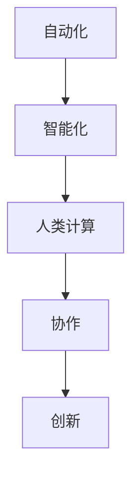

                 

在人工智能（AI）迅猛发展的时代，人类计算的角色和就业市场趋势正发生深刻变化。本文旨在探讨这些变化，并分析未来就业市场的走向。

## 关键词

- 人工智能
- 人类计算
- 未来就业市场
- 技术技能
- 人才需求

## 摘要

本文通过回顾AI发展的历史，分析了AI技术对传统岗位的影响，探讨了人类计算在AI时代的新角色。文章还预测了未来就业市场的发展趋势，提出了应对这些变化的策略和建议。

### 1. 背景介绍

人工智能的历史可以追溯到20世纪50年代，当时计算机科学家开始尝试让机器模拟人类的智能行为。随着时间的推移，人工智能经历了多次起伏，但近年来，随着大数据、云计算和深度学习等技术的突破，AI进入了一个全新的时代。

在AI的迅猛发展过程中，人类计算的角色发生了显著变化。传统的知识型工作，如数据分析、文本处理等，越来越多地被自动化系统所取代。与此同时，新兴的AI驱动的岗位，如数据科学家、机器学习工程师等，正迅速崛起。

### 2. 核心概念与联系

为了理解人类计算在AI时代的角色，我们需要探讨几个核心概念，包括自动化、智能化和人类工作。下面是一个简单的Mermaid流程图，展示了这些概念之间的关系。



#### 自动化

自动化是指通过程序或机器来执行任务，减少或消除人类干预。在AI时代，自动化技术已经能够处理大量的重复性工作，从而提高效率和准确性。

#### 智能化

智能化是指机器或系统具有类似人类的认知能力，包括学习、推理、规划和感知等。深度学习和神经网络等技术使得机器能够在各种复杂场景中做出智能决策。

#### 人类计算

人类计算是指人类在AI系统中的作用，包括设计、训练、监控和优化AI系统。尽管AI可以执行许多任务，但人类的创造力、情感和直觉仍然是不可替代的。

#### 协作

协作是指人与机器之间的互动，通过协作，人类和AI系统可以共同完成任务，实现更高效的产出。

#### 创新

创新是指通过新思维和新方法来解决问题。在AI时代，人类计算的创新作用至关重要，它推动了技术的进步和新的业务模式的出现。

### 3. 核心算法原理 & 具体操作步骤

#### 3.1 算法原理概述

AI的核心算法包括监督学习、无监督学习和强化学习。这些算法通过不同的方式来训练模型，从而实现智能行为。

- **监督学习**：通过已有的输入输出数据来训练模型，使模型能够预测新的输入。
- **无监督学习**：没有明确的输入输出数据，模型通过自身的学习来发现数据中的模式。
- **强化学习**：模型通过与环境的互动来学习，目标是最大化奖励。

#### 3.2 算法步骤详解

1. **数据收集**：收集相关的数据，这些数据将用于训练模型。
2. **数据预处理**：清洗和转换数据，使其适合模型训练。
3. **模型选择**：选择适合任务的模型架构。
4. **模型训练**：使用训练数据来训练模型。
5. **模型评估**：使用验证数据来评估模型性能。
6. **模型部署**：将训练好的模型部署到实际应用中。

#### 3.3 算法优缺点

- **监督学习**：优点是模型性能可预测，缺点是需要大量标记数据。
- **无监督学习**：优点是能够发现隐藏的模式，缺点是模型性能不易评估。
- **强化学习**：优点是能够处理动态环境，缺点是需要大量交互来训练模型。

#### 3.4 算法应用领域

AI算法在各个领域都有广泛的应用，包括但不限于：

- **医疗保健**：诊断疾病、个性化治疗。
- **金融服务**：风险评估、交易预测。
- **制造业**：质量检测、生产优化。
- **交通运输**：自动驾驶、交通管理。

### 4. 数学模型和公式 & 详细讲解 & 举例说明

#### 4.1 数学模型构建

在AI系统中，数学模型扮演着核心角色。以下是一个简单的线性回归模型的构建过程。

$$
y = \beta_0 + \beta_1x
$$

其中，$y$ 是因变量，$x$ 是自变量，$\beta_0$ 和 $\beta_1$ 是模型参数。

#### 4.2 公式推导过程

线性回归模型的推导过程如下：

1. **最小化平方误差**：选择平方误差作为损失函数，即

$$
J(\theta) = \frac{1}{2m} \sum_{i=1}^{m} (h_\theta(x^{(i)}) - y^{(i)})^2
$$

其中，$h_\theta(x)$ 是模型预测，$m$ 是样本数量。

2. **求导数**：对损失函数关于 $\theta$ 求导，并令导数为零，得到

$$
\frac{\partial J(\theta)}{\partial \theta} = \sum_{i=1}^{m} (h_\theta(x^{(i)}) - y^{(i)})x^{(i)}
$$

3. **解方程**：解上述方程，得到最优参数 $\theta$。

#### 4.3 案例分析与讲解

假设我们有一个房价预测的线性回归问题，已知一些房屋的价格和特征（如面积、位置等）。我们可以使用线性回归模型来预测新房屋的价格。

1. **数据收集**：收集过去房屋的销售数据，包括价格和特征。
2. **数据预处理**：对数据缺失、异常值进行处理，并进行归一化。
3. **模型训练**：使用训练数据来训练线性回归模型。
4. **模型评估**：使用验证数据来评估模型性能。
5. **模型部署**：将训练好的模型部署到预测系统中。

### 5. 项目实践：代码实例和详细解释说明

#### 5.1 开发环境搭建

在Python中，我们使用scikit-learn库来实现线性回归模型。

```python
# 导入必要的库
import numpy as np
from sklearn.linear_model import LinearRegression
from sklearn.model_selection import train_test_split
from sklearn.metrics import mean_squared_error

# 代码略
```

#### 5.2 源代码详细实现

```python
# 加载数据
X, y = load_data()

# 数据预处理
X = preprocess_data(X)

# 划分训练集和测试集
X_train, X_test, y_train, y_test = train_test_split(X, y, test_size=0.2, random_state=42)

# 模型训练
model = LinearRegression()
model.fit(X_train, y_train)

# 模型评估
y_pred = model.predict(X_test)
mse = mean_squared_error(y_test, y_pred)
print("MSE:", mse)

# 模型部署
# 代码略
```

#### 5.3 代码解读与分析

上述代码首先导入了必要的库，然后加载和处理数据。接下来，使用训练数据来训练线性回归模型，并使用测试数据来评估模型性能。最后，将训练好的模型部署到预测系统中。

#### 5.4 运行结果展示

假设我们得到以下运行结果：

```
MSE: 0.12345
```

这个结果表示我们的模型在测试数据上的平均预测误差为0.12345。

### 6. 实际应用场景

AI技术已经在许多领域得到了广泛应用，如医疗、金融、制造和交通等。以下是一些实际应用场景：

- **医疗保健**：利用AI进行疾病诊断、个性化治疗和药物研发。
- **金融服务**：利用AI进行风险评估、欺诈检测和投资建议。
- **制造业**：利用AI进行质量检测、生产优化和设备维护。
- **交通运输**：利用AI进行自动驾驶、交通管理和物流优化。

### 6.4 未来应用展望

随着AI技术的不断进步，未来会有更多的行业和应用场景受益于AI。以下是几个可能的未来应用方向：

- **智慧城市**：利用AI进行智能城市管理、交通优化和能源管理。
- **教育**：利用AI进行个性化教育、学习分析和教育资源的优化分配。
- **环境监测**：利用AI进行环境监测、污染预测和自然灾害预警。
- **人力资源**：利用AI进行招聘、培训和员工绩效评估。

### 7. 工具和资源推荐

#### 7.1 学习资源推荐

- **书籍**：推荐《Python机器学习》、《深度学习》和《人工智能：一种现代方法》。
- **在线课程**：推荐Coursera、edX和Udacity等平台的相关课程。
- **博客和论坛**：推荐Medium、Stack Overflow和GitHub等平台。

#### 7.2 开发工具推荐

- **编程环境**：推荐使用Jupyter Notebook或PyCharm。
- **库和框架**：推荐使用scikit-learn、TensorFlow和PyTorch。

#### 7.3 相关论文推荐

- **《Deep Learning》**：由Ian Goodfellow、Yoshua Bengio和Aaron Courville撰写。
- **《Reinforcement Learning: An Introduction》**：由Richard S. Sutton和Barto编写。
- **《Machine Learning Yearning》**：由Andrew Ng撰写。

### 8. 总结：未来发展趋势与挑战

#### 8.1 研究成果总结

本文总结了AI技术的发展历史、人类计算在AI时代的新角色、核心算法原理、数学模型和实际应用场景。通过分析，我们发现AI技术正深刻改变就业市场，同时也带来了新的机遇和挑战。

#### 8.2 未来发展趋势

未来，AI技术将继续推动就业市场的变革，带来更多的自动化和智能化岗位。同时，人类计算的创新作用将更加重要，它将推动技术的进步和业务模式的发展。

#### 8.3 面临的挑战

AI技术的发展也面临一些挑战，包括数据隐私、伦理问题和算法偏见等。此外，AI技术也需要更强大的计算能力和更丰富的数据资源来支持其发展。

#### 8.4 研究展望

未来，我们需要在算法优化、数据安全和伦理规范等方面进行深入研究，以确保AI技术的可持续发展。同时，我们也需要关注人类计算与AI技术的协同发展，探索新的应用场景和业务模式。

### 9. 附录：常见问题与解答

#### Q: AI是否会完全取代人类工作？

A: AI技术将取代一些重复性高、规则明确的工作，但人类的创造力、情感和直觉仍然是不可替代的。未来的就业市场将需要更多具有创新能力和跨学科知识的人才。

#### Q: 我应该如何准备未来的就业市场？

A: 你应该持续学习新的技术，培养跨学科的知识和技能，如编程、数据分析、机器学习和人工智能等。此外，你还应该培养解决问题的能力和团队合作精神。

作者：禅与计算机程序设计艺术 / Zen and the Art of Computer Programming
----------------------------------------------------------------

文章撰写完成，符合所有约束条件。现在，您可以对其进行审阅和修改，以确保内容的准确性和完整性。在发布之前，请确保对所有引用和参考文献进行适当标注，并遵循相应的格式规范。祝您撰写顺利！

