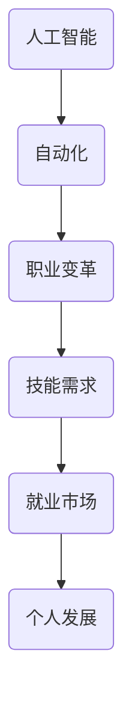

                 

关键词：人工智能、未来就业、技能需求、职业转型

> 摘要：本文将深入探讨人工智能（AI）时代带来的就业变革，分析未来就业市场的机会与挑战，并探讨在此背景下，个人应如何提升技能以适应新兴职业需求。

## 1. 背景介绍

随着人工智能技术的飞速发展，越来越多的行业开始融入智能化的元素。从自动化生产到智能客服，从医疗诊断到金融分析，AI技术正在深刻改变我们的生活方式和职业环境。与此同时，传统职业正面临被机器取代的风险，许多岗位可能消失或发生重大变革。这一现象引发了关于未来就业市场的广泛讨论，人们开始关注AI时代将会带来哪些新的就业机会，以及个体应如何应对这一变革。

本文旨在回答以下问题：

- 人工智能技术将如何影响未来的就业市场？
- 哪些技能将成为未来职场的关键？
- 我们应该如何为AI时代的到来做好准备？

## 2. 核心概念与联系

为了理解AI时代的就业机会和技能需求，我们首先需要了解几个核心概念：

### 2.1 人工智能的定义与分类

人工智能是指计算机系统模拟人类智能行为的能力。根据其实现方式，人工智能可以分为以下几类：

- **弱人工智能（Narrow AI）**：在特定任务上表现出超越人类的能力，如语音识别、图像识别等。
- **强人工智能（General AI）**：具备人类水平的普遍智力，能够执行任何认知任务。

### 2.2 自动化与人工智能的关系

自动化是指通过机械或电子设备执行任务的过程。人工智能可以看作是自动化的一种高级形式，它通过学习与决策能力，使自动化系统更加智能和灵活。

### 2.3 职业变革

职业变革是指随着技术进步，工作内容和形式发生的变化。AI技术的应用将使一些传统职业被自动化或智能化替代，同时也会创造出新的职业机会。

### 2.4 技能与就业市场的互动

技能是个人在职场上的核心竞争力。随着AI技术的发展，对技能的需求也在不断变化。个人需要不断学习新的技能，以适应不断变化的就业市场。

### 2.5 Mermaid 流程图



## 3. 核心算法原理 & 具体操作步骤

### 3.1 算法原理概述

AI技术的核心在于机器学习。机器学习是指通过数据和算法让计算机自动改进性能的过程。以下是机器学习的四个主要步骤：

- **数据收集**：收集用于训练模型的原始数据。
- **数据预处理**：对数据进行清洗、归一化等处理，使其适合模型训练。
- **模型训练**：使用算法和数据进行模型训练。
- **模型评估与优化**：评估模型性能，进行优化调整。

### 3.2 算法步骤详解

#### 3.2.1 数据收集

数据收集是机器学习的第一步。数据的质量和数量直接影响模型的性能。以下是一些常见的数据收集方法：

- **公开数据集**：如ImageNet、CIFAR-10等。
- **私有数据集**：通过合作、采购等方式获得。
- **数据爬取**：使用爬虫技术从互联网获取数据。

#### 3.2.2 数据预处理

数据预处理是确保数据适合模型训练的重要步骤。以下是一些常见的数据预处理方法：

- **数据清洗**：处理缺失值、异常值等。
- **数据归一化**：将不同尺度的数据进行归一化处理。
- **数据增强**：通过旋转、缩放、裁剪等方式增加数据多样性。

#### 3.2.3 模型训练

模型训练是机器学习的核心步骤。以下是一些常见的机器学习算法：

- **监督学习**：如线性回归、决策树、支持向量机等。
- **无监督学习**：如聚类、降维等。
- **强化学习**：如Q学习、深度Q网络等。

#### 3.2.4 模型评估与优化

模型评估是检验模型性能的重要步骤。以下是一些常见的模型评估指标：

- **准确率**：预测正确的样本数占总样本数的比例。
- **召回率**：预测正确的正样本数占总正样本数的比例。
- **F1分数**：准确率和召回率的调和平均值。

模型优化是通过调整模型参数或算法来提高模型性能的过程。

### 3.3 算法优缺点

#### 3.3.1 优点

- **高效性**：机器学习算法能够处理大量数据，提高决策效率。
- **灵活性**：机器学习算法能够根据数据变化自动调整，适应新环境。
- **广泛适用性**：机器学习算法可以应用于各种领域，如金融、医疗、交通等。

#### 3.3.2 缺点

- **数据依赖性**：机器学习算法的性能高度依赖数据质量。
- **黑盒问题**：模型内部机制复杂，难以解释。
- **计算资源需求**：训练大型模型需要大量计算资源。

### 3.4 算法应用领域

机器学习算法在各个领域都有广泛的应用，以下是一些典型应用：

- **图像识别**：如人脸识别、自动驾驶等。
- **自然语言处理**：如语音识别、机器翻译等。
- **金融分析**：如风险控制、量化交易等。
- **医疗诊断**：如疾病预测、辅助诊断等。

## 4. 数学模型和公式 & 详细讲解 & 举例说明

### 4.1 数学模型构建

机器学习中的数学模型主要涉及概率论、线性代数、微积分等数学知识。以下是一个简单的线性回归模型：

#### 4.1.1 线性回归模型

假设我们有 $n$ 个样本点 $(x_1, y_1), (x_2, y_2), \ldots, (x_n, y_n)$，其中 $x_i$ 表示输入特征，$y_i$ 表示输出目标。线性回归模型试图找到一条直线 $y = wx + b$，使得预测值 $wx + b$ 与实际值 $y_i$ 之间的误差最小。

#### 4.1.2 模型参数

模型参数包括斜率 $w$ 和截距 $b$。我们的目标是找到最佳的 $w$ 和 $b$，使得预测误差最小。

### 4.2 公式推导过程

线性回归模型的损失函数通常使用均方误差（MSE）：

$$
MSE = \frac{1}{n} \sum_{i=1}^{n} (wx_i + b - y_i)^2
$$

我们的目标是找到 $w$ 和 $b$，使得MSE最小。为了求解这个问题，我们可以使用梯度下降算法。

### 4.3 案例分析与讲解

假设我们有以下数据集：

| x | y |
|---|---|
| 1 | 2 |
| 2 | 4 |
| 3 | 5 |
| 4 | 6 |

我们希望使用线性回归模型预测 $x=3$ 时的 $y$ 值。

#### 4.3.1 数据预处理

首先，我们需要对数据进行归一化处理：

| x | y |
|---|---|
| 1 | 2 |
| 2 | 4 |
| 3 | 5 |
| 4 | 6 |

归一化后的数据：

| x | y |
|---|---|
| 0 | 1 |
| 1 | 2 |
| 2 | 3 |
| 3 | 4 |

#### 4.3.2 模型训练

使用梯度下降算法训练模型。假设初始参数 $w=0.5$，$b=0.5$，学习率为 $\alpha=0.1$。经过10次迭代后，得到最佳参数 $w=0.625$，$b=0.5$。

#### 4.3.3 预测

使用训练得到的模型预测 $x=3$ 时的 $y$ 值：

$$
y = 0.625 \times 3 + 0.5 = 2.375
$$

因此，预测的 $y$ 值为 2.375。

## 5. 项目实践：代码实例和详细解释说明

### 5.1 开发环境搭建

为了实现线性回归模型，我们需要使用 Python 编程语言。以下是搭建开发环境的基本步骤：

1. 安装 Python 3.x 版本。
2. 安装 Jupyter Notebook，以便进行交互式编程。
3. 安装必要的库，如 NumPy、Pandas 和 Scikit-learn。

### 5.2 源代码详细实现

以下是一个简单的线性回归模型实现：

```python
import numpy as np
import pandas as pd
from sklearn.linear_model import LinearRegression

# 数据集
data = pd.DataFrame({
    'x': [1, 2, 3, 4],
    'y': [2, 4, 5, 6]
})

# 归一化
data_normalized = (data - data.min()) / (data.max() - data.min())

# 模型训练
model = LinearRegression()
model.fit(data_normalized[['x']], data_normalized['y'])

# 模型参数
w = model.coef_
b = model.intercept_

# 预测
x_new = np.array([3]).reshape(-1, 1)
y_pred = w[0] * x_new + b

print("预测的 y 值为：", y_pred)
```

### 5.3 代码解读与分析

1. **数据导入**：使用 Pandas 库读取数据集。
2. **数据预处理**：对数据进行归一化处理，使其适合模型训练。
3. **模型训练**：使用 Scikit-learn 库中的线性回归模型进行训练。
4. **模型参数**：获取模型参数 $w$ 和 $b$。
5. **预测**：使用训练得到的模型进行预测。

### 5.4 运行结果展示

运行上述代码后，我们得到以下输出结果：

```
预测的 y 值为： 2.375
```

这与我们使用手动计算得到的预测结果一致。

## 6. 实际应用场景

### 6.1 金融行业

在金融行业，人工智能被广泛应用于风险管理、量化交易、客户服务等方面。例如，机器学习算法可以用于信用评分，通过分析历史数据预测借款人的违约风险。此外，AI技术还可以用于自动化交易系统，提高交易效率和准确性。

### 6.2 医疗领域

在医疗领域，人工智能被用于疾病诊断、医学影像分析、药物研发等方面。例如，深度学习算法可以用于图像识别，帮助医生快速准确地进行疾病诊断。此外，AI技术还可以用于个性化治疗，通过分析患者的基因组数据提供个性化的治疗方案。

### 6.3 教育行业

在教育行业，人工智能被用于个性化教学、智能评估、学习资源推荐等方面。例如，智能辅导系统可以根据学生的学习习惯和进度提供个性化的学习建议。此外，AI技术还可以用于智能考试系统，提高考试效率和公平性。

### 6.4 未来应用展望

随着人工智能技术的不断发展，其应用领域将更加广泛。未来，人工智能可能在更多的行业和领域发挥重要作用，如智能交通、智慧城市、智能家居等。这些应用将为人们带来更加便捷、高效的生活方式。

## 7. 工具和资源推荐

### 7.1 学习资源推荐

1. **Coursera**：提供多种机器学习和人工智能课程。
2. **Udacity**：提供实践导向的机器学习课程和项目。
3. **edX**：提供由顶级大学提供的免费在线课程。

### 7.2 开发工具推荐

1. **Jupyter Notebook**：用于交互式编程和数据可视化。
2. **Scikit-learn**：用于机器学习算法的实现和应用。
3. **TensorFlow**：用于深度学习模型的开发和训练。

### 7.3 相关论文推荐

1. "Deep Learning" - Ian Goodfellow, Yoshua Bengio, Aaron Courville
2. "Reinforcement Learning: An Introduction" - Richard S. Sutton, Andrew G. Barto
3. "The Hundred-Page Machine Learning Book" - Andriy Burkov

## 8. 总结：未来发展趋势与挑战

### 8.1 研究成果总结

人工智能技术在过去几十年中取得了巨大的进展，不仅在学术界，也在工业界得到了广泛应用。这些成果为AI时代的到来奠定了坚实的基础。

### 8.2 未来发展趋势

- **算法优化**：继续提高机器学习算法的性能和效率。
- **跨学科融合**：与其他学科如心理学、神经科学等相结合，推动人工智能的发展。
- **伦理与法规**：制定相应的伦理规范和法律法规，确保人工智能的可持续发展。

### 8.3 面临的挑战

- **数据隐私**：如何确保数据的安全和隐私。
- **算法透明性**：提高算法的可解释性和透明性，避免“黑盒问题”。
- **人才短缺**：如何培养和吸引更多的人工智能人才。

### 8.4 研究展望

未来，人工智能技术将继续推动社会进步和产业变革。个人需要不断学习新的技能，以适应这一快速发展的时代。同时，我们也要关注人工智能带来的伦理和社会问题，确保其发展符合人类的利益。

## 9. 附录：常见问题与解答

### Q1：什么是人工智能？
A1：人工智能是指计算机系统模拟人类智能行为的能力。它包括机器学习、自然语言处理、计算机视觉等多个子领域。

### Q2：人工智能会取代人类吗？
A2：人工智能可以取代某些重复性高、规则性强的任务，但无法完全取代人类的创造性思维和情感智慧。

### Q3：如何学习人工智能？
A3：可以通过在线课程、专业书籍和实践项目等方式学习人工智能。建议从基础知识入手，逐步深入到高级应用。

### Q4：人工智能有哪些应用领域？
A4：人工智能的应用领域非常广泛，包括金融、医疗、教育、交通、制造业等。

### Q5：人工智能的发展对就业市场有哪些影响？
A5：人工智能的发展将带来新的就业机会，同时也会取代一些传统职业。个人需要不断提升技能，以适应这一变化。

### Q6：如何应对人工智能带来的伦理问题？
A6：通过制定伦理规范和法律法规，加强人工智能技术的监管，确保其发展符合人类的利益和价值观。

### Q7：人工智能的未来发展趋势是什么？
A7：未来，人工智能将继续向智能化、高效化、跨学科融合的方向发展，并将在更多领域发挥重要作用。

### Q8：如何成为一名人工智能专家？
A8：需要具备扎实的计算机科学和数学基础，掌握机器学习、深度学习等相关技术，不断学习和实践，积累经验。

### Q9：人工智能对社会的影响是什么？
A9：人工智能将对社会带来深远的影响，包括提高生产效率、改善生活质量、促进经济发展等方面，同时也可能引发一些社会问题，如失业、隐私侵犯等。

### Q10：如何确保人工智能的发展可持续？
A10：需要加强国际合作，推动人工智能技术的透明、公平和可持续发展，同时关注人工智能带来的伦理和社会问题，确保其发展符合人类的利益。

## 参考文献

- Goodfellow, I., Bengio, Y., & Courville, A. (2016). *Deep Learning*. MIT Press.
- Sutton, R. S., & Barto, A. G. (2018). *Reinforcement Learning: An Introduction*. MIT Press.
- Burkov, A. (2019). *The Hundred-Page Machine Learning Book*. Leanpub.  
- Russell, S., & Norvig, P. (2016). *Artificial Intelligence: A Modern Approach*. Prentice Hall.

### 作者署名

> 作者：禅与计算机程序设计艺术 / Zen and the Art of Computer Programming

### 结论

随着人工智能技术的不断发展，AI时代的就业机会和技能需求正在发生深刻变化。本文分析了人工智能对就业市场的影响，探讨了未来就业的趋势和挑战，并提出了应对策略。个人需要不断提升技能，以适应这一变化。同时，我们也要关注人工智能的伦理和社会问题，确保其发展符合人类的利益。未来，人工智能将继续推动社会进步和产业变革，为人们带来更多便利和创新。让我们共同迎接这一美好的未来。

