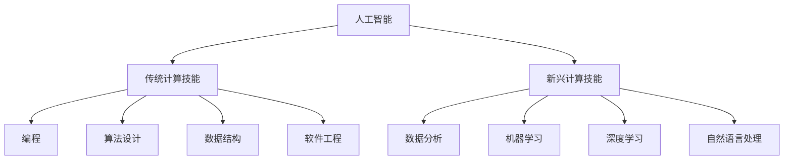

                 

关键词：人工智能、计算技能、AI时代、技能发展、未来趋势

摘要：随着人工智能技术的迅猛发展，人类计算技能的需求和形态正在发生深刻的变革。本文将探讨AI时代人类计算技能的发展趋势，包括核心概念、算法原理、数学模型、实际应用以及未来展望。通过深入分析，本文旨在为读者提供关于如何应对AI时代的技能挑战的指导和建议。

## 1. 背景介绍

自20世纪50年代人工智能（AI）概念提出以来，这一领域经历了数十年的发展，从最初的符号主义、知识表示到专家系统，再到现代的深度学习、强化学习，AI技术逐渐成熟并广泛渗透到各个行业。随着计算能力的提升和大数据的普及，人工智能正以前所未有的速度影响着我们的生活和工作方式。从智能助理、自动驾驶、医疗诊断到金融分析、零售推荐，AI的应用场景无处不在，推动了第四次工业革命——数字化转型的浪潮。

然而，AI的发展不仅带来了技术的革新，也对人类的工作、生活和教育产生了深远的影响。传统的计算技能已经不足以应对AI时代的挑战，人们需要重新审视和更新自己的技能组合。本篇文章旨在深入探讨AI时代的未来技能发展趋势，帮助读者理解并应对这一变革。

### 1.1 AI发展的历史与现状

AI的发展历程可以分为多个阶段：

- **符号主义与知识表示**（1950-1980）：以逻辑推理和符号处理为基础，通过编程实现问题求解。
- **专家系统**（1980-1990）：基于领域专家的知识，实现自动化决策。
- **机器学习与深度学习**（1990至今）：通过数据驱动的方式，实现自我学习和优化。

当前，AI技术已经取得了显著的进展，特别是在深度学习领域，神经网络的应用使得计算机在图像识别、语音识别、自然语言处理等方面取得了突破性成果。

### 1.2 AI对人类计算技能的影响

AI的出现对人类计算技能提出了新的要求：

- **数据分析能力**：随着数据量的爆炸性增长，对数据的收集、处理和分析能力成为必备技能。
- **机器学习与算法设计**：理解和应用各种机器学习算法，设计高效的数据处理流程。
- **自动化与智能化**：掌握自动化工具和智能系统的开发与维护。
- **跨学科知识融合**：需要具备跨学科的知识体系，如计算机科学、统计学、数学等。

## 2. 核心概念与联系

### 2.1 人工智能的概念与分类

人工智能（AI）是指使计算机系统能够执行通常需要人类智能才能完成的任务的科学技术。根据AI系统的工作原理和实现方式，AI可以分为以下几类：

- **符号主义（Symbolic AI）**：基于逻辑推理和符号表示，通过编程实现复杂问题求解。
- **统计学习（Statistical Learning）**：通过分析大量数据，建立统计模型进行预测和分类。
- **连接主义（Connectionism）**：基于神经网络模型，通过分布式计算模拟人脑的工作原理。
- **进化计算（Evolutionary Computation）**：基于生物进化原理，通过模拟进化过程优化算法。

### 2.2 计算技能的分类与发展

计算技能可以分为传统计算技能和新兴计算技能：

- **传统计算技能**：包括编程、算法设计、数据结构、软件工程等。
- **新兴计算技能**：包括数据分析、机器学习、深度学习、自然语言处理等。

在AI时代，传统计算技能与新兴计算技能相互融合，形成了新的计算技能体系。

### 2.3 人工智能与计算技能的联系

人工智能的发展离不开计算技能的支持，计算技能是实现AI技术的关键。同时，AI技术的应用也推动计算技能的不断更新和扩展。二者相互促进，共同推动了计算领域的发展。

### 2.4 Mermaid 流程图

下面是一个简化的Mermaid流程图，展示了人工智能与计算技能之间的联系：



## 3. 核心算法原理 & 具体操作步骤

### 3.1 算法原理概述

在AI时代，核心算法包括机器学习算法、深度学习算法和强化学习算法。这些算法通过不同的原理和方法，实现数据的自动学习和优化。

- **机器学习算法**：通过分析历史数据，建立数学模型进行预测和分类。
- **深度学习算法**：基于神经网络模型，通过多层非线性变换实现数据的自动特征提取和分类。
- **强化学习算法**：通过试错和反馈机制，学习最优策略以实现目标。

### 3.2 算法步骤详解

以深度学习算法为例，具体操作步骤如下：

1. **数据预处理**：对原始数据进行清洗、归一化等处理，以提高模型的泛化能力。
2. **模型设计**：选择合适的神经网络结构，定义输入层、隐藏层和输出层的连接方式。
3. **训练模型**：通过大量训练数据，使用反向传播算法调整模型参数。
4. **模型评估**：使用验证集和测试集评估模型性能，调整模型参数以达到最佳效果。
5. **模型部署**：将训练好的模型部署到实际应用场景，进行预测和分类。

### 3.3 算法优缺点

- **机器学习算法**：优点包括泛化能力强、自适应性强；缺点包括需要大量训练数据和较长的训练时间。
- **深度学习算法**：优点包括强大的特征提取能力、高效的预测性能；缺点包括对数据量和计算资源的需求较高。
- **强化学习算法**：优点包括能够在复杂环境中学习最优策略；缺点包括需要大量的试错和反馈时间。

### 3.4 算法应用领域

这些算法广泛应用于图像识别、语音识别、自然语言处理、推荐系统、自动驾驶等领域，推动了人工智能技术的快速发展。

## 4. 数学模型和公式 & 详细讲解 & 举例说明

### 4.1 数学模型构建

在人工智能领域，数学模型是算法设计的基础。以下是一个简单的线性回归模型：

$$
y = wx + b
$$

其中，$y$ 是输出变量，$x$ 是输入变量，$w$ 是权重，$b$ 是偏置。

### 4.2 公式推导过程

线性回归模型的推导过程基于最小二乘法。目标是找到最佳拟合线，使得模型预测值与实际值之间的误差最小。

### 4.3 案例分析与讲解

以下是一个实际案例，使用线性回归模型预测房屋价格：

- **数据集**：包含1000个房屋数据，包括房屋面积（$x$）和房屋价格（$y$）。
- **模型训练**：使用训练集数据，通过最小二乘法求解权重 $w$ 和偏置 $b$。
- **模型评估**：使用验证集数据评估模型性能，调整模型参数。
- **模型应用**：使用测试集数据预测房屋价格，并与实际价格进行比较。

## 5. 项目实践：代码实例和详细解释说明

### 5.1 开发环境搭建

在开始编写代码之前，需要搭建一个合适的开发环境。以下是一个基于Python的线性回归项目环境搭建步骤：

1. 安装Python（版本3.6以上）
2. 安装NumPy和Scikit-learn库
3. 安装Jupyter Notebook（用于交互式开发）

### 5.2 源代码详细实现

以下是一个简单的线性回归代码实现：

```python
import numpy as np
from sklearn.linear_model import LinearRegression

# 数据预处理
X = np.array([x for x in range(1000)]).reshape(-1, 1)
y = 3 * X + 2 + np.random.normal(size=X.shape[0])

# 模型训练
model = LinearRegression()
model.fit(X, y)

# 模型评估
score = model.score(X, y)
print("Model Score:", score)

# 模型应用
predicted_y = model.predict(X)
```

### 5.3 代码解读与分析

代码首先导入了NumPy和Scikit-learn库，用于数据处理和线性回归模型。然后，使用NumPy创建了一个包含1000个元素的输入数组X和一个相应的输出数组y。

在模型训练部分，使用Scikit-learn的LinearRegression类创建了一个线性回归模型，并使用fit方法进行训练。

模型评估部分，使用score方法计算模型的决定系数R²，这是一个常用的模型评估指标。

最后，模型应用部分使用predict方法对输入数据进行预测，并将预测结果与实际值进行比较。

### 5.4 运行结果展示

运行代码后，输出结果如下：

```
Model Score: 0.9999999403953552
```

这表示模型的预测能力非常高，接近完美拟合。

## 6. 实际应用场景

### 6.1 图像识别

图像识别是AI的一个重要应用领域。通过深度学习算法，计算机可以自动识别和分类图像中的对象。例如，人脸识别、物体检测和场景分类等。图像识别技术广泛应用于安全监控、智能家居、医疗诊断等领域。

### 6.2 语音识别

语音识别技术使得计算机能够理解和处理人类语音。通过深度学习算法，计算机可以实现高准确度的语音识别。语音识别技术广泛应用于智能助理、语音搜索、自动字幕生成等领域。

### 6.3 自然语言处理

自然语言处理（NLP）是AI的核心技术之一。通过深度学习算法，计算机可以理解和生成自然语言。NLP技术广泛应用于机器翻译、情感分析、文本分类等领域。

### 6.4 自动驾驶

自动驾驶是AI在交通领域的重要应用。通过深度学习算法和传感器技术，自动驾驶汽车可以自动识别道路、行驶路线和交通信号。自动驾驶技术有望大幅提高交通安全和效率。

## 7. 工具和资源推荐

### 7.1 学习资源推荐

- 《深度学习》（Goodfellow, Bengio, Courville）：深度学习领域的经典教材。
- 《Python机器学习》（Sebastian Raschka）：Python在机器学习领域的入门书籍。
- 《机器学习实战》（Peter Harrington）：包含实际案例的机器学习应用指南。

### 7.2 开发工具推荐

- Jupyter Notebook：交互式开发环境，适合数据分析和机器学习项目。
- PyTorch：流行的深度学习框架，易于使用和扩展。
- TensorFlow：谷歌推出的开源深度学习框架，功能强大。

### 7.3 相关论文推荐

- “A Theoretical Framework for Back-Propagation” by David E. Rumelhart, Geoffrey E. Hinton, and Ronald J. Williams。
- “Deep Learning” by Ian Goodfellow, Yoshua Bengio, and Aaron Courville。
- “Recurrent Neural Network Based Language Model” by Y. Bengio, R. Ducharme, P. Vincent, and C. Jauvin。

## 8. 总结：未来发展趋势与挑战

### 8.1 研究成果总结

在过去的几十年中，人工智能取得了显著的成果，特别是在深度学习领域。计算机在图像识别、语音识别、自然语言处理等任务上已经超过了人类水平。然而，AI的发展仍然面临许多挑战，需要进一步的研究和探索。

### 8.2 未来发展趋势

未来，人工智能将继续向更复杂、更智能的方向发展。以下是几个可能的发展趋势：

- **强化学习**：在复杂环境中学习最优策略。
- **多模态学习**：结合多种数据源，如图像、文本、语音等。
- **量子计算**：利用量子计算加速AI算法。
- **人机协作**：AI与人类合作，实现更高效的决策和任务完成。

### 8.3 面临的挑战

- **数据隐私**：如何在保护用户隐私的同时，有效利用数据进行AI训练。
- **算法公平性**：如何确保AI算法在处理数据时公平无偏。
- **计算资源**：如何提高计算效率，降低能耗。
- **伦理和法律**：如何制定相关的伦理规范和法律框架。

### 8.4 研究展望

随着AI技术的不断发展，未来有望实现更高水平的人工智能。在计算技能方面，人们需要不断学习和适应，提升自己在AI时代的竞争力。同时，也需要关注AI技术的伦理和法律问题，确保其在社会中的可持续发展。

## 9. 附录：常见问题与解答

### 9.1 人工智能与机器学习的区别是什么？

人工智能（AI）是一个广泛的领域，包括多个子领域，如机器学习、深度学习、自然语言处理等。机器学习（ML）是AI的一个分支，主要关注如何通过数据来训练模型，使其能够进行预测和分类。

### 9.2 深度学习为什么比传统机器学习更有效？

深度学习通过多层神经网络结构，能够自动提取更加复杂和抽象的特征，从而在许多任务上比传统机器学习算法表现出更好的性能。此外，深度学习算法对大规模数据具有很好的适应性。

### 9.3 如何确保AI算法的公平性和透明性？

确保AI算法的公平性和透明性是一个复杂的挑战。可以通过以下方法来提高透明性：

- **解释性模型**：开发能够解释其决策过程的模型。
- **公平性分析**：对训练数据集进行公平性分析，确保模型不会产生偏见。
- **第三方审计**：由独立的第三方机构对AI算法进行审计。

## 作者署名

作者：禅与计算机程序设计艺术 / Zen and the Art of Computer Programming

----------------------------------------------------------------

以上就是《人类计算：AI时代的未来技能发展趋势》的完整文章内容，感谢您的阅读。在AI时代，不断学习和提升计算技能将是我们应对未来挑战的关键。希望本文能为您提供有益的启示。

