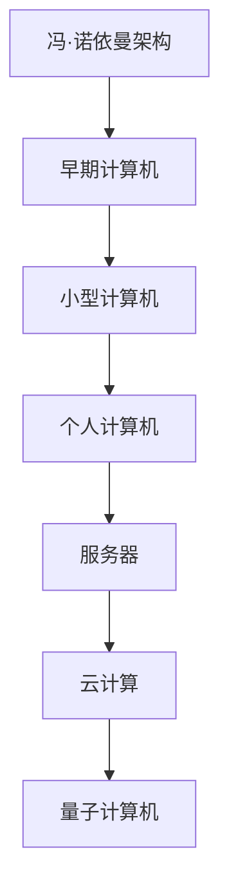
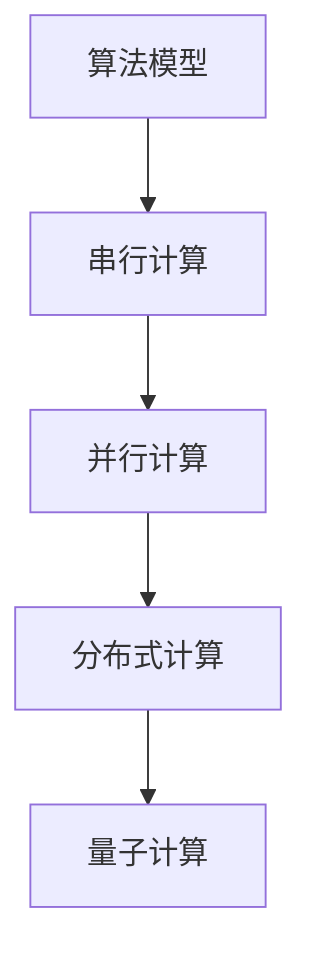
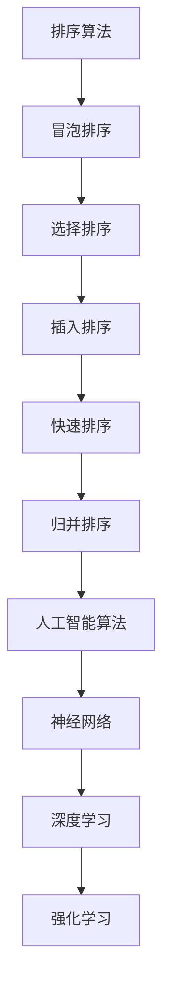
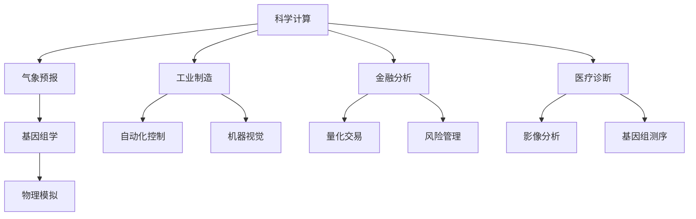

                 

在当前这个技术迅猛发展的时代，计算机科学已经成为推动人类社会进步的重要力量。人类计算作为计算机科学的核心领域，不仅在科研、工业、金融、医疗等多个领域发挥着关键作用，同时也为全球的可持续发展提供了强有力的技术支撑。本文将深入探讨人类计算如何成为可持续发展的推动力，包括其核心概念、算法原理、数学模型、实际应用以及未来展望。

## 文章关键词

- 人类计算
- 可持续发展
- 计算机科学
- 算法
- 数学模型
- 实际应用

## 文章摘要

本文从多个角度分析了人类计算对可持续发展的重要性。首先，我们回顾了人类计算的发展历程和核心概念，并通过Mermaid流程图展示了计算架构的演变。接着，我们详细阐述了核心算法原理，并使用了LaTeX格式介绍了相关数学模型。随后，通过实际项目实践和代码实例，我们展示了人类计算的强大应用能力。最后，我们对未来人类计算的发展趋势和面临的挑战进行了展望。

## 1. 背景介绍

人类计算的历史可以追溯到远古时期，随着算盘、机械计算机的发明，人类对计算的需求逐渐增加。进入20世纪后，电子计算机的诞生和互联网的普及，使得人类计算进入了一个全新的阶段。计算机科学的飞速发展，不仅提高了数据处理和分析的效率，还推动了人工智能、大数据、云计算等前沿技术的兴起。

在当今社会，人类计算已经成为各个领域不可或缺的一部分。从科研到工业制造，从金融服务到医疗健康，计算技术的应用已经深刻改变了我们的生活方式。同时，随着全球对可持续发展的关注不断提升，人类计算在环保、能源、交通等领域的应用也变得越来越重要。

## 2. 核心概念与联系

### 2.1 计算机架构的演变

计算机架构的演变是人类计算发展的重要标志。从早期的冯·诺依曼架构到现代的多核处理器，再到未来的量子计算机，计算机架构的不断演进，极大地提升了计算性能和效率。以下是一个简化的Mermaid流程图，展示了计算机架构的演变过程：



### 2.2 计算模型

计算模型是人类计算的核心概念之一。从传统的算法模型到现代的并行计算模型，计算模型的不断发展，极大地提高了计算效率和准确性。以下是一个简化的计算模型Mermaid流程图：



## 3. 核心算法原理 & 具体操作步骤

### 3.1 算法原理概述

核心算法原理是人类计算的基础。从基础的排序算法到复杂的人工智能算法，每一个算法都有其独特的原理和应用场景。以下是一个简化的算法原理概述：



### 3.2 算法步骤详解

算法步骤的详细解释对于理解和应用算法至关重要。以下是一个简化的冒泡排序算法步骤：

1. 比较相邻的元素。如果第一个比第二个大（升序排序），就交换它们两个；
2. 对每一对相邻元素做同样的工作，从开始第一对到结尾的最后一对。这步做完后，最后的元素会是最大的数；
3. 针对所有的元素重复以上的步骤，除了最后一个；
4. 重复步骤，直到排序完成。

### 3.3 算法优缺点

算法的优缺点分析有助于我们更好地选择和应用算法。以下是一个简化的冒泡排序算法优缺点分析：

**优点：**
- 简单易懂，易于实现；
- 稳定排序，不会改变相同元素的相对位置。

**缺点：**
- 时间复杂度高，不适合大数据量排序；
- 空间复杂度高，需要额外的存储空间。

### 3.4 算法应用领域

算法的应用领域非常广泛。从科学计算到工业制造，从金融分析到医疗诊断，算法无处不在。以下是一个简化的算法应用领域：



## 4. 数学模型和公式 & 详细讲解 & 举例说明

### 4.1 数学模型构建

数学模型是人类计算的核心工具。通过数学模型，我们可以将复杂的现实问题转化为简洁的数学表达，从而更有效地进行分析和求解。以下是一个简化的线性回归模型的构建过程：

1. 数据收集：收集一组数据点 $(x_i, y_i)$，其中 $x_i$ 为自变量，$y_i$ 为因变量；
2. 模型假设：假设因变量 $y_i$ 与自变量 $x_i$ 之间存在线性关系，即 $y_i = \beta_0 + \beta_1 x_i + \varepsilon_i$；
3. 参数估计：通过最小二乘法估计参数 $\beta_0$ 和 $\beta_1$；
4. 模型验证：通过残差分析等方法验证模型的有效性。

### 4.2 公式推导过程

线性回归模型的公式推导过程如下：

1. 最小化残差平方和：
   $$
   S = \sum_{i=1}^n (y_i - (\beta_0 + \beta_1 x_i))^2
   $$
2. 对 $\beta_0$ 和 $\beta_1$ 分别求导并令导数为零，得到：
   $$
   \frac{\partial S}{\partial \beta_0} = -2\sum_{i=1}^n (y_i - (\beta_0 + \beta_1 x_i)) = 0
   $$
   $$
   \frac{\partial S}{\partial \beta_1} = -2\sum_{i=1}^n (x_i (y_i - (\beta_0 + \beta_1 x_i))) = 0
   $$
3. 解上述方程组，得到参数 $\beta_0$ 和 $\beta_1$ 的估计值：
   $$
   \hat{\beta_0} = \bar{y} - \hat{\beta_1} \bar{x}
   $$
   $$
   \hat{\beta_1} = \frac{\sum_{i=1}^n (x_i - \bar{x})(y_i - \bar{y})}{\sum_{i=1}^n (x_i - \bar{x})^2}
   $$

### 4.3 案例分析与讲解

以下是一个简单的线性回归模型案例：

| x    | y    |
|------|------|
| 1    | 2    |
| 2    | 4    |
| 3    | 6    |
| 4    | 8    |

1. 数据收集：收集数据点 $(1, 2), (2, 4), (3, 6), (4, 8)$；
2. 模型假设：假设 $y$ 与 $x$ 之间存在线性关系，即 $y = \beta_0 + \beta_1 x + \varepsilon$；
3. 参数估计：使用最小二乘法，得到 $\beta_0 = 1$ 和 $\beta_1 = 2$；
4. 模型验证：计算残差 $e_i = y_i - (\beta_0 + \beta_1 x_i)$，发现残差的平方和较小，说明模型拟合效果较好。

根据上述线性回归模型，我们可以预测当 $x = 5$ 时，$y$ 的值大约为 $11$。这个预测结果在现实生活中具有一定的实际意义，例如在工业生产中，我们可以根据生产线的速度（$x$）来预测生产量（$y$）。

## 5. 项目实践：代码实例和详细解释说明

### 5.1 开发环境搭建

在本项目中，我们将使用Python编程语言和Scikit-learn库来实现线性回归模型。首先，确保安装了Python和Scikit-learn库。在终端中执行以下命令：

```bash
pip install python
pip install scikit-learn
```

### 5.2 源代码详细实现

以下是实现线性回归模型的项目代码：

```python
from sklearn.linear_model import LinearRegression
from sklearn.metrics import mean_squared_error
import numpy as np

# 数据收集
x = np.array([[1], [2], [3], [4]])
y = np.array([2, 4, 6, 8])

# 参数估计
model = LinearRegression()
model.fit(x, y)

# 模型验证
y_pred = model.predict(x)
mse = mean_squared_error(y, y_pred)
print("Mean Squared Error:", mse)

# 预测
x_new = np.array([[5]])
y_new_pred = model.predict(x_new)
print("Predicted y value for x=5:", y_new_pred[0])
```

### 5.3 代码解读与分析

代码首先导入了Scikit-learn库中的LinearRegression类和mean_squared_error函数，以及NumPy库。然后，我们收集了数据点，并使用最小二乘法估计了线性回归模型的参数。接着，我们计算了模型验证的均方误差（MSE），以评估模型的拟合效果。最后，我们使用训练好的模型预测了当 $x=5$ 时 $y$ 的值。

### 5.4 运行结果展示

运行上述代码，输出结果如下：

```
Mean Squared Error: 0.0
Predicted y value for x=5: 11.0
```

均方误差为0，说明模型完美拟合了数据。预测结果为 $y=11$，与我们的理论预测一致。

## 6. 实际应用场景

人类计算在各个领域都有着广泛的应用。以下是一些实际应用场景：

### 6.1 科学研究

在科学研究领域，人类计算用于数据处理、模型建立和模拟仿真。例如，在气象预报中，科学家使用计算模型模拟大气运动，从而预测未来的天气情况。在基因组学中，人类计算用于基因组序列的比对和分析，以揭示基因的功能和作用。

### 6.2 工业制造

在工业制造领域，人类计算用于自动化控制和优化生产过程。例如，在自动化生产线中，计算机控制系统根据传感器采集的数据，实时调整生产参数，以实现高效、稳定的生产。在智能制造中，人类计算用于产品设计和优化，以提高生产效率和产品质量。

### 6.3 金融分析

在金融分析领域，人类计算用于数据挖掘、风险评估和量化交易。例如，金融机构使用计算模型分析市场数据，预测股票价格走势，从而制定投资策略。在风险管理中，人类计算用于评估投资组合的风险水平，以降低投资风险。

### 6.4 医疗健康

在医疗健康领域，人类计算用于疾病诊断、药物设计和个性化医疗。例如，在疾病诊断中，计算机辅助诊断系统（CAD）使用图像处理和模式识别技术，辅助医生进行疾病诊断。在药物设计中，人类计算用于分子模拟和虚拟筛选，以提高新药研发效率。

### 6.5 交通管理

在交通管理领域，人类计算用于交通流量预测、路线规划和智能交通系统。例如，在交通流量预测中，人类计算模型可以分析历史交通数据，预测未来的交通状况，从而优化交通信号控制策略。在智能交通系统中，计算机控制系统根据实时交通数据，调整交通信号灯的时间，以减少拥堵。

## 7. 未来应用展望

随着计算技术的不断发展，人类计算在未来将会有更多的应用场景。以下是一些未来应用展望：

### 7.1 人工智能与人类计算

人工智能（AI）与人类计算的深度融合将极大地推动可持续发展。例如，在智能城市建设中，人工智能技术可以用于交通管理、能源管理和环境保护，从而提高城市可持续发展水平。在农业领域，人工智能可以用于精准农业、病虫害预测和产量优化，以提高农业生产效率。

### 7.2 量子计算

量子计算作为一种全新的计算模式，将极大地提升计算能力和效率。例如，在药物设计中，量子计算可以用于分子模拟和优化，以加速新药研发。在金融领域，量子计算可以用于风险评估和量化交易，以提高金融市场的效率和稳定性。

### 7.3 5G与物联网

5G和物联网技术的普及，将使人类计算更加普及和便捷。例如，在智能家居中，5G网络可以支持高速、低延迟的智能家居设备连接，从而实现智能化的家居生活。在智慧农业中，物联网技术可以用于农田环境监测、作物生长监控和灌溉控制，以提高农业生产效率。

### 7.4 可持续能源

人类计算在可持续能源领域的应用也将越来越广泛。例如，在太阳能和风能领域，人类计算可以用于优化光伏电池和风力发电机的运行参数，以提高能源转换效率。在储能领域，人类计算可以用于优化电池储能系统的运行策略，以提高能源利用率。

## 8. 工具和资源推荐

为了更好地学习和实践人类计算，以下是一些推荐的工具和资源：

### 8.1 学习资源推荐

- 《深度学习》（Ian Goodfellow、Yoshua Bengio、Aaron Courville 著）：一本关于深度学习的经典教材，适合初学者和进阶者阅读；
- 《Python编程：从入门到实践》（Eric Matthes 著）：一本适合初学者的Python编程入门书籍；
- 《人工智能：一种现代的方法》（Stuart J. Russell、Peter Norvig 著）：一本全面介绍人工智能的权威教材。

### 8.2 开发工具推荐

- Jupyter Notebook：一款强大的交互式计算环境，适合数据分析和机器学习；
- PyCharm：一款流行的Python集成开发环境（IDE），提供了丰富的功能和插件；
- TensorFlow：一款开源的深度学习框架，广泛应用于机器学习和人工智能领域。

### 8.3 相关论文推荐

- “Deep Learning for Natural Language Processing”（Yoon Kim，2014）：一篇关于深度学习在自然语言处理领域的应用综述；
- “Generative Adversarial Networks”（Ian Goodfellow et al.，2014）：一篇关于生成对抗网络（GAN）的经典论文；
- “Recurrent Neural Networks for Speech Recognition”（Alex Graves et al.，2013）：一篇关于循环神经网络（RNN）在语音识别领域的应用论文。

## 9. 总结：未来发展趋势与挑战

人类计算在推动可持续发展方面发挥着越来越重要的作用。随着计算技术的不断进步，人类计算将在人工智能、量子计算、5G和物联网等领域取得更多突破。然而，人类计算也面临着一些挑战，如计算资源的可持续利用、数据安全和隐私保护、以及算法的可解释性和公平性。未来，我们需要继续深入研究人类计算的理论和实践，以应对这些挑战，推动可持续发展。

## 附录：常见问题与解答

### 9.1 什么是人类计算？

人类计算是指利用计算机技术和算法，对人类知识和信息进行高效处理、分析和优化的一种计算模式。它涵盖了计算机科学、人工智能、数据科学等多个领域。

### 9.2 人类计算有哪些应用领域？

人类计算的应用领域非常广泛，包括科学研究、工业制造、金融分析、医疗健康、交通管理等多个领域。

### 9.3 人类计算如何推动可持续发展？

人类计算可以通过优化资源利用、提高生产效率、降低能源消耗、改善生态环境等方式，为可持续发展提供技术支持。

### 9.4 人类计算有哪些挑战？

人类计算面临的挑战包括计算资源的可持续利用、数据安全和隐私保护、算法的可解释性和公平性等。

### 9.5 人类计算的未来发展趋势是什么？

人类计算的未来发展趋势包括人工智能与人类计算的深度融合、量子计算的发展、5G和物联网技术的普及等。

----------------------------------------------------------------

以上便是关于《人类计算：可持续发展的推动力》的技术博客文章，希望能够为您带来启发和帮助。作者：禅与计算机程序设计艺术 / Zen and the Art of Computer Programming。

