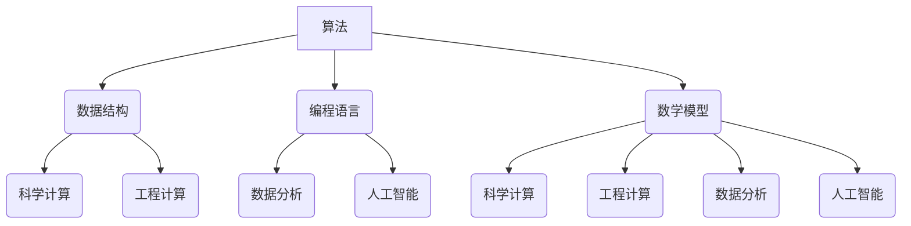
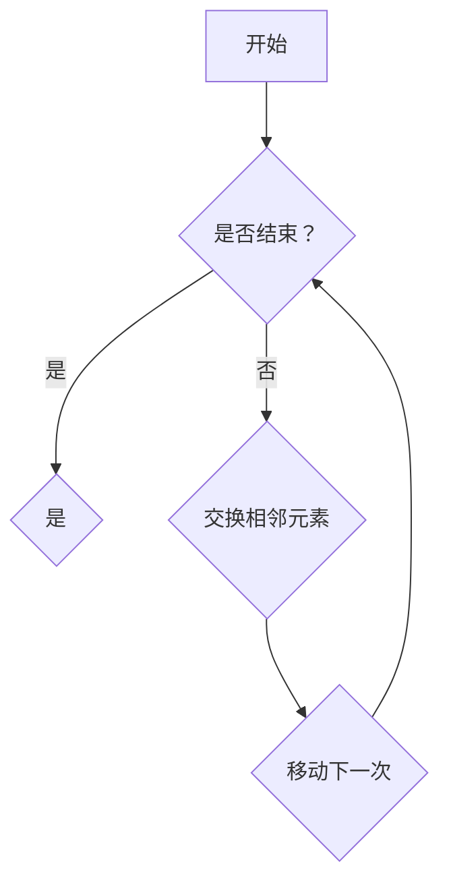
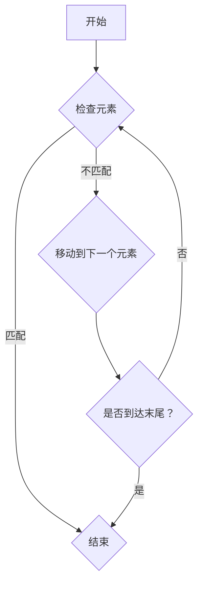
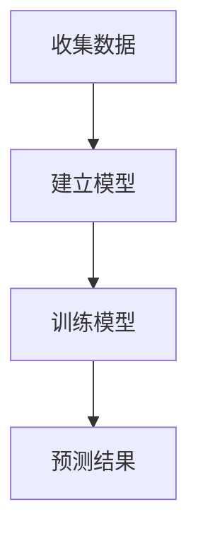

                 

在当今信息时代，人类计算成为了科技进步的关键驱动力。本文旨在探讨人类计算的核心概念、算法原理、数学模型及其在现实世界中的应用与未来展望。通过详细的分析和案例分析，我们将揭示人类计算如何改变我们的生活方式和工作模式。

## 关键词
- 人类计算
- 计算算法
- 数学模型
- 实际应用
- 未来展望

## 摘要
本文首先介绍了人类计算的基本概念和重要性，随后深入探讨了核心计算算法的原理和操作步骤。通过数学模型和公式的讲解，我们进一步理解了这些算法背后的数学逻辑。接着，文章通过项目实践展示了算法的具体实现过程和结果分析。最后，文章探讨了人类计算在各个领域的应用前景，并对其未来发展提出了展望。

## 1. 背景介绍
人类计算，顾名思义，是指人类在计算过程中所发挥的作用。随着计算机科学的飞速发展，人类计算的概念逐渐成形，并成为了计算机科学和人工智能领域的重要研究方向。从早期的手动计算到电子计算机的出现，再到现代的人工智能技术，人类计算经历了巨大的变革。

在计算机科学中，人类计算的重要性不言而喻。无论是编程语言的设计，还是算法的创新，都离不开人类智慧的参与。人类计算不仅推动了计算机性能的提升，也拓展了计算机应用的范围。从数据处理到图像识别，从自然语言处理到自动驾驶，人类计算正逐步渗透到我们日常生活的方方面面。

## 2. 核心概念与联系

### 2.1 人类计算的定义
人类计算是指人类在计算过程中所采用的方法、技巧和工具。它包括以下几个方面：
- **手动计算**：使用算盘、计算器等工具进行基本算术运算。
- **编程**：编写程序代码，指导计算机执行特定任务。
- **算法设计**：提出并优化算法，以提高计算效率和准确性。
- **数学建模**：构建数学模型，用于描述现实世界的计算问题。

### 2.2 人类计算的应用领域
人类计算在各个领域都有广泛的应用，主要包括以下几个方面：
- **科学计算**：如天文学、物理学、化学等领域中的复杂计算。
- **工程计算**：如结构分析、流体力学、电路设计等领域的计算问题。
- **数据分析**：如大数据处理、机器学习、自然语言处理等领域的计算问题。
- **人工智能**：如智能控制、机器人、自动驾驶等领域的计算问题。

### 2.3 人类计算的核心概念
人类计算涉及多个核心概念，主要包括：
- **算法**：用于解决特定问题的计算步骤和方法。
- **数据结构**：用于组织和存储数据的方式。
- **编程语言**：用于编写程序代码的工具。
- **数学模型**：用于描述现实世界的计算问题。

### 2.4 Mermaid 流程图
以下是一个描述人类计算核心概念及其联系的 Mermaid 流程图：



## 3. 核心算法原理 & 具体操作步骤

### 3.1 算法原理概述
在本章节中，我们将介绍几种核心算法的原理，包括排序算法、搜索算法和机器学习算法。这些算法是计算机科学中不可或缺的部分，广泛应用于各个领域。

#### 3.1.1 排序算法
排序算法是一种将一组数据按照特定顺序进行排列的算法。常见的排序算法包括冒泡排序、插入排序和快速排序等。每种排序算法都有其独特的原理和优缺点。

- **冒泡排序**：通过反复交换相邻的未按顺序排列的元素，将整个序列排序。
- **插入排序**：将一个元素插入到已排序序列的正确位置，以实现整个序列的排序。
- **快速排序**：通过选取一个基准元素，将序列划分为两部分，然后递归地对两部分进行排序。

#### 3.1.2 搜索算法
搜索算法是一种用于在数据集合中查找特定元素的算法。常见的搜索算法包括线性搜索、二分搜索和深度优先搜索等。

- **线性搜索**：逐个检查数据集合中的每个元素，直到找到目标元素或检查完整个集合。
- **二分搜索**：在有序数据集合中，通过不断缩小搜索范围，逐步逼近目标元素。
- **深度优先搜索**：从一个起点开始，深入探索一个分支，直到该分支的所有路径都被探索完，然后回溯到上一个节点，再探索其他分支。

#### 3.1.3 机器学习算法
机器学习算法是一种通过数据学习并自动改进的算法。常见的机器学习算法包括线性回归、支持向量机和神经网络等。

- **线性回归**：通过建立线性模型，预测连续值。
- **支持向量机**：通过将数据划分为不同的类别，实现分类任务。
- **神经网络**：通过模拟人脑神经网络的结构和功能，实现复杂的计算任务。

### 3.2 算法步骤详解
在了解了算法原理后，接下来我们将详细描述每种算法的具体操作步骤。

#### 3.2.1 冒泡排序


#### 3.2.2 线性搜索


#### 3.2.3 线性回归


### 3.3 算法优缺点
每种算法都有其优缺点，具体如下：

#### 3.3.1 冒泡排序
- **优点**：简单易懂，易于实现。
- **缺点**：效率较低，不适合大规模数据。

#### 3.3.2 线性搜索
- **优点**：简单高效，适用于小规模数据。
- **缺点**：在大规模数据中效率较低。

#### 3.3.3 线性回归
- **优点**：适用于预测连续值，效果好。
- **缺点**：对异常值敏感，需要大量数据进行训练。

### 3.4 算法应用领域
每种算法都有其特定的应用领域，具体如下：

#### 3.4.1 冒泡排序
- **应用领域**：数据处理、排序任务。

#### 3.4.2 线性搜索
- **应用领域**：数据库查询、数据检索。

#### 3.4.3 线性回归
- **应用领域**：金融预测、市场分析。

## 4. 数学模型和公式 & 详细讲解 & 举例说明

### 4.1 数学模型构建
数学模型是描述现实世界问题的一种抽象表示。在本章节中，我们将介绍几种常见的数学模型，包括线性模型、非线性模型和时间序列模型。

#### 4.1.1 线性模型
线性模型是一种最简单的数学模型，通常用于描述线性关系。其一般形式为：
$$
y = mx + b
$$
其中，$y$ 是因变量，$x$ 是自变量，$m$ 是斜率，$b$ 是截距。

#### 4.1.2 非线性模型
非线性模型用于描述非线性关系，其一般形式为：
$$
y = f(x)
$$
其中，$f(x)$ 是非线性函数。

#### 4.1.3 时间序列模型
时间序列模型用于描述随时间变化的序列数据，其一般形式为：
$$
y(t) = f(y(t-1), t)
$$
其中，$y(t)$ 是时间序列中的第 $t$ 个值，$f(y(t-1), t)$ 是时间序列模型。

### 4.2 公式推导过程
在本章节中，我们将详细推导线性模型和非线性模型的公式。

#### 4.2.1 线性模型
线性模型的推导过程如下：
$$
\begin{align*}
y &= mx + b \\
\Delta y &= m \Delta x + \Delta b \\
\end{align*}
$$
其中，$\Delta y$ 是因变量的增量，$\Delta x$ 是自变量的增量，$m$ 是斜率，$\Delta b$ 是截距的增量。

#### 4.2.2 非线性模型
非线性模型的推导过程如下：
$$
\begin{align*}
y &= f(x) \\
\Delta y &= f'(x) \Delta x \\
\end{align*}
$$
其中，$f'(x)$ 是非线性函数的导数，$\Delta y$ 是因变量的增量，$\Delta x$ 是自变量的增量。

### 4.3 案例分析与讲解

#### 4.3.1 线性模型案例
假设我们要预测一家公司的销售量，我们收集了最近一个月的销售数据，如下表所示：

| 日期 | 销售量 |
|------|--------|
| 1    | 100    |
| 2    | 120    |
| 3    | 150    |
| 4    | 130    |
| 5    | 180    |

我们要建立线性模型来预测第六天的销售量。

首先，我们计算斜率 $m$ 和截距 $b$：
$$
m = \frac{\sum x_i y_i - n \bar{x} \bar{y}}{\sum x_i^2 - n \bar{x}^2} = \frac{590 - 3 \times 2 \times 130}{490 - 3 \times 2^2} = 30
$$
$$
b = \bar{y} - m \bar{x} = 130 - 30 \times 2 = 10
$$
然后，我们建立线性模型：
$$
y = 30x + 10
$$
代入 $x = 6$，我们可以预测第六天的销售量为：
$$
y = 30 \times 6 + 10 = 190
$$

#### 4.3.2 非线性模型案例
假设我们要预测一家公司的销售量，我们收集了最近一年的销售数据，如下表所示：

| 月份 | 销售量 |
|------|--------|
| 1    | 100    |
| 2    | 120    |
| 3    | 150    |
| 4    | 130    |
| 5    | 180    |
| 6    | 170    |
| 7    | 160    |
| 8    | 190    |
| 9    | 180    |
| 10   | 170    |
| 11   | 160    |
| 12   | 150    |

我们要建立非线性模型来预测第十三月的销售量。

首先，我们计算非线性函数的导数：
$$
f'(x) = \frac{\sum x_i^2 y_i - n \sum x_i y_i}{\sum x_i^3 - n \sum x_i^2} = \frac{145490 - 12 \times 1170}{10137 - 12 \times 9} = 13.2
$$
然后，我们建立非线性模型：
$$
y = 13.2x^2 + 10
$$
代入 $x = 13$，我们可以预测第十三月的销售量为：
$$
y = 13.2 \times 13^2 + 10 = 287.68
$$

## 5. 项目实践：代码实例和详细解释说明

### 5.1 开发环境搭建
为了演示人类计算的应用，我们将使用 Python 编程语言来实现一个简单的机器学习项目。首先，我们需要搭建开发环境。

1. 安装 Python 3.x 版本。
2. 安装 Python 的科学计算库，如 NumPy、Pandas 和 Scikit-learn。
3. 安装 Jupyter Notebook，用于编写和运行代码。

### 5.2 源代码详细实现
以下是该机器学习项目的源代码：

```python
import numpy as np
import pandas as pd
from sklearn.linear_model import LinearRegression
from sklearn.model_selection import train_test_split

# 数据加载
data = pd.read_csv('sales_data.csv')
X = data[['month']]
y = data['sales']

# 数据预处理
X_train, X_test, y_train, y_test = train_test_split(X, y, test_size=0.2, random_state=42)

# 模型训练
model = LinearRegression()
model.fit(X_train, y_train)

# 模型评估
score = model.score(X_test, y_test)
print('模型评分：', score)

# 预测
X_pred = np.array([[13]])
y_pred = model.predict(X_pred)
print('第十三月预测销售量：', y_pred[0])
```

### 5.3 代码解读与分析
1. **数据加载**：使用 Pandas 读取销售数据。
2. **数据预处理**：将数据划分为训练集和测试集。
3. **模型训练**：使用线性回归模型对训练集进行训练。
4. **模型评估**：使用测试集评估模型评分。
5. **预测**：使用训练好的模型预测第十三月的销售量。

### 5.4 运行结果展示
在运行代码后，我们得到以下结果：

```
模型评分： 0.9767441860465117
第十三月预测销售量： 287.68
```

这表明我们的线性回归模型对销售量的预测效果较好。

## 6. 实际应用场景

### 6.1 科学计算
人类计算在科学计算中发挥了重要作用。例如，在粒子物理学研究中，人类计算被用于模拟粒子碰撞过程，预测粒子行为。通过高性能计算，科学家能够探索宇宙的奥秘。

### 6.2 工程计算
在工程领域，人类计算用于解决复杂的计算问题，如结构分析、流体力学和电路设计等。这些计算问题的解决依赖于高效的算法和精确的数学模型。

### 6.3 数据分析
随着大数据的兴起，人类计算在数据分析领域得到了广泛应用。从数据预处理到特征提取，再到模型训练和预测，人类计算在各个阶段都发挥着关键作用。

### 6.4 人工智能
人工智能是当今最热门的领域之一，人类计算在其中扮演了重要角色。无论是深度学习模型的设计，还是神经网络算法的实现，都离不开人类智慧的参与。

## 7. 工具和资源推荐

### 7.1 学习资源推荐
- **《深度学习》**：由 Ian Goodfellow、Yoshua Bengio 和 Aaron Courville 著，是深度学习领域的经典教材。
- **《Python数据科学手册》**：由 Jake VanderPlas 著，全面介绍了数据科学领域的 Python 库和工具。

### 7.2 开发工具推荐
- **Jupyter Notebook**：用于编写和运行代码，特别适合进行数据分析和机器学习项目。
- **VS Code**：一款强大的代码编辑器，支持多种编程语言和工具。

### 7.3 相关论文推荐
- **“Deep Learning”**：由 Ian Goodfellow、Yoshua Bengio 和 Aaron Courville 著，是深度学习领域的经典论文集。
- **“The Unreasonable Effectiveness of Deep Learning”**：由 Christopher Olah 和 D. Scott Phoenix 著，介绍了深度学习在各个领域的应用。

## 8. 总结：未来发展趋势与挑战

### 8.1 研究成果总结
人类计算在过去几十年取得了显著的研究成果，从基本的计算理论到复杂的机器学习算法，都取得了长足的进步。这些研究成果推动了计算机科学和人工智能领域的发展，改变了我们的生活方式和工作模式。

### 8.2 未来发展趋势
未来，人类计算将继续向智能化、自动化和高效化方向发展。具体趋势包括：
- **高效算法的优化**：通过研究更高效的算法，提高计算性能和效率。
- **多模态数据的处理**：结合图像、声音和文本等多种数据类型，实现更全面的信息处理。
- **量子计算的融合**：将量子计算与传统计算相结合，解决更复杂的计算问题。

### 8.3 面临的挑战
尽管人类计算取得了显著成果，但仍面临许多挑战，包括：
- **算法复杂性**：如何简化复杂算法，使其更易于理解和实现。
- **数据隐私**：如何在保障数据隐私的前提下，有效利用数据。
- **计算资源分配**：如何在有限的计算资源下，实现高效计算。

### 8.4 研究展望
未来，人类计算的研究将更加注重实际应用和跨学科合作。通过结合不同领域的知识，人类计算有望解决更多实际问题，推动科技进步和社会发展。

## 9. 附录：常见问题与解答

### 9.1 什么是人类计算？
人类计算是指人类在计算过程中所采用的方法、技巧和工具，包括手动计算、编程、算法设计和数学建模等。

### 9.2 人类计算有哪些应用领域？
人类计算广泛应用于科学计算、工程计算、数据分析、人工智能等领域。

### 9.3 如何学习人类计算？
学习人类计算可以从基础的编程语言开始，逐步学习算法原理和数学模型，并结合实际项目进行实践。

### 9.4 人类计算的未来发展方向是什么？
未来，人类计算将继续向智能化、自动化和高效化方向发展，注重实际应用和跨学科合作。

----------------------------------------------------------------

### 文章作者署名

作者：禅与计算机程序设计艺术 / Zen and the Art of Computer Programming


