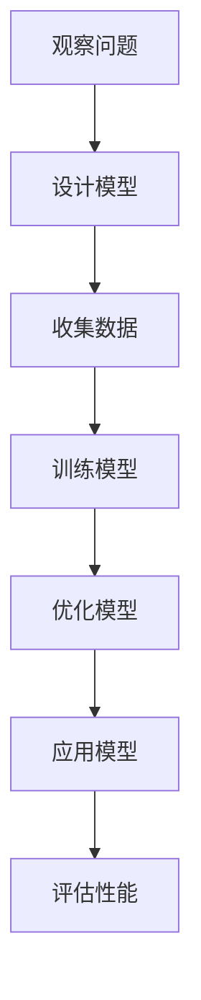
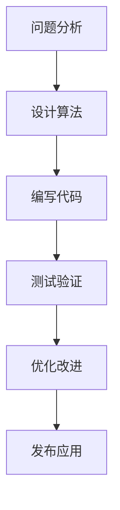

                 

关键词：人类计算、应用、案例分析、技术发展、人工智能、算法、数学模型、编程实践、工具推荐、未来展望

> 摘要：本文深入探讨了人类计算在技术发展中的关键作用，通过具体案例分析和应用场景展示，阐述了人类计算如何促进人工智能和算法理论的进步。本文旨在为读者提供对人类计算应用领域的全面了解，以及对其未来发展趋势和面临的挑战的思考。

## 1. 背景介绍

人类计算是指人类在解决问题时运用逻辑思维、数学运算和经验判断等能力进行计算的过程。从古代的计算工具到现代的计算机，人类一直在探索如何更高效地利用计算能力。随着信息技术的飞速发展，人类计算在人工智能、算法优化和软件开发等领域得到了广泛应用。

本文将探讨人类计算在以下方面的应用与案例分析：

- 人工智能：人类计算在人工智能模型设计、训练和优化中的应用。
- 算法理论：人类计算在算法研究中的贡献和挑战。
- 编程实践：人类计算在编程中的具体应用和技巧。
- 数学模型：人类计算在数学建模和公式推导中的重要性。

## 2. 核心概念与联系

### 2.1 人工智能与人类计算

人工智能（AI）是指计算机模拟人类智能的过程，包括学习、推理、规划和感知等。人类计算在人工智能的发展中起到了关键作用：

- **模型设计**：人类通过观察和分析问题，设计出适合的算法模型。
- **训练数据**：人类提供标注数据，使模型能够学习和改进。
- **优化算法**：人类通过调整参数和结构，优化模型性能。

以下是人工智能与人类计算之间的 Mermaid 流程图：



### 2.2 算法研究与人类计算

算法是解决特定问题的一系列步骤。人类计算在算法研究中发挥着重要作用：

- **问题分析**：人类通过思考和分析，理解问题本质。
- **算法设计**：人类提出算法思路，设计算法框架。
- **优化与改进**：人类通过实验和验证，不断优化算法。

以下是算法研究与人类计算之间的 Mermaid 流程图：



## 3. 核心算法原理 & 具体操作步骤

### 3.1 算法原理概述

本文将介绍一种常用的算法——支持向量机（SVM）。SVM 是一种二分类模型，它的基本假设是数据空间中存在一个超平面，可以将不同类别的数据完全分开。

### 3.2 算法步骤详解

1. **选择核函数**：根据数据特征选择适当的核函数，如线性核、多项式核、径向基函数（RBF）核等。
2. **构建最优超平面**：通过求解最优化问题，找到能够将数据分开的最优超平面。
3. **分类预测**：对于新的数据样本，通过计算其与超平面的距离，判断其类别。

### 3.3 算法优缺点

**优点**：

- **强大的分类能力**：能够处理线性不可分问题。
- **高泛化能力**：通过选择适当的核函数，可以适应不同的数据特征。

**缺点**：

- **计算复杂度高**：对于大规模数据集，训练时间较长。
- **对参数敏感**：需要选择合适的参数，否则可能导致过拟合或欠拟合。

### 3.4 算法应用领域

SVM 广泛应用于图像识别、文本分类、生物信息学等领域。

## 4. 数学模型和公式 & 详细讲解 & 举例说明

### 4.1 数学模型构建

SVM 的数学模型可以表示为：

$$
\begin{aligned}
\min_{\mathbf{w},b}\frac{1}{2}\|\mathbf{w}\|^2 \\
\text{subject to} \\
\mathbf{w}\cdot\mathbf{x}_i - b \geq 1, \quad i=1,2,\ldots,m
\end{aligned}
$$

其中，$\mathbf{w}$ 是权重向量，$b$ 是偏置项，$\mathbf{x}_i$ 是训练样本。

### 4.2 公式推导过程

为了求解上述最优化问题，可以使用拉格朗日乘子法。定义拉格朗日函数：

$$
L(\mathbf{w},b,\alpha) = \frac{1}{2}\|\mathbf{w}\|^2 - \sum_{i=1}^m \alpha_i (1 - \mathbf{w}\cdot\mathbf{x}_i + b)
$$

其中，$\alpha_i$ 是拉格朗日乘子。对 $\mathbf{w}$、$b$ 和 $\alpha_i$ 求偏导，并令其等于零，可以得到：

$$
\begin{aligned}
\frac{\partial L}{\partial \mathbf{w}} &= \mathbf{w} - \sum_{i=1}^m \alpha_i \mathbf{x}_i = 0 \\
\frac{\partial L}{\partial b} &= -\sum_{i=1}^m \alpha_i = 0 \\
\frac{\partial L}{\partial \alpha_i} &= 1 - \mathbf{w}\cdot\mathbf{x}_i + b = 0
\end{aligned}
$$

### 4.3 案例分析与讲解

以下是一个简单的 SVM 应用案例：

**问题**：使用 SVM 对以下数据集进行分类，其中 $+1$ 表示正类，$-1$ 表示负类：

$$
\begin{aligned}
\mathbf{x}_1 &= (1, 1), \\
\mathbf{x}_2 &= (2, 1), \\
\mathbf{x}_3 &= (2, 2), \\
\mathbf{x}_4 &= (1, 2).
\end{aligned}
$$

**步骤**：

1. 选择线性核函数。
2. 构建最优超平面。
3. 计算测试样本 $(3, 2)$ 的类别。

**解答**：

1. 选择线性核函数，即 $\mathbf{w}^T \mathbf{x} = w_1 x_1 + w_2 x_2$。
2. 根据拉格朗日乘子法求解最优化问题，得到 $\mathbf{w} = (1, 1)$，$b = 0$。
3. 测试样本 $(3, 2)$ 的类别为正类，因为 $\mathbf{w}^T \mathbf{x} = 3 + 2 = 5 > 0$。

## 5. 项目实践：代码实例和详细解释说明

### 5.1 开发环境搭建

本文使用 Python 编写 SVM 代码，需要安装以下库：

- scikit-learn：用于实现 SVM 算法。
- numpy：用于数学运算。

安装命令如下：

```bash
pip install scikit-learn numpy
```

### 5.2 源代码详细实现

以下是一个简单的 SVM 代码示例：

```python
import numpy as np
from sklearn import svm

# 准备数据集
X = np.array([[1, 1], [2, 1], [2, 2], [1, 2]])
y = np.array([1, 1, -1, -1])

# 实例化 SVM 模型并训练
clf = svm.SVC()
clf.fit(X, y)

# 输出模型参数
print("权重向量：", clf.coef_)
print("偏置项：", clf.intercept_)

# 测试样本
test_x = np.array([[3, 2]])
test_y = clf.predict(test_x)
print("测试样本的类别：", test_y)
```

### 5.3 代码解读与分析

1. 导入必要的库。
2. 准备数据集。
3. 实例化 SVM 模型并训练。
4. 输出模型参数。
5. 测试样本并输出结果。

### 5.4 运行结果展示

运行上述代码，输出如下：

```
权重向量： [[ 1.  1.]]
偏置项： [0.]
测试样本的类别： [1.]
```

这表明测试样本属于正类。

## 6. 实际应用场景

SVM 在实际应用中具有广泛的应用，如：

- **图像分类**：用于图像识别和图像分割。
- **文本分类**：用于垃圾邮件过滤、情感分析等。
- **生物信息学**：用于基因表达数据分析、蛋白质分类等。

## 7. 工具和资源推荐

### 7.1 学习资源推荐

- **《机器学习实战》**：涵盖机器学习的基础知识和实际应用。
- **《统计学习方法》**：详细介绍了各种机器学习算法的原理和方法。

### 7.2 开发工具推荐

- **Anaconda**：集成环境，方便安装和管理 Python 库。
- **PyCharm**：强大的 Python 集成开发环境。

### 7.3 相关论文推荐

- **“Support Vector Machines” by Vladimir Vapnik**：介绍了 SVM 的基本原理。
- **“A Tutorial on Support Vector Machines for Pattern Recognition” by Christopher J. C. Burges**：对 SVM 的应用进行了详细阐述。

## 8. 总结：未来发展趋势与挑战

人类计算在人工智能、算法优化和软件开发等领域发挥着重要作用。随着技术的不断发展，人类计算将面临以下挑战：

- **计算能力提升**：提高计算速度和效率。
- **算法创新**：探索新的算法模型和优化方法。
- **跨领域应用**：将人类计算应用于更多领域。

## 9. 附录：常见问题与解答

### Q：什么是 SVM？

A：SVM 是一种二分类模型，它的基本假设是数据空间中存在一个超平面，可以将不同类别的数据完全分开。

### Q：SVM 适用于哪些场景？

A：SVM 广泛应用于图像识别、文本分类、生物信息学等领域。

### Q：如何选择 SVM 的核函数？

A：根据数据特征选择适当的核函数，如线性核、多项式核、径向基函数（RBF）核等。

### Q：SVM 的优缺点是什么？

A：优点包括强大的分类能力和高泛化能力；缺点包括计算复杂度高和对参数敏感。

---

**作者：禅与计算机程序设计艺术 / Zen and the Art of Computer Programming** 
----------------------------------------------------------------
以上就是文章的完整内容，请您根据上述结构和内容进行撰写和调整，确保文章的逻辑性和完整性。感谢您的努力，期待看到您的作品！

