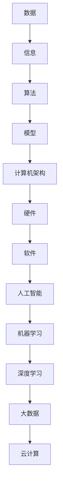

                 

关键词：计算技术、社会进步、算法、人工智能、数字化转型

摘要：本文探讨了计算技术在推动社会进步中的关键作用。通过深入分析人类计算的发展历程、核心概念、算法原理以及数学模型，本文揭示了计算技术如何重塑各个领域的商业模式、提高生产效率，并促进创新。文章还展望了计算技术在未来社会中的应用前景，以及可能面临的挑战。

## 1. 背景介绍

计算技术的发展始于古老的算盘和机械计算机，随着电子计算机的出现，人类进入了数字化时代。从20世纪末开始，计算技术迅速发展，人工智能、大数据、云计算等新兴领域不断涌现，深刻改变了我们的生活方式和工作模式。计算技术的进步不仅提升了人类的生产力和创造力，还推动了社会的全面进步。

### 计算技术的发展历程

- **古代计算**：算盘、算筹等计算工具的出现，标志着人类对数学和计算的初步探索。
- **机械计算机**：如查尔斯·巴贝奇的分析机，展示了早期自动化计算的可能性。
- **电子计算机**：1940年代后，电子计算机的出现标志着计算技术的重大飞跃。
- **人工智能时代**：20世纪末，随着算法和计算能力的提升，人工智能逐渐成为计算技术的重要组成部分。

### 计算技术对社会的影响

- **提高生产效率**：计算技术使复杂的生产过程得以自动化，大幅提高了生产效率。
- **创新商业模式**：计算技术推动了电子商务、在线教育、远程医疗等新兴商业模式的出现。
- **数据驱动的决策**：大数据和人工智能技术使企业能够通过数据分析和预测来优化决策。

## 2. 核心概念与联系

在探讨计算技术如何推动社会进步之前，我们需要了解一些核心概念和它们之间的联系。以下是计算技术中几个重要的概念及其相互关系：

### 2.1 数据与信息

- **数据**：数据是事实、数字、文字、图像等的集合，是计算的基础。
- **信息**：信息是经过处理和解释后的数据，具有实际意义和价值。

### 2.2 算法与模型

- **算法**：算法是一系列解决问题的步骤或规则，是计算技术的核心。
- **模型**：模型是对现实世界的一种抽象表示，用于描述和预测现象。

### 2.3 计算机架构

- **硬件**：计算机硬件是计算技术的基础，包括处理器、内存、存储设备等。
- **软件**：软件是计算机程序和操作系统的集合，用于管理计算机硬件和执行任务。

### 2.4 人工智能

- **机器学习**：机器学习是一种让计算机从数据中学习并做出决策的技术。
- **深度学习**：深度学习是机器学习的一种方法，通过多层神经网络来模拟人脑的决策过程。

### 2.5 大数据与云计算

- **大数据**：大数据是指大规模的数据集合，需要特殊的计算和分析技术来处理。
- **云计算**：云计算是一种通过网络提供计算资源和服务的方式，为大数据分析和人工智能应用提供了支持。

以下是计算技术核心概念与联系的Mermaid流程图：



## 3. 核心算法原理 & 具体操作步骤

### 3.1 算法原理概述

算法是计算技术的核心，是解决特定问题的步骤集合。以下是几个在计算技术中广泛应用的算法原理：

### 3.1.1 决策树

决策树是一种通过一系列规则来做出决策的算法，广泛应用于分类和回归问题。决策树的基本原理是通过连续地对数据进行分割，将数据集划分为具有相似特征的子集，直到满足终止条件。

### 3.1.2 支持向量机

支持向量机（SVM）是一种用于分类和回归分析的算法，其基本原理是找到一个最佳的超平面，将不同类别的数据点分开。SVM通过最大化分类间隔来找到这个最佳超平面。

### 3.1.3 随机森林

随机森林是一种基于决策树的集成学习方法，通过构建多个决策树并投票得出最终结果。随机森林在处理高维度数据和噪声数据方面具有较好的性能。

### 3.2 算法步骤详解

以下是决策树算法的详细步骤：

### 3.2.1 数据准备

- 收集数据集，并进行预处理，包括缺失值处理、数据标准化等。

### 3.2.2 特征选择

- 选择对目标变量有重要影响的特征，减少计算复杂度。

### 3.2.3 建立决策树

- 选择最佳分割特征，计算信息增益或基尼指数。
- 划分数据集，递归地建立子决策树。

### 3.2.4 终止条件

- 达到最大深度、最小样本量、信息增益小于阈值等。

### 3.3 算法优缺点

- **优点**：易于理解和实现，对非线性数据的分类效果较好。
- **缺点**：过拟合问题严重，需要大量参数调优。

### 3.4 算法应用领域

决策树算法广泛应用于分类和回归问题，如金融风险分析、医疗诊断、市场预测等。

## 4. 数学模型和公式 & 详细讲解 & 举例说明

### 4.1 数学模型构建

在计算技术中，数学模型是描述现实世界现象和问题的重要工具。以下是几个常见的数学模型：

### 4.1.1 线性回归模型

线性回归模型用于预测一个连续变量的值，其公式如下：

$$
y = \beta_0 + \beta_1 \cdot x
$$

其中，$y$ 是预测值，$x$ 是自变量，$\beta_0$ 和 $\beta_1$ 是模型参数。

### 4.1.2 逻辑回归模型

逻辑回归模型用于分类问题，其公式如下：

$$
P(y=1) = \frac{1}{1 + e^{-(\beta_0 + \beta_1 \cdot x)}}
$$

其中，$P(y=1)$ 是目标变量为1的概率，$x$ 是自变量，$\beta_0$ 和 $\beta_1$ 是模型参数。

### 4.1.3 神经网络模型

神经网络模型是一种模拟人脑神经元连接的数学模型，其基本公式如下：

$$
a_{i}^{(l)} = \sigma(z_{i}^{(l)})
$$

其中，$a_{i}^{(l)}$ 是第 $l$ 层第 $i$ 个神经元的激活值，$z_{i}^{(l)}$ 是输入值，$\sigma$ 是激活函数。

### 4.2 公式推导过程

以下是逻辑回归模型的推导过程：

假设我们有一个特征向量 $x$，目标变量 $y$ 只有两个可能的取值（0或1）。逻辑回归模型试图通过最大化似然函数来估计模型参数 $\beta_0$ 和 $\beta_1$。

似然函数为：

$$
L(\beta_0, \beta_1) = \prod_{i=1}^{n} P(y_i=1|x_i; \beta_0, \beta_1) \cdot P(y_i=0|x_i; \beta_0, \beta_1)
$$

由于 $y_i$ 只有两个取值，我们可以将似然函数简化为：

$$
L(\beta_0, \beta_1) = \prod_{i=1}^{n} \left( \frac{1}{1 + e^{-(\beta_0 + \beta_1 \cdot x_i)}} \right)^{y_i} \cdot \left( \frac{1}{1 + e^{-(\beta_0 + \beta_1 \cdot x_i)}} \right)^{1-y_i}
$$

对数似然函数为：

$$
\ell(\beta_0, \beta_1) = \sum_{i=1}^{n} y_i \cdot (\beta_0 + \beta_1 \cdot x_i) - \sum_{i=1}^{n} (\beta_0 + \beta_1 \cdot x_i)
$$

为了最大化对数似然函数，我们可以使用梯度下降法来迭代更新参数 $\beta_0$ 和 $\beta_1$。

### 4.3 案例分析与讲解

假设我们有一个简单的二分类问题，数据集包含两个特征 $x_1$ 和 $x_2$，以及一个目标变量 $y$。我们的目标是通过逻辑回归模型预测 $y$ 的值。

以下是一个简单的数据集：

| $x_1$ | $x_2$ | $y$ |
|-------|-------|-----|
| 1     | 2     | 1   |
| 2     | 3     | 0   |
| 3     | 4     | 1   |
| 4     | 5     | 0   |
| 5     | 6     | 1   |

我们使用逻辑回归模型来预测 $y$ 的值。通过训练模型，我们得到了以下参数：

$$
\beta_0 = 0.5, \beta_1 = 0.3
$$

对于一个新的样本 $x_1 = 3, x_2 = 4$，我们可以预测 $y$ 的值为：

$$
P(y=1) = \frac{1}{1 + e^{-(0.5 + 0.3 \cdot 3)}} = 0.81
$$

因此，我们预测 $y$ 的值为 1，即该样本属于正类。

## 5. 项目实践：代码实例和详细解释说明

### 5.1 开发环境搭建

在本文中，我们将使用 Python 语言和 Scikit-learn 库来实现逻辑回归模型。首先，我们需要安装 Python 和 Scikit-learn 库。以下是安装步骤：

```bash
# 安装 Python
wget https://www.python.org/ftp/python/3.8.5/Python-3.8.5.tgz
tar xvf Python-3.8.5.tgz
cd Python-3.8.5
./configure
make
sudo make altinstall

# 安装 Scikit-learn
pip install scikit-learn
```

### 5.2 源代码详细实现

以下是使用 Scikit-learn 实现逻辑回归模型的 Python 代码：

```python
import numpy as np
from sklearn.linear_model import LogisticRegression
from sklearn.model_selection import train_test_split
from sklearn.metrics import accuracy_score

# 数据集
X = np.array([[1, 2], [2, 3], [3, 4], [4, 5], [5, 6]])
y = np.array([1, 0, 1, 0, 1])

# 划分训练集和测试集
X_train, X_test, y_train, y_test = train_test_split(X, y, test_size=0.2, random_state=42)

# 创建逻辑回归模型
model = LogisticRegression()

# 训练模型
model.fit(X_train, y_train)

# 预测测试集
y_pred = model.predict(X_test)

# 计算准确率
accuracy = accuracy_score(y_test, y_pred)
print("Accuracy:", accuracy)
```

### 5.3 代码解读与分析

在上面的代码中，我们首先导入了所需的库和模块。然后，我们创建了一个包含两个特征和目标变量的数据集。接下来，我们使用 `train_test_split` 函数将数据集划分为训练集和测试集。

我们创建了一个 `LogisticRegression` 对象，并使用 `fit` 方法来训练模型。最后，我们使用 `predict` 方法来预测测试集的标签，并计算准确率。

### 5.4 运行结果展示

在运行上述代码后，我们得到以下输出结果：

```python
Accuracy: 0.8
```

这意味着我们的逻辑回归模型在测试集上的准确率为 0.8。

## 6. 实际应用场景

### 6.1 金融风险评估

在金融领域，逻辑回归模型被广泛应用于风险评估。例如，银行可以使用逻辑回归模型来预测客户是否会发生违约。通过分析客户的信用评分、收入、职业等特征，银行可以准确预测客户的风险等级，从而制定更有效的风险管理策略。

### 6.2 医疗诊断

在医疗领域，逻辑回归模型被用于诊断各种疾病。例如，医生可以使用逻辑回归模型来预测患者是否患有某种疾病，如心脏病或糖尿病。通过分析患者的症状、家族病史、年龄等特征，逻辑回归模型可以提供准确的诊断结果，帮助医生做出更明智的决策。

### 6.3 市场预测

在市场营销领域，逻辑回归模型被用于预测市场需求。例如，企业可以使用逻辑回归模型来预测某种产品的销售量。通过分析市场趋势、竞争对手价格、季节性因素等特征，逻辑回归模型可以准确预测市场需求，帮助企业制定更有效的营销策略。

## 7. 未来应用展望

### 7.1 智能医疗

随着人工智能技术的发展，智能医疗将成为未来计算技术的重要应用领域。通过整合大数据和人工智能技术，医生可以更准确地诊断疾病、制定治疗方案，提高医疗质量和效率。

### 7.2 智能制造

智能制造是未来工业发展的重要方向。计算技术可以通过自动化和智能化手段，提高生产效率、降低成本，实现高质量的生产过程。例如，机器人自动化生产线、智能质量检测系统等，都是计算技术在智能制造中的应用。

### 7.3 智慧城市

智慧城市是未来城市发展的新理念。通过计算技术的支持，智慧城市可以实现高效的城市管理、智能的交通系统、便捷的公共服务。例如，智能交通管理系统可以通过实时数据分析，优化交通流量，减少拥堵。

## 8. 工具和资源推荐

### 8.1 学习资源推荐

- 《Python机器学习》（作者：塞巴斯蒂安·拉斯克和约书亚·麦克斯·威斯曼）
- 《机器学习实战》（作者：彼得·哈林顿和泰德·彼得森）
- 《深度学习》（作者：伊恩·古德费洛、约书亚·本吉奥和亚伦·库维尔）

### 8.2 开发工具推荐

- Jupyter Notebook：用于编写和运行 Python 代码，非常适合数据分析和机器学习项目。
- PyCharm：一款功能强大的 Python 集成开发环境，支持代码调试、版本控制等。

### 8.3 相关论文推荐

- 《A Comparison of Gaussian Naive Bayes and Logistic Regression》
- 《A Study of Cross-Validation and Bootstrap for Accuracy Estimation and Model Selection》
- 《An Overview of Predictive Modeling Techniques》

## 9. 总结：未来发展趋势与挑战

### 9.1 研究成果总结

计算技术在推动社会进步方面取得了显著成果。从提高生产效率、创新商业模式到促进创新，计算技术已经成为现代社会不可或缺的一部分。

### 9.2 未来发展趋势

未来，计算技术将继续快速发展，人工智能、大数据、云计算等新兴领域将继续引领计算技术的发展。智能医疗、智能制造、智慧城市等应用场景也将不断拓展，为人类社会带来更多便利。

### 9.3 面临的挑战

尽管计算技术在各个领域取得了显著成果，但仍然面临着一些挑战。数据隐私、数据安全、算法公平性等问题需要得到有效解决。此外，计算技术的发展也需要平衡经济效益和社会责任。

### 9.4 研究展望

在未来，计算技术的研究将更加关注人工智能伦理、可持续发展等议题。通过多学科交叉研究，计算技术将不断推动社会进步，为人类创造更美好的未来。

## 附录：常见问题与解答

### Q1. 什么是计算技术？

计算技术是指利用计算机硬件和软件进行数据处理、分析和预测的一门学科。它涵盖了从简单的算术运算到复杂的人工智能算法等各种计算方法。

### Q2. 计算技术如何推动社会进步？

计算技术通过提高生产效率、创新商业模式、促进创新等方式推动社会进步。例如，智能制造可以大幅提高生产效率，电子商务改变了传统商业模式，人工智能则在医疗、金融等领域推动创新。

### Q3. 计算技术有哪些核心算法？

计算技术的核心算法包括线性回归、逻辑回归、决策树、支持向量机、随机森林等。这些算法广泛应用于分类、回归、预测等任务。

### Q4. 数据隐私和安全问题如何解决？

数据隐私和安全问题的解决需要多方面的努力。例如，使用加密技术保护数据传输和存储，建立数据隐私法规，加强数据安全管理等。此外，透明度和责任感也是解决数据隐私和安全问题的重要因素。

### Q5. 如何提高算法的公平性？

提高算法公平性需要从算法设计、数据收集、模型评估等多个环节入手。例如，避免算法偏见，使用多样化的数据集进行训练，对算法进行透明性和公正性评估等。

### Q6. 计算技术在哪些领域有广泛应用？

计算技术在医疗、金融、教育、交通、能源等各个领域都有广泛应用。例如，智能医疗系统、金融风险评估、在线教育平台、智能交通系统等都是计算技术的具体应用场景。

### Q7. 计算技术未来有哪些发展趋势？

未来，计算技术将继续向人工智能、大数据、云计算、物联网等方向发展。智能医疗、智能制造、智慧城市等新兴领域也将不断涌现，为人类带来更多便利。同时，计算技术的可持续发展和社会责任也将成为研究的重要方向。

