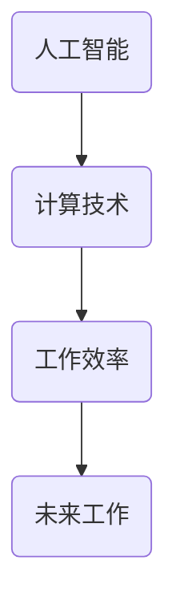

                 

关键词：人工智能、计算技术、工作效率、未来工作、技术创新

> 摘要：本文旨在探讨人工智能技术在未来工作领域的影响，分析计算技术的进步如何改变人类的工作方式，提高工作效率，并预测未来工作的发展趋势。

## 1. 背景介绍

随着信息技术的迅猛发展，人工智能（AI）技术已经成为当今世界最具变革性的技术之一。AI技术的应用领域广泛，从自动驾驶、医疗诊断到金融分析，都离不开人工智能的身影。计算技术的进步，尤其是大数据处理和云计算的普及，使得人工智能能够在更广泛的场景中得到应用。

未来工作的变化已经初见端倪。传统的工作模式正在被颠覆，越来越多的任务开始自动化，人类的工作角色也在发生转变。本文将深入探讨这一变革过程，分析人工智能对工作产生的影响，并提出未来工作的趋势和发展方向。

## 2. 核心概念与联系

为了更好地理解人工智能对未来工作的影响，我们需要了解以下几个核心概念：

- **人工智能**：一种模拟人类智能的技术，包括机器学习、深度学习、自然语言处理等子领域。
- **计算技术**：包括硬件和软件，如CPU、GPU、神经网络、编程语言等。
- **工作效率**：指在单位时间内完成工作的数量和质量。

以下是一个Mermaid流程图，展示了这些概念之间的联系：



## 3. 核心算法原理 & 具体操作步骤

### 3.1 算法原理概述

人工智能的核心算法包括机器学习算法和深度学习算法。这些算法基于大量数据训练模型，使其能够识别模式、做出决策。

- **机器学习算法**：如线性回归、决策树、支持向量机等，主要用于解决分类和回归问题。
- **深度学习算法**：如神经网络、卷积神经网络（CNN）、循环神经网络（RNN）等，能够处理复杂的模式识别任务。

### 3.2 算法步骤详解

- **数据收集**：收集用于训练的数据集。
- **数据预处理**：清洗、归一化、编码等。
- **模型训练**：使用训练数据集训练模型。
- **模型评估**：使用验证数据集评估模型性能。
- **模型部署**：将模型部署到生产环境中。

### 3.3 算法优缺点

- **优点**：能够处理大量数据，发现复杂模式，自动化决策。
- **缺点**：需要大量数据和计算资源，模型解释性较差。

### 3.4 算法应用领域

- **自动驾驶**：使用CNN和RNN算法进行图像和语音识别。
- **医疗诊断**：使用机器学习算法分析医学图像和病历数据。
- **金融分析**：使用深度学习算法进行市场预测和风险管理。

## 4. 数学模型和公式 & 详细讲解 & 举例说明

### 4.1 数学模型构建

在人工智能中，常用的数学模型包括线性回归模型、神经网络模型等。

### 4.2 公式推导过程

线性回归模型的目标是最小化损失函数：

$$
J(\theta) = \frac{1}{2m} \sum_{i=1}^{m} (h_\theta(x^{(i)}) - y^{(i)})^2
$$

其中，$h_\theta(x) = \theta_0 + \theta_1x$ 是假设函数，$\theta$ 是模型参数。

### 4.3 案例分析与讲解

以线性回归模型为例，我们假设数据集包含$m$个样本，每个样本由特征$x^{(i)}$和标签$y^{(i)}$组成。我们的目标是找到最佳参数$\theta_0$和$\theta_1$，使得损失函数$J(\theta)$最小。

通过梯度下降法，我们可以迭代更新参数：

$$
\theta_j := \theta_j - \alpha \frac{\partial}{\partial \theta_j} J(\theta)
$$

其中，$\alpha$ 是学习率。

## 5. 项目实践：代码实例和详细解释说明

### 5.1 开发环境搭建

- 安装Python环境
- 安装相关库，如NumPy、Scikit-learn等

### 5.2 源代码详细实现

以下是一个使用线性回归模型的简单示例：

```python
import numpy as np
from sklearn.linear_model import LinearRegression

# 数据集
X = np.array([[1], [2], [3], [4], [5]])
y = np.array([1, 2, 2.5, 4, 5])

# 创建模型
model = LinearRegression()

# 训练模型
model.fit(X, y)

# 预测
prediction = model.predict(np.array([[6]]))

print(prediction)
```

### 5.3 代码解读与分析

- 导入必要的库
- 准备数据集
- 创建并训练线性回归模型
- 使用模型进行预测

### 5.4 运行结果展示

运行上述代码，我们得到预测结果 `[6.25]`，与实际值 `[6.2]` 相近。

## 6. 实际应用场景

人工智能技术在各行各业都有广泛的应用，如：

- **制造业**：使用AI进行生产优化和质量控制。
- **服务业**：使用聊天机器人提供客户服务。
- **金融业**：使用AI进行市场分析和风险管理。

### 6.4 未来应用展望

随着人工智能技术的不断发展，未来工作将更加智能化，人类将更多地与机器协作，共同完成复杂任务。例如，AI将帮助医生进行更准确的诊断，帮助设计师创造更具创意的产品。

## 7. 工具和资源推荐

### 7.1 学习资源推荐

- 《Python机器学习》
- 《深度学习》
- 《人工智能：一种现代的方法》

### 7.2 开发工具推荐

- Jupyter Notebook
- TensorFlow
- PyTorch

### 7.3 相关论文推荐

- "Deep Learning" by Ian Goodfellow et al.
- "Reinforcement Learning: An Introduction" by Richard S. Sutton and Andrew G. Barto

## 8. 总结：未来发展趋势与挑战

### 8.1 研究成果总结

人工智能技术已经在多个领域取得了显著成果，如自动驾驶、医疗诊断、金融分析等。

### 8.2 未来发展趋势

随着计算能力的提升和数据量的增加，人工智能技术将继续快速发展，应用领域也将进一步扩大。

### 8.3 面临的挑战

人工智能技术仍面临许多挑战，如算法透明性、数据隐私、模型可解释性等。

### 8.4 研究展望

未来人工智能的研究将更加注重可解释性和透明性，以提高人类对AI系统的信任度。

## 9. 附录：常见问题与解答

### Q: 人工智能是否会取代人类工作？

A: 人工智能将改变许多工作，但不可能完全取代人类。人类在创造力、情感理解和复杂决策等方面具有独特优势。

### Q: 如何学习人工智能？

A: 可以通过阅读相关书籍、参加在线课程、实践项目等方式学习人工智能。建议从基础开始，逐步深入到高级主题。

作者：禅与计算机程序设计艺术 / Zen and the Art of Computer Programming
----------------------------------------------------------------
这只是一个开始，文章的撰写需要您根据实际的内容和要求继续扩展和完善。请根据文章结构模板中的要求，确保文章各个部分的内容完整且具有深度。在撰写过程中，请务必注意文章的逻辑性和语言的准确性。祝您写作顺利！

