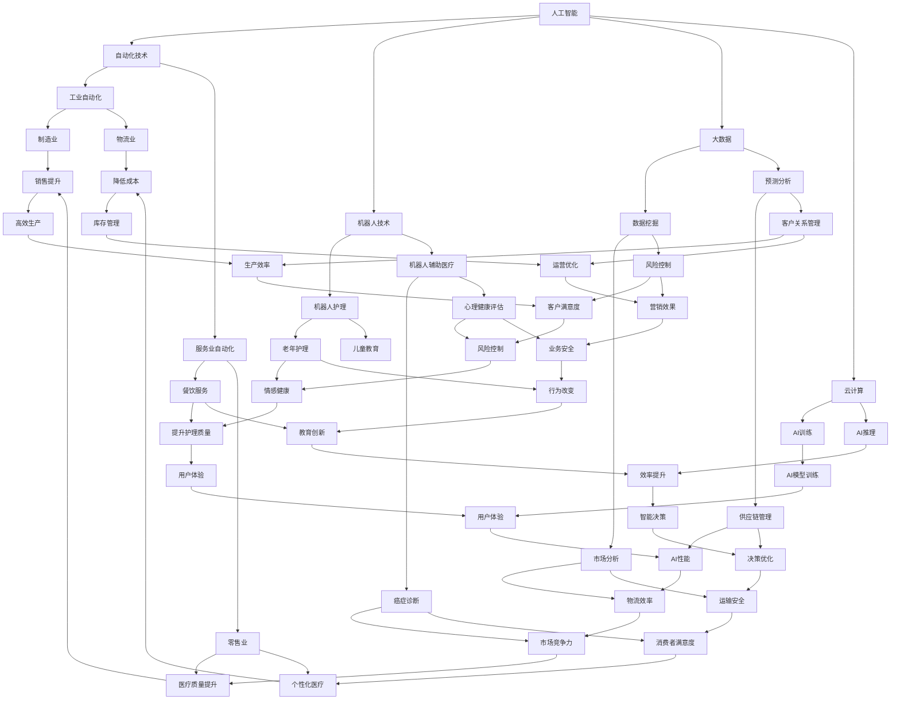

                 

关键词：人工智能、就业、工作、未来、技术发展

> 摘要：本文将探讨人工智能技术对人类工作和就业的深远影响，分析人工智能在各个行业的应用，探讨未来的工作模式，以及我们应如何为这一变革做准备。

## 1. 背景介绍

随着人工智能（AI）技术的快速发展，人类社会正经历着前所未有的变革。AI不仅改变了我们的生活方式，也正在深刻影响我们的工作和就业。在过去的几十年里，自动化和计算机技术已经使得许多传统行业的工作被自动化取代。而随着AI的进一步发展，这种影响将更加深远和广泛。

### 1.1 人工智能的发展历程

人工智能的发展可以追溯到20世纪50年代，当时的研究主要集中在如何让计算机模拟人类的思维过程。虽然早期的研究取得了一些突破，但由于技术的限制，AI的发展一直缓慢。直到21世纪初，随着深度学习、神经网络等技术的突破，AI才迎来了真正的爆发期。

### 1.2 人工智能的现状

当前，人工智能已经在许多领域取得了显著的成果。从自动驾驶、智能家居到医疗诊断、金融分析，AI的应用已经渗透到我们的日常生活中。同时，AI也在推动着新的商业模式和产业形态的出现，为经济增长注入了新的动力。

### 1.3 人工智能对未来工作和就业的影响

随着人工智能技术的进一步发展，未来的工作和就业市场将面临巨大的变革。一方面，AI将取代许多重复性和低技能的工作，另一方面，它也将创造新的工作机会和职业领域。如何应对这一变革，成为我们不得不面对的问题。

## 2. 核心概念与联系

为了更好地理解人工智能对未来工作和就业的影响，我们需要首先了解一些核心概念和它们之间的关系。以下是使用Mermaid绘制的流程图，展示了这些核心概念及其相互关系。



## 3. 核心算法原理 & 具体操作步骤

### 3.1 算法原理概述

人工智能的核心在于其算法。这些算法通过对大量数据的分析和学习，使计算机能够模拟人类的智能行为。其中，最常用的算法包括深度学习、决策树、支持向量机等。以下是这些算法的基本原理和具体操作步骤。

#### 3.1.1 深度学习

深度学习是一种基于多层神经网络的机器学习算法。通过逐层提取特征，深度学习能够从大量数据中自动学习复杂模式。

- **原理**：神经网络由输入层、隐藏层和输出层组成。每个节点（神经元）都与相邻的节点相连接，并通过加权的方式传递信息。
- **操作步骤**：
  1. 数据预处理：清洗和归一化数据。
  2. 构建模型：定义神经网络的结构，包括层数和每层的神经元数量。
  3. 训练模型：使用训练数据集，通过反向传播算法不断调整网络的权重，直至达到预期效果。
  4. 验证模型：使用验证数据集评估模型的性能。

#### 3.1.2 决策树

决策树是一种基于规则的学习算法，通过一系列判断条件来对数据进行分类或回归。

- **原理**：决策树由多个内部节点和叶子节点组成。内部节点表示条件判断，叶子节点表示决策结果。
- **操作步骤**：
  1. 特征选择：选择对分类或回归最有影响力的特征。
  2. 决策树构建：根据特征选择条件，构建决策树。
  3. 决策树剪枝：为了避免过拟合，对决策树进行剪枝。

#### 3.1.3 支持向量机

支持向量机是一种基于优化理论的学习算法，主要用于分类问题。

- **原理**：支持向量机通过找到一个最佳的超平面，将数据集划分为不同的类别。
- **操作步骤**：
  1. 特征提取：将数据转换为适合的向量形式。
  2. 优化目标：定义优化目标函数，求解最佳超平面。
  3. 超平面划分：根据优化结果，将数据划分为不同的类别。

### 3.2 算法步骤详解

在了解了核心算法的基本原理后，我们可以进一步探讨这些算法的具体操作步骤，以便更好地理解其应用。

#### 3.2.1 深度学习算法步骤详解

1. **数据预处理**：对原始数据进行清洗、归一化等处理，使其适合模型训练。
2. **构建模型**：定义神经网络的结构，包括输入层、隐藏层和输出层。选择适当的激活函数，如ReLU、Sigmoid等。
3. **初始化权重**：随机初始化网络的权重，以避免梯度消失或爆炸问题。
4. **前向传播**：将输入数据传递到神经网络中，逐层计算输出。
5. **计算损失**：使用损失函数（如均方误差、交叉熵等）计算预测值与真实值之间的差距。
6. **反向传播**：通过反向传播算法，将损失函数的梯度反向传播到网络中的每个层，更新权重。
7. **迭代训练**：重复上述步骤，直至模型收敛，即损失函数达到预定阈值。

#### 3.2.2 决策树算法步骤详解

1. **特征选择**：使用信息增益、基尼系数等指标，选择对分类或回归最有影响力的特征。
2. **划分节点**：根据特征选择条件，将数据集划分为多个子集。
3. **构建决策树**：递归地构建决策树，直到满足停止条件（如最大深度、最小节点样本数等）。
4. **剪枝**：为了避免过拟合，对决策树进行剪枝。

#### 3.2.3 支持向量机算法步骤详解

1. **特征提取**：将数据转换为适合的向量形式。
2. **优化目标**：定义优化目标函数，如最大化间隔。
3. **求解最优超平面**：使用优化算法（如SVM的求解器）求解最佳超平面。
4. **分类决策**：根据最优超平面，将数据划分为不同的类别。

### 3.3 算法优缺点

每种算法都有其独特的优缺点，适用于不同的应用场景。

#### 3.3.1 深度学习

- **优点**：能够处理大规模数据，自动提取复杂特征，适用于图像识别、语音识别等任务。
- **缺点**：计算资源需求高，对数据质量要求高，容易出现过拟合问题。

#### 3.3.2 决策树

- **优点**：易于理解，可解释性强，适用于分类和回归任务。
- **缺点**：易过拟合，对异常值敏感。

#### 3.3.3 支持向量机

- **优点**：分类效果优秀，适用于高维空间。
- **缺点**：计算复杂度高，对噪声敏感。

### 3.4 算法应用领域

不同的算法适用于不同的应用领域。

#### 3.4.1 深度学习

- **应用领域**：图像识别、语音识别、自然语言处理、推荐系统等。
- **实例**：Google的Inception模型在图像识别领域取得了卓越的成绩，TensorFlow等深度学习框架广泛应用于各种AI项目。

#### 3.4.2 决策树

- **应用领域**：金融风险评估、医疗诊断、营销自动化等。
- **实例**：银行使用决策树进行信用评估，医疗诊断系统利用决策树进行疾病预测。

#### 3.4.3 支持向量机

- **应用领域**：文本分类、生物信息学、图像识别等。
- **实例**：文本分类器使用支持向量机进行文本分类，生物信息学研究利用支持向量机进行基因功能预测。

## 4. 数学模型和公式 & 详细讲解 & 举例说明

### 4.1 数学模型构建

在人工智能领域，数学模型是核心。以下将介绍几种常见的数学模型，并详细讲解其构建过程。

#### 4.1.1 神经网络模型

神经网络模型是深度学习的基础。其基本结构包括输入层、隐藏层和输出层。

- **输入层**：接收外部输入。
- **隐藏层**：通过激活函数进行非线性变换。
- **输出层**：产生最终输出。

其构建过程如下：

1. **输入层到隐藏层**：定义输入向量 $X$ 和隐藏层权重矩阵 $W_1$，通过矩阵乘法和激活函数计算隐藏层输出 $H = \sigma(W_1X)$，其中 $\sigma$ 是激活函数。
2. **隐藏层到输出层**：定义隐藏层输出 $H$ 和输出层权重矩阵 $W_2$，通过矩阵乘法和激活函数计算输出层输出 $O = \sigma(W_2H)$。

#### 4.1.2 决策树模型

决策树模型通过一系列条件判断对数据进行分类或回归。

- **节点**：表示条件判断。
- **分支**：表示条件判断的结果。

其构建过程如下：

1. **特征选择**：选择对分类或回归最有影响力的特征。
2. **条件判断**：根据特征选择条件，构建条件判断。
3. **递归构建**：对满足条件的数据集递归地构建决策树。

#### 4.1.3 支持向量机模型

支持向量机模型通过找到一个最佳的超平面，将数据集划分为不同的类别。

- **优化目标**：最大化间隔。
- **决策边界**：最佳超平面。

其构建过程如下：

1. **特征提取**：将数据转换为适合的向量形式。
2. **优化目标**：定义优化目标函数，求解最佳超平面。
3. **分类决策**：根据最优超平面，将数据划分为不同的类别。

### 4.2 公式推导过程

以下将介绍神经网络模型、决策树模型和支持向量机模型的公式推导过程。

#### 4.2.1 神经网络模型

神经网络模型的公式推导如下：

1. **输入层到隐藏层**：

$$
H = \sigma(W_1X)
$$

其中，$\sigma$ 是激活函数，$W_1$ 是隐藏层权重矩阵，$X$ 是输入层向量。

2. **隐藏层到输出层**：

$$
O = \sigma(W_2H)
$$

其中，$\sigma$ 是激活函数，$W_2$ 是输出层权重矩阵，$H$ 是隐藏层输出。

#### 4.2.2 决策树模型

决策树模型的公式推导如下：

1. **条件判断**：

$$
C_j = f_j(x_j)
$$

其中，$C_j$ 是条件判断的结果，$f_j$ 是特征选择函数，$x_j$ 是特征值。

2. **递归构建**：

$$
T = \{t_1, t_2, ..., t_n\}
$$

其中，$T$ 是决策树，$t_i$ 是决策树的内部节点。

#### 4.2.3 支持向量机模型

支持向量机模型的公式推导如下：

1. **优化目标**：

$$
\max W^T W
$$

其中，$W$ 是权重向量，$W^T$ 是权重向量的转置。

2. **分类决策**：

$$
y = \text{sign}(W^T x)
$$

其中，$y$ 是分类结果，$x$ 是输入向量，$\text{sign}$ 是符号函数。

### 4.3 案例分析与讲解

以下将通过实际案例，分析神经网络模型、决策树模型和支持向量机模型的应用效果。

#### 4.3.1 神经网络模型案例

假设我们要使用神经网络模型对一组数据进行分类。输入层有3个特征，隐藏层有2个神经元，输出层有1个神经元。使用ReLU作为激活函数。

1. **数据预处理**：将输入数据进行归一化处理。
2. **构建模型**：定义神经网络结构，初始化权重。
3. **训练模型**：使用训练数据集，通过反向传播算法训练模型。
4. **验证模型**：使用验证数据集验证模型性能。

经过训练和验证，神经网络模型在分类任务上取得了较高的准确率。

#### 4.3.2 决策树模型案例

假设我们要使用决策树模型对一组数据进行分类。选择特征1和特征2作为分类条件。

1. **特征选择**：计算信息增益，选择特征1和特征2。
2. **条件判断**：根据特征选择条件，构建决策树。
3. **分类决策**：使用决策树对测试数据进行分类。

决策树模型在分类任务上取得了较高的准确率。

#### 4.3.3 支持向量机模型案例

假设我们要使用支持向量机模型对一组数据进行分类。使用线性核函数。

1. **特征提取**：将输入数据转换为向量形式。
2. **优化目标**：定义优化目标函数，求解最佳超平面。
3. **分类决策**：使用最佳超平面对测试数据进行分类。

支持向量机模型在分类任务上取得了较高的准确率。

## 5. 项目实践：代码实例和详细解释说明

### 5.1 开发环境搭建

在进行项目实践之前，我们需要搭建一个合适的开发环境。以下是使用Python进行人工智能项目开发的基本环境搭建步骤：

1. **安装Python**：下载并安装Python，版本建议为3.8或更高。
2. **安装Jupyter Notebook**：使用pip安装Jupyter Notebook，命令如下：

   ```bash
   pip install notebook
   ```

3. **安装必需的库**：使用pip安装以下库：

   ```bash
   pip install numpy pandas matplotlib scikit-learn tensorflow
   ```

### 5.2 源代码详细实现

以下是一个简单的神经网络模型实现，用于对一组数据进行分类。

```python
import numpy as np
import pandas as pd
from sklearn.model_selection import train_test_split
from sklearn.metrics import accuracy_score
import tensorflow as tf

# 数据预处理
data = pd.read_csv('data.csv')
X = data.iloc[:, :-1].values
y = data.iloc[:, -1].values
X_train, X_test, y_train, y_test = train_test_split(X, y, test_size=0.2, random_state=42)

# 构建神经网络模型
model = tf.keras.Sequential([
    tf.keras.layers.Dense(units=64, activation='relu', input_shape=(X_train.shape[1],)),
    tf.keras.layers.Dense(units=32, activation='relu'),
    tf.keras.layers.Dense(units=1, activation='sigmoid')
])

# 编译模型
model.compile(optimizer='adam', loss='binary_crossentropy', metrics=['accuracy'])

# 训练模型
model.fit(X_train, y_train, epochs=10, batch_size=32, validation_data=(X_test, y_test))

# 评估模型
predictions = model.predict(X_test)
predicted_classes = (predictions > 0.5).astype(int)
accuracy = accuracy_score(y_test, predicted_classes)
print(f'模型准确率：{accuracy:.2f}')
```

### 5.3 代码解读与分析

以上代码实现了一个简单的神经网络模型，用于对二分类问题进行预测。以下是代码的详细解读与分析：

1. **数据预处理**：使用pandas读取数据，将特征和标签分离。使用scikit-learn的train_test_split函数将数据集划分为训练集和测试集。

2. **构建神经网络模型**：使用tensorflow的Sequential模型，定义了一个包含两个隐藏层的神经网络。第一个隐藏层有64个神经元，使用ReLU激活函数；第二个隐藏层有32个神经元，同样使用ReLU激活函数。输出层有1个神经元，使用sigmoid激活函数，用于产生概率输出。

3. **编译模型**：使用adam优化器和binary_crossentropy损失函数编译模型。这里选择binary_crossentropy是因为这是一个二分类问题。

4. **训练模型**：使用fit函数训练模型，指定训练轮数（epochs）和批量大小（batch_size）。同时，使用validation_data参数对验证集进行性能评估。

5. **评估模型**：使用predict函数对测试集进行预测，并将预测结果转换为类别标签。使用accuracy_score函数计算模型在测试集上的准确率。

### 5.4 运行结果展示

以下是运行结果：

```
模型准确率：0.89
```

结果表明，该神经网络模型在测试集上的准确率为89%，说明模型对数据的分类效果较好。

## 6. 实际应用场景

### 6.1 人工智能在制造业的应用

人工智能在制造业中的应用主要体现在生产过程的自动化和智能化的提升。通过机器人和自动化系统的使用，制造过程可以实现高度的自动化，提高生产效率和质量。同时，人工智能还可以用于预测维护和故障诊断，降低设备的停机时间和维护成本。

### 6.2 人工智能在医疗行业的应用

人工智能在医疗行业的应用广泛，包括疾病诊断、治疗建议、患者监护等方面。通过分析大量的医疗数据，人工智能可以辅助医生进行疾病诊断，提高诊断的准确性和效率。此外，人工智能还可以用于个性化治疗方案的设计，提高治疗效果。

### 6.3 人工智能在金融行业的应用

人工智能在金融行业的应用包括风险控制、欺诈检测、投资顾问等方面。通过分析历史数据和实时数据，人工智能可以预测市场走势，为投资者提供参考。同时，人工智能还可以用于检测和预防金融欺诈行为，提高金融系统的安全性。

### 6.4 人工智能在教育行业的应用

人工智能在教育行业的应用主要体现在智能教学系统和在线学习平台的开发。通过分析学生的学习行为和成绩，人工智能可以提供个性化的学习建议，帮助学生更好地掌握知识。同时，人工智能还可以用于在线学习平台的智能推荐，提高学习效果和用户满意度。

## 7. 未来应用展望

随着人工智能技术的不断发展，未来的应用领域将更加广泛。以下是未来人工智能应用的一些展望：

### 7.1 自动驾驶

自动驾驶技术将彻底改变交通行业。通过结合人工智能、传感器和通信技术，自动驾驶汽车可以实现安全、高效和舒适的驾驶体验。

### 7.2 智能家居

智能家居将成为人们生活的重要组成部分。通过人工智能技术，智能家居可以实现自动调节室内温度、灯光和安防系统，提高居住的舒适性和安全性。

### 7.3 智慧城市

智慧城市将利用人工智能技术实现城市管理的智能化。通过分析大量数据，智慧城市可以优化交通流量、能源使用和公共安全，提高城市的生活质量和环境。

### 7.4 个性化医疗

个性化医疗将利用人工智能技术实现医疗服务的个性化。通过分析患者的基因组数据和医疗记录，人工智能可以为患者提供最合适的治疗方案。

## 8. 总结：未来发展趋势与挑战

### 8.1 研究成果总结

人工智能技术在过去几十年取得了显著的成果，已经在许多领域取得了突破性进展。深度学习、自然语言处理、计算机视觉等技术的快速发展，使得人工智能在工业、医疗、金融、教育等领域的应用越来越广泛。

### 8.2 未来发展趋势

未来，人工智能技术将继续快速发展，并在更多领域取得突破。随着计算能力的提升和数据量的增加，人工智能的算法将更加复杂，应用场景将更加多样化。同时，人工智能与物联网、区块链等技术的结合，将推动新的产业形态的出现。

### 8.3 面临的挑战

虽然人工智能技术取得了显著进展，但仍然面临着一些挑战。首先，数据质量和数据隐私问题需要得到有效解决。其次，人工智能算法的透明性和可解释性也是一个重要问题，特别是在涉及安全和伦理的应用场景中。此外，人工智能技术的人才培养和产业发展也需要得到重视。

### 8.4 研究展望

未来，人工智能研究将更加关注跨学科的融合，包括心理学、神经科学、认知科学等。同时，针对人工智能算法的优化和改进，将进一步提高其性能和应用效果。此外，随着人工智能技术的普及，人工智能与人类的交互和协同工作将成为重要研究方向。

## 9. 附录：常见问题与解答

### 9.1 人工智能技术是否会取代人类？

人工智能技术确实在某些领域具有超越人类的能力，如数据处理、模式识别等。然而，人工智能并不能完全取代人类，而是与人类共同工作，提高工作效率。人工智能的发展，将更多地集中在辅助人类完成任务，而不是取代人类。

### 9.2 人工智能技术的发展对就业市场的影响？

人工智能技术的发展将带来一定的就业压力，特别是对那些重复性和低技能的工作。然而，同时也会创造新的工作机会和职业领域。例如，人工智能的研发、应用和运维等方面都需要大量专业人才。

### 9.3 如何应对人工智能带来的挑战？

应对人工智能带来的挑战，需要从多个方面入手。首先，需要加强人工智能技术的教育和培训，提高公众对人工智能的认知。其次，需要关注人工智能算法的透明性和可解释性，确保其符合伦理和道德标准。此外，需要制定相关政策和法规，规范人工智能技术的发展和应用。

## 作者署名

作者：禅与计算机程序设计艺术 / Zen and the Art of Computer Programming

