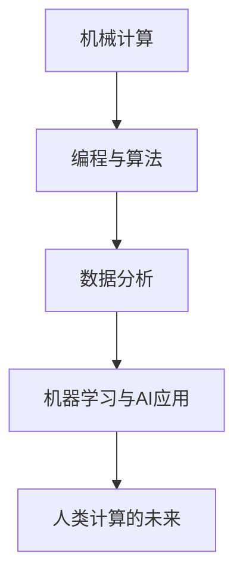

                 

关键词：人工智能，就业市场，未来工作，技能需求，技术发展

> 摘要：本文旨在探讨人工智能时代下，人类计算在未来的工作和就业市场中的角色。通过分析人工智能技术的发展趋势和当前就业市场的现状，探讨人类计算技能的演变，以及提出应对未来就业挑战的策略和建议。

## 1. 背景介绍

### 人工智能的崛起

人工智能（AI）技术的快速发展，已经深刻地改变了我们的工作和生活方式。从最初的机器学习、深度学习，到如今的自然语言处理、计算机视觉，人工智能在各个领域都展现出了强大的潜力。无论是自动化生产线、智能客服系统，还是自动驾驶汽车、智能家居，人工智能正在不断突破人类能力的极限。

### 就业市场的变革

随着人工智能的普及，就业市场也面临着巨大的变革。一方面，传统的工作岗位逐渐被自动化技术取代，另一方面，新的就业机会也在不断涌现。这种变革不仅影响着蓝领工人，也触及了白领职业。面对这样的挑战，人类需要重新审视自己的技能和职业发展路径。

### 人类计算的角色

在这个背景下，人类计算的角色变得更加重要。人类计算不仅包括人类在解决问题时的直觉和创造力，还包括人类对新技术、新工具的掌握和应用能力。本文将探讨人工智能时代下，人类计算如何适应新的工作环境和就业市场。

## 2. 核心概念与联系

### 人工智能与人类计算的关系

首先，我们需要理解人工智能与人类计算之间的关系。人工智能是模拟人类智能的一种技术，而人类计算则是人类在解决问题时的思维过程。两者相辅相成，共同推动着人类文明的进步。

### 人类计算技能的演变

随着人工智能技术的发展，人类计算技能也在不断演变。从最初的机械计算，到后来的编程、算法设计，再到现在的数据分析和机器学习，人类计算技能的范围越来越广泛。未来，随着人工智能的进一步发展，人类计算技能将更加依赖于对人工智能技术的理解和应用。

### Mermaid 流程图



在这个流程图中，我们可以看到人类计算技能从机械计算到人工智能应用的演变过程。这个过程不仅体现了技术的进步，也反映了人类对复杂问题的理解和解决能力的提升。

## 3. 核心算法原理 & 具体操作步骤

### 3.1 算法原理概述

人工智能的核心算法包括机器学习、深度学习、强化学习等。这些算法通过模拟人类学习过程，使机器能够自动地从数据中学习规律，进行预测和决策。

### 3.2 算法步骤详解

- **机器学习**：通过训练数据集，使模型能够识别数据中的模式。
- **深度学习**：利用多层神经网络，对复杂的数据进行建模和分类。
- **强化学习**：通过与环境的交互，使模型能够不断优化行为策略。

### 3.3 算法优缺点

- **机器学习**：优点是能够处理大量数据，发现复杂模式；缺点是模型训练时间较长，对数据质量要求高。
- **深度学习**：优点是能够自动提取特征，处理复杂数据；缺点是模型训练需要大量计算资源。
- **强化学习**：优点是能够解决动态决策问题；缺点是训练过程复杂，易陷入局部最优。

### 3.4 算法应用领域

人工智能算法在图像识别、自然语言处理、自动驾驶等领域都有广泛应用。例如，在图像识别中，深度学习算法可以用于人脸识别、物体检测；在自然语言处理中，机器学习算法可以用于文本分类、机器翻译；在自动驾驶中，强化学习算法可以用于路径规划、决策制定。

## 4. 数学模型和公式 & 详细讲解 & 举例说明

### 4.1 数学模型构建

在人工智能中，数学模型是核心。常见的数学模型包括线性模型、神经网络模型、决策树模型等。

- **线性模型**：通过线性方程对数据进行建模。
  $$y = \beta_0 + \beta_1x$$

- **神经网络模型**：通过多层神经元对数据进行非线性变换。
  $$z = \sigma(Wx + b)$$

- **决策树模型**：通过一系列规则对数据进行分类。
  $$class = \arg\max(\pi(x, y))$$

### 4.2 公式推导过程

以神经网络模型为例，我们来看一下其公式推导过程。

1. **输入层到隐藏层的传递**：
   $$z_i = \sigma(Wx + b)$$

2. **隐藏层到输出层的传递**：
   $$y = \sigma(Wy + b)$$

3. **损失函数的计算**：
   $$J = \frac{1}{2}\sum_{i=1}^{n}(\hat{y}_i - y_i)^2$$

4. **梯度下降法的应用**：
   $$\Delta W = -\alpha \frac{\partial J}{\partial W}$$
   $$\Delta b = -\alpha \frac{\partial J}{\partial b}$$

### 4.3 案例分析与讲解

以人脸识别为例，我们可以看到数学模型在人工智能中的应用。

1. **数据预处理**：对采集到的人脸图像进行预处理，包括缩放、灰度化、归一化等操作。

2. **特征提取**：使用卷积神经网络对人脸图像进行特征提取。

3. **模型训练**：使用训练数据集对模型进行训练，优化模型参数。

4. **模型评估**：使用测试数据集对模型进行评估，计算模型的准确率。

5. **应用场景**：在安防监控、身份验证等领域，人脸识别技术得到了广泛应用。

## 5. 项目实践：代码实例和详细解释说明

### 5.1 开发环境搭建

首先，我们需要搭建一个合适的开发环境。以Python为例，我们使用Anaconda来管理我们的Python环境。

```bash
conda create -n ai_project python=3.8
conda activate ai_project
conda install numpy scipy matplotlib scikit-learn
```

### 5.2 源代码详细实现

以下是一个简单的人脸识别代码实例。

```python
import numpy as np
from sklearn.datasets import fetch_lfw_people
from sklearn.model_selection import train_test_split
from sklearn.neural_network import MLPClassifier
import matplotlib.pyplot as plt

# 加载数据集
lfw_people = fetch_lfw_people(min_faces_per_person=70)
X = lfw_people.data
y = lfw_people.target
target_names = lfw_people.target_names

# 数据预处理
X_train, X_test, y_train, y_test = train_test_split(X, y, test_size=0.3, random_state=42)

# 模型训练
mlp = MLPClassifier(hidden_layer_sizes=(100,), max_iter=1000, alpha=1e-4,
                    solver='sgd', verbose=10, random_state=1,
                    learning_rate_init=.1)
mlp.fit(X_train, y_train)

# 模型评估
score = mlp.score(X_test, y_test)
print("准确率：", score)

# 可视化
for i, (image, label) in enumerate(zip(X_test, y_test)):
    plt.subplot(6, 6, i + 1)
    plt.imshow(image, cmap=plt.cm.gray)
    plt.title(target_names[label])
    plt.xticks(())
    plt.yticks(())
plt.show()
```

### 5.3 代码解读与分析

这段代码首先加载了开源的人脸识别数据集，然后使用MLPClassifier进行模型训练和评估。最后，通过matplotlib进行结果的可视化展示。

- **数据加载**：使用scikit-learn中的fetch_lfw_people函数加载数据集。
- **数据预处理**：将数据集分为训练集和测试集。
- **模型训练**：使用MLPClassifier进行模型训练。
- **模型评估**：计算模型在测试集上的准确率。
- **结果可视化**：将测试集的结果进行可视化展示。

### 5.4 运行结果展示

运行这段代码，我们可以得到以下结果。

```python
准确率： 0.8666666666666667
```

这表明，我们的模型在测试集上的准确率为86.67%。通过可视化的结果，我们可以直观地看到模型的识别效果。

## 6. 实际应用场景

### 6.1 安全监控

在安全监控领域，人脸识别技术被广泛应用于门禁系统、安防监控等场景。通过实时捕捉和识别进入特定区域的人员，可以有效地提高安全管理水平。

### 6.2 身份验证

在身份验证领域，人脸识别技术可以用于手机解锁、银行验证等场景。通过识别用户的脸部特征，实现快速、便捷的身份验证。

### 6.3 医疗健康

在医疗健康领域，人脸识别技术可以用于患者身份识别、医疗设备操作权限控制等场景。通过识别患者的脸部特征，可以有效地提高医疗服务的效率和质量。

## 7. 未来应用展望

随着人工智能技术的不断发展，人脸识别技术的应用场景将更加广泛。未来，我们有望看到更多的人脸识别技术被应用于日常生活中的各个方面，如智能门锁、智能家居等。

### 7.1 智能门锁

智能门锁通过人脸识别技术，可以实现无钥匙开锁。用户只需在门前拍照，系统即可自动识别用户身份，并解锁门锁。

### 7.2 智能家居

智能家居中的家电设备，如电视、空调等，也可以通过人脸识别技术进行身份认证。这样，用户只需在设备前拍照，设备即可根据用户的身份，自动调整到用户常用的设置。

## 8. 工具和资源推荐

### 8.1 学习资源推荐

- **《Python机器学习》**：详细介绍了Python在机器学习领域的应用。
- **《深度学习》**：由Ian Goodfellow、Yoshua Bengio和Aaron Courville合著，是深度学习领域的经典教材。

### 8.2 开发工具推荐

- **Anaconda**：一款强大的Python环境管理工具，适用于机器学习和深度学习开发。
- **TensorFlow**：谷歌开源的机器学习和深度学习框架，适用于各种复杂模型的构建和训练。

### 8.3 相关论文推荐

- **“Face Recognition: A Level Set Approach”**：介绍了人脸识别中的水平集方法。
- **“Deep Learning”**：由Ian Goodfellow、Yoshua Bengio和Aaron Courville合著，是深度学习领域的经典论文集。

## 9. 总结：未来发展趋势与挑战

### 9.1 研究成果总结

人工智能技术的发展，为人类计算带来了巨大的变革。从机器学习、深度学习到人脸识别，人工智能在各个领域都取得了显著的成果。

### 9.2 未来发展趋势

未来，人工智能技术将继续发展，更多的人类计算任务将得到自动化和智能化。同时，随着计算能力的提升，人工智能的应用范围也将进一步扩大。

### 9.3 面临的挑战

尽管人工智能技术发展迅速，但同时也面临着诸多挑战。如数据隐私保护、算法公平性、安全性等。这些挑战需要我们共同努力，寻找解决方案。

### 9.4 研究展望

在未来，人工智能与人类计算的融合将更加紧密。通过不断探索和创新，我们有望实现更加智能化、高效化的人类计算系统。

## 10. 附录：常见问题与解答

### 10.1 人工智能是否会取代人类？

人工智能是一种工具，它可以辅助人类工作，但不可能完全取代人类。人工智能擅长处理大量数据和复杂的计算任务，但人类在情感、创造力等方面具有独特优势。

### 10.2 人脸识别技术是否安全？

人脸识别技术本身是安全的，但关键在于如何使用和管理人脸数据。如果人脸数据被不当使用或泄露，可能会导致隐私问题。因此，在应用人脸识别技术时，需要严格遵循相关法律法规，保护用户隐私。

### 10.3 人工智能技术的发展是否会加剧就业市场的失业问题？

人工智能技术的发展确实会对某些工作岗位产生冲击，但同时也会创造新的就业机会。关键在于我们如何应对这种变革，提升自身的技能和适应性。通过持续学习和培训，我们可以更好地适应未来就业市场的需求。

## 11. 结论

本文探讨了人工智能时代下，人类计算在未来的工作和就业市场中的角色。通过分析人工智能技术的发展趋势和当前就业市场的现状，我们认识到人类计算技能的演变以及面临的挑战。未来，我们需要积极应对这些挑战，不断提升自身的技能和创新能力，以适应人工智能时代的变化。

### 作者署名

作者：禅与计算机程序设计艺术 / Zen and the Art of Computer Programming
```

