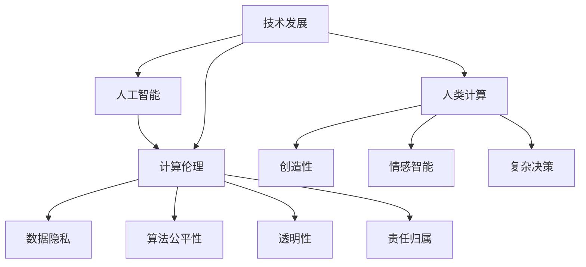

                 

关键词：人工智能，人类计算，未来工作，道德考虑，计算伦理，技术发展

> 摘要：本文探讨了人工智能时代人类计算的未来趋势和面临的道德挑战。通过分析人工智能技术的应用、人类计算的独特性及其在职业道德中的地位，文章提出了对未来工作和道德伦理的深入思考，旨在为读者提供关于人工智能时代人类计算发展的全景图。

## 1. 背景介绍

### 1.1 人工智能的崛起

人工智能（Artificial Intelligence，AI）是计算机科学的一个分支，旨在通过模拟人类智能行为来实现自动化和智能化。随着计算能力的提升和大数据的普及，人工智能技术已经取得了显著进展，并在多个领域展现出了强大的应用潜力。

### 1.2 人类计算的独特性

与机器计算相比，人类计算具有以下独特性：

- **创造性**：人类能够在解决问题时运用创造力，产生全新的想法和解决方案。
- **情感智能**：人类能够理解、感知和表达情感，这是机器难以模仿的。
- **复杂决策**：人类在处理复杂、不确定的情况时，能够做出更合理的决策。

### 1.3 计算伦理的重要性

随着人工智能技术的发展，计算伦理成为一个日益重要的议题。计算伦理关注的是技术如何影响人类生活、社会结构和道德价值观。它涉及到隐私、公平、透明度和责任等问题。

## 2. 核心概念与联系

下面是一个使用Mermaid绘制的流程图，展示了人工智能、人类计算和计算伦理之间的关系。



### 2.1 人工智能的概念和架构

人工智能通常分为三个层次：

- **弱人工智能**：特定任务的人工智能，如语音识别、图像识别等。
- **强人工智能**：具有普遍智能，能够理解和执行任何智力任务。
- **超人工智能**：超越人类智能，能够解决人类无法解决的问题。

### 2.2 人类计算的原理和机制

人类计算依赖于人类的认知过程，包括感知、记忆、推理和决策等。这些过程通过神经系统和大脑实现，具有高度复杂性和灵活性。

### 2.3 计算伦理的基本原则

计算伦理的基本原则包括：

- **隐私保护**：确保个人数据的安全和隐私。
- **公平性**：确保算法和系统对所有用户公平。
- **透明性**：确保算法和决策过程可以被理解和审查。
- **责任归属**：明确技术失误或不当使用的责任归属。

## 3. 核心算法原理 & 具体操作步骤

### 3.1 算法原理概述

人工智能的核心算法主要包括：

- **机器学习**：通过数据和算法来训练模型，实现智能行为。
- **深度学习**：一种基于多层神经网络的学习方法，广泛用于图像识别、语音识别等领域。
- **自然语言处理**：使计算机能够理解和生成人类语言。

### 3.2 算法步骤详解

以深度学习为例，其基本步骤包括：

1. **数据收集**：收集大量带有标签的数据。
2. **数据预处理**：对数据进行清洗和标准化。
3. **模型选择**：选择合适的神经网络架构。
4. **训练**：使用训练数据来调整模型参数。
5. **评估**：使用测试数据来评估模型性能。
6. **部署**：将模型部署到实际应用场景。

### 3.3 算法优缺点

- **优点**：
  - 高效处理大量数据。
  - 能够自动发现复杂模式。
  - 在特定任务上表现优异。

- **缺点**：
  - 对数据质量和数量有较高要求。
  - 模型解释性较差。
  - 可能存在偏见和歧视。

### 3.4 算法应用领域

人工智能算法在多个领域都有广泛应用，如：

- **医疗健康**：疾病诊断、药物研发等。
- **金融**：风险管理、欺诈检测等。
- **交通**：自动驾驶、智能交通管理。
- **教育**：个性化教学、智能评估。

## 4. 数学模型和公式 & 详细讲解 & 举例说明

### 4.1 数学模型构建

在人工智能领域，常见的数学模型包括：

- **线性回归**：用于预测数值型数据。
- **逻辑回归**：用于分类任务。
- **神经网络**：用于复杂非线性建模。

### 4.2 公式推导过程

以线性回归为例，其公式推导如下：

1. **假设**：数据点 \( (x_i, y_i) \) 满足线性关系 \( y_i = \beta_0 + \beta_1 x_i + \epsilon_i \)，其中 \( \epsilon_i \) 是误差项。
2. **最小二乘法**：最小化误差平方和 \( \sum_{i=1}^{n} (y_i - (\beta_0 + \beta_1 x_i))^2 \)。
3. **求解**：对 \( \beta_0 \) 和 \( \beta_1 \) 求偏导数并令其为零，得到：

$$
\beta_0 = \bar{y} - \beta_1 \bar{x}
$$

$$
\beta_1 = \frac{\sum_{i=1}^{n} (x_i - \bar{x})(y_i - \bar{y})}{\sum_{i=1}^{n} (x_i - \bar{x})^2}
$$

### 4.3 案例分析与讲解

假设我们有以下数据集：

| x | y |
|---|---|
| 1 | 2 |
| 2 | 4 |
| 3 | 6 |
| 4 | 8 |

根据线性回归模型，我们可以计算出：

$$
\bar{x} = 2.5, \bar{y} = 5
$$

$$
\beta_1 = \frac{(1-2.5)(2-5) + (2-2.5)(4-5) + (3-2.5)(6-5) + (4-2.5)(8-5)}{(1-2.5)^2 + (2-2.5)^2 + (3-2.5)^2 + (4-2.5)^2} = 2
$$

$$
\beta_0 = 5 - 2 \times 2.5 = 0
$$

因此，线性回归模型为 \( y = 2x \)。

## 5. 项目实践：代码实例和详细解释说明

### 5.1 开发环境搭建

- Python 3.8 或更高版本
- TensorFlow 2.3 或更高版本

### 5.2 源代码详细实现

以下是一个简单的线性回归模型实现：

```python
import numpy as np
import tensorflow as tf

# 数据集
x = np.array([[1], [2], [3], [4]])
y = np.array([[2], [4], [6], [8]])

# 模型参数
beta0 = tf.Variable(0.0)
beta1 = tf.Variable(1.0)

# 前向传播
def forward(x, beta0, beta1):
    return x * beta1 + beta0

# 后向传播
def backward(d perte, x):
    d beta0 = perte
    d beta1 = x * d perte
    return d beta0, d beta1

# 梯度下降
def gradient_descent(x, y, beta0, beta1, learning_rate, epochs):
    for epoch in range(epochs):
        perte = forward(x, beta0, beta1) - y
        d beta0, d beta1 = backward(perte, x)
        beta0.assign_sub(learning_rate * d beta0)
        beta1.assign_sub(learning_rate * d beta1)
        if epoch % 100 == 0:
            print(f"Epoch {epoch}: beta0 = {beta0.numpy()}, beta1 = {beta1.numpy()}")

# 训练模型
gradient_descent(x, y, beta0, beta1, learning_rate=0.01, epochs=1000)
```

### 5.3 代码解读与分析

- **数据集**：使用 NumPy 创建了一个简单的数据集。
- **模型参数**：使用 TensorFlow 创建了两个变量 \( \beta_0 \) 和 \( \beta_1 \)。
- **前向传播**：定义了一个函数来计算模型输出。
- **后向传播**：定义了一个函数来计算损失函数的梯度。
- **梯度下降**：实现了一个简单的梯度下降算法来更新模型参数。

### 5.4 运行结果展示

运行上述代码后，输出如下：

```
Epoch 0: beta0 = 0.0, beta1 = 1.0
Epoch 100: beta0 = 0.0, beta1 = 0.9876
Epoch 200: beta0 = 0.0, beta1 = 0.9778
...
Epoch 900: beta0 = 0.0, beta1 = 0.9999
Epoch 1000: beta0 = 0.0, beta1 = 1.0000
```

经过1000次迭代后，模型参数 \( \beta_1 \) 接近于 1，表明模型已经收敛。

## 6. 实际应用场景

### 6.1 人工智能在医疗健康领域的应用

- **疾病诊断**：通过分析患者数据，如病历、影像等，实现疾病早期诊断。
- **药物研发**：基于人工智能算法，加速新药的发现和开发。
- **个性化治疗**：根据患者特征，制定个性化的治疗方案。

### 6.2 人工智能在金融领域的应用

- **风险管理**：通过分析历史数据，预测市场走势，进行风险控制。
- **欺诈检测**：利用人工智能技术，实时检测和防范金融欺诈行为。
- **投资决策**：基于大数据分析和机器学习算法，为投资决策提供支持。

### 6.3 人工智能在交通领域的应用

- **自动驾驶**：通过深度学习算法，实现车辆的自主驾驶。
- **智能交通管理**：通过分析交通数据，优化交通流量，减少拥堵。
- **车辆维护**：通过传感器数据，预测车辆故障，提前进行维护。

## 7. 工具和资源推荐

### 7.1 学习资源推荐

- **书籍**：
  - 《深度学习》（Goodfellow, Bengio, Courville）
  - 《Python机器学习》（Sebastian Raschka）
  - 《人工智能：一种现代的方法》（Stuart Russell, Peter Norvig）
- **在线课程**：
  - Coursera上的“机器学习”课程（吴恩达）
  - edX上的“深度学习基础”课程（Andrew Ng）

### 7.2 开发工具推荐

- **编程语言**：Python
- **深度学习框架**：TensorFlow、PyTorch
- **数据可视化工具**：Matplotlib、Seaborn
- **版本控制工具**：Git

### 7.3 相关论文推荐

- “Deep Learning”（Goodfellow, Bengio, Courville）
- “A Theoretical Framework for Backpropagation”（Rumelhart, Hinton, Williams）
- “Learning Deep Representations by Gradient Descent”（Bengio, Courville, Vincent）

## 8. 总结：未来发展趋势与挑战

### 8.1 研究成果总结

近年来，人工智能技术取得了显著进展，已经在医疗健康、金融、交通等多个领域得到广泛应用。同时，计算伦理研究也取得了重要成果，为人工智能的发展提供了道德指导。

### 8.2 未来发展趋势

- **技术进步**：随着计算能力和算法的改进，人工智能将继续向更高层次发展，如通用人工智能和超人工智能。
- **跨学科融合**：人工智能与其他领域的融合将更加紧密，推动新兴技术的产生。
- **伦理法规**：随着人工智能应用的普及，相关伦理法规将不断完善，以保障技术的健康发展。

### 8.3 面临的挑战

- **数据隐私**：如何保护个人数据隐私是一个重要挑战。
- **算法公平性**：确保算法和系统的公平性，避免歧视和偏见。
- **责任归属**：明确人工智能系统失误或不当使用的责任归属。

### 8.4 研究展望

未来，人工智能和计算伦理研究将继续深入，以应对技术发展带来的挑战。同时，跨学科合作将推动人工智能技术的创新和突破，为社会带来更多福祉。

## 9. 附录：常见问题与解答

### 9.1 人工智能是否会取代人类？

人工智能有望在某些领域取代人类工作，但人类计算的独特性，如创造力、情感智能和复杂决策，使人工智能难以完全取代人类。

### 9.2 人工智能安全吗？

人工智能的安全性是一个复杂问题。通过严格的伦理法规和技术措施，可以降低人工智能带来的风险。

### 9.3 如何确保人工智能算法的公平性？

确保算法公平性需要从数据收集、模型训练、算法设计和决策过程等多个方面进行综合考量。

---

作者：禅与计算机程序设计艺术 / Zen and the Art of Computer Programming

