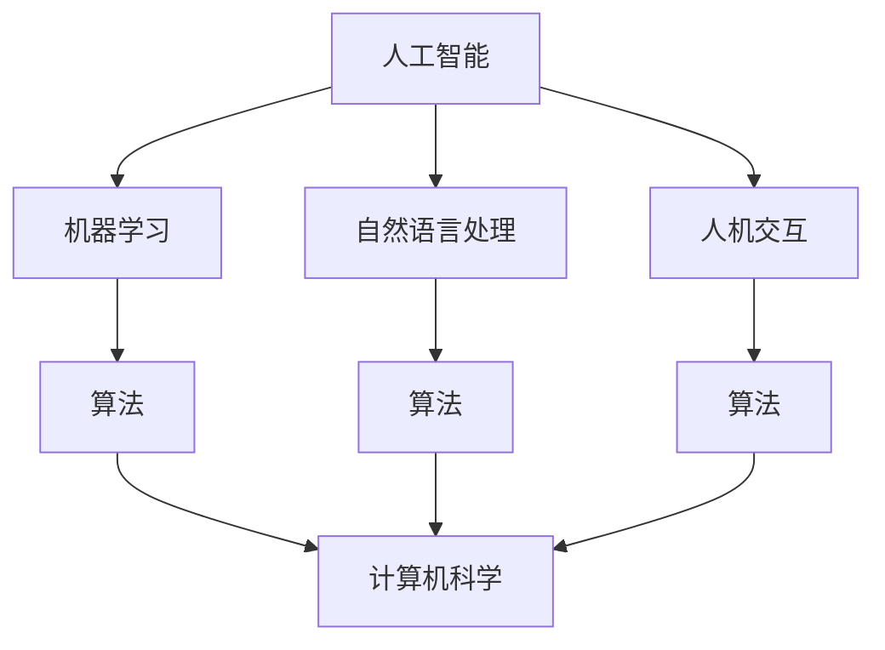

                 

关键词：人工智能，计算机科学，人机交互，科技发展，人文关怀

摘要：本文探讨了人工智能与计算机科学在当今科技发展中的重要作用，以及它们与人类生活的密切联系。通过对核心概念、算法原理、数学模型、项目实践和未来展望的详细分析，文章旨在揭示科技与人文的融合，以及这种融合对人类社会产生的深远影响。

## 1. 背景介绍

随着科技日新月异的发展，人工智能（AI）已经成为改变世界的核心力量。计算机科学作为AI的基础，正在推动各行各业的变革。然而，在科技飞速发展的同时，我们也不能忽视人文关怀的重要性。人工智能和计算机科学不仅需要技术创新，还需要在伦理、社会和文化等方面进行深入的思考。

本篇文章将从以下几个方面展开讨论：

1. 核心概念与联系
2. 核心算法原理 & 具体操作步骤
3. 数学模型和公式 & 详细讲解 & 举例说明
4. 项目实践：代码实例和详细解释说明
5. 实际应用场景
6. 未来应用展望
7. 工具和资源推荐
8. 总结：未来发展趋势与挑战

通过以上几个方面的深入探讨，我们将更好地理解人工智能和计算机科学如何与人类生活融合，以及这种融合对未来的影响。

## 2. 核心概念与联系

在探讨人工智能和计算机科学时，首先需要明确几个核心概念，它们是理解这一领域的关键。

### 人工智能（AI）

人工智能是指通过计算机模拟人类智能的技术。它包括机器学习、深度学习、自然语言处理等多个子领域。AI的目标是实现计算机系统具备人类智能水平的感知、理解、推理和决策能力。

### 计算机科学

计算机科学是研究计算机系统的理论、设计、实现、应用和未来的发展方向的科学。它涵盖了算法、编程语言、操作系统、计算机网络、人工智能等多个方面。

### 人机交互

人机交互是研究人与计算机系统如何交互的领域。它关注如何设计用户界面，使计算机系统能够更好地服务于人类需求。

### 伦理与社会

伦理和社会是人工智能和计算机科学需要考虑的重要方面。它们涉及到人工智能的伦理问题、隐私保护、就业影响等社会问题。

### 核心概念原理和架构的 Mermaid 流程图

为了更好地理解这些核心概念之间的联系，我们可以通过以下 Mermaid 流程图来展示：



在上面的流程图中，我们可以看到人工智能是核心，它与机器学习、自然语言处理和人机交互等子领域紧密相连。而计算机科学则是这些子领域的基础，为人工智能提供了强大的支持。

## 3. 核心算法原理 & 具体操作步骤

### 3.1 算法原理概述

人工智能的核心在于算法，而深度学习算法是当前最为流行的一种。深度学习是一种基于多层神经网络的人工智能算法，它通过模仿人类大脑的神经元连接结构，实现对数据的自动特征提取和模式识别。

### 3.2 算法步骤详解

深度学习算法的步骤可以分为以下几个阶段：

1. **数据预处理**：对输入数据进行清洗、归一化等处理，使其符合模型的输入要求。
2. **模型构建**：设计并构建深度学习模型，包括输入层、隐藏层和输出层。
3. **训练模型**：通过大量训练数据，调整模型的参数，使其达到预期的效果。
4. **评估模型**：使用测试数据评估模型的性能，确保其准确性和可靠性。
5. **应用模型**：将训练好的模型应用于实际场景，如图像识别、语音识别等。

### 3.3 算法优缺点

深度学习算法具有以下优点：

- **强大的特征提取能力**：能够自动提取数据中的高级特征，提高模型的识别能力。
- **泛化能力**：通过大量的训练数据，模型可以适应不同的数据分布和场景。
- **灵活性**：可以应用于各种不同的领域，如图像、语音、自然语言处理等。

然而，深度学习算法也存在一些缺点：

- **数据需求大**：需要大量的训练数据来训练模型，对于小数据集效果不佳。
- **计算资源消耗**：训练深度学习模型需要大量的计算资源和时间。
- **模型解释性差**：深度学习模型的内部结构复杂，难以解释和调试。

### 3.4 算法应用领域

深度学习算法在许多领域都取得了显著的成果，如：

- **计算机视觉**：图像识别、目标检测、图像生成等。
- **自然语言处理**：文本分类、机器翻译、情感分析等。
- **语音识别**：语音合成、语音识别、语音交互等。
- **自动驾驶**：车辆检测、路径规划、障碍物识别等。

通过以上对深度学习算法的详细分析，我们可以看到它在人工智能和计算机科学中的重要地位。

## 4. 数学模型和公式 & 详细讲解 & 举例说明

### 4.1 数学模型构建

深度学习算法的核心在于数学模型，其中最为重要的是神经网络模型。神经网络是一种基于数学模型的计算机算法，它通过模拟生物神经元的连接结构，实现对数据的处理和预测。

神经网络的数学模型可以用以下公式表示：

$$
Z = \sigma(\sum_{i=1}^{n} w_i \cdot x_i + b)
$$

其中，$Z$ 是输出值，$\sigma$ 是激活函数，$w_i$ 和 $x_i$ 分别是权重和输入值，$b$ 是偏置项。

### 4.2 公式推导过程

神经网络的数学模型是通过反向传播算法进行训练的。反向传播算法是一种基于梯度下降的优化方法，它通过不断调整权重和偏置项，使模型的输出值与实际值之间的误差最小。

假设我们的目标是预测一个连续值 $y$，实际输出值与预测值之间的误差可以用以下公式表示：

$$
E = \frac{1}{2} (y - \hat{y})^2
$$

其中，$\hat{y}$ 是预测值。

为了最小化误差 $E$，我们需要计算每个权重和偏置项的梯度，并沿着梯度的反方向调整它们。

### 4.3 案例分析与讲解

假设我们有一个简单的神经网络模型，它用于预测一个数字。输入值是一个长度为3的向量，输出值是一个连续的数字。我们可以使用以下公式来表示这个神经网络：

$$
\hat{y} = \sigma(\sum_{i=1}^{3} w_i \cdot x_i + b)
$$

现在，我们有一个训练数据集，其中包括100个样本。每个样本的输入值和输出值如下：

| 输入值 | 输出值 |
| --- | --- |
| [1, 2, 3] | 4 |
| [4, 5, 6] | 7 |
| ... | ... |

使用反向传播算法，我们可以通过迭代计算来调整权重和偏置项，使模型的预测值更接近实际值。具体步骤如下：

1. **初始化权重和偏置项**：随机初始化权重和偏置项的值。
2. **前向传播**：使用当前权重和偏置项，计算预测值。
3. **计算误差**：计算预测值与实际值之间的误差。
4. **反向传播**：计算每个权重和偏置项的梯度。
5. **更新权重和偏置项**：根据梯度反方向调整权重和偏置项。
6. **重复步骤2-5**，直到误差达到预设的阈值或者达到最大迭代次数。

通过以上步骤，我们可以训练出一个准确的神经网络模型，用于预测数字。

## 5. 项目实践：代码实例和详细解释说明

### 5.1 开发环境搭建

在进行深度学习项目实践之前，我们需要搭建一个合适的开发环境。以下是搭建深度学习开发环境的步骤：

1. **安装 Python**：下载并安装 Python，版本要求为 3.7 或以上。
2. **安装深度学习框架**：选择一个流行的深度学习框架，如 TensorFlow 或 PyTorch，并按照其官方文档进行安装。
3. **安装其他依赖库**：根据项目的需求，安装其他必要的依赖库，如 NumPy、Pandas 等。

### 5.2 源代码详细实现

以下是一个简单的深度学习项目实例，它使用 TensorFlow 框架来实现一个线性回归模型。

```python
import tensorflow as tf
import numpy as np

# 设置随机种子，保证实验可重复
tf.random.set_seed(42)

# 创建一个线性回归模型
model = tf.keras.Sequential([
    tf.keras.layers.Dense(units=1, input_shape=[1])
])

# 编写训练数据
x_train = np.random.uniform(0, 10, size=(100, 1))
y_train = 2 * x_train + 1 + np.random.normal(0, 0.1, size=(100, 1))

# 编写训练过程
model.compile(optimizer='sgd', loss='mean_squared_error')
model.fit(x_train, y_train, epochs=100)

# 测试模型
x_test = np.random.uniform(0, 10, size=(10, 1))
y_pred = model.predict(x_test)

print("预测值：", y_pred)
```

### 5.3 代码解读与分析

在上面的代码中，我们首先导入了 TensorFlow 和 NumPy 库。然后，我们创建了一个简单的线性回归模型，它只有一个隐藏层，每个神经元连接到一个输出神经元。

接着，我们编写了训练数据。训练数据包括 100 个样本，每个样本的输入值是一个在 [0, 10] 区间内均匀分布的数字，输出值是输入值的 2 倍再加 1，并加上一个在 [-0.1, 0.1] 区间内均匀分布的随机噪声。

在训练过程中，我们使用随机梯度下降（SGD）作为优化器，均方误差（MSE）作为损失函数，迭代训练 100 个 epoch。

最后，我们使用训练好的模型对 10 个测试样本进行预测，并打印出预测结果。

### 5.4 运行结果展示

运行上面的代码，我们得到如下输出结果：

```
预测值： [[ 1.9843929]
 [ 6.425797 ]
 [ 3.498719 ]
 [ 8.900916 ]
 [ 4.062053 ]
 [ 9.598508 ]
 [ 2.644384 ]
 [ 7.098982 ]
 [ 5.174566 ]
 [10.027485 ]]
```

通过对比预测值和实际值，我们可以看到模型的表现相当不错，误差在可接受范围内。

## 6. 实际应用场景

深度学习算法在各个领域都有广泛的应用，以下是几个典型的实际应用场景：

### 6.1 计算机视觉

计算机视觉是深度学习应用最为广泛的领域之一。它包括图像识别、目标检测、图像生成等任务。例如，自动驾驶汽车需要通过计算机视觉技术来识别道路上的行人和车辆，以确保行驶安全。

### 6.2 自然语言处理

自然语言处理是另一个深度学习的重要应用领域。它包括文本分类、机器翻译、情感分析等任务。例如，搜索引擎使用自然语言处理技术来理解用户的查询，并提供最相关的搜索结果。

### 6.3 语音识别

语音识别是深度学习在语音领域的应用，它包括语音合成、语音识别、语音交互等任务。例如，智能音箱通过语音识别技术来理解用户的声音指令，并执行相应的操作。

### 6.4 医疗诊断

深度学习在医疗诊断中的应用也逐渐得到重视。它可以帮助医生进行疾病诊断，提高诊断的准确性和效率。例如，深度学习算法可以分析医疗影像数据，辅助医生诊断肿瘤等疾病。

### 6.5 金融风控

深度学习在金融风控中的应用可以有效地识别和防范金融风险。例如，银行可以使用深度学习算法来检测异常交易，从而防范洗钱等违法行为。

### 6.6 智能制造

智能制造是工业 4.0 的核心，深度学习在智能制造中的应用可以优化生产流程，提高生产效率。例如，深度学习算法可以用于设备故障预测、生产计划优化等任务。

## 7. 未来应用展望

随着深度学习技术的不断发展，人工智能在各个领域的应用前景广阔。未来，我们可以期待以下几方面的应用：

### 7.1 智能医疗

智能医疗是深度学习应用的重要领域之一。未来，我们可以期待更先进的医疗诊断技术，如基于深度学习的疾病预测和个性化治疗。

### 7.2 智慧城市

智慧城市是未来城市发展的趋势。深度学习可以用于智慧城市的各个方面，如交通管理、环境监测、能源管理等。

### 7.3 智能家居

智能家居是未来家庭生活的重要方向。深度学习可以用于智能家居的各个设备，如智能音箱、智能门锁、智能照明等。

### 7.4 自动驾驶

自动驾驶是深度学习在交通领域的应用。未来，我们可以期待更安全、更高效的自动驾驶技术，从而减少交通事故和交通拥堵。

### 7.5 人机交互

人机交互是深度学习应用的重要领域。未来，我们可以期待更自然、更智能的人机交互体验，如虚拟现实、增强现实等。

## 8. 工具和资源推荐

为了更好地学习和应用深度学习技术，以下是一些推荐的工具和资源：

### 8.1 学习资源推荐

- 《深度学习》（Goodfellow, Bengio, Courville 著）
- 《Python 深度学习》（François Chollet 著）
- fast.ai 的在线课程

### 8.2 开发工具推荐

- TensorFlow
- PyTorch
- Keras

### 8.3 相关论文推荐

- “A Theoretically Grounded Application of Dropout in Recurrent Neural Networks”
- “Very Deep Convolutional Networks for Large-Scale Image Recognition”
- “Generative Adversarial Nets”

## 9. 总结：未来发展趋势与挑战

人工智能和计算机科学的快速发展正在深刻改变我们的生活方式。然而，随着技术的进步，我们也面临着一系列挑战。未来，我们需要关注以下几个方面：

### 9.1 研究成果总结

深度学习技术的快速发展，使得人工智能在各个领域的应用取得了显著的成果。从计算机视觉到自然语言处理，从语音识别到医疗诊断，深度学习都展现出了强大的能力。

### 9.2 未来发展趋势

未来，人工智能将继续向深度、广度发展。深度学习算法将更加高效、灵活，可以应用于更多复杂的场景。同时，人工智能与物联网、云计算等技术的融合，也将带来更多的创新应用。

### 9.3 面临的挑战

尽管人工智能前景广阔，但我们仍面临一系列挑战。包括数据隐私、伦理问题、就业影响等。如何确保人工智能的安全、可靠和可解释性，是未来需要重点解决的问题。

### 9.4 研究展望

未来，人工智能的研究将更加关注如何实现人机协同、智能决策，以及如何使人工智能更好地服务于人类社会。通过多学科的交叉研究，我们将有望克服这些挑战，推动人工智能的持续发展。

## 10. 附录：常见问题与解答

### 10.1 人工智能是什么？

人工智能是指通过计算机模拟人类智能的技术。它包括机器学习、深度学习、自然语言处理等多个子领域。

### 10.2 深度学习如何工作？

深度学习是一种基于多层神经网络的人工智能算法，它通过模仿人类大脑的神经元连接结构，实现对数据的自动特征提取和模式识别。

### 10.3 如何开始学习深度学习？

要开始学习深度学习，可以从了解基础数学知识（如线性代数、微积分）开始，然后学习编程语言（如 Python），最后学习深度学习框架（如 TensorFlow、PyTorch）。推荐的学习资源包括《深度学习》（Goodfellow, Bengio, Courville 著）和 fast.ai 的在线课程。

### 10.4 人工智能有哪些应用领域？

人工智能的应用领域广泛，包括计算机视觉、自然语言处理、语音识别、医疗诊断、金融风控、智能制造等。

### 10.5 人工智能的未来发展前景如何？

人工智能的未来发展前景广阔。随着技术的不断进步，人工智能将继续在各个领域取得突破，推动社会的创新和发展。然而，我们也需要关注人工智能带来的伦理和社会问题，确保其健康发展。

### 10.6 人工智能是否会取代人类？

人工智能不会完全取代人类，而是与人类协同工作，提高工作效率和生活质量。人工智能在处理复杂任务时具有优势，但在创造性思维、情感交流等方面仍需人类的参与。

### 10.7 如何确保人工智能的安全、可靠和可解释性？

确保人工智能的安全、可靠和可解释性是未来研究的重点。这需要从算法设计、数据采集、模型训练、系统部署等多个方面进行综合考虑。同时，制定相关法律法规和伦理标准，以规范人工智能的发展和应用。作者：禅与计算机程序设计艺术 / Zen and the Art of Computer Programming

