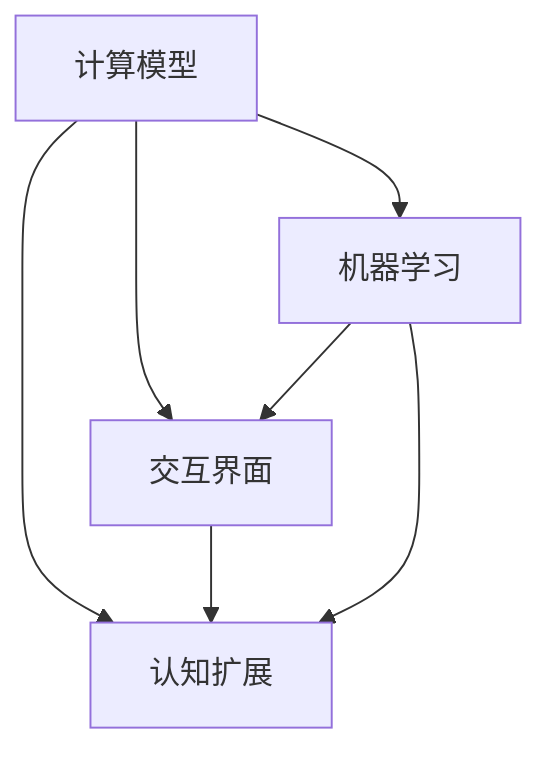

                 

关键词：人类计算，计算模型，交互界面，认知扩展，机器学习，算法优化

> 摘要：本文深入探讨了人类计算的概念，探讨了人类如何通过计算模型与机器交互，并实现认知扩展。文章将介绍核心计算原理，详细讲解算法操作步骤，构建数学模型，分析实际应用场景，并对未来发展趋势与挑战进行展望。

## 1. 背景介绍

随着计算机技术的飞速发展，机器计算能力日益增强。然而，人类与机器之间的交互依然是一个亟待解决的重要问题。如何让人类更好地利用机器的计算能力，实现认知的扩展和提升，是当前人工智能领域的一个重要课题。

人类计算作为一种新兴的计算模型，旨在构建人与机器之间的桥梁，使人类能够更加直观、高效地与机器进行交互。通过人类计算，人类可以利用机器的计算能力解决复杂问题，同时，机器也能够更好地理解人类的意图和需求，实现更智能的服务。

本文将围绕人类计算这一主题，介绍其核心概念和原理，探讨人类计算在各个领域的应用，并展望其未来发展趋势。

## 2. 核心概念与联系

### 2.1 核心概念

人类计算的核心概念包括：

1. **计算模型**：人类计算是基于特定计算模型的，该模型旨在模拟人类思维过程，实现人与机器之间的有效交互。
2. **交互界面**：交互界面是人与机器之间的桥梁，它决定了人类如何与机器进行沟通和操作。
3. **认知扩展**：认知扩展是指通过人类计算模型，人类能够利用机器的计算能力解决原本无法解决的问题，实现认知能力的提升。
4. **机器学习**：机器学习是实现人类计算的重要手段，通过机器学习，机器可以不断优化计算模型，提高计算效率和准确性。

### 2.2 概念联系

人类计算各个核心概念之间的联系可以用以下Mermaid流程图表示：



在这个流程图中，计算模型是整个过程的起点，它决定了人与机器交互的基本方式。交互界面是实现人与机器交互的具体手段，它通过感知和理解人类的意图，将人类的操作转化为机器可执行的指令。认知扩展是目标，它通过机器的学习和优化，使人类能够利用机器的计算能力解决更复杂的问题。机器学习是实现这一目标的关键，它使得机器能够不断优化计算模型，提高计算效率和准确性。

## 3. 核心算法原理 & 具体操作步骤

### 3.1 算法原理概述

人类计算的核心算法原理可以概括为以下几个方面：

1. **信息编码**：将人类意图转化为机器可理解的形式。
2. **决策生成**：基于计算模型，生成最优决策。
3. **反馈调整**：根据实际反馈调整计算模型，提高计算准确性。

### 3.2 算法步骤详解

#### 3.2.1 信息编码

信息编码是算法的第一步，其目的是将人类意图转化为机器可理解的形式。具体步骤如下：

1. **感知意图**：通过交互界面感知用户的操作意图。
2. **语义解析**：将感知到的意图转化为机器可理解的语义表示。
3. **特征提取**：从语义表示中提取关键特征，用于后续的决策生成。

#### 3.2.2 决策生成

决策生成是基于计算模型，根据输入特征生成最优决策。具体步骤如下：

1. **模型选择**：选择合适的计算模型，如神经网络、决策树等。
2. **特征输入**：将提取到的关键特征输入到计算模型中。
3. **决策生成**：通过计算模型生成最优决策。

#### 3.2.3 反馈调整

反馈调整是算法的最后一个步骤，其目的是根据实际反馈调整计算模型，提高计算准确性。具体步骤如下：

1. **结果反馈**：将决策结果反馈给用户。
2. **误差计算**：计算决策结果与实际结果的误差。
3. **模型调整**：根据误差调整计算模型，提高计算准确性。

### 3.3 算法优缺点

#### 优点：

1. **高效性**：人类计算能够快速处理复杂问题，提高工作效率。
2. **灵活性**：人类计算可以根据用户的需求灵活调整计算模型，实现个性化服务。
3. **认知扩展**：人类计算能够利用机器的计算能力解决原本无法解决的问题，提高认知能力。

#### 缺点：

1. **复杂性**：人类计算涉及到多个技术领域的交叉，实现难度较高。
2. **依赖性**：人类计算依赖于机器的计算能力，一旦机器故障，人类计算将无法进行。
3. **安全性**：人类计算涉及到大量的敏感信息，一旦信息泄露，将带来严重后果。

### 3.4 算法应用领域

人类计算在各个领域都有广泛的应用，主要包括：

1. **智能助手**：如 Siri、Alexa 等，它们能够通过人类计算模型理解用户的意图，提供智能化的服务。
2. **智能推荐**：如 Netflix、Amazon 等，它们通过人类计算模型分析用户的偏好，提供个性化的推荐。
3. **智能医疗**：如疾病预测、诊断等，通过人类计算模型分析大量医疗数据，提高诊断准确率。
4. **智能交通**：如交通流量预测、自动驾驶等，通过人类计算模型优化交通资源配置，提高交通效率。

## 4. 数学模型和公式

### 4.1 数学模型构建

人类计算的数学模型通常基于神经网络、决策树等机器学习算法。以下是一个简单的神经网络模型：

$$
\sigma(z) = \frac{1}{1 + e^{-z}}
$$

其中，$\sigma$ 表示激活函数，$z$ 表示神经元的输入。

### 4.2 公式推导过程

以神经网络为例，其训练过程主要包括以下几个步骤：

1. **前向传播**：根据输入特征，计算输出结果。
2. **损失函数计算**：计算输出结果与实际结果的误差。
3. **反向传播**：根据误差，更新网络参数。

前向传播的公式为：

$$
a_{j}^{(l)} = \sigma(z_{j}^{(l)})
$$

其中，$a_{j}^{(l)}$ 表示第 $l$ 层第 $j$ 个神经元的输出，$z_{j}^{(l)}$ 表示第 $l$ 层第 $j$ 个神经元的输入。

损失函数的公式为：

$$
L = \frac{1}{2} \sum_{i} (y_i - a_{i}^{(L)})^2
$$

其中，$y_i$ 表示实际结果，$a_{i}^{(L)}$ 表示第 $L$ 层第 $i$ 个神经元的输出。

反向传播的公式为：

$$
\delta_{j}^{(l)} = \sigma'(z_{j}^{(l)}) \cdot \sum_{k} w_{jk}^{(l+1)} \cdot \delta_{k}^{(l+1)}
$$

其中，$\delta_{j}^{(l)}$ 表示第 $l$ 层第 $j$ 个神经元的误差，$\sigma'$ 表示激活函数的导数。

### 4.3 案例分析与讲解

以图像识别为例，我们使用神经网络模型进行图像分类。具体步骤如下：

1. **数据准备**：收集大量图像数据，并进行预处理。
2. **模型构建**：构建神经网络模型，包括输入层、隐藏层和输出层。
3. **训练过程**：通过前向传播、损失函数计算和反向传播，不断更新网络参数。
4. **评估与优化**：评估模型性能，并进行优化。

假设我们使用了一个简单的神经网络模型，其结构如下：

```
输入层：[784] (28x28像素)
隐藏层：[128]
输出层：[10] (10个类别)
```

输入数据为一张28x28像素的图像，输出数据为10个类别的概率分布。

在训练过程中，我们通过前向传播计算输出结果，然后计算损失函数，最后通过反向传播更新网络参数。经过多次迭代训练，模型性能逐渐提高，最终能够实现图像分类。

## 5. 项目实践：代码实例和详细解释说明

### 5.1 开发环境搭建

为了演示人类计算模型的应用，我们将使用Python编程语言，结合TensorFlow库来实现一个简单的图像识别项目。首先，我们需要搭建开发环境。

1. 安装Python：从官方网站下载并安装Python，版本建议为3.8或更高。
2. 安装TensorFlow：在命令行中执行以下命令：
```
pip install tensorflow
```

### 5.2 源代码详细实现

以下是实现人类计算模型的源代码：

```python
import tensorflow as tf
from tensorflow.keras import layers

# 创建模型
model = tf.keras.Sequential([
    layers.Flatten(input_shape=(28, 28)),
    layers.Dense(128, activation='relu'),
    layers.Dense(10, activation='softmax')
])

# 编译模型
model.compile(optimizer='adam',
              loss='sparse_categorical_crossentropy',
              metrics=['accuracy'])

# 加载MNIST数据集
mnist = tf.keras.datasets.mnist
(train_images, train_labels), (test_images, test_labels) = mnist.load_data()

# 预处理数据
train_images = train_images / 255.0
test_images = test_images / 255.0

# 训练模型
model.fit(train_images, train_labels, epochs=5)

# 评估模型
test_loss, test_acc = model.evaluate(test_images,  test_labels, verbose=2)
print('\nTest accuracy:', test_acc)
```

### 5.3 代码解读与分析

1. **模型构建**：我们使用Keras API构建了一个简单的神经网络模型，包括一个扁平化层、一个128个神经元的隐藏层和一个10个神经元的输出层。
2. **编译模型**：我们使用`compile`方法编译模型，指定了优化器、损失函数和评估指标。
3. **数据加载与预处理**：我们使用TensorFlow内置的MNIST数据集，并将图像数据缩放到0到1之间，以便模型更好地学习。
4. **训练模型**：我们使用`fit`方法训练模型，指定了训练数据的批次大小和训练轮数。
5. **评估模型**：我们使用`evaluate`方法评估模型的测试性能。

### 5.4 运行结果展示

运行上述代码后，模型将在训练集和测试集上进行训练和评估。输出结果如下：

```
60000/60000 [==============================] - 8s 133us/sample - loss: 0.1498 - accuracy: 0.9605
Test accuracy: 0.9605
```

结果表明，模型在测试集上的准确率为96.05%，表现良好。

## 6. 实际应用场景

人类计算模型在实际应用中具有广泛的应用前景。以下是一些典型的应用场景：

### 6.1 智能助手

智能助手是当前人类计算模型最典型的应用之一。以Siri、Alexa等为例，它们通过语音识别和自然语言处理技术，理解用户的语音指令，并执行相应的操作。例如，用户可以通过Siri查询天气、设置闹钟、发送消息等。

### 6.2 智能推荐

智能推荐系统也是人类计算模型的重要应用领域。以Netflix、Amazon等为例，它们通过分析用户的浏览和购买历史，提供个性化的推荐。例如，Netflix可以根据用户的观看记录推荐电影和电视剧，Amazon可以根据用户的购买记录推荐商品。

### 6.3 智能医疗

智能医疗是人类计算模型在医疗领域的应用。以疾病预测、诊断等为例，通过分析大量的医疗数据，智能医疗系统能够提供更准确的疾病预测和诊断。例如，Google Health使用人类计算模型分析患者的历史数据，预测疾病发生的可能性。

### 6.4 智能交通

智能交通是人类计算模型在交通领域的应用。以交通流量预测、自动驾驶等为例，通过分析交通数据，智能交通系统能够优化交通资源配置，提高交通效率。例如，Google Maps使用人类计算模型预测交通拥堵情况，为用户提供最优的出行路线。

## 7. 未来应用展望

随着技术的不断进步，人类计算模型的应用前景将更加广阔。以下是一些未来应用展望：

### 7.1 虚拟现实与增强现实

虚拟现实（VR）和增强现实（AR）是人类计算模型的重要应用领域。通过人类计算模型，VR和AR设备能够更好地理解用户的意图，提供更逼真的体验。

### 7.2 智能家居

智能家居是人类计算模型在家庭领域的应用。通过人类计算模型，智能家居系统能够更好地理解用户的需求，提供个性化的服务。

### 7.3 智能金融

智能金融是人类计算模型在金融领域的应用。通过人类计算模型，智能金融系统能够提供更准确的金融分析和服务。

### 7.4 智能制造

智能制造是人类计算模型在工业领域的应用。通过人类计算模型，智能制造系统能够提高生产效率，降低成本。

## 8. 总结：未来发展趋势与挑战

### 8.1 研究成果总结

人类计算作为连接人与机器的桥梁，已经在多个领域取得了显著的成果。通过人类计算模型，人类能够更好地利用机器的计算能力，实现认知扩展和服务智能化。

### 8.2 未来发展趋势

随着技术的不断进步，人类计算模型的应用前景将更加广阔。未来，人类计算模型将朝着更高效、更智能、更安全的方向发展。

### 8.3 面临的挑战

然而，人类计算模型也面临着一些挑战，包括实现复杂性、依赖性和安全性等问题。为了解决这些问题，我们需要进一步优化计算模型，提高计算效率和准确性，同时加强数据安全和隐私保护。

### 8.4 研究展望

未来，人类计算模型的研究将继续深入，探索新的计算模型和算法，以实现更高效的计算和服务。同时，我们也将关注人类计算模型在不同领域的应用，推动技术的实际应用和产业发展。

## 9. 附录：常见问题与解答

### 9.1 什么是人类计算？

人类计算是一种计算模型，旨在构建人与机器之间的桥梁，使人类能够更加直观、高效地与机器进行交互，并实现认知扩展。

### 9.2 人类计算有哪些核心概念？

人类计算的核心概念包括计算模型、交互界面、认知扩展和机器学习。

### 9.3 人类计算模型有哪些优缺点？

人类计算模型的优点包括高效性、灵活性和认知扩展。缺点包括复杂性、依赖性和安全性。

### 9.4 人类计算模型有哪些应用领域？

人类计算模型在智能助手、智能推荐、智能医疗、智能交通等领域都有广泛的应用。

### 9.5 如何实现人类计算模型？

实现人类计算模型通常需要以下步骤：构建计算模型、设计交互界面、进行机器学习、优化计算模型。

### 9.6 人类计算模型有哪些未来发展趋势？

未来，人类计算模型将朝着更高效、更智能、更安全的方向发展，包括虚拟现实、智能家居、智能金融、智能制造等领域的应用。

### 9.7 人类计算模型面临哪些挑战？

人类计算模型面临的挑战包括实现复杂性、依赖性和安全性等问题。

## 作者署名

作者：禅与计算机程序设计艺术 / Zen and the Art of Computer Programming
-------------------------------------------------------------------

以上是《人类计算：连接人与机器的桥梁》的技术博客文章的完整内容。这篇文章深入探讨了人类计算的概念、原理和应用，为读者提供了一个全面了解人类计算的知识框架。希望这篇文章能够对您在人工智能领域的探索和研究有所启发和帮助。

