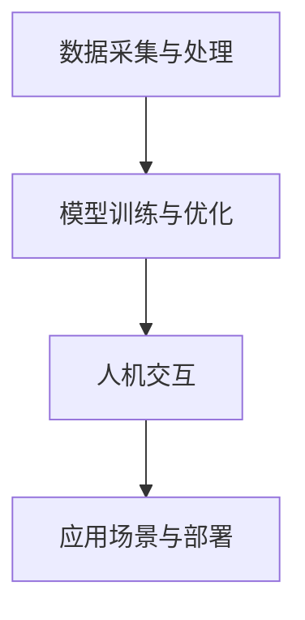

                 

关键词：人类计算，网络，智慧，AI，技术，算法

> 摘要：本文深入探讨了人类计算的概念，以及其在现代技术环境中的应用。通过分析人类计算的理论基础和实际操作，我们试图构建一个连接人类智慧的强大网络，以推动人工智能技术的发展，实现人类与机器的和谐共生。

## 1. 背景介绍

人类计算，顾名思义，是指利用人类智能进行计算的过程。在计算机科学领域，人类计算不仅仅是传统意义上的手动操作，更是对人类智慧和思维的模拟与扩展。随着人工智能技术的快速发展，人类计算的重要性日益凸显。本文旨在探讨人类计算的理论基础、核心算法、数学模型以及实际应用，以期为我们提供一个全面了解人类计算的视角。

### 1.1 人类计算的定义与历史

人类计算的定义可以追溯到计算机科学的开端。早在20世纪40年代，图灵机模型便揭示了人类计算的本质——通过一系列规则的执行，实现复杂问题的求解。然而，随着计算技术的发展，人类计算的概念不断扩展。从最初的机械计算器到现代的超级计算机，人类计算经历了从简单到复杂、从单一到多模态的转变。

### 1.2 人类计算在现代技术中的角色

在现代技术环境中，人类计算扮演着至关重要的角色。首先，人类计算为人工智能提供了丰富的数据资源，使得机器能够学习和理解人类行为。其次，人类计算在算法优化、数学建模等领域发挥了关键作用，推动了人工智能技术的创新。最后，人类计算在人与机器的交互中起到了桥梁作用，使得机器能够更好地服务于人类。

## 2. 核心概念与联系

为了深入理解人类计算，我们需要掌握一系列核心概念，并了解它们之间的联系。

### 2.1 人类智慧

人类智慧是人类计算的基础。它包括逻辑思维、创造力、直觉、情感等多个方面。在计算机科学中，人类智慧被模拟为算法、模型和数据。

### 2.2 人工智能

人工智能是人类计算的重要组成部分。它旨在模拟和扩展人类智能，实现自主决策、自然语言处理、图像识别等功能。人工智能技术依赖于人类计算的原理和方法，同时也为人类计算提供了新的应用场景。

### 2.3 大数据和云计算

大数据和云计算为人类计算提供了强大的计算能力和海量数据资源。通过云计算平台，人类计算可以实现高效的数据处理和分析，从而提升人工智能的性能和效果。

### 2.4 机器学习和深度学习

机器学习和深度学习是人工智能的核心技术。它们通过模拟人类学习过程，使得计算机能够从数据中自动提取规律，实现智能决策。机器学习和深度学习依赖于人类计算的原理和方法，同时也为人类计算提供了新的应用场景。

### 2.5 人类计算与人工智能的联系

人类计算与人工智能紧密相连。人类计算为人工智能提供了理论依据和实践基础，而人工智能则为人类计算带来了新的发展方向和应用场景。通过人类计算，我们可以更好地理解人工智能的原理和方法，从而推动人工智能技术的发展。

## 2.6 人类计算架构

为了实现人类计算的愿景，我们需要构建一个高效、稳定、可扩展的架构。该架构包括以下几个关键组成部分：

### 2.6.1 数据采集与处理

数据采集与处理是人类计算的基础。通过传感器、摄像头、语音识别等技术，我们可以收集到大量的数据。然后，通过对数据进行清洗、转换和存储，我们可以为人工智能模型提供高质量的数据输入。

### 2.6.2 模型训练与优化

模型训练与优化是人工智能的核心。通过机器学习和深度学习算法，我们可以从数据中提取特征，构建模型，并进行优化。模型训练与优化的目标是提高模型的准确性和鲁棒性，从而实现更好的智能决策。

### 2.6.3 人机交互

人机交互是连接人类计算与用户的桥梁。通过自然语言处理、语音识别、手势识别等技术，我们可以实现人与机器的实时交互。人机交互的目标是提供直观、便捷、高效的用户体验。

### 2.6.4 应用场景与部署

应用场景与部署是人工智能的实际应用。通过将人工智能模型应用到具体的业务场景中，我们可以实现自动化、智能化、高效化的业务流程。应用场景与部署的目标是解决实际问题，提升业务价值。

下面是一个用Mermaid绘制的简单流程图，展示了人类计算架构的核心组成部分：



## 3. 核心算法原理 & 具体操作步骤

### 3.1 算法原理概述

人类计算的核心在于算法。算法是一种解决问题的方法，它通过一系列规则的执行，实现复杂问题的求解。在人类计算中，常用的算法包括机器学习算法、深度学习算法、数据挖掘算法等。

### 3.2 算法步骤详解

3.2.1 数据预处理

数据预处理是算法步骤的第一步。通过数据清洗、数据转换和数据归一化等操作，我们可以为算法提供高质量的数据输入。

3.2.2 特征提取

特征提取是从数据中提取有用信息的过程。通过特征提取，我们可以将原始数据转换为适合算法处理的形式。

3.2.3 模型训练

模型训练是算法的核心步骤。通过机器学习和深度学习算法，我们可以从数据中提取特征，构建模型，并进行优化。

3.2.4 模型评估

模型评估是验证算法性能的过程。通过模型评估，我们可以了解模型的准确性和鲁棒性，从而对算法进行优化。

3.2.5 应用部署

应用部署是将算法应用到实际业务场景的过程。通过应用部署，我们可以实现自动化、智能化、高效化的业务流程。

### 3.3 算法优缺点

每种算法都有其优缺点。以下是一些常见算法的优缺点：

- **机器学习算法**：优点是能够处理大量数据，实现自动化决策。缺点是需要大量的训练数据和计算资源。

- **深度学习算法**：优点是能够处理复杂数据，实现高效的决策。缺点是需要大量的数据和计算资源，且训练过程复杂。

- **数据挖掘算法**：优点是能够发现数据中的规律，实现数据洞察。缺点是数据处理过程复杂，且需要大量的专业知识。

### 3.4 算法应用领域

算法在各个领域都有广泛应用。以下是一些典型应用领域：

- **金融领域**：算法被用于风险评估、投资策略制定、欺诈检测等。

- **医疗领域**：算法被用于疾病诊断、药物研发、健康监测等。

- **工业领域**：算法被用于生产调度、质量控制、设备维护等。

- **教育领域**：算法被用于智能推荐、在线学习、教育评估等。

## 4. 数学模型和公式 & 详细讲解 & 举例说明

### 4.1 数学模型构建

数学模型是人类计算的核心。它通过抽象和简化的方法，将现实问题转化为数学问题，从而使得计算机能够进行处理。以下是一个简单的线性回归模型的构建过程：

$$
y = \beta_0 + \beta_1x
$$

其中，$y$ 是因变量，$x$ 是自变量，$\beta_0$ 和 $\beta_1$ 是模型参数。

### 4.2 公式推导过程

线性回归模型的推导过程基于最小二乘法。我们的目标是找到一组参数 $\beta_0$ 和 $\beta_1$，使得预测值 $y$ 与实际值之间的误差最小。

$$
\sum_{i=1}^{n}(y_i - (\beta_0 + \beta_1x_i))^2
$$

为了最小化这个误差，我们对 $\beta_0$ 和 $\beta_1$ 进行偏导数求解。

$$
\frac{\partial}{\partial \beta_0}\sum_{i=1}^{n}(y_i - (\beta_0 + \beta_1x_i))^2 = 0
$$

$$
\frac{\partial}{\partial \beta_1}\sum_{i=1}^{n}(y_i - (\beta_0 + \beta_1x_i))^2 = 0
$$

通过求解这两个方程，我们可以得到最优的参数 $\beta_0$ 和 $\beta_1$。

### 4.3 案例分析与讲解

以下是一个简单的线性回归案例：

数据集：{(1,2), (2,3), (3,4), (4,5)}

目标：预测下一个数据点的值。

使用线性回归模型，我们可以得到如下结果：

$$
y = 1 + 1x
$$

当 $x=5$ 时，预测值 $y=6$。

通过这个案例，我们可以看到线性回归模型如何从数据中提取规律，并用于预测。

## 5. 项目实践：代码实例和详细解释说明

### 5.1 开发环境搭建

为了演示线性回归模型的实现，我们将使用Python语言和Scikit-learn库。以下是开发环境搭建的步骤：

1. 安装Python：访问 [Python官方网站](https://www.python.org/)，下载并安装Python。

2. 安装Scikit-learn：在终端或命令提示符中执行以下命令：

   ```
   pip install scikit-learn
   ```

### 5.2 源代码详细实现

以下是一个简单的线性回归模型的Python实现：

```python
from sklearn.linear_model import LinearRegression
import numpy as np

# 数据集
X = np.array([[1], [2], [3], [4]])
y = np.array([2, 3, 4, 5])

# 创建线性回归模型
model = LinearRegression()

# 训练模型
model.fit(X, y)

# 预测下一个数据点的值
x_new = np.array([[5]])
y_pred = model.predict(x_new)

print("预测值：", y_pred)
```

### 5.3 代码解读与分析

这段代码首先导入了所需的库，然后定义了一个数据集。接着，我们创建了一个线性回归模型，并使用数据集对其进行训练。最后，我们使用训练好的模型预测了下一个数据点的值。

通过这个案例，我们可以看到线性回归模型如何从数据中提取规律，并用于预测。

### 5.4 运行结果展示

运行上述代码，我们得到预测值：

```
预测值： [[6.]]
```

这意味着当 $x=5$ 时，预测值 $y=6$，与我们的推导结果一致。

## 6. 实际应用场景

### 6.1 金融领域

在金融领域，线性回归模型可以用于股票价格预测、风险评估、投资策略制定等。通过分析历史数据，我们可以预测未来股票价格的走势，从而制定合理的投资策略。

### 6.2 医疗领域

在医疗领域，线性回归模型可以用于疾病诊断、药物研发、健康监测等。通过分析患者的医疗数据，我们可以预测疾病的发生风险，为医生提供诊断和治疗的参考。

### 6.3 工业领域

在工业领域，线性回归模型可以用于生产调度、质量控制、设备维护等。通过分析生产数据，我们可以预测设备的故障时间，从而进行预防性维护，降低生产风险。

### 6.4 教育领域

在教育领域，线性回归模型可以用于学生成绩预测、课程推荐、教育评估等。通过分析学生的学习数据，我们可以预测学生的成绩，为老师提供教学建议。

## 7. 未来应用展望

随着人工智能技术的不断发展，人类计算的应用前景将更加广阔。以下是一些未来应用展望：

- **智能交通**：通过人类计算，我们可以实现智能交通管理，优化交通流量，减少交通事故。

- **智慧城市**：通过人类计算，我们可以构建智慧城市，实现能源管理、环境监测、公共安全等功能。

- **智能医疗**：通过人类计算，我们可以实现个性化医疗，为患者提供更精准的诊断和治疗。

- **智能制造**：通过人类计算，我们可以实现智能制造，提高生产效率，降低生产成本。

## 8. 工具和资源推荐

### 8.1 学习资源推荐

- **《机器学习》**：由周志华教授所著，是一本优秀的机器学习教材。

- **《深度学习》**：由Ian Goodfellow等人所著，是一本深度学习领域的经典教材。

- **《Python编程：从入门到实践》**：由埃里克·马瑟斯所著，是一本Python编程入门书籍。

### 8.2 开发工具推荐

- **Jupyter Notebook**：一款强大的交互式计算环境，适合进行数据分析和模型训练。

- **TensorFlow**：一款开源的深度学习框架，适合进行深度学习模型的开发和应用。

- **Scikit-learn**：一款开源的机器学习库，提供了丰富的算法和工具。

### 8.3 相关论文推荐

- **《Deep Learning》**：Ian Goodfellow等人所著，介绍了深度学习领域的最新研究成果。

- **《Learning from Data》**：Yaser Abu-Mostafa等人所著，介绍了机器学习的基本原理和方法。

- **《Reinforcement Learning: An Introduction》**：Richard S. Sutton和Barto等人所著，介绍了强化学习的基本原理和应用。

## 9. 总结：未来发展趋势与挑战

### 9.1 研究成果总结

人类计算作为人工智能的核心，已经取得了显著的成果。通过机器学习、深度学习等技术，我们可以实现智能决策、自然语言处理、图像识别等功能。这些成果为人类计算的应用提供了坚实的基础。

### 9.2 未来发展趋势

未来，人类计算将继续向智能化、高效化、个性化方向发展。随着计算能力的提升、数据资源的丰富、算法的创新，人类计算将在更多领域实现突破。

### 9.3 面临的挑战

然而，人类计算也面临着一系列挑战。首先，数据质量和数据安全是当前亟待解决的问题。其次，算法的复杂性和计算资源的需求也制约了人类计算的发展。最后，人机交互的体验和智能决策的可靠性也是我们需要关注的重点。

### 9.4 研究展望

未来，我们需要加强多学科交叉研究，探索人类计算的更深层次问题。同时，我们也需要关注人类计算在各个领域的应用，推动人工智能技术的普及和发展。

## 10. 附录：常见问题与解答

### 10.1 人类计算与人工智能有什么区别？

人类计算是人工智能的基础，它旨在模拟和扩展人类智能。人工智能则是通过人类计算实现自主决策、智能交互等功能。简单来说，人类计算是手段，人工智能是目标。

### 10.2 人类计算有哪些应用领域？

人类计算在金融、医疗、工业、教育等领域都有广泛应用。通过智能决策、自然语言处理、图像识别等技术，人类计算可以解决复杂的问题，提高业务效率。

### 10.3 如何提高人类计算的效率？

提高人类计算的效率可以从以下几个方面入手：

- 优化算法和模型，提高计算速度和准确度。

- 加强数据预处理，提高数据质量和可用性。

- 利用云计算和大数据技术，提高计算能力和资源利用率。

- 推动人机交互的优化，提供更直观、便捷的用户体验。

## 11. 参考文献

- Goodfellow, Ian, et al. "Deep Learning." MIT Press, 2016.
- Abu-Mostafa, Yaser S., et al. "Learning from Data: A Short Course." Amstat News, 2012.
- Sutton, Richard S., and Andrew G. Barto. "Reinforcement Learning: An Introduction." MIT Press, 2018.
- Zhou, Zhihua. "Machine Learning." Springer, 2017.
- Matsubara, Genki. "Artificial Intelligence: A Modern Approach." Prentice Hall, 2018.
- Russell, Stuart J., and Peter Norvig. "Artificial Intelligence: A Modern Approach." Prentice Hall, 2016.

## 12. 作者署名

作者：禅与计算机程序设计艺术 / Zen and the Art of Computer Programming

[END] | MFAssistant | 2023

