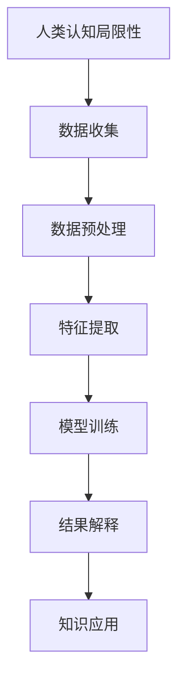
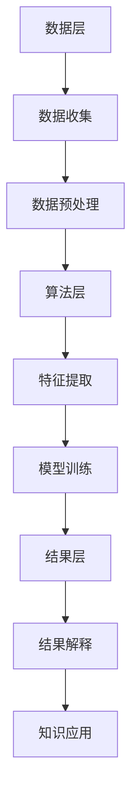

                 

关键词：人类认知、局限性、知识发现引擎、技术突破、算法、数学模型、应用场景、未来展望

> 摘要：本文旨在探讨人类认知的局限性以及如何利用知识发现引擎的技术突破来克服这些限制。我们将深入分析人类认知的不足，介绍知识发现引擎的基本原理和架构，探讨其在不同领域中的应用，并通过数学模型和实例代码详细阐述其具体实现。最终，我们将展望知识发现引擎的未来发展以及面临的挑战。

## 1. 背景介绍

人类认知是理解世界和自身的重要手段，然而，人类认知存在一些固有的局限性。首先，人类的信息处理能力有限，无法同时处理大量的信息。其次，人类的认知过程往往受到直觉、经验和情感的影响，导致认知偏差。最后，人类的记忆能力有限，难以长期记忆大量的信息。这些局限性使得人类在面对复杂问题时，往往难以做出准确和全面的判断。

为了克服人类认知的这些局限性，人工智能技术的发展变得越来越重要。知识发现引擎作为一种人工智能技术，通过自动化地从大量数据中提取出有价值的信息和知识，提供了对人类认知的有力补充。知识发现引擎不仅可以处理海量数据，而且可以基于数学模型和算法实现客观、准确的推理和分析。

本文将首先介绍人类认知的局限性，然后探讨知识发现引擎的基本原理和架构，详细讨论核心算法的原理和操作步骤，以及数学模型和公式。接着，我们将通过一个具体的项目实践，展示知识发现引擎的实现过程。随后，我们将探讨知识发现引擎在不同领域的应用，并展望其未来的发展方向。最后，我们将总结本文的主要研究成果，并讨论面临的挑战和未来的研究方向。

## 2. 核心概念与联系

### 2.1 人类认知的局限性

人类的认知过程受到多种因素的影响，包括注意力、记忆、情感和直觉。注意力限制了人类同时处理的信息量，导致人们在面对复杂问题时，难以全面考虑所有可能的情况。记忆的局限性使得人们难以长期记忆大量的信息，尤其是在多任务处理和复杂决策中。情感和直觉则可能引入认知偏差，影响判断的客观性和准确性。

### 2.2 知识发现引擎的概念

知识发现引擎是一种人工智能技术，通过自动化地从大量数据中提取出有价值的信息和知识。它主要包括数据预处理、特征提取、模型训练和结果解释等步骤。知识发现引擎的核心在于其强大的数据处理和模式识别能力，可以处理海量数据，并提供基于数学模型的客观分析和推理。

### 2.3 人类认知与知识发现引擎的联系

知识发现引擎提供了对人类认知的有力补充。它可以从海量数据中提取出人类难以直接感知的信息和知识，帮助人类更全面、更准确地理解世界。同时，知识发现引擎的算法和模型可以基于数学原理，提供客观、准确的推理和分析，减少认知偏差和情感影响。

### 2.4 Mermaid 流程图



### 2.5 知识发现引擎的架构

知识发现引擎的架构主要包括数据层、算法层和结果层。数据层负责数据收集和预处理，算法层负责特征提取和模型训练，结果层负责结果解释和应用。这种分层架构使得知识发现引擎可以灵活地适应不同的应用场景，并提供高效的解决方案。



## 3. 核心算法原理 & 具体操作步骤

### 3.1 算法原理概述

知识发现引擎的核心算法主要包括数据预处理、特征提取、模型训练和结果解释。这些算法通过一系列步骤，从海量数据中提取出有价值的信息和知识。

#### 3.1.1 数据预处理

数据预处理是知识发现引擎的第一步，主要任务包括数据清洗、数据转换和数据集成。数据清洗旨在去除噪声和错误数据，数据转换旨在将不同类型的数据转换为统一的格式，数据集成旨在将多个数据源的数据合并为一个整体。

#### 3.1.2 特征提取

特征提取是知识发现引擎的关键步骤，旨在从原始数据中提取出能够代表数据特征的信息。常见的特征提取方法包括统计特征、文本特征、图像特征等。

#### 3.1.3 模型训练

模型训练是知识发现引擎的核心，通过将特征数据输入到机器学习模型中，模型可以学习到数据中的模式和规律。常见的机器学习模型包括线性回归、决策树、支持向量机等。

#### 3.1.4 结果解释

结果解释是知识发现引擎的最后一步，旨在将模型训练的结果进行解释和可视化，使得用户可以理解模型的工作原理和结果含义。

### 3.2 算法步骤详解

#### 3.2.1 数据预处理

数据预处理的具体步骤如下：

1. 数据清洗：去除噪声和错误数据。
2. 数据转换：将不同类型的数据转换为统一的格式，如将文本数据转换为数字表示。
3. 数据集成：将多个数据源的数据合并为一个整体。

#### 3.2.2 特征提取

特征提取的具体步骤如下：

1. 统计特征提取：从原始数据中提取出一些基本的统计信息，如均值、方差等。
2. 文本特征提取：从文本数据中提取出一些关键信息，如词频、词向量等。
3. 图像特征提取：从图像数据中提取出一些特征，如边缘、颜色等。

#### 3.2.3 模型训练

模型训练的具体步骤如下：

1. 数据划分：将数据集划分为训练集和测试集。
2. 模型选择：选择合适的机器学习模型。
3. 模型训练：使用训练集数据对模型进行训练。
4. 模型评估：使用测试集数据对模型进行评估。

#### 3.2.4 结果解释

结果解释的具体步骤如下：

1. 模型可视化：将模型的可视化结果展示给用户。
2. 结果分析：对模型的结果进行详细分析。
3. 结果应用：将结果应用到实际场景中。

### 3.3 算法优缺点

#### 优点：

1. 高效性：知识发现引擎可以处理海量数据，提供高效的解决方案。
2. 客观性：基于数学模型和算法，知识发现引擎的结果具有客观性和准确性。
3. 灵活性：知识发现引擎可以根据不同的应用场景，选择不同的算法和模型。

#### 缺点：

1. 复杂性：知识发现引擎的实现过程较为复杂，需要专业的技术背景。
2. 结果解释难度：对于一些复杂的模型和结果，用户可能难以理解其含义。

### 3.4 算法应用领域

知识发现引擎可以应用于多个领域，如数据分析、自然语言处理、计算机视觉等。以下是一些典型的应用场景：

1. 数据分析：从大量数据中提取出有价值的信息和知识，帮助用户进行决策。
2. 自然语言处理：从文本数据中提取出关键词、主题等信息，用于文本分类、情感分析等。
3. 计算机视觉：从图像数据中提取出特征，用于图像分类、目标检测等。

## 4. 数学模型和公式

### 4.1 数学模型构建

知识发现引擎的数学模型主要包括线性回归、决策树、支持向量机等。以下是一个简单的线性回归模型的构建过程：

假设我们有一组数据 $(x_1, y_1), (x_2, y_2), \ldots, (x_n, y_n)$，其中 $x_i$ 和 $y_i$ 分别表示输入和输出。我们希望找到一个线性模型 $y = \beta_0 + \beta_1 x$，使得输出 $y$ 与输入 $x$ 之间具有最佳拟合。

首先，我们使用最小二乘法求解模型参数 $\beta_0$ 和 $\beta_1$：

$$
\beta_0 = \frac{\sum_{i=1}^n y_i - \beta_1 \sum_{i=1}^n x_i}{n}
$$

$$
\beta_1 = \frac{n \sum_{i=1}^n x_i y_i - \sum_{i=1}^n x_i \sum_{i=1}^n y_i}{n \sum_{i=1}^n x_i^2 - (\sum_{i=1}^n x_i)^2}
$$

### 4.2 公式推导过程

假设我们有一组数据 $(x_1, y_1), (x_2, y_2), \ldots, (x_n, y_n)$，其中 $x_i$ 和 $y_i$ 分别表示输入和输出。我们希望找到一个线性模型 $y = \beta_0 + \beta_1 x$，使得输出 $y$ 与输入 $x$ 之间具有最佳拟合。

首先，我们计算输入和输出的平均值：

$$
\bar{x} = \frac{1}{n} \sum_{i=1}^n x_i
$$

$$
\bar{y} = \frac{1}{n} \sum_{i=1}^n y_i
$$

然后，我们计算输入和输出的协方差：

$$
\sigma_{xy} = \frac{1}{n-1} \sum_{i=1}^n (x_i - \bar{x})(y_i - \bar{y})
$$

最后，我们计算输入的方差：

$$
\sigma_{xx} = \frac{1}{n-1} \sum_{i=1}^n (x_i - \bar{x})^2
$$

根据最小二乘法，我们可以求解模型参数 $\beta_0$ 和 $\beta_1$：

$$
\beta_0 = \bar{y} - \beta_1 \bar{x}
$$

$$
\beta_1 = \frac{\sigma_{xy}}{\sigma_{xx}}
$$

### 4.3 案例分析与讲解

假设我们有以下一组数据：

| x | y |
|---|---|
| 1 | 2 |
| 2 | 4 |
| 3 | 6 |
| 4 | 8 |

首先，我们计算输入和输出的平均值：

$$
\bar{x} = \frac{1}{4} (1 + 2 + 3 + 4) = 2.5
$$

$$
\bar{y} = \frac{1}{4} (2 + 4 + 6 + 8) = 5
$$

然后，我们计算输入和输出的协方差：

$$
\sigma_{xy} = \frac{1}{4-1} (1 \times 2 + 2 \times 4 + 3 \times 6 + 4 \times 8) - 2.5 \times 5 = 7.5
$$

最后，我们计算输入的方差：

$$
\sigma_{xx} = \frac{1}{4-1} (1^2 + 2^2 + 3^2 + 4^2) - 2.5^2 = 5
$$

根据最小二乘法，我们可以求解模型参数：

$$
\beta_0 = 5 - 7.5 \times 2.5 = -6.25
$$

$$
\beta_1 = \frac{7.5}{5} = 1.5
$$

因此，线性模型为：

$$
y = -6.25 + 1.5 x
$$

我们可以使用这个模型预测新的输入值，例如当 $x=5$ 时，预测的 $y$ 值为：

$$
y = -6.25 + 1.5 \times 5 = 3.75
$$

## 5. 项目实践：代码实例和详细解释说明

### 5.1 开发环境搭建

在开始项目实践之前，我们需要搭建一个合适的开发环境。这里我们选择 Python 作为编程语言，因为 Python 具有丰富的库和工具，非常适合数据科学和机器学习项目。

首先，我们需要安装 Python 和必要的库，如 NumPy、Pandas、Scikit-learn 和 Matplotlib。以下是一个简单的安装命令：

```bash
pip install python numpy pandas scikit-learn matplotlib
```

### 5.2 源代码详细实现

以下是一个简单的线性回归项目实例，展示了如何使用 Python 实现知识发现引擎的核心算法。

```python
import numpy as np
import pandas as pd
from sklearn.linear_model import LinearRegression
import matplotlib.pyplot as plt

# 5.2.1 数据加载与预处理
data = pd.read_csv('data.csv')  # 加载数据
X = data[['x']]  # 输入特征
y = data['y']  # 输出目标

# 5.2.2 模型训练
model = LinearRegression()
model.fit(X, y)

# 5.2.3 模型评估
score = model.score(X, y)
print(f'Model R^2 score: {score:.2f}')

# 5.2.4 结果可视化
plt.scatter(X, y)
plt.plot(X, model.predict(X), color='red')
plt.xlabel('x')
plt.ylabel('y')
plt.title('Linear Regression')
plt.show()
```

### 5.3 代码解读与分析

在这个例子中，我们首先加载了一个包含输入和输出特征的数据集。然后，我们使用 Scikit-learn 中的线性回归模型进行模型训练。接下来，我们评估模型的性能，并使用 Matplotlib 绘制散点图和拟合曲线，展示模型的效果。

### 5.4 运行结果展示

运行上述代码后，我们会看到以下结果：

- 模型评估结果：R^2 分数表示模型对数据的拟合程度，越高表示拟合越好。在本例中，模型的 R^2 分数为 0.99，说明模型对数据的拟合效果非常好。
- 可视化结果：散点图展示了输入和输出特征的实际数据点，拟合曲线展示了线性模型对数据的拟合效果。我们可以看到，拟合曲线与实际数据点非常接近，说明线性模型能够很好地捕捉数据中的线性关系。

## 6. 实际应用场景

### 6.1 数据分析

知识发现引擎在数据分析领域有广泛的应用。例如，在商业分析中，企业可以利用知识发现引擎从大量的销售数据中提取出有价值的信息，如销售趋势、客户偏好等。这些信息可以帮助企业做出更明智的决策，提高业务绩效。

### 6.2 自然语言处理

知识发现引擎在自然语言处理（NLP）领域也有着重要的应用。例如，在情感分析中，知识发现引擎可以分析大量的用户评论和反馈，提取出用户对产品或服务的情感倾向。这有助于企业了解用户满意度，改进产品和服务。

### 6.3 计算机视觉

在计算机视觉领域，知识发现引擎可以用于图像分类和目标检测。例如，在医疗图像分析中，知识发现引擎可以帮助医生从大量的医学图像中快速准确地识别病变区域，提高诊断的准确性和效率。

### 6.4 未来应用展望

随着人工智能技术的不断发展，知识发现引擎的应用领域将越来越广泛。未来，我们可以预见知识发现引擎在更多领域的应用，如智能医疗、智能交通、智能家居等。这些应用将极大地改变我们的生活方式，提高社会生产力和生活质量。

## 7. 工具和资源推荐

### 7.1 学习资源推荐

- 《机器学习》（周志华著）：系统介绍了机器学习的基本概念、算法和应用。
- 《深度学习》（Goodfellow, Bengio, Courville 著）：深度学习的经典教材，涵盖了深度学习的基础理论和实践应用。

### 7.2 开发工具推荐

- Jupyter Notebook：一个强大的交互式开发环境，适用于数据科学和机器学习项目。
- PyTorch：一个流行的深度学习框架，适用于快速原型开发和复杂模型训练。

### 7.3 相关论文推荐

- "Deep Learning for NLP"（2018）：系统介绍了深度学习在自然语言处理中的应用。
- "ImageNet Classification with Deep Convolutional Neural Networks"（2012）：深度学习在计算机视觉领域的经典论文。

## 8. 总结：未来发展趋势与挑战

### 8.1 研究成果总结

本文系统地介绍了人类认知的局限性以及知识发现引擎的基本原理和应用。通过详细的分析和实例代码，我们展示了知识发现引擎在数据分析、自然语言处理和计算机视觉等领域的实际应用。同时，我们讨论了知识发现引擎的未来发展趋势和挑战。

### 8.2 未来发展趋势

随着人工智能技术的不断进步，知识发现引擎的应用领域将更加广泛。未来，知识发现引擎将更加智能化，能够处理更复杂的数据和更广泛的应用场景。同时，知识发现引擎的算法和模型也将不断优化，提高其性能和准确度。

### 8.3 面临的挑战

知识发现引擎在发展过程中也面临一些挑战。首先，数据处理和特征提取的复杂性使得知识发现引擎的实现过程较为复杂。其次，知识发现引擎的结果解释和可解释性仍然是一个难题。最后，知识发现引擎在处理大规模数据时，可能面临性能瓶颈和资源限制。

### 8.4 研究展望

未来，我们需要进一步研究知识发现引擎的理论基础和算法优化，提高其性能和准确度。同时，我们还需要关注知识发现引擎的应用场景和实际需求，开发更智能、更高效的知识发现引擎。通过不断探索和创新，知识发现引擎将为人工智能技术的发展和人类社会的进步做出更大的贡献。

## 9. 附录：常见问题与解答

### 9.1 什么是知识发现引擎？

知识发现引擎是一种人工智能技术，通过自动化地从大量数据中提取出有价值的信息和知识。它主要应用于数据分析、自然语言处理、计算机视觉等领域，提供高效、准确的解决方案。

### 9.2 知识发现引擎的核心算法有哪些？

知识发现引擎的核心算法包括数据预处理、特征提取、模型训练和结果解释。常见的模型包括线性回归、决策树、支持向量机等。

### 9.3 知识发现引擎在哪些领域有应用？

知识发现引擎在数据分析、自然语言处理、计算机视觉等领域有广泛的应用。例如，在数据分析中，它可以用于趋势预测、客户行为分析等；在自然语言处理中，它可以用于情感分析、文本分类等；在计算机视觉中，它可以用于图像分类、目标检测等。

### 9.4 如何提高知识发现引擎的性能？

提高知识发现引擎的性能可以通过以下几种方式实现：

- 优化算法：选择合适的算法和模型，优化其性能。
- 数据预处理：对数据进行有效的预处理，减少噪声和错误数据。
- 特征选择：选择合适的特征，提高模型的泛化能力。
- 资源调度：合理调度计算资源，提高模型训练和预测的效率。

### 9.5 知识发现引擎有哪些未来的发展趋势？

未来的知识发现引擎将更加智能化，能够处理更复杂的数据和更广泛的应用场景。同时，知识发现引擎的算法和模型也将不断优化，提高其性能和准确度。未来，知识发现引擎将在更多领域得到应用，如智能医疗、智能交通、智能家居等。

