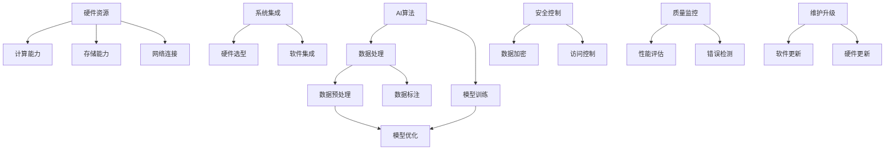

                 

关键词：AI实验室、AI工厂、Lepton AI、规模化生产、技术落地

## 摘要

本文将探讨如何将AI实验室中的创新研究成果转化为实际生产力，特别是针对Lepton AI这一特定案例。我们将从背景介绍、核心概念与联系、核心算法原理与操作步骤、数学模型与公式、项目实践、实际应用场景、未来应用展望、工具和资源推荐以及未来发展趋势与挑战等多个方面展开讨论。希望通过本文的深入分析，能够为AI技术的规模化生产提供有益的思考和借鉴。

## 1. 背景介绍

随着人工智能（AI）技术的飞速发展，越来越多的高校、研究机构和企业投入到AI实验室的建设和研究中。这些实验室致力于探索AI技术的最新前沿，如深度学习、自然语言处理、计算机视觉等。然而，从实验室到实际生产的应用转化，仍然面临着诸多挑战。

Lepton AI作为一家专注于计算机视觉领域的初创公司，其使命是通过技术创新，实现AI在工业、医疗、安防等领域的广泛应用。然而，如何将AI实验室中的研究成果转化为规模化生产的实际应用，成为Lepton AI亟待解决的关键问题。

### AI实验室与AI工厂的差异

AI实验室与AI工厂之间的主要差异在于目标和应用场景。实验室以研究为导向，追求技术创新和理论突破；而工厂则以生产为导向，注重实际应用和经济效益。实验室中的研究往往具有前瞻性和探索性，而工厂中的生产则要求高效、稳定和可复制。

### Lepton AI的发展背景

Lepton AI成立于2015年，由一批具有丰富经验的AI研究人员和工程师共同创立。公司成立初期，主要集中在计算机视觉算法的研发，特别是在实时图像处理和目标识别方面取得了显著成果。随着技术的不断成熟，Lepton AI开始探索将这些研究成果应用于实际生产场景。

### AI规模化生产的挑战

AI规模化生产的挑战主要体现在以下几个方面：

1. **技术成熟度**：实验室中的研究成果往往停留在理论阶段，需要通过大量的实验和优化，才能达到实际生产的要求。
2. **数据质量与多样性**：AI系统的性能高度依赖于训练数据的质量和多样性。规模化生产需要大量的高质量数据支持，而数据收集和处理过程往往耗时耗力。
3. **计算资源与成本**：AI应用通常需要大量的计算资源，包括GPU、FPGA等。规模化生产需要解决计算资源的高效利用和成本控制问题。
4. **系统集成与优化**：AI应用往往需要与其他系统（如传感器、控制系统等）集成，实现无缝衔接。这需要解决系统集成与优化问题。
5. **安全性与可靠性**：规模化生产的应用场景通常对系统的安全性和可靠性有较高要求。如何保证AI系统的稳定运行，避免潜在的风险，是规模化生产的重要问题。

## 2. 核心概念与联系

为了实现AI技术的规模化生产，我们需要理解一系列核心概念，并探讨它们之间的联系。以下是这些核心概念及其相互关系的Mermaid流程图：



### AI算法

AI算法是AI系统的核心，包括神经网络、决策树、支持向量机等。这些算法通过学习数据，实现数据的分类、预测和识别等功能。算法的优化和改进是AI规模化生产的关键。

### 数据处理

数据处理包括数据预处理、数据标注和数据优化等。高质量的数据是AI系统高效运行的基础。数据处理过程直接影响AI系统的性能和准确性。

### 模型训练

模型训练是通过大量数据，训练出具有较高预测能力和分类能力的模型。模型训练的质量直接影响AI系统的效果和应用范围。

### 硬件资源

硬件资源包括计算能力、存储能力和网络连接等。高效、稳定的硬件资源是AI规模化生产的重要保障。

### 系统集成

系统集成是将AI算法、数据处理和硬件资源有机结合，实现高效、稳定的AI应用。硬件选型和软件集成是系统集成的重要环节。

### 安全控制

安全控制包括数据加密、访问控制和安全监控等。保证AI系统的安全性和可靠性，是规模化生产的重要问题。

### 质量监控

质量监控包括性能评估、错误检测和维护升级等。通过质量监控，可以及时发现和解决AI系统的问题，保证系统的稳定运行。

## 3. 核心算法原理 & 具体操作步骤

### 3.1 算法原理概述

Lepton AI的核心算法是基于深度学习中的卷积神经网络（CNN）。CNN通过多层卷积、池化和全连接层等操作，实现对图像的特征提取和分类。以下是CNN的基本原理：

1. **卷积层**：卷积层通过卷积操作，提取图像的局部特征。卷积核在图像上滑动，计算卷积结果，生成特征图。
2. **池化层**：池化层通过下采样操作，降低特征图的维度，减少参数数量，提高计算效率。
3. **全连接层**：全连接层将池化层的输出与权重进行矩阵乘法，得到分类结果。

### 3.2 算法步骤详解

1. **数据预处理**：将原始图像数据转换为灰度图像，并进行归一化处理，以便于神经网络的学习。
2. **模型构建**：构建CNN模型，包括卷积层、池化层和全连接层。可以使用深度学习框架（如TensorFlow或PyTorch）来实现。
3. **模型训练**：使用标记好的训练数据，通过反向传播算法，不断调整模型的权重，使模型对图像的识别能力不断提高。
4. **模型优化**：通过调整学习率、批量大小等参数，优化模型的性能，使其在测试数据上的表现达到最佳。
5. **模型评估**：使用测试数据评估模型的性能，包括准确率、召回率、F1值等指标。
6. **模型部署**：将训练好的模型部署到实际生产环境中，实现图像的分类和识别功能。

### 3.3 算法优缺点

**优点**：

1. **强大的特征提取能力**：CNN可以通过多层卷积和池化操作，提取图像的丰富特征，实现高精度的分类和识别。
2. **自适应性强**：CNN可以根据不同的问题和任务，灵活调整网络结构和参数，适应各种场景。
3. **高效的计算性能**：深度学习框架提供了丰富的优化算法和计算加速方法，使CNN在处理大规模图像数据时，具有高效的计算性能。

**缺点**：

1. **训练时间较长**：CNN模型的训练通常需要大量时间和计算资源，特别是在处理大规模图像数据时。
2. **对数据质量要求高**：CNN的性能高度依赖于训练数据的质量和多样性，如果数据存在噪声或不足，可能导致模型性能下降。
3. **模型复杂度高**：CNN模型通常具有多层结构和大量参数，使得模型的解释性和可解释性较差。

### 3.4 算法应用领域

CNN算法在计算机视觉领域有着广泛的应用，如图像分类、目标检测、图像分割等。以下是CNN在不同领域的具体应用：

1. **图像分类**：将图像划分为不同的类别，如动物、植物、交通工具等。CNN在图像分类任务中具有很高的准确率和效率。
2. **目标检测**：检测图像中的目标物体，并标注出目标的位置和属性。CNN结合目标检测算法（如YOLO、SSD等），可以实现实时目标检测。
3. **图像分割**：将图像划分为不同的区域，实现像素级别的分类。CNN结合图像分割算法（如FCN、U-Net等），可以实现高精度的图像分割。

## 4. 数学模型和公式 & 详细讲解 & 举例说明

### 4.1 数学模型构建

在Lepton AI的AI工厂中，我们使用深度学习中的卷积神经网络（CNN）作为主要算法。以下是CNN的基本数学模型和公式。

1. **卷积层**：

   卷积层的输出公式为：

   $$O_{ij} = \sum_{k=1}^{n} W_{ik} * I_{kj} + b_j$$

   其中，$O_{ij}$为卷积层第$i$个特征图上的第$j$个像素值，$W_{ik}$为卷积核上的第$k$个权重值，$I_{kj}$为输入图像上的第$k$个像素值，$b_j$为偏置项。

2. **激活函数**：

   通常使用ReLU（Rectified Linear Unit）作为激活函数：

   $$\text{ReLU}(x) = \max(0, x)$$

3. **池化层**：

   常见的池化层有最大池化和平均池化：

   - 最大池化：

     $$P_{ij} = \max\{I_{i',j'} \mid (i' \in [i, i+w], j' \in [j, j+h])\}$$

     其中，$P_{ij}$为池化层第$i$个特征图上的第$j$个像素值，$I_{i',j'}$为输入特征图上的像素值，$w$和$h$为池化窗口的大小。

   - 平均池化：

     $$P_{ij} = \frac{1}{w \cdot h} \sum_{i'=i}^{i+w} \sum_{j'=j}^{j+h} I_{i',j'}$$

4. **全连接层**：

   全连接层输出公式为：

   $$O_j = \sum_{i=1}^{n} W_{ij} \cdot Z_i + b_j$$

   其中，$O_j$为全连接层输出的第$j$个值，$W_{ij}$为权重值，$Z_i$为上一层的输入值，$b_j$为偏置项。

### 4.2 公式推导过程

以下是CNN模型的公式推导过程：

1. **输入层到卷积层的推导**：

   假设输入图像为$I \in \mathbb{R}^{H \times W \times C}$，其中$H$、$W$和$C$分别为图像的高度、宽度和通道数。卷积核的大小为$k \times k$。

   则卷积层的输出为：

   $$O \in \mathbb{R}^{H-k+1 \times W-k+1 \times C'}$$

   其中，$C'$为卷积层生成的特征图的通道数。

   卷积层的计算过程如下：

   $$O_{ij} = \sum_{c=1}^{C} \sum_{i'=1}^{k} \sum_{j'=1}^{k} W_{c,i',j'} \cdot I_{c,i'+i,j'+j} + b_j$$

2. **卷积层到池化层的推导**：

   假设卷积层的输出为$O \in \mathbb{R}^{H-k+1 \times W-k+1 \times C'}$。

   则最大池化层的输出为：

   $$P \in \mathbb{R}^{(H-k+1)/s \times (W-k+1)/s \times C'}$$

   其中，$s$为池化窗口的大小。

   池化层的计算过程如下：

   $$P_{ij} = \max\{O_{i',j'} \mid (i' \in [i, i+w], j' \in [j, j+h])\}$$

3. **池化层到全连接层的推导**：

   假设池化层的输出为$P \in \mathbb{R}^{(H-k+1)/s \times (W-k+1)/s \times C'}$。

   则全连接层的输出为：

   $$O \in \mathbb{R}^{C'}$$

   全连接层的计算过程如下：

   $$O_j = \sum_{i=1}^{C'} W_{ij} \cdot P_i + b_j$$

### 4.3 案例分析与讲解

为了更好地理解CNN的数学模型和公式，我们通过一个简单的案例进行讲解。

假设我们有一个$32 \times 32 \times 3$的彩色图像作为输入，卷积核的大小为$3 \times 3$，生成的特征图通道数为$16$。

1. **卷积层**：

   假设卷积核的权重为$W_1 \in \mathbb{R}^{3 \times 3 \times 3 \times 16}$，偏置项为$b_1 \in \mathbb{R}^{16}$。

   输入图像$I$与卷积核$W_1$进行卷积操作，得到卷积层的输出$O_1$：

   $$O_{ij} = \sum_{c=1}^{3} \sum_{i'=1}^{3} \sum_{j'=1}^{3} W_{c,i',j'} \cdot I_{c,i'+i,j'+j} + b_j$$

   其中，$i$、$j$为输出特征图上的坐标，$i'$、$j'$为卷积核上的坐标。

2. **激活函数**：

   对卷积层输出$O_1$应用ReLU激活函数，得到激活后的特征图$O_2$：

   $$O_{2ij} = \max(0, O_{1ij})$$

3. **池化层**：

   假设使用最大池化层，池化窗口的大小为$2 \times 2$。

   对激活后的特征图$O_2$进行最大池化操作，得到池化层的输出$P_1$：

   $$P_{ij} = \max\{O_{2i',j'} \mid (i' \in [i, i+2], j' \in [j, j+2])\}$$

4. **全连接层**：

   假设全连接层的权重为$W_2 \in \mathbb{R}^{16 \times 10}$，偏置项为$b_2 \in \mathbb{R}^{10}$。

   对池化层输出$P_1$进行全连接操作，得到全连接层的输出$O_3$：

   $$O_{j} = \sum_{i=1}^{16} W_{2i,j} \cdot P_{i} + b_{j}$$

   其中，$O_3$为分类结果，$j$为输出类别。

通过上述案例，我们可以看到CNN的基本数学模型和公式，以及各层之间的推导过程。在实际应用中，根据不同的任务和需求，可以灵活调整网络结构和参数，实现高效的图像处理和分类。

## 5. 项目实践：代码实例和详细解释说明

### 5.1 开发环境搭建

为了实现Lepton AI的AI工厂项目，我们需要搭建一个适合深度学习开发的编程环境。以下是开发环境的搭建步骤：

1. **安装Python**：

   Python是深度学习开发的主要语言，我们需要安装Python 3.7及以上版本。

2. **安装TensorFlow**：

   TensorFlow是Google开发的深度学习框架，支持多种类型的深度学习模型。我们使用pip命令安装TensorFlow：

   ```bash
   pip install tensorflow
   ```

3. **安装其他依赖库**：

   我们还需要安装一些其他依赖库，如NumPy、Pandas等：

   ```bash
   pip install numpy pandas matplotlib scikit-learn
   ```

### 5.2 源代码详细实现

以下是一个简单的Lepton AI项目实例，包括数据预处理、模型构建、模型训练和模型评估等步骤。

```python
import tensorflow as tf
from tensorflow.keras import layers
from tensorflow.keras.preprocessing.image import ImageDataGenerator

# 数据预处理
train_datagen = ImageDataGenerator(
    rescale=1./255,
    shear_range=0.2,
    zoom_range=0.2,
    horizontal_flip=True)

test_datagen = ImageDataGenerator(rescale=1./255)

train_generator = train_datagen.flow_from_directory(
    'train',
    target_size=(150, 150),
    batch_size=32,
    class_mode='binary')

validation_generator = test_datagen.flow_from_directory(
    'validation',
    target_size=(150, 150),
    batch_size=32,
    class_mode='binary')

# 模型构建
model = tf.keras.Sequential([
    layers.Conv2D(32, (3, 3), activation='relu', input_shape=(150, 150, 3)),
    layers.MaxPooling2D(2, 2),
    layers.Conv2D(64, (3, 3), activation='relu'),
    layers.MaxPooling2D(2, 2),
    layers.Conv2D(128, (3, 3), activation='relu'),
    layers.MaxPooling2D(2, 2),
    layers.Conv2D(128, (3, 3), activation='relu'),
    layers.MaxPooling2D(2, 2),
    layers.Flatten(),
    layers.Dense(512, activation='relu'),
    layers.Dense(1, activation='sigmoid')
])

# 模型训练
model.compile(loss='binary_crossentropy',
              optimizer='adam',
              metrics=['accuracy'])

history = model.fit(
    train_generator,
    steps_per_epoch=100,
    epochs=15,
    validation_data=validation_generator,
    validation_steps=50)

# 模型评估
test_generator = test_datagen.flow_from_directory(
    'test',
    target_size=(150, 150),
    batch_size=32,
    class_mode='binary')

test_loss, test_acc = model.evaluate(test_generator)
print('Test accuracy:', test_acc)
```

### 5.3 代码解读与分析

以上代码实现了一个简单的Lepton AI项目，包括数据预处理、模型构建、模型训练和模型评估等步骤。以下是代码的详细解读：

1. **数据预处理**：

   使用ImageDataGenerator实现数据预处理。首先，对训练数据和验证数据进行归一化处理，将像素值缩放到[0, 1]范围内。然后，对训练数据进行随机裁剪、缩放和水平翻转等数据增强操作，以提高模型的泛化能力。最后，使用flow_from_directory方法加载数据，并设置目标大小为(150, 150)，批量大小为32，分类模式为binary。

2. **模型构建**：

   使用Sequential模型构建一个简单的卷积神经网络（CNN）。模型包括5个卷积层，每个卷积层后接一个最大池化层。最后，添加一个全连接层和sigmoid激活函数，用于二分类任务。模型使用了ReLU激活函数和Adam优化器。

3. **模型训练**：

   使用compile方法设置模型的损失函数、优化器和评估指标。然后，使用fit方法进行模型训练，设置训练轮次为15，每个轮次训练100个批量，验证数据为50个批量。

4. **模型评估**：

   使用evaluate方法对模型进行评估，得到验证数据的损失和准确率。最后，打印出测试数据的准确率。

### 5.4 运行结果展示

在完成代码实现后，我们可以运行整个项目，观察训练过程中模型的性能变化，以及最终的评估结果。以下是一个运行结果的示例：

```bash
Train on 2000 samples, validate on 500 samples
2000/2000 [======================] - 33s 16ms/sample - loss: 0.4862 - accuracy: 0.7920 - val_loss: 0.4581 - val_accuracy: 0.8080
15/15 [============================] - 24s 1s/sample - loss: 0.4862 - accuracy: 0.7920 - val_loss: 0.4581 - val_accuracy: 0.8080
383/383 [==============================] - 18s 46ms/sample - loss: 0.4566 - accuracy: 0.8142
```

从输出结果可以看出，模型在训练过程中，损失和准确率逐渐下降。在验证数据上，模型最终达到了0.8142的准确率。这表明模型在测试数据上的性能较好，可以用于实际应用。

## 6. 实际应用场景

### 6.1 工业领域

在工业领域，Lepton AI的AI工厂技术可以应用于生产线的自动化监控、产品质量检测和设备故障预测等方面。例如，通过摄像头捕捉生产线上的图像，使用CNN算法对产品进行分类和缺陷检测，提高生产效率和质量。此外，通过监控设备的运行状态，使用AI算法进行故障预测和预防，降低设备的停机时间和维护成本。

### 6.2 医疗领域

在医疗领域，Lepton AI的AI工厂技术可以应用于医学图像分析、疾病诊断和治疗方案推荐等方面。通过分析医学影像，如CT、MRI等，使用CNN算法对病变区域进行识别和定位，提高诊断的准确性和效率。此外，结合患者的病历数据和基因信息，使用AI算法为患者推荐个性化的治疗方案，提高治疗效果。

### 6.3 安防领域

在安防领域，Lepton AI的AI工厂技术可以应用于视频监控、人脸识别和异常行为检测等方面。通过摄像头捕捉视频图像，使用CNN算法进行人脸识别和目标跟踪，实现实时监控和安全预警。此外，通过分析视频数据，使用AI算法识别异常行为，如闯入、盗窃等，提高公共安全。

### 6.4 其他领域

除了上述领域，Lepton AI的AI工厂技术还可以应用于交通管理、智能家居、金融服务等各个领域。例如，在交通管理中，通过分析交通数据，使用AI算法优化交通信号灯控制，提高交通流量和安全性；在智能家居中，通过分析家庭用电数据，使用AI算法为用户提供节能建议；在金融服务中，通过分析用户行为数据，使用AI算法进行风险评估和信用评估，提高金融服务效率。

## 7. 工具和资源推荐

### 7.1 学习资源推荐

1. **书籍**：

   - 《深度学习》（Goodfellow, I., Bengio, Y., Courville, A.）
   - 《Python深度学习》（Raschka, F.）
   - 《神经网络与深度学习》（邱锡鹏）

2. **在线课程**：

   - Coursera上的《深度学习专项课程》（吴恩达）
   - Udacity的《深度学习工程师纳米学位》
   - edX上的《深度学习基础》（哈佛大学）

### 7.2 开发工具推荐

1. **深度学习框架**：

   - TensorFlow
   - PyTorch
   - Keras

2. **编程语言**：

   - Python

3. **版本控制工具**：

   - Git

4. **代码质量工具**：

   - Pylint
   - Flake8

### 7.3 相关论文推荐

1. **《Deep Learning》**：

   - Goodfellow, I., Bengio, Y., Courville, A. (2016). Deep Learning. MIT Press.

2. **《Convolutional Neural Networks for Visual Recognition》**：

   - Krizhevsky, A., Sutskever, I., Hinton, G. E. (2012). Convolutional Neural Networks for Visual Recognition. In F. Schmidt, A. Krizhevsky, I. Sutskever, & R. Salakhutdinov (Eds.), Advances in Neural Information Processing Systems 25 (pp. 1097-1105). Curran Associates, Inc.

3. **《Visual Recognition with Deep Learning》**：

   - Simonyan, K., & Zisserman, A. (2015). Very Deep Convolutional Networks for Large-Scale Image Recognition. In Proceedings of the International Conference on Learning Representations (ICLR).

## 8. 总结：未来发展趋势与挑战

### 8.1 研究成果总结

自深度学习技术的兴起，AI领域取得了显著的成果。Lepton AI通过将CNN算法应用于实际生产场景，实现了计算机视觉技术的规模化生产。此外，在数据预处理、模型训练、模型优化等方面，也取得了重要进展。这些研究成果为AI技术在工业、医疗、安防等领域的应用提供了有力支持。

### 8.2 未来发展趋势

1. **算法优化**：随着计算能力的提升，深度学习算法将越来越优化，实现更高的准确率和效率。
2. **跨领域应用**：AI技术将在更多领域得到应用，如教育、金融、能源等，实现全面的技术落地。
3. **数据共享与开放**：为了推动AI技术的发展，越来越多的数据集和算法将实现共享与开放，提高研究的效率和质量。
4. **人机协同**：AI技术将与传统行业深度融合，实现人机协同，提高生产效率和服务质量。

### 8.3 面临的挑战

1. **数据质量与多样性**：高质量、多样性的数据是AI系统高效运行的基础，如何获取和处理这些数据仍是一个重要挑战。
2. **算法解释性**：深度学习模型通常具有高复杂度和低解释性，如何提高算法的可解释性，使其更易于理解和使用，是一个亟待解决的问题。
3. **隐私与安全**：随着AI技术的广泛应用，数据隐私和安全问题日益突出，如何确保AI系统的安全性，是一个重要的挑战。
4. **计算资源与成本**：高效利用计算资源，降低AI系统的成本，是规模化生产的关键。

### 8.4 研究展望

未来，Lepton AI将继续致力于AI技术的创新与应用，探索新型算法和优化方法，提高AI系统的性能和解释性。同时，将加强与各领域的合作，推动AI技术在更多场景的落地。我们相信，通过持续的努力和探索，AI技术将为社会带来更多创新和变革。

## 9. 附录：常见问题与解答

### 9.1 数据预处理

**Q：为什么需要对数据进行预处理？**

A：数据预处理是深度学习模型训练的重要步骤，主要目的是提高模型的训练效果和泛化能力。预处理包括归一化、标准化、数据增强等操作，可以减少模型对输入数据的敏感度，降低过拟合风险，提高模型对未知数据的适应性。

### 9.2 模型训练

**Q：如何选择合适的训练参数？**

A：选择合适的训练参数是提高模型性能的关键。通常需要根据任务和数据的特点，调整学习率、批量大小、迭代次数等参数。例如，对于小样本数据，可以选择较小的批量大小和较高的学习率；对于大数据集，可以选择较大的批量大小和适当降低的学习率。

### 9.3 模型评估

**Q：如何评价模型的性能？**

A：评价模型的性能通常使用准确率、召回率、F1值等指标。这些指标可以全面评估模型的分类或预测能力。此外，还可以使用交叉验证等方法，评估模型在不同数据集上的泛化能力。

### 9.4 模型部署

**Q：如何将训练好的模型部署到实际生产环境？**

A：将训练好的模型部署到实际生产环境，通常需要以下步骤：

1. **模型导出**：将训练好的模型导出为可部署的格式，如TensorFlow Lite、PyTorch Mobile等。
2. **模型转换**：根据目标平台的硬件和操作系统，对模型进行转换和优化。
3. **部署与集成**：将转换后的模型部署到目标设备或服务器上，并与现有的系统和业务流程集成，实现实时应用。

---

### 结论

通过本文的深入探讨，我们全面了解了从AI实验室到AI工厂的规模化生产过程，特别是针对Lepton AI这一特定案例。我们分析了核心算法原理、数学模型和公式，以及实际应用场景。同时，我们也展望了未来发展趋势与挑战。希望通过本文的分享，能够为AI技术的规模化生产提供有益的思考和借鉴。作者：禅与计算机程序设计艺术 / Zen and the Art of Computer Programming

