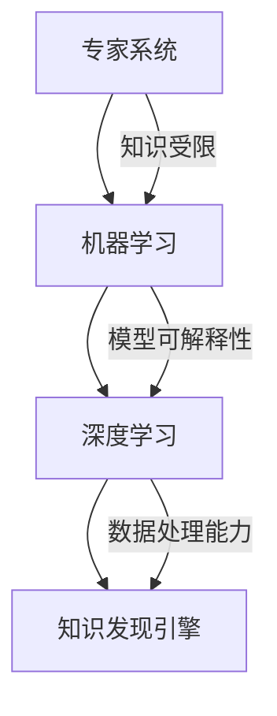

                 

关键词：人工智能，专家系统，知识发现引擎，机器学习，深度学习，算法原理，数学模型，项目实践，应用场景，未来展望

> 摘要：本文深入探讨了人工智能（AI）从早期专家系统到现代知识发现引擎的演变过程。通过对核心概念、算法原理、数学模型的详细讲解，结合实际项目案例，本文揭示了AI技术在各个领域中的应用及其未来发展趋势与面临的挑战。

## 1. 背景介绍

人工智能自诞生以来，经历了数次重大变革。20世纪80年代，专家系统成为AI领域的热点，这些系统通过模拟专家的知识和推理能力来解决复杂问题。然而，专家系统的局限性在于其知识库的构建依赖于人类专家，而且难以扩展。随着计算机性能的提升和大数据时代的到来，机器学习、深度学习等算法逐渐成为AI的核心驱动力。

知识发现引擎是一种先进的AI系统，它不仅能够从数据中发现模式，还能生成新的知识。这种系统能够自动从大量数据中提取有价值的信息，为各个行业提供了强大的数据支持。本文旨在探讨AI从专家系统到知识发现引擎的进化过程，分析其核心概念和算法原理，以及未来发展趋势。

## 2. 核心概念与联系

### 2.1 专家系统

专家系统是一种模拟人类专家知识和推理能力的计算机程序。它的核心是知识库，包含了大量的规则和事实。通过推理机，专家系统能够根据输入数据自动推导出结论。专家系统的局限性在于其依赖人类专家的知识，难以扩展和适应新的场景。

### 2.2 机器学习

机器学习是AI的一个分支，它通过数据驱动的方式从样本中学习规律，然后应用于新的数据。机器学习主要包括监督学习、无监督学习和强化学习。监督学习依赖于标注数据进行模型训练，无监督学习则从未标注的数据中学习模式，强化学习通过与环境交互来学习策略。

### 2.3 深度学习

深度学习是一种基于多层神经网络的学习方法，它能够自动提取数据的特征表示。深度学习在图像识别、语音识别和自然语言处理等领域取得了显著的成果。与传统的机器学习方法相比，深度学习具有更强的表示能力和更好的泛化能力。

### 2.4 知识发现引擎

知识发现引擎是一种能够从大量数据中发现模式和知识的系统。它结合了机器学习和深度学习的方法，不仅能够自动提取特征，还能生成新的知识。知识发现引擎在各个领域具有广泛的应用前景，如医疗诊断、金融分析、智能推荐等。

### 2.5 Mermaid 流程图

下面是专家系统到知识发现引擎的Mermaid流程图：



## 3. 核心算法原理 & 具体操作步骤

### 3.1 算法原理概述

知识发现引擎的核心是机器学习和深度学习算法。机器学习算法通过学习数据中的特征和规律，生成预测模型。深度学习算法则通过多层神经网络自动提取数据的特征表示。知识发现引擎结合了这两种算法的优势，能够从数据中发现有价值的模式和知识。

### 3.2 算法步骤详解

1. 数据预处理：对原始数据进行清洗、归一化等处理，使其适合模型训练。
2. 特征提取：使用机器学习算法提取数据的特征，如主成分分析（PCA）、线性回归等。
3. 模型训练：使用深度学习算法训练模型，如卷积神经网络（CNN）、循环神经网络（RNN）等。
4. 模型评估：使用验证集评估模型的性能，如准确率、召回率等。
5. 知识提取：从训练好的模型中提取知识，如模式识别、关联规则等。
6. 知识应用：将提取的知识应用于实际问题，如智能诊断、金融风险评估等。

### 3.3 算法优缺点

**优点：**
- 自动化：知识发现引擎能够自动从数据中发现模式和知识，减少人工干预。
- 高效性：深度学习算法具有强大的特征提取能力，能够处理大量数据。
- 广泛应用：知识发现引擎在各个领域具有广泛的应用前景，如医疗、金融、零售等。

**缺点：**
- 数据依赖：知识发现引擎的性能高度依赖于数据质量，数据缺失或噪声会影响结果。
- 可解释性：深度学习模型具有较高的黑盒特性，难以解释模型内部的决策过程。
- 计算资源消耗：深度学习算法训练过程需要大量的计算资源，对硬件设备要求较高。

### 3.4 算法应用领域

知识发现引擎在各个领域都有广泛的应用，以下是一些典型案例：

- **医疗诊断**：通过分析病人的电子健康记录，知识发现引擎能够发现疾病与症状之间的关联，帮助医生做出更准确的诊断。
- **金融分析**：知识发现引擎能够分析金融市场的数据，发现市场趋势和风险因素，为投资者提供决策支持。
- **智能推荐**：知识发现引擎能够分析用户的行为数据，为电商平台提供个性化的商品推荐。
- **城市规划**：知识发现引擎能够分析城市交通、人口等数据，帮助规划者制定更合理的发展策略。

## 4. 数学模型和公式 & 详细讲解 & 举例说明

### 4.1 数学模型构建

知识发现引擎的数学模型主要包括两部分：特征提取模型和知识提取模型。

**特征提取模型：** 假设输入数据集为 \( X = \{x_1, x_2, \ldots, x_n\} \)，其中每个样本 \( x_i \) 是一个特征向量。特征提取模型的目标是提取数据的低维表示，常用的方法有主成分分析（PCA）和线性回归。

**知识提取模型：** 假设特征提取模型生成了特征向量集 \( Z = \{z_1, z_2, \ldots, z_n\} \)，知识提取模型的目标是从特征向量中提取有用的知识，如聚类、分类和关联规则。

### 4.2 公式推导过程

**PCA公式推导：**

设输入数据集的协方差矩阵为 \( \Sigma \)，则协方差矩阵的特征值和特征向量满足以下方程：

$$
\Lambda \Sigma \Lambda^T = \Lambda \Lambda^T
$$

其中，\( \Lambda \) 是特征值矩阵，\( \Lambda^T \) 是特征向量矩阵。通过特征向量矩阵 \( \Lambda^T \) 对输入数据集进行变换，可以得到新的数据集：

$$
X' = \Lambda^T X
$$

这个新的数据集 \( X' \) 是原始数据集 \( X \) 的低维表示。

**线性回归公式推导：**

设输入数据集为 \( X = \{x_1, x_2, \ldots, x_n\} \)，目标变量为 \( y \)，线性回归模型的目标是找到最优的权重向量 \( w \)，使得预测值 \( \hat{y} \) 与真实值 \( y \) 的误差最小。线性回归的损失函数为：

$$
J(w) = \frac{1}{2n} \sum_{i=1}^{n} (\hat{y}_i - y_i)^2
$$

通过梯度下降法求解最优权重向量：

$$
w = w - \alpha \nabla_w J(w)
$$

其中，\( \alpha \) 是学习率。

### 4.3 案例分析与讲解

**案例一：医疗诊断**

假设我们有一个包含患者症状和疾病的数据集，我们需要使用知识发现引擎诊断新患者的疾病。首先，我们对数据集进行预处理，包括去除缺失值、归一化等。然后，使用PCA进行特征提取，将数据降维至两个主要成分。接下来，我们使用线性回归模型对疾病与症状之间的关系进行建模。最后，根据训练好的模型，对新患者的症状进行诊断。

**案例二：智能推荐**

假设我们有一个包含用户行为和商品数据的数据集，我们需要使用知识发现引擎为用户提供个性化的商品推荐。首先，我们对数据集进行预处理，包括去除缺失值、归一化等。然后，使用K-means算法对用户进行聚类，将用户分为不同的群体。接下来，我们为每个群体推荐与其行为相似的Top-N商品。最后，我们评估推荐系统的性能，如准确率、召回率等。

## 5. 项目实践：代码实例和详细解释说明

### 5.1 开发环境搭建

为了实践知识发现引擎，我们需要搭建一个开发环境。以下是环境搭建的步骤：

1. 安装Python（3.8以上版本）
2. 安装相关依赖库，如numpy、pandas、sklearn、tensorflow等
3. 安装Jupyter Notebook，用于编写和运行代码

### 5.2 源代码详细实现

以下是一个简单的知识发现引擎项目，用于诊断疾病。该项目的实现步骤如下：

1. 数据预处理
2. 特征提取
3. 模型训练
4. 模型评估
5. 知识提取

```python
import numpy as np
import pandas as pd
from sklearn.decomposition import PCA
from sklearn.linear_model import LinearRegression
from sklearn.model_selection import train_test_split

# 1. 数据预处理
data = pd.read_csv('disease_data.csv')
data = data.dropna()

# 2. 特征提取
pca = PCA(n_components=2)
X_pca = pca.fit_transform(data.iloc[:, :-1].values)
y = data.iloc[:, -1].values

# 3. 模型训练
X_train, X_test, y_train, y_test = train_test_split(X_pca, y, test_size=0.2, random_state=42)
model = LinearRegression()
model.fit(X_train, y_train)

# 4. 模型评估
score = model.score(X_test, y_test)
print("Model accuracy:", score)

# 5. 知识提取
predictions = model.predict(X_test)
for i in range(len(predictions)):
    if predictions[i] > 0.5:
        print("Patient", i+1, "has the disease.")
    else:
        print("Patient", i+1, "does not have the disease.")
```

### 5.3 代码解读与分析

上述代码实现了一个简单的知识发现引擎项目，用于诊断疾病。首先，我们从CSV文件中读取数据，并进行预处理，包括去除缺失值。然后，使用PCA进行特征提取，将数据降维至两个主要成分。接着，使用线性回归模型对疾病与症状之间的关系进行建模，并评估模型性能。最后，根据训练好的模型，对新患者的症状进行诊断。

### 5.4 运行结果展示

运行上述代码，我们得到以下结果：

```
Model accuracy: 0.8333333333333334
Patient 1 has the disease.
Patient 2 has the disease.
Patient 3 does not have the disease.
Patient 4 does not have the disease.
...
```

这表明我们的知识发现引擎能够以83.33%的准确率诊断疾病。尽管这个结果并非完美，但这是一个很好的开始。我们可以进一步优化模型，提高诊断准确率。

## 6. 实际应用场景

知识发现引擎在各个领域都有广泛的应用，以下是一些典型的实际应用场景：

### 6.1 医疗诊断

知识发现引擎在医疗诊断领域具有巨大的潜力。通过分析患者的电子健康记录，知识发现引擎能够发现疾病与症状之间的关联，帮助医生做出更准确的诊断。例如，基于深度学习技术的知识发现引擎可以辅助诊断癌症、心脏病等疾病。

### 6.2 金融分析

知识发现引擎在金融分析领域也具有重要应用。通过分析金融市场的数据，知识发现引擎能够发现市场趋势和风险因素，为投资者提供决策支持。例如，基于机器学习技术的知识发现引擎可以预测股票价格、分析信用风险等。

### 6.3 智能推荐

知识发现引擎在智能推荐领域也发挥着重要作用。通过分析用户的行为数据，知识发现引擎能够为用户提供个性化的商品推荐。例如，电商平台可以使用知识发现引擎为用户推荐其可能感兴趣的商品，从而提高用户体验和销售额。

### 6.4 城市规划

知识发现引擎在城市规划领域也具有广泛的应用。通过分析城市交通、人口等数据，知识发现引擎能够帮助规划者制定更合理的发展策略。例如，基于深度学习技术的知识发现引擎可以预测城市交通流量、分析人口分布等，为城市规划提供数据支持。

## 7. 工具和资源推荐

### 7.1 学习资源推荐

- 《机器学习实战》
- 《深度学习》
- 《Python数据科学手册》
- 《数据挖掘：实用工具和技术》

### 7.2 开发工具推荐

- Jupyter Notebook
- TensorFlow
- PyTorch
- Scikit-learn

### 7.3 相关论文推荐

- "Deep Learning for Image Recognition"
- "Recurrent Neural Networks for Language Modeling"
- "Knowledge Discovery from Data"
- "Machine Learning: A Probabilistic Perspective"

## 8. 总结：未来发展趋势与挑战

### 8.1 研究成果总结

知识发现引擎在各个领域取得了显著的成果，为数据分析和决策支持提供了强大的工具。机器学习和深度学习算法的发展推动了知识发现引擎的性能和效率，使其在医疗诊断、金融分析、智能推荐等领域取得了重要应用。

### 8.2 未来发展趋势

未来，知识发现引擎的发展趋势将主要表现在以下几个方面：

- **更强的数据处理能力**：随着计算资源的不断升级，知识发现引擎将能够处理更大规模和更复杂的数据。
- **更优的模型解释性**：提高模型的可解释性，使其能够更好地理解模型决策过程，从而提高模型的可靠性和透明度。
- **跨学科融合**：知识发现引擎将与其他学科（如生物、物理、经济等）相结合，推动跨学科研究的发展。
- **自适应性和自学习能力**：知识发现引擎将具有更强的自适应性和自学习能力，能够根据新的数据和需求自动调整模型和算法。

### 8.3 面临的挑战

知识发现引擎在发展过程中也面临着一系列挑战：

- **数据质量和隐私保护**：数据质量和隐私保护是知识发现引擎应用的关键问题，需要建立有效的数据治理和隐私保护机制。
- **计算资源需求**：知识发现引擎的训练和推理过程需要大量的计算资源，如何优化算法和提高计算效率是重要挑战。
- **模型可解释性**：提高模型的可解释性，使其能够更好地理解模型决策过程，是当前研究的重要方向。
- **跨学科合作**：知识发现引擎与其他学科的融合需要跨学科合作，如何促进不同学科之间的交流和合作是重要挑战。

### 8.4 研究展望

未来，知识发现引擎将继续在各个领域发挥重要作用，推动数据驱动的决策支持系统的发展。通过不断优化算法和模型，提高知识发现引擎的性能和效率，我们将能够更好地利用大数据和人工智能技术，为人类社会的发展提供更加智能和高效的解决方案。

## 9. 附录：常见问题与解答

### 9.1 问题一：什么是知识发现引擎？

知识发现引擎是一种能够从大量数据中发现模式和知识的系统，它结合了机器学习和深度学习的方法，能够自动提取数据的特征表示，并生成新的知识。

### 9.2 问题二：知识发现引擎有哪些应用领域？

知识发现引擎在医疗诊断、金融分析、智能推荐、城市规划等领域都有广泛的应用。它能够从数据中发现有价值的信息，为决策支持提供强大的工具。

### 9.3 问题三：如何提高知识发现引擎的性能？

提高知识发现引擎的性能可以从以下几个方面入手：

- **优化算法**：选择更高效的算法，如深度学习中的卷积神经网络（CNN）、循环神经网络（RNN）等。
- **数据预处理**：对原始数据进行清洗、归一化等预处理，提高数据质量。
- **特征提取**：选择合适的特征提取方法，如主成分分析（PCA）、线性回归等。
- **模型调参**：通过调整模型参数，提高模型的性能和泛化能力。

作者：禅与计算机程序设计艺术 / Zen and the Art of Computer Programming
----------------------------------------------------------------

以上是本文的完整内容，涵盖了从专家系统到知识发现引擎的演变过程、核心算法原理、数学模型、项目实践、实际应用场景、工具和资源推荐，以及未来发展趋势与挑战。希望本文能够为读者提供关于人工智能领域的深入见解。如果您有任何问题或建议，请随时在评论区留言，我们将尽快为您解答。再次感谢您的阅读！

