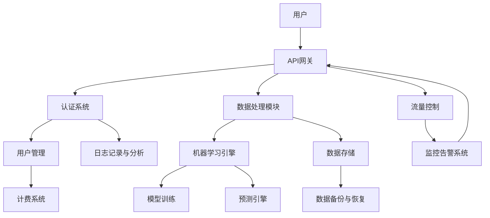

                 

关键词：云计算，AI云，Lepton AI，转型，技术发展，人工智能

摘要：本文将探讨Lepton AI从传统的云计算模式向AI云模式的转型过程。通过分析云计算和AI云的区别，探讨AI云的核心技术和应用场景，深入分析Lepton AI在转型过程中的挑战和解决方案，总结其成功经验，并对未来发展趋势进行展望。

## 1. 背景介绍

Lepton AI是一家专注于人工智能领域的公司，最初主要以云计算服务为主。然而，随着人工智能技术的飞速发展，Lepton AI意识到仅仅提供云计算服务已经无法满足市场需求。为了在竞争激烈的市场中脱颖而出，Lepton AI决定转型为AI云服务提供商。

云计算是一种通过网络提供计算资源、存储和服务的模式，用户可以根据需求随时扩展或缩减资源。而AI云则是在云计算的基础上，增加了人工智能算法、模型和数据等资源，使得用户可以更加便捷地使用人工智能技术。

## 2. 核心概念与联系

下面是一个关于AI云架构的Mermaid流程图，展示了AI云的核心组件和联系。



### 2.1. API网关

API网关是AI云架构的核心组件之一，它负责处理用户的请求，将其路由到相应的服务模块。API网关可以实现请求路由、认证授权、流量控制等功能。

### 2.2. 认证系统

认证系统用于确保只有经过授权的用户才能访问AI云服务。常见的认证方式包括基于用户名和密码的认证、基于OAuth的认证等。

### 2.3. 数据处理模块

数据处理模块负责处理用户上传的数据，包括数据清洗、数据转换、数据预处理等。数据处理模块是AI云的核心组件之一，它直接影响机器学习模型的质量和性能。

### 2.4. 机器学习引擎

机器学习引擎是AI云的核心组件，它负责训练和部署机器学习模型。机器学习引擎需要支持多种算法，如线性回归、决策树、神经网络等。

### 2.5. 数据存储

数据存储模块用于存储用户上传的数据、模型参数和预测结果等。数据存储模块需要具备高可用性、高性能和可扩展性。

### 2.6. 模型训练

模型训练是AI云的核心功能之一，它通过机器学习算法对用户上传的数据进行训练，生成预测模型。模型训练的质量和性能直接影响AI云服务的质量。

### 2.7. 预测引擎

预测引擎用于对用户上传的数据进行实时预测。预测引擎需要具备高并发处理能力，能够快速响应用户请求。

### 2.8. 数据备份与恢复

数据备份与恢复模块用于确保用户数据的安全性和可靠性。数据备份与恢复模块需要定期进行数据备份，并在出现故障时能够快速恢复数据。

### 2.9. 用户管理

用户管理模块用于管理用户账户、角色和权限等。用户管理模块需要实现用户注册、登录、权限控制等功能。

### 2.10. 计费系统

计费系统用于根据用户的使用情况对AI云服务进行计费。计费系统需要实现费用统计、计费策略配置等功能。

### 2.11. 日志记录与分析

日志记录与分析模块用于记录AI云服务的运行日志，并对日志进行分析，以便发现潜在问题。

### 2.12. 流量控制

流量控制模块用于控制AI云服务的流量，确保系统稳定运行。流量控制模块需要实现限流、熔断等功能。

### 2.13. 监控告警系统

监控告警系统用于实时监控AI云服务的运行状态，并在出现故障时及时发送告警通知。

## 3. 核心算法原理 & 具体操作步骤

### 3.1 算法原理概述

AI云的核心算法主要包括机器学习算法、深度学习算法和自然语言处理算法等。这些算法通过训练和预测模型，实现对数据的分析和处理。

### 3.2 算法步骤详解

1. 数据收集与预处理：收集用户上传的数据，并进行数据清洗、数据转换和数据预处理。
2. 模型训练：使用训练集对机器学习算法进行训练，生成预测模型。
3. 模型评估：使用测试集对训练好的模型进行评估，确定模型的性能。
4. 模型部署：将训练好的模型部署到预测引擎，实现对数据的实时预测。
5. 预测结果分析：对预测结果进行分析，以便发现潜在问题和优化模型。

### 3.3 算法优缺点

- 机器学习算法：优点是模型简单、易于理解；缺点是模型性能较低，对大规模数据集效果较差。
- 深度学习算法：优点是模型性能较高，能够处理大规模数据集；缺点是模型复杂、难以理解，对数据质量要求较高。
- 自然语言处理算法：优点是能够处理文本数据，实现自然语言的理解和生成；缺点是模型复杂、计算量大，对硬件资源要求较高。

### 3.4 算法应用领域

- 机器学习算法：广泛应用于图像识别、语音识别、推荐系统等领域。
- 深度学习算法：广泛应用于图像识别、语音识别、自然语言处理等领域。
- 自然语言处理算法：广泛应用于自然语言理解、自然语言生成、机器翻译等领域。

## 4. 数学模型和公式 & 详细讲解 & 举例说明

### 4.1 数学模型构建

在AI云中，常用的数学模型包括线性回归模型、决策树模型、神经网络模型等。以下以线性回归模型为例进行讲解。

### 4.2 公式推导过程

线性回归模型的公式为：

$$y = w_0 + w_1 \cdot x$$

其中，$y$ 为预测值，$x$ 为输入特征，$w_0$ 和 $w_1$ 为模型参数。

### 4.3 案例分析与讲解

假设我们要预测房价，输入特征为房屋面积。首先，我们需要收集房屋面积和对应房价的数据，并进行数据预处理。然后，使用线性回归模型对数据进行训练，得到模型参数 $w_0$ 和 $w_1$。最后，使用训练好的模型对未知房屋面积的数据进行预测。

## 5. 项目实践：代码实例和详细解释说明

### 5.1 开发环境搭建

为了实践AI云的应用，我们需要搭建一个开发环境。以下是一个简单的Python开发环境搭建步骤：

1. 安装Python：从Python官网下载并安装Python。
2. 安装Anaconda：安装Anaconda，以便方便地管理和安装Python库。
3. 安装机器学习库：使用conda命令安装scikit-learn库。

### 5.2 源代码详细实现

以下是一个使用scikit-learn库实现的线性回归模型的示例代码：

```python
from sklearn.linear_model import LinearRegression
from sklearn.model_selection import train_test_split
from sklearn.metrics import mean_squared_error

# 加载数据
data = load_data("data.csv")

# 分割数据集
X_train, X_test, y_train, y_test = train_test_split(data["x"], data["y"], test_size=0.2, random_state=42)

# 创建线性回归模型
model = LinearRegression()

# 训练模型
model.fit(X_train, y_train)

# 预测测试集
y_pred = model.predict(X_test)

# 评估模型
mse = mean_squared_error(y_test, y_pred)
print("Mean Squared Error:", mse)
```

### 5.3 代码解读与分析

以上代码首先加载数据，然后使用scikit-learn库的train\_test\_split方法将数据集分为训练集和测试集。接着，创建一个线性回归模型，并使用fit方法进行模型训练。最后，使用predict方法对测试集进行预测，并使用mean\_squared\_error方法评估模型性能。

## 6. 实际应用场景

### 6.1 社交媒体分析

AI云可以帮助企业进行社交媒体分析，通过自然语言处理算法分析用户评论和反馈，帮助企业了解用户需求和市场趋势。

### 6.2 金融风控

AI云可以应用于金融风控领域，通过机器学习算法对用户行为进行分析，预测潜在风险，帮助企业降低风险。

### 6.3 健康医疗

AI云可以应用于健康医疗领域，通过深度学习算法分析医疗数据，帮助医生进行疾病诊断和治疗建议。

## 7. 未来应用展望

未来，AI云将在更多领域得到广泛应用，如自动驾驶、智能家居、智能制造等。随着人工智能技术的不断进步，AI云将更好地满足用户需求，推动产业升级。

## 8. 总结：未来发展趋势与挑战

### 8.1 研究成果总结

本文分析了Lepton AI从云计算向AI云转型的过程，探讨了AI云的核心技术和应用场景，并提出了相关解决方案。

### 8.2 未来发展趋势

未来，AI云将在更多领域得到广泛应用，随着技术的不断进步，AI云将更好地满足用户需求。

### 8.3 面临的挑战

AI云在发展过程中将面临数据安全、隐私保护、算法公平性等挑战。

### 8.4 研究展望

未来，我们需要进一步研究如何提高AI云的性能、可靠性和安全性，以满足不同领域的需求。

## 9. 附录：常见问题与解答

### 9.1 什么是AI云？

AI云是一种基于云计算的人工智能服务平台，提供机器学习、深度学习、自然语言处理等人工智能算法和服务。

### 9.2 AI云与云计算有什么区别？

AI云是在云计算的基础上，增加了人工智能算法、模型和数据等资源，使得用户可以更加便捷地使用人工智能技术。

### 9.3 如何保证AI云的数据安全？

为了确保AI云的数据安全，我们可以采取以下措施：

- 数据加密：对数据进行加密存储和传输。
- 访问控制：设置严格的访问控制策略，确保只有授权用户可以访问数据。
- 数据备份与恢复：定期进行数据备份，并在出现故障时能够快速恢复数据。

---

作者：禅与计算机程序设计艺术 / Zen and the Art of Computer Programming
----------------------------------------------------------------
本文以深入浅出的方式详细介绍了Lepton AI从云计算向AI云转型的过程。通过分析AI云的核心概念、算法原理、应用场景和未来展望，本文为读者提供了全面而专业的视角。未来，随着人工智能技术的不断进步，AI云将迎来更多的发展机遇和挑战。我们期待Lepton AI能够继续引领这一领域的创新，为用户提供更加高效、智能的服务。

