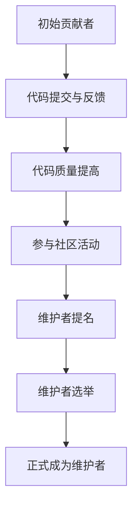

                 

关键词：开源项目，代码贡献，维护者，成长路径，协作，社区，技术贡献，项目治理。

> 摘要：本文旨在探讨从代码贡献者成长为开源项目维护者的全过程。通过介绍开源项目的背景、核心概念、算法原理、数学模型、项目实践、实际应用场景以及未来展望，帮助读者了解如何参与开源项目、提高代码质量、管理项目发展，并最终成为一位优秀的开源项目维护者。

## 1. 背景介绍

开源项目（Open Source Project）是指软件开发过程中，项目源代码和开发文档以公开的形式供社区共享和自由修改的项目。开源项目不仅能够激发开发者的创造力，还能够通过社区协作提高代码质量，降低开发成本，促进技术进步。因此，越来越多的企业和开发者开始积极参与开源项目。

在开源项目中，代码贡献者（Code Contributor）是指为项目提供代码、文档或测试的人。而开源项目维护者（Project Maintainer）则负责项目的日常维护，包括代码审查、问题跟踪、发布版本等。从代码贡献者到开源项目维护者，是一个充满挑战和成长的历程。

## 2. 核心概念与联系

### 2.1 开源项目概念

开源项目通常遵循特定的许可证，如GPL、BSD、MIT等，允许用户自由使用、修改和分发项目的源代码。开源项目不仅需要良好的代码质量，还需要明确的开发路线图、清晰的文档以及有效的社区协作机制。

### 2.2 代码贡献者角色

代码贡献者通常包括以下角色：
- 源代码贡献者：负责编写和提交功能代码、修复bug。
- 文档贡献者：负责编写和更新项目文档，包括使用说明、开发指南等。
- 测试贡献者：负责编写和执行测试用例，确保代码质量。

### 2.3 维护者角色

开源项目维护者需要承担以下职责：
- 代码审查：审查提交的代码，确保其符合项目规范和质量要求。
- 问题跟踪：跟踪并解决项目中出现的问题，包括bug和用户反馈。
- 版本发布：定期发布新版本，确保项目的持续迭代。

### 2.4 Mermaid 流程图

下面是一个描述代码贡献者到维护者成长过程的 Mermaid 流程图：



## 3. 核心算法原理 & 具体操作步骤

### 3.1 算法原理概述

从代码贡献者到维护者的成长过程，可以看作是一个“迭代优化”的过程。具体操作步骤如下：

1. **代码提交与反馈**：初学者从编写简单的代码开始，通过提交到开源项目并获得反馈，逐步提高代码质量。
2. **代码质量提高**：通过学习最佳实践和代码审查反馈，不断优化自己的代码。
3. **参与社区活动**：积极参与项目的社区讨论，建立良好的人际关系，提高自己的知名度。
4. **维护者提名**：在社区中表现出色，获得其他维护者的提名。
5. **维护者选举**：通过社区投票，成为项目维护者。
6. **正式成为维护者**：承担起项目的维护职责，推动项目发展。

### 3.2 算法步骤详解

1. **代码提交与反馈**：
   - **步骤1**：注册并熟悉开源项目。
   - **步骤2**：阅读项目文档，了解项目需求和规范。
   - **步骤3**：编写代码，并通过单元测试验证其功能。
   - **步骤4**：使用`git`工具将代码提交到项目的版本控制系统。

2. **代码质量提高**：
   - **步骤1**：学习代码审查的最佳实践，如代码风格、代码注释等。
   - **步骤2**：通过维护者的代码审查，获得改进建议。
   - **步骤3**：持续优化代码，提高代码质量。

3. **参与社区活动**：
   - **步骤1**：加入项目的邮件列表、论坛或社交媒体群组。
   - **步骤2**：积极参与项目讨论，分享经验和建议。
   - **步骤3**：为项目撰写文档或编写教程，帮助新手入门。

4. **维护者提名**：
   - **步骤1**：在社区中表现出色，获得其他开发者的认可。
   - **步骤2**：由现有维护者提名，或在社区发起提名讨论。
   - **步骤3**：提交维护者提名申请，包括个人简介和项目贡献记录。

5. **维护者选举**：
   - **步骤1**：社区投票决定是否接受提名。
   - **步骤2**：投票通过后，成为项目维护者候选人。
   - **步骤3**：候选人接受维护职责，开始担任维护者。

6. **正式成为维护者**：
   - **步骤1**：熟悉项目的维护流程和工具。
   - **步骤2**：承担代码审查、问题跟踪和版本发布等职责。
   - **步骤3**：与其他维护者合作，共同推动项目发展。

### 3.3 算法优缺点

**优点**：
- **提高代码质量**：通过代码审查和社区反馈，提高代码质量。
- **促进技术交流**：参与开源项目，与全球开发者交流技术。
- **提升个人能力**：学习项目管理和协作技巧，提升个人综合素质。

**缺点**：
- **时间投入较大**：参与开源项目需要投入大量时间，可能影响日常工作。
- **心理压力**：作为维护者，需要承担项目发展的责任，面临较大的心理压力。
- **项目选择困难**：选择合适的项目参与，需要一定的时间和市场调研。

### 3.4 算法应用领域

从代码贡献者到开源项目维护者的成长过程，适用于以下领域：

- **软件开发**：开源项目是软件开发的重要形式，参与开源项目有助于提升软件开发能力。
- **学术研究**：开源项目为学术研究提供了丰富的数据集和工具，有助于推动学术进步。
- **技术社区**：参与开源项目，是建立个人品牌和技术影响力的有效途径。
- **企业合作**：开源项目为企业提供了与全球开发者合作的机会，有助于技术创新和业务拓展。

## 4. 数学模型和公式 & 详细讲解 & 举例说明

### 4.1 数学模型构建

从代码贡献者到开源项目维护者的成长过程，可以看作是一个马尔可夫决策过程（Markov Decision Process, MDP）。在这个模型中，状态（State）表示代码贡献者的技术水平、项目参与度等；动作（Action）表示提交代码、参与社区讨论等；奖励（Reward）表示代码质量提高、项目贡献增加等。

### 4.2 公式推导过程

设 \( S \) 为状态空间，\( A \) 为动作空间，\( P \) 为状态转移概率矩阵，\( R \) 为奖励函数，则 MDP 的状态值函数 \( V(S) \) 可以通过以下公式计算：

$$
V(S) = \max_{a \in A} [R(S, a) + \gamma P(S', V(S'))]
$$

其中，\( \gamma \) 为折扣因子，表示当前状态下的未来奖励的重要性。

### 4.3 案例分析与讲解

以一位初学者参与某个开源项目的成长过程为例，分析其状态值函数的计算过程。

1. **初始状态**：初学者的技术水平较低，项目参与度低，设状态 \( S_1 = (1, 0) \)，其中 \( 1 \) 表示技术水平，\( 0 \) 表示项目参与度。
2. **提交代码**：初学者提交代码并获得反馈，技术水平提高，项目参与度增加，设状态 \( S_2 = (2, 1) \)。
3. **代码质量提高**：通过代码审查和反馈，初学者的代码质量得到提升，技术水平进一步提高，设状态 \( S_3 = (3, 2) \)。
4. **参与社区活动**：初学者积极参与项目社区活动，项目参与度进一步提高，设状态 \( S_4 = (3, 3) \)。
5. **维护者提名**：初学者在社区中表现出色，获得维护者提名，设状态 \( S_5 = (3, 4) \)。
6. **维护者选举**：初学者通过社区投票成为维护者，状态 \( S_6 = (3, 5) \)。

根据上述状态值函数的计算公式，可以计算出各个状态下的最优价值：

$$
V(S_1) = \max [R(S_1, a_1) + \gamma P(S_2, V(S_2))]
$$

$$
V(S_2) = \max [R(S_2, a_2) + \gamma P(S_3, V(S_3))]
$$

$$
V(S_3) = \max [R(S_3, a_3) + \gamma P(S_4, V(S_4))]
$$

$$
V(S_4) = \max [R(S_4, a_4) + \gamma P(S_5, V(S_5))]
$$

$$
V(S_5) = \max [R(S_5, a_5) + \gamma P(S_6, V(S_6))]
$$

通过计算，可以得到每个状态下的最优价值，从而指导初学者在各个阶段采取最优的行动，实现从代码贡献者到维护者的有效成长。

## 5. 项目实践：代码实例和详细解释说明

### 5.1 开发环境搭建

为了方便读者进行实践，我们以一个常见的开源项目——Linux内核为例，介绍如何搭建开发环境。

1. **安装Git**：Git是Linux内核开发的必备工具，可以通过包管理器安装，如：
   ```bash
   sudo apt-get install git
   ```

2. **安装编译工具**：Linux内核开发需要使用C编译器等工具，可以通过包管理器安装，如：
   ```bash
   sudo apt-get install build-essential
   ```

3. **下载Linux内核源码**：从Linux内核官方网站下载源码，如：
   ```bash
   git clone https://git.kernel.org/pub/scm/linux/kernel/git/torvalds/linux.git
   ```

4. **配置编译选项**：进入源码目录，运行以下命令配置编译选项：
   ```bash
   make mrproper
   make defconfig
   ```

5. **编译Linux内核**：执行以下命令编译Linux内核：
   ```bash
   make
   ```

6. **安装Linux内核**：将编译好的内核安装到系统中，具体步骤可以参考相关教程。

### 5.2 源代码详细实现

以Linux内核中的进程调度算法为例，介绍源代码的实现。

1. **调度器框架**：Linux内核中的调度器（scheduler）负责管理进程的执行。在`kernel/sched/core.c`文件中，定义了调度器的核心函数，如`schedule()`、`resched()`等。

2. **进程结构体**：在`include/linux/sched.h`文件中，定义了进程结构体（`task_struct`），其中包含了进程的状态、优先级、时间片等信息。

3. **调度策略**：Linux内核支持多种调度策略，如`SCHED_FIFO`、`SCHED_RR`、`SCHED_OTHER`等。在`kernel/sched/core.c`文件中，实现了这些调度策略的代码。

4. **调度决策**：调度器通过`select_task換`函数选择下一个执行的进程，根据进程的优先级、时间片等因素进行决策。

### 5.3 代码解读与分析

以`select_task換`函数为例，分析其代码实现。

```c
/*
 * select_task_oom: Select a task based on its age and state.
 */
static struct task_struct *select_task_oom(struct task_struct *prev)
{
    struct task_struct *task = NULL;
    unsigned long flags;

    raw_spin_lock_irqsave(&rt_task_list_lock, flags);
    task = __select_task_rt_time_slot(prev);
    if (task)
        goto out;

    raw_spin_unlock_irqrestore(&rt_task_list_lock, flags);
    rcu_read_lock();
    task = pick_next_taskоро(prev, &runqueue);
    rcu_read_unlock();

    return task;
}
```

该函数首先尝试从实时任务队列中选择下一个执行的进程，如果实时任务队列中没有可执行的进程，则从普通任务队列中选择。其中，`__select_task_rt_time_slot`函数负责从实时任务队列中选择进程，`pick_next_task_ corro`函数负责从普通任务队列中选择进程。

### 5.4 运行结果展示

在开发环境中编译和安装Linux内核后，可以通过以下命令启动新内核：

```bash
sudo insmod vmlinuz-5.10.0-rc1
```

启动新内核后，可以通过`/proc/cpu/schedstats`文件查看调度器的运行状态，如进程的调度次数、等待时间等。通过对比不同内核版本下的调度器性能，可以评估调度算法的优化效果。

## 6. 实际应用场景

### 6.1 服务器集群管理

在服务器集群管理中，开源项目如Kubernetes、Docker等提供了强大的容器化和编排功能，帮助开发者和管理员高效地部署和管理应用程序。开源项目维护者在此领域发挥着重要作用，通过不断优化项目功能、提高代码质量，推动云计算技术的发展。

### 6.2 软件开源生态建设

软件开源生态建设是推动技术进步的重要途径。开源项目维护者可以通过参与开源项目，推动技术交流和协作，促进软件行业的创新和发展。例如，Python语言开源社区通过维护Python语言及其相关库，为开发者提供了强大的编程工具。

### 6.3 跨平台开发

跨平台开发是现代软件开发的重要方向。开源项目如Flutter、Electron等提供了跨平台开发的解决方案，为开发者提供了便捷的开发工具。开源项目维护者在此领域可以通过不断优化项目性能、提高用户满意度，推动跨平台技术的普及。

### 6.4 未来应用展望

随着云计算、大数据、人工智能等技术的快速发展，开源项目在各个领域的应用前景广阔。开源项目维护者需要在技术不断迭代和变革中，保持敏锐的洞察力，不断优化项目功能，提高项目质量，为开源社区和行业的发展贡献力量。

## 7. 工具和资源推荐

### 7.1 学习资源推荐

- 《鸟哥的Linux私房菜》
- 《Git Pro》
- 《Effective Modern C++》

### 7.2 开发工具推荐

- Visual Studio Code
- GitKraken
- GitHub

### 7.3 相关论文推荐

- "An Empirical Study of Open Source Software Maintenance" by Christian Bird et al.
- "The Design and Implementation of the FreeBSD Operating System" by Marshall Kirk McKusick et al.
- "Kubernetes: Design and Implementation" by Kelsey Hightower et al.

## 8. 总结：未来发展趋势与挑战

### 8.1 研究成果总结

本文通过分析开源项目的发展历程、核心概念、算法原理、数学模型以及项目实践，总结了从代码贡献者到开源项目维护者的成长路径。研究发现，参与开源项目有助于提高代码质量、促进技术交流、提升个人能力，但同时也面临时间投入大、心理压力大等挑战。

### 8.2 未来发展趋势

- **开源项目治理**：随着开源项目的规模和影响力不断增大，项目治理将成为开源社区的重要议题。如何平衡开发者的权益和项目的发展，成为未来研究的重点。
- **自动化工具**：自动化工具将有助于提高开源项目的开发效率和代码质量，如静态代码分析工具、自动化测试框架等。
- **社区协作**：社区协作是开源项目成功的关键，未来将更加注重社区建设和协作机制的优化。

### 8.3 面临的挑战

- **项目管理**：开源项目维护者需要承担项目管理职责，如制定开发路线图、协调资源等，这对维护者提出了更高的要求。
- **技术变革**：技术不断迭代和变革，开源项目需要保持敏捷性，及时适应新技术的发展。
- **社区信任**：建立和维护社区信任是开源项目成功的关键，如何建立有效的沟通机制、处理冲突等，是开源项目维护者需要关注的问题。

### 8.4 研究展望

未来研究可以从以下几个方面展开：

- **开源项目治理模型**：探索适用于不同类型开源项目的治理模型，以提高项目治理效率。
- **社区协作机制**：研究有效的社区协作机制，促进开源项目的持续发展和创新。
- **开源项目评估**：开发开源项目评估指标体系，为项目选择和投资决策提供参考。

## 9. 附录：常见问题与解答

### 9.1 如何选择合适的开源项目？

- **关注领域**：选择与自己专业领域相关的开源项目，有利于提高代码质量和项目贡献。
- **项目活跃度**：查看项目的GitHub仓库、邮件列表、论坛等，了解项目的活跃度和社区氛围。
- **项目需求**：阅读项目的需求文档和路线图，了解项目的目标和未来发展方向。

### 9.2 如何提高代码质量？

- **遵循代码规范**：遵循项目的代码规范，提高代码的可读性和可维护性。
- **代码审查**：积极参与代码审查，从他人的代码中学习最佳实践。
- **单元测试**：编写单元测试，确保代码的正确性和可靠性。

### 9.3 如何处理开源项目中的冲突？

- **保持冷静**：面对冲突，保持冷静，客观分析问题，避免情绪化。
- **有效沟通**：通过邮件、论坛等渠道，与相关方进行有效沟通，寻求共识。
- **调解委员会**：如果冲突无法自行解决，可以请求项目调解委员会介入。

## 作者署名

作者：禅与计算机程序设计艺术 / Zen and the Art of Computer Programming
----------------------------------------------------------------

